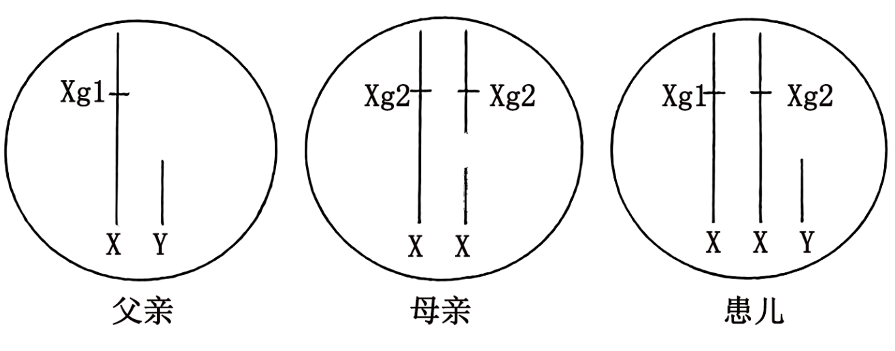
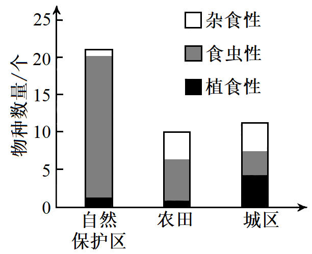
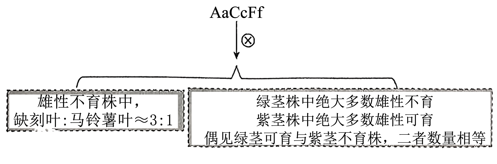
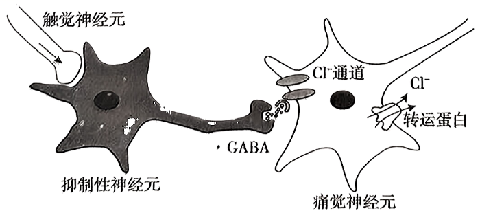
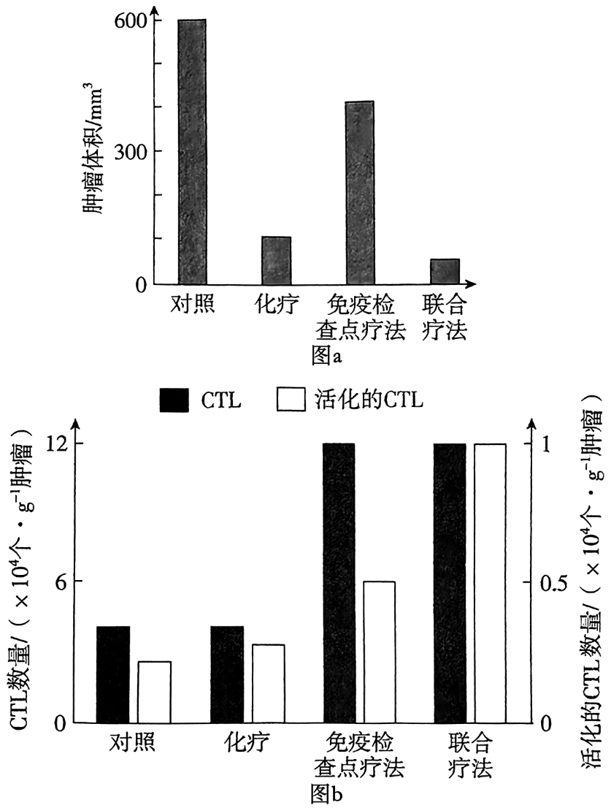
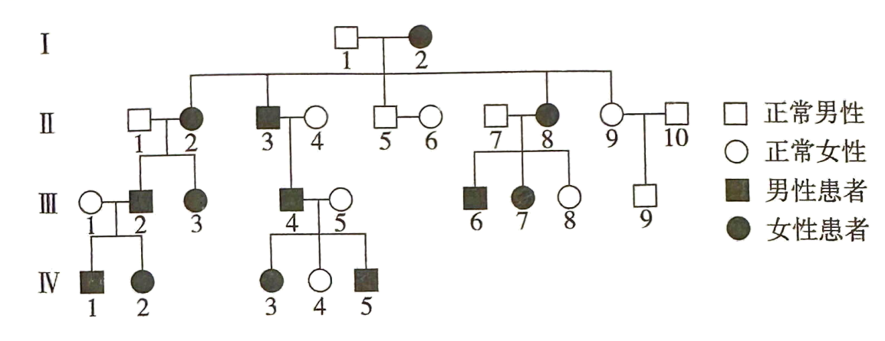
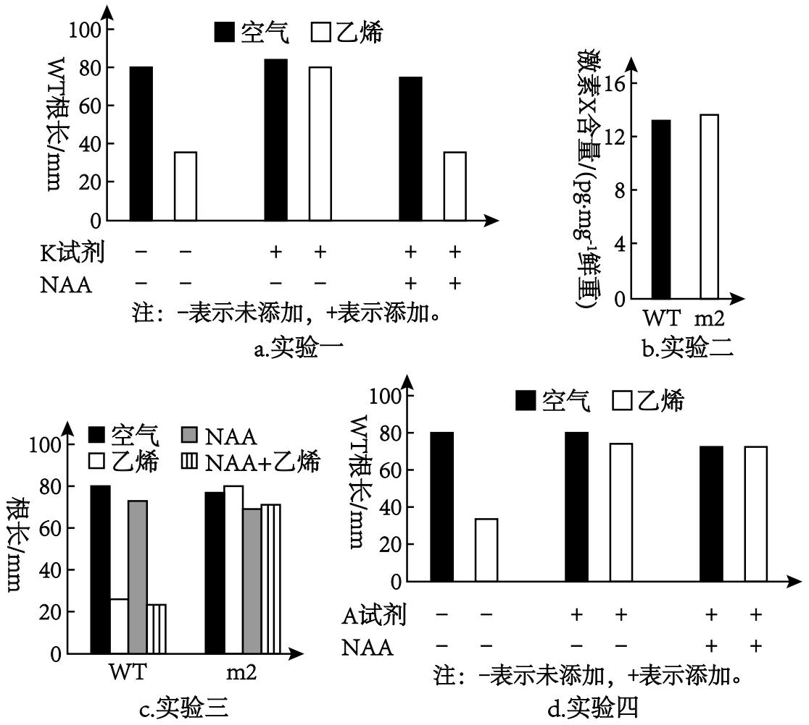
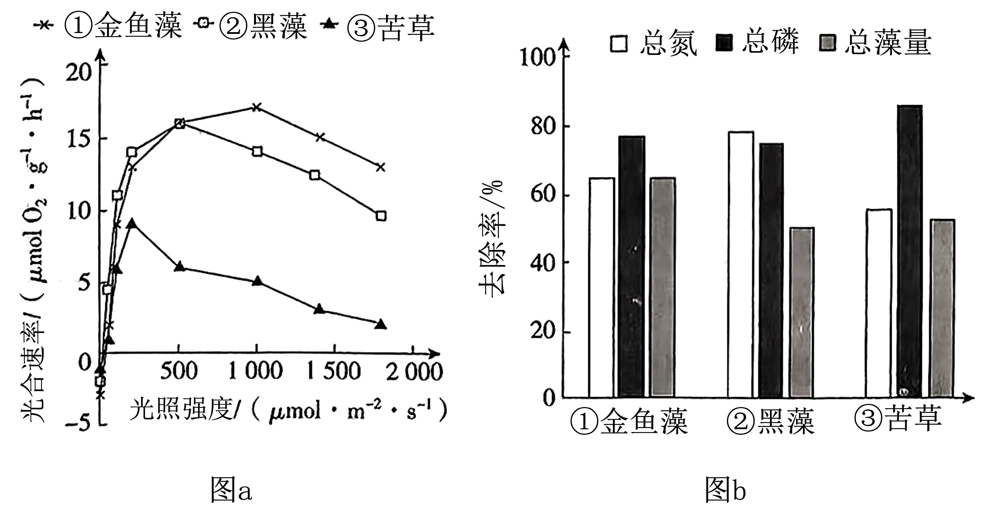
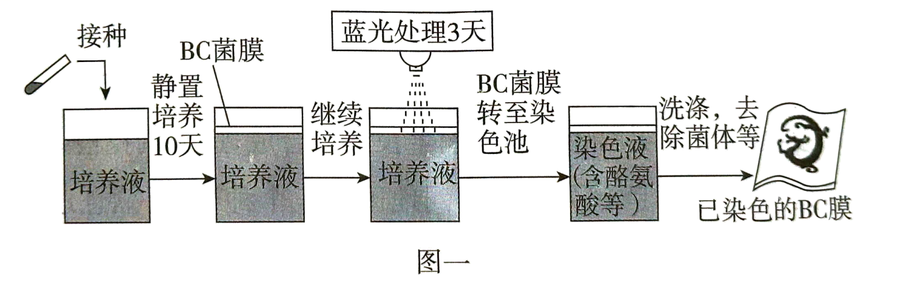
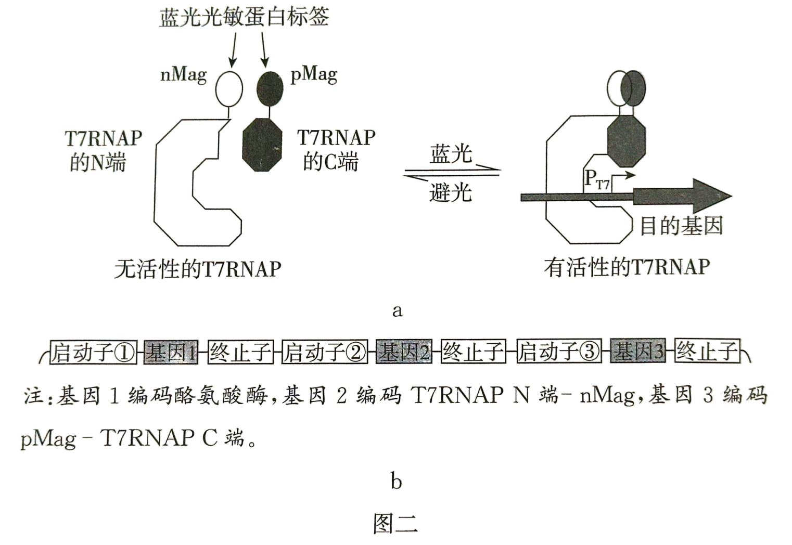

**2024年广东省普通高中学业水平选择性考试生物**

1\. “碳汇渔业”，又称“不投饵渔业”，是指充分发挥生物碳汇功能，通过收获水产品直接或间接减少CO2的渔业生产活动，是我国实现“双碳”目标、践行“大食物观”的举措之一。下列生产活动属于“碳汇渔业”的是（ ）

A. 开发海洋牧场，发展深海渔业

B. 建设大坝鱼道，保障鱼类洄游

C. 控制无序捕捞，实施长江禁渔

D. 增加饵料投放，提高渔业产量

【答案】A

【解析】

【分析】碳汇渔业定义：按照碳汇和碳源的定义以及海洋生物固碳的特点，碳汇渔业就是指通过渔业生产活动促进水生生物吸收水体中的二氧化碳，并通过收获把这些碳移出水体的过程和机制，也被称为“可移出的碳汇”。碳汇渔业就是能够充分发挥碳汇功能，直接或间接吸收并储存水体中的CO2，降低大气中的CO2浓度，进而减缓水体酸度和气候变暖的渔业生产活动的泛称。

【详解】A、开发海洋牧场，发展深海渔业可获取水产品且不需要投饵，属于“碳汇渔业”，A符合题意；

BC、建设大坝鱼道，保障鱼类洄游、控制无序捕捞，实施长江禁渔，均没有收获水产品，不属于“碳汇渔业”，BC不符合题意；

D、增加饵料投放，不符合“不投饵渔业”，不属于“碳汇渔业”，D不符合题意。

故选A。

2\. 2019年，我国科考队在太平洋马里亚纳海沟采集到一种蓝细菌，其细胞内存在由两层膜组成的片层结构，此结构可进行光合作用与呼吸作用。在该结构中，下列物质存在的可能性最小的是（　　）

A. ATP B. NADP+ C. NADH D. DNA

【答案】D

【解析】

【分析】蓝细菌属于原核生物，含有藻蓝素和叶绿素，能进行光合作用。

【详解】由题干信息可知，采集到蓝细菌其细胞内存在由两层膜组成的片层结构，此结构可进行光合作用与呼吸作用，进行光合作用时，光反应阶段可以将ADP和Pi转化为ATP，NADP+和H+转化为NADPH，用于暗反应，有氧呼吸的第一阶段和第二阶段都可以生成NADH，而DNA存在于蓝细菌的拟核中，D正确，ABC错误。

故选D。

3\. 银杏是我国特有的珍稀植物，其叶片变黄后极具观赏价值。某同学用纸层析法探究银杏绿叶和黄叶的色素差别，下列实验操作正确的是（　　）

A. 选择新鲜程度不同的叶片混合研磨

B. 研磨时用水补充损失的提取液

C. 将两组滤纸条置于同一烧杯中层析

D. 用过的层析液直接倒入下水道

【答案】C

【解析】

【分析】叶绿体色素提取的原理：叶绿体中的色素能够溶解在有机溶剂； 色素分离原理：叶绿体中的色素在层析液中的溶解度不同，溶解度高的随层析液在滤纸上扩散得快，溶解度低的随层析液在滤纸上扩散得慢。

【详解】A、本实验目的是用纸层析法探究银杏绿叶和黄叶的色素差别，选择新鲜程度不同的叶片分开研磨，A错误；

B、色素溶于有机溶剂，提取液为无水乙醇，光合色素不溶于水，B错误；

C、由于滤纸条不会相互影响，层析液从成分相同，两组滤纸条可以置于同一个烧杯中层析，C正确；

D、用过的层析液含有石油醚、丙酮和苯，不能直接倒入下水道，D错误。

故选C。

4\. 关于技术进步与科学发现之间的促进关系，下列叙述正确的是（　　）

A. 电子显微镜的发明促进细胞学说的提出

B. 差速离心法的应用促进对细胞器的认识

C. 光合作用的解析促进花期控制技术的成熟

D. RNA聚合酶的发现促进PCR技术的发明

【答案】B

【解析】

【分析】差速离心法可以通过不同的离心速度将细胞内大小、密度不同的细胞器分离开来，使得科学家能够单独对各种细胞器进行研究和分析，从而极大地促进了对细胞器的结构、功能等方面的认识。像线粒体、叶绿体、内质网等细胞器的详细研究，都得益于差速离心法的应用。

【详解】A、电子显微镜的发明是在细胞学说提出之后，细胞学说的提出主要基于光学显微镜的观察和研究，A 错误；

B、差速离心法可以通过不同的离心速度将细胞内大小、密度不同的细胞器分离开来，促进对细胞器的认识，B正确；

C、 光合作用的解析主要是对植物的光合作用机制进行研究，而花期控制技术更多地涉及到植物激素、环境因素等方面的知识，光合作用的解析与花期控制技术的成熟关系不大，C 错误；

D、 PCR 技术的发明并非直接由于 RNA 聚合酶的发现，PCR 技术的关键在于热稳定的 DNA 聚合酶的应用，D 错误。

故选B。

5\. 研究发现，敲除某种兼性厌氧酵母（WT）sqr基因后获得的突变株△sqr中，线粒体出现碎片化现象，且数量减少。下列分析错误的是（　　）

A. 碎片化的线粒体无法正常进行有氧呼吸

B. 线粒体数量减少使△sqr的有氧呼吸减弱

C. 有氧条件下，WT 比△sqr的生长速度快

D. 无氧条件下，WT 比△sqr产生更多的ATP

【答案】D

【解析】

【分析】1、有氧呼吸的第一、二、三阶段的场所依次是细胞质基质、线粒体基质和线粒体内膜。有氧呼吸第一阶段是葡萄糖分解成丙酮酸和\[H\]，合成少量ATP；第二阶段是丙酮酸和水反应生成二氧化碳和\[H\]，合成少量ATP；第三阶段是氧气和\[H\]反应生成水，合成大量ATP。

2、无氧呼吸的场所是细胞质基质，无氧呼吸的第一阶段和有氧呼吸的第一阶段相同。无氧呼吸由于不同生物体中相关的酶不同，一般在大多数植物细胞和酵母菌中产生酒精和二氧化碳，在动物细胞和乳酸菌中产生乳酸。

【详解】A、有氧呼吸主要场所在线粒体，碎片化的线粒体无法正常进行有氧呼吸，A正确；

B、有氧呼吸第二、三阶段发生在线粒体，线粒体数量减少使△sqr的有氧呼吸减弱，B正确；

C、与△sqr相比，WT正常线粒体数量更多，有氧条件下，WT能获得更多的能量，生长速度比△sqr快，C正确；

D、无氧呼吸的场所在细胞质基质，与线粒体无关，所以无氧条件下WT产生ATP的量与△sqr相同，D错误。

故选D。

6\. 研究发现，耐力运动训练能促进老年小鼠大脑海马区神经发生，改善记忆功能。下列生命活动过程中，不直接涉及记忆功能改善的是 （　　）

A. 交感神经活动增加

B. 突触间信息传递增加

C. 新突触的建立增加

D. 新生神经元数量增加

【答案】A

【解析】

【分析】学习和记忆涉及脑内神经递质的作用以及某些种类蛋白质的合成。短时记忆可能与神经元之间即时的信息交流有关尤其是与大脑皮层下一个形状像海马的脑区有关。长时记忆可能与突触形态及功能的改变以及新突触的建立有关。关于学习和记忆更深层次的奥秘，仍然有待科学家进一步探索。

【详解】A、记忆是脑的高级功能，而交感神经活动占据优势，心跳加快，支气管扩张，不直接涉及记忆功能改善，A符合题意；

BCD、短时记忆可能与神经元之间即时的信息交流有关，尤其是与大脑皮层下一个形状像海马的脑区有关，长时记忆可能与突触形态及功能的改变以及新突触的建立有关，BCD不符合题意。

故选A。

7\. 某患者甲状腺激素分泌不足。经诊断，医生建议采用激素治疗。下列叙述错误的是（　　）

A. 若该患者血液TSH水平低于正常，可能是垂体功能异常

B. 若该患者血液TSH水平高于正常，可能是甲状腺功能异常

C. 甲状腺激素治疗可恢复患者甲状腺的分泌功能

D. 检测血液中相关激素水平可评估治疗效果

【答案】C

【解析】

【分析】甲状腺激素分泌的调节，是通过下丘脑— 垂体—甲状腺轴来进行的。当机体感受到寒冷等刺激时，相应的神经冲动传到下丘脑，下丘脑分泌TRH ； TRH运输到并作用于垂体，促使垂体分泌TSH ；TSH随血 液循环到达甲状腺，促使甲状腺增加甲状腺激素的合成和 分泌。当血液中的甲状腺激素含量增加到一定程度时，又 会抑制下丘脑和垂体分泌相关激素，进而使甲状腺激素的 分泌减少而不至于浓度过高。也就是说，在甲状腺激素分 泌的过程中，既存在分级调节，也存在反馈调节。

【详解】A、患者甲状腺激素分泌不足，甲状腺激素对下丘脑和垂体负反馈作用减弱，则TRH和TSH高于正常水平，而若该患者血液TSH水平低于正常，可能是垂体功能异常，A正确；

B、某患者甲状腺激素分泌不足，TSH应该高于正常；若该患者血液TSH水平高于正常，可能是甲状腺功能异常，可能是缺碘，B正确；

C、甲状腺激素治疗只能够提高血液中甲状腺激素的含量，不可恢复患者甲状腺的分泌功能，C错误；

D、采用激素治疗某患者甲状腺激素分泌不足，可检测血液中TRH、TSH等相关激素水平是否恢复到正常水平，从而评估治疗效果，D正确。

故选C。

8\. 松树受到松叶蜂幼虫攻击时，会释放植物信息素，吸引寄生蜂将卵产入松叶蜂幼虫体内，寄生蜂卵孵化后以松叶蜂幼虫为食。下列分析错误的是（　　）

A. 该过程中松树释放的信息应是化学信息

B. 3种生物凭借该信息相互联系形成食物链

C. 松树和寄生蜂的种间关系属于原始合作

D. 该信息有利于维持松林群落的平衡与稳定

【答案】B

【解析】

【分析】生态系统中的信息大致可以分为物理信息、化学信息、行为信息。生物在生命活动过程中，会产生一些可以传递信息的化学物质，如植物的生物碱，有机酸等代谢产物，以及动物的性外激素等，就是化学信息。生态系统中信息传递的作用：（1）有利于正常生命活动的进行；（2）有利于生物种群的繁衍；（3）调节生物的种间关系，以维持生态系统的稳定。

【详解】A、松树释放植物信息素吸引寄生蜂，植物信息素属于化学信息，A正确；

B、松叶蜂幼虫攻击松树不需要凭借该信息，B错误；

C、寄生蜂将卵产入松叶蜂幼虫体内，寄生蜂卵孵化后以松叶蜂幼虫为食，从而减少松树受到攻击，松树受到松叶蜂幼虫攻击时，会释放植物信息素，吸引寄生蜂将卵产入松叶蜂幼虫体内，两者相互合作，彼此也能分开，属于原始合作关系，C正确；

D、通过该信息的调节使得松鼠、松叶蜂、寄生蜂维持相对稳定，有利于维持松林群落的平衡与稳定，D正确。

故选B。

9\. 克氏综合征是一种性染色体异常疾病。某克氏综合征患儿及其父母的性染色体组成见图。Xg1和Xg2为X染色体上的等位基因。导致该患儿染色体异常最可能的原因是（　　）

A. 精母细胞减数分裂Ⅰ性染色体不分离

B. 精母细胞减数分裂Ⅱ性染色体不分

C. 卵母细胞减数分裂Ⅰ性染色体不分离

D. 卵母细胞减数分裂Ⅱ性染色体不分离

【答案】A

【解析】

【分析】染色体变异包括染色体结构变异和染色体数目变异。染色体结构变异包括缺失、重复、倒位和易位。

【详解】根据题图可知，父亲的基因型是XXg1Y，母亲的基因型是XXg2XXg2，患者的基因型是XXg1XXg2Y，故父亲产生的异常精子的基因型是XXg1Y，原因是同源染色体在减数分裂Ⅰ后期没有分离，A正确。

故选A。

10\. 研究发现，短暂地抑制果蝇幼虫中PcG 蛋白（具有组蛋白修饰功能）合成，会启动原癌基因zfhl的表达，导致肿瘤形成。驱动此肿瘤形成的原因属于（　　）

A. 基因突变

B. 染色体变异

C. 基因重组

D. 表观遗传

【答案】D

【解析】

【分析】表观遗传是指DNA序列不发生变化，但基因的表达却发生了可遗传的改变，即基因型未发生变化而表现型却发生了改变。表观遗传现象普遍存在于生物体的生长、发育和衰老的整个生命活动过程中。

【详解】由题意可知，短暂地抑制果蝇幼虫中PcG 蛋白（具有组蛋白修饰功能）的合成，会启动原癌基因zfhl的表达，导致肿瘤形成，即基因型未发生变化而表现型却发生了改变，因此驱动此肿瘤形成的原因属于表观遗传，ABC错误、D正确。

故选D。

11\. EDAR 基因的一个碱基替换与东亚人有更多汗腺等典型体征有关。用M、m分别表示突变前后的EDAR 基因，研究发现，m的频率从末次盛冰期后开始明显升高。下列推测合理的是（　　）

A. m的出现是自然选择的结果

B. m不存在于现代非洲和欧洲人群中

C. m的频率升高是末次盛冰期后环境选择的结果

D. MM、Mm和mm个体的汗腺密度依次下降

【答案】C

【解析】

【分析】1、现代进化理论的基本内容是：①进化是以种群为基本单位，进化的实质是种群的基因频率的改变。②突变和基因重组产生进化的原材料。③自然选择决定生物进化的方向。④隔离导致物种形成。⑤协同进化导致生物多样性的形成。

2、DNA分子中发生碱基的替换、增添或缺失，而引起的基因基因碱基序列的改变，叫作基因突变。基因突变是产生新基因的途径。对生物界的种族繁衍和进化来说，产生了新基因的生物有可能更好地适应环境的变化，开辟新的生存空间，从而出现新的生物类型。因此，基因突变是生物变异的很本来源，为生物的进化提供了丰富的原材料。

【详解】A、根据题意，EDAR 基因的一个碱基替换导致M突变为m，因此m的出现是基因突变的结果，A不符合题意；

B、根据题意，EDAR 基因的一个碱基替换与东亚人有更多汗腺等典型体征有关，因此无法判断m是否存在于现代非洲和欧洲人群中，B不符合题意；

C、自然选择导致基因频率发生定向改变，根据题意，m的频率从末次盛冰期后开始明显升高，因此m的频率升高是末次盛冰期后环境选择的结果，C符合题意；

D、根据题意，m的频率从末次盛冰期后开始明显升高，末次盛冰期后气温逐渐升高，m基因频率升高，M基因频率降低，因此推测MM、Mm和mm个体的汗腺密度依次上升，D不符合题意。

故选C。

12\. Janzen-Connel假说（詹曾-康奈尔假说）认为，某些植物母株周围会积累对自身有害的病原菌、昆虫等，从而抑制母株附近自身种子的萌发和幼苗的生长。下列现象中，不能用该假说合理解释的是（　　）

A. 亚热带常绿阔叶林中楠木幼苗距离母株越远，其密度越大

B. 鸟巢兰种子远离母株萌发时，缺少土壤共生菌，幼苗死亡

C. 中药材三七连续原地栽种，会暴发病虫害导致产量降低

D. 我国农业实践中采用的水旱轮作，可减少农药的使用量

【答案】B

【解析】

【分析】种内关系包括种内互助和种内斗争。种间关系包括种间竞争、捕食、互利共生、寄生和原始合作。

【详解】A、亚热带常绿阔叶林中楠木幼苗距离母株越远，其密度越大，说明幼苗距离母株越远，植物母株的抑制作用越弱，A符合题意；

B、鸟巢兰种子远离母株萌发时，缺少土壤共生菌，幼苗死亡，说明距离母株越远，植物母株的抑制作用越强，B不符合题意；

C、中药材三七连续原地栽种，会暴发病虫害导致产量降低，说明距离越近，抑制作用越显著，C符合题意；

D、我国农业实践中采用水旱轮作，可减少农药的使用量，说明水旱轮作可以抑制病虫害，D符合题意。

故选B。

13\. 为探究人类活动对鸟类食性及物种多样性的影响，研究者调查了某地的自然保护区、农田和城区3种生境中雀形目鸟类的物种数量（取样的方法和条件一致），结果见图。下列分析错误的是（　　）

A. 自然保护区的植被群落类型多样，鸟类物种丰富度高

B. 农田的鸟类比自然保护区鸟类的种间竞争更小

C. 自然保护区鸟类比其他生境的鸟类有更宽的空间生态位

D. 人类活动产生的空白生态位有利于杂食性鸟类迁入

【答案】C

【解析】

【分析】生态位：

1、概念：一个物种在群落中的地位或作用，包括所处的空间位置、占用资源的情况以及与其他物种的关系等。

2、研究内容：①动物：栖息地、食物、天敌以及与其他物种的关系等；②植物：在研究区域内的出现频率、种群密度、植株高度以及与其他物种的关系等。

3、特点：群落中每种生物都占据着相对稳定的生态位。

4、原因：群落中物种之间以及生物与环境间协同进化的结果。

5、意义：有利于不同生物充分利用环境资源。

【详解】A、由图可知，自然保护区的物种数量最大，其次是城区和农田，故说明自然保护区的植被群落类型多样，鸟类物种丰富度高，A正确；

B、由于农田中鸟类的物种数量少于自然保护区，故农田的鸟类比自然保护区鸟类的种间竞争更小，B正确；

C、由图可知，自然保护区食虫性和植食性鸟类占绝大多数，说明自然保护区的杂食性鸟类比其他生境的杂食性鸟类有更小的空间生态位，C错误；

D、农田和城市人类活动频繁，杂食性鸟类占比明显大于自然保护区，故说明人类活动产生的空白生态位有利于杂食性鸟类迁入，D正确。

故选C。

14\. 雄性不育对遗传育种有重要价值。为获得以茎的颜色或叶片形状为标记的雄性不育番茄材料，研究者用基因型为 AaCcFf的番茄植株自交，所得子代的部分结果见图。其中，控制紫茎（A）与绿茎（a）、缺刻叶（C）与马铃薯叶（c）的两对基因独立遗传，雄性可育（F）与雄性不育（f）为另一对相对性状，3对性状均为完全显隐性关系。下列分析正确的是（　　）

A. 育种实践中缺刻叶可以作为雄性不育材料筛选标记

B. 子代的雄性可育株中，缺刻叶与马铃薯叶的比例约为1：1

C. 子代中紫茎雄性可育株与绿茎雄性不育株的比例约为3：1

D. 出现等量绿茎可育株与紫茎不育株是基因突变的结果

【答案】C

【解析】

【分析】根据绿茎株中绝大多数雄性不育，紫茎株中绝大多数雄性可育，可推测控制绿茎(a)和雄性不育(f)的基因位于同一条染色体，控制紫茎(A)和雄性可育(F)的基因位于同一条染色体；控制紫茎（A）与绿茎（a）、缺刻叶（C）与马铃薯叶（c）的两对基因独立遗传，因此，控制缺刻叶(C)与马铃薯叶(c)的基因位于另一对同源染色体上。因为子代中偶见绿茎可育株与紫茎不育株，且两者数量相等，可推测是减数第一次分裂前期同源染色体非姐妹染色单体发生了互换。

【详解】A、根据绿茎株中绝大多数雄性不育，紫茎株中绝大多数雄性可育，可推测绿茎(a)和雄性不育(f)位于同一条染色体，紫茎(A)和雄性可育(F)位于同一条染色体，由子代雄性不育株中，缺刻叶：马铃薯叶≈3：1可知，缺刻叶(C)与马铃薯叶(c)位于另一对同源染色体上。因此绿茎可以作为雄性不育材料筛选的标记，A错误；

B、控制缺刻叶（C）、马铃薯叶（c）与控制雄性可育（F）、雄性不育（f）的两对基因位于两对同源染色体上，因此，子代雄性可育株中，缺刻叶与马铃薯叶的比例也约为3：1，B错误；

C、由于基因A和基因F位于同一条染色体，基因a和基因f位于同一条染色体，子代中紫茎雄性可育株与绿茎雄性不育株的比例约为3：1，C正确；

D、出现等量绿茎可育株与紫茎不育株是减数第一次分裂前期同源染色体非姐妹染色单体互换的结果，D错误。

故选C。

15\. 现有一种天然多糖降解酶，其肽链由4段序列以Ce5-Ay3-Bi-CB方式连接而成。研究者将各段序列以不同方式构建新肽链，并评价其催化活性，部分结果见表。关于各段序列的生物学功能，下列分析错误的是（　　）

<table style="width:48%;">
<colgroup>
<col style="width: 17%" />
<col style="width: 7%" />
<col style="width: 8%" />
<col style="width: 7%" />
<col style="width: 7%" />
</colgroup>
<tbody>
<tr>
<td rowspan="2" style="text-align: left;">肽链</td>
<td colspan="2" style="text-align: left;">纤维素类底物</td>
<td colspan="2" style="text-align: left;">褐藻酸类底物</td>
</tr>
<tr>
<td style="text-align: left;">W1</td>
<td style="text-align: left;">W2</td>
<td style="text-align: left;">S1</td>
<td style="text-align: left;">S2</td>
</tr>
<tr>
<td style="text-align: left;">Ce5-Ay3-Bi-CB</td>
<td style="text-align: left;">+</td>
<td style="text-align: left;">+++</td>
<td style="text-align: left;">++</td>
<td style="text-align: left;">+++</td>
</tr>
<tr>
<td style="text-align: left;">Ce5</td>
<td style="text-align: left;">+</td>
<td style="text-align: left;">++</td>
<td style="text-align: left;">—</td>
<td style="text-align: left;">—</td>
</tr>
<tr>
<td style="text-align: left;">Ay3-Bi-CB</td>
<td style="text-align: left;">—</td>
<td style="text-align: left;">—</td>
<td style="text-align: left;">++</td>
<td style="text-align: left;">+++</td>
</tr>
<tr>
<td style="text-align: left;">Ay3</td>
<td style="text-align: left;">—</td>
<td style="text-align: left;">—</td>
<td style="text-align: left;">+++</td>
<td style="text-align: left;">++</td>
</tr>
<tr>
<td style="text-align: left;">Bi</td>
<td style="text-align: left;">—</td>
<td style="text-align: left;">—</td>
<td style="text-align: left;">—</td>
<td style="text-align: left;">—</td>
</tr>
<tr>
<td style="text-align: left;">CB</td>
<td style="text-align: left;">—</td>
<td style="text-align: left;">—</td>
<td style="text-align: left;">—</td>
<td style="text-align: left;">—</td>
</tr>
</tbody>
</table>

注：—表示无活性，+表示有活性，+越多表示活性越强。

A. Ay3与Ce5 催化功能不同，但可能存在相互影响

B. Bi无催化活性，但可判断与Ay3的催化专一性有关

C. 该酶对褐藻酸类底物的催化活性与Ce5无关

D. 无法判断该酶对纤维素类底物的催化活性是否与CB相关

【答案】B

【解析】

【分析】酶的特性为高效性、专一性、作用条件温和，作用机理为降低化学反应活化能。

【详解】A、由表可知，Ce5具有催化纤维素类底物的活性，Ay3具有催化褐藻酸类底物的活性，Ay3与Ce5催化功能不同，Ay3-Bi-CB与Ce5-Ay3-Bi-CB相比，当缺少Ce5后，就不能催化纤维素类底物，当Ay3与Ce5同时存在时催化纤维素类底物的活性增强，所以Ay3与Ce5 可能存在相互影响，A正确；

B、由表可知，不论是否与Bi结合，Ay3均可以催化S1与S2，说明Bi与Ay3的催化专一性无关，B错误；

C、由表可知，Ay3-Bi-CB与Ce5-Ay3-Bi-CB相比，去除Ce5后，催化褐藻酸类底物的活性不变，说明该酶对褐藻酸类底物的催化活性与Ce5无关，C正确；

D、需要检测Ce5-Ay3-Bi肽链的活性，才能判断该酶对纤维素类底物的催化活性是否与CB相关，D正确。

故选B。

16\. 轻微触碰时，兴奋经触觉神经元传向脊髓抑制性神经元，使其释放神经递质 GABA.正常情况下，GABA作用于痛觉神经元引起Cl-通道开放，Cl-内流，不产生痛觉；患带状疱疹后，痛觉神经元上Cl-转运蛋白（单向转运Cl-）表达量改变，引起Cl-的转运量改变，细胞内Cl-浓度升高，此时轻触引起GABA作用于痛觉神经元后，Cl-经Cl-通道外流，产生强烈痛觉。针对该过程（如图）的分析，错误的是（　　）

A. 触觉神经元兴奋时，在抑制性神经元上可记录到动作电位

B. 正常和患带状疱疹时，Cl-经Cl-通道的运输方式均为协助扩散

C. GABA作用的效果可以是抑制性的，也可以是兴奋性的

D. 患带状疱疹后Cl-转运蛋白增多，导致轻触产生痛觉

【答案】D

【解析】

【分析】静息时，神经细胞膜对钾离子的通透性大，钾离子大量外流，形成内负外正的静息电位；受到刺激后，神经细胞膜的通透性发生改变，对钠离子的通透性增大，钠离子大量内流，形成内正外负的动作电位。

【详解】A、触觉神经元兴奋时，会释放兴奋性神经递质作用于抑制性神经元，抑制性神经元兴奋，在抑制性神经元上可记录到动作电位，A正确；

B、离子通道进行的跨膜运输方式是协助扩散，故正常和患带状疱疹时，Cl-经Cl-通道的运输方式是协助扩散，B正确；

C、GABA作用于痛觉神经元引起Cl-通道开放，Cl-内流，此时GABA作用的效果可以是抑制性的；患带状疱疹后，Cl-经Cl-通道外流，相当于形成内正外负的动作电位，此时GABA作用的效果是兴奋性的，C正确；

D、据图可知，Cl-转运蛋白会将Cl-运出痛觉神经元，患带状疱疹后痛觉神经元上Cl-转运蛋白（单向转运Cl-）表达量改变，引起Cl-的转运量改变，细胞内Cl-浓度升高，说明运出细胞的Cl-减少，据此推测应是转运蛋白减少所致，D错误。

故选D。

17\. 某些肿瘤细胞表面的PD-L1与细胞毒性T细胞（CTL）表面的PD-1结合能抑制CTL的免疫活性，导致肿瘤免疫逃逸。免疫检查点疗法使用单克隆抗体阻断PD-Ll和PD-1的结合，可恢复CTL的活性，用于肿瘤治疗。为进一步提高疗效，研究者以黑色素瘤模型小鼠为材料，开展该疗法与化疗的联合治疗研究。部分结果见图。

回答下列问题：

（1）据图分析，\_\_\_\_\_\_\_\_疗法的治疗效果最佳，推测其原因是\_\_\_\_\_\_\_。

（2）黑色素瘤细胞能分泌吸引某类细胞靠近的细胞因子CXCL1.为使CTL响应此信号，可在CTL中导入\_\_\_\_\_\_\_\_\_\_\_\_\_\_\_\_\_\_\_基因后再将其回输小鼠体内，从而进一步提高治疗效果。该基因的表达产物应定位于CTL的\_\_\_\_\_\_\_\_（答位置）且基因导入后不影响CTL\_\_\_\_\_\_\_\_\_\_\_的能力。

（3）某兴趣小组基于现有抗体—药物偶联物的思路提出了两种药物设计方案。方案一：将化疗药物与PD-L1 单克隆抗体结合在一起。方案二：将化疗药物与PD-1单克隆抗体结合在一起。你认为方案\_\_\_\_\_\_\_（填“一”或“二”）可行，理由是\_\_\_\_\_\_\_\_\_\_。

【答案】（1） ①. 联合 ②. 该疗法既发挥了化疗药物的作用，也增加了活化的CTL数量

（2） ①. CXCL1受体 ②.  (细胞膜)表面 ③. 杀伤肿瘤细胞

（3） ①. 一 ②. 方案一的偶联物既可阻断PD-1与PD-L1 结合，恢复CTL的活性，又使化疗药物靶向肿瘤细胞

【解析】

【分析】根据题图可知，肿瘤细胞表面的PD-L1通过与T细胞表面的PD-1蛋白特异性结合，抑制T细胞增殖分化，从而逃避免疫系统的攻击。

【小问1详解】

由图a可知，联合疗法肿瘤体积最小，再根据图b可知，采用联合疗法时活化的CTL的数目明显高于免疫检查点疗法和化疗等，原因是该疗法既发挥了化疗药物的作用，也增加了活化的CTL数量。

【小问2详解】

由于黑色素瘤细胞能分泌吸引某类细胞靠近的细胞因子CXCL1，故要进一步提高治疗效果，可以在CTL中导入细胞因子CXCL1受体基因，使CTL表达出细胞因子CXCL1受体，达到治疗的效果。由于细胞因子是一类肽类化合物，故该基因的表达产物应定位于CTL的细胞膜上，且基因导入后不影响CTL杀伤肿瘤细胞的能力。

【小问3详解】

某肿瘤细胞表面的PD-L1与细胞毒性T细胞（CTL）表面的PD-1结合能抑制CTL的免疫活性，故应该将化疗药物与PD-L1 单克隆抗体结合在一起，即方案一的偶联物既可阻断PD-1与PD-L1 结合，恢复CTL的活性，又使化疗药物靶向肿瘤细胞。

18\. 遗传性牙龈纤维瘤病（HGF）是一种罕见的口腔遗传病，严重影响咀嚼、语音、美观及心理健康。2022年，我国科学家对某一典型的HGF家系（如图）进行了研究，发现ZNF862基因突变导致HGF发生。

回答下列问题：

（1）据图分析，HGF最可能的遗传方式是\_\_\_\_\_\_\_\_\_。假设该致病基因的频率为p，根据最可能的遗传方式，Ⅳ2生育一个患病子代的概率为\_\_\_\_\_\_\_（列出算式即可）。

（2）为探究ZNF862 基因的功能，以正常人牙龈成纤维细胞为材料设计实验，简要写出设计思路：\_\_\_\_\_\_\_。为从个体水平验证ZNF862基因突变导致HGF，可制备携带该突变的转基因小鼠，然后比较\_\_\_\_\_\_的差异。

（3）针对HGF这类遗传病，通过体细胞基因组编辑等技术可能达到治疗的目的。是否也可以通过对人类生殖细胞或胚胎进行基因组编辑来防治遗传病？作出判断并说明理由\_\_\_\_\_\_\_\_。

【答案】（1） ①. 常染色体显性遗传病 ②. （1+p）/2

（2） ①. 将正常细胞分为甲乙两组，其中甲组敲除ZNF862基因，观察甲乙两组细胞表型从而探究该基因的功能 ②. 转基因小鼠和正常小鼠牙龈

（3）不可以，违反法律和伦理，且存在安全隐患。

【解析】

【分析】人类遗传病分为单基因遗传病、多基因遗传病和染色体异常遗传病：

（1）单基因遗传病包括常染色体显性遗传病（如并指）、常染色体隐性遗传病（如白化病）、伴X染色体隐性遗传病（如血友病、色盲）、伴X染色体显性遗传病（如抗维生素D佝偻病）；

（2）多基因遗传病是由多对等位基因异常引起的，如青少年型糖尿病；

（3）染色体异常遗传病包括染色体结构异常遗传病（如猫叫综合征）和染色体数目异常遗传病（如21三体综合征）

【小问1详解】

由图可知，该病男女患者数量相当，且代代遗传，因此该病最可能的遗传方式为常染色体显性遗传病；假设该病由基因A/a控制，则致病基因A的基因频率为p，正常基因a的基因频率为1-p，Ⅳ2的基因型为Aa，产生配子基因型为1/2A和1/2a，正常人中基因型为AA的概率为p2，基因型为Aa的概率为2p（1-p），基因型为aa的概率为（1-p）2，Ⅳ2与AA生育患病子代的概率为p2，与Aa生育患病子代的概率为2p(1-p)×3/4，与aa生育患病子代的概率为（1-p）2×1/2，故Ⅳ2生育一个患病子代的概率为p2+2p(1-p)×3/4+（1-p）2×1/2=（1+p）/2。

【小问2详解】

从细胞水平分析，培养该细胞，敲除ZNF862基因，观察细胞表型等变化，通过比较含有该基因时的细胞表型从而探究该基因的功能，设计思路为：将正常细胞分为甲乙两组，其中甲组敲除ZNF862基因，观察甲乙两组细胞表型从而探究该基因的功能；从个体水平分析，通过比较转基因小鼠和正常小鼠牙龈差异可得出该基因的功能。

【小问3详解】

一般不通过对人类生殖细胞或胚胎进行基因组编辑来防治遗传，该方式违反法律和伦理，且存在安全隐患。

19\. 乙烯参与水稻幼苗根生长发育过程的调控。为研究其机理，我国科学家用乙烯处理萌发的水稻种子3天，观察到野生型（WT）幼苗根的伸长受到抑制，同时发现突变体m2，其根伸长不受乙烯影响；推测植物激素X参与乙烯抑制水稻幼苗根伸长的调控，设计并开展相关实验，其中K试剂抑制激素X的合成，A试剂抑制激素X受体的功能，部分结果见图。

回答下列问题：

（1）为验证该推测进行了实验一，结果表明，乙烯抑制WT根伸长需要植物激素X，推测X可能是\_\_\_\_。

（2）为进一步探究X如何参与乙烯对根伸长的调控，设计并开展了实验二、三和四。

①实验二的目的是检测m2的突变基因是否与\_\_\_\_\_\_有关。

②实验三中使用了可自由扩散进入细胞的 NAA，目的是利用NAA的生理效应，初步判断乙烯抑制根伸长是否与\_\_\_\_\_\_\_\_\_\_有关。若要进一步验证该结论并检验 m2 的突变基因是否与此有关，可检测\_\_\_\_\_的表达情况。

③实验四中有3组空气处理组，其中设置★所示组的目的是\_\_\_\_\_\_\_。

（3）分析上述结果，推测乙烯对水稻幼苗根伸长的抑制可能是通过影响\_\_\_\_\_\_\_\_实现的。

【答案】（1）生长素 （2） ①. 生长素合成 ②. 生长素运输 ③. 生长素载体蛋白基因 ④. 作为实验组检测A试剂和NAA是否影响根伸长；作为乙烯处理的对照组

（3）生长素信号转导（或生长素受体功能）

【解析】

【分析】植物激素是指植物体内一定部位产生，从产生部位运输到作用部位，对植物的生长发育有显著影响的微量有机物。植物激素主要包括生长素、赤霉素、细胞分裂素、脱落酸、乙烯。各种植物激素并不是孤立地起作用，而是多种植物激素共同调控植物的生长发育和对环境的适应。

【小问1详解】

由实验一结果分析，加入K试剂不加NAA组与加入K试剂和NAA组对比可发现，同时加入K试剂和NAA，乙烯可以抑制WT根伸长，由题干信息K试剂抑制激素X的合成，可推测NAA的作用效果和激素X类似，NAA是生长素类似物，所以推测激素X为生长素。

【小问2详解】

①实验二的因变量是激素X含量，所以实验二的目的是检测m2的突变基因是否与生长素合成有关。

②实验三野生型幼苗在乙烯、NAA+乙烯作用下根伸长均受抑制，而突变体m2幼苗在乙烯、NAA+乙烯作用下根长均正常，由实验二结果可知，野生型和突变体m2生长素含量大致一样，则初步判断乙烯抑制根伸长与生长素运输有关。若要进一步验证该结论并检验 m2 的突变基因是否与此有关，可检测生长素载体蛋白基因的表达情况。

③★所示组和其他空气处理组对比，可作为实验组检测A试剂和NAA是否影响根伸长；★所示组和同处理乙烯组对比，可作为乙烯处理的对照组。

【小问3详解】

分析上述结果，推测乙烯对水稻幼苗根伸长的抑制可能是通过影响生长素受体功能实现的。

20\. 某湖泊曾处于重度富营养化状态，水面漂浮着大量浮游藻类。管理部门通过控源、清淤、换水以及引种沉水植物等手段，成功实现了水体生态恢复。引种的3种多年生草本沉水植物（①金鱼藻、②黑藻、③苦草，答题时植物名称可用对应序号表示）在不同光照强度下光合速率及水质净化能力见图。

回答下列问题：

（1）湖水富营养化时，浮游藻类大量繁殖，水体透明度低，湖底光照不足。原有沉水植物因光合作用合成的有机物少于\_\_\_\_\_\_\_的有机物，最终衰退和消亡。

（2）生态恢复后，该湖泊形成了以上述3种草本沉水植物为优势的群落垂直结构，从湖底到水面依次是\_\_\_\_\_\_\_\_，其原因是\_\_\_\_\_\_\_。

（3）为了达到湖水净化的目的，选择引种上述3种草本沉水植物的理由是\_\_\_\_\_\_\_\_\_，三者配合能实现综合治理效果。

（4）上述3种草本沉水植物中只有黑藻具（C4光合作用途径（浓缩CO2形成高浓度（C4后，再分解成（CO2传递给C5）使其在CO2受限的水体中仍可有效地进行光合作用，在水生植物群落中竞争力较强。根据图a设计一个简单的实验方案，验证黑藻的碳浓缩优势，完成下列表格。

<table style="width:56%;">
<colgroup>
<col style="width: 11%" />
<col style="width: 44%" />
</colgroup>
<tbody>
<tr>
<td colspan="2" style="text-align: left;">实验设计方案</td>
</tr>
<tr>
<td style="text-align: left;">实验材料</td>
<td style="text-align: left;">对照组：_______ 实验组：黑藻</td>
</tr>
<tr>
<td rowspan="2" style="text-align: left;">实验条件</td>
<td style="text-align: left;">控制光照强度为_______μmol·m-2·s-1</td>
</tr>
<tr>
<td style="text-align: left;">营养及环境条件相同且适宜，培养时间相同</td>
</tr>
<tr>
<td style="text-align: left;">控制条件</td>
<td style="text-align: left;">__________</td>
</tr>
<tr>
<td style="text-align: left;">测量指标</td>
<td style="text-align: left;">__________</td>
</tr>
</tbody>
</table>

（5）目前在湖边浅水区种植的沉水植物因强光抑制造成生长不良，此外，大量沉水植物叶片凋落，需及时打捞，增加维护成本。针对这两个实际问题从生态学角度提出合理的解决措施\_\_\_\_\_\_。

【答案】（1）呼吸作用消耗

（2） ①. ③②① ②. 最大光合速率对应光强度依次升高

（3）①(金鱼藻)除藻率高，②(黑藻)除氮率高，③(苦草)除磷高

（4） ①. 金鱼藻 ②. 500 ③. 二氧化碳浓度较低且相同 ④. 氧气释放量

（5）合理引入浮水植物，减弱沉水植物的光照强度；合理引入以沉水植物凋落叶片为食物的生物

【解析】

【分析】图a分析，一定范围内光照强度增大，三种植物的光合速率加快，光照强度超过一定范围，三种植物的光合速率均减小。图b分析，金鱼藻、黑藻和苦草都能在一定程度上去除氮和磷、藻。

【小问1详解】

由于湖底光照不足，导致原有沉水植物因光合作用合成的有机物少于细胞呼吸消耗的有机物，生物量在减少，不足以维持生长，最终衰退和消亡。

【小问2详解】

据图分析，最大光合速率对应光强度依次升高，因此生态恢复后，该湖泊形成了以上述3种草本沉水植物为优势的群落垂直结构，从湖底到水面依次是③②①。

【小问3详解】

据图b分析，金鱼藻除藻率高，黑藻除氮率高，苦草除磷率高，三者配合能高效的去除氮、磷和藻，能实现综合治理效果。

【小问4详解】

本实验的实验目的是验证黑藻的碳浓缩优势，自变量是植物种类，即黑藻、金鱼藻，因此对照组是金鱼藻。无关变量应该保持相同且适宜，黑藻在光照强度为500μmol·m-2·s-1时光合速率最强，因此控制光照强度为500μmol·m-2·s-1。为的是验证碳浓缩优势，因此控制条件为低二氧化碳浓度。因变量是光合速率的快慢，因此检测指标是单位时间释放氧气的量。

【小问5详解】

目前的两个实际问题是湖边浅水区种植的沉水植物因强光抑制造成生长不良，大量沉水植物叶片凋落，需及时打捞，增加维护成本，因此可以合理引入浮水植物，减弱沉水植物的光照强度；合理引入以沉水植物凋落叶片为食物的生物。

21\. 驹形杆菌可合成细菌纤维素（BC）并将其分泌到胞外组装成膜。作为一种性能优异的生物材料，BC膜应用广泛。研究者设计了酪氨酸酶（可催化酪氨酸形成黑色素）的光控表达载体，将其转入驹形杆菌后构建出一株能合成BC膜并可实现光控染色的工程菌株，为新型纺织原料的绿色制造及印染工艺升级提供了新思路（图一）。

回答下列问题：

（1）研究者优化了培养基的\_\_\_\_\_\_\_（答两点）等营养条件，并控制环境条件，大规模培养工程菌株后可在气液界面处获得BC菌膜（菌体和 BC膜的复合物）。

（2）研究者利用T7 噬菌体来源的RNA聚合酶（T7RNAP）及蓝光光敏蛋白标签，构建了一种可被蓝光调控的基因表达载体（光控原理见图二a，载体的部分结构见图二b）。构建载体时，选用了通用型启动子 PBAD（被工程菌 RNA 聚合酶识别）和特异型启动子PT7（仅被T7RNAP识别）。为实现蓝光控制染色，启动子①②及③依次为\_\_\_\_\_\_\_\_，理由是\_\_\_\_\_\_\_\_\_\_\_。

（3）光控表达载体携带大观霉素（抗生素）抗性基因。长时间培养时在培养液中加入大观霉素，其作用为\_\_\_\_\_\_\_\_\_\_\_\_\_\_\_\_\_\_\_\_\_\_\_\_（答两点）。

（4）根据预设的图案用蓝光照射已长出的BC菌膜并继续培养一段时间，随后将其转至染色池处理，发现只有经蓝光照射的区域被染成黑色，其原因是\_\_\_\_\_。

（5）有企业希望生产其他颜色图案的BC膜。按照上述菌株的构建模式提出一个简单思路\_\_\_\_\_\_。

【答案】（1）碳源、氮源

（2） ①. PT7、PBAD 和PBAD ②. 基因2和3正常表达无活性产物，被蓝光激活后再启动基因1表达

（3）抑制杂菌；去除丢失质粒的菌株

（4）该处细胞中T7RNAP激活，酪氨酸酶表达并合成黑色素

（5）将酪氨酸酶替换成催化其他色素合成的酶(或将酪氨酸酶替换成不同颜色蛋白)

【解析】

【分析】基因工程技术的基本步骤：（1）目的基因的获取。（2）基因表达载体的构建：是基因工程的核心步骤，基因表达载体包括目的基因、启动子、终止子和标记基因等。（3）将目的基因导入受体细胞：根据受体细胞不同，导入的方法也不一样。将目的基因导入植物细胞的方法有农杆菌转化法、基因枪法和花粉管通道法；将目的基因导入动物细胞最有效的方法是显微注射法；将目的基因导入微生物细胞的方法是感受态细胞法。（4）目的基因的检测与鉴定。

【小问1详解】

培养基的营养物质包括水、无机盐、碳源、氮源等，研究者培养工程菌，需要优化培养基的碳源、氮源等营养条件，并控制环境条件。

【小问2详解】

题图二a分析可知，蓝光照射下，T7RNAP N端-nMag与T7RNAP C端结合，导致无活性的T7RNAP变成有活性的T7RNAP，结合图一，蓝光处理后，RNA聚合酶（T7RNAP）识别启动子①使基因1转录获得相应的mRNA，再以其为模板通过翻译过程获得酪氨酸酶，酪氨酸酶从而催化染色液中酪氨酸形成黑色素，可见基因2和3正常表达无活性产物，被蓝光激活后再启动基因1表达，综合上述分析可知，为实现蓝光控制染色，启动子①②及③依次为PT7、PBAD 和PBAD。

【小问3详解】

光控表达载体携带大观霉素（抗生素）抗性基因。长时间培养时在培养液中加入大观霉素，抗生素具有抑制杂菌；去除丢失质粒的菌株的作用。

【小问4详解】

由小问2分析可知，细胞中T7RNAP激活，酪氨酸酶表达并合成黑色素，故用蓝光照射已长出的BC菌膜并继续培养一段时间，随后将其转至染色池处理，发现只有经蓝光照射的区域被染成黑色。

【小问5详解】

由小问2分析可知，题干信息的设计思路最终BC膜被染成黑色，希望生产其他颜色图案的BC膜，则需要将酪氨酸酶替换成催化其他色素合成的酶(或将酪氨酸酶替换成不同颜色蛋白)。
