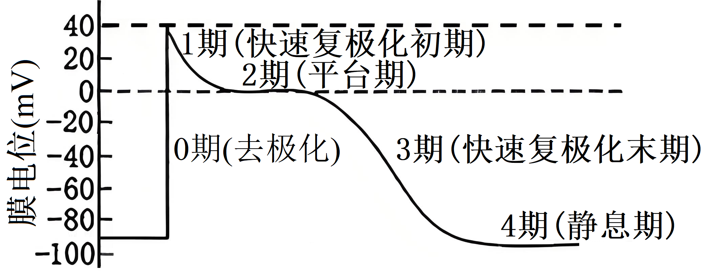
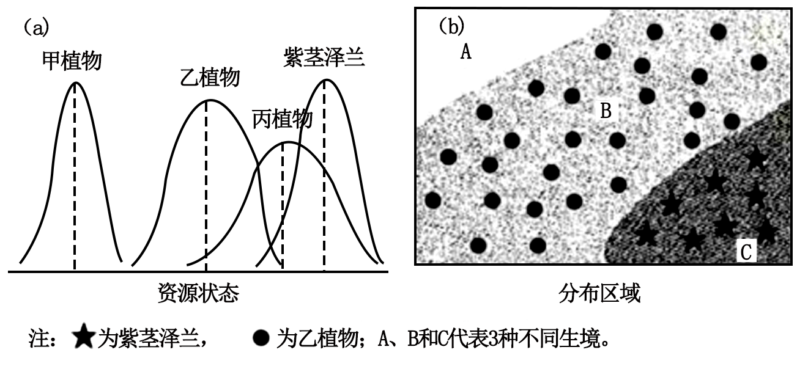

**2024年广西普通高中学业水平选择性考试（生物学科）**

1\. 唐诗“翠羽春禽满树喧”描绘了满树鸟儿欢快鸣叫的画面，其中“翠羽”指青翠的羽毛，“喧”指鸣叫。关于“翠羽”和“喧”在生态系统中的作用，说法错误的是（　　）

A. “翠羽”有利于种群繁衍 B. 两者皆可调节种间关系

C. “喧”可表示个体间联络 D. 两者皆属于化学信息

2\. 广西是我国甘蔗主产地。甘蔗一般采用无性繁殖，但会由于病毒积累而产量下降，可通过植物组织培养获得脱毒苗的方法来解决。关于该方法，下列说法错误的是（　　）

A. 可选用甘蔗的茎尖为外植体

B. 选用外植体需经高温灭菌处理

C. 一般采用加入琼脂的固体培养基

D. 脱毒苗的形成包括再分化过程

3\. “扬美豆豉”制作技艺属于广西非物质文化遗产，该技艺包括选豆、洗豆、煮豆、制曲、洗曲、调味和发酵等。下列说法错误的是（　　）

A. 煮豆可使蛋白质适度变性，易于被微生物利用

B. 制曲目的是促使有益微生物生长繁殖，并分泌多种酶

C. 调味时加入食盐，主要目的是促进微生物的生长繁殖

D. 发酵过程中，微生物将原料转化为特定代谢产物，使豆豉风味独特

4\. 研究发现真核生物基因组DNA普遍存在5-甲基胞嘧啶和N6-甲基腺嘌呤，分别被称为DNA第5、6个碱基。关于这两个碱基的说法，正确的是（　　）

A. 均含有N元素

B. 均含有脱氧核糖

C. 都排列在DNA骨架的外侧

D. 都不参与碱基互补配对

5\. 我国科研工作者利用病毒衣壳蛋白VP16作为纳米骨架，包裹大肠杆菌碱性磷酸酶，构建了高效、易调控的蛋白类纳米酶。关于该纳米酶的说法，错误的是（　　）

A. 催化效率受pH、温度影响

B. 可在细胞内发挥作用

C. 显著降低反应的活化能

D. 可催化肽键的断裂

6\. 百香果具有较高的经济价值，在广西多地种植，赋能乡村振兴。为探究促进百香果健壮枝条生根的最适2,4-D浓度，某兴趣小组提出实验方案，其中不合理的是（　　）

A. 设置清水组作为空白对照

B. 将2,4-D浓度作为自变量

C. 将枝条生根的数量及生根的长度作为因变量

D. 随机选择生长状况不同的枝条作为实验材料

7\. 我国科研人员研发了一种长效胰岛素制剂。当血糖浓度升高时，该制剂能迅速释放胰岛素，使血糖恢复正常，之后缓慢持续释放微量胰岛素，维持血糖稳定。关于该制剂的说法，错误的是（　　）

A. 参与维持血糖浓度的动态平衡

B. 适宜采用注射方式给药

C. 释放胰岛素受神经系统直接调控

D. 药效受机体内环境的影响

8\. 屠呦呦等科学家发现青蒿素，为全球疟疾治疗做出突出贡献。随着时间推移。发现疟原虫对单方青蒿素出现了一定抗药性，为了解决该问题，我国科学家继续研发出高效的青蒿素联合疗法并广泛应用。下列说法错误的是（　　）

A. 疟原虫出现抗药性，说明疟原虫种群在进化

B. 受单方青蒿素刺激，疟原虫产生了抗药性变异

C. 若一直使用单方青蒿素，疟原虫种群抗药性基因频率会上升

D. 青蒿素联合疗法，可以有效地杀灭感染人体的抗药性疟原虫

9\. 在某稳定的鱼塘生态系统中，食物网如图所示，其中鲈鱼为主要经济鱼类。下列说法错误的是（　　）

A. 该生态系统中，含有6条食物链

B. 该生态系统中，太阳鱼只属于第三营养级

C. 消除甲壳类会降低该生态系统的抵抗力稳定性

D. 消除捕食性双翅目幼虫，可以提高流入鲈鱼的能量

10\. 白头叶猴为广西特有的濒危保护动物。为了调查其种群数量，可采用“粪便DNA分析法”，主要步骤有：采集白头叶猴粪便，分析其中白头叶猴的微卫星DNA（能根据其差别来识别不同个体）等。关于“粪便DNA分析法”的叙述，错误的是（　　）

A 属于样方法，需随机划定样方采集粪便

B. 无需抓捕，避免对白头叶猴个体的伤害

C. 调查得到的种群数量，常小于真实数量

D. 宜采集新鲜粪便，以免其中DNA降解

11\. 水稻（2N=24）是我国主要粮食作物之一，研究发现水稻S1和S2基因与花粉正常发育相关。科研人员将野生型和双突变型（S1和S2基因突变）的花粉母细胞进行染色，观察得到如图的减数分裂Ⅰ过程。下列说法正确的是（　　）

A. 图（e）中出现明显的染色体，可知该时期是减数分裂Ⅰ后期

B. 水稻的1个花粉母细胞完成减数分裂，只产生1个子代细胞

C. 野生型水稻减数分裂Ⅰ过程，产生的子代细胞含有6条染色体

D. S1和S2基因可通过控制同源染色体的联会，进而影响花粉发育

12\. 科学家通过小鼠低蛋白饮食与正常饮食的对比实验，发现亲代的低蛋白饮食可影响自身基因表达（其机理如图），且这种影响可遗传给子代。据图分析，下列说法正确的是（　　）

A. 自身基因表达和表型发生变化的现象，称为表观遗传

B 组蛋白甲基化水平增加，将导致相关基因表达水平降低

C. ATF7的磷酸化，将导致组蛋白表观遗传修饰水平提高

D. 亲代的低蛋白饮食，会改变子代小鼠的DNA碱基序列

13\. 科研工作者以烟草悬浮细胞为材料，研究不同质量浓度的聚乙二醇（PEG）对细胞膜通透性的影响，结果如图所示。下列说法错误的是（　　）

A. 高浓度PEG使细胞活力显著下降

B. 随着PEG浓度增加，eATP和iATP总量持续增加

C. iATP相对水平越高，说明细胞膜的通透性越小

D. 在PEG胁迫下，eATP相对水平与iATP相对水平呈负相关

14\. 为了研究游客投喂对某森林公园内野生猕猴种群数量的影响，研究人员进行了跟踪调查，结果见图。下列关于游客投喂对猴群的影响，叙述错误的是（　　）

A. 使猴群的种群增长率一直增加

B. 降低了园区内猴群的环境阻力

C. 使猴群数量增加，可能导致外溢

D. 降低种群密度对猴群数量的制约作用

15\. 人体心室肌细胞内K+浓度高于胞外，Na+浓度低于胞外。心室肌细胞静息电位和动作电位的产生（如图），主要与K+和Na+的流动有关。图中0期为去极化：1、2和3期Na+通道关闭，同时K+外流；2期出现主要依赖K+和Ca2+的流动。下列说法错误的是（　　）

A. 静息电位主要由K+外流造成

B. 0期的产生依赖于Na+快速内流

C. 1期K+外流是通过主动运输进行

D. 2期的形成是K+外流和Ca2+内流导致

16\. 某种观赏花卉（两性花）有4种表型：紫色、大红色、浅红色和白色，由3对等位基因（A/a、B/b和D/d）共同决定，其中只要含有aa就表现白色，且Aa与另2对等位基因不在同一对同源染色体上。现有4个不同纯合品系甲、乙、丙和丁，它们之间的杂交情况（无突变、致死和染色体互换）见表。下列分析正确的是（　　）

|     |              |               |                                 |
|:--- |:------------ |:------------- |:------------------------------- |
| 组别  | 杂交组合         | F1 | F1自交，得到F2 |
| Ⅰ   | 甲（紫色）×乙（白色）  | 紫色            | 紫色:浅红色:白色≈9:3:4                 |
| Ⅱ   | 丙（大红色）×丁（白色） | 紫色            | 紫色:大红色:白色≈6:6:4                 |

A. B/b与D/d不在同一对同源染色体上，遵循自由组合定律

B. Ⅰ、Ⅱ组的F1个体，基因型分别是AaBBDd、AaBbDD

C. Ⅰ组产生的F2，其紫色个体中有6种基因型

D. Ⅱ组产生的F2，其白色个体中纯合子占1/2

**二、非选择题：本题共5小题，共60分。**

17\. β-地中海贫血是人11号染色体上β-珠蛋白基因HBB突变所造成的遗传病。如图为HBB几种常见的基因突变位点及功能区域示意图。回答下列问题：

注：-28A→C中，“-”表示转录起始位点前，数值表示碱基位点，A→C表示碱基A突变为C；仅标示了非模板链上的变化，模板链也发生对应变化，但没有标示出来。

（1）654C→T突变，\_\_\_\_\_\_（选填“会”或“不会”）增加该基因嘌呤碱基总数量。-28A→C突变，会导致β-珠蛋白的表达异常，其原因是\_\_\_\_\_\_。

（2）HBB在转录形成mRNA的过程中，细胞核内特定RNA复合物能特异性识别初级转录产物（mRNA前体），并将内含子对应区域剪切以及拼接外显子对应区域，这表明上述RNA复合物是一种\_\_\_\_\_\_。

（3）含有17A→T突变的HBB转录出的mRNA，对应位点的碱基是\_\_\_\_\_\_。

（4）某男性一条染色体上的HBB存在突变位点W，其配偶无W突变，他们生育的孩子\_\_\_\_\_\_（选填“一定”或“不一定”）存在该突变，从遗传概率角度分析，其原因是\_\_\_\_\_\_。为有效降低人群中β-地中海贫血的发病率，可以采取\_\_\_\_\_\_和\_\_\_\_\_\_等措施。

18\. 目前CAR-T细胞疗法在治疗血液恶性肿瘤方面具有较好效果。该疗法是在体外将特定DNA导入T细胞，获得CAR-T细胞，然后输入患者体内进行治疗。回答下列问题：

（1）T细胞在体内分化、发育和成熟的主要器官是\_\_\_\_\_\_。

（2）血液恶性肿瘤细胞表面存在特异性表达的CD19蛋白。为了使CAR-T细胞能识别肿瘤细胞，导入T细胞的DNA应能指导合成\_\_\_\_\_\_随后该合成产物镶嵌在\_\_\_\_\_\_上。

（3）识别患者体内肿瘤细胞后，CAR-T细胞受\_\_\_\_\_\_刺激并激活，最终增殖、分化为\_\_\_\_\_\_将肿瘤细胞杀灭，该过程属于\_\_\_\_\_\_免疫。

（4）CAR-T细胞输入患者前，要先清除患者体内的淋巴细胞，其目的是\_\_\_\_\_\_。

19\. 珊瑚是一类低等动物，可从环境中获取单细胞真核藻类虫黄藻，让其共生于自己细胞内，成为珊瑚-虫黄藻共生体。共生体的营养来源包括虫黄合成的有机物和摄取的浮游生物。研究人员在实验室研究温度升高对某珊瑚-虫黄藻共生体的两种类型（A型和B型）的影响，结果见下图。回答下列问题：

（1）珊瑚细胞获取虫黄藻的方式是\_\_\_\_\_\_（填物质运输方式）；虫黄藻可利用CO2和H2O在\_\_\_\_\_\_（填细胞器名称）合成糖类，为珊瑚提供营养。

（2）当光合呼吸比约等于1时，A型共生体仍能生长，其原因是\_\_\_\_\_\_。

（3）常温条件下，在缺少浮游生物的贫瘠海域，更具生存优势的共生体类型是\_\_\_\_\_\_，理由是\_\_\_\_\_\_。

（4）若升温后B型共生体的呼吸速率变化不明显，则据图分析B型共生体内的单个虫黄藻光合速率将\_\_\_\_\_\_，理由是\_\_\_\_\_\_。

20\. 紫茎泽兰原产于美洲，是我国西南地区常见入侵植物，常在入侵地草本层成为单一优势种，给农林牧业带来经济损失。回答下列问题：

（1）紫茎泽兰入侵后，最终会使生物多样性\_\_\_\_\_\_。

（2）已知甲、乙和丙皆为本土陆生草本植物，且株高等性状与紫茎泽兰相似。图（a）为4种植物的生态位关系，由此可知紫茎泽兰入侵后对\_\_\_\_\_\_植物影响最大，原因是：\_\_\_\_\_\_；图（b）为上述4种植物的分布区域，其中2种植物分布已注明，若要采集甲和丙植物，最可能分别在\_\_\_\_\_\_和\_\_\_\_\_\_生境采集到。

（3）相比原产地，入侵后紫茎泽兰改变了叶片中氮元素的分配模式，具体情况见下表。从种间关系角度分析，入侵地紫茎泽兰减少用于防御的氮含量的原因是：\_\_\_\_\_\_。

|                               |         |         |
|:----------------------------- |:------- |:------- |
| 氮元素含量的相关指标（mg·m-2） | 原产地     | 入侵地     |
| 叶片细胞壁中防御化合物的氮含量               | 116.25  | 44.10   |
| 叶绿体中的氮含量                      | 712.5   | 793.8   |
| 叶片总氮含量                        | 1253.00 | 1255.00 |

（4）利用农药进行化学防控是控制紫茎泽兰扩散的一种方法，该方法的弊端有\_\_\_\_\_\_（至少答2点）。

21\. M蛋白与“记忆”的形成密切相关。科研人员制备了M基因表达可控的实验模型小鼠，主要制作流程见下图，实验模型小鼠通过特异性表达Cre重组酶来敲除两个LoxP位点间的序列，同时利用体内表达的蛋白A激活诱导型T启动子。利用融合绿色荧光蛋白基因的M基因（M-GFP）的表达，恢复小鼠自身被敲除的M基因功能，同时便于示踪。回答下列问题：

注：基因型A/+指的是A基因被嵌合在细胞同源染色体中的一条，即可表示为Aa；两端添加上LoxP位点的M基因称为floxM。

（1）在PCR扩增片段①和②时，通常会在所用引物的一端添加被限制酶识别的序列，该序列添加的位置位于引物\_\_\_\_\_\_（选填“3'端”或“5'端”）。在构建载体1时，为了阻断A基因的表达，从转录水平考虑，连接的片段可以是\_\_\_\_\_\_；而从翻译水平考虑，连接的片段可以是\_\_\_\_\_\_。为了鉴定载体2是否构建成功，需要限制酶切割载体后，再进行\_\_\_\_\_\_。

（2）培养小鼠胚胎干细胞需定时更换培养液，其目的是\_\_\_\_\_\_（至少答2方面）。

（3）为了快速高效繁育出含有4对基因（遵循自由组合定律）的实验模型小鼠，应将培育出的基因型Cre/+A/+小鼠和M-GFP/+floxM/+小鼠分别与基因型floxM/floxM小鼠杂交，杂交获得的子代，再进行一代杂交后最终获得基因型为\_\_\_\_\_\_实验模型小鼠。

（4）为了实现M基因的表达可控，在实验模型小鼠喂食时，可添加竞争性结合A蛋白的四环素，抑制T启动子的活性。添加四环素与未添加相比，目的是\_\_\_\_\_\_。
