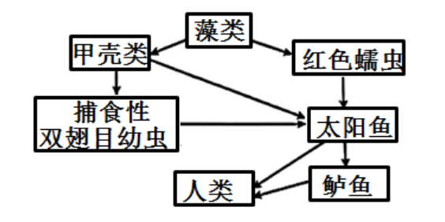
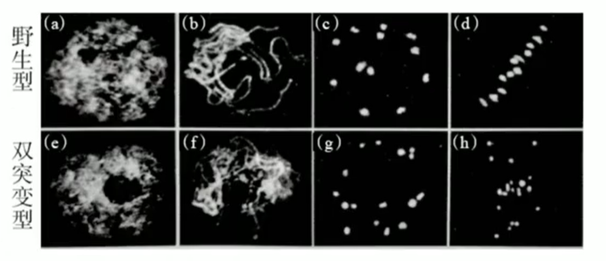
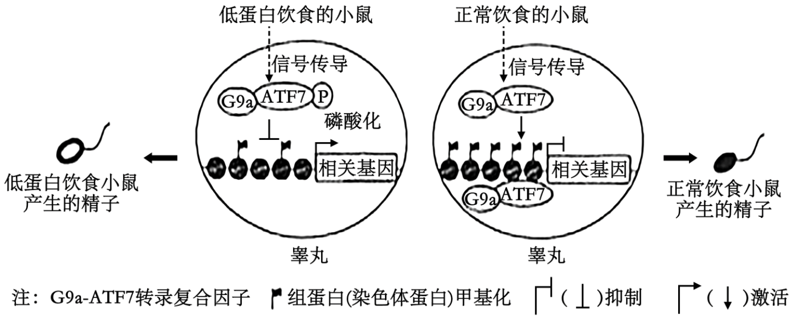
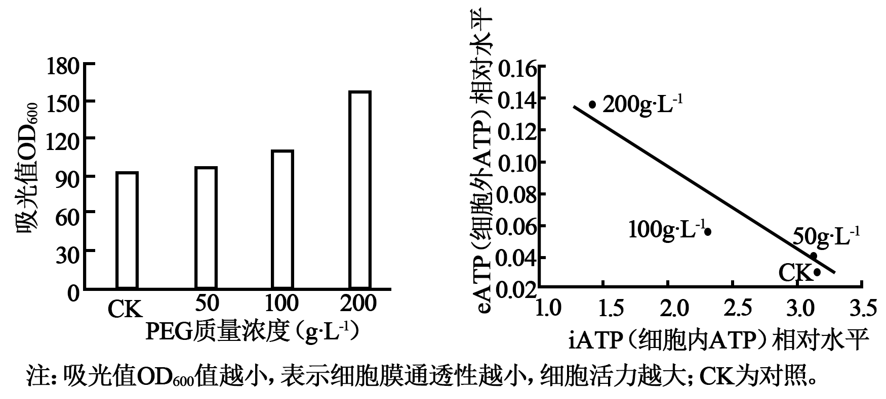
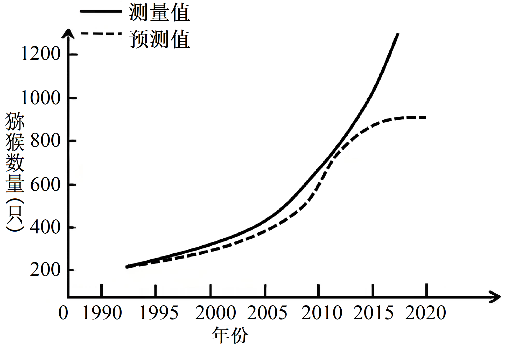
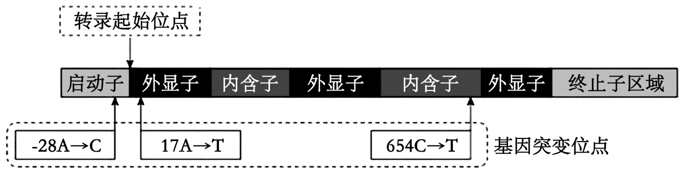
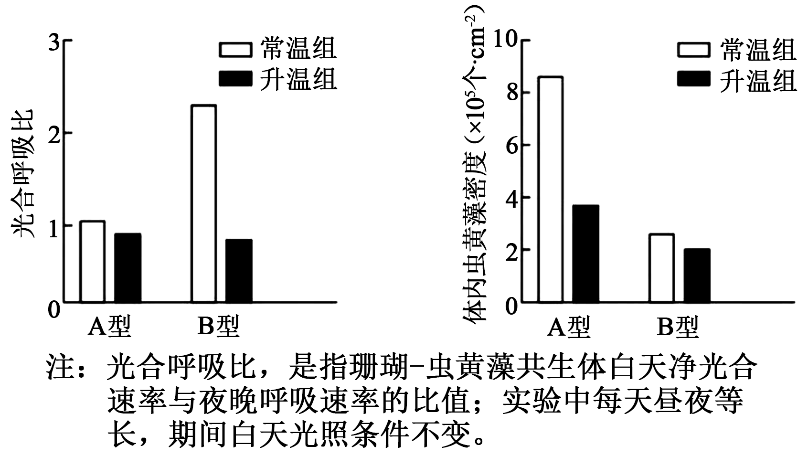
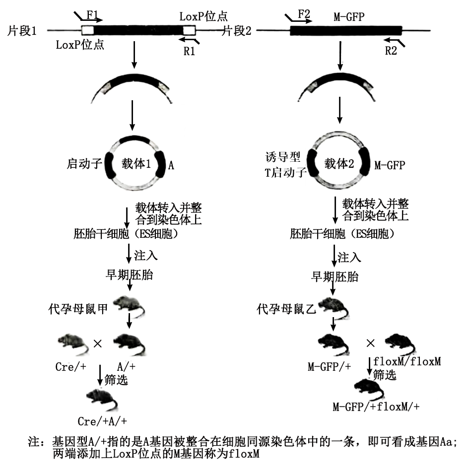
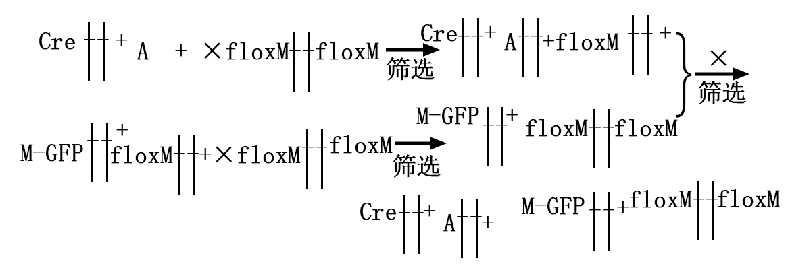

**2024年广西普通高中学业水平选择性考试（生物学科）**

1\. 唐诗“翠羽春禽满树喧”描绘了满树鸟儿欢快鸣叫的画面，其中“翠羽”指青翠的羽毛，“喧”指鸣叫。关于“翠羽”和“喧”在生态系统中的作用，说法错误的是（　　）

A. “翠羽”有利于种群繁衍 B. 两者皆可调节种间关系

C. “喧”可表示个体间联络 D. 两者皆属于化学信息

【答案】D

【解析】

【分析】1、信息的种类：物理信息、化学信息、行为信息。

2、信息传递的作用：在个体水平上，可以影响生物的生命活动；在种群水平上，可以影响种群的繁衍；在群落和生态系统水平上，可以调节生物的种间关系，进而维持生态系统的平衡与稳定。

【详解】A、“翠羽”有助于雌雄个体之间的信息传递，所以有利于种群繁衍，A正确；

B、不同的生物种群之间可以根据看到“翠羽”和听到的“喧”，来作出反应，进而调节种间关系，B正确；

C、通过“喧”这种鸣叫的声音，与同类的个体之间信息的交流和联络，C正确；

D、物理信息是生态系统中的光、声、温度、湿度、磁力等，通过物理过程传递的信息，“翠羽”和“喧”皆属于物理信息，D错误。

故选D。

2\. 广西是我国甘蔗主产地。甘蔗一般采用无性繁殖，但会由于病毒积累而产量下降，可通过植物组织培养获得脱毒苗的方法来解决。关于该方法，下列说法错误的是（　　）

A. 可选用甘蔗的茎尖为外植体

B. 选用的外植体需经高温灭菌处理

C. 一般采用加入琼脂的固体培养基

D. 脱毒苗的形成包括再分化过程

【答案】B

【解析】

【分析】植物组织培养即植物无菌培养技术，又称离体培养，是根据植物细胞具有全能性的理论，利用植物体离体的器官（如根、茎、叶、茎尖、花、果实等）、组织（如形成层、表皮、皮层、髓部细胞、胚乳等）或细胞（如大孢子、小孢子、体细胞等）以及原生质体，在无菌和适宜的人工培养基及温度等人工条件下，能诱导出愈伤组织、不定芽、不定根，最后形成完整的植株的学科。

【详解】A、培育脱毒苗时，一般选取茎尖（或芽尖或根尖）作为外植体，其依据是植物分生区附近（茎尖）病毒极少，甚至无病毒，A正确；

B、植物组织培养过程中，为防止杂菌污染，外植体需消毒处理，B错误；

C、植物组织培养过程中的脱分化与再分化所用的培养基一般采用加入了不同植物激素比例的琼脂固体培养基，C正确；

D、细胞脱分化是指已经分化的细胞，经过诱导后，失去其特有的结构和功能而转变为未分化细胞的过程，切取植物的茎尖进行组织培养时经过脱分化与再分化的过程可以获得脱毒苗，D正确。

故选B。

3\. “扬美豆豉”制作技艺属于广西非物质文化遗产，该技艺包括选豆、洗豆、煮豆、制曲、洗曲、调味和发酵等。下列说法错误的是（　　）

A. 煮豆可使蛋白质适度变性，易于被微生物利用

B. 制曲目的是促使有益微生物生长繁殖，并分泌多种酶

C. 调味时加入食盐，主要目的是促进微生物的生长繁殖

D. 发酵过程中，微生物将原料转化为特定代谢产物，使豆豉风味独特

【答案】C

【解析】

【分析】豆豉的制作原理与腐乳的制作类似：起主要作用的是真菌中的毛霉，适宜温度为15℃～18℃；毛霉能够产生蛋白酶和脂肪酶，将蛋白质和脂肪分别水解成小分子的肽和氨基酸、甘油和脂肪酸。

【详解】A、煮豆可使蛋白质适度变性，蛋白质中的肽键暴露，易于被微生物利用，A正确；

B、培养有益微生物来进行食品发酵的过程被称之为制曲，制曲是使有益微生物在基质上生长、繁殖和分泌各种酶，B正确；

C、调味时加入食盐，主要目的是抑制微生物的生长繁殖，C错误；

D、发酵过程中，微生物将原料转化为特定代谢产物，比如将蛋白质分解为氨基酸和小分子肽，将脂肪分解为甘油和脂肪酸，使豆豉风味独特，D正确。

故选C。

4\. 研究发现真核生物基因组DNA普遍存在5-甲基胞嘧啶和N6-甲基腺嘌呤，分别被称为DNA的第5、6个碱基。关于这两个碱基的说法，正确的是（　　）

A. 均含有N元素

B. 均含有脱氧核糖

C. 都排列在DNA骨架的外侧

D. 都不参与碱基互补配对

【答案】A

【解析】

【分析】DNA是由两条单链组成的，这两条链按反向平行方式盘旋成双螺旋结构；DNA中的脱氧核糖和磷酸交替连接排列在外侧，构成基本骨架，碱基排列在内侧；DNA中的遗传信息就储存在碱基对的排列顺序之中。

【详解】A、真核生物基因组DNA普遍存在5-甲基胞嘧啶和N6-甲基腺嘌呤，分别被称为DNA的第5、6个碱基，故DNA的第5、6个碱基均含有N元素，A正确；

B、DNA存在5-甲基胞嘧啶和N6-甲基腺嘌呤，两者不含脱氧核糖，B错误；

C、DNA中的脱氧核糖和磷酸交替连接，排列在外侧，构成基本骨架，碱基排列在内侧，C错误；

D、DNA双链存在A-T、G-C配对关系，5-甲基胞嘧啶和N6-甲基腺嘌呤参与碱基互补配对，D错误。

故选A。

5\. 我国科研工作者利用病毒衣壳蛋白VP16作为纳米骨架，包裹大肠杆菌碱性磷酸酶，构建了高效、易调控的蛋白类纳米酶。关于该纳米酶的说法，错误的是（　　）

A 催化效率受pH、温度影响

B. 可在细胞内发挥作用

C. 显著降低反应的活化能

D. 可催化肽键的断裂

【答案】D

【解析】

【分析】酶是活细胞产生的具有生物催化能力的有机物，大多数是蛋白质，少数是RNA；酶的催化具有高效性（酶的催化效率远远高于无机催化剂）、专一性（一种酶只能催化一种或一类化学反应的进行）、需要适宜的温度和pH值（在最适条件下，酶的催化活性是最高的，低温可以抑制酶的活性，随着温度升高，酶的活性可以逐渐恢复，高温、过酸、过碱可以使酶的空间结构发生改变，使酶永久性的失活），据此分析解答。

【详解】A、酶对化学反应的催化效率，受温度、pH等影响，需要温和的作用条件，A正确；

B、适宜条件下酶在细胞内和细胞外都能发挥作用，B正确；

C、纳米酶是利用病毒衣亮蛋白VP16作为纳米骨架，包裹大肠杆菌碱性磷酸酶，因此会显著降低反应的活化能，C正确；

D、纳米酶是利用病毒衣亮蛋白VP16作为纳米骨架，包裹大肠杆菌碱性磷酸酶，因此不可以催化肽键的断裂，D错误。

故选D。

6\. 百香果具有较高的经济价值，在广西多地种植，赋能乡村振兴。为探究促进百香果健壮枝条生根的最适2,4-D浓度，某兴趣小组提出实验方案，其中不合理的是（　　）

A. 设置清水组作为空白对照

B. 将2,4-D浓度作为自变量

C. 将枝条生根的数量及生根的长度作为因变量

D. 随机选择生长状况不同的枝条作为实验材料

【答案】D

【解析】

【分析】1、探究实验的原则包括对照原则和单一变量原则；

2、该实验的目的是“探究生根的最适2,4-D浓度”，自变量为2，4-D的浓度，因变量为根的数目和长度，其余均为无关变量。

【详解】A、探究促进百香果健壮枝条生根的最适2,4-D浓度，设置清水组作为空白对照是合理的，这样可以对比出不同浓度的2,4 - D对枝条生根的影响，A正确；

B、本实验是探究促进百香果健壮枝条生根的最适2,4 - D浓度，所以将2,4 - D浓度作为自变量是正确的做法，通过设置不同的2,4 - D浓度来观察对生根的影响，B正确；

C、枝条生根的数量及生根的长度是我们想要观察的因变量，通过不同浓度的2,4 - D处理后，观察这些因变量的变化从而得出最适浓度，C正确；

D、实验中应该随机选取生长状况相同的枝条作为实验材料，这样可以排除枝条本身生长状况不同对实验结果的干扰，如果选取生长状况不同的枝条，会使实验结果不准确，D错误。

故选D。

7\. 我国科研人员研发了一种长效胰岛素制剂。当血糖浓度升高时，该制剂能迅速释放胰岛素，使血糖恢复正常，之后缓慢持续释放微量胰岛素，维持血糖稳定。关于该制剂的说法，错误的是（　　）

A. 参与维持血糖浓度的动态平衡

B. 适宜采用注射方式给药

C. 释放胰岛素受神经系统直接调控

D. 药效受机体内环境的影响

【答案】C

【解析】

【分析】胰岛A细胞分泌胰高血糖素，能升高血糖，只有促进效果没有抑制作用，即促进肝糖原的分解和非糖类物质转化；胰岛B细胞分泌胰岛素是唯一能降低血糖的激素，其作用分为两个方面：促进血糖氧化分解、合成糖原、转化成非糖类物质；抑制肝糖原的分解和非糖类物质转化。

【详解】A、分析题意可知，当血糖浓度升高时，该制剂能迅速释放胰岛素，使血糖恢复正常，之后缓慢持续释放微量胰岛素，维持血糖稳定，所以参与维持血糖浓度的动态平衡，A正确；

B、胰岛素化学本质是蛋白质，口服会被分解，故适宜采用注射方式给药，B正确；

C、当血糖浓度升高时，该制剂能迅速释放胰岛素，使血糖恢复正常，之后缓慢持续释放微量胰岛素，故释放胰岛素受血糖直接调控，C错误；

D、这种长效胰岛素制剂在内环境中能“感知”血糖变化，会根据血糖变化来调节胰岛素释放的速度，故药效受机体内环境的影响，D正确。

故选C。

8\. 屠呦呦等科学家发现青蒿素，为全球疟疾治疗做出突出贡献。随着时间推移。发现疟原虫对单方青蒿素出现了一定抗药性，为了解决该问题，我国科学家继续研发出高效的青蒿素联合疗法并广泛应用。下列说法错误的是（　　）

A. 疟原虫出现抗药性，说明疟原虫种群在进化

B. 受单方青蒿素刺激，疟原虫产生了抗药性变异

C. 若一直使用单方青蒿素，疟原虫种群抗药性基因频率会上升

D. 青蒿素联合疗法，可以有效地杀灭感染人体的抗药性疟原虫

【答案】B

【解析】

【分析】以自然选择学说为核心的现代生物进化理论对自然界的生命史作出了科学的解释：适应是自然选择的结果；种群是生物进化的基本单位；突变和基因重组提供进化的原材料，自然选择导致种群基因频率的定向改变，进而通过隔离形成新的物种；生物进化的过程实际上是生物与生物、生物与无机环境协同进化的过程；生物多样性是协同进化的结果。

【详解】A、疟原虫出现抗药性，说明在青蒿素的选择压力下，疟原虫种群中抗药基因的基因频率在升高，这是生物进化的标志，A正确；

B、使用单方青蒿素治疗疟疾时，单方青蒿素对疟原虫种群进行了选择，使得具有抗药性的疟原虫得以生存和繁殖，该过程单方青蒿素不起诱导变异的作用，B错误；

C、若一直使用单方青蒿素，由于青蒿素对疟原虫的选择作用，具有抗药性的疟原虫将更容易生存和繁殖，从而导致疟原虫种群中抗药性基因的频率逐渐上升，C正确；

D、青蒿素联合疗法是通过使用多种药物来共同作用于疟原虫，从而有效地杀灭感染人体的抗药性疟原虫。这种方法可以克服单方青蒿素因长期使用而产生的抗药性问题，D正确。

故选B。

9\. 在某稳定的鱼塘生态系统中，食物网如图所示，其中鲈鱼为主要经济鱼类。下列说法错误的是（　　）

A. 该生态系统中，含有6条食物链

B. 该生态系统中，太阳鱼只属于第三营养级

C. 消除甲壳类会降低该生态系统的抵抗力稳定性

D. 消除捕食性双翅目幼虫，可以提高流入鲈鱼的能量

【答案】B

【解析】

【分析】在一定空间内，由生物群落和它的非生物环境相互作用而形成的统一整体，叫作生态系统。生态系统的结构包括生态系统的组成成分、食物链和食物网。

【详解】A、该生态系统中，含有6条食物链，分别是藻类→红色蠕虫→太阳鱼→鲈鱼→人类、藻类→红色蠕虫→太阳鱼→人类、藻类→甲壳类→太阳鱼→人类、藻类→甲壳类→太阳鱼→鲈鱼→人类、藻类→甲壳类→捕食性双翅目幼虫→太阳鱼→鲈鱼→人类、藻类→甲壳类→捕食性双翅目幼虫→太阳鱼→人类，A正确；

B、该生态系统中，太阳鱼属于第三和第四营养级，B错误；

C、甲壳类是多种生物的食物来源，消除甲壳类会破坏食物网的复杂性，减少生物种类和数量，从而降低生态系统的抵抗力稳定性，C正确；

D、能量流动沿着食物链逐级递减，消除捕食性双翅目幼虫，会使鲈鱼的营养级降低，从而提高流入鲈鱼的能量，D正确。

故选B。

10\. 白头叶猴为广西特有的濒危保护动物。为了调查其种群数量，可采用“粪便DNA分析法”，主要步骤有：采集白头叶猴粪便，分析其中白头叶猴的微卫星DNA（能根据其差别来识别不同个体）等。关于“粪便DNA分析法”的叙述，错误的是（　　）

A. 属于样方法，需随机划定样方采集粪便

B. 无需抓捕，避免对白头叶猴个体的伤害

C. 调查得到的种群数量，常小于真实数量

D. 宜采集新鲜粪便，以免其中DNA降解

【答案】A

【解析】

【分析】调查种群密度的方法有样方法、标记重捕法等，此外也可采用红外线调查法和粪便分析法等。

【详解】A、样方法适用于调查植物和活动能力弱、活动范围小的动物，样方法取样的关键是随机取样，但“粪便DNA分析法”不属于样方法，A错误；

B、采集白头叶猴的粪便分析其中的DNA进行种群密度的调查，无需抓捕，避免对白头叶猴个体的伤害，B正确；

C、部分白头叶猴的粪便未被采集到，部分粪便放置太久导致DNA已经降解，无法进行研究，因此调查得到的种群数量，常小于真实数量，C正确；

D、在采用“粪便DNA分析法”调查种群密度时，宜采集新鲜粪便，以免其中DNA降解而影响结果，D正确。

故选A。

11\. 水稻（2N=24）是我国主要粮食作物之一，研究发现水稻S1和S2基因与花粉正常发育相关。科研人员将野生型和双突变型（S1和S2基因突变）的花粉母细胞进行染色，观察得到如图的减数分裂Ⅰ过程。下列说法正确的是（　　）

A. 图（e）中出现明显的染色体，可知该时期是减数分裂Ⅰ后期

B. 水稻的1个花粉母细胞完成减数分裂，只产生1个子代细胞

C. 野生型水稻减数分裂Ⅰ过程，产生的子代细胞含有6条染色体

D. S1和S2基因可通过控制同源染色体的联会，进而影响花粉发育

【答案】D

【解析】

【分析】减数分裂：细胞连续分裂两次，而染色体在整个过程只复制一次的细胞分裂方式。

【详解】A、图e中双突变型花粉母细胞没有出现明显的染色体，不是减数分裂Ⅰ后期，A错误；

B、水稻一个花粉母细胞经过减数分裂形成4个子代细胞，B错误；

C、水稻染色体数目为2N=24，经过减数分裂，染色体数目减半，子代细胞含有12条染色体，C错误；

D、从图汇总看出双突变型花粉发育异常，而减数分裂Ⅰ主要是同源染色体联会和分离，所以S1和S2基因可通过控制同源染色体的联会，进而影响花粉发育 ，D正确。

故选D。

12\. 科学家通过小鼠低蛋白饮食与正常饮食的对比实验，发现亲代的低蛋白饮食可影响自身基因表达（其机理如图），且这种影响可遗传给子代。据图分析，下列说法正确的是（　　）

A. 自身基因表达和表型发生变化的现象，称为表观遗传

B. 组蛋白甲基化水平增加，将导致相关基因表达水平降低

C. ATF7的磷酸化，将导致组蛋白表观遗传修饰水平提高

D. 亲代的低蛋白饮食，会改变子代小鼠的DNA碱基序列

【答案】B

【解析】

【分析】生物体基因的碱基序列保持不变，但基因表达和表型发生可遗传变化的现象，叫作表观遗传。表观遗传现象普遍存在于生物体的生长、发育和衰老的整个生命活动过程中。

【详解】A、生物体基因的碱基序列保持不变，但基因表达和表型发生可遗传变化的现象，叫作表观遗传，A错误；

B、除了DNA甲基化，构成染色体的组蛋白发生甲基化、乙酰化等修饰也会影响基因的表达，组蛋白甲基化水平增加，将导致相关基因表达水平降低，B正确；

C、结合图示可知，ATF7 的磷酸化会抑制组蛋白的甲基化，将导致组蛋白表观遗传修饰水平下降，C错误；

D、亲代的低蛋白饮食会促进ATF7 的磷酸化，进而改变组蛋白的甲基化水平，但不会导致子代小鼠的DNA 碱基序列改变，D错误。

故选B。

13\. 科研工作者以烟草悬浮细胞为材料，研究不同质量浓度的聚乙二醇（PEG）对细胞膜通透性的影响，结果如图所示。下列说法错误的是（　　）

A. 高浓度PEG使细胞活力显著下降

B. 随着PEG浓度增加，eATP和iATP总量持续增加

C. iATP相对水平越高，说明细胞膜的通透性越小

D. 在PEG胁迫下，eATP相对水平与iATP相对水平呈负相关

【答案】B

【解析】

【分析】细胞膜的功能：作为细胞边界，将细胞与外界环境分开，保持细胞内部环境的相对稳定；控制物质进出细胞；进行细胞间的信息传递。

【详解】A、分析题意，吸光值OD值越小，表示细胞膜通透性越小，由图可知，高浓度PEG时，OD值增大，即细胞膜通透性增大，细胞活力下降，A正确；

B、据图可知，随着PEG浓度增加，iATP减小，故eATP和iATP总量并非持续增加，B错误；

C、吸光值OD值越小，表示细胞膜通透性越小，由图示可知，iATP相对水平越高，OD值越小，说明细胞膜通透性越小，C正确；

D、从图中可观察到在PEG胁迫下，eATP相对水平升高，而iATP相对水平降低，故二者呈负相关，D正确。

故选B。

14\. 为了研究游客投喂对某森林公园内野生猕猴种群数量的影响，研究人员进行了跟踪调查，结果见图。下列关于游客投喂对猴群的影响，叙述错误的是（　　）

A. 使猴群的种群增长率一直增加

B. 降低了园区内猴群的环境阻力

C. 使猴群数量增加，可能导致外溢

D. 降低种群密度对猴群数量的制约作用

【答案】A

【解析】

【分析】“J”形曲线：指数增长函数，描述在食物充足，无限空间，无天敌的理想条件下生物无限增长的情况。“S”形曲线：是受限制的指数增长函数，描述食物、空间都有限，有天敌捕食的真实生物数量增长情况，存在环境容纳的最大值K。

【详解】A、调查期间种群增长速率可以用曲线斜率表示，图中猕猴测量值在调查期间曲线的斜率逐渐增大，但由于环境资源等有限，故猴群的种群增长率会减小，A错误；

B、游客投喂减少了猴群对食物等的竞争，降低了园区内猴群的环境阻力，B正确；

C、投喂使猴群数量增加，超过园区的环境容纳量，可能导致外溢，C正确；

D、游客投喂食物，猕猴种群数量不会受到食物的制约，降低种群密度对猴群数量的制约作用，D正确。

故选A。

15\. 人体心室肌细胞内K+浓度高于胞外，Na+浓度低于胞外。心室肌细胞静息电位和动作电位的产生（如图），主要与K+和Na+的流动有关。图中0期为去极化：1、2和3期Na+通道关闭，同时K+外流；2期出现主要依赖K+和Ca2+的流动。下列说法错误的是（　　）

A. 静息电位主要由K+外流造成

B. 0期的产生依赖于Na+快速内流

C. 1期K+外流是通过主动运输进行

D. 2期的形成是K+外流和Ca2+内流导致

【答案】C

【解析】

【分析】1、心肌细胞动作电位最为主要的特征一般是复极化的时间可能会比较长一点，而且这个过程是由极化过程和复极化过程组成的。

2、分析题图可知心肌细胞动作电位产生过程分为0期（去极化过程），1、2、3期（复极化过程），4期（静息电位恢复过程）。

【详解】A、已知人体心室肌细胞内K+浓度高于胞外，在静息状态下，细胞膜对K+的通透性大，K+外流，形成外正内负的静息电位，所以静息电位主要由K+外流造成，A正确；

B、0期为去极化，此时细胞膜对Na+的通透性增大，Na+快速内流，使膜电位迅速去极化，因此0期的产生依赖于Na+快速内流，B正确；

C、由题可知1期Na+通道关闭，同时K+外流。因为细胞内K+浓度高于胞外，K+外流是顺浓度梯度进行的，属于协助扩散，而不是主动运输，C错误；

D、2期（平台期）是K+外流与Ca2+内流共同导致的结果，D正确。

故选C。

16\. 某种观赏花卉（两性花）有4种表型：紫色、大红色、浅红色和白色，由3对等位基因（A/a、B/b和D/d）共同决定，其中只要含有aa就表现白色，且Aa与另2对等位基因不在同一对同源染色体上。现有4个不同纯合品系甲、乙、丙和丁，它们之间的杂交情况（无突变、致死和染色体互换）见表。下列分析正确的是（　　）

|     |              |               |                                 |
|:--- |:------------ |:------------- |:------------------------------- |
| 组别  | 杂交组合         | F1 | F1自交，得到F2 |
| Ⅰ   | 甲（紫色）×乙（白色）  | 紫色            | 紫色:浅红色:白色≈9:3:4                 |
| Ⅱ   | 丙（大红色）×丁（白色） | 紫色            | 紫色:大红色:白色≈6:6:4                 |

A. B/b与D/d不在同一对同源染色体上，遵循自由组合定律

B. Ⅰ、Ⅱ组的F1个体，基因型分别是AaBBDd、AaBbDD

C. Ⅰ组产生的F2，其紫色个体中有6种基因型

D. Ⅱ组产生的F2，其白色个体中纯合子占1/2

【答案】D

【解析】

【分析】根据题目描述，这种观赏花卉的表型由3对等位基因（A/a、B/b和D/d）共同决定，其中只要含有aa就表现白色。Aa与另2对等位基因不在同一对同源染色体上，说明A/a与B/b、D/d是独立遗传的。

【详解】A、根据题目描述，表型由3对等位基因（A/a、B/b、D/d）决定，其中只要基因型中含有**aa**，表型即为白色，Aa与另2对等位基因不在同一对同源染色体上，说明A/a与B/b、D/d是独立遗传的，根据Ⅰ组的F1全为紫色，F2表型比例为9:3:4，符合A/a和B/b（或A/a和D/d）两对基因的自由组合， Ⅱ组的F1表型均为紫色，F2表型比例为6:6:4， 符合 9:3:3:1变式，说明符合A/a和B/b（或A/a和D/d）两对基因的自由组合，两组实验无法证明B/b与D/d两对等位基因之间的关系，A错误；

B、根据题目描述，表型由3对等位基因（A/a、B/b、D/d）决定，其中只要基因型中含有**aa**，表型即为白色，Aa与另2对等位基因不在同一对同源染色体上，说明A/a与B/b、D/d是独立分配的，根据Ⅰ组的F1全为紫色，F2表型比例为9:3:4，符合A/a和B/b（或A/a和D/d）两对基因的自由组合， Ⅱ组的F1表型均为紫色，F2表型比例为6:6:4， 符合 9:3:3:1变式，说明符合A/a和B/b（或A/a和D/d）两对基因的自由组合，Ⅰ、Ⅱ组的F1个体，基因型分别是AaBBDd、AaBbDD，或AaBbDD，AaBBDd，B错误；

C、Ⅰ组的F1全为紫色，F2表型比例为9:3:4，F2 紫色个体基因型为A_B_DD或A_BBD\_,共4种基因型，C错误；

D、推测 Bb与Dd应该是在同一对染色体上。Ⅱ组产生的F2，其白色个体基因型为aabbDD、aaB_DD（或aaBBdd、aaBBD\_），其中纯合子为aabbDD、aaBBDD（或aaBBdd、aaBBDD），白色个体的总概率为 1/4（aa ）， aabbDD、aaBBDD（或aaBBdd、aaBBDD） 纯合子的概率为：1/16＋1/16=1/8，因此白色个体中纯合子占1/2，D正确。

故选D。

**二、非选择题：本题共5小题，共60分。**

17\. β-地中海贫血是人11号染色体上β-珠蛋白基因HBB突变所造成的遗传病。如图为HBB几种常见的基因突变位点及功能区域示意图。回答下列问题：

注：-28A→C中，“-”表示转录起始位点前，数值表示碱基位点，A→C表示碱基A突变为C；仅标示了非模板链上的变化，模板链也发生对应变化，但没有标示出来。

（1）654C→T突变，\_\_\_\_\_\_（选填“会”或“不会”）增加该基因嘌呤碱基总数量。-28A→C突变，会导致β-珠蛋白的表达异常，其原因是\_\_\_\_\_\_。

（2）HBB在转录形成mRNA的过程中，细胞核内特定RNA复合物能特异性识别初级转录产物（mRNA前体），并将内含子对应区域剪切以及拼接外显子对应区域，这表明上述RNA复合物是一种\_\_\_\_\_\_。

（3）含有17A→T突变的HBB转录出的mRNA，对应位点的碱基是\_\_\_\_\_\_。

（4）某男性一条染色体上的HBB存在突变位点W，其配偶无W突变，他们生育的孩子\_\_\_\_\_\_（选填“一定”或“不一定”）存在该突变，从遗传概率角度分析，其原因是\_\_\_\_\_\_。为有效降低人群中β-地中海贫血的发病率，可以采取\_\_\_\_\_\_和\_\_\_\_\_\_等措施。

【答案】（1） ①. 不会 ②. 启动子区域发生碱基替换，使RNA聚合酶无法识别和结合，从而影响转录和翻译水平，使B-珠蛋白合成异常。

（2）酶（特异性酶） （3）U（尿嘧啶）

（4） ①. 不一定 ②. 孩子有50%概率不含该突变 ③. 遗传咨询 ④. 产前检测

【解析】

【分析】1、DNA分子中发生碱基的替换、增添或缺失，而引起的基因碱基序列的改变，叫作基因突变。基因突变若发生在配子中，将遵循遗传规律传递给后代。若发生在体细胞中，一般不能遗传。但有些植物的体细胞发生了基因突变，可以通过无性生殖遗传。

2、通过遗传咨询和产前诊断等手段，对遗传病进行检测和预防，在一定程度上能够有效地预防遗传病的产生和发展。

3、启动子是一段有特殊序列结构的DNA片段，位于基因的上游，紧挨转录的起始位点，它是RNA聚合酶识别和结合的部位，有了它才能驱动基因转录出mRNA，最终表达出人类需要的蛋白质。

【小问1详解】

依题意，654C→T突变是指非模板链上的第654位碱基C突变为T，模板链也发生对应的654G→A变化，故654C→T突变不会增加该基因呤碱基总数量。据图可知，基因的第28位碱基位于基因的启动子上，-28A→C突变，启动子区域发生碱基替换，使RNA聚合酶无法识别和结合，从而影响转录和翻译水平，使B-珠蛋白合成异常。

【小问2详解】

依题意，RNA复合物能特异性识别mRNA前体，并将内含子对应区域剪切以及拼接外显子对应区域，则该复合物使RNA的化学键发生了断裂和形成，故上述RNA复合物应是一种酶（特异性酶）。

【小问3详解】

依题意，17A→T表示基因非模板链上的变化，基因非模板链的碱基排序与对应的mRNA碱基排序相同，故含有17A→T突变的HBB转录出的mRNA，对应位点的碱基变化是由17A→U，即对应位点的碱基是U。

【小问4详解】

β-地中海贫血是人11号染色体上β-珠蛋白基因HBB突变所造成遗传病，即β-地中海贫血为常染色体上基因控制的遗传病。该男性一条染色体上的HBB存在突变位点W，另一条染色体上基因是正常的，且其配偶无W突变，故其子代有50%概率不含该突变，他们生育的孩子不一定存在该突变。通过遗传咨询和产前诊断等手段，对遗传病进行检测和预防，在一定程度上能够有效地预防遗传病的产生和发展。故为有效降低人群中β-地中海贫血的发病率，可以采取遗传咨询和产前检测等措施。

18\. 目前CAR-T细胞疗法在治疗血液恶性肿瘤方面具有较好效果。该疗法是在体外将特定DNA导入T细胞，获得CAR-T细胞，然后输入患者体内进行治疗。回答下列问题：

（1）T细胞在体内分化、发育和成熟的主要器官是\_\_\_\_\_\_。

（2）血液恶性肿瘤细胞表面存在特异性表达的CD19蛋白。为了使CAR-T细胞能识别肿瘤细胞，导入T细胞的DNA应能指导合成\_\_\_\_\_\_随后该合成产物镶嵌在\_\_\_\_\_\_上。

（3）识别患者体内的肿瘤细胞后，CAR-T细胞受\_\_\_\_\_\_刺激并激活，最终增殖、分化为\_\_\_\_\_\_将肿瘤细胞杀灭，该过程属于\_\_\_\_\_\_免疫。

（4）CAR-T细胞输入患者前，要先清除患者体内的淋巴细胞，其目的是\_\_\_\_\_\_。

【答案】（1）胸腺 （2） ①. CD19蛋白受体 ②. 细胞膜

（3） ①. 细胞因子 ②. 细胞毒性T细胞 ③. 细胞

（4）防止免疫反应、防止免疫排斥、防止CAR-T数量减少

【解析】

【分析】1、免疫系统：①免疫器官：骨髓、胸腺等。②免疫细胞：树突状细胞、巨噬细胞、淋巴细胞。其中B细胞在骨髓中成熟、T细胞在胸腺中成熟。③免疫活性物质：抗体、细胞因子、溶菌酶。

2、免疫系统三大功能：①免疫防御，针对外来抗原性异物，如各种病原体。②免疫自稳，清除衰老或损伤的细胞。③免疫监视，识别和清除突变的细胞，防止肿瘤发生。

3、三道防线：非特异性免疫，包括第一道防线和第二道防线。第一道防线：皮肤，黏膜等；第二道防线：体液中的杀菌物质（溶菌酶）、吞噬细胞（如巨噬细胞和树突状细胞）。特异性免疫，也即第三道防线：体液免疫和细胞免疫。

【小问1详解】

T淋巴细胞分化、发育和成熟的场所是胸腺。

【小问2详解】

肿瘤细胞表面存在特异性表达的CD19蛋白，为了使CAR-T细胞能识别肿瘤细胞，要求导入T细胞的DNA应能指导合成CD19蛋白受体，且合成的CD19蛋白受体应镶嵌在细胞膜表面上发挥作用。

【小问3详解】

CAR-T细胞免疫疗法是指将嵌合抗原受体（CAR）导入细胞毒性T细胞中，从而产生特异性识别肿瘤的T细胞，该细胞表面的抗原受体（CAR）与肿瘤细胞表面的抗原特异性结合，从而能对肿瘤细胞进行靶向治疗。识别患者体内的肿瘤细胞后，CAR-T细胞受细胞因子的刺激后可增殖分化成激活的细胞毒性T细胞和记忆T细胞，最终消灭自身肿瘤细胞，该过程属于细胞免疫。

【小问4详解】

CAR-T细胞疗法是在体外将特定DNA导入T细胞，获得CAR-T细胞，然后输入患者体内进行治疗，该疗法过程中清除患者体内淋巴细胞，减少免疫调节细胞的数量，防止免疫反应与免疫排斥的发生，并且防止CAR-T细胞数量的减少，为CAR-T细胞提供一个有利的免疫环境。

19\. 珊瑚是一类低等动物，可从环境中获取单细胞真核藻类虫黄藻，让其共生于自己细胞内，成为珊瑚-虫黄藻共生体。共生体的营养来源包括虫黄合成的有机物和摄取的浮游生物。研究人员在实验室研究温度升高对某珊瑚-虫黄藻共生体的两种类型（A型和B型）的影响，结果见下图。回答下列问题：

（1）珊瑚细胞获取虫黄藻的方式是\_\_\_\_\_\_（填物质运输方式）；虫黄藻可利用CO2和H2O在\_\_\_\_\_\_（填细胞器名称）合成糖类，为珊瑚提供营养。

（2）当光合呼吸比约等于1时，A型共生体仍能生长，其原因是\_\_\_\_\_\_。

（3）常温条件下，在缺少浮游生物的贫瘠海域，更具生存优势的共生体类型是\_\_\_\_\_\_，理由是\_\_\_\_\_\_。

（4）若升温后B型共生体的呼吸速率变化不明显，则据图分析B型共生体内的单个虫黄藻光合速率将\_\_\_\_\_\_，理由是\_\_\_\_\_\_。

【答案】（1） ①. 胞吞 ②. 叶绿体

（2）可通过摄食浮游生物获取营养物质

（3） ①. B型 ②. 与A型相比，B型共生体的光合呼吸比更高，积累光合产物更多，在贫瘠海域中，B型比A型更具有生存优势

（4） ①. 下降 ②. 升温后呼吸速率基本不变，B型光合呼吸比显著下降，所以B型共生体总光合速率下降，且藻黄虫密度变化不大，所以单个黄虫的光合速率下降

【解析】

【分析】题图分析：据图可知，温度升高对A型共生体光合呼吸比影响不大，但会降低其体内虫黄藻密度；温度升高对B型体内虫黄藻密度影响变化不大，但会使其光合呼吸比下降。

【小问1详解】

依题意，珊瑚细胞获取虫黄藻后，虫黄藻共生于珊瑚细胞内，说明珊瑚细胞获取虫黄藻的方式是胞吞。虫黄藻是单细胞真核藻类，能利用CO2和H2O合成糖类的细胞器是叶绿体。

【小问2详解】

依题意，共生体的营养来源包括虫黄合成的有机物和摄取的浮游生物，当光合呼吸比约等于1时（此时白天净光合量与晚上呼吸量相等，一天中有机物净积累量等于零），A型共生体仍能生长（一天中有机物积累量大于零），说明A型共生体可通过摄食浮游生物获取营养物质，使共生体生长。

【小问3详解】

据图可知，与A型相比，B型共生体的光合呼吸比更高，实验中每天昼夜等长，则B型共生体一天中积累光合产物更多，故在贫瘠海域中，B型比A型更具有生存优势。

【小问4详解】

据图可知，升温后B型共生体光合呼吸比下降明显，若升温后B型共生体的呼吸速率变化不明显，说明其白天净光合作用速率下降明显，净光合速率=光合速率-呼吸速率，可推断B型共生体总光合作用速率下降。据图可知，升温后，B型共生体的藻黄虫密度变化不大，故单个黄虫的光合速率下降。

20\. 紫茎泽兰原产于美洲，是我国西南地区常见入侵植物，常在入侵地草本层成为单一优势种，给农林牧业带来经济损失。回答下列问题：

（1）紫茎泽兰入侵后，最终会使生物多样性\_\_\_\_\_\_。

（2）已知甲、乙和丙皆为本土陆生草本植物，且株高等性状与紫茎泽兰相似。图（a）为4种植物的生态位关系，由此可知紫茎泽兰入侵后对\_\_\_\_\_\_植物影响最大，原因是：\_\_\_\_\_\_；图（b）为上述4种植物的分布区域，其中2种植物分布已注明，若要采集甲和丙植物，最可能分别在\_\_\_\_\_\_和\_\_\_\_\_\_生境采集到。

（3）相比原产地，入侵后紫茎泽兰改变了叶片中氮元素的分配模式，具体情况见下表。从种间关系角度分析，入侵地紫茎泽兰减少用于防御的氮含量的原因是：\_\_\_\_\_\_。

|                               |         |         |
|:----------------------------- |:------- |:------- |
| 氮元素含量的相关指标（mg·m-2） | 原产地     | 入侵地     |
| 叶片细胞壁中防御化合物的氮含量               | 116.25  | 44.10   |
| 叶绿体中的氮含量                      | 712.5   | 793.8   |
| 叶片总氮含量                        | 1253.00 | 1255.00 |

（4）利用农药进行化学防控是控制紫茎泽兰扩散的一种方法，该方法的弊端有\_\_\_\_\_\_（至少答2点）。

【答案】（1）下降（破坏、下降）

（2） ①. 丙 ②. 丙资源状态与紫茎泽兰重叠最大，竞争最激烈 ③. A ④. B

（3）缺少天敌捕食 （4）农药对本地植物尤其是草本植物造成伤害，对环境造成污染

【解析】

【分析】生态位指一个物种在群落中的地位或作用，包括所处的空间位置，占用资源的情况，以及与其他物种的关系等。 不同物种生态位不同，如紫茎泽兰与丙植物生态位重叠多，就意味着它们在空间位置、资源利用等方面相似程度高，竞争激烈。生态位分化能使不同物种更好利用资源，减少竞争，有利于群落稳定与物种共存。

【小问1详解】

紫茎泽兰是入侵植物，常在入侵地草本层成为单一优势种，会排挤其他植物，导致其他植物种类减少，从而使生物多样性降低。

【小问2详解】

从图（a）生态位关系可知，紫茎泽兰与丙植物的生态位重叠最多，所以紫茎泽兰入侵后对丙植物影响最大。原因是生态位重叠越多，两种生物对资源的竞争越激烈，紫茎泽兰入侵后会与丙植物竞争相同的资源（如阳光、水分、养分、空间等），在竞争中丙植物处于劣势，从而受到的影响最大。观察图（b），乙植物分布在B区域，紫茎泽兰分布在C区域，而甲植物的生态位与紫茎泽兰差异较大，所以甲植物最可能在A生境采集到；丙植物与紫茎泽兰生态位重叠较多，且紫茎泽兰为入侵物钟竞争力较大，因此C生境很难生存，所以丙植物最可能在B生境采集到。

【小问3详解】

入侵地紫茎泽兰减少用于防御的氮含量，是因为在入侵地紫茎泽兰成为单一优势种，缺少天敌捕食，不需要投入过多氮元素用于防御捕食者捕食，而可以将更多氮元素分配到叶绿体中，用于光合作用等生理过程，以促进自身生长和繁殖。

【小问4详解】

利用农药进行化学防控控制紫茎泽兰扩散的弊端有：农药对本地植物尤其是草本植物造成伤害，对环境造成污染；农药可能会杀死紫茎泽兰的天敌等其他生物，破坏生态平衡；农药可能会在紫茎泽兰体内残留，通过食物链富集，影响其他生物甚至人类健康；长期使用农药，紫茎泽兰可能会产生抗药性，导致防控效果下降。

21\. M蛋白与“记忆”的形成密切相关。科研人员制备了M基因表达可控的实验模型小鼠，主要制作流程见下图，实验模型小鼠通过特异性表达Cre重组酶来敲除两个LoxP位点间的序列，同时利用体内表达的蛋白A激活诱导型T启动子。利用融合绿色荧光蛋白基因的M基因（M-GFP）的表达，恢复小鼠自身被敲除的M基因功能，同时便于示踪。回答下列问题：

注：基因型A/+指的是A基因被嵌合在细胞同源染色体中的一条，即可表示为Aa；两端添加上LoxP位点的M基因称为floxM。

（1）在PCR扩增片段①和②时，通常会在所用引物的一端添加被限制酶识别的序列，该序列添加的位置位于引物\_\_\_\_\_\_（选填“3'端”或“5'端”）。在构建载体1时，为了阻断A基因的表达，从转录水平考虑，连接的片段可以是\_\_\_\_\_\_；而从翻译水平考虑，连接的片段可以是\_\_\_\_\_\_。为了鉴定载体2是否构建成功，需要限制酶切割载体后，再进行\_\_\_\_\_\_。

（2）培养小鼠胚胎干细胞需定时更换培养液，其目的是\_\_\_\_\_\_（至少答2方面）。

（3）为了快速高效繁育出含有4对基因（遵循自由组合定律）的实验模型小鼠，应将培育出的基因型Cre/+A/+小鼠和M-GFP/+floxM/+小鼠分别与基因型floxM/floxM小鼠杂交，杂交获得的子代，再进行一代杂交后最终获得基因型为\_\_\_\_\_\_实验模型小鼠。

（4）为了实现M基因表达可控，在实验模型小鼠喂食时，可添加竞争性结合A蛋白的四环素，抑制T启动子的活性。添加四环素与未添加相比，目的是\_\_\_\_\_\_。

【答案】（1） ①. 5′端 ②. 两端包含loxP序列的终止子 ③. 两端包含loxP序列的可转录出终止密码子相应的DNA序列 ④. 电泳

（2）清除代谢产物、提供营养物质、调节pH、维持渗透压

（3）cre/+A/+M-GFP/+floxM/floxM

（4）添加四环素会竞争性结合A蛋白，无法激活T启动子，导致M-GFP基因不能表达，从而不能恢复被敲除的M基因的功能；不添加四环素，A蛋白基因表达激活T启动子，启动M-GFP基因表达，从而恢复被敲除的M基因的功能。通过添加和不添加四环素的自身对照，增加实验的准确性。

【解析】

【分析】基因工程技术基本步骤： 1、目的基因的获取：方法有从基因文库中获取、利用PCR技术扩增和人工合成。 2、基因表达载体的构建：是基因工程的核心步骤，基因表达载体包括目的基因、启动子、终止子和标记基因等。 3、将目的基因导入受体细胞：根据受体细胞不同，导入的方法也不一样。将目的基因导入植物细胞的方法有农杆菌转化法、基因枪法和花粉管通道法；将目的基因导入动物细胞最有效的方法是显微注射法；将目的基因导入微生物细胞的方法是感受态细胞法。 4、目的基因的检测与鉴定：（1）分子水平上的检测：①检测转基因生物染色体的DNA是否插入目的基因--DNA分子杂交技术；②检测目的基因是否转录出了mRNA--分子杂交技术；③检测目的基因是否翻译成蛋白质--抗原-抗体杂交技术。（2）个体水平上的鉴定：抗虫鉴定、抗病鉴定、活性鉴定等。

【小问1详解】

PCR扩增DNA时，子链的合成方向是5'→3'，故应在引物的5'端添加被限制酶识别的序列。终止子：使转录在所需要的地方停下来，它位于基因的下游，也是一段有特殊序列结构的DNA片段。转录是以DNA为模板合成RNA的过程。从转录水平考虑为了阻断A基因的表达，连接的片段可以是两端包含LoxP序列的终止子。终止密码子：蛋白质翻译过程中终止肽链合成的mRNA上的三联体碱基序列。从翻译水平考虑为了阻断A基因的表达，连接的片段可以是两端包含LoxP序列的可转录出终止密码子相应的DNA序列。为鉴定载体2是否构建成功，需利用限制酶切割载体后进行电泳，观察是否出现预期大小的目标条带。

【小问2详解】

细胞培养液需要定期更换，以便清除代谢物，防止细胞代谢物积累对细胞自身造成危害。此外，定期更换培养液还能维持细胞生存适宜的pH 和渗透压、确保细胞获得充足的营养，保证细胞的健康生长和繁殖。

【小问3详解】

实验的目的是制备M基因表达可控的实验模型小鼠，对M基因的控制是通过蛋白A激活诱导型T启动子来调控的。为了便于追踪，构建了带绿色荧光蛋白基因的M基因，方便观察 M基因的表达情况，而自身所带的M基因则需要被敲除，已知两端添加LoxP位点的M基因可被Cre重组酶敲除，所以需要构建两端添加了LoxP 位点的M 基因纯合小鼠，相关基因型为foxM/1oxM。该小鼠体内需要有Cre重组酶来切除自身的M基因，同时还要有表达蛋白A的基因以及融合了绿色荧光蛋白基因的M基因来替换被敲除的M基因。综上分析，需进行如下杂交：

最终获得基因型为cre/+A/+M-GFP/+floxM/floxM的实验模型小鼠。

【小问4详解】

添加四环素与未添加相比，添加四环素会竞争性结合A蛋白，无法激活T启动子，导致M-GFP基因不能表达，从而不能恢复被敲除的M基因的功能；不添加四环素，A蛋白基因表达激活T启动子，启动M-GFP基因表达，从而恢复被敲除的M基因的功能。通过添加和不添加四环素的自身对照，增加实验的准确性。
