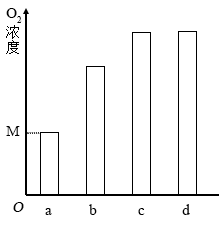

**绝密★启用前**

**2024年普通高等学校招生全国统考试**

**理科综合能力测试**

**注意事项：**

**1．答卷前，考生务必将自己的姓名、准考证号填写在答题卡上。**

**2．回答选择题时，选出每小题答案后，用铅笔把答题卡上对应题目的答案标号涂黑。如需改动，用橡皮擦干净后，再选涂其他答案标号。回答非选择题时，将答案写在答题卡上。写在本试卷上无效。**

**3．考试结束后，将本试卷和答题卡一并交回。**

**可能用到的相对原子质量：H 1 C 12 N 14 O 16 S 32 Mn 55 Fe 56 Co 59 Ni 59 Zn 65**

**一、选择题：本题共13小题，每小题6分，共78分。在每小题给出的四个选项中，只有一项是符合题目要求的。**

1\. 大豆是我国重要的粮食作物。下列叙述错误的是（ ）

A. 大豆油含有不饱和脂肪酸，熔点较低，室温时呈液态

B. 大豆的蛋白质、脂肪和淀粉可在人体内分解产生能量

C. 大豆中的蛋白质含有人体细胞不能合成的必需氨基酸

D. 大豆中的脂肪和磷脂均含有碳、氢、氧、磷4种元素

2\. 干旱缺水条件下，植物可通过减小气孔开度减少水分散失。下列叙述错误的是（ ）

A. 叶片萎蔫时叶片中脱落酸的含量会降低

B. 干旱缺水时进入叶肉细胞的会减少

C. 植物细胞失水时胞内结合水与自由水比值增大

D. 干旱缺水不利于植物对营养物质吸收和运输

3\. 人体消化道内食物的消化和吸收过程受神经和体液调节。下列叙述错误的是（ ）

A. 进食后若副交感神经活动增强可抑制消化液分泌

B. 唾液分泌条件反射的建立需以非条件反射为基础

C. 胃液中的盐酸能为胃蛋白酶提供适宜的pH环境

D. 小肠上皮细胞通过转运蛋白吸收肠腔中的氨基酸

4\. 采用稻田养蟹的生态农业模式既可提高水稻产量又可收获螃蟹。下列叙述错误的是（ ）

A. 该模式中水稻属于第一营养级

B. 该模式中水稻和螃蟹处于相同生态位

C. 该模式可促进水稻对二氧化碳的吸收

D. 该模式中碳循环在无机环境和生物间进行

5\. 某种二倍体植物的P1和P2植株杂交得F1，F1自交得F2。对个体的DNA进行PCR检测，产物的电泳结果如图所示，其中①～⑧为部分F2个体，上部2条带是一对等位基因的扩增产物，下部2条带是另一对等位基因的扩增产物，这2对等位基因位于非同源染色体上。下列叙述错误的是（ ）

A. ①②个体均为杂合体，F2中③所占的比例大于⑤

B. 还有一种F2个体的PCR产物电泳结果有3条带

C. ③和⑦杂交子代的PCR产物电泳结果与②⑧电泳结果相同

D. ①自交子代的PCR产物电泳结果与④电泳结果相同的占

6\. 用一定量的液体培养基培养某种细菌，活细菌数随时间的变化趋势如图所示，其中Ⅰ～Ⅳ表示细菌种群增长的4个时期。下列叙述错误的是（ ）

A. 培养基中的细菌不能通过有丝分裂进行增殖

B. Ⅱ期细菌数量增长快，存在“J”形增长阶段

C. Ⅲ期细菌没有增殖和死亡，总数保持相对稳定

D. Ⅳ期细菌数量下降的主要原因有营养物质匮乏

7\. 某同学将一种高等植物幼苗分为4组（a、b、c、d），分别置于密闭装置中照光培养，a、b、c、d组光照强度依次增大，实验过程中温度保持恒定。一段时间（t）后测定装置内O2浓度，结果如图所示，其中M为初始O2浓度，c、d组O2浓度相同。回答下列问题。

（1）太阳光中的可见光由不同颜色的光组成，其中高等植物光合作用利用的光主要是\_\_\_\_\_\_\_\_，原因是\_\_\_\_\_\_\_\_。

（2）光照t时间时，a组CO2浓度\_\_\_\_\_\_\_\_（填“大于”“小于”或“等于”）b组。

（3）若延长光照时间c、d组O2浓度不再增加，则光照t时间时a、b、c中光合速率最大是\_\_\_\_\_\_\_\_组，判断依据是\_\_\_\_\_\_\_\_。

（4）光照t时间后，将d组密闭装置打开，并以c组光照强度继续照光，其幼苗光合速率会\_\_\_\_\_\_\_\_（填“升高”“降低”或“不变”）。

8\. 机体感染人类免疫缺陷病毒（HIV）可导致艾滋病。回答下列问题。

（1）感染病毒的细胞可发生细胞凋亡。细胞凋亡被认为是一种程序性死亡的理由是\_\_\_\_\_\_\_\_。

（2）HIV会感染辅助性T细胞导致细胞凋亡，使机体抵抗病原体、肿瘤的特异性免疫力下降，特异性免疫力下降的原因是\_\_\_\_\_\_\_\_。

（3）设计实验验证某血液样品中有HIV，简要写出实验思路和预期结果。

（4）接种疫苗是预防传染病一种有效措施。接种疫苗在免疫应答方面的优点是\_\_\_\_\_\_\_\_（答出2点即可）。

9\. 厦门筼筜湖经生态治理后环境宜人，成为城市会客厅，是我国生态修复的典型案例。回答下列问题。

（1）湖泊水体的氮浓度是评价水质的指标之一，原因是\_\_\_\_\_\_。

（2）湖区的红树林可提高固碳效率、净化水体。在湖区生态系统中，红树植物参与碳循环的主要途径有光合作用、呼吸作用，还有\_\_\_\_\_\_\_（答出2点即可）。

（3）湖区水质改善后鸟类的种类和数目增加。鸟类属于消费者，消费者在生态系统中的作用是\_\_\_\_\_\_\_（答出2点即可）。

（4）生态修复后湖区生态系统生物多样性增加，保护生物多样性的意义是\_\_\_\_\_\_。

10\. 某种瓜的性型（雌性株/普通株）和瓜刺（黑刺/白刺）各由1对等位基因控制。雌性株开雌花，经人工诱雄处理可开雄花，能自交；普通株既开雌花又开雄花。回答下列问题。

（1）黑刺普通株和白刺雌性株杂交得，根据的性状不能判断瓜刺性状的显隐性，则瓜刺的表现型及分离比是\_\_\_\_\_\_\_\_。若要判断瓜刺的显隐性，从亲本或中选择材料进行的实验及判断依据是\_\_\_\_\_。

（2）王同学将黑刺雌性株和白刺普通株杂交，均为黑刺雌性株，经诱雄处理后自交得，能够验证“这2对等位基因不位于1对同源染色体上”这一结论的实验结果是\_\_\_\_\_\_\_\_。

（3）白刺瓜受消费者青睐，雌性株的产量高。在王同学实验所得杂交子代中，筛选出白刺雌性株纯合体的杂交实验思路是\_\_\_\_\_\_\_\_。

11\. 某研究小组将纤维素酶基因（N）插入某种细菌（B1）的基因组中，构建高效降解纤维素的菌株（B2）。该小组在含有N基因的质粒中插入B1基因组的M1与M2片段；再经限制酶切割获得含N基因的片段甲，片段甲两端分别为M1与M2；利用CRISPR/Cas9基因组编辑技术将片段甲插入B1的基因组，得到菌株B2。酶切位点（I～Ⅳ）、引物（P1～P4）的结合位置、片段甲替换区如图所示，→表示引物5'→3'方向。回答下列问题。

（1）限制酶切割的化学键是\_\_\_\_\_\_\_\_。为保证N基因能在菌株B2中表达，在构建片段甲时，应将M1与M2片段分别插入质粒的Ⅰ和Ⅱ、Ⅲ和Ⅳ酶切位点之间，原因是\_\_\_\_\_\_\_\_。

（2）CRISPR/Cas9技术可以切割细菌B1基因组中与向导RNA结合的DNA。向导RNA与B1基因组DNA互补配对可以形成的碱基对有G－C和\_\_\_\_\_\_\_\_。

（3）用引物P1和P2进行PCR可验证片段甲插入了细菌B1基因组，所用的模板是\_\_\_\_\_\_\_\_；若用该模板与引物P3和P4进行PCR，实验结果是\_\_\_\_\_\_\_\_。

（4）与秸秆焚烧相比，利用高效降解纤维素的细菌处理秸秆的优点是\_\_\_\_\_\_\_\_（答出2点即可）。
