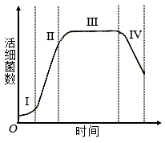
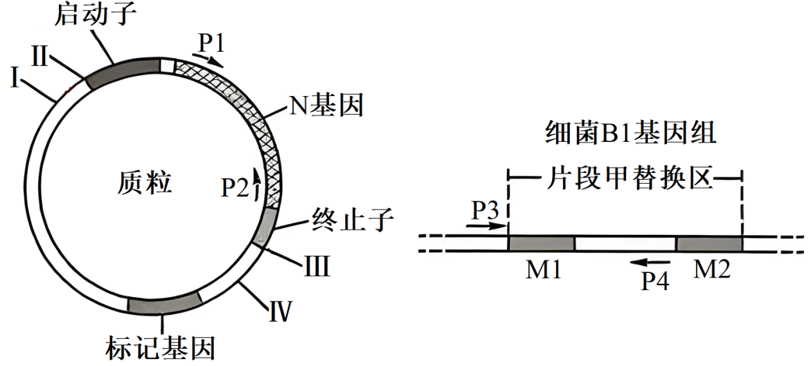

**绝密★启用前**

**2024年普通高等学校招生全国统考试**

**理科综合能力测试**

**注意事项：**

**1．答卷前，考生务必将自己的姓名、准考证号填写在答题卡上。**

**2．回答选择题时，选出每小题答案后，用铅笔把答题卡上对应题目的答案标号涂黑。如需改动，用橡皮擦干净后，再选涂其他答案标号。回答非选择题时，将答案写在答题卡上。写在本试卷上无效。**

**3．考试结束后，将本试卷和答题卡一并交回。**

**可能用到的相对原子质量：H 1 C 12 N 14 O 16 S 32 Mn 55 Fe 56 Co 59 Ni 59 Zn 65**

**一、选择题：本题共13小题，每小题6分，共78分。在每小题给出的四个选项中，只有一项是符合题目要求的。**

1\. 大豆是我国重要的粮食作物。下列叙述错误的是（ ）

A. 大豆油含有不饱和脂肪酸，熔点较低，室温时呈液态

B. 大豆的蛋白质、脂肪和淀粉可在人体内分解产生能量

C. 大豆中的蛋白质含有人体细胞不能合成的必需氨基酸

D. 大豆中的脂肪和磷脂均含有碳、氢、氧、磷4种元素

【答案】D

【解析】

【分析】1、脂肪：是由三分子脂肪酸与一分子甘油发生反应而形成的。

2、磷脂：构成膜（细胞膜、核膜、细胞器膜）结构的重要成分。

3、固醇：维持新陈代谢和生殖起重要调节作用，分为胆固醇、性激素、维生素D等。

【详解】A、植物脂肪大多含有不饱和脂肪酸，在室温下呈液态，动物脂肪大多含有饱和脂肪酸，在室温下呈固态，A正确；

B、蛋白质、脂肪和淀粉可在人体内分解产生能量，B正确；

C、必需氨基酸是人体细胞不能合成必须从外界获取的氨基酸，因此大豆中的蛋白质含有人体细胞不能合成的必需氨基酸，C正确；

D、脂肪的组成元素只有C、H、O，D错误。

故选D。

2\. 干旱缺水条件下，植物可通过减小气孔开度减少水分散失。下列叙述错误的是（ ）

A. 叶片萎蔫时叶片中脱落酸的含量会降低

B. 干旱缺水时进入叶肉细胞的会减少

C. 植物细胞失水时胞内结合水与自由水比值增大

D. 干旱缺水不利于植物对营养物质的吸收和运输

【答案】A

【解析】

【分析】干旱缺水条件下气孔开度减小，植物吸收的二氧化碳会减少，植物的光合速率会降低，同时植物体内水分含量减少，各种需要水分参与的生理反应都会减弱，植物根细胞的吸水能力增强，植物缺水主要是自由水大量失去。

【详解】A、叶片萎蔫时，叶片中的脱落酸(ABA)含量会增加，达到一定程度叶片可能会脱落，A错误；

B、干旱缺水时，植物气孔开度减小，吸收的二氧化碳会减少，植物的光合速率会降低，B正确；

C、植物细胞失水时主要失去自由水，自由水含量下降，结合水与自由水比值会增大，C正确；

D、缺水会影响植物体内各种需要水分参与的生理反应，植物对营养物质的吸收和运输往往需要水分参与，缺水不利于该过程，D正确。

故选A。

3\. 人体消化道内食物的消化和吸收过程受神经和体液调节。下列叙述错误的是（ ）

A. 进食后若副交感神经活动增强可抑制消化液分泌

B. 唾液分泌条件反射的建立需以非条件反射为基础

C. 胃液中的盐酸能为胃蛋白酶提供适宜的pH环境

D. 小肠上皮细胞通过转运蛋白吸收肠腔中的氨基酸

【答案】A

【解析】

【分析】自主神经系统：自主神经系统由交感神经和副交感神经两部分组成。它们的作用通常是相反的。当人体处于兴奋状态时，交感神经活动占据优势，心跳加快，支气管扩张，但胃肠的蠕动和消化腺的分泌活动减弱；当人处于安静状态时，副交感神经活动占据优势，此时，心跳减慢，但胃肠的蠕动和消化液的分泌会加强，有利于食物的消化和营养物质的吸收。

【详解】A、副交感神经活动增强，促进胃肠的蠕动和消化液的分泌，有利于食物的消化和营养物质的吸收，A错误；

B、条件反射是在非条件反射的基础上，通过学习和训练而建立的。即唾液分泌条件反射的建立需以非条件反射为基础，B正确；

C、胃蛋白酶的最适pH为1.5，胃液中的盐酸能为胃蛋白酶提供适宜的pH环境，C正确；

D、小肠上皮细胞吸收氨基酸的方式通常为主动运输，过程中需要转运蛋白，D正确。

故选A。

4\. 采用稻田养蟹的生态农业模式既可提高水稻产量又可收获螃蟹。下列叙述错误的是（ ）

A. 该模式中水稻属于第一营养级

B. 该模式中水稻和螃蟹处于相同生态位

C. 该模式可促进水稻对二氧化碳的吸收

D. 该模式中碳循环在无机环境和生物间进行

【答案】B

【解析】

【分析】稻田养蟹的模式中蟹能清除稻田杂草，吃掉部分害虫，其排泄物还能改善稻田土壤状况，促进水稻生长，提高水稻的品质;水稻则为蟹生长提供了丰富的天然饵料和良好的栖息环境。“稻蟹共生”为充分利用人工新建的农田生态系统。

【详解】A、在稻田养蟹的生态农业模式中，水稻属于生产者，属于第一营养级，A正确；

B、这个模式中，水稻和螃蟹处于不同的生态位，因为它们消耗不同的资源。水稻是水生植物，吸收水分和矿物质，而螃蟹是水生动物，以植物残渣和小型水生动物为食，B错误；

C、这种模式确实可以促进水稻对二氧化碳的吸收，因为螃蟹在稻田中活动可以改善土壤通气状况，有利于水稻根系呼吸作用，进而促进二氧化碳的吸收，C正确；

D、碳循环在稻田生态系统中包括无机环境和生物两个部分。水稻通过光合作用将无机碳（二氧化碳）转化为有机物，螃蟹则通过呼吸作用将有机物中的碳以二氧化碳的形式释放回大气中，从而完成了碳在生态系统中的循环，D正确。

故选B。

5\. 某种二倍体植物的P1和P2植株杂交得F1，F1自交得F2。对个体的DNA进行PCR检测，产物的电泳结果如图所示，其中①～⑧为部分F2个体，上部2条带是一对等位基因的扩增产物，下部2条带是另一对等位基因的扩增产物，这2对等位基因位于非同源染色体上。下列叙述错误的是（ ）

A. ①②个体均为杂合体，F2中③所占的比例大于⑤

B. 还有一种F2个体的PCR产物电泳结果有3条带

C. ③和⑦杂交子代的PCR产物电泳结果与②⑧电泳结果相同

D. ①自交子代的PCR产物电泳结果与④电泳结果相同的占

【答案】D

【解析】

【分析】基因自由组合定律的实质是：位于非同源染色体上的非等位基因的分离或自由组合是互不干扰的；在减数分裂过程中，同源染色体上的等位基因彼此分离的同时，非同源染色体上的非等位基因自由组合。

【详解】A、由题可知，这2对等位基因位于非同源染色体上，假设A/a为上部两条带的等位基因，B/b为下部两条带的等位基因，由电泳图可知P1为AAbb，P2为aaBB，F1为AaBb，F2中①AaBB②Aabb都为杂合子，③AABb占F2的比例为，⑤AABB占F2的比例为，A正确；

B、电泳图中的F2的基因型依次为：AaBB、Aabb、AABb、aaBB、AABB、AAbb、aabb、AaBb，未出现的基因型为aaBb，其个体PCR产物电泳结果有3条带，B正确；

C、③AABb和⑦aabb杂交后代为Aabb、 AaBb，其PCR产物电泳结果与②⑧电泳结果相同，C正确；

D、①AaBB自交子代为，AABB（）、AaBB（）、aaBB（），其PCR产物电泳结果与④aaBB电泳结果相同的占，D错误。

故选D。

6\. 用一定量的液体培养基培养某种细菌，活细菌数随时间的变化趋势如图所示，其中Ⅰ～Ⅳ表示细菌种群增长的4个时期。下列叙述错误的是（ ）

A. 培养基中的细菌不能通过有丝分裂进行增殖

B. Ⅱ期细菌数量增长快，存在“J”形增长阶段

C. Ⅲ期细菌没有增殖和死亡，总数保持相对稳定

D. Ⅳ期细菌数量下降的主要原因有营养物质匮乏

【答案】C

【解析】

【分析】分析题图：细菌种群增长开始时呈现S曲线，达到K值后，由于营养物质消耗、代谢产物积累，种群数量逐渐下降

【详解】A、有丝分裂是真核细胞的增殖方式，细菌是原核细胞，进行二分裂，所以培养基中的细菌不能通过有丝分裂进行增殖，A正确；

B、Ⅱ期由于资源充足，细菌经过一段的调整适应，种群增长可能会短暂出现“J”形的增长，B正确；

C、Ⅲ期细菌的增殖速率和死亡速率基本相等，总数保持相对稳定，C错误；

D、Ⅳ期培养基中营养物质含量减少和代谢产物积累，细菌种群数量会下降，D正确

故选C。

7\. 某同学将一种高等植物幼苗分为4组（a、b、c、d），分别置于密闭装置中照光培养，a、b、c、d组的光照强度依次增大，实验过程中温度保持恒定。一段时间（t）后测定装置内O2浓度，结果如图所示，其中M为初始O2浓度，c、d组O2浓度相同。回答下列问题。

（1）太阳光中的可见光由不同颜色的光组成，其中高等植物光合作用利用的光主要是\_\_\_\_\_\_\_\_，原因是\_\_\_\_\_\_\_\_。

（2）光照t时间时，a组CO2浓度\_\_\_\_\_\_\_\_（填“大于”“小于”或“等于”）b组。

（3）若延长光照时间c、d组O2浓度不再增加，则光照t时间时a、b、c中光合速率最大的是\_\_\_\_\_\_\_\_组，判断依据是\_\_\_\_\_\_\_\_。

（4）光照t时间后，将d组密闭装置打开，并以c组光照强度继续照光，其幼苗光合速率会\_\_\_\_\_\_\_\_（填“升高”“降低”或“不变”）。

【答案】（1） ①. 红光和蓝紫光 ②. 光合色素可分为叶绿素和类胡萝卜素，叶绿素主要吸收红光和蓝紫光，类胡萝卜素主要吸收蓝紫光

（2）大于 （3） ①. c ②. 延长光照时间c、d组O2浓度不再增加，说明c组的光照强度已达到了光饱和点，光合速率达到最大值

（4）升高

【解析】

【分析】1、光合作用的过程：

（1）光反应阶段：①场所：类囊体薄膜；②物质变化：水的光解、ATP的合成；③能量变化：光能→ATP、NADPH中的化学能。

（1）暗反应阶段：①场所：叶绿体基质；②物质变化：CO2的固定、C3的还原；③能量变化：ATP、NADPH中的化学能舰艇有机物中稳定的化学能。

2、分析题干：将植株置于密闭容器中并给予光照，植株会进行光合作用和呼吸作用，瓶内O2浓度的变化可表示净光合速率。a、b、c、d组的光照强度依次增大，但c、d组O2浓度相同，说明c点的光照强度为光饱和点。

【小问1详解】

光合色素可分叶绿素和类胡萝卜两大类，叶绿素主要吸收红光和蓝紫光，类胡萝卜素主要吸收蓝紫光，属于可见光。

【小问2详解】

植物会进行光合作用和呼吸作用，光合作用消耗CO2产生O2，呼吸作用消耗O2产生CO2。分析图可知，光照t时间时，a组中的O2浓度少于b组，说明b组产生的O2更多，光合速率更大，消耗的CO2更多，即a组CO2浓度大于b组。

【小问3详解】

若延长光照时间c、d组O2浓度不再增加，说明c组的光照强度已达到了光饱和点，光合速率最大，即在光照t时间时a、b、c中光合速率最大的是c组。

【小问4详解】

光照t时间后，c、d组O2浓度相同，即c、d组光合速率不再变化，c组的光照强度为光饱和点。将d组密闭装置打开，会增加CO2浓度，并以c组光照强度继续照光，其幼苗光合速率会升高。

8\. 机体感染人类免疫缺陷病毒（HIV）可导致艾滋病。回答下列问题。

（1）感染病毒的细胞可发生细胞凋亡。细胞凋亡被认为是一种程序性死亡的理由是\_\_\_\_\_\_\_\_。

（2）HIV会感染辅助性T细胞导致细胞凋亡，使机体抵抗病原体、肿瘤的特异性免疫力下降，特异性免疫力下降的原因是\_\_\_\_\_\_\_\_。

（3）设计实验验证某血液样品中有HIV，简要写出实验思路和预期结果。

（4）接种疫苗是预防传染病的一种有效措施。接种疫苗在免疫应答方面的优点是\_\_\_\_\_\_\_\_（答出2点即可）。

【答案】（1）由基因控制的细胞自动结束生命的过程

（2）辅助性T细胞参与淋巴细胞的活化，分泌的淋巴因子可促进淋巴细胞增殖分化，辅助性T细胞凋亡会影响淋巴细胞的活化与增殖

（3）实验思路一：利用抗HIV抗体，与血液样品进行抗原抗体杂交实验；预期结果：若出现杂交带，则证明血液样品中含有HIV；

实验思路二：使用PCR（聚合酶链反应）技术检测样品中HIV核酸，产物经电泳与标准DNA进行比对；预期结果：PCR产物经电泳后出现特定条带，则证明血液样品中含有HIV

（4）在不使机体患病的条件下使机体产生免疫力；产生的免疫力针对特定病原体；产生的免疫力可保持一定时间

【解析】

【分析】人类免疫缺陷病毒（HIV）属于病毒，遗传物质为RNA。

【小问1详解】

细胞凋亡被认为是一种程序性死亡的理由是因为它是一种由基因控制的细胞自动结束生命的过程。这种过程对于生物体的发育和正常生理功能的维持是必需的。

【小问2详解】

辅助性T细胞参与淋巴细胞的活化，分泌的淋巴因子可促进淋巴细胞增殖分化，辅助性T细胞凋亡会影响淋巴细胞的活化与增殖，机体的特异性免疫力就会下降，导致对各种病原体的抵抗力减弱。

【小问3详解】

验证某血液样品中是否存在HIV，可考虑抗原检测和核酸检测两条途径。实验思路一：利用抗HIV抗体，与血液样品进行抗原抗体杂交实验；预期结果：若出现杂交带，则证明血液样品中含有HIV；

实验思路二：使用PCR（聚合酶链反应）技术检测样品中的HIV核酸，产物经电泳与标准DNA进行比对；预期结果：PCR产物经电泳后出现特定条带，则证明血液样品中含有HIV。

【小问4详解】

疫苗作为抗原，在免疫应答方面，可以在不使机体患病的条件下使机体产生免疫力；产生的免疫力针对特定病原体；疫苗作用下可刺激机体产生抗体和记忆细胞，抗体和记忆细胞可在一定时间内留存，保持对病原体的免疫力。

9\. 厦门筼筜湖经生态治理后环境宜人，成为城市会客厅，是我国生态修复的典型案例。回答下列问题。

（1）湖泊水体的氮浓度是评价水质的指标之一，原因是\_\_\_\_\_\_。

（2）湖区的红树林可提高固碳效率、净化水体。在湖区生态系统中，红树植物参与碳循环的主要途径有光合作用、呼吸作用，还有\_\_\_\_\_\_\_（答出2点即可）。

（3）湖区水质改善后鸟类的种类和数目增加。鸟类属于消费者，消费者在生态系统中的作用是\_\_\_\_\_\_\_（答出2点即可）。

（4）生态修复后湖区生态系统的生物多样性增加，保护生物多样性的意义是\_\_\_\_\_\_。

【答案】（1）元素是植物生长的必须元素，含量过多会使藻类等水生生物的生长过快，导致水体富营养化，从而引发水华等环境问题

（2）通过根系吸收土壤中碳酸盐，在体内转变成有机碳；通过食物链和食物网的形式， 将制造的有机碳传入其他生物

（3）加快生态系统中的能量流动和物质循环；帮助植物传粉和传播种子

（4）生物多样性具有直接价值、间接价值和潜在价值。①直接价值是指对人类有食用、药用和工业原料等实用意义的，以及旅游观赏、科学研究和文艺价值；②间接价值是调节生态系统的功能，增加生态系统的稳定性等；③潜在价值，现在未被利用的一些生物，在将来可能会有一些未知的价值。

【解析】

【分析】1、生物多样性是人类社会赖以生存和发展的基础。我们的衣、食、住、行及物质文化生活的许多方面都与生物多样性的维持密切相关。（1）生物多样性为我们提供了食物、纤维、木材、药材和多种工业原料；（2）生物多样性还在保持土壤肥力、保证水质以及调节气候等方面发挥了重要作用；（3）生物多样性在大气层成分、地球表面温度、地表沉积层氧化还原电位以及pH值等方面的调控方面发挥着重要作用；（4）生物多样性的维持，将有益于一些珍稀濒危物种的保存；

2、生态系统是指在一定地域内生物与环境形成的统一的整体，生态系统的组成包括非生物部分和生物部分。非生物部分有阳光、空气、水、温度、土壤（泥沙）等；生物部分包括生产者（绿色植物）、消费者（动物）、分解者（细菌和真菌）。细菌和真菌会分解动植物遗体或动物的排泄物中取得有机物来生成无机物，供给植物进行光合作用．进入生态循环，真菌和细菌是在生态系统中扮演分解者。

【小问1详解】

氮元素是植物生长的必须元素，湖泊水体中含有超标的氮类物质时，会使藻类等水生生物的生长过快，导致水体富营养化，从而引发水华等环境问题，因此湖泊水体的氮浓度是评价水质的重要指标之一；

【小问2详解】

在湖区生态系统中，红树植物参与碳循环的主要途径有光合作用、呼吸作用，还有通过根系吸收土壤中的碳酸盐，在体内转变成有机碳；通过食物链和食物网的形式， 将制造的有机碳传入其他生物等；

【小问3详解】

鸟类属于消费者，消费者通过自身的新陈代谢，能将有机物转化为无机物 (CO2、水、氨等)，这些无机物排出体外后又可以被生产者重新利用。因此消费者的存在，能够加快生态系统的 物质循环。此外，消费者对于植物的传粉和种子的传播等具有重要作用；

【小问4详解】

生物多样性具有直接价值、间接价值和潜在价值。①直接价值是指对人类有食用、药用和工业原料等实用意义的，以及旅游观赏、科学研究和文艺价值；②间接价值是调节生态系统的功能，增加生态系统的稳定性等；③潜在价值，现在未被利用的一些生物，在将来可能会有一些未知的价值。

10\. 某种瓜的性型（雌性株/普通株）和瓜刺（黑刺/白刺）各由1对等位基因控制。雌性株开雌花，经人工诱雄处理可开雄花，能自交；普通株既开雌花又开雄花。回答下列问题。

（1）黑刺普通株和白刺雌性株杂交得，根据的性状不能判断瓜刺性状的显隐性，则瓜刺的表现型及分离比是\_\_\_\_\_\_\_\_。若要判断瓜刺的显隐性，从亲本或中选择材料进行的实验及判断依据是\_\_\_\_\_。

（2）王同学将黑刺雌性株和白刺普通株杂交，均为黑刺雌性株，经诱雄处理后自交得，能够验证“这2对等位基因不位于1对同源染色体上”这一结论的实验结果是\_\_\_\_\_\_\_\_。

（3）白刺瓜受消费者青睐，雌性株的产量高。在王同学实验所得杂交子代中，筛选出白刺雌性株纯合体的杂交实验思路是\_\_\_\_\_\_\_\_。

【答案】（1） ①. 黑刺：白刺=1:1 ②. 从亲本或F1中选取表型相同的个体进行自交，若后代发生性状分离，则该个体性状为显性，不发生性状分离，则该性状为隐性

（2）F2中的表型及比例为黑刺雌性株：黑刺普通株：白刺雌性株：白刺普通株=9:3:3:1。

（3）选择F2中白刺雌性株分别与白刺普通株测交，若后代都为白刺雌性株，则该白刺雌性株为纯合体；若后代白刺雌性株：白刺普通株=1:1，则为白刺雌性株杂合体

【解析】

【分析】基因分离定律和自由组合定律的实质；进行有性生殖的生物在进行减数分裂产生配子的过程中，位于同源染色体上的等位基因随同源染色体分离而分离，分别进入不同的配子中，随配子独立遗传给后代，同时位于非同源染色体上的非等位基因进行自由组合。

【小问1详解】

黑刺普通株和白刺雌性株杂交得F1，根据F1的性状不能判断瓜刺性状的显隐性，说明F1中性状有白刺也有黑刺，则亲本显性性状为杂合子，F1瓜刺的表现型及分离比是黑刺：白刺=1:1。

若要判断瓜刺的显隐性，从亲本或F1中选择材料进行的实验，即从亲本或F1中选取表型相同的个体进行自交，若后代发生性状分离，则该个体性状为显性，不发生性状分离，则该性状为隐性。

【小问2详解】

黑刺雌性株和白刺普通株杂交，F1均为黑刺雌性株，说明在瓜刺这对相对性状中黑刺为显性，在性别这对相对性状中雌性株为显性，若控制瓜刺的基因用A/a表示，控制性别的基因用B/b表示，则亲本基因型为AABB和aabb，F1的基因型为AaBb，F1经诱雄处理后自交得F2 ，若这2对等位基因不位于1对同源染色体上，则瓜刺和性型的遗传遵循基因的自由组合定律，即F2中的表型及比例为黑刺雌性株：黑刺普通株：白刺雌性株：白刺普通株=9:3:3:1。

【小问3详解】

在王同学实验所得杂交子代中，F2中白刺雌性株的基因型为aaBB和aaBb，若想筛选出白刺雌性株纯合体，可选用测交实验，即选择F2中白刺雌性株分别与白刺普通株基因型为aabb进行测交，若后代都为白刺雌性株（aaBb），则该白刺雌性株为纯合体，若后代白刺雌性株：白刺普通株=1:1，则为白刺雌性株杂合体。

11\. 某研究小组将纤维素酶基因（N）插入某种细菌（B1）的基因组中，构建高效降解纤维素的菌株（B2）。该小组在含有N基因的质粒中插入B1基因组的M1与M2片段；再经限制酶切割获得含N基因的片段甲，片段甲两端分别为M1与M2；利用CRISPR/Cas9基因组编辑技术将片段甲插入B1的基因组，得到菌株B2。酶切位点（I～Ⅳ）、引物（P1～P4）的结合位置、片段甲替换区如图所示，→表示引物5'→3'方向。回答下列问题。

（1）限制酶切割的化学键是\_\_\_\_\_\_\_\_。为保证N基因能在菌株B2中表达，在构建片段甲时，应将M1与M2片段分别插入质粒的Ⅰ和Ⅱ、Ⅲ和Ⅳ酶切位点之间，原因是\_\_\_\_\_\_\_\_。

（2）CRISPR/Cas9技术可以切割细菌B1基因组中与向导RNA结合的DNA。向导RNA与B1基因组DNA互补配对可以形成的碱基对有G－C和\_\_\_\_\_\_\_\_。

（3）用引物P1和P2进行PCR可验证片段甲插入了细菌B1基因组，所用的模板是\_\_\_\_\_\_\_\_；若用该模板与引物P3和P4进行PCR，实验结果是\_\_\_\_\_\_\_\_。

（4）与秸秆焚烧相比，利用高效降解纤维素的细菌处理秸秆的优点是\_\_\_\_\_\_\_\_（答出2点即可）。

【答案】（1） ①. 磷酸二酯键 ②. 不破坏标记基因，且能保证N基因正常表达

（2）C-G、A-T、U-A

（3） ①. N基因的两条链 ②. 不能扩增出目的基因

（4）不污染环境、增加土壤养分

【解析】

【分析】PCR原理：在解旋酶作用下，打开DNA双链，每条DNA单链作为母链，以4种游离脱氧核苷酸为原料，合成子链，在引物作用下，DNA聚合酶从引物3'端开始延伸DNA链，即DNA的合成方向是从子链的5'端自3'端延伸的。实际上就是在体外模拟细胞内DNA的复制过程。DNA的复制需要引物，其主要原因是DNA聚合酶只能从3′端延伸DNA链。

PCR反应过程是：变性→复性→延伸。

【小问1详解】

限制酶切割的化学键为磷酸二酯键。在构建片段甲时，应将M1与M2片段分别插入质粒的Ⅰ和Ⅱ、Ⅲ和Ⅳ酶切位点之间，不破坏标记基因，且能保证N基因正常发表达。

【小问2详解】

RNA的碱基组成有A、U、G、C，DNA的碱基组成为A、T、G、C，向导RNA与B1基因组DNA互补配对可以形成的碱基对有G-C和C-G、A-T、U-A。

【小问3详解】

用引物P1和P2进行PCR可扩增N基因，验证片段甲插入了细菌B1基因组，所用的模板是N基因的两条链；用该模板与引物P3和P4进行PCR，因为P3不能与N基因模板链结合，实验结果是不能扩增出DNA片段。

【小问4详解】

与秸秆焚烧相比，利用高效降解纤维素的细菌处理秸秆的优点是不污染环境、增加土壤养分。
