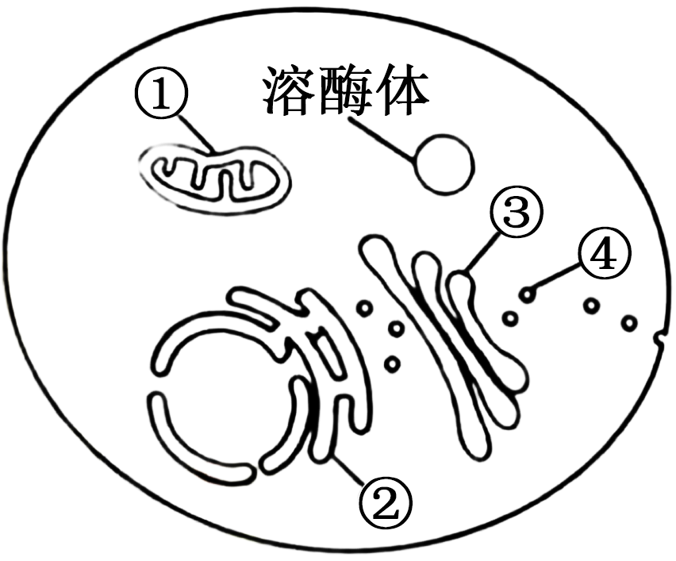
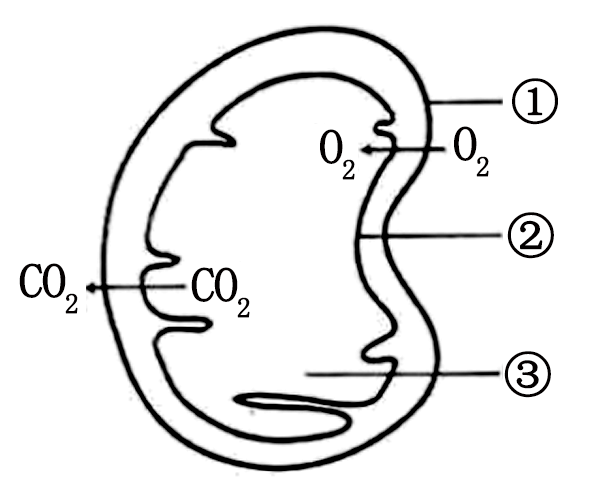
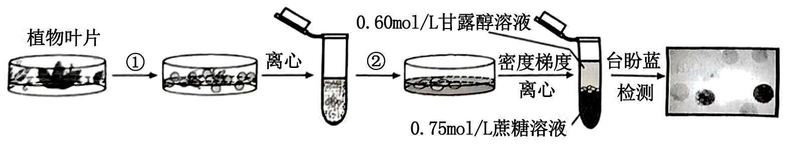
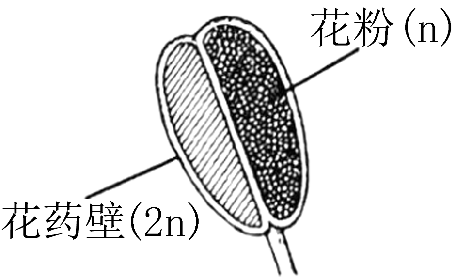
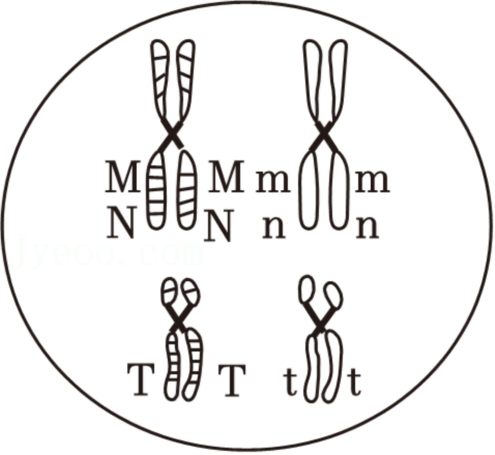
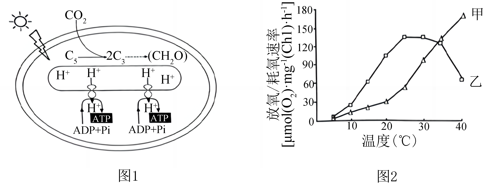
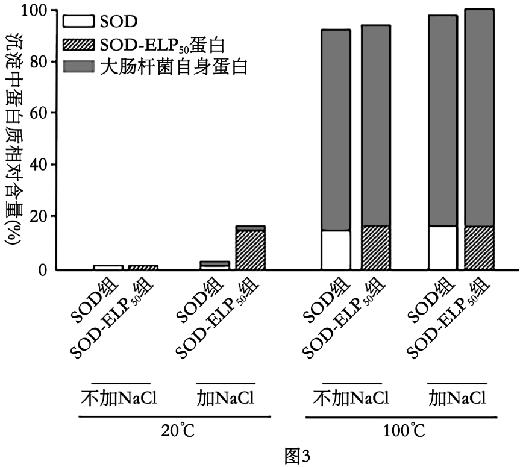

**2024年普通高等学校招生全国统一考试（江苏卷）**

**生物**

**注意事项**

**考生在答题前请认真阅读本注意事项及各题答题要求**

**1．本试卷共8页,满分为100分,考试时间为75分钟。考试结束后,错将本试卷和答题卡一并交回。**

**2．答题的，请务必将自己的姓名、准号证号用0.5毫米照色墨水的签字笔填写在试卷及答题卡的规定位置。**

**3．请认真核对监考员在答题卡上所粘贴的条形码上的姓名准考证号与本人是否相符。**

**4．作答选择题，必须用2B铅笔将答题卡上对应选项的方框涂满涂黑;如有改动，请用橡皮擦干净后,再选涂其他答案。作答非选择题,必须用0．5毫来黑色基水的签字笔在答题卡上的指定位置作答,在其他位置作答一律无效。**

**5．如需作图,必须用2B铅笔绘写清楚，线条、符号等须加黑,加粗。**

**一、单项选择题:共15题,每题2分,共30分。每题只有一个选项最符合题意。**

1\. 关于人体中肝糖原、脂肪和胃蛋白酶，下列叙述正确的是（ ）

A. 三者都含有的元素是C、H、O、N

B. 细胞中肝糖原和脂肪都是储能物质

C. 肝糖原和胃蛋白酶的基本组成单位相同

D. 胃蛋白酶能将脂肪水解为甘油和脂肪酸

2\. 图中①~④表示人体细胞的不同结构。下列相关叙述错误的是（ ）

A. ①~④构成细胞完整的生物膜系统

B. 溶酶体能清除衰老或损伤①②③

C. ③的膜具有一定的流动性

D. ④转运分泌蛋白与细胞骨架密切相关

3\. 某同学进行下列实验时，相关操作合理的是（ ）

A. 从试管取菌种前，先在火焰旁拔棉塞，再将试管口迅速通过火焰以灭菌

B. 观察黑藻的细胞质流动时，在高倍镜下先调粗准焦螺旋，再调细准焦螺旋

C. 探究温度对酶活性的影响时，先将酶与底物混合，然后在不同温度下水浴处理

D. 鉴定脂肪时，子叶临时切片先用体积分数为50%的乙醇浸泡，再用苏丹Ⅲ染液染色

4\. 为了防治莲藕食根金花虫，研究者在藕田套养以莲藕食根金花虫为食的泥鳅、黄鳝，并开展相关研究，结果见下表。下列相关叙述错误的是（ ）

|           |               |                                                              |
|:---------:|:-------------:|:------------------------------------------------------------:|
| 套养方式      | 莲藕食根金花虫防治率（%） | 藕增产率（%）                                                      |
| 单独套养泥鳅    | 81.3          | 82 |
| 单独套养黄鳝    | 75.7          | 3.6                                                          |
| 混合套养泥鳅和黄鳝 | 94.2          | 13.9                                                         |

A 混合套养更有利于防止莲藕食根金花虫、提高藕增产率

B. 3种套养方式都显著提高了食物链相邻营养级的能量传递效率

C. 混合套养中泥鳅和黄鳝因生态位重叠而存在竞争关系

D. 生物防治优化了生态系统的能量流动方向，提高了经济效益和生态效益

5\. 关于“探究植物生长调节剂对扦插枝条生根的作用”的实验，下列叙述正确的是（ ）

A. 选用没有芽的枝条进行扦插，以消除枝条中原有生长素对生根的影响

B. 扦插枝条应保留多个大叶片，以利用蒸腾作用促进生长调节剂的吸收

C. 对照组的扦插基质用珍珠岩，实验组的扦插基质用等体积的泥炭土

D. 用不同浓度的生长调节剂处理扦插枝条，也能获得相同的生根数

6\. 图中①~③表示一种细胞器的部分结构。下列相关叙述错误的是（ ）

A. 该细胞器既产生ATP也消耗ATP

B. ①②分布的蛋白质有所不同

C. 有氧呼吸第一阶段发生在③

D. ②、③分别是消耗O2、产生CO2的场所

7\. 有同学以紫色洋葱为实验材料，进行“观察植物细胞的质壁分离和复原”实验。下列相关叙述合理的是（ ）

A. 制作临时装片时，先将撕下的表皮放在载玻片上，再滴一滴清水，盖上盖玻片

B. 用低倍镜观察刚制成的临时装片，可见细胞多呈长条形，细胞核位于细胞中央

C. 用吸水纸引流使0.3g/mL蔗糖溶液替换清水，可先后观察到质壁分离和复原现象

D. 通过观察紫色中央液泡体积大小变化，可推测表皮细胞是处于吸水还是失水状态

8\. 图示甲、乙、丙3种昆虫的染色体组，相同数字标注的结构起源相同。下列相关叙述错误的是（ ）

甲 乙 丙

A. 相同数字标注结构上基因表达相同

B. 甲和乙具有生殖隔离现象

C. 与乙相比，丙发生了染色体结构变异

D. 染色体变异是新物种产生的方式之一

9\. 酵母菌是基因工程中常用的表达系统。下列相关叙述正确的是（ ）

A. 酵母菌培养液使用前要灭活所有细菌，但不能灭活真菌

B. 酵母菌真核细胞，需放置在CO2培养箱中进行培养

C. 可用稀释涂布平板法对酵母菌计数

D. 该表达系统不能对合成的蛋白质进行加工和修饰

10\. 图示为反射弧传导兴奋的部分结构，a、b表示轴突末梢。下列相关叙述错误的是（ ）

A. a、b可能来自同一神经元，也可能来自不同神经元

B. a、b释放的神经递质可能相同，也可能不同

C. a、b通过突触传递的兴奋都能经细胞膜传递到Ⅰ处

D. 脑和脊髓中都存在图示这种传导兴奋的结构

11\. 我国科学家利用人的体细胞制备多能干细胞，再用小分子TH34成功诱导衍生成胰岛B细胞。下列相关叙述错误的是（ ）

A. 基因选择性表达被诱导改变后，可使体细胞去分化成多能干细胞

B. 在小分子TH34诱导下，多能干细胞发生基因突变，获得胰岛素基因

C. 衍生的胰岛B细胞在葡萄糖的诱导下能表达胰岛素，才可用于移植治疗糖尿病

D. 若衍生的胰岛B细胞中凋亡基因能正常表达，细胞会发生程序性死亡

12\. 治疗恶性黑色素瘤药物DIC是一种嘌呤类生物合成的前体，能干扰嘌呤的合成。下列相关叙述错误的是（ ）

A. 嘌呤是细胞合成DNA和RNA的原料

B. DIC可抑制细胞增殖使其停滞在细胞分裂间期

C. 细胞中蛋白质的合成不会受DIC的影响

D. 采用靶向输送DIC可降低对患者的副作用

13\. 图示植物原生质体制备、分离和检测的流程。下列相关叙述正确的是（ ）

A. 步骤①添加盐酸以去除细胞壁

B. 步骤②吸取原生质体放入无菌水中清洗

C. 原生质体密度介于图中甘露醇和蔗糖溶液密度之间

D. 台盼蓝检测后应选择蓝色的原生质体继续培养

14\. 关于“利用乳酸菌发酵制作酸奶或泡菜”的实验，下列叙述正确的是（ ）

A. 制作泡菜的菜料不宜完全淹没在煮沸后冷却的盐水中

B. 制作酸奶的牛奶须经过高压蒸汽灭菌后再接种乳酸菌

C. 发酵装置需加满菜料或牛奶并封装，以抑制乳酸菌的无氧呼吸

D. 控制好发酵时间，以避免过量乳酸影响酸奶或泡菜的口味和品质

15\. 图示果蝇细胞中基因沉默蛋白（PcG）的缺失，引起染色质结构变化，导致细胞增殖失控形成肿瘤。下列相关叙述错误的是（ ）

A. PcG使组蛋白甲基化和染色质凝集，抑制了基因表达

B. 细胞增殖失控可由基因突变引起，也可由染色质结构变化引起

C. DNA和组蛋白的甲基化修饰都能影响细胞中基因的转录

D. 图示染色质结构变化也是原核细胞表观遗传调控的一种机制

**二、多项选择题：本部分包括4题，每题3分，共计12分。每题有不止一个选项符合题意。每题全选对者得3分，选对但不全的得1分，错选或不答的得0分。**

16\. 图示普通韭菜（2n=16）的花药结构。为了快速获得普通韭菜的纯系，科研人员利用其花药进行单倍体育种。下列相关叙述正确的有（ ）

A. 花粉细胞和花药壁细胞均具有全能性

B. 培养基中生长素与细胞分裂素的比例影响愈伤组织再分化

C. 镜检根尖分生区细胞的染色体，可鉴定出单倍体幼苗

D. 秋水仙素处理单倍体幼苗，所得植株的细胞中染色体数都是16

17\. 图示哺乳动物的一个细胞中部分同源染色体及其相关基因。下列相关叙述错误的有（ ）

A. 有丝分裂或减数分裂前，普通光学显微镜下可见细胞中复制形成的染色单体

B. 有丝分裂或减数分裂时，丝状染色质在纺锤体作用下螺旋化成染色体

C. 有丝分裂后期着丝粒分开，导致染色体数目及其3对等位基因数量加倍

D. 减数分裂Ⅰ完成时，能形成基因型为MmNnTt的细胞

18\. 神经元释放的递质引起骨骼肌兴奋，下列相关叙述正确的有（ ）

A. 该过程经历了“电信号→化学信号→电信号”的变化

B. 神经元处于静息状态时，其细胞膜内K+的浓度高于膜外

C. 骨骼肌细胞兴奋与组织液中Na+协助扩散进入细胞有关

D. 交感神经和副交感神经共同调节骨骼肌的收缩和舒张

19\. 从牛卵巢采集卵母细胞进行体外成熟培养，探究高温对卵母细胞成熟的影响，结果如图所示。下列相关叙述错误的有（ ）

A. 选取发育状态一致的卵母细胞进行培养

B. 体外培养卵母细胞时通常加入湿热灭菌后的血清

C. 对采集的卵母细胞传代培养以产生大量卵细胞

D. 体外培养时高温提高了卵母细胞发育的成熟率

**三、非选择题：本部分包括5题，共计58分。除标注外，每空1分**

20\. 科研人员对蓝细菌的光合放氧、呼吸耗氧和叶绿素a含量等进行了系列研究。图1是蓝细菌光合作用部分过程示意图，图2是温度对蓝细菌光合放氧和呼吸耗氧影响的曲线图。请回答下列问题：

（1）图1中H+从类囊体膜内侧到外侧只能通过ATP合酶，而O2能自由通过类囊体膜，说明类囊体膜具有的特性是\_\_\_\_\_\_\_\_。碳反应中C3在\_\_\_\_\_\_\_\_的作用下转变为（CH2O），此过程发生的区域位于蓝细菌的\_\_\_\_\_\_\_\_中。

（2）图2中蓝细菌光合放氧的曲线是\_\_\_\_\_\_\_\_（从“甲”“乙”中选填）；据图判断，总光合速率最高时对应的温度是（从“20℃”、“25℃”、“30℃”中选填），理由为\_\_\_\_\_\_\_\_。

（3）在一定条件下，测定样液中蓝细菌密度和叶绿素a含量，建立叶绿素a含量与蓝细菌密度的相关曲线，用于估算水体中蓝细菌密度。请完成下表：

|                   |                                         |
|:----------------- |:--------------------------------------- |
| 实验目的              | 简要操作步骤                                  |
| 测定样液蓝细菌数量         | 按一定浓度梯度稀释样液，分别用血细胞计数板计数，取样前需①\_\_\_\_\_ |
| 浓缩蓝细菌             | ②\_\_\_\_\_\_\_\_                       |
| ③\_\_\_\_\_\_\_\_ | 将浓缩的蓝细菌用一定量的乙醇重新悬浮                      |
| ④\_\_\_\_\_\_\_\_ | 用锡箔纸包裹装有悬浮液的试管，避光存放                     |
| 建立相关曲线            | 用分光光度计测定叶绿素a含量，计算                       |

21\. 某保护区地势较为平坦，植被类型属于热带稀树灌丛草原，生活着坡鹿、猛禽和蟒蛇等动物。请回答下列问题：

（1）坡鹿为珍稀保护动物，主要以草本植物的嫩叶为食。保护区工作人员有时在一定区域内采用火烧法加速牧草的更新繁盛，这种群落演替类型称为\_\_\_\_\_\_\_\_。科研人员对坡鹿在火烧地和非火烧地的采食与休息行为进行研究，结果如图1，形成该结果的原因是\_\_\_\_\_\_\_\_。

（2）保护区的草原上，植物个体常呈不均匀分布，这体现了群落水平结构的主要特征是\_\_\_\_\_\_\_\_。为了研究火烧法对植被的影响，科研人员采用样方法进行调查，群落结构越复杂，样方面积应越\_\_\_\_\_\_\_\_。

（3）为了研究坡鹿粪便对保护区土壤动物类群丰富度的影响，科研人员用吸虫器采集土壤样方中的动物后，常选用\_\_\_\_\_\_\_\_溶液固定保存。蚯蚓、蜈蚣等一些土壤动物可以作为中药材，这体现了生物多样性的\_\_\_\_\_\_\_\_价值。

（4）研究保护区内动物的食物结构，常用的方法有直接观察法、胃容物分析法、粪便分析法。若调查湖泊下层鱼类的食性，在上述方法中优先选用\_\_\_\_\_\_\_\_。对于食性庞杂的鱼类，可检测其所在水域中不同营养级生物体内稳定性同位素15N含量，从而判断该鱼类在生态系统中的营养地位，其依据的生态学原理是\_\_\_\_\_\_\_\_。

（5）科研人员在野外调查的基础上绘制了保护区食物网，部分结构如图2所示。相关叙述错误的有\_\_\_\_\_\_\_\_（填序号）。

①该图没有显示的生态系统成分是分解者

②动植物之间的营养关系主要包括种间关系和种内关系

③有的食虫鸟在相应食物链上为三级消费者、第四营养级

④采用标记重捕法可以精确掌握保护区坡鹿的种群密度

22\. 免疫检查点阻断疗法已应用于癌症治疗，机理如图1所示。为增强疗效，我国科学家用软件计算筛到Taltirelin（简称Tal），开展实验研究Tal与免疫检查分子抗体的联合疗效及其作用机制。请回答下列问题：

（1）肿瘤细胞表达能与免疫检查分子特异结合的配体，抑制T细胞的识别，实现免疫逃逸。据图1可知，以\_\_\_\_\_\_\_\_为抗原制备的免疫检查分子抗体可阻断肿瘤细胞与\_\_\_\_\_\_\_\_细胞的结合，解除肿瘤细胞的抑制。

（2）为评估Tal与免疫检查分子抗体的联合抗肿瘤效应，设置4组肿瘤小鼠，分别用4种溶液处理后检测肿瘤体积，结果如图2。设置缓冲液组的作用是\_\_\_\_\_\_\_\_。据图2可得出结论：\_\_\_\_\_\_\_\_。

（3）Tal是促甲状腺激素释放激素（TRH）类似物。人体内TRH促进\_\_\_\_\_\_\_\_分泌促甲状腺激素（TSH），TSH促进甲状腺分泌甲状腺激素。这些激素可通过\_\_\_\_\_\_\_\_运输，与靶细胞的受体特异结合，发挥调控作用。

（4）根据（3）的信息，检测发现T细胞表达TRH受体，树突状细胞（DC）表达TSH受体。综上所述，关于Tal抗肿瘤的作用机制，提出假设：

①Tal与\_\_\_\_\_\_\_\_结合，促进T细胞增殖及分化；

②Tal能促进\_\_\_\_\_\_\_\_，增强DC的吞噬及递呈能力，激活更多的T细胞。

（5）为验证上述假设，进行下列实验：①培养T细胞，分3组，分别添加缓冲液、Tal溶液和TRH溶液，检测\_\_\_\_\_\_\_\_；②培养DC，分3组，分别添加\_\_\_\_\_\_\_\_，检测DC的吞噬能力及递呈分子的表达量。

23\. 为了高效纯化超氧化物歧化酶（SOD），科研人员将ELP50片段插入pET-SOD构建重组质粒pET-SOD-ELP50，以融合表达SOD-ELP50蛋白，过程如图1。其中，ELP50是由人工合成的DNA片段，序列为：限制酶a识别序列-（GTTCCTGGTGTTGGC）50-限制酶b识别序列，50为重复次数。请回答下列问题：

（1）步骤①双酶切时，需使用的限制酶a和限制酶b分别是\_\_\_\_\_\_\_\_。

（2）步骤②转化时，科研人员常用\_\_\_\_\_\_\_\_处理大肠杆菌，使细胞处于感受态；转化后的大肠杆菌采用含有\_\_\_\_\_\_\_\_的培养基进行筛选。用PCR技术筛选成功导入pET-SOD-ELP50的大肠杆菌，应选用的一对引物是\_\_\_\_\_\_\_\_。

（3）步骤③大肠杆菌中RNA聚合酶与\_\_\_\_\_\_\_\_结合，驱动转录，翻译SOD-ELP50蛋白。已知蛋白质中氨基酸残基的平均相对分子质量约为0.11kDa，将表达的蛋白先进行凝胶电泳，然后用SOD抗体进行杂交，显示的条带应是\_\_\_\_\_\_\_\_（从图2的“A~D”中选填）。

（4）步骤④为探寻高效纯化SOD-ELP50蛋白的方法，科研人员研究了温度、NaCl对SOD-ELP50蛋白纯化效果的影响，部分结果如图3。

（ⅰ）20℃时，加入NaCl后实验结果是\_\_\_\_\_\_\_\_。

（ⅱ）100℃时，导致各组中所有蛋白都沉淀的原因是\_\_\_\_\_\_\_\_。

（ⅲ）据图分析，融合表达SOD-ELP50蛋白的优点有\_\_\_\_\_\_\_\_。

24\. 有一种植物的花色受常染色体上独立遗传的两对等位基因控制，有色基因B对白色基因b为显性，基因I存在时抑制基因B的作用，使花色表现为白色，基因i不影响基因B和b的作用。现有3组杂交实验，结果如下。请回答下列问题：

（1）甲和丙的基因型分别是\_\_\_\_\_\_\_\_、\_\_\_\_\_\_\_\_。

（2）组别①的F2中有色花植株有\_\_\_\_\_\_\_\_种基因型。若F2中有色花植株随机传粉，后代中白色花植株比例为\_\_\_\_\_\_\_\_。

（3）组别②的F2中白色花植株随机传粉，后代白色花植株中杂合子比例为\_\_\_\_\_\_\_\_。

（4）组别③的F1与甲杂交，后代表型及比例为\_\_\_\_\_\_\_\_。组别③的F1与乙杂交，后代表型及比例为\_\_\_\_\_\_\_\_。

（5）若这种植物性别决定类型为XY型，在X染色体上发生基因突变产生隐性致死基因k，导致合子致死。基因型为IiBbX+Y和IiBbX+Xk的植株杂交，F1中雌雄植株的表型及比例为\_\_\_\_\_\_\_\_；F1中有色花植株随机传粉，后代中有色花雌株比例为\_\_\_\_\_\_\_\_。
