**2024年普通高等学校招生全国统一考试（江苏卷）**

**生物**

**注意事项**

**考生在答题前请认真阅读本注意事项及各题答题要求**

**1．本试卷共8页,满分为100分,考试时间为75分钟。考试结束后,错将本试卷和答题卡一并交回。**

**2．答题的，请务必将自己的姓名、准号证号用0.5毫米照色墨水的签字笔填写在试卷及答题卡的规定位置。**

**3．请认真核对监考员在答题卡上所粘贴的条形码上的姓名准考证号与本人是否相符。**

**4．作答选择题，必须用2B铅笔将答题卡上对应选项的方框涂满涂黑;如有改动，请用橡皮擦干净后,再选涂其他答案。作答非选择题,必须用0．5毫来黑色基水的签字笔在答题卡上的指定位置作答,在其他位置作答一律无效。**

**5．如需作图,必须用2B铅笔绘写清楚，线条、符号等须加黑,加粗。**

**一、单项选择题:共15题,每题2分,共30分。每题只有一个选项最符合题意。**

1\. 关于人体中肝糖原、脂肪和胃蛋白酶，下列叙述正确的是（ ）

A. 三者都含有的元素是C、H、O、N

B. 细胞中肝糖原和脂肪都是储能物质

C. 肝糖原和胃蛋白酶的基本组成单位相同

D. 胃蛋白酶能将脂肪水解为甘油和脂肪酸

【答案】B

【解析】

【分析】1、糖类分为单糖、二糖和多糖，糖类是主要的能源物质，组成元素是C、H、O。

2、脂质分为脂肪、磷脂和固醇，固醇包括胆固醇、性激素、维生素D，磷脂的组成元素是C、H、O、N、P，脂肪的组成元素是C、H、O。

3、胃蛋白酶的本质是蛋白质。

【详解】A、肝糖原和脂肪只含有C、H、O，不含N元素，A错误；

B、动物细胞中特有的储能物质是肝糖原，动物细胞和植物细胞都含有的储能物质是脂肪，B正确；

C、肝糖原的基本组成单位是葡萄糖，胃蛋白酶的基本组成单位是氨基酸，C错误；

D、酶具有专一性，胃蛋白酶只能水解蛋白质，不能水解脂肪，D错误。

故选B。

2\. 图中①~④表示人体细胞的不同结构。下列相关叙述错误的是（ ）

A. ①~④构成细胞完整的生物膜系统

B. 溶酶体能清除衰老或损伤的①②③

C. ③的膜具有一定的流动性

D. ④转运分泌蛋白与细胞骨架密切相关

【答案】A

【解析】

【分析】图中①是线粒体，②是内质网，③是高尔基体，④是囊泡。

【详解】A、完整生物膜系统包括细胞膜、核膜和细胞器膜，而图中①是线粒体，②是内质网，③是高尔基体，④是囊泡，故①~④不能构成细胞完整的生物膜系统，A错误；

B、溶酶体能够清除衰老、受损的细胞器，所以能够清除衰老或损伤的①②③，B正确；

C、③高尔基体能够产生囊泡，膜具有一定流动性，C正确；

D、细胞骨架与物质运输有关，所以④囊泡转运分泌蛋白与细胞骨架密切相关，D正确。

故选A。

3\. 某同学进行下列实验时，相关操作合理的是（ ）

A. 从试管取菌种前，先在火焰旁拔棉塞，再将试管口迅速通过火焰以灭菌

B. 观察黑藻的细胞质流动时，在高倍镜下先调粗准焦螺旋，再调细准焦螺旋

C. 探究温度对酶活性的影响时，先将酶与底物混合，然后在不同温度下水浴处理

D. 鉴定脂肪时，子叶临时切片先用体积分数为50%的乙醇浸泡，再用苏丹Ⅲ染液染色

【答案】A

【解析】

【分析】在进行实验操作时，需要遵循正确的操作规范和原则，以保证实验的准确性和安全性。

【详解】 A 、从试管取菌种前，先在火焰旁拔棉塞，再将试管口迅速通过火焰，这样可以避免菌种被污染，A正确；

B、在高倍镜下观察时，只能调节细准焦螺旋，B错误；

C、探究温度对酶活性的影响时，应先将酶和底物分别在不同温度下处理，然后再混合，若先将酶与底物混合，再在不同温度下水浴处理，会在达到设定温度前就发生反应，影响实验结果，C错误；

D、鉴定脂肪时，子叶临时切片先用苏丹Ⅲ染液染色，然后用体积分数为50%的乙醇洗去浮色，D错误。

故选A。

4\. 为了防治莲藕食根金花虫，研究者在藕田套养以莲藕食根金花虫为食的泥鳅、黄鳝，并开展相关研究，结果见下表。下列相关叙述错误的是（ ）

|           |               |         |
|:---------:|:-------------:|:-------:|
| 套养方式      | 莲藕食根金花虫防治率（%） | 藕增产率（%） |
| 单独套养泥鳅    | 81.3          | 8.2     |
| 单独套养黄鳝    | 75.7          | 3.6     |
| 混合套养泥鳅和黄鳝 | 94.2          | 13.9    |

A. 混合套养更有利于防止莲藕食根金花虫、提高藕增产率

B. 3种套养方式都显著提高了食物链相邻营养级的能量传递效率

C. 混合套养中泥鳅和黄鳝因生态位重叠而存在竞争关系

D. 生物防治优化了生态系统的能量流动方向，提高了经济效益和生态效益

【答案】B

【解析】

【分析】由表可知混合套养泥鳅和黄鳝的防治率最高，达到94.2%，明显高于单独套养泥鳅或黄鳝的防治率。同时，混合套养的藕增产率也最高，为13.9%，高于单独套养泥鳅和单独套养黄鳝。

【详解】A、由表可知混合套养泥鳅和黄鳝的防治率明显高于单独套养泥鳅或黄鳝的防治率，同时，混合套养的藕增产率也高于单独套养泥鳅和单独套养黄鳝，因此混合套养更有利于防止莲藕食根金花虫、提高藕增产率，A正确；

B、虽然生物防治可以优化能量流动，但表格中的数据并没有直接显示能量传递效率的变化，能量传递效率通常是指能量从一个营养级传递到下一个营养级的效率，而表格中的数据只是防治率和增产率，并不能直接反映能量传递效率的提高，B错误；

C、泥鳅和黄鳝都以莲藕食根金花虫为食，可能会在资源获取上产生竞争，因此混合套养中泥鳅和黄鳝因生态位重叠而存在竞争关系，C正确；

D、生物防治通过利用天敌来控制害虫，优化了生态系统的能量流动方向，这有助于提高经济效益和生态效益，D正确。

故选B

5\. 关于“探究植物生长调节剂对扦插枝条生根的作用”的实验，下列叙述正确的是（ ）

A. 选用没有芽的枝条进行扦插，以消除枝条中原有生长素对生根的影响

B. 扦插枝条应保留多个大叶片，以利用蒸腾作用促进生长调节剂的吸收

C. 对照组的扦插基质用珍珠岩，实验组的扦插基质用等体积的泥炭土

D. 用不同浓度的生长调节剂处理扦插枝条，也能获得相同的生根数

【答案】D

【解析】

【分析】预实验是在正式实验之前，用标准物质或只用少量样品进行实验，以便摸出最佳的实验条件，为正式实验打下基础；预实验需要设置用蒸馏水处理的对照组。

【详解】A、本实验的自变量是植物生长调节剂的浓度，选用扦插的枝条长势和带有幼芽数量应大致相同，即保持无关变量相同且适宜，通常不用没有芽的枝条，因为芽能产生生长素促进扦插枝条生根，A错误；

B、扦插枝条应不带有叶片，这样可以降低蒸腾作用，避免枝条中水分过快减少，利于生根，B错误；

C、对照组的扦插基质用珍珠岩，实验组的扦插基质也应该用等体积的珍珠岩，保证无关变量相同且适宜，C错误；

D、用不同浓度的生长调节剂处理扦插枝条，也能获得相同的生根数，因为植物生长调节剂对扦插枝条生根的作用表现为两重性，D正确。

故选D。

6\. 图中①~③表示一种细胞器的部分结构。下列相关叙述错误的是（ ）

A. 该细胞器既产生ATP也消耗ATP

B. ①②分布的蛋白质有所不同

C. 有氧呼吸第一阶段发生在③

D. ②、③分别是消耗O2、产生CO2的场所

【答案】C

【解析】

【分析】图中所示为线粒体的结构，①是线粒体外膜，②是线粒体内膜，③是线粒体基质。

【详解】A、线粒体是有氧呼吸的主要场所，可以分解有机物产生ATP，同时在线粒体内部可以合成蛋白质、DNA等，需要消耗ATP，A正确；

B、线粒体外膜和内膜功能不同，所以分布的蛋白质有所不同，B正确；

C、有氧呼吸第一阶段发生在细胞质基质，③是线粒体基质，C错误；

D、②是线粒体内膜，消耗O2，和\[H\]生成水，③是线粒体基质，在该场所丙酮酸和水反应生成CO2，D正确。

故选C。

7\. 有同学以紫色洋葱为实验材料，进行“观察植物细胞的质壁分离和复原”实验。下列相关叙述合理的是（ ）

A. 制作临时装片时，先将撕下的表皮放在载玻片上，再滴一滴清水，盖上盖玻片

B. 用低倍镜观察刚制成的临时装片，可见细胞多呈长条形，细胞核位于细胞中央

C. 用吸水纸引流使0.3g/mL蔗糖溶液替换清水，可先后观察到质壁分离和复原现象

D. 通过观察紫色中央液泡体积大小变化，可推测表皮细胞是处于吸水还是失水状态

【答案】D

【解析】

【分析】“观察植物细胞的质壁分离和复原”实验原理：原生质层（细胞膜、液泡膜、两层膜之间细胞质）相当于半透膜， 当外界溶液的浓度大于细胞液浓度时，细胞将失水，原生质层和细胞壁都会收缩，但原生质层伸缩性比细胞壁大，所以原生质层就会与细胞壁分开，发生“质壁分离”。反之，当外界溶液的浓度小于细胞液浓度时，细胞将吸水，原生质层会慢慢恢复原来状态，使细胞发生“质壁分离复原”。

材料用具：紫色洋葱表皮，0.3g/ml蔗糖溶液，清水，载玻片，镊子，滴管，显微镜等。

方法步骤：（1）制作洋葱表皮临时装片。（2）低倍镜下观察原生质层位置。 （3）在盖玻片一侧滴一滴蔗糖溶液，另一侧用吸水纸吸，重复几次，让洋葱表皮浸润在蔗糖溶液中。（4）低倍镜下观察原生质层位置、细胞大小变化（变小），观察细胞是否发生质壁分离。 （5）在盖玻片一侧滴一滴清水，另一侧用吸水纸吸，重复几次，让洋葱表皮浸润在清水中。 （6）低倍镜下观察原生质层位置、细胞大小变化（变大），观察是否质壁分离复原。

【详解】A、制作临时装片时，通常是先滴一滴清水在载玻片上，然后将撕下的表皮放在清水上，再盖上盖玻片，A错误；

B、用低倍镜观察刚制成的临时装片时，细胞核通常位于细胞的一侧，而不是中央，B错误；

C.、用吸水纸引流蔗糖溶液替换清水，可以观察到质壁分离现象，但要观察复原现象需要重新用清水替换蔗糖溶液，C错误；

D、当液泡体积变大，说明细胞吸水，液泡体积变小，说明细胞失水，所以通过观察紫色中央液泡体积大小变化，可推测表皮细胞是处于吸水还是失水状态，D正确。

故选D。

8\. 图示甲、乙、丙3种昆虫的染色体组，相同数字标注的结构起源相同。下列相关叙述错误的是（ ）

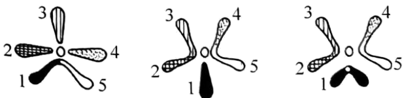

甲 乙 丙

A. 相同数字标注结构上基因表达相同

B. 甲和乙具有生殖隔离现象

C. 与乙相比，丙发生了染色体结构变异

D. 染色体变异是新物种产生的方式之一

【答案】A

【解析】

【分析】染色体组是指细胞中系接近的类群之间在自然条件下不交配，或者即使能交配也不能产生后代或不能产生可育性后代的隔离机制。 染色体变异包括染色体结构变异和染色体数目变异，是生物进化和新物种产生的重要因素之一。

【详解】A、相同数字标注结构上基因表达不一定相同，基因的表达受到多种因素的调控，如基因的甲基化、组蛋白修饰、转录因子等，A错误；

B、甲和乙染色体组不同，存在较大差异，具有生殖隔离现象，B正确；

C、与乙相比，丙的染色体结构发生了明显变化，标号为1 的染色体形态结构不同，发生了染色体结构变异，C正确；

D、染色体变异可以为生物进化提供原材料，是新物种产生的方式之一，D正确。

故选A。

9\. 酵母菌是基因工程中常用的表达系统。下列相关叙述正确的是（ ）

A. 酵母菌培养液使用前要灭活所有细菌，但不能灭活真菌

B. 酵母菌是真核细胞，需放置在CO2培养箱中进行培养

C. 可用稀释涂布平板法对酵母菌计数

D. 该表达系统不能对合成的蛋白质进行加工和修饰

【答案】C

【解析】

【分析】 微生物常见的接种的方法：

（1）平板划线法：把混杂在一起的微生物或同一微生物群体中的不同细胞用接种环在平板培养基，通过分区划线稀释而得到较多独立分布的单个细胞，经培养后生长繁殖成单菌落，通常把这种单菌落当作待分离微生物的纯种。

（2）稀释涂布平板法：将菌液进行一系列的梯度稀释，然后将不同稀释度的菌液分别涂布到琼脂固体培养基的表面，进行培养。在稀释度足够高的菌液里，聚集在一起的微生物将被分散成单个细胞，从而能在培养基表面形成单个的菌落。

【详解】A、酵母菌培养液使用前要灭活所有细菌和真菌，A错误；

B、将含有酵母菌的培养基放置在28℃恒温培养箱中进行培养，B错误；

C、稀释涂布平板法常用来统计样品中活菌的数目，当样品的稀释度足够高时，培养基表面生长的个单菌落，来源于样品稀释液中的一个活菌。通过统计平板上的菌落数，就能推测出样品中大约含有多少活菌，由此可知，可用稀释涂布平板法对酵母菌计数，C正确；

D、酵母菌是真核细胞，具有高尔基体和内质网，可以对合成的蛋白质进行加工和修饰，D错误。

故选C。

10\. 图示为反射弧传导兴奋的部分结构，a、b表示轴突末梢。下列相关叙述错误的是（ ）

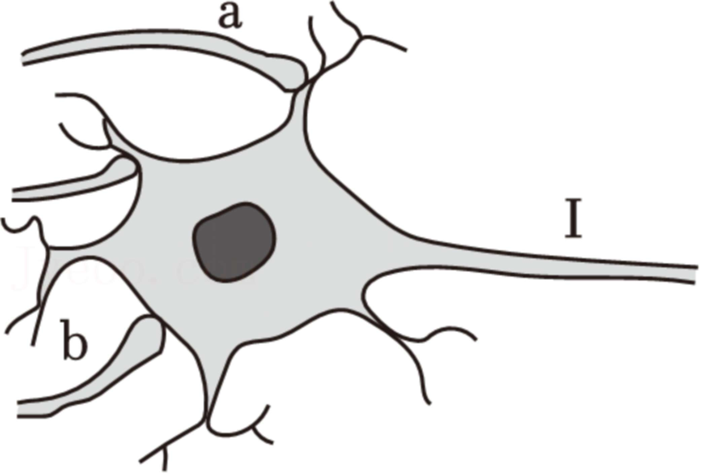

A. a、b可能来自同一神经元，也可能来自不同神经元

B. a、b释放的神经递质可能相同，也可能不同

C. a、b通过突触传递的兴奋都能经细胞膜传递到Ⅰ处

D. 脑和脊髓中都存在图示这种传导兴奋的结构

【答案】C

【解析】

【分析】反射弧包括感受器、传入神经、神经中枢、传出神经、效应器五部分。突触是指神经元与神经元之间相互接触并传递信息的部位。由于神经递质只存在于突触小体的突触小泡中，只能由突触前膜释放作用于突触后膜，使下一个神经元产生兴奋或抑制，因此兴奋在神经元之间的传递只能是单向的。

【详解】A、一个神经元只有一个轴突，但轴突上存在多个神经末梢，a、b可能来自同一神经元，也可能来自不同神经元，A正确；

B、若a、b来自不同细胞的轴突，分别作用于同一个神经元的树突和胞体，二者释放的递质不干扰，可能相同，也可能不同，B正确；

C、a、b产生的兴奋通过神经递质传至至突触后膜，如果释放的是抑制性递质，则不能传递至I处，C错误；

D、脑和脊髓中都存在由多个神经元构成的突触结构，即都存在图示这种传导兴奋的结构，D正确。

故选C。

11\. 我国科学家利用人的体细胞制备多能干细胞，再用小分子TH34成功诱导衍生成胰岛B细胞。下列相关叙述错误的是（ ）

A. 基因选择性表达被诱导改变后，可使体细胞去分化成多能干细胞

B. 在小分子TH34诱导下，多能干细胞发生基因突变，获得胰岛素基因

C. 衍生的胰岛B细胞在葡萄糖的诱导下能表达胰岛素，才可用于移植治疗糖尿病

D. 若衍生的胰岛B细胞中凋亡基因能正常表达，细胞会发生程序性死亡

【答案】B

【解析】

【分析】诱导多能干细胞（iPS细胞）：通过特定的因子导入和培养条件，可以从人的皮肤等体细胞出发，诱导其成为具有无限增殖能力并可分化为人体各种组织脏器的多能干细胞。

在正常情况下，胰岛B细胞对血糖水平的变化非常敏感，能够根据血糖水平的高低调节胰岛素的分泌。当血糖水平升高时，胰岛B细胞会增加胰岛素的分泌，帮助降低血糖水平；反之，当血糖水平降低时，则减少胰岛素的分泌，以避免低血糖。

细胞凋亡指为维持内环境稳定，由基因控制的细胞自主的有序的死亡。细胞凋亡与细胞坏死不同，细胞凋亡不是一件被动的过程，而是主动过程，它涉及一系列基因的激活、表达以及调控等的作用，它并不是病理条件下，自体损伤的一种现象，而是为更好地适应生存环境而主动争取的一种死亡过程。

【详解】A、被诱导改变后，可使体细胞去分化成多能干细胞 这个说法是正确的。体细胞可以通过特定的因子导入和培养条件，基因的调控和表达模式的改变，使得原本专一功能的体细胞去分化成为多能干细胞，A正确；

B、小分子药物通常是通过调节现有的生物通路和基因表达来实现其功能，而胰岛素基因在人体所有细胞中都存在，但只有在胰岛细胞中才会表达‌，所以多能干细胞在诱导分化的过程中不会突然发生基因突变获得胰岛素基因，B错误；

C、胰岛B细胞在较高的血糖浓度下分泌胰岛素，降低血糖，所以衍生的胰岛B细胞需在葡萄糖的诱导下成功表达胰岛素，以确保衍生的胰岛B细胞能够正常发挥功能，才可用于移植治疗糖尿病，C正确；

D、凋亡基因的正常表达会导致衍生的胰岛B细胞发生程序性死亡，也就是发生细胞凋亡，D正确。

故选B。

12\. 治疗恶性黑色素瘤的药物DIC是一种嘌呤类生物合成的前体，能干扰嘌呤的合成。下列相关叙述错误的是（ ）

A. 嘌呤是细胞合成DNA和RNA的原料

B. DIC可抑制细胞增殖使其停滞在细胞分裂间期

C. 细胞中蛋白质的合成不会受DIC的影响

D. 采用靶向输送DIC可降低对患者的副作用

【答案】C

【解析】

【分析】DIC能干扰嘌呤的合成，而嘌呤是合成核酸的原料，细胞分裂间期细胞进行DNA的复制和蛋白质的合成。

【详解】A、DNA和RNA都含有腺嘌呤和鸟嘌呤，所以是嘌呤细胞合成DNA和RNA的原料，A正确；

B、细胞增殖间期，进行DNA的复制，DIC能干扰嘌呤的合成，从而阻止DNA的复制，使其停滞在细胞分裂间期，B正确；

C、DIC能干扰嘌呤的合成，阻止RNA的合成，因此会影响细胞中蛋白质的合成，C错误；

D、采用靶向输送DIC避免对其他正常细胞造成干扰，可降低对患者的副作用。D正确。

故选C。

13\. 图示植物原生质体制备、分离和检测的流程。下列相关叙述正确的是（ ）

A. 步骤①添加盐酸以去除细胞壁

B. 步骤②吸取原生质体放入无菌水中清洗

C. 原生质体密度介于图中甘露醇和蔗糖溶液密度之间

D. 台盼蓝检测后应选择蓝色的原生质体继续培养

【答案】C

【解析】

【分析】植物的体细胞杂交是将不同植物的细胞通过细胞融合技术形成杂种细胞，进而利用植物的组织培养将杂种细胞培育成多倍体的杂种植株。植物体细胞杂交依据的原理是细胞膜的流动性和植物细胞的全能性。

【详解】A、步骤①添加纤维素酶或果胶酶去除细胞，其原理是酶的专一性，A错误；

B、步骤②吸取原生质体放入等渗液中清洗，否则会导致原生质体吸水涨破，B错误；

C、结合图示可知原生质体处于甘露醇和蔗糖溶液之间，因而可推测原生质体的密度介于图中甘露醇和蔗糖溶液密度之间，C正确；

D、台盼蓝检测后应选择无色的原生质体继续培养，染成蓝色的原生质体活性差或死亡，D错误。

故选C。

14\. 关于“利用乳酸菌发酵制作酸奶或泡菜”的实验，下列叙述正确的是（ ）

A. 制作泡菜的菜料不宜完全淹没在煮沸后冷却的盐水中

B. 制作酸奶的牛奶须经过高压蒸汽灭菌后再接种乳酸菌

C. 发酵装置需加满菜料或牛奶并封装，以抑制乳酸菌的无氧呼吸

D. 控制好发酵时间，以避免过量乳酸影响酸奶或泡菜的口味和品质

【答案】D

【解析】

【分析】泡菜制作过程中，乳酸发酵过程即为乳酸菌进行无氧呼吸产生乳酸的过程。

【详解】A、制作泡菜是利用乳酸菌无氧呼吸产生乳酸，所以为制造无氧环境，制作泡菜的菜料要完全淹没在煮沸后冷却的盐水，A错误；

B、制作酸奶时，将牛奶倒入灭菌后的奶瓶中，倒入的奶液量不要超过奶瓶容积的2/3，再将牛奶加热至90 ℃，保温5 min，或将牛奶置于80 ℃恒温水浴箱中 15 min。如果采用市售未开封的鲜奶,可直接使用，不需要灭菌，B错误；

C、发酵时菜料装至八成满，然后加盐水，以利于乳酸菌的无氧呼吸，C错误；

D、制作酸奶或泡菜时，控制好发酵时间，以避免过量乳酸影响酸奶或泡菜的口味和品质，D正确。

故选D。

15\. 图示果蝇细胞中基因沉默蛋白（PcG）的缺失，引起染色质结构变化，导致细胞增殖失控形成肿瘤。下列相关叙述错误的是（ ）

A. PcG使组蛋白甲基化和染色质凝集，抑制了基因表达

B. 细胞增殖失控可由基因突变引起，也可由染色质结构变化引起

C. DNA和组蛋白的甲基化修饰都能影响细胞中基因的转录

D. 图示染色质结构变化也是原核细胞表观遗传调控的一种机制

【答案】D

【解析】

【分析】表观遗传是指DNA序列不发生变化,但基因的表达却发生了可遗传的改变,即基因型未发生变化而表现型却发生了改变,如DNA的甲基化,甲基化的基因不能与RNA聚合酶结合,故无法进行转录产生mRNA,也就无法进行翻译,最终无法合成相应蛋白,从而抑制了基因的表达。

【详解】A、PcG使组蛋白甲基化和染色质凝集，影响RNA聚合酶与DNA分子的结合，抑制了基因表达，A正确；

B、细胞增殖失控可由基因突变（如原癌基因和抑癌基因发生突变）引起；根据题意“基因沉默蛋白（PcG）的缺失，引起染色质结构变化，导致细胞增殖失控形成肿瘤”可知，也可由染色质结构变化引起，B正确；

C、DNA和组蛋白的甲基化修饰属于表观遗传，都能影响细胞中基因的转录，C正确；

D、原核细胞没有染色质，D错误。

故选D。

**二、多项选择题：本部分包括4题，每题3分，共计12分。每题有不止一个选项符合题意。每题全选对者得3分，选对但不全的得1分，错选或不答的得0分。**

16\. 图示普通韭菜（2n=16）的花药结构。为了快速获得普通韭菜的纯系，科研人员利用其花药进行单倍体育种。下列相关叙述正确的有（ ）

A. 花粉细胞和花药壁细胞均具有全能性

B. 培养基中生长素与细胞分裂素的比例影响愈伤组织再分化

C. 镜检根尖分生区细胞的染色体，可鉴定出单倍体幼苗

D. 秋水仙素处理单倍体幼苗，所得植株的细胞中染色体数都是16

【答案】ABC

【解析】

【分析】生长素与细胞分裂素的用量比值高，有利于根的分化，抑制芽的形成；用量比值低，有利于芽的分化，抑制根的形成；用量比值适中，促进愈伤组织的形成。

【详解】A、花粉细胞含有一个完整的染色体组，花药壁细胞含有2个染色体组，都含有该生物生长发育繁殖的全部遗传信息，均具有全能性，A正确；

B、愈伤组织再分化过程中，如果细胞分裂素和生长素同时使用，且生长素用量较高，有利于根的分化、抑制芽的形成，如果同时使用，且细胞分裂素用量较高，有利于芽的分化、抑制根的形成，所以培养基中生长素和细胞分裂素的比例将影响愈伤组织分化的方向，B正确；

C、单倍体幼苗细胞含有的染色体数目减半，因此可镜检根尖分生区细胞的染色体，鉴定出单倍体幼苗，C正确；

D、秋水仙素处理单倍体幼苗，可能有些细胞染色体数目没有加倍，只含有8条，D错误。

故选ABC。

17\. 图示哺乳动物的一个细胞中部分同源染色体及其相关基因。下列相关叙述错误的有（ ）

A. 有丝分裂或减数分裂前，普通光学显微镜下可见细胞中复制形成的染色单体

B. 有丝分裂或减数分裂时，丝状染色质在纺锤体作用下螺旋化成染色体

C. 有丝分裂后期着丝粒分开，导致染色体数目及其3对等位基因数量加倍

D. 减数分裂Ⅰ完成时，能形成基因型为MmNnTt的细胞

【答案】ABC

【解析】

【分析】在细胞分裂过程中，染色质会在特定时期螺旋化形成染色体。有丝分裂和减数分裂是细胞分裂的重要方式，涉及染色体的行为和基因的遗传规律。

【详解】A、在有丝分裂或减数分裂前的间期，染色质进行复制，但此时形成的染色单体在普通光学显微镜下不可见，A错误；

B、纺锤体的作用是牵引染色体运动，而不是使丝状染色质螺旋化成染色体，染色质螺旋化是自身的变化，B错误；

C、有丝分裂后期着丝粒分开，姐妹染色单体分离，导致染色体数目加倍，但基因数量不变，C错误；

D、在减数分裂Ⅰ前期，同源染色体的非姐妹染色单体可能会发生交叉互换，增加了配子基因组合的多样性，所以减数分裂Ⅰ完成时能形成能形成基因型为MmNnTt的细胞，D正确。

故选ABC。

18\. 神经元释放的递质引起骨骼肌兴奋，下列相关叙述正确的有（ ）

A. 该过程经历了“电信号→化学信号→电信号”的变化

B. 神经元处于静息状态时，其细胞膜内K+的浓度高于膜外

C. 骨骼肌细胞兴奋与组织液中Na+协助扩散进入细胞有关

D. 交感神经和副交感神经共同调节骨骼肌的收缩和舒张

【答案】BC

【解析】

【分析】静息时，神经细胞膜对钾离子的通透性大，钾离子大量外流，形成内负外正的静息电位；受到刺激后，神经细胞膜的通透性发生改变，对钠离子的通透性增大，因此形成内正外负的动作电位。兴奋部位和非兴奋部位形成电位差，产生局部电流，兴奋就以电信号的形式传递下去，但在神经元之间以神经递质的形式传递。

【详解】A、“神经元释放的递质引起骨骼肌兴奋”，由于神经递质已由突触前膜释放，故该过程经历了“化学信号→电信号”的变化，A错误；

B、无论神经元处于静息状态还是动作电位时，其细胞膜内K+的浓度均高于膜外，B正确；

C、受到刺激后，神经细胞膜的通透性发生改变，对钠离子的通透性增大，因此形成内正外负的动作电位，由此可知，骨骼肌细胞兴奋与组织液中Na+协助扩散进入细胞有关，C正确；

D、交感神经和副交感神经属于自主神经系统，自主神经系统是支配内脏、血管和腺体的传出神经，骨骼肌的收缩和舒张不受自主神经系统的调节，D错误。

故选BC

19\. 从牛卵巢采集卵母细胞进行体外成熟培养，探究高温对卵母细胞成熟的影响，结果如图所示。下列相关叙述错误的有（ ）

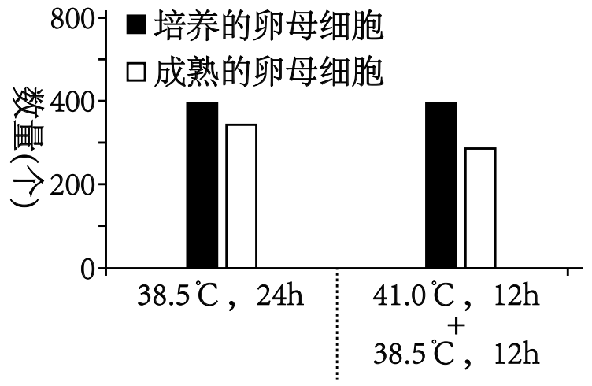

A. 选取发育状态一致的卵母细胞进行培养

B. 体外培养卵母细胞时通常加入湿热灭菌后的血清

C. 对采集的卵母细胞传代培养以产生大量卵细胞

D. 体外培养时高温提高了卵母细胞发育的成熟率

【答案】BCD

【解析】

【分析】在探究高温对卵母细胞成熟的影响实验中，需要控制变量，选取发育状态一致的卵母细胞进行培养，以确保实验结果的准确性。血清可以为卵母细胞的培养提供营养物质。

【详解】A、选取发育状态一致的卵母细胞进行培养，这样可以排除其他因素的干扰，保证实验结果是由温度这一变量引起的，A正确；

B、体外培养卵母细胞时通常加入血清，但是动物血清并不能进行湿热灭菌，否则会使其中部分有效成分失活，B错误；

C、卵母细胞不能进行传代培养，因为卵母细胞是生殖细胞，不具有连续分裂的能力，C错误；

D、由图可知，高温降低了卵母细胞发育的成熟率，而不是提高，D错误。

故选BCD。

**三、非选择题：本部分包括5题，共计58分。除标注外，每空1分**

20\. 科研人员对蓝细菌的光合放氧、呼吸耗氧和叶绿素a含量等进行了系列研究。图1是蓝细菌光合作用部分过程示意图，图2是温度对蓝细菌光合放氧和呼吸耗氧影响的曲线图。请回答下列问题：

（1）图1中H+从类囊体膜内侧到外侧只能通过ATP合酶，而O2能自由通过类囊体膜，说明类囊体膜具有的特性是\_\_\_\_\_\_\_\_。碳反应中C3在\_\_\_\_\_\_\_\_的作用下转变为（CH2O），此过程发生的区域位于蓝细菌的\_\_\_\_\_\_\_\_中。

（2）图2中蓝细菌光合放氧的曲线是\_\_\_\_\_\_\_\_（从“甲”“乙”中选填）；据图判断，总光合速率最高时对应的温度是（从“20℃”、“25℃”、“30℃”中选填），理由为\_\_\_\_\_\_\_\_。

（3）在一定条件下，测定样液中蓝细菌密度和叶绿素a含量，建立叶绿素a含量与蓝细菌密度的相关曲线，用于估算水体中蓝细菌密度。请完成下表：

|                   |                                         |
|:----------------- |:--------------------------------------- |
| 实验目的              | 简要操作步骤                                  |
| 测定样液蓝细菌数量         | 按一定浓度梯度稀释样液，分别用血细胞计数板计数，取样前需①\_\_\_\_\_ |
| 浓缩蓝细菌             | ②\_\_\_\_\_\_\_\_                       |
| ③\_\_\_\_\_\_\_\_ | 将浓缩的蓝细菌用一定量的乙醇重新悬浮                      |
| ④\_\_\_\_\_\_\_\_ | 用锡箔纸包裹装有悬浮液的试管，避光存放                     |
| 建立相关曲线            | 用分光光度计测定叶绿素a含量，计算                       |

【答案】（1） ①. 选择透过性 ②. ATP、NADPH和酶 ③. 细胞质基质

（2） ①. 乙 ②. 30℃ ③. 总光合速率=呼吸速率+净光合速率，三种温度条件下相比较，此时净光合速率和呼吸速率均较大

（3） ①. 摇匀 ②. 稀释样液离心，取下层沉淀物 ③. 提取叶绿素 ④. 防止叶绿素降解

【解析】

【分析】**【关键能力】**

**（1）信息获取与加工**

|                       |                                                                      |                                        |
|:---------------------:|:--------------------------------------------------------------------:|:--------------------------------------:|
| **题干关键信息**            | **所学知识**                                                             | **信息加工**                               |
| 蓝细菌的光合作用              | 光反应产生的ATP、NADPH用于暗反应，光合作用发生在叶绿体中                                     | 光合细菌是原核生物，没有叶绿体结构，其光合作用在相应结构完成         |
| 建立叶绿素a含量与蓝细菌密度关系的数学模型 | 体积微小的生物可用显微镜直接计数法计数；离心可分离不同密度的物质或结构；色素可溶于无水乙醇，可用无水乙醇提取色素；离体的叶绿素见光会分解 | 要建立叶绿素a含量与蓝细菌密度的数学模型，则要测定细胞数和叶绿素含量两套数据 |

**（2）逻辑线梳理：**

【小问1详解】

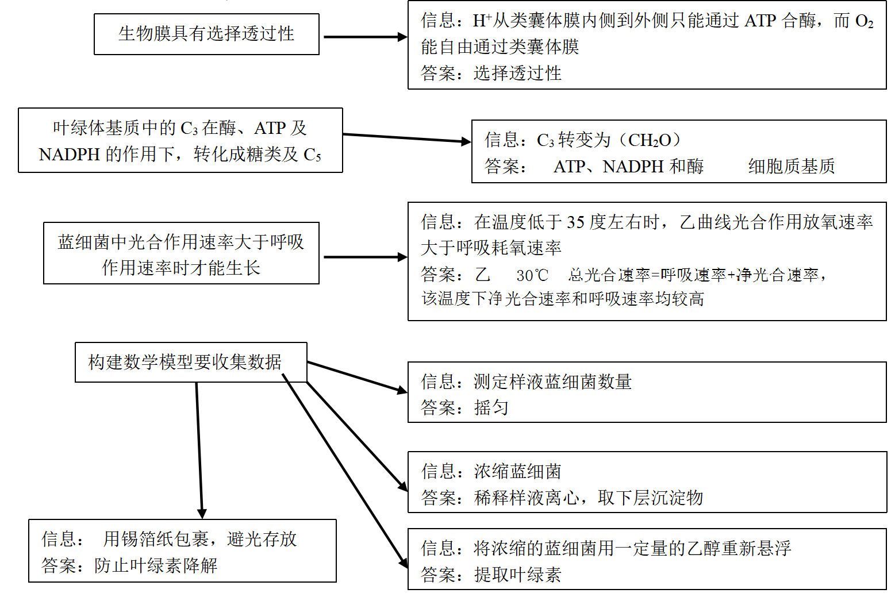类囊体膜允许某些物质通过，而限制另一些物质通过，这体现了类囊体膜具有选择透过性。碳反应中，C3在ATP、NADPH和酶的作用下，三碳化合物被还原为糖类等有机物，蓝细菌是原核生物，此过程发生在蓝细菌的细胞质基质中。

【小问2详解】

光合作用产生氧气，而呼吸作用消耗氧气。一般来说，光合作用在一定温度范围内随温度升高而增强，产生的氧气增多；呼吸作用在一定温度范围内随温度升高而增强，消耗的氧气增多。但通常光合作用产生氧气的量大于呼吸作用消耗氧气的量，这样 植物才能积累有机物，正常生长，所以图2中蓝细菌光合放氧的曲线是乙。总光合速率=呼吸速率+净光合速率，三种温度条件下相比较，30℃时净光合速率和呼吸速率均较大，所以此时总光合速率较高。

【小问3详解】

第一步：测定样液蓝细菌密度时，取样前需摇匀，以保证计数的准确性。

第二步：浓缩蓝细菌，将稀释样液离心，取下层沉淀物。

第三步：将浓缩的蓝细菌用一定量的乙醇重新悬浮，是为了提取叶绿素 。

第四步：用锡箔纸包裹装有悬浮液的试管，避光存放，以防止叶绿素降解。

21\. 某保护区地势较为平坦，植被类型属于热带稀树灌丛草原，生活着坡鹿、猛禽和蟒蛇等动物。请回答下列问题：

（1）坡鹿为珍稀保护动物，主要以草本植物的嫩叶为食。保护区工作人员有时在一定区域内采用火烧法加速牧草的更新繁盛，这种群落演替类型称为\_\_\_\_\_\_\_\_。科研人员对坡鹿在火烧地和非火烧地的采食与休息行为进行研究，结果如图1，形成该结果的原因是\_\_\_\_\_\_\_\_。

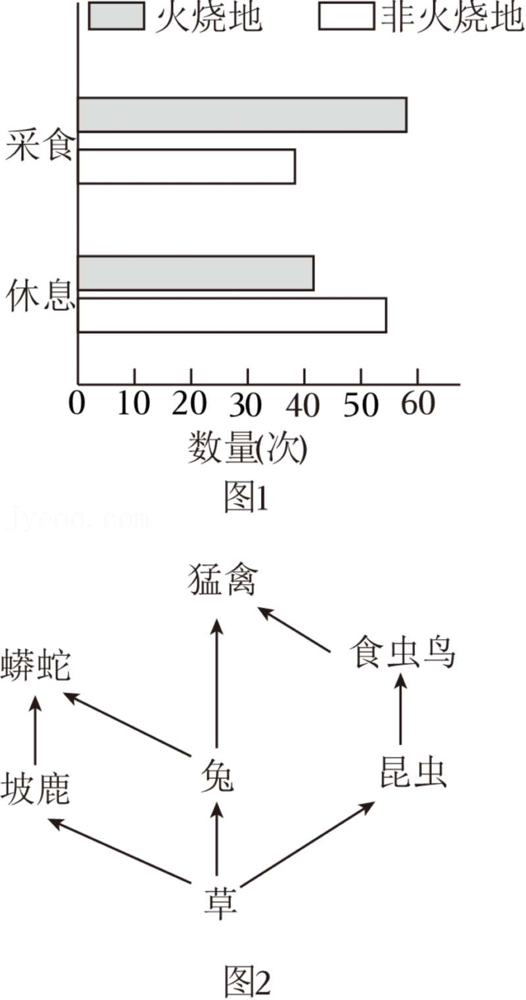

（2）保护区的草原上，植物个体常呈不均匀分布，这体现了群落水平结构的主要特征是\_\_\_\_\_\_\_\_。为了研究火烧法对植被的影响，科研人员采用样方法进行调查，群落结构越复杂，样方面积应越\_\_\_\_\_\_\_\_。

（3）为了研究坡鹿粪便对保护区土壤动物类群丰富度的影响，科研人员用吸虫器采集土壤样方中的动物后，常选用\_\_\_\_\_\_\_\_溶液固定保存。蚯蚓、蜈蚣等一些土壤动物可以作为中药材，这体现了生物多样性的\_\_\_\_\_\_\_\_价值。

（4）研究保护区内动物的食物结构，常用的方法有直接观察法、胃容物分析法、粪便分析法。若调查湖泊下层鱼类的食性，在上述方法中优先选用\_\_\_\_\_\_\_\_。对于食性庞杂的鱼类，可检测其所在水域中不同营养级生物体内稳定性同位素15N含量，从而判断该鱼类在生态系统中的营养地位，其依据的生态学原理是\_\_\_\_\_\_\_\_。

（5）科研人员在野外调查的基础上绘制了保护区食物网，部分结构如图2所示。相关叙述错误的有\_\_\_\_\_\_\_\_（填序号）。

①该图没有显示的生态系统成分是分解者

②动植物之间的营养关系主要包括种间关系和种内关系

③有的食虫鸟在相应食物链上为三级消费者、第四营养级

④采用标记重捕法可以精确掌握保护区坡鹿的种群密度

【答案】（1） ①. 次生演替 ②. 坡鹿在火烧地采食次数多，是因为火烧 地为坡鹿提供草本植物的嫩叶，而在非火烧地休息次数 多，是因为灌木和稀少的树木能提供很好的隐蔽保护

（2） ①. 镶嵌分布 ②. 大

（3） ①. 体积分数 70%酒精 ②. 直接

（4） ①. 胃内容物分析法 ②. 15N 含量随营养级升高而增加（生物富集） （5）①②④

【解析】

【分析】**【关键能力】**

**（1）信息获取与加工**

|                                                 |                                                           |                                   |
|:-----------------------------------------------:|:---------------------------------------------------------:|:---------------------------------:|
| **题干关键信息**                                      | **所学知识**                                                  | **信息加工**                          |
| 群落的结构及演替                                        | 群落结构分水平结构和垂直结构，垂直结构体现分层特点，水平结构体现镶嵌特点；群落的演替分初生演替和次生演替      | 演替后群落与演替前群落结构发生变化，生物的活动也随之发生变化    |
| 固定保存生物样本及生物多样性的价值                               | 用取样器取样法采集动物样本时，要用70%的酒精固定样本，防止腐败；生物多位性有直接价值、间接价值及潜在价值     | 采集动物后固定保存；蚯蚓、蜈蚣等一些土壤动物可以作为中药材     |
| 调查湖泊下层鱼类的食性                                     | 生态系统中的各种生物通过捕食关系形成捕食链                                     | 鱼类生活在湖泊的下层，无法直接观察，且其粪便排放在水中，也不便分析 |
| 通过检测生物体内稳定性同位素15N含量判定该生物营养地位依据的生态学原理 | 生物富集是指某些在自然界不能降解或难降解的化学物质，在环境中通过食物链的延长和营养级的增加在生物体内逐级富集的现象 | 稳定性同位素15N含量会随营养级升高而升高  |
| 食物网的构成分析                                        | 食物网是在生态系统中生物间错综复杂的网状食物关系                                  | 食物网中只含有生产者和消费者两种成分，且坡鹿为珍稀保护动物     |

**（2）逻辑推理与论证：**

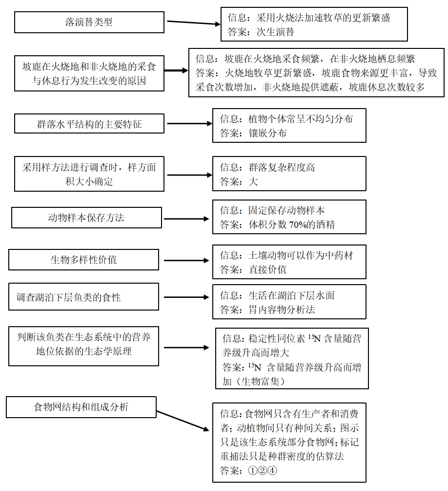【小问1详解】

次生演替是指原来的植物群落由于火灾、洪水、崖崩、风灾、人类活动等原因大部分消失后所发生的演替。护区工作人员有时在一定区域内采用火烧法加速牧草的更新繁盛，这种群落演替类型是次生演替。分析图1，坡鹿在火烧地的采食行为比非火烧地更频繁，而休息行为比非火烧地更少。形成该结果的原因是火烧地的植物更嫩，草本植物的生长更加繁盛，因此坡鹿在火烧地的采食活动更频繁，而非火烧地提供遮蔽，坡鹿休息次数较多。

【小问2详解】

群落的水平结构由于地形的变化、土壤湿度和盐碱度的差异、光照强度的不同、生物自身生长特点的不同，呈镶嵌性分布。保护区的草原上，植物个体常呈不均匀分布，这体现了群落水平结构的主要特征是镶嵌性分布。群落结构越复杂，样方面积需要越大以获得代表性的样本数据。

【小问3详解】

用吸虫器采集土壤样方中的动物后，采集的小动物可以放入体积分数为70%的酒精溶液中，以固定杀死小动物并保存。生物多样性的直接价值是指对人类的社会生活有直接影响和作用的价值。例如，药用价值、观赏价值、食用价值和生产使用价值等。蚯蚓、蜈蚣等一些土壤动物可以作为中药材，体现了生物多样性的直接价值。

【小问4详解】

湖泊下层鱼类的胃内容物分析可以直接反映其食性，所以调查湖泊下层鱼类的食性，优先选用胃容物分析法。生物富集是指某些在自然界不能降解或难降解的化学物质，在环境中通过食物链的延长和营养级的增加在生物体内逐级富集，浓度越来越大。所以对于食性庞杂的鱼类，可检测其所在水域中不同营养级生物体内稳定性同位素15N含量，从而判断该鱼类在生态系统中的营养地位，其依据的生态学原理是15N 含量随营养级升高而增加（生物富集）。

【小问5详解】

①、生态系统的组成部分为非生物的物质和能量、生产者、消费者、分解者。该图没有显示的生态系统成分是非生物的物质和能量和分解者，①错误；

②‌、动植物之间的营养关系主要包括捕食、寄生和共生等，②错误；

③、图是部分食物网，所以可能存在食虫鸟捕食肉食性昆虫的情况，此时食虫鸟就是三级消费者、第四营养级，③正确；

④、标记重捕法是估算种群密度的方法，所以调查得到的种群密度一般不是最精确的现实反映。所以采用标记重捕法并不能精确掌握保护区坡鹿的种群密度，④错误。

故选①②④。

22\. 免疫检查点阻断疗法已应用于癌症治疗，机理如图1所示。为增强疗效，我国科学家用软件计算筛到Taltirelin（简称Tal），开展实验研究Tal与免疫检查分子抗体的联合疗效及其作用机制。请回答下列问题：

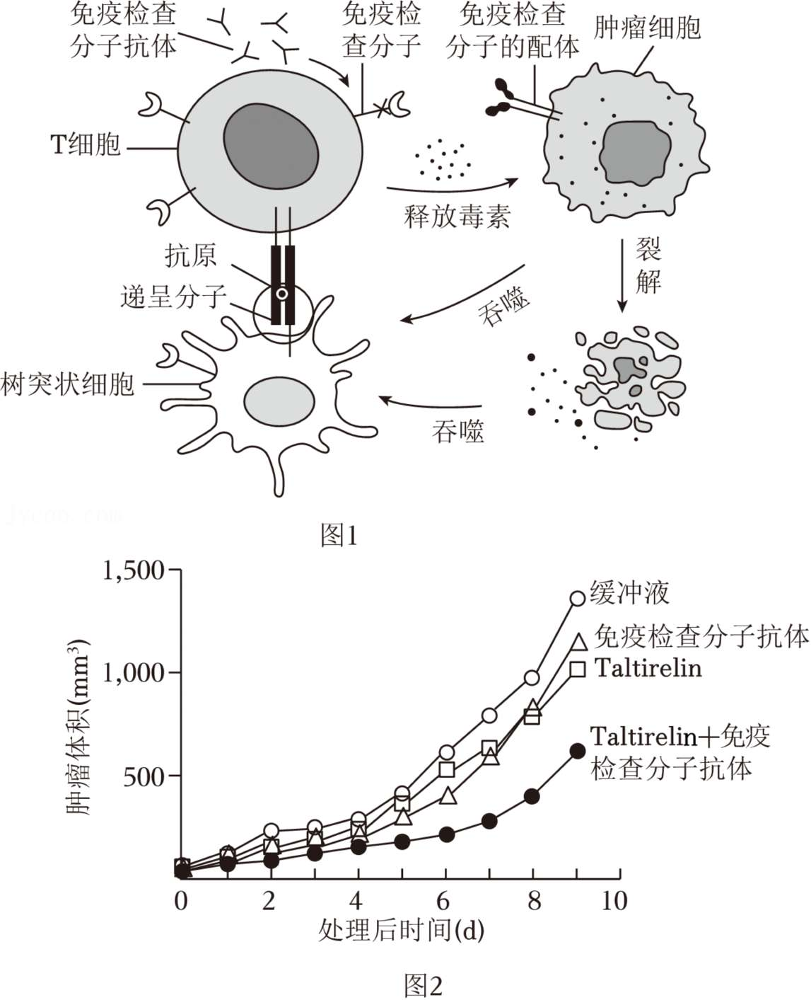

（1）肿瘤细胞表达能与免疫检查分子特异结合的配体，抑制T细胞的识别，实现免疫逃逸。据图1可知，以\_\_\_\_\_\_\_\_为抗原制备的免疫检查分子抗体可阻断肿瘤细胞与\_\_\_\_\_\_\_\_细胞的结合，解除肿瘤细胞的抑制。

（2）为评估Tal与免疫检查分子抗体的联合抗肿瘤效应，设置4组肿瘤小鼠，分别用4种溶液处理后检测肿瘤体积，结果如图2。设置缓冲液组的作用是\_\_\_\_\_\_\_\_。据图2可得出结论：\_\_\_\_\_\_\_\_。

（3）Tal是促甲状腺激素释放激素（TRH）类似物。人体内TRH促进\_\_\_\_\_\_\_\_分泌促甲状腺激素（TSH），TSH促进甲状腺分泌甲状腺激素。这些激素可通过\_\_\_\_\_\_\_\_运输，与靶细胞的受体特异结合，发挥调控作用。

（4）根据（3）的信息，检测发现T细胞表达TRH受体，树突状细胞（DC）表达TSH受体。综上所述，关于Tal抗肿瘤的作用机制，提出假设：

①Tal与\_\_\_\_\_\_\_\_结合，促进T细胞增殖及分化；

②Tal能促进\_\_\_\_\_\_\_\_，增强DC的吞噬及递呈能力，激活更多的T细胞。

（5）为验证上述假设，进行下列实验：①培养T细胞，分3组，分别添加缓冲液、Tal溶液和TRH溶液，检测\_\_\_\_\_\_\_\_；②培养DC，分3组，分别添加\_\_\_\_\_\_\_\_，检测DC的吞噬能力及递呈分子的表达量。

【答案】（1） ①. 免疫检查分子 ②. T

（2） ①. 排除缓冲液对实验结果的影响 ②. 单独使用Tal或免 疫检查分子抗体能抑制肿瘤生长，联合使用Tal与免疫 检查分子抗体抗肿瘤生长效果更好

（3） ①. 垂体 ②. 体液

（4） ①. T细胞表面的TRH受体 ②. 垂体产生TSH，TSH与 DC 上的受体结合

（5） ①. T细胞的数量和毒素的释放量 ②.

缓冲液、Tal溶液、 TSH溶液

【解析】

【分析】细胞免疫过程：①被病原体（如病毒）感染的宿主细胞（靶细胞）膜表面的某些分子发生变化，细胞毒性T细胞识别变化的信号。②细胞毒性T细胞分裂并分化，形成新的细胞毒性T细胞和记忆T细胞。细胞因子能加速这一过程。③新形成的细胞毒性T细胞在体液中循环，它们可以识别并接触、裂解被同样病原体感染的靶细胞。④靶细胞裂解、死亡后，病原体暴露出来，抗体可以与之结合；或被其他细胞吞噬掉。

【小问1详解】

肿瘤细胞表达能与免疫检查分子特异结合的配体，抑制了T细胞的识别，从而实现免疫逃逸。免疫检查分子抗体的作用是阻断肿瘤细胞与免疫细胞的结合。以免疫检查分子为抗原制备的免疫检查分子抗体，可阻断肿瘤细胞与 T 细胞的结合，解除肿瘤细胞对T细胞的抑制。

【小问2详解】

设置缓冲液组组的肿瘤体积都有所减小，其中Tal +免疫检查分子抗体组的肿瘤体积减小最为明显。故得出结论：Tal 与免疫检查分子抗体都有抗肿瘤效果，二者联合使用可明显增强抗肿瘤效果。

【小问3详解】

人体内TRH促进垂体分泌促甲状腺激素（TSH），TSH促进甲状腺分泌甲状腺激素。这些激素可通过体液运输，与靶细胞的受体特异结合，发挥调控作用。

【小问4详解】

① Tal与T细胞表面的TRH受体结合，促进T细胞增殖及分化。因为受体与相应配体结合才能发挥作用，而题目中已知T细胞表达TRH受体，所以推测Tal可能与该受体结合。

②Tal是促甲状腺激素释放激素（TRH）类似物，Tal能促进垂体产生TSH，TSH与 DC 上的受体结合，增强DC的吞噬及递呈能力，激活更多的T细胞。已知DC表达TSH受体，所以推测TSH作用于DC细胞上的受体。

【小问5详解】

① 培养T细胞，分3组，分别添加缓冲液、Tal溶液和TRH溶液，检测T细胞的增殖及作用情况，即T细胞的数量和毒素的释放量。通过对比添加不同物质后T细胞的数量和毒素的释放量，来验证Tal与TRH受体结合促进T细胞增殖及分化的假设。

② 培养 DC，分3组，分别添加缓冲液、Tal 溶液和 TSH 溶液， 检测DC的吞噬能力及递呈分子的表达量。通过对比添加不同物质后 DC 的相关指标，来验证 Tal 促进垂体产生TSH，TSH与 DC 上的受体结合。 第一组:添加缓冲液的组作为对照组。 第二组:添加 Tal 溶液的组，观察其对 DC 功能的影响。 第三组:添加 TSH 溶液的组，用于与添加 Tal 溶液的组对比，以确定Tal是否促进垂体产生TSH，TSH与 DC 上的受体结合。

23\. 为了高效纯化超氧化物歧化酶（SOD），科研人员将ELP50片段插入pET-SOD构建重组质粒pET-SOD-ELP50，以融合表达SOD-ELP50蛋白，过程如图1。其中，ELP50是由人工合成的DNA片段，序列为：限制酶a识别序列-（GTTCCTGGTGTTGGC）50-限制酶b识别序列，50为重复次数。请回答下列问题：

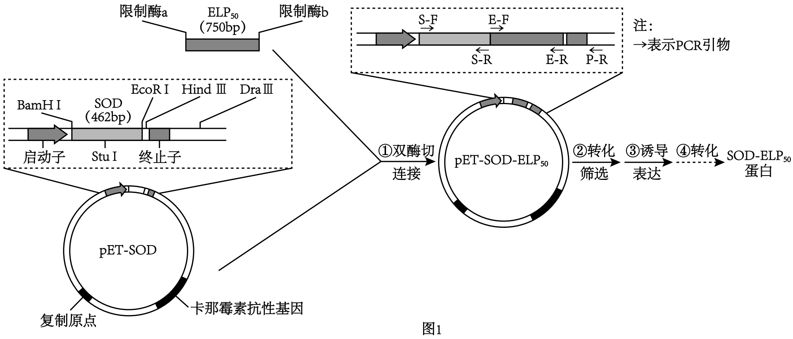

（1）步骤①双酶切时，需使用的限制酶a和限制酶b分别是\_\_\_\_\_\_\_\_。

（2）步骤②转化时，科研人员常用\_\_\_\_\_\_\_\_处理大肠杆菌，使细胞处于感受态；转化后的大肠杆菌采用含有\_\_\_\_\_\_\_\_的培养基进行筛选。用PCR技术筛选成功导入pET-SOD-ELP50的大肠杆菌，应选用的一对引物是\_\_\_\_\_\_\_\_。

（3）步骤③大肠杆菌中RNA聚合酶与\_\_\_\_\_\_\_\_结合，驱动转录，翻译SOD-ELP50蛋白。已知蛋白质中氨基酸残基的平均相对分子质量约为0.11kDa，将表达的蛋白先进行凝胶电泳，然后用SOD抗体进行杂交，显示的条带应是\_\_\_\_\_\_\_\_（从图2的“A~D”中选填）。

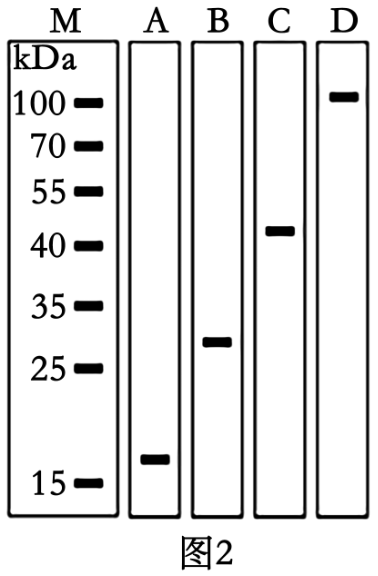

（4）步骤④为探寻高效纯化SOD-ELP50蛋白的方法，科研人员研究了温度、NaCl对SOD-ELP50蛋白纯化效果的影响，部分结果如图3。

（ⅰ）20℃时，加入NaCl后实验结果是\_\_\_\_\_\_\_\_。

（ⅱ）100℃时，导致各组中所有蛋白都沉淀的原因是\_\_\_\_\_\_\_\_。

（ⅲ）据图分析，融合表达SOD-ELP50蛋白的优点有\_\_\_\_\_\_\_\_。

【答案】（1）EcoR I、Hind Ⅲ

（2） ①. CaCl2 ②. 卡那霉素 ③. S-F和P-R

（3） ①. 启动子 ②. C

（4） ①. SOD-ELP50组纯化蛋白数量更多 ②. 高温使蛋白变性 ③. 低温下添加NaCl有利于SOD蛋白纯化，杂蛋白较少，有利于酶活性的保持

【解析】

【分析】将目的基因插入载体时，应保证目的基因插入启动子和终止子之间，以便目的基因的表达。由图可知，PCR扩增SOD-ELP50时，应选择引物S-F和E-R。

【小问1详解】

目的基因应插入启动子和终止子之间，结合题意可知，ELP50应插入pET-SOD之后，由图可知，限制酶a和限制酶b分别是EcoR I、Hind Ⅲ。

【小问2详解】

将目的基因导入细菌时常用CaCl2处理细菌，使其处于容易吸收外来DNA分子的状态。由图可知，重组DNA含有标记基因卡那霉素抗性基因，所以转化后的大肠杆菌采用含有卡那霉素的培养基进行筛选。成功导入pET-SOD-ELP50同时含有pET-SOD和ELP50，结合图示可知，引物S-F和P-R对应序列包含SOD和ELP50的相应序列，可特异性对pET-SOD-ELP50进行扩增。由于ELP50中含有重复序列，使用S-F和E-R对导入普通质粒和重组质粒的大肠杆菌进行PCR扩增，得到的产物可能无法区分。

【小问3详解】

RNA聚合酶与启动子结合后，启动转录。由图可知，决定SOD-ELP50融合蛋白的基因长度为462+750=1212bp，编码1212÷3=404个氨基酸，已知蛋白质中氨基酸残基的平均相对分子质量约为0.11kDa，融合蛋白的相对分子质量约为404×0.11kDa=44.44kDa，电泳后应该为条带C。

【小问4详解】

（ⅰ）由图可知，20℃时，较不加NaCl，加入NaCl后纯化蛋白数量更多。

（ⅱ）100℃时，温度过高，导致蛋白质变性而沉淀。

（ⅲ）20℃，加入NaCl时，较SOD，SOD-ELP50组沉淀中蛋白质相对含量较高，说明低温下添加NaCl有利于SOD蛋白纯化，杂蛋白较少，有利于酶活性的保持。

24\. 有一种植物的花色受常染色体上独立遗传的两对等位基因控制，有色基因B对白色基因b为显性，基因I存在时抑制基因B的作用，使花色表现为白色，基因i不影响基因B和b的作用。现有3组杂交实验，结果如下。请回答下列问题：

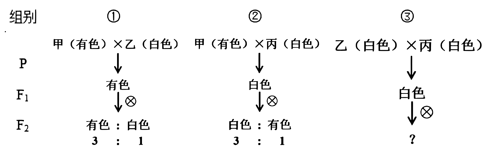

（1）甲和丙的基因型分别是\_\_\_\_\_\_\_\_、\_\_\_\_\_\_\_\_。

（2）组别①的F2中有色花植株有\_\_\_\_\_\_\_\_种基因型。若F2中有色花植株随机传粉，后代中白色花植株比例为\_\_\_\_\_\_\_\_。

（3）组别②的F2中白色花植株随机传粉，后代白色花植株中杂合子比例为\_\_\_\_\_\_\_\_。

（4）组别③的F1与甲杂交，后代表型及比例为\_\_\_\_\_\_\_\_。组别③的F1与乙杂交，后代表型及比例为\_\_\_\_\_\_\_\_。

（5）若这种植物性别决定类型为XY型，在X染色体上发生基因突变产生隐性致死基因k，导致合子致死。基因型为IiBbX+Y和IiBbX+Xk的植株杂交，F1中雌雄植株的表型及比例为\_\_\_\_\_\_\_\_；F1中有色花植株随机传粉，后代中有色花雌株比例为\_\_\_\_\_\_\_\_。

【答案】（1） ①. iiBB ②. IIBB

（2） ①. 2 ②. 1/9 （3）1/2

（4） ①. 白色：有色=1:1 ②. 白色：有色=3:1

（5） ①. 白色♀：有色♀：白色♂：有色♂=26:6:13:3 ②. 32/63

【解析】

【分析】**【关键能力】**

**（1）信息获取与加工**

|            |                                        |                                                                                                       |
|:----------:|:--------------------------------------:|:-----------------------------------------------------------------------------------------------------:|
| **题干关键信息** | **所学知识**                               | **信息加工**                                                                                              |
| 基因与性状的关系   | 基因与性状不只是一 一对应，也有多基因控制同一性状，或一个基因与多个性状有关 | 有色基因B对白色基因b为显性，基因I存在时抑制基因B的作用，使花色表现为白色，基因i不影响基因B和b的作用，据此可推测基因与性状的关系是：基因型iiB-表现有色，其余基因型表现白色 |
| 基因遵循的遗传定律  | 基因的分离定律、自由组合定律                         | 花色受常染色体上独立遗传的两对等位基因控制，隐性致死基因k在X染色体上，故这三对等位基因的遗传符合自由组合定律                                               |

**（2）逻辑推理与论证：**

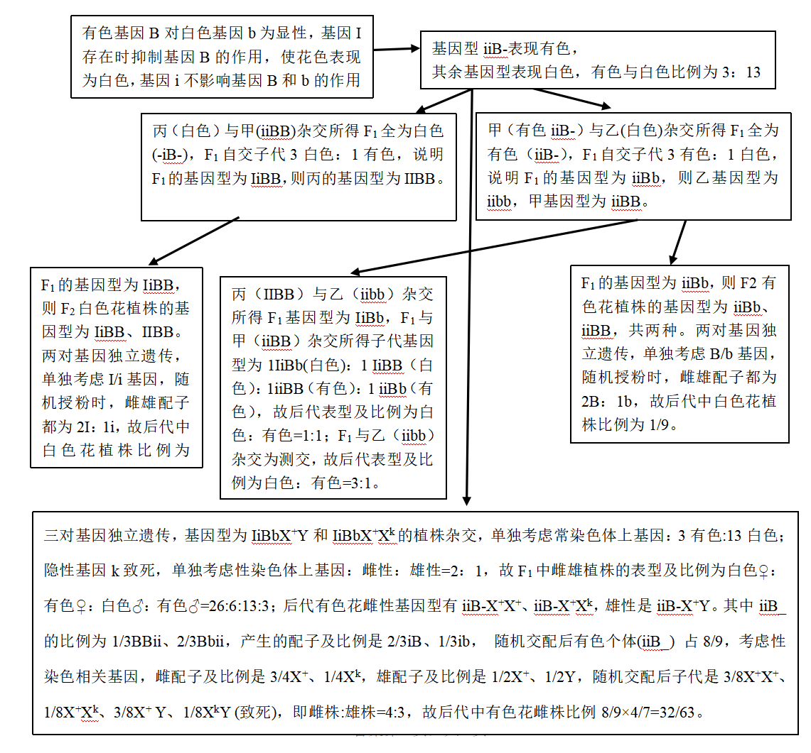【小问1详解】

分析题干，二倍体花颜色受常染色体上两对独立遗传的基因控制，其中有色基因B对白色基因b为显性，基因I对基因B有抑制作用，则有色基因型是iiB\_，白色基因型是I_B\_、I_bb、iibb，组别②中甲(有色) Xb>是单杂合子，F2白色花植株的基因型为I_BB，说明F1 的基因型是IiBB，据此可推知甲的基因型应是iiBB，丙的基因型是IIBB。

【小问2详解】

组别①中甲(iiBB) ×乙(白色)，F1都是有色，自交后有色:白色=3:1，说明F1是单杂合子，F2白色花植株的基因型为iiB\_，说明F1 的基因型是iiBb，乙的基因型是iibb。F1 自交后F2有色花的基因型有2种，包括iiBB和iiBb； F2有色花的基因型及比例是1/3iiBB、2/3iiBb，产生的配子及比例是2/3Bi、1/3bi，随机传粉，后代中白色花植株iibb的比例=1/3×1/3=1/9。

【小问3详解】

组别②中甲(有色) ×丙(白色)，F1都是白色，自交后白色:有色=3:1，说明F1是单杂合子，F2白色花植株的基因型为I_BB，F2白色花植株的基因型包括1/3IIBB、2/3IiBB， 产生的配子是2/3IB、1/3iB，随机传粉，后代白色花植株的基因型及比例为4/9IIBB、4/9IiBB，所以后代白色花植株中杂合子占1/2。

【小问4详解】

组别③乙(iibb)×丙(IIBB)，F1是BbIi (配子及比例是BI:Bi:bI:bi=1:1:1:1)，F1与甲(iiBB)杂交，后代基因型及其比例为IiBB:iiBB:IiBb:iiBb=1:1:1:1，所以后代表型及比例为白色：有色=1:1; 组别③中F1与乙(iibb)杂交，后代基因型及其比例为IiBb:iiBb:Iibb:iibb=1:1:1:1，所以后代表型及比例为白色：有色=3:1。

【小问5详解】

若这种植物性别决定类型为XY型，在X染色体上发生基因突变产生隐性致死基因k，导致合子致死。基因型为IiBbX+Y和IiBbX+Xk的植株杂交，逐对考虑，F1中关于花色的基因型及比例为I_B\_:I_bb:iiB\_:iibb=9:3:3:1，所以F1中关于花色的基因型及比例为白色:有色=13:3，X+Y和X+Xk的植株杂交，F1关于性别的基因型及比例为X+X+: X+Xk: X+Y:XkY (致死)，即F1中雌性:雄性=2: 1，所以F1中雌雄植株的表型及比例为白色♀：有色♀：白色♂：有色♂=26:6:13:3。F1中有色花植株随机传粉，其中有色花雌性基因型有iiB_X+X+、iiB_X+Xk，雄性是iiB_X+Y，其中iiB_的比例为1/3BBii、2/3Bbii，产生的配子及比例是2/3iB、1/3ib， 随机交配后有色个体(iiB\_) 占8/9，考虑性染色相关基因，雌配子及比例是3/4X+、1/4Xk，雄配子及比例是1/2X+、1/2Y，随机交配后子代是3/8X+X+、1/8X+Xk、3/8X+ Y、1/8XkY (致死)，即雌株:雄株=4:3，故后代中有色花雌株比例8/9×4/7=32/63。
