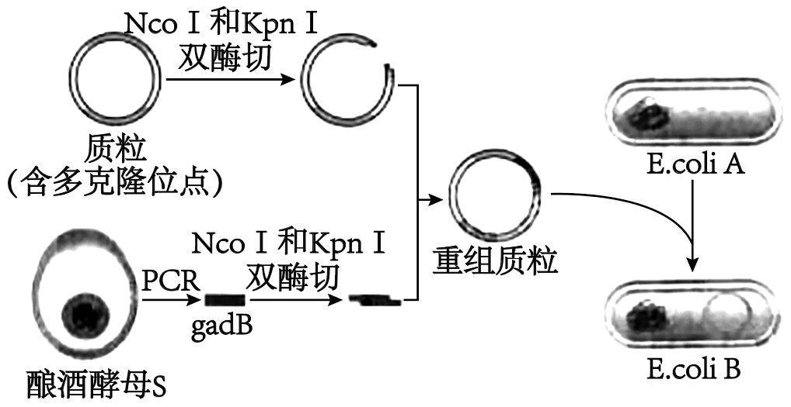

**2024年普通高中学业水平选择性考试（江西卷）**

**一、选择题：本题共12小题，每小题2分，共24分。在每小题给出的4个选项中，只有1项符合题目要求，答对得2分，答错得0分。**

1\. 溶酶体膜稳定性下降，可导致溶酶体中酶类物质外溢，引起机体异常，如类风湿性关节炎等。下列有关溶酶体的说法，错误的是（ ）

A. 溶酶体的稳定性依赖其双层膜结构

B. 溶酶体中的蛋白酶在核糖体中合成

C. 从溶酶体外溢出的酶主要是水解酶

D. 从溶酶体外溢后，大多数酶的活性会降低

2\. 营养物质是生物生长发育的基础。依据表中信息，下列有关小肠上皮细胞吸收营养物质方式的判断，错误的是（ ）

|     |         |         |        |        |
|:---:|:-------:|:-------:|:------:|:------:|
| 方式  | 细胞外相对浓度 | 细胞内相对浓度 | 需要提供能量 | 需要转运蛋白 |
| 甲   | 低       | 高       | 是      | 是      |
| 乙   | 高       | 低       | 否      | 是      |
| 丙   | 高       | 低       | 是      | 是      |
| 丁   | 高       | 低       | 否      | 否      |

A. 甲为主动运输 B. 乙为协助扩散

C. 丙为胞吞作用 D. 丁为自由扩散

3\. 某植物中，T基因的突变会导致细胞有丝分裂后期纺锤体伸长的时间和长度都明显减少，从而影响细胞的增殖。下列推测错误的是（ ）

A. T基因突变的细胞在分裂期可形成一个梭形纺锤体

B. T基因突变导致染色体着丝粒无法在赤道板上排列

C. T基因突变的细胞在分裂后期染色体数能正常加倍

D. T基因突变影响纺锤丝牵引染色体向细胞两极移动

4\. 某水果的W基因（存在多种等位基因）影响果实甜度。研究人员收集到1000棵该水果的植株，它们的基因型及对应棵数如下表。据表分析，这1000棵植株中W1的基因频率是（ ）

|     |                            |                            |                            |                            |                            |                            |
|:---:|:--------------------------:|:--------------------------:|:--------------------------:|:--------------------------:|:--------------------------:|:--------------------------:|
| 基因型 | W1W2 | W1W3 | W2W2 | W2W3 | W3W4 | W4W4 |
| 棵数  | 211                        | 114                        | 224                        | 116                        | 260                        | 75                         |

A. 16.25% B. 32.50% C. 50.00% D. 67.50%

5\. 农谚有云：“雨生百谷”。“雨”有利于种子的萌发，是“百谷”丰收的基础。下列关于种子萌发的说法，错误的是（ ）

A. 种子萌发时，细胞内自由水所占比例升高

B. 水可借助通道蛋白以协助扩散方式进入细胞

C. 水直接参与了有氧呼吸过程中丙酮酸的生成

D. 光合作用中，水的光解发生在类囊体薄膜上

6\. 与减数分裂相关的某些基因发生突变，会引起水稻花粉母细胞分裂失败而导致雄性不育。依据下表中各基因突变后引起的效应，判断它们影响减数分裂的先后顺序是（ ）

|     |             |
|:--- |:----------- |
| 基因  | 突变效应        |
| M   | 影响联会配对      |
| O   | 影响姐妹染色单体分离  |
| P   | 影响着丝粒与纺锤丝结合 |
| W   | 影响同源染色体分离   |

A. M-P-O-W B. M-P-W-O C. P-M-O-W D. P-M-W-O

7\. 从炎热的室外进入冷库后，机体可通过分泌糖皮质激素调节代谢（如下图）以适应冷环境。综合激素调节的机制，下列说法正确的是（ ）

A. 垂体的主要功能是分泌促肾上腺皮质激素

B. 糖皮质激素在引发体内细胞代谢效应后失活

C. 促肾上腺皮质激素释放激素也可直接作用于肾上腺

D. 促肾上腺皮质激素释放激素与促肾上腺皮质激素的分泌都存在分级调节

8\. 实施退耕还林还草工程是我国践行生态文明思想的重要举措。下列关于某干旱地区退耕农田群落演替的叙述，错误的是（ ）

A. 上述演替与沙丘上发生的演替不是同一种类型

B. 可用样方法调查该退耕农田中植物的种群密度

C. 可在该退耕农田引进优势物种改变演替的速度

D. 上述退耕农田群落演替的最终阶段是森林阶段

9\. 假设某个稳定生态系统只存在一条食物链。研究人员调查了一段时间内这条食物链上其中4种生物的相关指标（如表，表中“—”表示该处数据省略）。根据表中数据，判断这4种生物在食物链中的排序，正确的是（ ）

|     |                     |               |                                    |
|:---:|:-------------------:|:-------------:|:----------------------------------:|
| 物种  | 流经生物的能量（kJ）         | 生物体内镉浓度（μg/g） | 生物承受的捕食压力指数（一般情况下，数值越大，生物被捕食的压力越大） |
| ①   | —                   | 0.03          | 15.64                              |
| ②   | —                   | 0.08          | —                                  |
| ③   | 1.60×106 | —             | 1.05                               |
| ④   | 2.13×108 | —             | —                                  |

A. ④③①② B. ④②①③ C. ①③②④ D. ④①②③

10\. 某些病原微生物的感染会引起机体产生急性炎症反应（造成机体组织损伤）。为研究化合物Y的抗炎效果，研究人员以细菌脂多糖（LPS）诱导的急性炎症小鼠为空白对照，以中药复方制剂H为阳性对照，用相关淋巴细胞的增殖率表示炎症反应程度，进行相关实验，结果如图。下列说法错误的是（ ）

A. LPS诱导的急性炎症是一种特异性免疫失调所引起的机体反应

B. 中药复方制剂H可以缓解LPS诱导的小鼠急性炎症

C. 化合物Y可以增强急性炎症小鼠的特异性免疫反应

D. 中药复方制剂H比化合物Y具有更好的抗炎效果

11\. 井冈霉素是我国科学家发现的一种氨基寡糖类抗生素，它由吸水链霉菌井冈变种（JGs，一种放线菌，菌体呈丝状生长）发酵而来，在水稻病害防治等领域中得到广泛应用。下列关于JGs发酵生产井冈霉素的叙述，正确的是（ ）

A. JGs可发酵生产井冈霉素，因为它含有能够编码井冈霉素的基因

B. JGs接入发酵罐前需要扩大培养，该过程不影响井冈霉素的产量

C. 提高JGs发酵培养基中营养物质浓度，会提高井冈霉素的产量

D. 稀释涂布平板法不宜用于监控JGs发酵过程中活细胞数量的变化

12\. γ-氨基丁酸在医药等领域有重要的应用价值。利用L-谷氨酸脱羧酶（GadB）催化L-谷氨酸脱羧是高效生产γ-氨基丁酸的重要途径之一。研究人员采用如图方法将酿酒酵母S的L-谷氨酸脱羧酶基因（gadB）导入生产菌株E．coliA．构建了以L-谷氨酸钠为底物高效生产γ-氨基丁酸的菌株E．coliB。下列叙述正确的是（ ）

A. 上图表明，可以从酿酒酵母S中分离得到目的基因gadB

B. E．coliB发酵生产γ-氨基丁酸时，L-谷氨酸钠的作用是供能

C. E．coliA和E．coliB都能高效降解γ-氨基丁酸

D 可以用其他酶替代NcoⅠ和KpnⅠ构建重组质粒

**二、选择题：本题共4小题，每小题4分，共16分。在每小题给出的4个选项中，有2项或2项以上符合题目要求，全部选对的得4分，选对但不全的得2分，有选错的得0分。**

13\. 阳光为生命世界提供能量，同时作为光信号调控生物的生长、发育和繁衍，使地球成为生机勃勃的美丽星球。下列叙述正确的是（ ）

A. 植物可通过感受光质和光周期等光信号调控开花

B. 植物体中感受光信号的色素均衡分布在各组织中

C. 植物体中光敏色素结构的改变影响细胞核基因的表达

D. 光信号影响植物生长发育的主要机制是调节光合作用的强度

14\. “种豆南山下，草盛豆苗稀”描绘了诗人的田耕生活。下图是大豆和杂草R在某种养分生态位维度上的分布曲线。下列叙述错误的是（ ）

A. a越大，表明大豆个体间对该养分的竞争越激烈

B. b越小，表明大豆与杂草R对该养分的竞争越小

C. b的大小会随着环境的变化而变化，但a和d不会

D. 当c为0时，表明大豆和杂草R的该养分生态位发生了分化

15\. 某种鸟类的羽毛颜色有黑色（存在黑色素）、黄色（仅有黄色素，没有黑色素）和白色（无色素）3种。该性状由2对基因控制，分别是Z染色体上的1对等位基因A/a（A基因控制黑色素的合成）和常染色体上的1对等位基因H/h（H基因控制黄色素的合成）。对图中杂交子代的描述，正确的是（ ）

A. 黑羽、黄羽和白羽的比例是2∶1∶1

B. 黑羽雄鸟的基因型是HhZAZa

C. 黄羽雌鸟的基因型是HhZaZa

D. 白羽雌鸟的基因型是hhZaW

16\. 某病毒颗粒表面有一特征性的大分子结构蛋白S（含有多个不同的抗原决定基，每一个抗原决定基能够刺激机体产生一种抗体）。为了建立一种灵敏、高效检测S蛋白的方法，研究人员采用杂交瘤技术制备了抗-S单克隆抗体（如图）。下列说法正确的是（ ）

A. 利用胶原蛋白酶处理，可分散贴壁生长的骨髓瘤细胞

B. 制备的单克隆抗体A和单克隆抗体B是相同的单克隆抗体

C. 用于生产单克隆抗体的杂交瘤细胞可传代培养，但不能冻存

D. 单克隆抗体A和单克隆抗体B都能够特异性识别S蛋白

**三、非选择题：本题共5小题，每小题12分，共60分。**

17\. 聚对苯二甲酸乙二醇酯（PET）是一种聚酯塑料，会造成环境污染。磷脂酶可催化PET降解。为获得高产磷脂酶的微生物，研究人员试验了2种方法。回答下列问题：

（1）方法1从土壤等环境样品中筛选高产磷脂酶的微生物。以磷脂酰乙醇酯（一种磷脂类物质）为唯一碳源制备\_\_\_\_\_\_培养基，可提高该方法的筛选效率。除碳源外，该培养基中至少还应该有\_\_\_\_\_\_、\_\_\_\_\_\_、\_\_\_\_\_\_等营养物质。

（2）方法2采用\_\_\_\_\_\_技术定向改造现有微生物，以获得高产磷脂酶的微生物。除了编码磷脂酶的基因外，该技术还需要\_\_\_\_\_\_、\_\_\_\_\_\_、\_\_\_\_\_\_等“分子工具”。

（3）除了上述2种方法之外，还可以通过\_\_\_\_\_\_技术非定向改造现有微生物，筛选获得能够高产磷脂酶的微生物。

（4）将以上获得的微生物接种到鉴别培养基（在牛肉膏蛋白胨液体培养基中添加2%的琼脂粉和适量的卵黄磷脂）平板上培养，可以通过观察卵黄磷脂水解圈的大小，初步判断微生物产磷脂酶的能力，但不能以水解圈大小作为判断微生物产磷脂酶能力的唯一依据。从平板制作的角度分析，其原因可能是\_\_\_\_\_\_。

18\. 福寿螺是一种外来入侵物种，因其食性广泛、繁殖力强，给输入地的生态系统造成不利影响。回答下列问题：

（1）某稻田生态系统中，福寿螺以水稻为食，鸭以福寿螺为食。上述生物组成的食物链中，消费者是\_\_\_\_\_\_。

（2）研究人员统计发现，福寿螺入侵某生态系统后，种群数量呈指数增长。从食物和天敌的角度分析，其原因是\_\_\_\_\_\_\_\_\_\_\_\_。

（3）物种多样性与群落内物种丰富度和均匀度相关（均匀度指群落内物种个体数目分配的均匀程度。一定条件下，物种均匀度提高，多样性也会提高）。研究人员统计了福寿螺入侵某湿地生态系统前后，群落中各科植物的种类及占比（见表）。分析表中的数据可发现，福寿螺的入侵使得该群落中植物的物种多样性\_\_\_\_\_\_，判断依据是\_\_\_\_\_\_。

<table>
<colgroup>
<col style="width: 4%" />
<col style="width: 17%" />
<col style="width: 30%" />
<col style="width: 17%" />
<col style="width: 30%" />
</colgroup>
<tbody>
<tr>
<td style="text-align: center;"></td>
<td colspan="2" style="text-align: center;">入侵前</td>
<td colspan="2" style="text-align: center;">入侵后</td>
</tr>
<tr>
<td style="text-align: center;">科</td>
<td style="text-align: center;">物种数目（种）</td>
<td style="text-align: center;">各物种的个体数量占比范围（%）</td>
<td style="text-align: center;">物种数目（种）</td>
<td style="text-align: center;">各物种的个体数量占比范围（%）</td>
</tr>
<tr>
<td style="text-align: center;">甲</td>
<td style="text-align: center;">10</td>
<td style="text-align: center;">4.6~4.8</td>
<td style="text-align: center;">8</td>
<td style="text-align: center;">1.1~1.8</td>
</tr>
<tr>
<td style="text-align: center;">乙</td>
<td style="text-align: center;">9</td>
<td style="text-align: center;">3.1~3.3</td>
<td style="text-align: center;">7</td>
<td style="text-align: center;">1.8~2.5</td>
</tr>
<tr>
<td style="text-align: center;">丙</td>
<td style="text-align: center;">5</td>
<td style="text-align: center;">3.1~3.3</td>
<td style="text-align: center;">4</td>
<td style="text-align: center;">3.0~3.2</td>
</tr>
<tr>
<td style="text-align: center;">丁</td>
<td style="text-align: center;">3</td>
<td style="text-align: center;">2.7~2.8</td>
<td style="text-align: center;">3</td>
<td style="text-align: center;">19.2~22.8</td>
</tr>
<tr>
<td style="text-align: center;"></td>
<td colspan="2" style="text-align: center;">总个体数（个）：2530</td>
<td colspan="2" style="text-align: center;">总个体数（个）：2550</td>
</tr>
</tbody>
</table>

（4）通过“稻鸭共育”技术在稻田中引入鸭防治福寿螺的危害，属于\_\_\_\_\_\_防治。为了验证“稻鸭共育”技术防治福寿螺的效果，研究人员在引入鸭之前，投放了一定数量的幼龄、中龄和老龄福寿螺（占比分别为70%、20%和10%）；引入鸭一段时间后，发现鸭对幼龄、中龄和老龄福寿螺的捕食率分别为95.2%、60.3%和1.2%，结果表明该技术能防治福寿螺危害。从种群年龄结构变化的角度分析，其原因是\_\_\_\_\_\_\_\_\_\_\_\_\_\_\_\_\_\_。

19\. 植物体表蜡质对耐干旱有重要作用，研究人员通过诱变获得一个大麦突变体Cer1（纯合体），其颖壳蜡质合成有缺陷（本题假设完全无蜡质）。初步研究表明，突变表型是因为C基因突变为c，使棕榈酸转化为16-羟基棕榈酸受阻所致（本题假设完全阻断），符合孟德尔遗传规律，回答下列问题：

（1）在C基因两侧设计引物，PCR扩增，电泳检测PCR产物。如图泳道1和2分别是突变体Cer1与野生型（WT，纯合体）。据图判断，突变体Cer1中②基因的突变类型是\_\_\_\_\_\_。

（2）将突变体Cer1与纯合野生型杂交．F1全为野生型，F1与突变体Cer1杂交，获得若干个后代，利用上述引物PCR扩增这些后代的基因组DNA，电泳检测PCR产物，可以分别得到与如图泳道\_\_\_\_\_\_和泳道\_\_\_\_\_\_（从1~5中选择）中相同的带型，两种类型的电泳带型比例为\_\_\_\_\_\_。

（3）进一步研究意外发现，16-羟基棕榈酸合成蜡质过程中必需的D基因（位于另一条染色体上）也发生了突变，产生了基因d1，其编码多肽链的DNA序列中有1个碱基由G变为T，但氨基酸序列没有发生变化，原因是\_\_\_\_\_\_\_\_\_\_\_\_。

（4）假设诱变过程中突变体Cer1中的D基因发生了使其丧失功能的突变，产生基因d2。CCDD与ccd2d2个体杂交，F1的表型为野生型，F1自交，F2野生型与突变型的比例为\_\_\_\_\_\_；完善以下表格：

|                              |               |                    |                |
|:----------------------------:|:-------------:|:------------------:|:--------------:|
| F2部分个体基因型         | 棕榈酸（填“有”或“无”） | 16-羟基棕榈酸（填“有”或“无”） | 颖壳蜡质（填“有”或“无”） |
| Ccd2d2 | 有             | ①\_\_\_\_\_\_      | 无              |
| CCDd2             | 有             | 有                  | ②\_\_\_\_\_\_  |

20\. 人体水盐代谢平衡是内环境稳态的重要方面。研究人员为了探究运动中机体维持水盐平衡的机制，让若干名身体健康的志愿者以10km/h的速度跑步1h，采集志愿者运动前、中和后的血液与尿液样本，测定相关指标（下表）。回答下列问题：

<table>
<colgroup>
<col style="width: 9%" />
<col style="width: 15%" />
<col style="width: 16%" />
<col style="width: 15%" />
<col style="width: 14%" />
<col style="width: 14%" />
<col style="width: 14%" />
</colgroup>
<tbody>
<tr>
<td style="text-align: center;">
指标

状态
</td>
<td style="text-align: center;">血浆渗透压（mOsm/L）</td>
<td style="text-align: center;">血浆Na+浓度（mmol/L）</td>
<td style="text-align: center;">血浆K+浓度（mmol/L）</td>
<td style="text-align: center;">尿渗透压（mOsm/L）</td>
<td style="text-align: center;">尿Na+浓度（mmol/L）</td>
<td style="text-align: center;">尿K+浓度（mmol/L）</td>
</tr>
<tr>
<td style="text-align: center;">运动前</td>
<td style="text-align: center;">289.1</td>
<td style="text-align: center;">139.0</td>
<td style="text-align: center;">4.3</td>
<td style="text-align: center;">911.2</td>
<td style="text-align: center;">242.4</td>
<td style="text-align: center;">40.4</td>
</tr>
<tr>
<td style="text-align: center;">运动中</td>
<td style="text-align: center;">291.0</td>
<td style="text-align: center;">141.0</td>
<td style="text-align: center;">4.4</td>
<td style="text-align: center;">915.4</td>
<td style="text-align: center;">206.3</td>
<td style="text-align: center;">71.1</td>
</tr>
<tr>
<td style="text-align: center;">运动后</td>
<td style="text-align: center;">289.2</td>
<td style="text-align: center;">139.1</td>
<td style="text-align: center;">4.1</td>
<td style="text-align: center;">1005.1</td>
<td style="text-align: center;">228.1</td>
<td style="text-align: center;">72.3</td>
</tr>
</tbody>
</table>

（1）上表中的数据显示，与尿液相比，血浆的各项指标相对稳定。原因是血浆属于内环境，机体可通过\_\_\_\_\_\_、体液调节和\_\_\_\_\_\_维持内环境的稳态。

（2）参与形成人体血浆渗透压的离子主要是Na+和\_\_\_\_\_\_。

（3）运动中，尿液中Na+浓度降低、K+浓度升高，是因为\_\_\_\_\_\_（从“肾小球”“肾小管”“肾小囊”和“集合管”中选2项）加强了保钠排钾的作用，同时也加强了对\_\_\_\_\_\_的重吸收，使得尿液渗透压升高。

（4）为探究上表数据变化的原因，测定了自运动开始2h内血浆中醛固酮（由\_\_\_\_\_\_分泌）和抗利尿激素（由\_\_\_\_\_\_释放）的浓度。结果发现，血浆中2种激素的浓度均呈现先上升后下降的趋势，分析激素浓度下降的可能原因包括\_\_\_\_\_\_\_\_\_\_\_\_（答出2点即可）。

（5）进一步实验发现，与运动前相比，运动后血容量（参与循环的血量）减少，并引起一系列生理反应。由此可知，机体水盐平衡调节途径为\_\_\_\_\_\_（将以下选项排序：①醛固酮和抗利尿激素分泌增多；②肾脏的重吸收等作用增强；③血容量减少；④尿液浓缩和尿量减少），使血浆渗透压维持相对稳定。

21\. 当某品种菠萝蜜成熟到一定程度，会出现呼吸速率迅速上升，再迅速下降的现象。研究人员以新采摘的该菠萝蜜为实验材料，测定了常温有氧贮藏条件下果实的呼吸速率和乙烯释放速率，变化趋势如图。回答下列问题：

（1）菠萝蜜在贮藏期间，细胞呼吸的耗氧场所是线粒体的\_\_\_\_\_\_，其释放的能量一部分用于生成\_\_\_\_\_\_，另一部分以\_\_\_\_\_\_的形式散失。

（2）据图可知，菠萝蜜在贮藏初期会释放少量乙烯，随后有大量乙烯生成，这体现了乙烯产生调节方式为\_\_\_\_\_\_。

（3）据图推测，菠萝蜜在贮藏5天内可溶性糖的含量变化趋势是\_\_\_\_\_\_。

为证实上述推测，拟设计实验进行验证。假设菠萝蜜中的可溶性糖均为葡萄糖，现有充足的新采摘菠萝蜜、仪器设备（如比色仪，可用于定量分析溶液中物质的浓度）、玻璃器皿和试剂（如DNS试剂，该试剂能够和葡萄糖在沸水浴中加热产生棕红色的可溶性物质）等。简要描述实验过程：

①\_\_\_\_\_\_\_\_\_\_\_\_\_\_\_\_\_\_\_\_\_\_\_\_\_\_\_\_\_\_；

②分别制作匀浆，取等量匀浆液；

③\_\_\_\_\_\_\_\_\_\_\_\_\_\_\_\_\_\_\_\_\_\_\_\_\_\_\_\_\_\_；

④分别在沸水浴中加热；

⑤\_\_\_\_\_\_\_\_\_\_\_\_\_\_\_\_\_\_\_\_\_\_\_\_\_\_\_\_\_\_。

（4）综合上述发现，新采摘的菠萝蜜在贮藏过程中释放的乙烯能调控果实的呼吸速率上升，其原因是\_\_\_\_\_\_\_\_\_\_\_\_。
