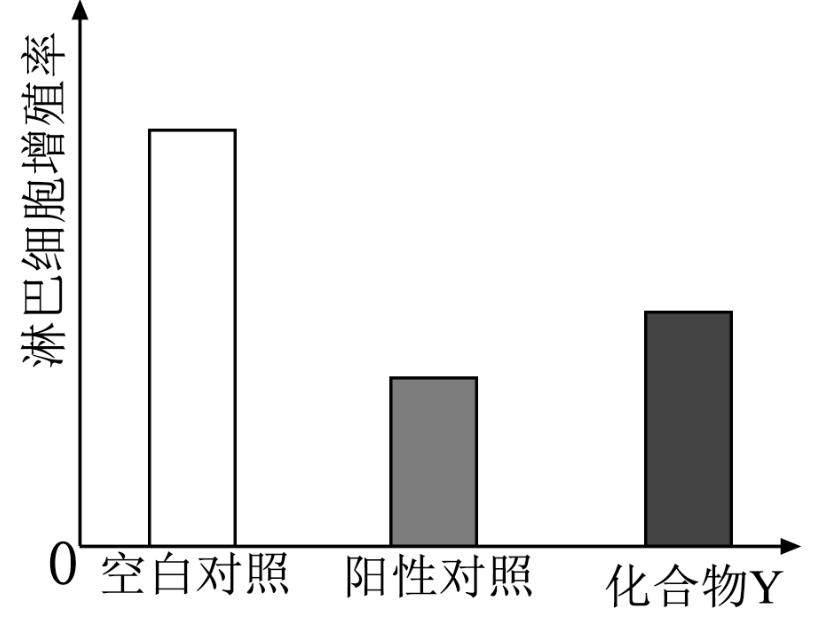
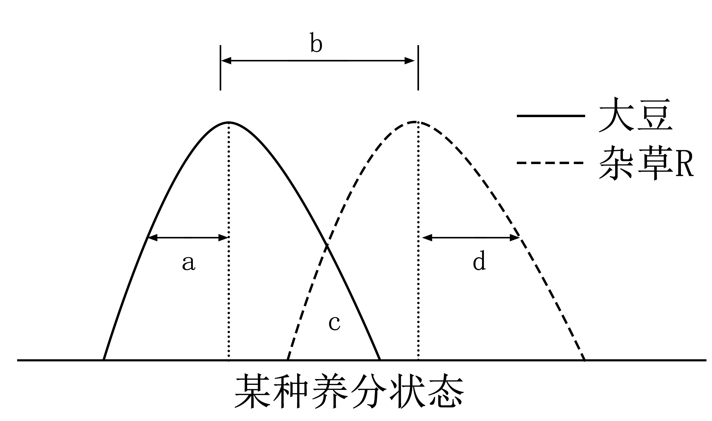
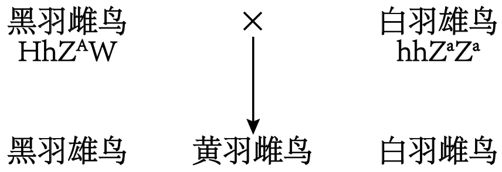
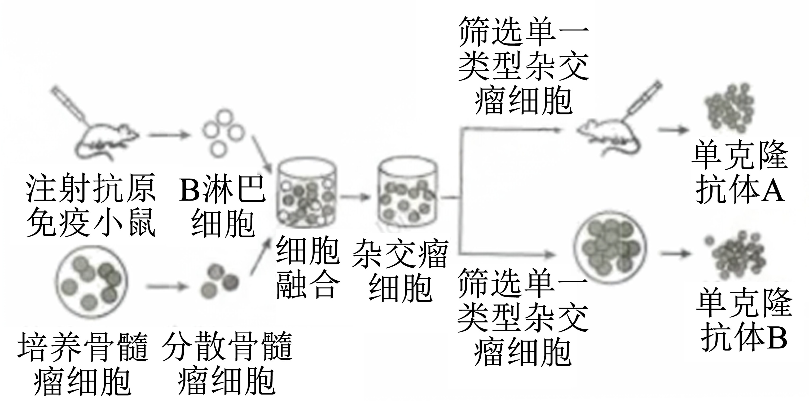
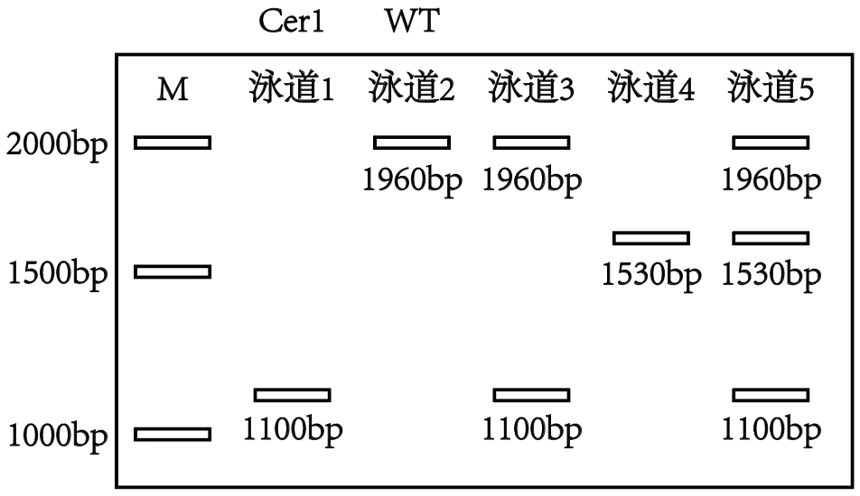
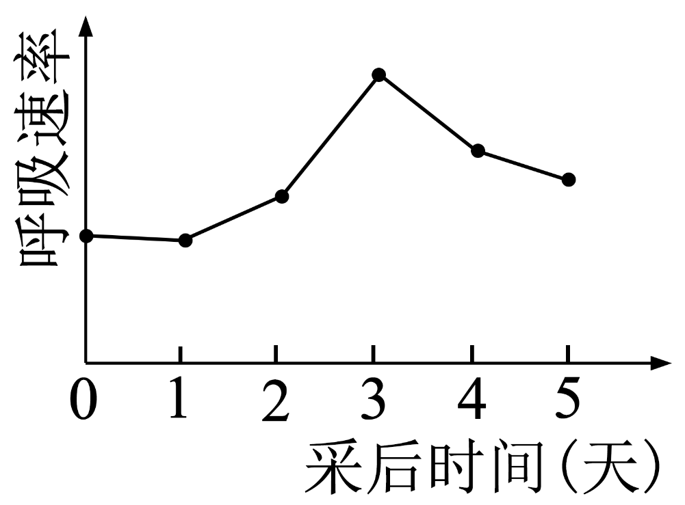
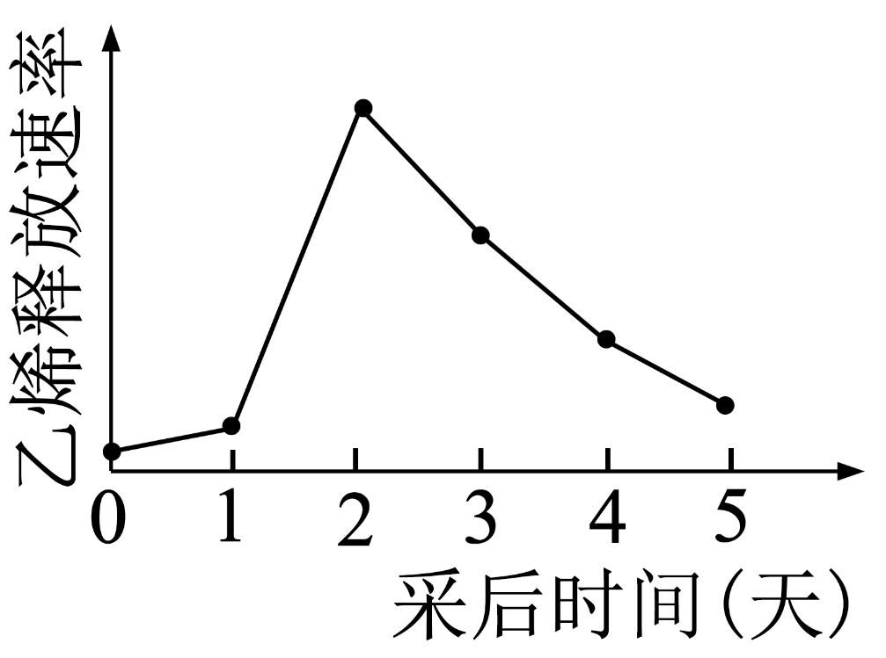

**2024年普通高中学业水平选择性考试（江西卷）**

**一、选择题：本题共12小题，每小题2分，共24分。在每小题给出的4个选项中，只有1项符合题目要求，答对得2分，答错得0分。**

1\. 溶酶体膜稳定性下降，可导致溶酶体中酶类物质外溢，引起机体异常，如类风湿性关节炎等。下列有关溶酶体的说法，错误的是（ ）

A. 溶酶体的稳定性依赖其双层膜结构

B. 溶酶体中的蛋白酶在核糖体中合成

C. 从溶酶体外溢出的酶主要是水解酶

D. 从溶酶体外溢后，大多数酶的活性会降低

【答案】A

【解析】

【分析】溶酶体分布在动物细胞，是单层膜形成的泡状结构，是细胞内的“消化车间”，含多种水解酶，能分解衰老、损伤的细胞器，吞噬并且杀死侵入细胞的病毒和细菌。

【详解】A、溶酶体不具有双层膜结构，是单层膜结构的细胞器，其中含有多种水解酶，是细胞中消化车间，A错误；

B、溶酶体内的蛋白酶的本质是蛋白质，合成场所在核糖体，B正确；

C、溶酶体中含有多种水解酶，因此，从溶酶体外溢出的酶主要是水解酶，C正确；

D、溶酶体内的pH比胞质溶胶低，从溶酶体外溢后，由于pH不适宜，因此，大多数酶的活性会降低，D正确。

故选A。

2\. 营养物质是生物生长发育的基础。依据表中信息，下列有关小肠上皮细胞吸收营养物质方式的判断，错误的是（ ）

|     |         |         |        |        |
|:---:|:-------:|:-------:|:------:|:------:|
| 方式  | 细胞外相对浓度 | 细胞内相对浓度 | 需要提供能量 | 需要转运蛋白 |
| 甲   | 低       | 高       | 是      | 是      |
| 乙   | 高       | 低       | 否      | 是      |
| 丙   | 高       | 低       | 是      | 是      |
| 丁   | 高       | 低       | 否      | 否      |

A. 甲主动运输 B. 乙为协助扩散

C. 丙为胞吞作用 D. 丁为自由扩散

【答案】C

【解析】

【分析】自由扩散的方向是从高浓度向低浓度，不需载体和能量，常见的有水、CO2、O2、甘油、苯、酒精等；协助扩散的方向是从高浓度向低浓度，需要载体，不需要能量，如红细胞吸收葡萄糖；主动运输的方向是从低浓度向高浓度，需要载体和能量，常见的如小肠绒毛上皮细胞吸收氨基酸、葡萄糖，K+等。

【详解】A、甲表示的运输方向为逆浓度进行，且需要消耗能量，并通过载体转运，为主动运输，A正确；

B、乙为顺浓度梯度进行，需要转运蛋白，不需要消耗能量，为协助扩散，B正确；

C、丙逆浓度梯度进行排出，需要转运蛋白，需要消耗能量，为主动运输，C错误；

D、丁顺浓度梯度进行吸收，不需要转运蛋白，也不需要能量，是自由扩散，D正确。

故选C。

3\. 某植物中，T基因的突变会导致细胞有丝分裂后期纺锤体伸长的时间和长度都明显减少，从而影响细胞的增殖。下列推测错误的是（ ）

A. T基因突变的细胞在分裂期可形成一个梭形纺锤体

B. T基因突变导致染色体着丝粒无法在赤道板上排列

C. T基因突变的细胞在分裂后期染色体数能正常加倍

D. T基因突变影响纺锤丝牵引染色体向细胞两极移动

【答案】B

【解析】

【分析】有丝分裂不同时期的特点：（1）间期：进行DNA的复制和有关蛋白质的合成；（2）前期：核膜、核仁逐渐解体消失，出现纺锤体和染色体；（3）中期：染色体形态固定、数目清晰；（4）后期：着丝点分裂，姐妹染色单体分开成为染色体，并均匀地移向两极；（5）末期：核膜、核仁重建、纺锤体和染色体消失。

【详解】A、纺锤体的形成是在前期，T基因的突变影响的是后期纺锤体伸长的时间和长度，因此T基因突变的细胞在分裂期可形成一个梭形纺锤体，A正确；

B、染色体着丝粒排列在赤道板上是中期的特点，T基因的突变影响的是后期纺锤体伸长的时间和长度，因此T基因突变染色体着丝粒可以在赤道板上排列，B错误；

C、着丝粒是自动分裂的，不需要依靠纺锤丝的牵拉，因此T基因突变的细胞在分裂后期染色体数能正常加倍，C正确；

D、T基因的突变会导致细胞有丝分裂后期纺锤体伸长的时间和长度都明显减少，进而影响纺锤丝牵引染色体向细胞两极移动，D正确。

故选B。

4\. 某水果的W基因（存在多种等位基因）影响果实甜度。研究人员收集到1000棵该水果的植株，它们的基因型及对应棵数如下表。据表分析，这1000棵植株中W1的基因频率是（ ）

|     |                            |                            |                            |                            |                            |                            |
|:---:|:--------------------------:|:--------------------------:|:--------------------------:|:--------------------------:|:--------------------------:|:--------------------------:|
| 基因型 | W1W2 | W1W3 | W2W2 | W2W3 | W3W4 | W4W4 |
| 棵数  | 211                        | 114                        | 224                        | 116                        | 260                        | 75                         |

A. 16.25% B. 32.50% C. 50.00% D. 67.50%

【答案】A

【解析】

【分析】基因频率是指某基因占其全部等位基因的比值，某基因频率=某种基因的纯合子基因型频率+1/2杂合子基因型频率。

【详解】根据基因频率计算公式可得：W1的基因频率=（211+114）×1/2÷1000=16.25%，A符合题意。

故选A。

5\. 农谚有云：“雨生百谷”。“雨”有利于种子的萌发，是“百谷”丰收的基础。下列关于种子萌发的说法，错误的是（ ）

A. 种子萌发时，细胞内自由水所占的比例升高

B. 水可借助通道蛋白以协助扩散方式进入细胞

C. 水直接参与了有氧呼吸过程中丙酮酸的生成

D. 光合作用中，水的光解发生在类囊体薄膜上

【答案】C

【解析】

【分析】细胞内的水以自由水与结合水的形式存在，自由水具有能够流动和容易蒸发的特点，结合水与细胞内其他大分子物质结合是细胞的重要组成成分，自由水与结合水的比值越大，细胞新陈代谢越旺盛，抗逆性越差，自由水与结合水的比值越小细胞的新陈代谢越弱，抗逆性越强。

【详解】A、种子萌发时，代谢加强，结合水转变为自由水，细胞内自由水所占的比例升高，A正确；

B、水可借助通道蛋白以协助扩散方式进入细胞，不需要消耗能量，B正确；

C、丙酮酸的生成属于有氧呼吸第一阶段，没有水的参与，C错误；

D、光合作用中，水的光解属于光反应阶段，发生在类囊体薄膜上，D正确。

故选C。

6\. 与减数分裂相关的某些基因发生突变，会引起水稻花粉母细胞分裂失败而导致雄性不育。依据下表中各基因突变后引起的效应，判断它们影响减数分裂的先后顺序是（ ）

|     |             |
|:--- |:----------- |
| 基因  | 突变效应        |
| M   | 影响联会配对      |
| O   | 影响姐妹染色单体分离  |
| P   | 影响着丝粒与纺锤丝结合 |
| W   | 影响同源染色体分离   |

A. M-P-O-W B. M-P-W-O C. P-M-O-W D. P-M-W-O

【答案】D

【解析】

【分析】减数分裂的过程：减数第一次分裂前期同源染色体联会配对；减数第一次分裂中期同源染色体配列在赤道面上；减数第一次分裂后期同源染色体分离；减数第一次分裂末期，细胞一分为二；减数第二次分裂前期，染色体散乱排布在细胞中；减数第二次分裂中期，所有染色体的着丝粒排列在赤道面上；减数第二次分裂后期，着丝粒分裂，姐妹染色单体分离；减数第二次分裂末期，细胞一分为二。

【详解】联会配对发生在减数第一次分裂前期，姐妹染色单体分离发生在减数第二次分裂后期，着丝粒与纺锤丝结合发生在减数第一次分裂前期和减数第二次分裂前期，同源染色体分离发生在减数第一次分裂后期。基因突变后应该先影响着丝粒与纺锤丝结合，即它们影响减数分裂的先后顺序是P-M-W-O。

故选D。

7\. 从炎热的室外进入冷库后，机体可通过分泌糖皮质激素调节代谢（如下图）以适应冷环境。综合激素调节的机制，下列说法正确的是（ ）

A. 垂体的主要功能是分泌促肾上腺皮质激素

B. 糖皮质激素在引发体内细胞代谢效应后失活

C. 促肾上腺皮质激素释放激素也可直接作用于肾上腺

D. 促肾上腺皮质激素释放激素与促肾上腺皮质激素的分泌都存在分级调节

【答案】B

【解析】

【分析】分析题图可知：人体内存在“下丘脑—垂体—肾上腺皮质轴”，在肾上腺分泌糖皮质激素的过程中，既存在分级调节，也存在反馈调节。

【详解】A、垂体接受下丘脑分泌的激素的调节，从而分泌促甲状腺激素、促性腺激素、促肾上腺皮质激素等，分别调节相应的内分泌腺的分泌活动。垂体分泌的生长激素能调节生长发育等，A错误；

B、激素一经靶细胞接受并起作用后就被灭活了，由此可知：糖皮质激素在引发体内细胞代谢效应后失活，B正确；

C、促肾上腺皮质激素释放激素作用的靶器官是垂体，不能直接作用于肾上腺，C错误；

D、由图可知：下丘脑分泌的促肾上腺皮质激素释放激素作用于垂体，促使垂体分泌促肾上腺皮质激素，促肾上腺皮质激素作用于肾上腺，促使肾上腺分泌糖皮质激素，应该是糖皮质激素的分泌存在分级调节，D错误。

故选B。

8\. 实施退耕还林还草工程是我国践行生态文明思想的重要举措。下列关于某干旱地区退耕农田群落演替的叙述，错误的是（ ）

A. 上述演替与沙丘上发生的演替不是同一种类型

B. 可用样方法调查该退耕农田中植物的种群密度

C. 可在该退耕农田引进优势物种改变演替的速度

D. 上述退耕农田群落演替的最终阶段是森林阶段

【答案】D

【解析】

【分析】群落会发生演替，随着时间的推移，生物群落中一些物种侵入，另一些物种消失，群落组成和环境向一定方向产生有顺序的发展变化，称为演替。演替可以分为初生演替和次生演替。

初生演替：是指在一个从来没有被植物覆盖的地面 或者原来存在过植被但被彻底消灭了的地方发生的演替。

次生演替：是指在原有植被虽已不存在，但原有土壤条件基本保存甚至还保留了植物的种子或其他繁殖体的地方发生的演替。

【详解】A、退耕农田群落演替属于次生演替，沙丘上发生的演替为初生演替，A正确；

B、可用样方法调查该退耕农田中植物的种群密度，调查过程中注意随机取样，避免人为因素的干扰，B正确；

C、可在该退耕农田引进优势物种改变演替的速度，说明人类活动可以改变演替的速度，C正确；

D、上述退耕农田群落演替的最终阶段未必是森林阶段，因为还会受到当地温度、水分等条件的制约，D错误。

故选D。

9\. 假设某个稳定生态系统只存在一条食物链。研究人员调查了一段时间内这条食物链上其中4种生物的相关指标（如表，表中“—”表示该处数据省略）。根据表中数据，判断这4种生物在食物链中的排序，正确的是（ ）

|     |                     |               |                                    |
|:---:|:-------------------:|:-------------:|:----------------------------------:|
| 物种  | 流经生物的能量（kJ）         | 生物体内镉浓度（μg/g） | 生物承受的捕食压力指数（一般情况下，数值越大，生物被捕食的压力越大） |
| ①   | —                   | 0.03          | 15.64                              |
| ②   | —                   | 0.08          | —                                  |
| ③   | 1.60×106 | —             | 1.05                               |
| ④   | 2.13×108 | —             | —                                  |

A. ④③①② B. ④②①③ C. ①③②④ D. ④①②③

【答案】A

【解析】

【分析】能量流动具有逐级递减的单向流动的特点；有害物质具有生物富集的特点，营养级越高，有害物质积累的越多。

【详解】根据流经生物能量判断④的营养级低，③的营养级高；根据生物体内镉浓度判断①的营养级低，②的营养级高；根据生物承受的捕食压力指数③不是最高营养级。综合判断4种生物在食物链中的排序是④③①②，BCD错误，A正确。

故选A。

10\. 某些病原微生物的感染会引起机体产生急性炎症反应（造成机体组织损伤）。为研究化合物Y的抗炎效果，研究人员以细菌脂多糖（LPS）诱导的急性炎症小鼠为空白对照，以中药复方制剂H为阳性对照，用相关淋巴细胞的增殖率表示炎症反应程度，进行相关实验，结果如图。下列说法错误的是（ ）

A. LPS诱导的急性炎症是一种特异性免疫失调所引起的机体反应

B. 中药复方制剂H可以缓解LPS诱导的小鼠急性炎症

C. 化合物Y可以增强急性炎症小鼠的特异性免疫反应

D. 中药复方制剂H比化合物Y具有更好的抗炎效果

【答案】C

【解析】

【分析】据图所示，使用中药复方制剂H和化合物Y均能降低淋巴细胞的增殖率，且中药复方制剂H抗炎效果更好。

【详解】A、以细菌脂多糖（LPS）诱导的急性炎症是一种特异性免疫失调所引起的机体反应，A正确；

B、据图所示，使用中药复方制剂H，淋巴细胞的增殖率明显降低，淋巴细胞的增殖率越高说明炎症反应程度越大，因此表明中药复方制剂H可以缓解LPS诱导的小鼠急性炎症，B正确；

C、使用化合物Y后，淋巴细胞的增殖率降低，特异性免疫反应需要淋巴细胞的参与，因此化合物Y会减弱急性炎症小鼠的特异性免疫反应，C错误；

D、使用中药复方制剂H淋巴细胞增殖率小于使用化合物Y，而淋巴细胞的增殖率越高说明炎症反应程度越大，因此说明中药复方制剂H比化合物Y具有更好的抗炎效果，D正确。

故选C。

11\. 井冈霉素是我国科学家发现的一种氨基寡糖类抗生素，它由吸水链霉菌井冈变种（JGs，一种放线菌，菌体呈丝状生长）发酵而来，在水稻病害防治等领域中得到广泛应用。下列关于JGs发酵生产井冈霉素的叙述，正确的是（ ）

A. JGs可发酵生产井冈霉素，因为它含有能够编码井冈霉素的基因

B. JGs接入发酵罐前需要扩大培养，该过程不影响井冈霉素的产量

C. 提高JGs发酵培养基中营养物质的浓度，会提高井冈霉素的产量

D. 稀释涂布平板法不宜用于监控JGs发酵过程中活细胞数量的变化

【答案】D

【解析】

【分析】1、发酵工程生产的产品主要包括微生物的代谢物、酶及菌体本身。

2、 产品不同，分离提纯的方法般不同。（1）如果产品是菌体，可采用过滤，沉淀等方法将菌体从培养液中分离出来；（2） 如果产品是代谢产物，可用萃取、蒸馏、离子交换等方法进行提取。

3、 发酵过程中要严格控制温度、pH、溶氧、通气量与转速等发酵条件。

4、 发酵过程一般来说都是在常温常压下进行，条件温和、反应安全，原料简单、污染小，反应专一性强， 因而可以得到较为专的产物。

【详解】A、基因表达的产物是蛋白质，而井冈霉素是JGs发酵生产的一种氨基寡糖类抗生素，A错误；

B、JGs接入发酵罐前需要扩大培养，该过程会影响JGs的数量，进而影响井冈霉素的产量，B错误；

C、在一定范围内提高JGs发酵培养基中营养物质的浓度，会提高井冈霉素的产量，但若浓度过大，反而会降低井冈霉素的产量，C错误；

D、JGs是一种放线菌，菌体呈丝状生长，形成的菌落难以区分，因此稀释涂布平板法不宜用于监控JGs发酵过程中活细胞数量的变化，D正确。

故选D。

12\. γ-氨基丁酸在医药等领域有重要的应用价值。利用L-谷氨酸脱羧酶（GadB）催化L-谷氨酸脱羧是高效生产γ-氨基丁酸的重要途径之一。研究人员采用如图方法将酿酒酵母S的L-谷氨酸脱羧酶基因（gadB）导入生产菌株E．coliA．构建了以L-谷氨酸钠为底物高效生产γ-氨基丁酸的菌株E．coliB。下列叙述正确的是（ ）

A. 上图表明，可以从酿酒酵母S中分离得到目的基因gadB

B. E．coliB发酵生产γ-氨基丁酸时，L-谷氨酸钠的作用是供能

C. E．coliA和E．coliB都能高效降解γ-氨基丁酸

D. 可以用其他酶替代NcoⅠ和KpnⅠ构建重组质粒

【答案】A

【解析】

【分析】基因工程技术的基本步骤：

（1）目的基因的获取：方法有从基因文库中获取、利用PCR技术扩增和人工合成；

（2）基因表达载体的构建：是基因工程的核心步骤，基因表达载体包括目的基因、启动子、终止子和标记基因等，标记基因可便于目的基因的鉴定和筛选。

（3）将目的基因导入受体细胞：根据受体细胞不同，导入的方法也不一样。将目的基因导入植物细胞的方法有农杆菌转化法和花粉管通道法；将目的基因导入动物细胞最有效的方法是显微注射法；将目的基因导入微生物细胞的方法是Ca2+转化法；

（4）目的基因的检测与鉴定：包括分子水平上的检测和个体水平上的鉴定。

【详解】A、题意显示，研究人员采用如图方法将酿酒酵母S的L-谷氨酸脱羧酶基因（gadB）导入生产菌株E．coliA，说明可以从酿酒酵母S中分离得到目的基因gadB，A正确；

B、题意显示，用L-谷氨酸脱羧酶（GadB）催化L-谷氨酸脱羧是高效生产γ-氨基丁酸的重要途径之一，E．coliB中能表达L-谷氨酸脱羧酶（GadB），因此可用E．coliB发酵生产γ-氨基丁酸，该过程中L-谷氨酸钠的作用不是供能，B错误；

C、E．coliA中没有L-谷氨酸脱羧酶（GadB），因而不能降解L-谷氨酸，而E．coliB中含有该酶的基因，因而能高效降解γ-氨基丁酸，C错误；

D、图中质粒上含有NcoⅠ和KpnⅠ的酶切位点，因而不可以用其他酶替代NcoⅠ和KpnⅠ构建重组质粒，D错误。

故选A。

**二、选择题：本题共4小题，每小题4分，共16分。在每小题给出的4个选项中，有2项或2项以上符合题目要求，全部选对的得4分，选对但不全的得2分，有选错的得0分。**

13\. 阳光为生命世界提供能量，同时作为光信号调控生物的生长、发育和繁衍，使地球成为生机勃勃的美丽星球。下列叙述正确的是（ ）

A. 植物可通过感受光质和光周期等光信号调控开花

B. 植物体中感受光信号的色素均衡分布在各组织中

C. 植物体中光敏色素结构的改变影响细胞核基因的表达

D. 光信号影响植物生长发育的主要机制是调节光合作用的强度

【答案】AC

【解析】

【分析】在自然界中，种子萌发、植株生长、开花衰老等，都会受到光的调控；植物向光性生长，实际上也是植物对光刺激的反应；光作为一种信号，影响、调控植物生长、发育的全过程。研究发现，植物具有能接受光信号的分子，光敏色素是其中的一种，除了光敏色素外，植物体还存在感受蓝光的受体即向光素。

【详解】A、植物叶片中的光敏色素可以感受光质和光周期等光信号调控开花，A正确；

B、植物体中感受光信号的色素主要分布在叶片中，而不是均衡分布在各组织中，B错误；

C、光敏色素在感受光周期信号改变时会发生结构的改变，这种改变会影响细胞核基因的表达，进而调控开花，C正确；

D、光信号影响植物生长发育的主要机制是调节植株生长、开花衰老等，D错误。

故选AC。

14\. “种豆南山下，草盛豆苗稀”描绘了诗人的田耕生活。下图是大豆和杂草R在某种养分生态位维度上的分布曲线。下列叙述错误的是（ ）

A. a越大，表明大豆个体间对该养分的竞争越激烈

B. b越小，表明大豆与杂草R对该养分的竞争越小

C. b的大小会随着环境的变化而变化，但a和d不会

D. 当c为0时，表明大豆和杂草R的该养分生态位发生了分化

【答案】ABC

【解析】

【分析】生态位是指群落中的某个物种在时间和空间上的位置及其与其他相关物种之间的功能关系，自然群落中，生态位有重叠的物种会发生生态位分化。

【详解】A、a越小，表明大豆个体间对该养分的竞争越激烈，A错误；

B、b越小，说明生态位重叠大，表明大豆与杂草R对该养分的竞争越大，B错误；

C、环境发生改变，大豆、杂草R生态位会发生改变，从而使得a、b、d都发生改变，C错误；

D、当c为0时，表明大豆和杂草R对该养分没有竞争，表明生态位发生了分化，D正确。

故选ABC。

15\. 某种鸟类的羽毛颜色有黑色（存在黑色素）、黄色（仅有黄色素，没有黑色素）和白色（无色素）3种。该性状由2对基因控制，分别是Z染色体上的1对等位基因A/a（A基因控制黑色素的合成）和常染色体上的1对等位基因H/h（H基因控制黄色素的合成）。对图中杂交子代的描述，正确的是（ ）

A. 黑羽、黄羽和白羽的比例是2∶1∶1

B. 黑羽雄鸟的基因型是HhZAZa

C. 黄羽雌鸟的基因型是HhZaZa

D. 白羽雌鸟的基因型是hhZaW

【答案】AD

【解析】

【分析】雄鸟的性染色体组成是ZZ，雌鸟的性染色体组成是ZW。某种鸟类的羽毛颜色由Z染色体上的1对等位基因A/a（A基因控制黑色素的合成）和常染色体上的1对等位基因H/h（H基因控制黄色素的合成）共同控制，根据题意，其基因型与表型的对应关系如下：黑羽：— —ZAZ—和— —ZAW ；黄羽：H—ZaZa和H—ZaW；白羽：hhZaZa和hhZaW。

【详解】根据图中杂交组合，亲本为HhZAW和hhZaZa，则子代为HhZAZa（黑羽雄鸟）、hhZAZa（黑羽雄鸟）、HhZaW（黄羽雌鸟）和hhZaW（白羽雌鸟），黑羽：黄羽：白羽=2：1：1，AD正确，BC错误。

故选AD。

16\. 某病毒颗粒表面有一特征性的大分子结构蛋白S（含有多个不同的抗原决定基，每一个抗原决定基能够刺激机体产生一种抗体）。为了建立一种灵敏、高效检测S蛋白的方法，研究人员采用杂交瘤技术制备了抗-S单克隆抗体（如图）。下列说法正确的是（ ）

A. 利用胶原蛋白酶处理，可分散贴壁生长的骨髓瘤细胞

B. 制备的单克隆抗体A和单克隆抗体B是相同的单克隆抗体

C. 用于生产单克隆抗体的杂交瘤细胞可传代培养，但不能冻存

D. 单克隆抗体A和单克隆抗体B都能够特异性识别S蛋白

【答案】AD

【解析】

【分析】单克隆抗体的制备：用特定的抗原对小鼠进行免疫，并从该小鼠的脾中得到能产生特定抗体的B淋巴细胞，将多种B淋巴细胞与骨髓瘤细胞诱导融合，利用特定的选择培养基进行筛选：在该培养基上，未融合的亲本细胞和融合的具有同种核的细胞都会死亡，只有融合的杂交瘤细胞才能生长。对上述经选择培养的杂交瘤细胞进行克隆化培养和抗体检测，经多次筛选，就可获得足够数量的能分泌所需抗体的细胞。将抗体检测呈阳性的杂交瘤细胞在体外条件下大规模培养，或注射到小鼠腹腔内增殖。从细胞培养液或小鼠腹水中获取大量的单克隆抗体。

【详解】A、胶原蛋白酶可以催化分解细胞外的胶原蛋白，因此利用胶原蛋白酶处理，可分散贴壁生长的骨髓瘤细胞，A正确；

B、由于蛋白S含有多个不同的抗原决定基，每一个抗原决定基能够刺激机体产生一种抗体，单克隆抗体A和单克隆抗体B来自不同的杂交瘤细胞，因此制备的单克隆抗体A和单克隆抗体B不是相同的单克隆抗体，B错误；

C、用于生产单克隆抗体的杂交瘤细胞可传代培养，也可以冷冻保存，C错误；

D、单克隆抗体A和单克隆抗体B都来自筛选出的杂交瘤细胞，因此都能够特异性识别S蛋白上的抗原决定簇，D正确。

故选AD。

**三、非选择题：本题共5小题，每小题12分，共60分。**

17\. 聚对苯二甲酸乙二醇酯（PET）是一种聚酯塑料，会造成环境污染。磷脂酶可催化PET降解。为获得高产磷脂酶的微生物，研究人员试验了2种方法。回答下列问题：

（1）方法1从土壤等环境样品中筛选高产磷脂酶的微生物。以磷脂酰乙醇酯（一种磷脂类物质）为唯一碳源制备\_\_\_\_\_\_培养基，可提高该方法的筛选效率。除碳源外，该培养基中至少还应该有\_\_\_\_\_\_、\_\_\_\_\_\_、\_\_\_\_\_\_等营养物质。

（2）方法2采用\_\_\_\_\_\_技术定向改造现有微生物，以获得高产磷脂酶的微生物。除了编码磷脂酶的基因外，该技术还需要\_\_\_\_\_\_、\_\_\_\_\_\_、\_\_\_\_\_\_等“分子工具”。

（3）除了上述2种方法之外，还可以通过\_\_\_\_\_\_技术非定向改造现有微生物，筛选获得能够高产磷脂酶的微生物。

（4）将以上获得的微生物接种到鉴别培养基（在牛肉膏蛋白胨液体培养基中添加2%的琼脂粉和适量的卵黄磷脂）平板上培养，可以通过观察卵黄磷脂水解圈的大小，初步判断微生物产磷脂酶的能力，但不能以水解圈大小作为判断微生物产磷脂酶能力的唯一依据。从平板制作的角度分析，其原因可能是\_\_\_\_\_\_。

【答案】（1） ①. 选择 ②. 水 ③. 无机盐 ④. 氮源

（2） ①. 基因工程（或转基因） ②. 限制酶 ③. DNA连接酶 ④. 载体（或质粒）

（3）诱变育种 （4）不同平板中培养基量的差异以及平板内和平板间培养基厚度不均匀

【解析】

【分析】1、培养基的基本成分：水、无机盐、碳源、氮源及特殊生长因子；

2、微生物的接种：微生物接种的方法很多，最常用的是平板划线法和稀释涂布平板法，常用来统计样品活菌数目的方法是稀释涂布平板法。

【小问1详解】

方法1从土壤等环境样品中筛选高产磷脂酶的微生物。以磷脂酰乙醇酯为唯一碳源制备选择培养基，在该培养基中只有能利用磷脂酰乙醇酯的微生物能生长，其他微生物的生长被抑制，进而获得筛选出所需要的微生物，为了提高该方法的筛选效率。除碳源外，该培养基中至少还应该有水分、无机盐和氮源等营养物质，同时还需要提供微生物生长所需要的外界环境条件。

【小问2详解】

方法2采用基因工程技术定向改造现有微生物，以获得高产磷脂酶的微生物。除了编码磷脂酶的基因，即目的基因外，该技术还需要限制酶、DNA连接酶和载体（或质粒）等“分子工具”，进而可以实现目的基因表达载体的构建。

【小问3详解】

除了上述2种方法之外，还可以通过诱变育种技术非定向改造现有微生物，筛选获得能够高产磷脂酶的微生物，该该技术的原理是基因突变，由于基因突变具有不定向性，因而该技术具有盲目性。

【小问4详解】

将以上获得的微生物接种到鉴别培养基（在牛肉膏蛋白胨液体培养基中添加2%的琼脂粉和适量的卵黄磷脂）平板上培养，可以通过观察卵黄磷脂水解圈的大小，初步判断微生物产磷脂酶的能力，但不能以水解圈大小作为判断微生物产磷脂酶能力的唯一依据。从平板制作的角度分析，即倒平板过程中没有经过定量检测，且平板倒置的实际可能也会影响平板中培养基厚度的不同，因此不同平板中培养基量的差异以及平板内培养基厚度不均匀以及平板间后代不均匀都会影响实验结果的判断，因此可采用降解圈的直径和菌落直径的比值作为判断依据。

18\. 福寿螺是一种外来入侵物种，因其食性广泛、繁殖力强，给输入地的生态系统造成不利影响。回答下列问题：

（1）某稻田生态系统中，福寿螺以水稻为食，鸭以福寿螺为食。上述生物组成的食物链中，消费者是\_\_\_\_\_\_。

（2）研究人员统计发现，福寿螺入侵某生态系统后，种群数量呈指数增长。从食物和天敌角度分析，其原因是\_\_\_\_\_\_\_\_\_\_\_\_。

（3）物种多样性与群落内物种的丰富度和均匀度相关（均匀度指群落内物种个体数目分配的均匀程度。一定条件下，物种均匀度提高，多样性也会提高）。研究人员统计了福寿螺入侵某湿地生态系统前后，群落中各科植物的种类及占比（见表）。分析表中的数据可发现，福寿螺的入侵使得该群落中植物的物种多样性\_\_\_\_\_\_，判断依据是\_\_\_\_\_\_。

<table>
<colgroup>
<col style="width: 4%" />
<col style="width: 17%" />
<col style="width: 30%" />
<col style="width: 17%" />
<col style="width: 30%" />
</colgroup>
<tbody>
<tr>
<td style="text-align: center;"></td>
<td colspan="2" style="text-align: center;">入侵前</td>
<td colspan="2" style="text-align: center;">入侵后</td>
</tr>
<tr>
<td style="text-align: center;">科</td>
<td style="text-align: center;">物种数目（种）</td>
<td style="text-align: center;">各物种的个体数量占比范围（%）</td>
<td style="text-align: center;">物种数目（种）</td>
<td style="text-align: center;">各物种的个体数量占比范围（%）</td>
</tr>
<tr>
<td style="text-align: center;">甲</td>
<td style="text-align: center;">10</td>
<td style="text-align: center;">4.6~4.8</td>
<td style="text-align: center;">8</td>
<td style="text-align: center;">1.1~1.8</td>
</tr>
<tr>
<td style="text-align: center;">乙</td>
<td style="text-align: center;">9</td>
<td style="text-align: center;">3.1~3.3</td>
<td style="text-align: center;">7</td>
<td style="text-align: center;">1.8~2.5</td>
</tr>
<tr>
<td style="text-align: center;">丙</td>
<td style="text-align: center;">5</td>
<td style="text-align: center;">3.1~3.3</td>
<td style="text-align: center;">4</td>
<td style="text-align: center;">3.0~3.2</td>
</tr>
<tr>
<td style="text-align: center;">丁</td>
<td style="text-align: center;">3</td>
<td style="text-align: center;">2.7~2.8</td>
<td style="text-align: center;">3</td>
<td style="text-align: center;">19.2~22.8</td>
</tr>
<tr>
<td style="text-align: center;"></td>
<td colspan="2" style="text-align: center;">总个体数（个）：2530</td>
<td colspan="2" style="text-align: center;">总个体数（个）：2550</td>
</tr>
</tbody>
</table>

（4）通过“稻鸭共育”技术在稻田中引入鸭防治福寿螺的危害，属于\_\_\_\_\_\_防治。为了验证“稻鸭共育”技术防治福寿螺的效果，研究人员在引入鸭之前，投放了一定数量的幼龄、中龄和老龄福寿螺（占比分别为70%、20%和10%）；引入鸭一段时间后，发现鸭对幼龄、中龄和老龄福寿螺的捕食率分别为95.2%、60.3%和1.2%，结果表明该技术能防治福寿螺危害。从种群年龄结构变化的角度分析，其原因是\_\_\_\_\_\_\_\_\_\_\_\_\_\_\_\_\_\_。

【答案】（1）福寿螺和鸭

（2）福寿螺可以吃的生物种类多，且没有捕食福寿螺的天敌，数量增长较快

（3） ①. 提高 ②. 入侵后各物种的个体数量占比范围总和，大于入侵前，即物种均匀度提高，所以福寿螺的入侵使得该群落中植物的物种多样性增大

（4） ①. 生物 ②. 引入鸭一段时间后，发现鸭对幼龄、中龄和老龄福寿螺的捕食率分别为95.2%、60.3%和1.2%，会导致之后幼龄和中龄的个体数剩余少于老龄个体数，年龄结构会逐渐变为衰退型，最终数量减少甚至灭绝，所以该技术能防治福寿螺危害。

【解析】

【分析】生态系统的成分包括生产者、消费者、分解者和非生物的物质和能量，而食物链一般只包括生产者和消费者。

【小问1详解】

某稻田生态系统中，福寿螺以水稻为食，鸭以福寿螺为食，上述生物组成的食物链中水稻为生产者，福寿螺和鸭为消费者。

【小问2详解】

福寿螺入侵某生态系统后，种群数量呈指数增长的原因可能是该生态系统中福寿螺可以吃的生物种类多，且没有捕食福寿螺的天敌，数量增长较快。

【小问3详解】

均匀度指群落内物种个体数目分配的均匀程度。一定条件下，物种均匀度提高，多样性也会提高，由表格可知，入侵后各物种的个体数量占比范围总和，大于入侵前，即物种均匀度提高，所以福寿螺的入侵使得该群落中植物的物种多样性增大。

【小问4详解】

通过“稻鸭共育”技术在稻田中引入鸭防治福寿螺的危害，属于生物防治；

引入鸭一段时间后，发现鸭对幼龄、中龄和老龄福寿螺的捕食率分别为95.2%、60.3%和1.2%，会导致之后幼龄和中龄的个体数剩余少于老龄个体数，年龄结构会逐渐变为衰退型，最终数量减少甚至灭绝，所以该技术能防治福寿螺危害。

19\. 植物体表蜡质对耐干旱有重要作用，研究人员通过诱变获得一个大麦突变体Cer1（纯合体），其颖壳蜡质合成有缺陷（本题假设完全无蜡质）。初步研究表明，突变表型是因为C基因突变为c，使棕榈酸转化为16-羟基棕榈酸受阻所致（本题假设完全阻断），符合孟德尔遗传规律，回答下列问题：

（1）在C基因两侧设计引物，PCR扩增，电泳检测PCR产物。如图泳道1和2分别是突变体Cer1与野生型（WT，纯合体）。据图判断，突变体Cer1中②基因的突变类型是\_\_\_\_\_\_。

（2）将突变体Cer1与纯合野生型杂交．F1全为野生型，F1与突变体Cer1杂交，获得若干个后代，利用上述引物PCR扩增这些后代的基因组DNA，电泳检测PCR产物，可以分别得到与如图泳道\_\_\_\_\_\_和泳道\_\_\_\_\_\_（从1~5中选择）中相同的带型，两种类型的电泳带型比例为\_\_\_\_\_\_。

（3）进一步研究意外发现，16-羟基棕榈酸合成蜡质过程中必需的D基因（位于另一条染色体上）也发生了突变，产生了基因d1，其编码多肽链的DNA序列中有1个碱基由G变为T，但氨基酸序列没有发生变化，原因是\_\_\_\_\_\_\_\_\_\_\_\_。

（4）假设诱变过程中突变体Cer1中的D基因发生了使其丧失功能的突变，产生基因d2。CCDD与ccd2d2个体杂交，F1的表型为野生型，F1自交，F2野生型与突变型的比例为\_\_\_\_\_\_；完善以下表格：

|                              |               |                    |                |
|:----------------------------:|:-------------:|:------------------:|:--------------:|
| F2部分个体基因型         | 棕榈酸（填“有”或“无”） | 16-羟基棕榈酸（填“有”或“无”） | 颖壳蜡质（填“有”或“无”） |
| Ccd2d2 | 有             | ①\_\_\_\_\_\_      | 无              |
| CCDd2             | 有             | 有                  | ②\_\_\_\_\_\_  |

【答案】（1）隐性突变

（2） ①. 3 ②. 1 ③. 1：1

（3）密码子具有简并性

（4） ①. 9：7 ②. 有 ③. 有

【解析】

【分析】1、基因分离定律的实质：在杂合的细胞中，位于一对同源染色体上的等位基因，具有一定的独立性；减数分裂形成配子的过程中，等位基因会随同源染色体的分开而分离，分别进入两个配子中，独立地随配子遗传给子代；

2、基因自由组合定律的实质是：位于非同源染色体上的非等位基因的分离或自由组合是互不干扰的；在减数分裂过程中，同源染色体上的等位基因彼此分离的同时，非同源染色体上的非等位基因自由组合；

3、电泳是指带电颗粒在电场的作用下发生迁移的过程。电泳技术就是利用在电场的作用下，由于待分离样品中各种分子带电性质以及分子本身大小、形状等性质的差异，使带电分子产生不同的迁移速度，从而对样品进行分离、鉴定或提纯的技术。

【小问1详解】

由图可知，泳道1是突变体Cer1，泳道2是野生型（WT，纯合体），泳道2只有2000bp，泳道1只有1100bp，因此判断，突变体Cer1的突变类型是隐性突变；

【小问2详解】

突变体Cer1为cc，纯合野生型为CC，则F1为Cc，F1与突变体Cer1杂交后代中Cc：cc=1：1，电泳检测PCR产物，可以分别得到与如图泳道3和泳道1中相同的带型，两种类型的电泳带型比例为1：1；

【小问3详解】

编码多肽链的DNA序列中有1个碱基由G变为T，但氨基酸序列没有发生变化，原因是密码子具有简并性；

【小问4详解】

由题意可知，C/c、D/d2基因遵循基因的自由组合定律，因此CCDD与ccd2d2个体杂交，F1为（CcDd2），表型为野生型，F1（CcDd2）自交，F2野生型与突变型的比例为C-D-：（ccD-+C-d2d2+ccd2d2）=9：7；Ccd2d2含有C基因无D基因，有16-羟基棕榈酸，由于不含D基因，因为16-羟基棕榈酸合成蜡质过程中必需有D基因，故无颖壳蜡质；CCDd2含有C基因和D基因，有16-羟基棕榈酸，也有颖壳蜡质。

20\. 人体水盐代谢平衡是内环境稳态的重要方面。研究人员为了探究运动中机体维持水盐平衡的机制，让若干名身体健康的志愿者以10km/h的速度跑步1h，采集志愿者运动前、中和后的血液与尿液样本，测定相关指标（下表）。回答下列问题：

<table>
<colgroup>
<col style="width: 9%" />
<col style="width: 15%" />
<col style="width: 16%" />
<col style="width: 15%" />
<col style="width: 14%" />
<col style="width: 14%" />
<col style="width: 14%" />
</colgroup>
<tbody>
<tr>
<td style="text-align: center;">
指标

状态
</td>
<td style="text-align: center;">血浆渗透压（mOsm/L）</td>
<td style="text-align: center;">血浆Na+浓度（mmol/L）</td>
<td style="text-align: center;">血浆K+浓度（mmol/L）</td>
<td style="text-align: center;">尿渗透压（mOsm/L）</td>
<td style="text-align: center;">尿Na+浓度（mmol/L）</td>
<td style="text-align: center;">尿K+浓度（mmol/L）</td>
</tr>
<tr>
<td style="text-align: center;">运动前</td>
<td style="text-align: center;">289.1</td>
<td style="text-align: center;">139.0</td>
<td style="text-align: center;">4.3</td>
<td style="text-align: center;">911.2</td>
<td style="text-align: center;">242.4</td>
<td style="text-align: center;">40.4</td>
</tr>
<tr>
<td style="text-align: center;">运动中</td>
<td style="text-align: center;">291.0</td>
<td style="text-align: center;">141.0</td>
<td style="text-align: center;">4.4</td>
<td style="text-align: center;">915.4</td>
<td style="text-align: center;">206.3</td>
<td style="text-align: center;">71.1</td>
</tr>
<tr>
<td style="text-align: center;">运动后</td>
<td style="text-align: center;">289.2</td>
<td style="text-align: center;">139.1</td>
<td style="text-align: center;">4.1</td>
<td style="text-align: center;">1005.1</td>
<td style="text-align: center;">228.1</td>
<td style="text-align: center;">72.3</td>
</tr>
</tbody>
</table>

（1）上表中的数据显示，与尿液相比，血浆的各项指标相对稳定。原因是血浆属于内环境，机体可通过\_\_\_\_\_\_、体液调节和\_\_\_\_\_\_维持内环境的稳态。

（2）参与形成人体血浆渗透压的离子主要是Na+和\_\_\_\_\_\_。

（3）运动中，尿液中Na+浓度降低、K+浓度升高，是因为\_\_\_\_\_\_（从“肾小球”“肾小管”“肾小囊”和“集合管”中选2项）加强了保钠排钾的作用，同时也加强了对\_\_\_\_\_\_的重吸收，使得尿液渗透压升高。

（4）为探究上表数据变化原因，测定了自运动开始2h内血浆中醛固酮（由\_\_\_\_\_\_分泌）和抗利尿激素（由\_\_\_\_\_\_释放）的浓度。结果发现，血浆中2种激素的浓度均呈现先上升后下降的趋势，分析激素浓度下降的可能原因包括\_\_\_\_\_\_\_\_\_\_\_\_（答出2点即可）。

（5）进一步实验发现，与运动前相比，运动后血容量（参与循环的血量）减少，并引起一系列生理反应。由此可知，机体水盐平衡调节途径为\_\_\_\_\_\_（将以下选项排序：①醛固酮和抗利尿激素分泌增多；②肾脏的重吸收等作用增强；③血容量减少；④尿液浓缩和尿量减少），使血浆渗透压维持相对稳定。

【答案】（1） ①. 神经调节 ②. 免疫调节

（2）Cl- （3） ①. 肾小管、集合管 ②. 水

（4） ①. 肾上腺皮质 ②. 神经垂体 ③. 水分的重吸收；保钠排钾的作用

（5）③①②④

【解析】

【分析】醛固酮的作用是促进肾小管和集合管对Na+的主动重吸收，同时促进钾的分泌，从而维持水盐平衡；而抗利尿激素的作用是提高肾小管和集合管上皮细胞对水的通透性，增加水的重吸收量，使细胞外液渗透压下降，从而维持水平衡。

【小问1详解】

内环境相对稳定的状态需要依靠机体通过神经调节、体液调节和免疫调节共同维持。

【小问2详解】

参与形成人体血浆渗透压的离子主要是Na+和Cl+。

【小问3详解】

运动中，尿液中Na+浓度降低、K+浓度升高，是因为肾小管、集合管加强了保钠排钾的作用，同时也加强了对水的重吸收，使得尿液渗透压升高。

【小问4详解】

醛固酮是由肾上腺皮质分泌的，抗利尿激素是由神经垂体释放的。血浆中醛固酮和抗利尿激素浓度下降的原因是肾小管和集合管对水分的重吸收加强，以及加强了保钠排钾的作用保钠排钾的作用，使得血浆渗透压恢复。

【小问5详解】

与运动前相比，运动后血容量（参与循环的血量）减少，机体为了维持内环境渗透压的稳定，醛固酮和抗利尿激素分泌增多，促进肾脏的重吸收等作用，进而引起尿液浓缩和尿量减少，使血浆渗透压维持相对稳定。因此排序是③①②④。

21\. 当某品种菠萝蜜成熟到一定程度，会出现呼吸速率迅速上升，再迅速下降的现象。研究人员以新采摘的该菠萝蜜为实验材料，测定了常温有氧贮藏条件下果实的呼吸速率和乙烯释放速率，变化趋势如图。回答下列问题：

（1）菠萝蜜在贮藏期间，细胞呼吸的耗氧场所是线粒体的\_\_\_\_\_\_，其释放的能量一部分用于生成\_\_\_\_\_\_，另一部分以\_\_\_\_\_\_的形式散失。

（2）据图可知，菠萝蜜在贮藏初期会释放少量乙烯，随后有大量乙烯生成，这体现了乙烯产生的调节方式为\_\_\_\_\_\_。

（3）据图推测，菠萝蜜在贮藏5天内可溶性糖的含量变化趋势是\_\_\_\_\_\_。

为证实上述推测，拟设计实验进行验证。假设菠萝蜜中的可溶性糖均为葡萄糖，现有充足的新采摘菠萝蜜、仪器设备（如比色仪，可用于定量分析溶液中物质的浓度）、玻璃器皿和试剂（如DNS试剂，该试剂能够和葡萄糖在沸水浴中加热产生棕红色的可溶性物质）等。简要描述实验过程：

①\_\_\_\_\_\_\_\_\_\_\_\_\_\_\_\_\_\_\_\_\_\_\_\_\_\_\_\_\_\_；

②分别制作匀浆，取等量匀浆液；

③\_\_\_\_\_\_\_\_\_\_\_\_\_\_\_\_\_\_\_\_\_\_\_\_\_\_\_\_\_\_；

④分别在沸水浴中加热；

⑤\_\_\_\_\_\_\_\_\_\_\_\_\_\_\_\_\_\_\_\_\_\_\_\_\_\_\_\_\_\_。

（4）综合上述发现，新采摘的菠萝蜜在贮藏过程中释放的乙烯能调控果实的呼吸速率上升，其原因是\_\_\_\_\_\_\_\_\_\_\_\_。

【答案】（1） ①. 内膜 ②. ATP ③. 热能 （2）正反馈调节

（3） ①. 逐渐上升而后相对稳定 ②. 将采摘后分别放置1、2、3、4、5天的菠萝蜜分成五组，编号为①、②、③、④、⑤ ③. 在5支试管中分别添加等量的DNS试剂，混匀 ④. 在加热的过程中观察5组试管中颜色变化，并记录

（4）乙烯具有催熟作用，且乙烯含量上升时，会使某品种的菠萝蜜出现呼吸速率迅速上升，再迅速下降的现象，进而促进果实的成熟。

【解析】

【分析】生物组织中化合物的鉴定：斐林试剂可用于鉴定还原糖，在水浴加热的条件下，溶液的颜色变化为砖红色（沉淀）．斐林试剂只能检验生物组织中还原糖（如葡萄糖、麦芽糖、果糖）存在与否，而不能鉴定非还原性糖（如淀粉）；植物激素，是在植物的生命活动中起调节作用的微量有机物。

【小问1详解】

菠萝蜜在贮藏期间，细胞呼吸的耗氧场所是线粒体的内膜，即消耗氧气的阶段是有氧呼吸的第三阶段，发生在线粒体内膜上，其释放的能量一部分用于生成ATP，另一部分以热能的形式散失，其中转移到ATP中的能量可以用于耗能的生命活动。

【小问2详解】

据图可知，菠萝蜜在贮藏初期会释放少量乙烯，随后有大量乙烯生成，进而加速了果实的成熟，这体现了乙烯产生的调节方式为正反馈调节。

【小问3详解】

图中显示，菠萝蜜在贮藏5天内呼吸速率迅速上升而后下降，同时乙烯的产生量也表现出先上升后下降的趋势，据此推测，该过程中可溶性糖的含量变化趋势是逐渐上升而后相对稳定。为证实上述推测，拟设计实验进行验证。假设菠萝蜜中的可溶性糖均为葡萄糖，现有充足的新采摘菠萝蜜、仪器设备（如比色仪，可用于定量分析溶液中物质的浓度）、玻璃器皿和试剂（如DNS试剂，该试剂能够和葡萄糖在沸水浴中加热产生棕红色的可溶性物质）等，本实验的目的是检测葡萄糖含量的变化，利用的原理是颜色反应，颜色的深浅代表葡萄糖含量的多少，据此简要描述实验过程：

①分组编号，将采摘后分别放置1、2、3、4、5天的菠萝蜜分成五组，编号为①、②、③、④、⑤，实验中保证采摘后用于实验的菠萝蜜生长状态一致；

②分别取等量的5组菠萝蜜制作匀浆，取等量（1毫升）匀浆液分别置于5支干净的试管中；

③在5支试管中分别添加等量的DNS试剂，混匀；

④分别在沸水浴中加热；

⑤在加热的过程中观察5组试管中颜色变化，并记录。分析实验结果得出相应的结论。

【小问4详解】

综合上述发现，新采摘的菠萝蜜在贮藏过程中释放的乙烯能调控果实的呼吸速率上升，这是因为乙烯具有催熟作用，但乙烯含量上升时，会使某品种的菠萝蜜出现呼吸速率迅速上升，再迅速下降的现象，进而促进果实的成熟。
