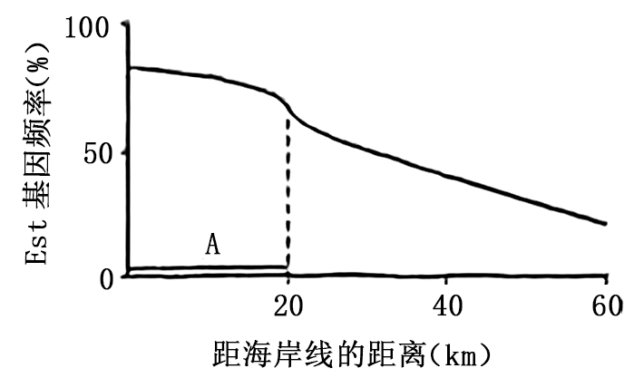
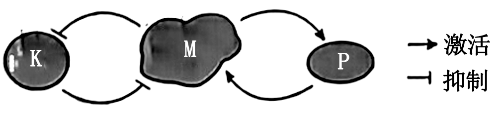
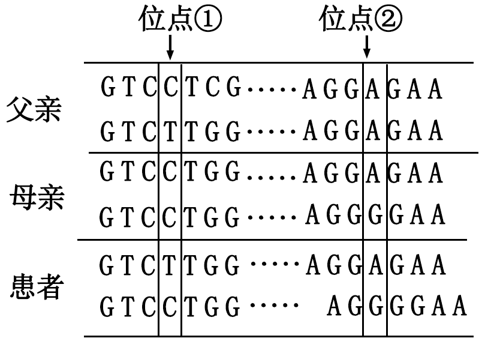
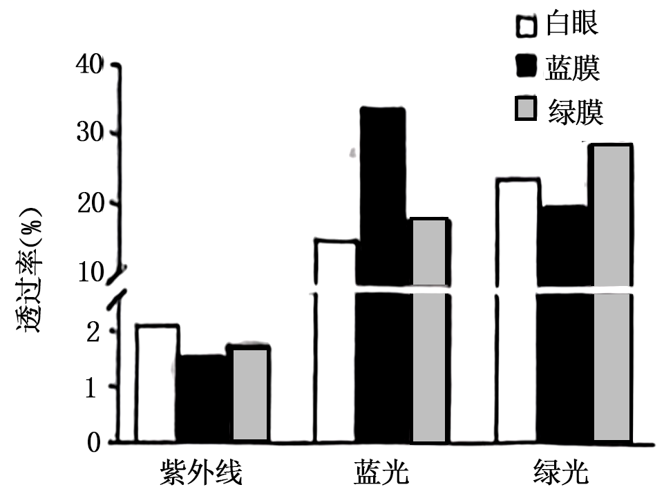
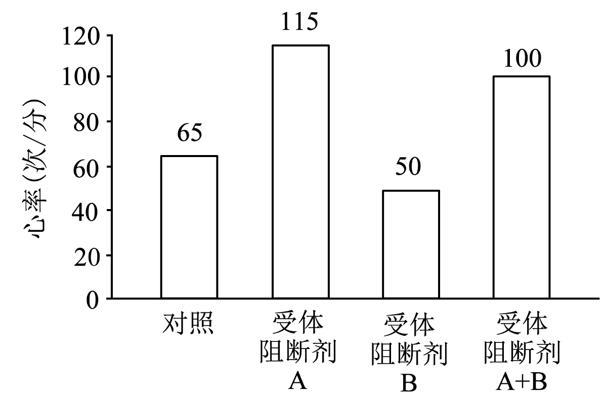
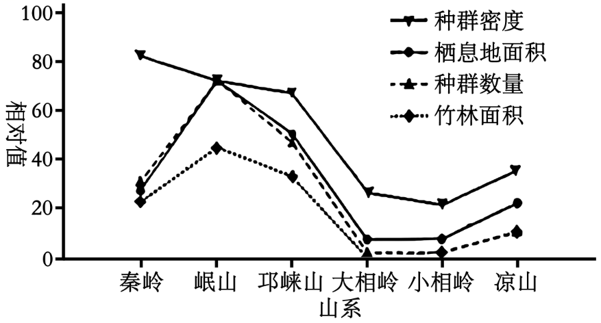
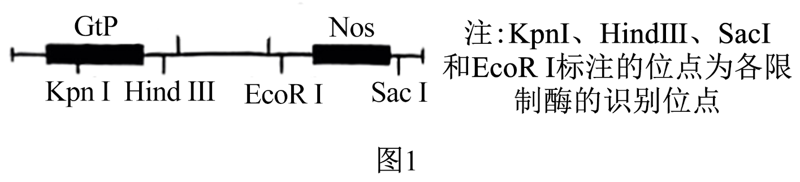
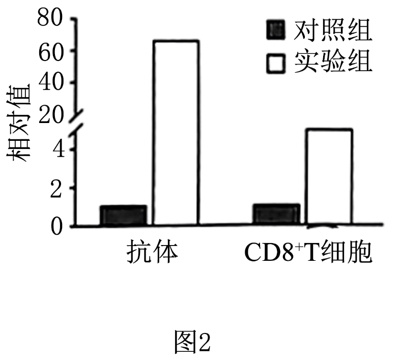
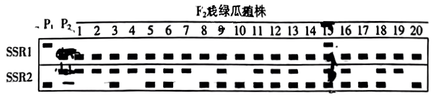

**2024年普通高中学业水平选择性考试（河北卷）**

**生物学**

**本试卷共100分，考试时间75分钟。**

**一、单项选择题：本题共13小题，每小题2分，共26分。在每小题给出的四个选项中，只有一项是符合题目要求的。**

1\. 细胞内不具备运输功能的物质或结构是（ ）

A. 结合水 B. 囊泡 C. 细胞骨架 D. tRNA

2\. 下列关于酶的叙述，正确的是（ ）

A. 作为生物催化剂，酶作用的反应物都是有机物

B. 胃蛋白酶应在酸性、37℃条件下保存

C. 醋酸杆菌中与发酵产酸相关的酶，分布于其线粒体内膜上

D. 从成年牛、羊等草食类动物的肠道内容物中可获得纤维素酶

3\. 核DNA受到损伤时ATM蛋白与受损部位结合，被激活后参与DNA修复，同时可诱导抗氧化酶基因H的表达。下列分析错误的是（ ）

A. 细胞在修复受损的DNA时，抗氧化能力也会提高

B. ATM在细胞质合成和加工后，经核孔进入细胞核发挥作用

C. H蛋白可减缓氧化产生的自由基导致的细胞衰老

D. ATM基因表达增强的个体受辐射后更易患癌

4\. 下列关于DNA复制和转录的叙述，正确的是（ ）

A. DNA复制时，脱氧核苷酸通过氢键连接成子链

B. 复制时，解旋酶使DNA双链由5′端向3′端解旋

C. 复制和转录时，在能量的驱动下解旋酶将DNA双链解开

D. DNA复制合成的子链和转录合成的RNA延伸方向均为由5′端向3′端

5\. 某病毒具有蛋白质外壳，其遗传物质的碱基含量如表所示，下列叙述正确的是（ ）

|       |      |      |      |     |      |
|:-----:|:----:|:----:|:----:|:---:|:----:|
| 碱基种类  | A    | C    | G    | T   | U    |
| 含量（％） | 31.2 | 20.8 | 28.0 | 0   | 20.0 |

A. 该病毒复制合成的互补链中G＋C含量为51.2％

B. 病毒的遗传物质可能会引起宿主DNA变异

C. 病毒增殖需要的蛋白质在自身核糖体合成

D. 病毒基因的遗传符合分离定律

6\. 地中海蚊子的数量，每年在距海岸线0～20 km范围内（区域A）喷洒杀虫剂。某种蚊子的Est基因与毒素降解相关，其基因频率如图所示。下列分析正确的是（ ）

A. 在区域A中，该种蚊子的Est基因频率发生不定向改变

B. 随着远离海岸线，区域A中该种蚊子Est基因频率的下降主要由迁入和迁出导致

C. 距海岸线0～60 km区域内，蚊子受到杀虫剂的选择压力相同

D. 区域A中的蚊子可快速形成新物种

7\. 某同学足球比赛时汗流浃背，赛后适量饮水并充分休息。下列相关叙述错误的是（ ）

A. 足球比赛中支气管扩张，消化液分泌增加

B. 运动所致体温升高的恢复与皮肤血流量、汗液分泌量增多相关

C. 大量出汗后适量饮用淡盐水，有助于维持血浆渗透压的相对稳定

D. 适量运动有助于减少和更好地应对情绪波动

8\. 甲状腺激素在肝脏中激活其β受体，使机体产生激素G，进而促进胰岛素分泌。下列叙述错误的是（ ）

A. 肾上腺素等升高血糖的激素与胰岛素在血糖调节中的作用相抗衡

B. 甲状腺激素能升高血糖，也可通过激素G间接降低血糖

C. 血糖浓度变化可以调节胰岛素分泌，但不能负反馈调节升高血糖的激素分泌

D. 激素G作用于胰岛B细胞促进胰岛素分泌属于体液调节

9\. 水稻在苗期会表现出顶端优势，其分蘖相当于侧枝。AUX1是参与水稻生长素极性运输的载体蛋白之一。下列分析错误的是（ ）

A. AUX1缺失突变体的分蘖可能增多

B. 分蘖发生部位生长素浓度越高越有利于分蘖增多

C. 在水稻的成熟组织中，生长素可进行非极性运输

D. 同一浓度的生长素可能会促进分蘖的生长，却抑制根的生长

10\. 我国拥有悠久的农业文明史。古籍中描述了很多体现劳动人民伟大智慧的农作行为。下列对相关描述所体现的生物与环境关系的分析错误的是（ ）

A. “凡种谷，雨后为佳”描述了要在下雨后种谷，体现了非生物因素对生物的影响

B. “区中草生，茇之”描述了要及时清除田里的杂草，体现了种间竞争对生物的影响

C. “慎勿于大豆地中杂种麻子”描述了大豆和麻子因相互遮光而不能混杂种植，体现了两物种没有共同的生态位

D. “六月雨后种绿豆，八月中，犁䅖杀之……十月中种瓜”描述了可用犁将绿豆植株翻埋到土中肥田后种瓜，体现了对资源的循环利用

11\. 下列关于群落的叙述，正确的是（ ）

A. 过度放牧会改变草原群落物种组成，但群落中占优势的物种不会改变

B. 多种生物只要能各自适应某一空间的非生物环境，即可组成群落

C. 森林群落中林下喜阴植物的种群密度与林冠层的郁闭度无关

D. 在四季分明的温带地区，森林群落和草原群落的季节性变化明显

12\. 天然林可分为单种乔木的纯林和包含多种乔木的混交林。人工林通常是在栽培某树种后，经多年持续去除自然长出的其他树木进行抚育，形成单种乔木的森林。下列叙述错误的是（ ）

A. 混交林的多种乔木可为群落中的其他物种创造复杂的生物环境

B. 人工林经过抚育，环境中的能量和物质更高效地流向栽培树种

C. 天然生长的纯林和人工林都只有单一的乔木树种，群落结构相同

D. 与人工林相比，混交林生态系统物种组成更复杂

13\. 下列相关实验操作正确的是（ ）

A. 配制PCR反应体系时，加入等量的4种核糖核苷酸溶液作为扩增原料

B. 利用添加核酸染料的凝胶对PCR产物进行电泳后，在紫外灯下观察结果

C. 将配制的酵母培养基煮沸并冷却后，在酒精灯火焰旁倒平板

D. 将接种环烧红，迅速蘸取酵母菌液在培养基上划线培养，获得单菌落

**二、多项选择题：本题共5小题，每小题3分，共15分。在每小题给出的四个选项中，有两个或两个以上选项符合题目要求，全部选对得3分，选对但不全的得1分，有选错的得0分。**

14\. 酵母细胞中的M蛋白被激活后可导致核膜裂解、染色质凝缩以及纺锤体形成。蛋白K和P可分别使M发生磷酸化和去磷酸化，三者间的调控关系如图所示。现有一株细胞体积变小的酵母突变体，研究发现其M蛋白的编码基因表达量发生显著改变。下列分析正确的是（ ）

A. 该突变体变小可能是M增多且被激活后造成细胞分裂间期变短所致

B. P和K都可改变M的空间结构，从而改变其活性

C. K不足或P过量都可使酵母细胞积累更多物质而体积变大

D. M和P之间的活性调控属于负反馈调节

15\. 单基因隐性遗传性多囊肾病是P基因突变所致。图中所示为某患者及其父母同源染色体上P基因的相关序列检测结果（每个基因序列仅列出一条链，其他未显示序列均正常）。患者的父亲、母亲分别具有①、②突变位点，但均未患病。患者弟弟具有①和②突变位点。下列分析正确的是（ ）

A. 未突变P基因位点①碱基对为A－T

B. ①和②位点的突变均会导致P基因功能的改变

C. 患者同源染色体的①和②位点间发生交换，可使其产生正常配子

D. 不考虑其他变异，患者弟弟体细胞的①和②突变位点不会位于同一条染色体上

16\. 假性醛固酮减少症（PP）患者合成和分泌醛固酮未减少，但表现出醛固酮缺少所致的渗透压调节异常。下列叙述错误的是（ ）

A. 人体内的几乎全部由小肠吸收获取，主要经肾随尿排出

B. 抗利尿激素增多与患PP均可使细胞外液增多

C. 血钠含量降低可使肾上腺合成的醛固酮减少

D. PP患者病因可能是肾小管和集合管对的转运异常

17\. 通过系统性生态治理，如清淤补水、种植水生植物和投放有益微生物等措施，白洋淀湿地生态环境明显改善。下列叙述正确的是（ ）

A. 清除淀区淤泥减少了系统中氮和磷的含量，可使水华发生概率降低

B. 对白洋淀补水后，可大力引入外来物种以提高生物多样性

C 种植水生植物使淀区食物网复杂化后，生态系统抵抗力稳定性增强

D. 水中投放能降解有机污染物的有益微生物可促进物质循环

18\. 中国传统白酒多以泥窖为发酵基础，素有“千年老窖万年糟”“以窖养糟，以糟养泥”之说。多年反复利用的老窖池内壁窖泥中含有大量与酿酒相关的微生物。下列叙述正确的是（ ）

A. 传统白酒的酿造是在以酿酒酵母为主的多种微生物共同作用下完成的

B. 窖池内各种微生物形成了相对稳定的体系，使酿造过程不易污染杂菌

C. 从窖泥中分离的酿酒酵母扩大培养时，需在或环境中进行

D. 从谷物原料发酵形成的酒糟中，可分离出产淀粉酶的微生物

**三、非选择题：本题共5题，共59分。**

19\. 高原地区蓝光和紫外光较强，常采用覆膜措施辅助林木育苗。为探究不同颜色覆膜对藏川杨幼苗生长的影响，研究者检测了白膜、蓝膜和绿膜对不同光的透过率，以及覆膜后幼苗光合色素的含量，结果如图、表所示。

|      |                                                               |               |
|:----:|:-------------------------------------------------------------:|:-------------:|
| 覆膜处理 | 叶绿素含量（mg/g）                                                   | 类胡萝卜素含量（mg/g） |
| 白膜   | 1.67                                                          | 0.71          |
| 蓝膜   | 220 | 0.90          |
| 绿膜   | 1.74                                                          | 0.65          |

回答下列问题：

（1）如图所示，三种颜色的膜对紫外光、蓝光和绿光的透过率有明显差异，其中\_\_\_\_\_\_\_\_光可被位于叶绿体\_\_\_\_\_\_\_\_上的光合色素高效吸收后用于光反应，进而使暗反应阶段的还原转化为\_\_\_\_\_\_\_\_和\_\_\_\_\_\_\_\_。与白膜覆盖相比，蓝膜和绿膜透过的\_\_\_\_\_\_\_\_较少，可更好地减弱幼苗受到的辐射。

（2）光合色素溶液的浓度与其光吸收值成正比，选择适当波长的光可对色素含量进行测定。提取光合色素时，可利用\_\_\_\_\_\_\_\_作为溶剂。测定叶绿素含量时，应选择红光而不能选择蓝紫光，原因是\_\_\_\_\_\_\_\_\_\_\_\_\_\_\_\_\_\_\_\_\_\_\_。

（3）研究表明，覆盖蓝膜更有利于藏川杨幼苗在高原环境的生长。根据上述检测结果，其原因为\_\_\_\_\_\_\_\_\_\_\_\_\_\_\_\_\_\_\_\_\_\_\_\_\_\_\_\_\_\_\_\_\_（答出两点即可）。

20\. 心率为心脏每分钟搏动的次数。心肌P细胞可自动产生节律性动作电位以控制心脏搏动。同时，P细胞也受交感神经和副交感神经的双重支配。受体阻断剂A和B能与各自受体结合，并分别阻断两类自主神经的作用，以受试者在安静状态下的心率为对照，检测了两种受体阻断剂对心率的影响，结果如图。

回答下列问题：

（1）调节心脏功能的基本中枢位于\_\_\_\_\_\_\_\_。大脑皮层通过此中枢对心脏活动起调节作用，体现了神经系统的\_\_\_\_\_\_\_\_调节。

（2）心肌P细胞能自动产生动作电位，不需要刺激，该过程涉及的跨膜转运。神经细胞只有受刺激后，才引起\_\_\_\_\_\_\_\_离子跨膜转运的增加，进而形成膜电位为\_\_\_\_\_\_\_\_的兴奋状态。上述两个过程中离子跨膜转运方式相同，均为\_\_\_\_\_\_\_\_。

（3）据图分析，受体阻断剂A可阻断\_\_\_\_\_\_\_\_神经的作用。兴奋在此神经与P细胞之间进行传递的结构为\_\_\_\_\_\_\_\_。

（4）自主神经被完全阻断时的心率为固有心率。据图分析，受试者在安静状态下的心率\_\_\_\_\_\_\_\_（填“大于”“小于”或“等于”）固有心率。若受试者心率为每分钟90次，比较此时两类自主神经的作用强度：\_\_\_\_\_\_\_\_\_\_\_\_\_\_\_\_\_\_\_\_\_\_\_\_\_\_\_\_\_\_\_\_\_\_\_\_\_\_\_\_。

21\. 我国采取了多种措施对大熊猫实施保护，但在其栖息地一定范围内依旧存在人类活动的干扰。第四次全国大熊猫调查结果如图所示，大熊猫主要分布于六个山系，各山系的种群间存在地理隔离。

回答下列问题：

（1）割竹挖笋和放牧使大熊猫食物资源减少，人和家畜属于影响大熊猫种群数量的\_\_\_\_\_\_\_\_因素。采矿和旅游开发等使大熊猫栖息地的部分森林转化为裸岩或草地，生态系统中消费者获得的总能量\_\_\_\_\_\_\_\_。森林面积减少，土壤保持和水源涵养等功能下降，这些功能属于生物多样性的\_\_\_\_\_\_\_\_价值。

（2）调查结果表明，大熊猫种群数量与\_\_\_\_\_\_\_\_和\_\_\_\_\_\_\_\_呈正相关。天然林保护、退耕还林及自然保护区建设使大熊猫栖息地面积扩大，且\_\_\_\_\_\_\_\_资源增多，提高了栖息地对大熊猫的环境容纳量。而旅游开发和路网扩张等使大熊猫栖息地丧失和\_\_\_\_\_\_\_\_导致大熊猫被分为33个局域种群，种群增长受限。

（3）调查结果表明，岷山山系大熊猫栖息地面积和竹林面积最大，秦岭山系的秦岭箭竹等大熊猫主食竹资源最丰富，这些环境特征有利于提高种群的繁殖能力。据此分析，环境资源如何通过改变出生率和死亡率影响大熊猫种群密度：\_\_\_\_\_\_\_\_\_\_\_\_\_\_\_\_\_\_\_\_\_\_\_\_\_\_\_\_\_\_\_\_\_\_\_\_\_\_\_\_。

（4）综合分析，除了就地保护，另提出2条保护大熊猫的措施：\_\_\_\_\_\_\_\_\_\_\_\_\_\_\_\_\_\_\_\_\_\_\_\_。

22\. 新城疫病毒可引起家禽急性败血性传染病，我国科学家将该病毒相关基因改造为r2HN，使其在水稻胚乳特异表达，制备获得r2HN疫苗，并对其免疫效果进行了检测。

回答下列问题：

（1）实验所用载体的部分结构及其限制酶识别位点如图1所示。其中GtP为启动子，若使r2HN仅在水稻胚乳表达，GtP应为\_\_\_\_\_\_\_\_\_\_\_\_\_\_\_\_启动子。Nos为终止子，其作用为\_\_\_\_\_\_\_\_\_\_\_\_\_\_\_\_。r2HN基因内部不含载体的限制酶识别位点。因此，可选择限制酶\_\_\_\_\_\_\_\_和\_\_\_\_\_\_\_\_对r2HN基因与载体进行酶切，用于表达载体的构建。

（2）利用\_\_\_\_\_\_\_\_方法将r2HN基因导入水稻愈伤组织。为检测r2HN表达情况，可通过PCR技术检测\_\_\_\_\_\_\_\_\_\_\_\_\_\_\_\_，通过\_\_\_\_\_\_\_\_技术检测是否翻译出r2HN蛋白。

（3）获得转基因植株后，通常选择单一位点插入目的基因的植株进行研究。此类植株自交一代后，r2HN纯合体植株的占比为\_\_\_\_\_\_\_\_。选择纯合体进行后续研究的原因是\_\_\_\_\_\_\_\_\_\_\_\_\_\_\_\_。

（4）制备r2HN疫苗后，为研究其免疫效果，对实验组鸡进行接种，对照组注射疫苗溶剂。检测两组鸡体内抗新城疫病毒抗体水平和特异应答的细胞（细胞毒性T细胞）水平，结果如图2所示。据此分析，获得的r2HN疫苗能够成功激活鸡的\_\_\_\_\_\_\_\_免疫和\_\_\_\_\_\_\_\_免疫。

（5）利用水稻作为生物反应器生产r2HN疫苗的优点是\_\_\_\_\_\_\_\_\_\_\_\_\_\_\_\_\_\_\_\_\_\_\_\_\_\_\_\_\_\_\_\_。（答出两点即可）

23\. 西瓜瓜形（长形、椭圆形和圆形）和瓜皮颜色（深绿、绿条纹和浅绿）均为重要育种性状。为研究两类性状的遗传规律，选用纯合体（长形深绿）、（圆形浅绿）和（圆形绿条纹）进行杂交。为方便统计，长形和椭圆形统一记作非圆，结果见表。

|     |                                                    |                                                      |                                                         |
|:---:|:--------------------------------------------------:|:----------------------------------------------------:|:-------------------------------------------------------:|
| 实验  | 杂交组合                                               | 表型 | 表型和比例 |
| ①   |  | 非圆深绿                                                 | 非圆深绿︰非圆浅绿︰圆形深绿︰圆形浅绿＝9︰3︰3︰1                             |
| ②   |  | 非圆深绿                                                 | 非圆深绿︰非圆绿条纹︰圆形深绿︰圆形绿条纹＝9︰3︰3︰1                           |

回答下列问题：

（1）由实验①结果推测，瓜皮颜色遗传遵循\_\_\_\_\_\_\_\_定律，其中隐性性状为\_\_\_\_\_\_\_\_。

（2）由实验①和②结果不能判断控制绿条纹和浅绿性状基因之间的关系。若要进行判断，还需从实验①和②的亲本中选用\_\_\_\_\_\_\_\_进行杂交。若瓜皮颜色为\_\_\_\_\_\_\_\_，则推测两基因为非等位基因。

（3）对实验①和②的非圆形瓜进行调查，发现均为椭圆形，则中椭圆深绿瓜植株的占比应为\_\_\_\_\_\_\_\_。若实验①的植株自交，子代中圆形深绿瓜植株的占比为\_\_\_\_\_\_\_\_。

（4）SSR是分布于各染色体上的DNA序列，不同染色体具有各自的特异SSR。SSR1和SSR2分别位于西瓜的9号和1号染色体。在和中SSR1长度不同，SSR2长度也不同。为了对控制瓜皮颜色的基因进行染色体定位，电泳检测实验①中浅绿瓜植株、和的SSR1和SSR2的扩增产物，结果如图。据图推测控制瓜皮颜色的基因位于\_\_\_\_\_\_\_\_染色体。检测结果表明，15号植株同时含有两亲本的SSR1和SSR2序列，同时具有SSR1的根本原因是\_\_\_\_\_\_\_\_\_\_\_\_\_\_\_\_\_\_\_\_\_\_\_\_\_\_\_\_\_\_\_\_\_\_\_\_\_\_\_\_，同时具有SSR2的根本原因是\_\_\_\_\_\_\_\_\_\_\_\_\_\_\_\_。

（5）为快速获得稳定遗传的圆形深绿瓜株系，对实验①中圆形深绿瓜植株控制瓜皮颜色的基因所在染色体上的SSR进行扩增、电泳检测。选择检测结果为\_\_\_\_\_\_\_\_的植株，不考虑交换，其自交后代即为目的株系。
