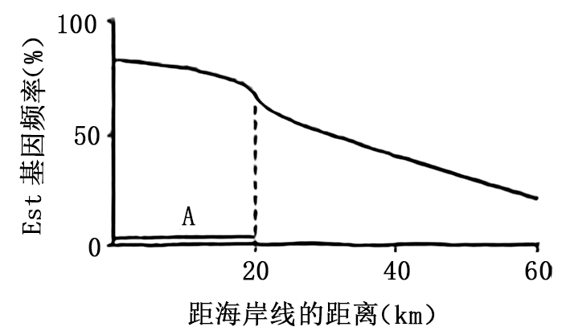
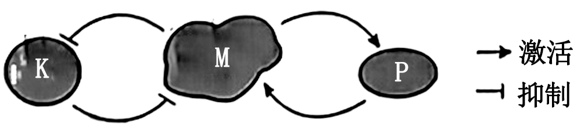
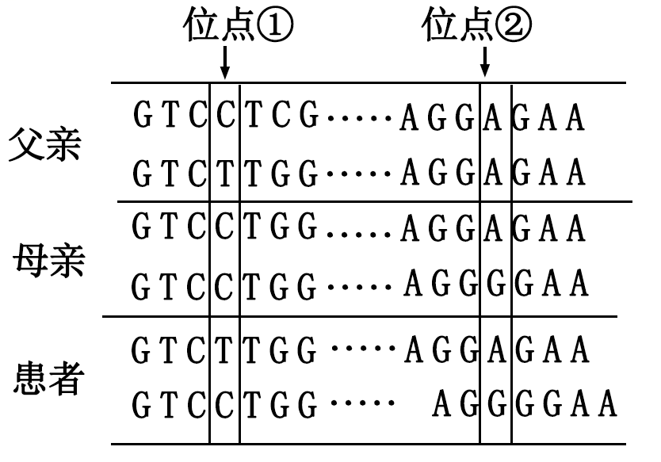
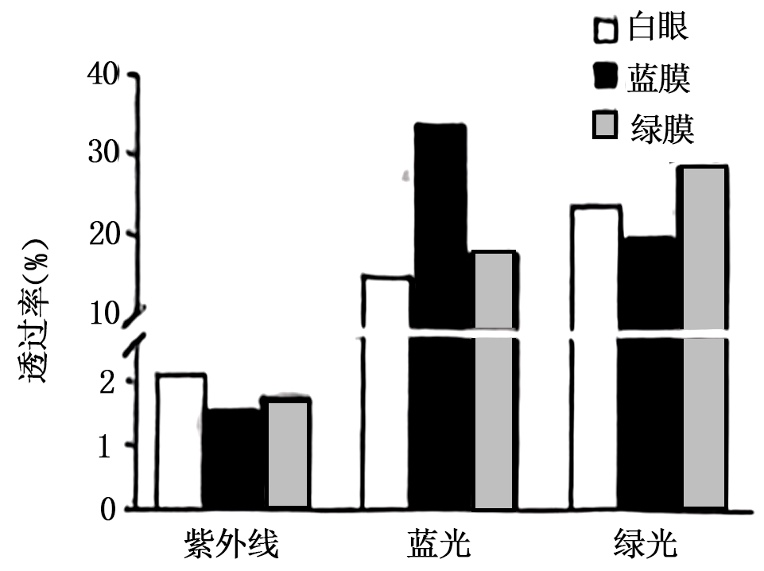
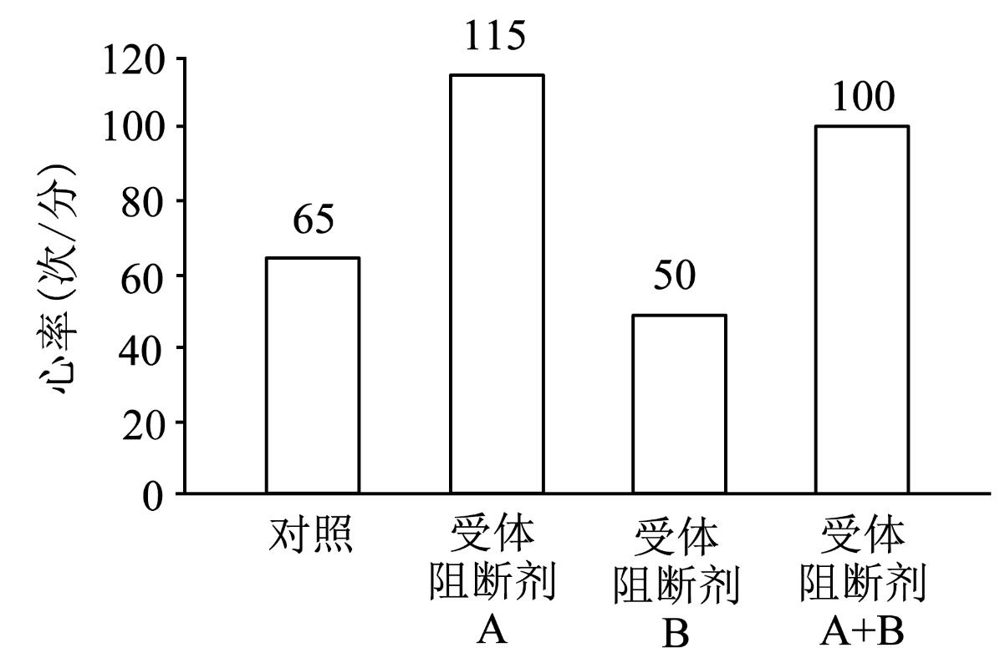
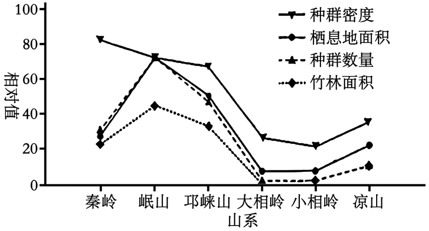
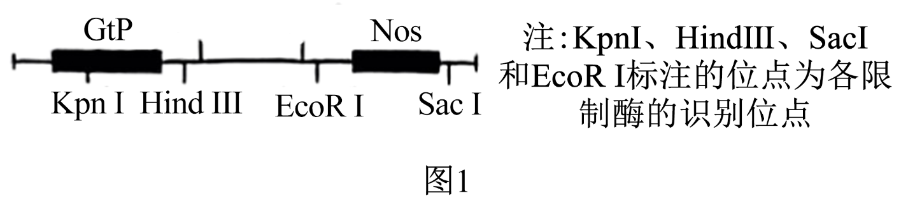
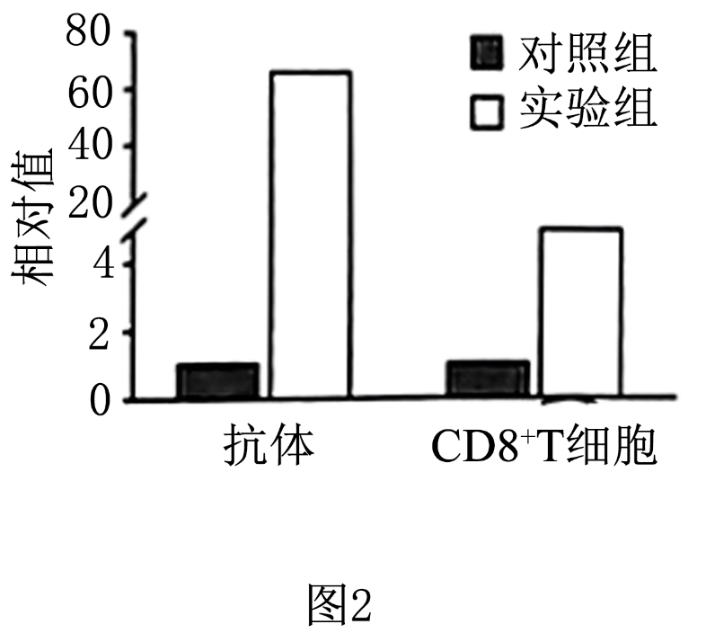
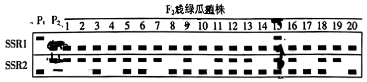

**2024年普通高中学业水平选择性考试（河北卷）**

**生物学**

**本试卷共100分，考试时间75分钟。**

**一、单项选择题：本题共13小题，每小题2分，共26分。在每小题给出的四个选项中，只有一项是符合题目要求的。**

1\. 细胞内不具备运输功能的物质或结构是（ ）

A. 结合水 B. 囊泡 C. 细胞骨架 D. tRNA

【答案】A

【解析】

【分析】细胞中的水以自由水和结合水的形式存在，结合水是细胞结构的主要组成成分，自由水是细胞内良好的溶剂，是许多化学反应的介质，还参与细胞内的化学反应和物质运输。

细胞骨架是由蛋白质纤维组成的网架结构，维持着细胞的形态，锚定并支撑着许多细胞器，与细胞运动、分裂、分化以及物质运输、能量转化、信息传递等生命活动密切相关。

【详解】A、结合水是细胞结构的重要成分，不具备运输功能，A正确；

B、囊泡可运输分泌蛋白等，B错误；

C、细胞骨架与细胞运动、分裂、分化以及物质运输、能量转化、信息传递等生命活动密切相关，C错误；

D、tRNA可运输氨基酸，D错误。

故选A。

2\. 下列关于酶的叙述，正确的是（ ）

A. 作为生物催化剂，酶作用的反应物都是有机物

B. 胃蛋白酶应在酸性、37℃条件下保存

C. 醋酸杆菌中与发酵产酸相关的酶，分布于其线粒体内膜上

D. 从成年牛、羊等草食类动物的肠道内容物中可获得纤维素酶

【答案】D

【解析】

【分析】酶是活细胞产生的具有催化作用的有机物，应在最适pH、低温条件下保存。原核生物只有唯一的细胞器核糖体，无细胞核和其他细胞器。

【详解】A、一般来说，酶是活细胞产生的具有催化作用的有机物，但其作用的反应物不一定是有机物，如过氧化氢酶作用的反应物过氧化氢就是无机物，A错误；

B、胃蛋白酶应在酸性、低温下保存，B错误；

C、醋酸杆菌细菌，属于原核生物，不具有线粒体结构，C错误；

D、成年牛、羊等草食类动物肠道中有可以分解纤维素的微生物，所以从其肠道内容物中可以获得纤维素酶，D正确。

故选D。

3\. 核DNA受到损伤时ATM蛋白与受损部位结合，被激活后参与DNA修复，同时可诱导抗氧化酶基因H的表达。下列分析错误的是（ ）

A. 细胞在修复受损的DNA时，抗氧化能力也会提高

B. ATM在细胞质合成和加工后，经核孔进入细胞核发挥作用

C. H蛋白可减缓氧化产生的自由基导致的细胞衰老

D. ATM基因表达增强的个体受辐射后更易患癌

【答案】B

【解析】

【分析】细胞衰老的学说：自由基学说、端粒学说。

自由基：通常把异常活跃的带电分子或基团称为自由基。

【详解】A、依据题干信息，当核DNA受到损伤时，ATM蛋白与受损部位结合，可诱导抗氧化酶基因基因H的表达，即提高了其抗氧化能力，A正确；

B、ATM属于胞内蛋白，所以在细胞质合成后，不需要经过加工，经核孔进入细胞核发挥作用，B错误；

C、H蛋白是抗氧化酶基因H表达的产物，可以减缓氧化过程中所产生的自由基导致的细胞衰老，C正确；

D、当ATM基因表达增强，所产生的ATM蛋白会过多，ATM蛋白不仅会与受损部位结合，也可能会与正常的类似部位结合，使DNA结构受损，这样的个体受到物理致癌因素（辐射等）的刺激后，可能会进一步诱发DNA的破坏，增大癌症的风险，D正确。

故选B。

4\. 下列关于DNA复制和转录的叙述，正确的是（ ）

A. DNA复制时，脱氧核苷酸通过氢键连接成子链

B. 复制时，解旋酶使DNA双链由5′端向3′端解旋

C. 复制和转录时，在能量的驱动下解旋酶将DNA双链解开

D. DNA复制合成的子链和转录合成的RNA延伸方向均为由5′端向3′端

【答案】D

【解析】

【分析】DNA分子复制的方式是半保留复制，且合成两条子链的方向是相反的；DNA在复制过程中，边解旋边进行半保留复制。由图可知，DNA解旋酶能使双链DNA解开，且需要消耗ATP；

【详解】A、DNA复制时，脱氧核苷酸通过磷酸二酯键连接成子链，A错误；

B、复制时，解旋酶使得DNA双链从复制起点开始，以双向进行的方式解旋，这并不是从5′端到3′端的单向解旋，B错误；

C、转录时不需要解旋酶，RNA聚合酶即可完成解旋，C错误；

D、DNA复制合成的子链和转录合成的RNA延伸方向均为由5′端向3′端，D正确；

故选D。

5\. 某病毒具有蛋白质外壳，其遗传物质的碱基含量如表所示，下列叙述正确的是（ ）

|       |      |      |      |     |      |
|:-----:|:----:|:----:|:----:|:---:|:----:|
| 碱基种类  | A    | C    | G    | T   | U    |
| 含量（％） | 31.2 | 20.8 | 28.0 | 0   | 20.0 |

A. 该病毒复制合成的互补链中G＋C含量为51.2％

B. 病毒的遗传物质可能会引起宿主DNA变异

C. 病毒增殖需要的蛋白质在自身核糖体合成

D. 病毒基因的遗传符合分离定律

【答案】B

【解析】

【分析】据表可知，该病毒遗传物质中含有U，不含T，即该病毒为RNA病毒。病毒必需寄生在活细胞内才能完成正常的生命活动。

【详解】A、由表可知，该病毒为RNA病毒，根据碱基互补配对原则可知，该病毒复制合成的互补链中G＋C含量与原RNA含量一致，为48.8％，A错误；

B、逆转录病毒经逆转录得到的DNA可能整合到宿主细胞的DNA上，引起宿主DNA变异，B正确；

C、病毒增殖需要的蛋白质在宿主细胞的核糖体上合成，C错误；

D、必需是进行有性生殖的真核生物的细胞核基因遗传才遵循基因的分离定律，病毒基因的遗传不符合分离定律，D错误。

故选B。

6\. 地中海蚊子的数量，每年在距海岸线0～20 km范围内（区域A）喷洒杀虫剂。某种蚊子的Est基因与毒素降解相关，其基因频率如图所示。下列分析正确的是（ ）

A. 在区域A中，该种蚊子的Est基因频率发生不定向改变

B. 随着远离海岸线，区域A中该种蚊子Est基因频率的下降主要由迁入和迁出导致

C. 距海岸线0～60 km区域内，蚊子受到杀虫剂的选择压力相同

D. 区域A中的蚊子可快速形成新物种

【答案】B

【解析】

【分析】在自然选择的作用下，种群的基因频率会发生定向改变，导致生物朝着一定的方向进化。

【详解】A、据图可知，在区域A中，Est基因频率逐渐下降，说明该种蚊子的Est基因频率发生了定向改变，A错误；

B、随着远离海岸线，区域A中该种蚊子Est基因频率的下降主要由与邻近区域的迁入和迁出导致的，B正确；

C、距海岸线0～60 km区域内，杀虫剂的浓度不同，所以杀虫剂对蚊子的选择作用不同，即蚊子受到杀虫剂的选择压力不同，C错误；

D、新物种形成的标志是产生生殖隔离，所以区域A中的蚊子中Est基因频率的变化，不一定导致其快速形成新物种，D错误。

故选B。

7\. 某同学足球比赛时汗流浃背，赛后适量饮水并充分休息。下列相关叙述错误的是（ ）

A. 足球比赛中支气管扩张，消化液分泌增加

B. 运动所致体温升高的恢复与皮肤血流量、汗液分泌量增多相关

C. 大量出汗后适量饮用淡盐水，有助于维持血浆渗透压的相对稳定

D. 适量运动有助于减少和更好地应对情绪波动

【答案】A

【解析】

【分析】人体的水平衡调节过程：

（1）当人体失水过多、饮水不足或吃的食物过咸时→细胞外液渗透压升高→下丘脑渗透压感受器受到刺激→垂体释放抗利尿激素增多→肾小管、集合管对水分的重吸收增加→尿量减少。同时大脑皮层产生渴觉（主动饮水）；

（2）体内水过多时→细胞外液渗透压降低→下丘脑渗透压感受器受到刺激→垂体释放抗利尿激素减少→肾小管、集合管对水分的重吸收减少→尿量增加。

【详解】A、足球比赛中，处于兴奋状态，交感神经活动占优势，表现为心跳加快，支气管扩张，但胃肠蠕动和消化液的分泌会受到抑制，A错误；

B、正常机体产热量=散热量，运动时体温升高，产热量增加，为了达到体温的相对稳定，散热量也会增加，主要通过皮肤毛细血管扩张，血流量增加，与此同时，汗腺分泌汗液增多，以此来增加散热量，B正确；

C、大量出汗不仅丢失了大量的水分，同时也丢失了无机盐，通过适量饮用淡盐水，有助于维持血浆渗透压的相对稳定，C正确；

D、情绪是大脑的高级功能之一，消极情绪到一定程度就患有抑郁症，建立良好的人际关系、适量运动有助于减少和更好地应对情绪波动，D正确。

故选A。

8\. 甲状腺激素在肝脏中激活其β受体，使机体产生激素G，进而促进胰岛素分泌。下列叙述错误的是（ ）

A. 肾上腺素等升高血糖激素与胰岛素在血糖调节中的作用相抗衡

B. 甲状腺激素能升高血糖，也可通过激素G间接降低血糖

C. 血糖浓度变化可以调节胰岛素分泌，但不能负反馈调节升高血糖的激素分泌

D. 激素G作用于胰岛B细胞促进胰岛素分泌属于体液调节

【答案】C

【解析】

【分析】胰岛素是机体内唯一能降血糖的激素，与机体内其他升血糖的激素在血糖调节中的作用相抗衡。

【详解】A、肾上腺素等升高血糖的激素与胰岛素（降血糖）在血糖调节中的作用相抗衡，A正确；

B、甲状腺激素能升高血糖，由题干信息可知，甲状腺激素也可激活肝脏中的β受体，使机体产生激素G，进而促进胰岛素分泌，间接降低血糖，B正确；

C、血糖浓度降低时，会通过调节作用促进胰高血糖素分泌从而升高血糖，而胰高血糖素的作用结果（血糖升高）会通过负反馈调节胰高血糖素的分泌，C错误；

D、激素G作用于胰岛B细胞促进胰岛素分泌通过体液运输实现，属于体液调节，D正确。

故选C。

9\. 水稻在苗期会表现出顶端优势，其分蘖相当于侧枝。AUX1是参与水稻生长素极性运输的载体蛋白之一。下列分析错误的是（ ）

A. AUX1缺失突变体的分蘖可能增多

B. 分蘖发生部位生长素浓度越高越有利于分蘖增多

C. 在水稻的成熟组织中，生长素可进行非极性运输

D. 同一浓度的生长素可能会促进分蘖的生长，却抑制根的生长

【答案】B

【解析】

【分析】生长素：

1、产生：生长素的主要合成部位是幼嫩的芽、叶和发育中的种子，由色氨酸经过一系列反应转变而成。

2、运输：胚芽鞘、芽、幼叶、幼根中：生长素只能从形态学的上端运输到形态学的下端，而不能反过来运输，称为极性运输；在成熟组织中：生长素可以通过韧皮部进行非极性运输。

3．分布：各器官均有分布，但相对集中地分布于新陈代谢旺盛的部分；老根（叶）＞幼根（叶）；分生区＞伸长区；顶芽＞侧芽。

【详解】A、AUX1缺失突变体导致生长素不能正常运输，顶端优势消失，分蘖可能增多，A正确；

B、分蘖发生部位生长素浓度过高时会对分蘖产生抑制，导致分蘖减少，B错误；

C、在成熟组织中，生长素可以通过韧皮部进行非极性运输，C正确；

D、根对生长素的敏感程度高于芽，同一浓度的生长素可能会促进分蘖的生长，却抑制根的生长，D正确。

故选B。

10\. 我国拥有悠久的农业文明史。古籍中描述了很多体现劳动人民伟大智慧的农作行为。下列对相关描述所体现的生物与环境关系的分析错误的是（ ）

A. “凡种谷，雨后为佳”描述了要在下雨后种谷，体现了非生物因素对生物的影响

B. “区中草生，茇之”描述了要及时清除田里的杂草，体现了种间竞争对生物的影响

C. “慎勿于大豆地中杂种麻子”描述了大豆和麻子因相互遮光而不能混杂种植，体现了两物种没有共同的生态位

D. “六月雨后种绿豆，八月中，犁䅖杀之……十月中种瓜”描述了可用犁将绿豆植株翻埋到土中肥田后种瓜，体现了对资源的循环利用

【答案】C

【解析】

【分析】生态为是指一个物种在群落中的地位和作用，包括所处的空间位置、占用资源的情况，以及与其他物种的关系等。

【详解】A、“凡种谷，雨后为佳”描述了要在下雨后种谷，说明种子的萌发需要水分，体现了非生物因素对生物的影响，A正确；

B、“区中草生，茇之”描述了要及时清除田里的杂草，其目的是通过减弱种间竞争提高产量，体现了种间竞争对生物的影响，B正确；

C、“慎勿于大豆地中杂种麻子”描述了大豆和麻子因相互遮光而不能混杂种植，说明两物种有共同的生态位，C错误；

D、“六月雨后种绿豆，八月中，犁䅖杀之……十月中种瓜”描述了可用犁将绿豆植株翻埋到土中肥田后种瓜，该过程中通过微生物的作用将绿豆植株中的有机物分解成无机物进而起到肥田的作用，该过程体现了对资源的循环利用，D正确。

故选C。

11\. 下列关于群落的叙述，正确的是（ ）

A. 过度放牧会改变草原群落物种组成，但群落中占优势的物种不会改变

B. 多种生物只要能各自适应某一空间的非生物环境，即可组成群落

C. 森林群落中林下喜阴植物的种群密度与林冠层的郁闭度无关

D. 在四季分明的温带地区，森林群落和草原群落的季节性变化明显

【答案】D

【解析】

【分析】1、群落的季节性是指由于阳光、温度和水分等随季节而变化,群落的外貌和结构也会随之发生有规律的变化。例如,有些种类的植物在早春来临时开始萌发,并迅速开花和结实,到了夏季其生活周期结束;另一些种类的植物则在夏季达到生命活动的高峰,从而导致群落在春季和夏季的物种组成和空间结构发生改变。

2、影响种群数量变化的因素可以概括为非生物因素（阳光、温度、水等）和生物因素（群内部生物因素和种群外部生物因素）两大类。

3、一个群落中的物种不论多少,都不是随机的简单集合, 而是通过复杂的种间关系,形成一个有机的整体。

【详解】A、过度放牧，牛、羊等牲畜会大量取食禾本科植物，有利于一二年生的低矮草本获得更多的光照等资源而成为占优势的植物，所以过度放牧会改变草原群落物种组成，也会改变优势的物种，A错误。

B、一个群落中的物种不论多少,都不是随机的简单集合, 而是通过复杂的种间关系,形成一个有机的整体，各自适应某一空间的非生物环境，但彼此没有一定的种间关系就不能构成群落，B错误；

C、森林中林下植株种群密度取决于林冠层的郁闭度，即主要取决于林下植物受到的光照强度，林冠层的郁闭度越大，种群密度越小，C错误；

D、在夏季，温带落叶阔叶林枝繁叶茂，而在冬季叶片全落，只剩光秃的枝干，所以在温带地区，草原和森林的外貌在春、夏、秋、冬有很大不同，森林群落和草原群落的季节性变化明显，D正确。

故选D。

12\. 天然林可分为单种乔木的纯林和包含多种乔木的混交林。人工林通常是在栽培某树种后，经多年持续去除自然长出的其他树木进行抚育，形成单种乔木的森林。下列叙述错误的是（ ）

A. 混交林的多种乔木可为群落中的其他物种创造复杂的生物环境

B. 人工林经过抚育，环境中的能量和物质更高效地流向栽培树种

C. 天然生长的纯林和人工林都只有单一的乔木树种，群落结构相同

D. 与人工林相比，混交林生态系统物种组成更复杂

【答案】C

【解析】

【分析】群落中，物种丰富度越高、营养关系越复杂，生态系统物种组成更复杂。

【详解】A、混交林的多种乔木群落结构更加复杂，可为群落中的其他物种创造复杂的生物环境，A正确；

B、人工林经过抚育，去除自然长出的其他树木，减小非栽培种的竞争，环境中的能量和物质更高效地流向栽培树种，B正确；

C、据题意可知，天然生长的纯林只有单一的乔木树种，但人工林在抚育前，不止一种乔木，且二者的群落结构不完全相同，C错误；

D、与人工林相比，混交林物种丰富度更高，营养关系更复杂，生态系统物种组成更复杂，D正确。

故选C。

13\. 下列相关实验操作正确的是（ ）

A. 配制PCR反应体系时，加入等量的4种核糖核苷酸溶液作为扩增原料

B. 利用添加核酸染料的凝胶对PCR产物进行电泳后，在紫外灯下观察结果

C. 将配制的酵母培养基煮沸并冷却后，在酒精灯火焰旁倒平板

D. 将接种环烧红，迅速蘸取酵母菌液在培养基上划线培养，获得单菌落

【答案】B

【解析】

【分析】PCR的原理是DNA复制，DNA的单体是脱氧核糖核苷酸。琼脂糖凝胶制备中加入的核酸染料能与DNA分子结合，利用添加核酸染料的凝胶对PCR产物进行电泳后，在紫外灯下观察结果。

【详解】A、PCR的原理是DNA复制，DNA的单体是脱氧核糖核苷酸，配制PCR反应体系时，加入4种脱氧核糖核苷酸的等量混合液作为扩增原料，A错误；

B、琼脂糖凝胶制备中加入的核酸染料能与DNA分子结合，凝胶中的DNA分子通过染色，可以在波长为300nm的紫外灯下被检测出来，B正确；

C、将配制的酵母培养基高温灭菌并冷却到不烫手（50℃左右）后，在酒精灯火焰旁倒平板，C错误；

D、将接种环烧红，待冷却后（避免菌种被烫死），蘸取酵母菌液在培养基上划线培养，获得单菌落，D错误。

故选B。

**二、多项选择题：本题共5小题，每小题3分，共15分。在每小题给出的四个选项中，有两个或两个以上选项符合题目要求，全部选对得3分，选对但不全的得1分，有选错的得0分。**

14\. 酵母细胞中的M蛋白被激活后可导致核膜裂解、染色质凝缩以及纺锤体形成。蛋白K和P可分别使M发生磷酸化和去磷酸化，三者间的调控关系如图所示。现有一株细胞体积变小的酵母突变体，研究发现其M蛋白的编码基因表达量发生显著改变。下列分析正确的是（ ）

A. 该突变体变小可能是M增多且被激活后造成细胞分裂间期变短所致

B. P和K都可改变M的空间结构，从而改变其活性

C. K不足或P过量都可使酵母细胞积累更多物质而体积变大

D. M和P之间的活性调控属于负反馈调节

【答案】AB

【解析】

【分析】细胞周期是指连续分裂的细胞从一次分裂完成开始到下一次分裂完成时为止，称为一个细胞周期；细胞周期包括分裂间期和分裂期，分裂间期持续的时间长。

【详解】A、据题干信息“M蛋白被激活后可导致核膜裂解、染色质凝缩以及纺锤体形成”可知，M蛋白激活可促进细胞进入分裂前期，导致分裂间期变短，使得间期蛋白质合成量不足，细胞体积变小，A正确；

B、据题干信息“蛋白K和P可分别使M发生磷酸化和去磷酸化”可知，P和K分别通过磷酸化和去磷酸化改变M的空间结构，从而改变其活性，B正确；

C、据题图可知，蛋白K对M有抑制作用，蛋白P对M有激活作用，故K不足或P过量都会使酵母细胞中被激活的蛋白M增多，促进细胞进入分裂前期，间期蛋白质积累不足而体积变小，C错误；

D、据题图可知，当M增多时，会激活促进蛋白P的产生，而蛋白P又会反过来继续激活促进蛋白M的产生，使得M继续增多，故M和P之间的活性调控属于正反馈调节，D错误。

故选AB。

15\. 单基因隐性遗传性多囊肾病是P基因突变所致。图中所示为某患者及其父母同源染色体上P基因的相关序列检测结果（每个基因序列仅列出一条链，其他未显示序列均正常）。患者的父亲、母亲分别具有①、②突变位点，但均未患病。患者弟弟具有①和②突变位点。下列分析正确的是（ ）

A. 未突变P基因的位点①碱基对为A－T

B. ①和②位点的突变均会导致P基因功能的改变

C. 患者同源染色体的①和②位点间发生交换，可使其产生正常配子

D. 不考虑其他变异，患者弟弟体细胞的①和②突变位点不会位于同一条染色体上

【答案】BCD

【解析】

【分析】结合图示可知，换着获得父亲的下面一条链和母亲的下面一条链，均为突变的链，说明未突变P基因的位点①碱基对为C-G、②位点为A-T。

【详解】A、结合图示可知，换着获得父亲的下面一条链和母亲的下面一条链，均为突变的链，说明未突变P基因的位点①碱基对为C-G，A错误；

B、结构决定功能，①和②位点的突变均导致基因结构发生改变，均会导致P基因功能的改变，B正确；

C、由图可知，患者同源染色体的①和②位点间发生交换，可得到①、②位点均正常的染色单体，可使其产生正常配子，C正确；

D、由父母的染色体可知，父母突变的①、②位点不在一条染色体上，所以不考虑其他变异，患者弟弟体细胞的①和②突变位点不会位于同一条染色体上，D正确。

故选BCD。

16\. 假性醛固酮减少症（PP）患者合成和分泌的醛固酮未减少，但表现出醛固酮缺少所致的渗透压调节异常。下列叙述错误的是（ ）

A. 人体内的几乎全部由小肠吸收获取，主要经肾随尿排出

B. 抗利尿激素增多与患PP均可使细胞外液增多

C. 血钠含量降低可使肾上腺合成的醛固酮减少

D. PP患者的病因可能是肾小管和集合管对的转运异常

【答案】BC

【解析】

【分析】钠离子是维持细胞外液渗透压的主要离子，钾离子是维持细胞内液渗透压的主要离子。Na+主要来自食盐，主要通过肾脏随尿排出，其排出特点是多吃多排，少吃少排，不吃不排；而K+排出的特点是多吃多排，少吃少排，不吃也排。调节水平衡的主要激素是抗利尿激素，调节盐平衡的主要激素是醛固酮。人体的各种排水途径中，只有由皮肤表层蒸发的水汽排出的水不易察觉，其实一年四季，白天黑夜都要排出。

【详解】A、人体内Na+几乎全部由小肠吸收，主要经肾随尿排出，其排出特点是多吃多排，少吃少排，不吃不排，排出量几乎等于摄入量，A正确；

B、患PP导致渗透压减小，细胞吸水减少，导致细胞外液增多，B错误；

C、当血钾升高或血钠含量降低时，可使肾上腺分泌醛固酮，即肾上腺合成的醛固酮增多，促进肾小管和集合管对钠的重吸收和钾的分泌，C错误；

D、由题意可知，PP患者合成和分泌的醛固酮未减，其病因可能是肾小管和集合管对 Na+ 的转运异常，D正确。

故选BC。

17\. 通过系统性生态治理，如清淤补水、种植水生植物和投放有益微生物等措施，白洋淀湿地生态环境明显改善。下列叙述正确的是（ ）

A. 清除淀区淤泥减少了系统中氮和磷的含量，可使水华发生概率降低

B. 对白洋淀补水后，可大力引入外来物种以提高生物多样性

C. 种植水生植物使淀区食物网复杂化后，生态系统抵抗力稳定性增强

D. 水中投放能降解有机污染物的有益微生物可促进物质循环

【答案】ACD

【解析】

【分析】生态系统中的生物种类越多，营养结构越复杂，生态系统的自我调节能力就越强，抵抗力稳定性就越高；反之，生物种类越少，营养结构越简单，生态系统的自我调节能力就越弱，抵抗力稳定性就越低。

【详解】A、淤泥中的有机物和营养物质（如N、P等）会导致水体的富营养化，促进藻类的大量繁殖，形成水华，所以清除淀区淤泥可减少系统中氮和磷的含量，可使水华发生概率降低，A正确；

B、外来物种可能会对本地物种造成威胁，使当地的生物多样性遭到破坏，B错误；

C、种植水生植物，可使淀区食物网更加复杂，生态系统抵抗力稳定性增强，C正确；

D、微生物可将有机污染物分解产生无机物，加快物质循环，D正确。

故选ACD。

18\. 中国传统白酒多以泥窖为发酵基础，素有“千年老窖万年糟”“以窖养糟，以糟养泥”之说。多年反复利用的老窖池内壁窖泥中含有大量与酿酒相关的微生物。下列叙述正确的是（ ）

A. 传统白酒的酿造是在以酿酒酵母为主的多种微生物共同作用下完成的

B. 窖池内各种微生物形成了相对稳定的体系，使酿造过程不易污染杂菌

C. 从窖泥中分离的酿酒酵母扩大培养时，需在或环境中进行

D. 从谷物原料发酵形成的酒糟中，可分离出产淀粉酶的微生物

【答案】ABD

【解析】

【分析】1、在发酵过程中分泌酶不同，它们所发挥的作用就不同，因此传统酿造不仅仅需要酵母菌，还要有其他菌种。

2、酒曲中微生物（如曲霉）分泌的淀粉酶可将谷物中的淀粉转变成单糖等，会使米酒具有甜味，进一步在酵母菌的作用下产生酒精。

3、酵母菌是兼性厌氧微生物，在有氧条件下，酵母菌进行有氧呼吸，大量繁殖，把糖分解成二氧化碳和水；在无氧条件下，酵母菌能进行酒精发酵。

【详解】A、白酒的酿造主要依靠酿酒酵母，由于窖泥中含有大量与酿酒相关的微生物，故传统白酒的酿造是在以酿酒酵母为主的多种微生物共同作用下完成的，A正确；

B、窖池内各种微生物形成了相对稳定的体系，且酿造过程产生的酒精也会抑制杂菌的生长与繁殖，使酿造过程不易污染杂菌，B正确；

C、酵母菌是是兼性厌氧菌，与无氧呼吸相比，细胞有氧呼吸产生的能量更多，更能满足酵母菌大量繁殖时的需求，因此，对分离的酿酒酵母扩大培养时需要在有氧的条件下进行，C错误；

D、谷物原料如高粱、玉米、大米等富含淀粉，因此从谷物原料发酵形成的酒糟中可分离出产淀粉酶的微生物，D正确。

故选ABD。

**三、非选择题：本题共5题，共59分。**

19\. 高原地区蓝光和紫外光较强，常采用覆膜措施辅助林木育苗。为探究不同颜色覆膜对藏川杨幼苗生长的影响，研究者检测了白膜、蓝膜和绿膜对不同光的透过率，以及覆膜后幼苗光合色素的含量，结果如图、表所示。

|      |             |               |
|:----:|:-----------:|:-------------:|
| 覆膜处理 | 叶绿素含量（mg/g） | 类胡萝卜素含量（mg/g） |
| 白膜   | 1.67        | 0.71          |
| 蓝膜   | 2.20        | 0.90          |
| 绿膜   | 1.74        | 0.65          |

回答下列问题：

（1）如图所示，三种颜色的膜对紫外光、蓝光和绿光的透过率有明显差异，其中\_\_\_\_\_\_\_\_光可被位于叶绿体\_\_\_\_\_\_\_\_上的光合色素高效吸收后用于光反应，进而使暗反应阶段的还原转化为\_\_\_\_\_\_\_\_和\_\_\_\_\_\_\_\_。与白膜覆盖相比，蓝膜和绿膜透过的\_\_\_\_\_\_\_\_较少，可更好地减弱幼苗受到的辐射。

（2）光合色素溶液的浓度与其光吸收值成正比，选择适当波长的光可对色素含量进行测定。提取光合色素时，可利用\_\_\_\_\_\_\_\_作为溶剂。测定叶绿素含量时，应选择红光而不能选择蓝紫光，原因是\_\_\_\_\_\_\_\_\_\_\_\_\_\_\_\_\_\_\_\_\_\_\_。

（3）研究表明，覆盖蓝膜更有利于藏川杨幼苗在高原环境的生长。根据上述检测结果，其原因为\_\_\_\_\_\_\_\_\_\_\_\_\_\_\_\_\_\_\_\_\_\_\_\_\_\_\_\_\_\_\_\_\_（答出两点即可）。

【答案】（1） ①. 蓝光 ②. 类囊体薄膜 ③. C5 ④. 糖类 ⑤. 紫外光

（2） ①. 无水乙醇 ②. 叶绿素a和叶绿素b主要吸收蓝紫光和红光，胡萝卜素和叶黄素主要吸收蓝紫光，选择红光可排除类胡萝卜素的干扰

（3）覆盖蓝膜紫外光透过率低，蓝光透过率高，降低紫外光对幼苗的辐射的同时不影响其光合作用；与覆盖白膜和绿膜比，覆盖蓝膜叶绿素和类胡萝卜素含量都更高，有利幼苗进行光合作用

【解析】

【分析】光合作用是指绿色植物通过叶绿体，利用光能，将二氧化碳和水转化成储存着能量的有机物，并且释放出氧气的过程。光合作用第一个阶段的化学反应，必须有光才能进行，这个阶段叫作光反应阶段。光反应阶段是在类囊体的薄膜上进行的产物有O2、ATP和NADPH。光合作用第二个阶段中的化学反应，有没有光都能进行，这个阶段叫作暗反应阶段。暗反应阶段的化学反应是在叶绿体的基质中进行的。在这一阶段， CO2被利用，经过一系列的反应后生成糖类。

【小问1详解】

叶绿体由双层膜包被，内部有许多基粒。每个基粒都由一个个圆饼状的囊状结构堆叠而成，这些囊状结构称为类囊 体。吸收光能的4种色素就分布在类囊体的薄膜上。其中叶绿素a和叶绿素b主要吸收蓝紫光和红光，胡萝卜素和叶黄素主要吸收蓝紫光。这 4种色素吸收的光波长有差别，但是都可以用于光合作用。光合色素吸收的光能用于暗反应阶段，在这一阶段，一些接受能量并被还原的C3，在酶的作用下经过一系列的反应转化为糖类；另一些接受能量并被还原的C3，经过一系列变化，又形成C5。据图可知，与白膜覆盖相比，蓝膜和绿膜透过的紫外光较少，可更好地减弱幼苗受到的辐射。

【小问2详解】

绿叶中的色素能够溶解在有机溶剂无水乙醇中，所以，可以用无水乙醇提取绿叶中的色素。叶绿素a和叶绿素b主要吸收蓝紫光和红光，胡萝卜素和叶黄素主要吸收蓝紫光，为了排除类胡萝卜素的干扰，测定叶绿素含量时，应选择红光而不能选择蓝紫光。

【小问3详解】

据图可知，与覆盖其它色的膜相比，覆盖蓝膜的紫外光透过率低，蓝光透过率高，在降低紫外光对幼苗的辐射的同时不影响其光合作用；据表中数据分析，与覆盖白膜和绿膜比，覆盖蓝膜叶绿素和类胡萝卜素含量都更高，有利幼苗进行光合作用。

20\. 心率为心脏每分钟搏动的次数。心肌P细胞可自动产生节律性动作电位以控制心脏搏动。同时，P细胞也受交感神经和副交感神经的双重支配。受体阻断剂A和B能与各自受体结合，并分别阻断两类自主神经的作用，以受试者在安静状态下的心率为对照，检测了两种受体阻断剂对心率的影响，结果如图。

回答下列问题：

（1）调节心脏功能的基本中枢位于\_\_\_\_\_\_\_\_。大脑皮层通过此中枢对心脏活动起调节作用，体现了神经系统的\_\_\_\_\_\_\_\_调节。

（2）心肌P细胞能自动产生动作电位，不需要刺激，该过程涉及的跨膜转运。神经细胞只有受刺激后，才引起\_\_\_\_\_\_\_\_离子跨膜转运的增加，进而形成膜电位为\_\_\_\_\_\_\_\_的兴奋状态。上述两个过程中离子跨膜转运方式相同，均为\_\_\_\_\_\_\_\_。

（3）据图分析，受体阻断剂A可阻断\_\_\_\_\_\_\_\_神经的作用。兴奋在此神经与P细胞之间进行传递的结构为\_\_\_\_\_\_\_\_。

（4）自主神经被完全阻断时的心率为固有心率。据图分析，受试者在安静状态下的心率\_\_\_\_\_\_\_\_（填“大于”“小于”或“等于”）固有心率。若受试者心率为每分钟90次，比较此时两类自主神经的作用强度：\_\_\_\_\_\_\_\_\_\_\_\_\_\_\_\_\_\_\_\_\_\_\_\_\_\_\_\_\_\_\_\_\_\_\_\_\_\_\_\_。

【答案】（1） ①. 脑干 ②. 分级

（2） ①. Na+ ②. 外负内正 ③. 协助扩散

（3） ①. 副交感 ②. 突触

（4） ①. 小于 ②. 交感神经和副交感神经都起作用，副交感神经作用更强

【解析】

【分析】静息时，神经细胞膜对钾离子的通透性大，钾离子大量外流，形成内负外正的静息电位；受到刺激后，神经细胞膜的通透性发生改变，对钠离子的通透性增大，钠离子内流，形成内正外负的动作电位。兴奋部位和非兴奋部位形成电位差，产生局部电流，膜外电流由未兴奋部位流向兴奋部位兴奋，膜内电流由兴奋部位流向未兴奋部位兴奋，而兴奋传导的方向与膜内电流方向一致。

【小问1详解】

调节心脏功能的基本中枢位于脑干。大脑皮层通过此中枢对心脏活动起调节作用，体现了神经系统的分级调节。

小问2详解】

神经细胞只有受刺激后，才引起Na+离子跨膜转运的增加，进而形成膜电位为外负内正的兴奋状态。上述两个过程中离子跨膜转运方式相同，均为协助扩散。

【小问3详解】

交感神经可以使心跳加快、加强，副交感神经使心跳减慢、减弱，据图分析可知，与对照组相比，当受体阻断剂A与受体结合后，心率比安静时明显加快，而受体阻断剂B与受体结合后，心率下降，所以受体阻断剂A可阻断副交感神经的作用，受体阻断剂B可阻断交感神经的作用。此神经与P细胞之间在反射弧中可以作为效应器，故兴奋在此神经与P细胞之间进行传递的结构为突触。

【小问4详解】

自主神经被完全阻断时的心率为固有心率，与对照组相比，受体阻断剂A和B同时处理时为固有心率，说明安静状态下心率小于固有心率。交感神经可以使心跳加快、加强，副交感神经使心跳减慢、减弱，安静状态下心率为每分钟65次，交感神经能使其每分钟增加115-65=50次，副交感神经能使其每分钟降低65-50=15次，如果两者作用强度相等，理论上应该是每分钟65+50-15=100次，若受试者心率为每分钟90次，与被完全阻断作用时偏低，据此推测交感神经和副交感神经都起作用，副交感神经作用更强。

21\. 我国采取了多种措施对大熊猫实施保护，但在其栖息地一定范围内依旧存在人类活动的干扰。第四次全国大熊猫调查结果如图所示，大熊猫主要分布于六个山系，各山系的种群间存在地理隔离。

回答下列问题：

（1）割竹挖笋和放牧使大熊猫食物资源减少，人和家畜属于影响大熊猫种群数量的\_\_\_\_\_\_\_\_因素。采矿和旅游开发等使大熊猫栖息地的部分森林转化为裸岩或草地，生态系统中消费者获得的总能量\_\_\_\_\_\_\_\_。森林面积减少，土壤保持和水源涵养等功能下降，这些功能属于生物多样性的\_\_\_\_\_\_\_\_价值。

（2）调查结果表明，大熊猫种群数量与\_\_\_\_\_\_\_\_和\_\_\_\_\_\_\_\_呈正相关。天然林保护、退耕还林及自然保护区建设使大熊猫栖息地面积扩大，且\_\_\_\_\_\_\_\_资源增多，提高了栖息地对大熊猫的环境容纳量。而旅游开发和路网扩张等使大熊猫栖息地丧失和\_\_\_\_\_\_\_\_导致大熊猫被分为33个局域种群，种群增长受限。

（3）调查结果表明，岷山山系大熊猫栖息地面积和竹林面积最大，秦岭山系的秦岭箭竹等大熊猫主食竹资源最丰富，这些环境特征有利于提高种群的繁殖能力。据此分析，环境资源如何通过改变出生率和死亡率影响大熊猫种群密度：\_\_\_\_\_\_\_\_\_\_\_\_\_\_\_\_\_\_\_\_\_\_\_\_\_\_\_\_\_\_\_\_\_\_\_\_\_\_\_\_。

（4）综合分析，除了就地保护，另提出2条保护大熊猫的措施：\_\_\_\_\_\_\_\_\_\_\_\_\_\_\_\_\_\_\_\_\_\_\_\_。

【答案】（1） ①. 生物（密度制约） ②. 减少 ③. 间接

（2） ①. 栖息地面积 ②. 竹林面积 ③. 食物 ④. 碎片化

（3）丰富的食物资源和适宜的栖息空间可以提高大熊猫的繁殖，增加出生率，也可以降低种内竞争，减少死亡率，进而提高大熊猫的种群密度；大熊猫栖息地面积和竹林面积减小，大熊猫种群繁殖能力减弱，出生率降低，同时种内竞争增强，死亡率增加，导致大熊猫种群密度减小。

（4）将大熊猫从当前栖息地迁移到其他适宜生存的地区，有助于扩大大熊猫的遗传多样性；也可以建立大熊猫繁育中心，进行人工繁殖与饲养，可以增加大熊猫的数量，减轻野外种群的压力；制定更严格的法律法规，加大对大熊猫栖息地保护的力度，对非法捕猎、贩卖大熊猫及其制品的行为进行严厉打击，保护大熊猫的生存权益

【解析】

【分析】1、影响种群数量的因素可分为生物因素和非生物因素。一般来说，食物和天敌等生物因素对种群数量的作用强度与该种群的密度是相关的，称为密度制约因素；气温和干旱等气候因素以及地震、 火灾等自然灾害属于非生物因素，对种群的作用强度与该种群的密度无关，因此被称为非密度制约因素。

2、人类活动对野生物种生存环境的破坏，主要表现为使得某些物种的栖息地丧失和碎片化。将森林砍伐或开垦为耕地，交通（高速公路、高速铁路）和水利（修建水坝）设施、房地产工程项目的修建，都可能导致某些野生物种栖息地的丧失或者碎片化。

【小问1详解】

人和家畜会与大熊猫竞争食物资源，属于种间竞争关系，属于影响大熊猫种群数量的生物因素，因为对种群数量的作用强度与该种群的密度是相关的，也称为密度制约因素；采矿和旅游开发等导致森林面积减少，生态系统中生产者减少，固定的太阳能减少，因此生态系统中消费者获得的总能量减少；森林面积减少，土壤保持和水源涵养等功能下降，这属于调节生态系统的功能，属于间接价值。

【小问2详解】

由图可知，与大熊猫种群数量曲线变化趋势一致的有栖息地面积和竹林面积，说明大熊猫种群数量与栖息地面积和竹林面积呈正相关；由图可知，竹林面积和栖息地面积与大熊猫种群数量呈正比，因此通过天然林保护、退耕还林及自然保护区建设使大熊猫栖息地面积扩大和食物（竹林面积）资源增多，可提高栖息地对大熊猫的环境容纳量；根据题意，人类活动导致大熊猫被分为33个局域种群，说明人类活动导致大熊猫栖息地丧失和碎片化。

小问3详解】

根据题意，栖息地面积和食物资源均会影响种群繁殖能力，即影响种群出生率，则大熊猫栖息地面积和竹林面积增大，会提高种群繁殖能力，出生率上升，同时种内竞争减弱，死亡率减小，进而提高种群密度，若大熊猫栖息地面积和竹林面积减小，大熊猫种群繁殖能力减弱，出生率降低，同时种内竞争增强，死亡率增加，导致大熊猫种群密度减小。

【小问4详解】

对于保护大熊猫的措施，除了就地保护之外，还可以易地保护，如将大熊猫从当前栖息地迁移到其他适宜生存的地区，这样可以避免栖息地破坏、人类干扰等问题，同时也有助于扩大大熊猫的遗传多样性。在新的栖息地，大熊猫可以获得更多的食物资源和生存空间，从而提高其生存和繁殖机会。也可以建立大熊猫繁育中心，进行人工繁殖与饲养，可以增加大熊猫的数量，减轻野外种群的压力；制定更严格的法律法规，加大对大熊猫栖息地保护的力度。对非法捕猎、贩卖大熊猫及其制品的行为进行严厉打击，保护大熊猫的生存权益；还可利用人工授精技术增加大熊猫的出生率等等。

22\. 新城疫病毒可引起家禽急性败血性传染病，我国科学家将该病毒相关基因改造为r2HN，使其在水稻胚乳特异表达，制备获得r2HN疫苗，并对其免疫效果进行了检测。

回答下列问题：

（1）实验所用载体的部分结构及其限制酶识别位点如图1所示。其中GtP为启动子，若使r2HN仅在水稻胚乳表达，GtP应为\_\_\_\_\_\_\_\_\_\_\_\_\_\_\_\_启动子。Nos为终止子，其作用为\_\_\_\_\_\_\_\_\_\_\_\_\_\_\_\_。r2HN基因内部不含载体的限制酶识别位点。因此，可选择限制酶\_\_\_\_\_\_\_\_和\_\_\_\_\_\_\_\_对r2HN基因与载体进行酶切，用于表达载体的构建。

（2）利用\_\_\_\_\_\_\_\_方法将r2HN基因导入水稻愈伤组织。为检测r2HN表达情况，可通过PCR技术检测\_\_\_\_\_\_\_\_\_\_\_\_\_\_\_\_，通过\_\_\_\_\_\_\_\_技术检测是否翻译出r2HN蛋白。

（3）获得转基因植株后，通常选择单一位点插入目的基因的植株进行研究。此类植株自交一代后，r2HN纯合体植株的占比为\_\_\_\_\_\_\_\_。选择纯合体进行后续研究的原因是\_\_\_\_\_\_\_\_\_\_\_\_\_\_\_\_。

（4）制备r2HN疫苗后，为研究其免疫效果，对实验组鸡进行接种，对照组注射疫苗溶剂。检测两组鸡体内抗新城疫病毒抗体水平和特异应答的细胞（细胞毒性T细胞）水平，结果如图2所示。据此分析，获得的r2HN疫苗能够成功激活鸡的\_\_\_\_\_\_\_\_免疫和\_\_\_\_\_\_\_\_免疫。

（5）利用水稻作为生物反应器生产r2HN疫苗的优点是\_\_\_\_\_\_\_\_\_\_\_\_\_\_\_\_\_\_\_\_\_\_\_\_\_\_\_\_\_\_\_\_。（答出两点即可）

【答案】（1） ①. 水稻胚乳细胞 ②. 终止转录 ③. HindIII ④. EcoRI

（2） ①. 农杆菌转化 ②. r2HNmRNA ③. 抗原抗体杂交

（3） ①. 1/4 ②. 纯合体自交后代不发现性状分离

（4） ①. 体液 ②. 细胞

（5）不受性别的限制、可大量种植、成本低、安全性高

【解析】

【分析】基因工程是一项体外DNA重组技术，需要借助限制酶、 DNA 连接酶和载体等工具才能进行。它的基本操作程序包括：目的基因的筛选与获取、基因表达载体的构建、将目的基因导入受体细胞和目的基因的检测与鉴定。

【小问1详解】

利用水稻细胞培育能表达r2HN的水稻胚乳细胞生物反应器，水稻胚乳细胞启动子在水稻胚乳细胞中更容 易被RNA聚合酶识别和结合而驱动转录。Nos为终止子，终止子可以终止转录。r2HN基因内部不含载体的限制酶识别位点。KpnI破坏了启动子序列不能选用，SacI位于终止子序列之外不能选用，则为了将目的基因插入到载体的启动子和终止子之间，则需要用限制酶HindIII和EcoRI对r2HN基因与载体进行酶切，用于表达载体的构建。

【小问2详解】

获得水稻愈伤组织后，通过农杆菌的侵染，使目的基因进入水稻细胞并完成转化。为检测r2HN表达情况，可通过PCR技术检测转录的r2HNmRNA，可从转基因水稻中提取蛋白质，用相应的抗体进行抗原—抗体杂交检测是否翻译出r2HN蛋白。

【小问3详解】

获得转基因植株后，通常选择单一位点插入目的基因的植株进行研究。单一位点插入目的基因的植株，则相当于杂合子，杂合子自交，后代含有r2HN基因的纯合子为1/4。由于纯合体自交后代不发生性状分离，具有遗传的稳定性，所以选择纯合体进行后续研究。

【小问4详解】

据图可知，实验组的抗体水平和CD8+T细胞水平都比对照组高，说明通过体液免疫产生了抗体，通过细胞免疫产生了细胞毒性T细胞，即r2HN疫苗能够成功激活鸡的体液免疫和细胞免疫。

【小问5详解】

通过水稻作为生物反应器生产r2HN疫苗具有不受性别的限制、可大量种植、成本低、安全性高等优点。

23\. 西瓜瓜形（长形、椭圆形和圆形）和瓜皮颜色（深绿、绿条纹和浅绿）均为重要育种性状。为研究两类性状的遗传规律，选用纯合体（长形深绿）、（圆形浅绿）和（圆形绿条纹）进行杂交。为方便统计，长形和椭圆形统一记作非圆，结果见表。

|     |                                                    |                                                      |                                                         |
|:---:|:--------------------------------------------------:|:----------------------------------------------------:|:-------------------------------------------------------:|
| 实验  | 杂交组合                                               | 表型 | 表型和比例 |
| ①   |  | 非圆深绿                                                 | 非圆深绿︰非圆浅绿︰圆形深绿︰圆形浅绿＝9︰3︰3︰1                             |
| ②   |  | 非圆深绿                                                 | 非圆深绿︰非圆绿条纹︰圆形深绿︰圆形绿条纹＝9︰3︰3︰1                           |

回答下列问题：

（1）由实验①结果推测，瓜皮颜色遗传遵循\_\_\_\_\_\_\_\_定律，其中隐性性状为\_\_\_\_\_\_\_\_。

（2）由实验①和②结果不能判断控制绿条纹和浅绿性状基因之间的关系。若要进行判断，还需从实验①和②的亲本中选用\_\_\_\_\_\_\_\_进行杂交。若瓜皮颜色为\_\_\_\_\_\_\_\_，则推测两基因为非等位基因。

（3）对实验①和②的非圆形瓜进行调查，发现均为椭圆形，则中椭圆深绿瓜植株的占比应为\_\_\_\_\_\_\_\_。若实验①的植株自交，子代中圆形深绿瓜植株的占比为\_\_\_\_\_\_\_\_。

（4）SSR是分布于各染色体上的DNA序列，不同染色体具有各自的特异SSR。SSR1和SSR2分别位于西瓜的9号和1号染色体。在和中SSR1长度不同，SSR2长度也不同。为了对控制瓜皮颜色的基因进行染色体定位，电泳检测实验①中浅绿瓜植株、和的SSR1和SSR2的扩增产物，结果如图。据图推测控制瓜皮颜色的基因位于\_\_\_\_\_\_\_\_染色体。检测结果表明，15号植株同时含有两亲本的SSR1和SSR2序列，同时具有SSR1的根本原因是\_\_\_\_\_\_\_\_\_\_\_\_\_\_\_\_\_\_\_\_\_\_\_\_\_\_\_\_\_\_\_\_\_\_\_\_\_\_\_\_，同时具有SSR2的根本原因是\_\_\_\_\_\_\_\_\_\_\_\_\_\_\_\_。

（5）为快速获得稳定遗传的圆形深绿瓜株系，对实验①中圆形深绿瓜植株控制瓜皮颜色的基因所在染色体上的SSR进行扩增、电泳检测。选择检测结果为\_\_\_\_\_\_\_\_的植株，不考虑交换，其自交后代即为目的株系。

【答案】（1） ①. 分离 ②. 浅绿

（2） ①. P2、P3 ②. 深绿

（3） ①. 3/8 ②. 15/64

（4） ①. 9号 ②. F1在减数分裂Ⅰ前期发生染色体片段互换，产生了同时含P1、P2的SSR1的配子 ③. F1产生的具有来自P11号染色体的配子与具有来自P21号染色体的配子受精

（5）SSR1的扩增产物条带与P1亲本相同的植株

【解析】

【分析】由实验①结果可知，只考虑瓜皮颜色，F1为深绿，F2中深绿：浅绿=3：1，说明该性状遵循基因的分离定律；由实验②可知，F2中深绿：绿条纹=3：1，也遵循基因的分离定律。由表中F2瓜形和瓜色的表型及比例可知，两对相对性状的遗传遵循自由组合定律。

小问1详解】

由实验①结果可知，只考虑瓜皮颜色，F1为深绿，F2中深绿：浅绿=3：1，说明该性状遵循基因的分离定律，且浅绿为隐性。

【小问2详解】

由实验②可知，F2中深绿：绿条纹=3：1，也遵循基因的分离定律，结合①，不能判断控制绿条纹和浅绿性状基因之间的关系。若两基因为非等位基因，可假设P1为AABB，P2为aaBB，符合实验①的结果，则P3为AAbb，则还需从实验①和②的亲本中选用P2（aaBB）×P3（AAbb），则F1为AaBb表现为深绿。

【小问3详解】

调查实验①和②的F1发现全为椭圆形瓜，亲本长形和圆形均为纯合子，说明椭圆形为杂合子，则F2非圆瓜中有1/3为长形，2/3为椭圆形，故椭圆深绿瓜植株占比为9/16×2/3=3/8。由题意可设瓜形基因为C/c，则P1基因型为AABBCC，P2基因型为aaBBcc，F1为AaBBCc，由实验①F2的表型和比例可知，圆形深绿瓜的基因型为A_B_cc。实验①中植株F2自交子代能产生圆形深绿瓜植株的基因型有1/8AABBCc、1/4AaBBCc、1/16AABBcc、1/8AaBBcc，其子代中圆形深绿瓜植株的占比为1/8×1/4+1/4×3/16+1/16×1+1/8×3/4=15/64。

【小问4详解】

电泳检测实验①F2中浅绿瓜植株、P1和P2的SSR1和SSR2的扩增产物，由电泳图谱可知，F2浅绿瓜植株中都含有P2亲本的SSR1，而SSR1和SSR2分别位于西瓜的9号和1号染色体上，故推测控制瓜皮颜色的基因位于9号染色体上。由电泳图谱可知，F2浅绿瓜植株中只有15号植株含有亲本P1的SSR1，推测根本原因是F1在减数分裂Ⅰ前期发生染色体片段互换，产生了同时含P1、P2的SSR1的配子，而包括15号植株在内的半数植株同时含有两亲本的SSR2，根本原因是F1减数分裂时同源染色体分离，非同源染色体自由组合，随后F1产生的具有来自P11号染色体的配子与具有来自P21号染色体的配子受精。

【小问5详解】

为快速获得稳定遗传的深绿瓜株系，对实验①F2中深绿瓜植株控制瓜皮颜色的基因所在染色体上的SSR进行扩增、电泳检测。稳定遗传的深绿瓜株系应是纯合子，其深绿基因最终来源于亲本P1，故应选择SSR1的扩增产物条带与P1亲本相同的植株。
