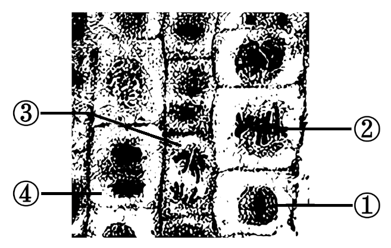
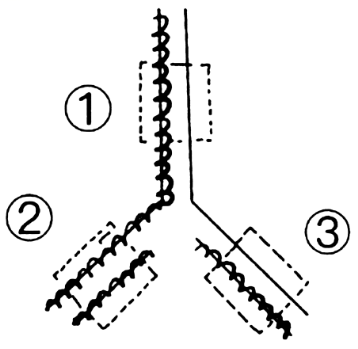
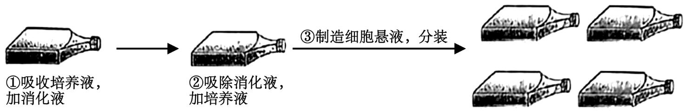
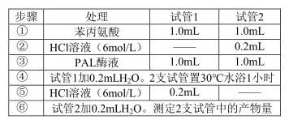
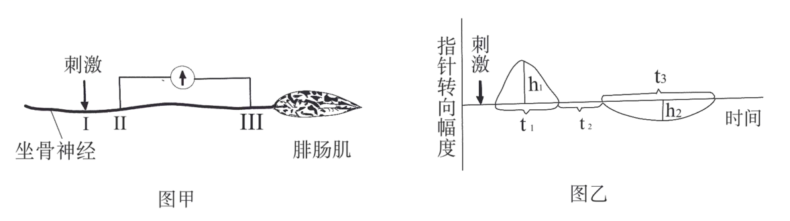
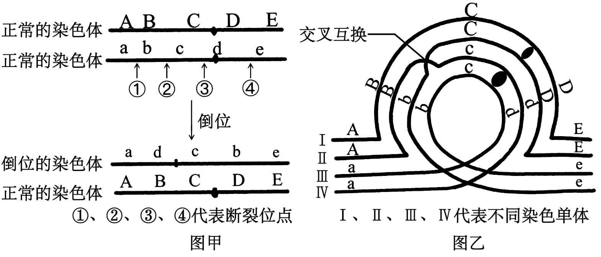
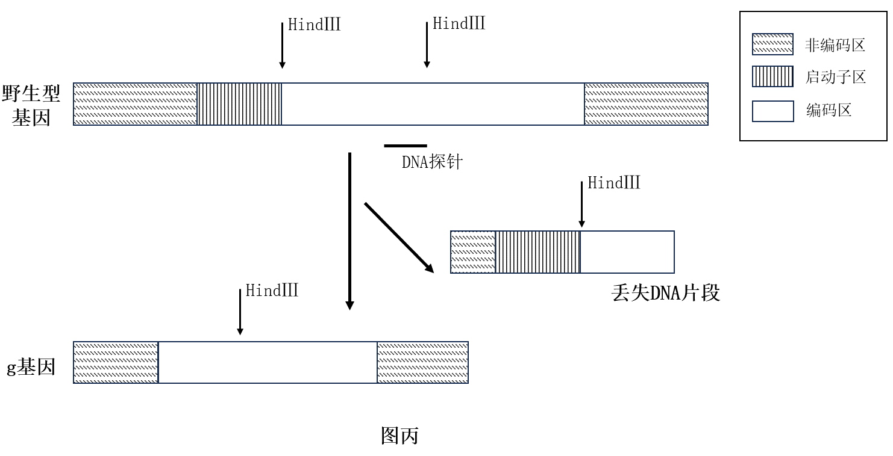

**2024年1月浙江省普通高校招生选考科目考试**

**生物学试题**

**考生须知：**

**1.考生答题前，务必将自己的姓名、准考证号用黑色字迹的签字笔或钢笔填写在答题纸上。**

**2.选择题的答案须用2B铅笔将答题纸上对应题目的答案标号涂黑，如要改动，须将原填涂处用橡皮擦净。**

**3.非选择题的答案须用黑色字迹的签字笔或钢笔写在答题纸上相应区域内，作图时可先使用2B铅笔，确定后须用黑色字迹的签字笔或钢笔描黑，答案写在本试题卷上无效。**

**选择题部分**

**一、选择题（本大题共19小题，每小题2分，共38分。每小题列出的四个备选项中只有一个是符合题目要求的，不选、多选、错选均不得分）**

1\. 关于生物技术的安全与伦理问题在我国相关法规明令禁止的是（ ）

A. 试管动物的培育 B. 转基因食品的生产

C. 治疗性克隆的研究 D. 生物武器的发展和生产

2\. 下列不属于水在植物生命活动中作用的是（ ）

A. 物质运输的良好介质 B. 保持植物枝叶挺立

C. 降低酶促反应活化能 D. 缓和植物温度变化

3\. 婴儿的肠道上皮细胞可以吸收母乳中的免疫球蛋白，此过程不涉及（ ）

A. 消耗 ATP B. 受体蛋白识别 C. 载体蛋白协助 D. 细胞膜流动性

4\. 观察洋葱根尖细胞有丝分裂装片时，某同学在显微镜下找到①~④不同时期的细胞，如图。关于这些细胞所处时期及主要特征的叙述，正确的是（ ）

A 细胞①处于间期，细胞核内主要进行 DNA 复制和蛋白质合成

B. 细胞②处于中期，染色体数: 染色单体数: 核DNA分子数=1:2:2

C. 细胞③处于后期，同源染色体分离并向细胞两极移动

D. 细胞④处于末期，细胞膜向内凹陷将细胞一分为二

5\. 白头叶猴是国家一级保护动物，通过多年努力，其数量明显增加。下列措施对于恢复白头叶猴数量最有效的是（ ）

A. 分析种间关系，迁出白头叶猴竞争者

B. 通过监控技术，加强白头叶猴数量监测

C. 建立自然保护区，保护白头叶猴栖息地

D. 对当地民众加强宣传教育，树立保护意识

6\. 痕迹器官是生物体上已经失去用处，但仍然存在的一些器官。鲸和海牛的后肢已经退化，但体内仍保留着后肢骨痕迹；食草动物的盲肠发达，人类的盲肠已经极度退化，完全失去了消化功能。据此分析，下列叙述错误的是（ ）

A. 后肢退化痕迹的保留说明鲸和海牛起源于陆地动物

B. 人类的盲肠退化与进化过程中生活习性的改变有关

C. 具有痕迹器官的生物是从具有这些器官的生物进化而来的

D. 蚯蚓没有后肢的痕迹器官，所以和四足动物没有共同祖先

7\. 某快递小哥跳入冰冷刺骨的河水勇救落水者时，体内会发生系列变化。下列叙述正确的是（ ）

A. 冷觉感受器兴奋，大脑皮层产生冷觉 B. 物质代谢减慢，产热量减少

C. 皮肤血管舒张，散热量减少 D. 交感神经兴奋，心跳减慢

8\. 山药在生长过程中易受病毒侵害导致品质和产量下降。采用组织培养技术得到脱毒苗，可恢复其原有的优质高产特性，流程如图。下列操作不可行的是（ ）

外植体→愈伤组织→丛生芽→试管苗

A. 选择芽尖作为外植体可减少病毒感染

B. 培养基中加入抗生素可降低杂菌的污染

C. 将丛生芽切割后进行继代培养可实现快速繁殖

D. 提高生长素和细胞分裂素的比值可促进愈伤组织形成丛生芽

9\. 某种蜜蜂的蜂王和工蜂具有相同的基因组。雌性工蜂幼虫主要食物是花蜜和花粉，若喂食蜂王浆，也能发育成为蜂王。利用分子生物学技术降低 DNA 甲基化酶的表达后， 即使一直喂食花蜜花粉，雌性工蜂幼虫也会发育成蜂王。下列推测正确的是（ ）

A. 花蜜花粉可降低幼虫发育过程中DNA的甲基化

B. 蜂王DNA的甲基化程度高于工蜂

C. 蜂王浆可以提高蜜蜂DNA的甲基化程度

D. DNA的低甲基化是蜂王发育的重要条件

10\. 大肠杆菌在含有³H-脱氧核苷培养液中培养，³H-脱氧核苷掺入到新合成的 DNA链中，经特殊方法显色，可观察到双链都掺入³H-脱氧核苷的 DNA区段显深色，仅单链掺入的显浅色，未掺入的不显色。掺入培养中，大肠杆菌拟核 DNA 第2 次复制时，局部示意图如图。DNA 双链区段①、②、③对应的显色情况可能是（ ）

A. 深色、浅色、浅色 B. 浅色、深色、浅色

C. 浅色、浅色、深色 D. 深色、浅色、深色

11\. 越野跑、马拉松等运动需要大量消耗糖、脂肪、水和无机盐等物质。运动员到达终点时，下列各种激素水平与正常的相比。正确的是（ ）

A. 抗利尿激素水平高，胰高血糖素水平低 B. 抗利尿激素水平低，甲状腺激素水平高

C 胰岛素水平高，甲状腺激素水平低 D. 胰岛素水平低，胰高血糖素水平高

12\. 浆细胞合成抗体分子时，先合成的一段肽链（信号肽）与细胞质中的信号识别颗粒（SRP）结合，肽链合成暂时停止。待SRP与内质网上SRP受体结合后，核糖体附着到内质网膜上，将已合成的多肽链经由 SRP受体内的通道送入内质网腔，继续翻译直至完成整个多肽链的合成并分泌到细胞外。下列叙述正确的是（ ）

A. SRP 与信号肽的识别与结合具有特异性 B. SRP受体缺陷的细胞无法合成多肽链

C. 核糖体和内质网之间通过囊泡转移多肽链 D. 生长激素和性激素均通过此途径合成并分泌

13\. 某动物细胞培养过程中，细胞贴壁生长至接触抑制时，需分装培养，实验操作过程如图。

下列叙述错误是（ ）

A. ①加消化液的目的是使细胞与瓶壁分离 B. ②加培养液的目的是促进细胞增殖

C. ③分装时需调整到合适的细胞密度 D. 整个过程需要在无菌、无毒条件下进行

14\. 某昆虫的性别决定方式为XY 型，张翅（A）对正常翅（a）是显性，位于常染色体；红眼（B）对白眼（b）是显性，位于 X 染色体。从白眼正常翅群体中筛选到一只雌性的白眼张翅突变体，假设个体生殖力及存活率相同，将此突变体与红眼正常翅杂交，子一代群体中有张翅和正常翅且比例相等，若子一代随机交配获得子二代，子二代中出现红眼正常翅的概率为（ ）

A. 9/32 B. 9/16 C. 2/9 D. 1/9

阅读下列材料，回答下列小题。

稻田中常会伴生许多昆虫，如在水稻的叶层会伴生稻苞虫、稻纵卷叶螟等食叶性害虫，在茎秆层常有稻飞虱、叶蝉等害虫，而地下层有稻叶甲虫等食根性害虫，水稻与这些害虫之间形成了复杂的种间关系。

15\. 稻苞虫是完全变态发育昆虫。其幼虫主要啃食水稻等植物叶片，成虫主要舔食植物花粉。某稻田发现了稻苞虫的虫情，下列措施既能有效控制虫害，又不会造成环境污染的是（ ）

A. 引入食虫鸟类捕杀 B. 使用杀虫剂消杀

C. 使用性引诱剂诱杀 D. 使用防虫网隔离

16\. 水稻、昆虫和杂草等共同构成稻田群落，也形成了其特有的群落结构。下列关于该群落空间结构的分析正确的是（ ）

A. 昆虫在水稻地上部分不同位置分布与光照强度密切相关

B. 昆虫在地上层或地下层分布格局与其所需资源配置有关

C. 因水稻较强的繁殖能力导致稻田群落水平结构的简单化

D. 稻田群落水平结构的表现特征是物种之间不存在镶嵌性

17\. 红豆杉细胞内的苯丙氨酸解氨酶（PAL）能催化苯丙氨酸生成桂皮酸，进而促进紫杉醇的合成。低温条件下提取 PAL 酶液，测定 PAL 的活性，测定过程如下表。

下列叙述错误的是（ ）

A. 低温提取以避免PAL 失活 B. 30℃水浴1小时使苯丙氨酸完全消耗

C. ④加H2O补齐反应体系体积 D. ⑤加入HCl溶液是为了终止酶促反应

18\. 坐骨神经可以支配包括腓肠肌在内的多块骨骼肌。取坐骨神经腓肠肌标本，将电位表的两个电极置于坐骨神经表面II、III两处，如图甲。在坐骨神经I处，给一个适当强度的电刺激，指针偏转情况如图乙，其中h1＞h2，t1＜t3。下列叙述错误的是（ ）

A. h₁和h₂反映II处和III处含有的神经纤维数量

B. Ⅱ处的神经纤维数量比Ⅲ处的多可导致h1＞h2

C. 神经纤维的传导速度不同可导致t1＜t3

D. 两个电极之间的距离越远t2的时间越长

19\. 某精原细胞同源染色体中的一条发生倒位，如图甲。减数分裂过程中，由于染色体倒位，同源染色体联会时会形成倒位环，此时经常伴随同源染色体的交叉互换，如图乙。完成分裂后，若配子中出现染色体片段缺失，染色体上增加某个相同片段，则不能存活，而出现倒位的配子能存活。下列叙述正确的是（ ）

A. 图甲发生了①至③区段的倒位

B. 图乙细胞中II和III发生交叉互换

C. 该精原细胞减数分裂时染色体有片段缺失

D. 该精原细胞共产生了3种类型的可育雄配子

**非选择题部分**

**二、非选择题（本大题共五小题，共50分）**

20\. 长江流域的油菜生产易受渍害。渍害是因洪、涝积水或地下水位过度升高，导致作物根系长期缺氧，对植株造成的胁迫及伤害。

回答下列问题：

（1）发生渍害时，油菜地上部分以有氧（需氧）呼吸为主，有氧呼吸释放能量最多的是第\_\_\_\_阶段。地下部分细胞利用丙酮酸进行乙醇发酵。这一过程发生的场所是\_\_\_\_，此代谢过程中需要乙醇脱氢酶的催化，促进氢接受体（NAD+）再生，从而使\_\_\_\_得以顺利进行。因此，渍害条件下乙醇脱氢酶活性越高的品种越\_\_\_\_（耐渍害/不耐渍害）。

（2）以不同渍害能力的油菜品种为材料，经不同时长的渍害处理，测定相关生理指标并进行相关性分析，结果见下表。

|                    |       |       |       |                    |       |
|:------------------:|:-----:|:-----:|:-----:|:------------------:|:-----:|
|                    | 光合速率  | 蒸腾速率  | 气孔导度  | 胞间CO2浓度 | 叶绿素含量 |
| 光合速率               | 1     |       |       |                    |       |
| 蒸腾速率               | 0.95  | 1     |       |                    |       |
| 气孔导度               | 0.99  | 0.94  | 1     |                    |       |
| 胞间CO2浓度 | -0.99 | -0.98 | -0.99 | 1                  |       |
| 叶绿素含量              | 0.86  | 0.90  | 0.90  | -0.93              | 1     |

注：表中数值为相关系数（r），代表两个指标之间相关的密切程度。当\|r\|接近1时，相关越密切，越接近0时相关越不密切。

据表分析，与叶绿素含量呈负相关的指标是\_\_\_\_。已知渍害条件下光合速率显著下降，则蒸腾速率呈\_\_\_\_趋势。综合分析表内各指标的相关性，光合速率下降主要由\_\_\_\_（气孔限制因素/非气孔限制因素）导致的，理由是\_\_\_\_。

（3）植物通过形成系列适应机制响应渍害。受渍害时，植物体内\_\_\_\_（激素）大量积累，诱导气孔关闭，调整相关反应，防止有毒物质积累，提高植物对渍害的耐受力；渍害发生后，有些植物根系细胞通过\_\_\_\_，将自身某些薄壁组织转化腔隙，形成通气组织，促进氧气运输到根部，缓解渍害。

21\. 科学研究揭示，神经、内分泌和免疫系统共享某些信息分子和受体，共同调节机体各器官系统的功能，维持内环境稳态，即神经-体液-免疫网络调节。以家兔为实验动物，进行了一系列相关研究。（注：迷走神经的中枢位于延髓，末梢释放乙酰胆碱；阿托品为乙酰胆碱阻断剂）回答以下问题：

（1）加入抗凝剂的家兔血液在试管里静置一段时间出现分层现象，上层是淡黄色的\_\_\_\_\_，T细胞集中于中层。与红细胞观察和技术不同，T细胞需要先\_\_\_\_\_\_后才能在显微镜下观察和计数。培养T细胞时提供恒定浓度的CO2，使培养pH维持在中性偏\_\_\_\_\_。

（2）血液T细胞百分率和T细胞增殖能力可以反映细胞免疫功能的强弱。刺激迷走神经，血液T细胞百分率和T细胞增殖能力都显著上升；剪断迷走神经，血液T细胞百分率和T细胞增殖能力都显著下降。基于上述结果，迷走神经具有\_\_\_\_\_\_的作用。静脉注射阿托品后，血液T细胞百分率和T细胞增殖能力显著下降，说明T细胞膜存在\_\_\_\_\_\_受体。

（3）剪断一侧迷走神经后，立即分别刺激外周端（远离延髓一端）和中枢端（靠近延髓一端）血液T细胞百分率和T细胞增殖能力都显著上升，说明迷走神经含有\_\_\_\_\_\_纤维。

（4）用结核菌素接种家兔，免疫细胞分泌的\_\_\_\_\_\_作用于迷走神经末梢的受体，将\_\_\_\_\_\_信号转换成相应的电信号，迷走神经传入冲动显著增加，而\_\_\_\_\_\_传递免疫反应的信息，调节免疫反应。

（5）雌激素能调节体液免疫。雌激素主要由卵巢分泌，受垂体分泌的\_\_\_\_\_\_调节，通过检测血液B细胞百分率和\_\_\_\_\_\_（答出两点）等指标来反映外源雌激素对体液免疫的调节作用。

22\. 锌转运蛋白在某种植物根部细胞特异性表达并定位于细胞质膜，具有吸收和转运环境中Zn2+的功能。为研究该植物2种锌转运蛋白M和N与吸收Zn2+相关的生物学功能，在克隆M、N基因基础上，转化锌吸收缺陷型酵母，并进行细胞学鉴定。回答下列问题：

（1）锌转运蛋白基因M、N克隆。以该植物\_\_\_\_\_\_为材料提取并纯化mRNA，反转录合成cDNA。根据序列信息设计引物进行PCR扩增，PCR每个循环第一步是进行热变性处理，该处理的效果类似于生物体内\_\_\_\_\_\_的作用效果。PCR产物琼脂糖凝胶电泳时，DNA分子因为含\_\_\_\_\_\_而带负电荷，凝胶点样孔端应靠近电泳槽负极接口；当2个PCR产物分子量接近时，若延长电泳时间，凝胶中这2个条带之间的距离会\_\_\_\_\_\_。回收DNA片段，连接至克隆载体，转化大肠杆菌，测序验证。

（2）重组表达载体构建。分别将含M、N基因的重组质粒和酵母表达载体同时进行双酶切处理，然后利用\_\_\_\_\_\_连接，将得到的重组表达载体转化大肠杆菌。用PCR快速验证重组转化是否成功。此反应可以用大肠杆菌悬液当模板的原因是\_\_\_\_\_\_。

（3）酵母菌转化。取冻存的锌吸收缺陷型酵母菌株，直接在固体培养基进行\_\_\_\_\_\_培养，活化后接种至液体培养基，采用\_\_\_\_\_\_以扩大菌体数量，用重组表达载体转化酵母菌。检测M、N基因在受体细胞中的表达水平，无显著差异。

（4）转基因酵母功能鉴定。分别将转化了M、N基因的酵母菌株于液体培养基中培养至OD600为0.6。将菌液用\_\_\_\_\_\_法逐级稀释至OD600为0.06、0.006和0.0006，然后各取10μL菌液用涂布器均匀涂布在固体培养基上，培养2天，菌落生长如图。该实验中阴性对照为\_\_\_\_\_\_。由实验结果可初步推测：转运蛋白M和N中，转运Zn2+能力更强的是\_\_\_\_\_\_，依据是\_\_\_\_\_\_。

注：OD600为波长600nm下的吸光值，该值越大，菌液浓度越高；空载体为未插入M或N基因的表达载体。

23\. 小鼠毛囊中表达F蛋白。为研究F蛋白在毛发生长中的作用，利用基因工程技术获得了F基因敲除的突变型纯合体小鼠，简称f小鼠，突变基因用f表示。f小鼠皮毛比野生型小鼠长50%，表现出毛绒绒的样子，其它表型正常。（注：野生型基因用++表示；f杂合子基因型用+f表示）

回答下列问题：

（1）F基因敲除方案如图甲。在F基因的编码区插入了一个DNA片段P，引起F基因产生\_\_\_\_\_\_，导致mRNA提前出现终止密码子，使得合成的蛋白质因为缺失了\_\_\_\_\_\_而丧失活性。要达到此目的，还可以对该基因的特定碱基进行\_\_\_\_\_\_和\_\_\_\_\_\_。

（2）从野生型、f杂合子和f小鼠组织中分别提取DNA，用限制酶HindⅢ酶切，进行琼脂糖电泳，用DNA探针检测。探针的结合位置如图甲，检测结果如图乙，则f小鼠和f杂合子对应的DNA片段分别位于第\_\_\_\_\_\_泳道和第\_\_\_\_\_\_泳道。

（3）g小鼠长毛隐性突变体（gg），表型与f小鼠相同。f基因和g基因位于同一条常染色体上。f杂合子小鼠与g小鼠杂交，若杂交结果是\_\_\_\_\_\_，则g和f是非等位基因；若杂交结果是\_\_\_\_\_\_，则g和f是等位基因。（注：不考虑交叉互换；野生型基因用++表示；g杂合子基因型用+g表示）

（4）确定g和f为等位基因后，为进一步鉴定g基因，分别提取野生型（++）、g杂合子（+g）和g小鼠（gg）的mRNA，反转录为cDNA后用（2）小题同样的DNA探针和方法检测，结果如图丙。g小鼠泳道没有条带的原因是\_\_\_\_\_\_。组织学检查发现野生型和g杂合子表达F蛋白，g小鼠不表达F蛋白，因此推测F蛋白具有的作用\_\_\_\_\_\_。

24\. 不经意间观察到一些自然现象，细究之下，其实有内在的逻辑。回答下列问题：

（1）随着春天的来临，内蒙古草原绿意渐浓，久违的动物们纷纷现身，这种场景的出现体现了生态系统的\_\_\_\_\_\_功能；成群的牛、羊一起在草原上觅食，他们之间虽然食性相似但是竞争不明显，可以用\_\_\_\_\_\_来解释；草原群落的演替结果在几年内并不容易观察到，其原因是：植物每年的生长季短，且常遭食草动物啃食，导致\_\_\_\_\_\_不易。近年来，随着生物多样性保护理念的不断深入，人们不再主动猎狼，但狼也只是偶见于内蒙古草原地区。从狼在食物链中所处营养级的角度分析，他无法在牧区立足的原因有\_\_\_\_\_\_。为了畜牧业的兴旺，牧民们对草原生态系统进行一定的干预，例如对牛羊取食之余牧草及时收割、打包，从生态系统功能的角度分析，这项干预措施的意义有\_\_\_\_\_\_。

（2）学者在野外考察中发现了一些现象，生活在寒冷地带的木本植物，多数体表颜色较深，如叶为墨绿色，茎或枝条为黑褐色；而生活在炎热地带的木本植物，往往体表颜色较浅，如叶为浅绿色，茎或枝条为浅绿色。有些学者对此现象的解释是：在寒冷环境下，深色体表的植物能吸收较多的太阳能，有利于维持细胞内酶的活性。

Ⅰ．某同学设计了实验方案以验证学者们的解释是否正确。在①②④各环节的选项中，分别选择1-2项，填入方案中的空格，完善一套实验方案，使之简单，可行。

①实验材料或器材的选择预处理：\_\_\_\_\_\_；

A．两组等容量的烧杯，烧杯内盛满水

B．两种生长状态类似且体表颜色深浅有明显差异的灌木

C．一组烧杯外壁均涂上油漆，另一组不涂

D．所有植物根植于相同条件的土壤中

②选定正确的监测指标：\_\_\_\_\_\_；

A．植物生物量的增加值 B.温度

C．植物根长的增加值 D．植物高度的增加值

③实验处理和过程：仿照寒冷地带的自然光照条件，将两组材料置于低温条件下（4℃），每次光照5小时。记录处理前后指标的量值。实验重复3次。

④预测实验结果和得出实验结论。若\_\_\_\_\_\_，则学者们的说法成立；否则无法成立。

A．深色组水体的温度值高于浅色组

B．深色组植物体表的温度值高于浅色组

C．深色组植物高度的增加值大于浅色组

D．深色组与浅色组测得的指标差异显著

Ⅱ．上述实验环节中，选定此监测指标的理由是：ⅰ\_\_\_\_\_\_，ⅱ监测便捷。

Ⅲ．结合本实验的研究结果，植物吸收的太阳能既能用于\_\_\_\_\_\_，又能用于\_\_\_\_\_\_。

Ⅳ．基于本实验，为了让耐寒性较弱的行道树安全越冬，可采取的合理有效措施有\_\_\_\_\_\_（答出一点即可）。
