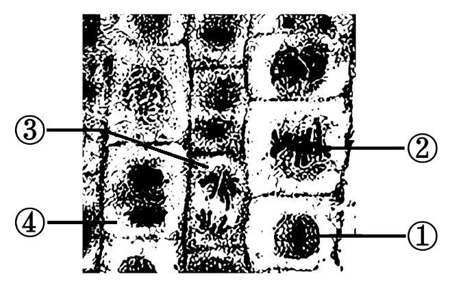
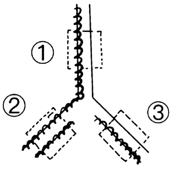
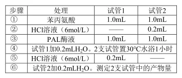
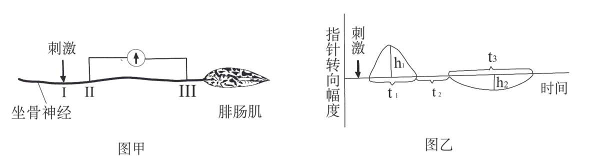
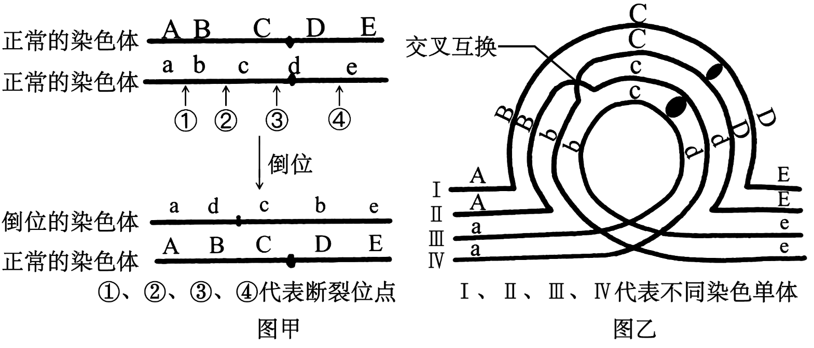
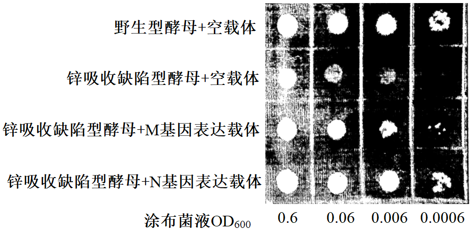
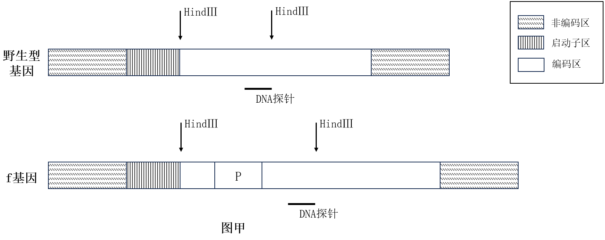
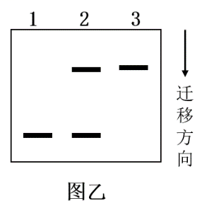
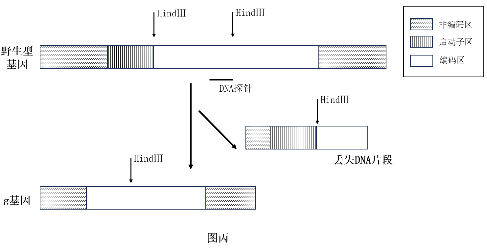

**2024年1月浙江省普通高校招生选考科目考试**

**生物学试题**

**考生须知：**

**1.考生答题前，务必将自己的姓名、准考证号用黑色字迹的签字笔或钢笔填写在答题纸上。**

**2.选择题的答案须用2B铅笔将答题纸上对应题目的答案标号涂黑，如要改动，须将原填涂处用橡皮擦净。**

**3.非选择题的答案须用黑色字迹的签字笔或钢笔写在答题纸上相应区域内，作图时可先使用2B铅笔，确定后须用黑色字迹的签字笔或钢笔描黑，答案写在本试题卷上无效。**

**选择题部分**

**一、选择题（本大题共19小题，每小题2分，共38分。每小题列出的四个备选项中只有一个是符合题目要求的，不选、多选、错选均不得分）**

1\. 关于生物技术的安全与伦理问题在我国相关法规明令禁止的是（ ）

A. 试管动物的培育 B. 转基因食品的生产

C. 治疗性克隆的研究 D. 生物武器的发展和生产

【答案】D

【解析】

【分析】1、我国政府一再重申 四不原则:不赞成、不允许、不支持、不接受任何生殖性克隆人实验。

2、2010年，在第65 届联合国大会上，我国政府重申支持《禁止生物武器公约》的宗旨和目标，全面、严格履行公约义务，支持不断加强公约的约束力，并主张全面禁止和彻底销毁生物武器等各类大规模杀伤性武器。

【详解】A、试管动物的培育属于胚胎工程，没有禁止，A正确；

B、我过目前不反对转基因的食品的生产，B正确；

C、中国政府禁止生殖性克隆，支持治疗性克隆，C正确；

D、生物武器致病能力强、攻击范围广，世界范围内应全面禁止生物武器，D错误。

故选D。

2\. 下列不属于水在植物生命活动中作用的是（ ）

A. 物质运输的良好介质 B. 保持植物枝叶挺立

C. 降低酶促反应活化能 D. 缓和植物温度变化

【答案】C

【解析】

【分析】水是活细胞中含量最多的化合物，在细胞内以自由水和结合水的形式存在，结合水是细胞结构的重要组成成分，自由水是细胞内良好的溶剂，是化学反应的介质，自由水还是许多化学反应的反应物或者产物，自由水能自由移动，对于生物体内的营养物质和代谢废物的运输具有重要作用，自由水与结合水可以相互转化，自由水与结合水比值升高，细胞代谢旺盛，抗逆性差，反之亦然。

【详解】A、自由水可以自由流动，是细胞内主要的物质运输介质，A正确；

B、水可以保持植物枝叶挺立，B正确；

C、降低酶促反应活化能的是酶，水不具有此功能，C错误；

D、水的比热容较大，能缓和植物温度的变化，D正确。

故选C。

3\. 婴儿的肠道上皮细胞可以吸收母乳中的免疫球蛋白，此过程不涉及（ ）

A. 消耗 ATP B. 受体蛋白识别 C. 载体蛋白协助 D. 细胞膜流动性

【答案】C

【解析】

【分析】小分子的物质可以通过主动运输和被动运输来进出细胞，大分子进出细胞是通过内吞和外排来完成的。被动运输的动力来自细胞内外物质的浓度差，主动运输的动力来自ATP。胞吞和胞吐进行的结构基础是细胞膜的流动性。胞吞和胞吐与主动运输一样也需要能量供应。

【详解】AD、免疫球蛋白化学本质是蛋白质，是有机大分子物质，吸收方式为胞吞，需要消耗ATP，胞吞体现了细胞膜具有一定的流动性的结构特点，AD正确；

BC、免疫球蛋白是有机大分子物质，细胞吸收该物质，需要受体蛋白的识别，不需要载体蛋白的协助，B正确，C错误。

故选C。

4\. 观察洋葱根尖细胞有丝分裂装片时，某同学在显微镜下找到①~④不同时期的细胞，如图。关于这些细胞所处时期及主要特征的叙述，正确的是（ ）

A. 细胞①处于间期，细胞核内主要进行 DNA 复制和蛋白质合成

B. 细胞②处于中期，染色体数: 染色单体数: 核DNA分子数=1:2:2

C. 细胞③处于后期，同源染色体分离并向细胞两极移动

D. 细胞④处于末期，细胞膜向内凹陷将细胞一分为二

【答案】B

【解析】

【分析】人们根据染色体的行为，将有丝分裂分为前期、中期、后期、末期四个时期。根据图中可知，①是间期，②是中期，③是前期，④是末期。

【详解】A、①是间期，细胞主要进行DNA的复制和有关蛋白质的合成，并且细胞有适度的生长，但蛋白质的合成不在细胞核，而在核糖体，A错误；

B、②是中期，染色体已在间期复制完成，因此染色体数目没有改变，但一条染色体上有两条染色单体，一条染色体上有两个核DNA，染色体数: 染色单体数: 核DNA分子数=1:2:2，B正确；

C、③是后期期，有丝分裂不会出现同源染色体分离的情况，C错误；

D、④是末期，题干中指出植物细胞，植物细胞末期的特点之一是在细胞板的位置逐渐扩展形成新的细胞壁，动物细胞膜末期是细胞膜向内凹陷将细胞一分为二，D错误。

故选B。

5\. 白头叶猴是国家一级保护动物，通过多年努力，其数量明显增加。下列措施对于恢复白头叶猴数量最有效的是（ ）

A. 分析种间关系，迁出白头叶猴竞争者

B. 通过监控技术，加强白头叶猴数量监测

C. 建立自然保护区，保护白头叶猴栖息地

D. 对当地民众加强宣传教育，树立保护意识

【答案】C

【解析】

【分析】保护生物多样性就是在生态系统、物种和基因三个水平上采取保护战略和保护措施。主要有：就地保护，即建立自然保护区；易地保护，如建立遗传资源种质库、植物基因库，以及野生动物园和植物园及水族馆等。

【详解】生物多样性的保护是保护基因多样性、物种多样性、生态系统多样性，建立自然保护区是对生物进行就地保护，是保护生物多样性最有效的措施，因此建立自然保护区，保护白头叶猴栖息地是恢复白头叶猴数量最有效的措施，C正确，ABD错误。

故选C。

6\. 痕迹器官是生物体上已经失去用处，但仍然存在的一些器官。鲸和海牛的后肢已经退化，但体内仍保留着后肢骨痕迹；食草动物的盲肠发达，人类的盲肠已经极度退化，完全失去了消化功能。据此分析，下列叙述错误的是（ ）

A. 后肢退化痕迹的保留说明鲸和海牛起源于陆地动物

B. 人类的盲肠退化与进化过程中生活习性的改变有关

C. 具有痕迹器官的生物是从具有这些器官的生物进化而来的

D. 蚯蚓没有后肢的痕迹器官，所以和四足动物没有共同祖先

【答案】D

【解析】

【分析】生物的进化不仅在地层中留下了证据（化石），也在当今生物体上留下了许多印迹（如痕迹器官），这些印迹可以作为进化的佐证。

【详解】A、陆地动物具有灵活的后肢，鲸和海牛后肢退化痕迹的保留，说明了其可能起源于陆生动物，A正确；

B、人类的盲肠退化可能是由于生活习性的改变，不需要盲肠的消化而使其退化，B正确；

C、具有痕迹器官的生物说明这些器官在这些生物中存在过，也说明该生物是从具有这些器官的生物进化而来的，C正确；

D、蚯蚓没有后肢的痕迹器官，也可能有其他痕迹器官和四足动物类似，也可能和四足动物类似的痕迹器官在进化中消失，所以蚯蚓没有后肢的痕迹器官，不能说明和四足动物没有共同祖先，D错误。

故选D。

7\. 某快递小哥跳入冰冷刺骨的河水勇救落水者时，体内会发生系列变化。下列叙述正确的是（ ）

A. 冷觉感受器兴奋，大脑皮层产生冷觉 B. 物质代谢减慢，产热量减少

C. 皮肤血管舒张，散热量减少 D. 交感神经兴奋，心跳减慢

【答案】A

【解析】

【分析】体温调节是温度感受器接受体内、外环境温度的刺激，通过体温调节中枢的活动，相应地引起内分泌腺、骨骼肌、皮肤血管和汗腺等组织器官活动的改变，从而调整机体的产热和散热过程，使体温保持在相对恒定的水平。

【详解】A、感受器接受刺激，产生冷觉的部位是大脑皮层，A正确；

B、寒冷刺激，冷觉感受器感受刺激产生兴奋，物质代谢加快，产热量增加，B错误；

C、寒冷刺激，冷觉感受器感受刺激产生兴奋，兴奋传至下丘脑的体温调节中枢，通过交感神经可支配血管，使其收缩，血流量减少，减少机体散热，C错误；

D、寒冷条件下，交感神经兴奋，心跳加快，D错误。

故选A。

8\. 山药在生长过程中易受病毒侵害导致品质和产量下降。采用组织培养技术得到脱毒苗，可恢复其原有的优质高产特性，流程如图。下列操作不可行的是（ ）

外植体→愈伤组织→丛生芽→试管苗

A. 选择芽尖作为外植体可减少病毒感染

B. 培养基中加入抗生素可降低杂菌的污染

C. 将丛生芽切割后进行继代培养可实现快速繁殖

D. 提高生长素和细胞分裂素的比值可促进愈伤组织形成丛生芽

【答案】D

【解析】

【分析】植物组织培养技术：1、过程：离体的植物组织，器官或细胞(外植体)→愈伤组织→胚状体→植株(新植体)。2、原理：植物细胞的全能性。3、条件：①细胞离体和适宜的外界条件(如适宜温度、适时的光照、pH和无菌环境等) ；②一定的营养(无机、有机成分)和植物激素(生长素和细胞分裂素)。

【详解】A、芽尖等分生组织分裂旺盛，且含病毒少，取材时常选用其作为外植体，A正确；

B、培养基中有大量的营养物质容易被细菌污染，加入抗生素可降低杂菌的污染，B正确；

C、将丛生芽切割后转移到新的培养基上继续进行扩大培养称为继代培养，其又可分为第二代培养、第三代培养等。大多数植物每隔4~6周进行一次继代培养，每进行一次继代培养，培养物一般能增殖3~4倍。正因为培养物可以不断继代培养，所以离体繁殖速度比常规方法通常要快数万倍，可实现快速繁殖，C正确；

D、提高生长素和细胞分裂素的比值可促进愈伤组织形成根而不是芽，D错误。

故选D。

9\. 某种蜜蜂的蜂王和工蜂具有相同的基因组。雌性工蜂幼虫主要食物是花蜜和花粉，若喂食蜂王浆，也能发育成为蜂王。利用分子生物学技术降低 DNA 甲基化酶的表达后， 即使一直喂食花蜜花粉，雌性工蜂幼虫也会发育成蜂王。下列推测正确的是（ ）

A. 花蜜花粉可降低幼虫发育过程中DNA的甲基化

B. 蜂王DNA的甲基化程度高于工蜂

C. 蜂王浆可以提高蜜蜂DNA的甲基化程度

D. DNA的低甲基化是蜂王发育的重要条件

【答案】D

【解析】

【分析】DNA甲基化为DNA化学修饰的一种形式，能够在不改变DNA序列的前提下，改变遗传表现。大量研究表明，DNA甲基化能引起染色质结构、DNA构象、DNA稳定性及DNA与蛋白质相互作用方式的改变，从而控制基因表达。

【详解】A、降低 DNA 甲基化酶的表达后， 即使一直喂食花蜜花粉，雌性工蜂幼虫也会发育成蜂王，说明甲基化不利于其发育成蜂王，而工蜂幼虫主要食物是花蜜和花粉，不会发育成蜂王，因此花蜜花粉可增强幼虫发育过程中DNA的甲基化，A错误；

B、甲基化不利于其发育成蜂王，故蜂王DNA的甲基化程度低于工蜂，B错误；

C、蜂王浆可以降低蜜蜂DNA的甲基化程度，使其发育成蜂王，C错误；

D、甲基化不利于发育成蜂王，因此DNA的低甲基化是蜂王发育的重要条件，D正确。

故选D。

10\. 大肠杆菌在含有³H-脱氧核苷培养液中培养，³H-脱氧核苷掺入到新合成的 DNA链中，经特殊方法显色，可观察到双链都掺入³H-脱氧核苷的 DNA区段显深色，仅单链掺入的显浅色，未掺入的不显色。掺入培养中，大肠杆菌拟核 DNA 第2 次复制时，局部示意图如图。DNA 双链区段①、②、③对应的显色情况可能是（ ）

A. 深色、浅色、浅色 B. 浅色、深色、浅色

C. 浅色、浅色、深色 D. 深色、浅色、深色

【答案】B

【解析】

【分析】DNA的复制方式为半保留复制，子代DNA分子其中的一条链来自亲代DNA ，另一条链是新合成的，这种方式称半保留复制。半保留复制的意义：遗传稳定性的分子机制。

【详解】大肠杆菌在含有³H-脱氧核苷培养液中培养，DNA的复制方式为半保留复制，大肠杆菌拟核 DNA 第1 次复制后产生的子代DNA的两条链一条被³H标记，另一条未被标记，大肠杆菌拟核 DNA 第2 次复制时，以两条链中一条被³H标记，另一条未被标记的DNA分子为模板，结合题干显色情况，DNA 双链区段①为浅色，②中两条链均含有³H显深色，③中一条链含有³H一条链不含³H显浅色，ACD错误，B正确。

故选B。

11\. 越野跑、马拉松等运动需要大量消耗糖、脂肪、水和无机盐等物质。运动员到达终点时，下列各种激素水平与正常的相比。正确的是（ ）

A. 抗利尿激素水平高，胰高血糖素水平低 B. 抗利尿激素水平低，甲状腺激素水平高

C. 胰岛素水平高，甲状腺激素水平低 D. 胰岛素水平低，胰高血糖素水平高

【答案】D

【解析】

【分析】大量运动后，葡萄糖被消耗，胰岛素含量下降，胰高血糖素含量上升。

【详解】越野跑、马拉松等运动后，体内血糖大量消耗，血糖降低，胰岛素含量降低，胰高血糖素含量上升，促进肝糖原分解，非糖物质转化为葡萄糖，此时，机体代谢旺盛，甲状腺激素水平高，同时机体大量排汗，导致水分减少，抗利尿激素分泌增加，ABC错误,D正确。

故选D。

12\. 浆细胞合成抗体分子时，先合成的一段肽链（信号肽）与细胞质中的信号识别颗粒（SRP）结合，肽链合成暂时停止。待SRP与内质网上SRP受体结合后，核糖体附着到内质网膜上，将已合成的多肽链经由 SRP受体内的通道送入内质网腔，继续翻译直至完成整个多肽链的合成并分泌到细胞外。下列叙述正确的是（ ）

A. SRP 与信号肽的识别与结合具有特异性 B. SRP受体缺陷的细胞无法合成多肽链

C. 核糖体和内质网之间通过囊泡转移多肽链 D. 生长激素和性激素均通过此途径合成并分泌

【答案】A

【解析】

【分析】由题意可知：分泌蛋白先在游离的核糖体合成，形成一段多肽链后，信号识别颗粒（SRP）识别信号，再与内质网上信号识别受体结合，将肽链引导至内质网，由 SRP受体内的通道送入内质网腔，进一步在内质网腔内完成翻译，合成蛋白质。

【详解】A、SRP 参与抗体等分泌蛋白的合成，呼吸酶等胞内蛋白无需SRP参与，所以SRP与信号肽的识别与结合具有特异性，A正确；

B、SRP受体缺陷的细胞可以合成部分多肽链，如呼吸酶等，B错误；

C、核糖体和内质网之间通过SRP受体内的通道转移多肽链，同时核糖体是无膜细胞器不能形成囊泡，C错误；

D、生长激素通过此途径合成并分泌，性激素属于固醇，不需要通过该途径合成并分泌，D错误。

故选A

13\. 某动物细胞培养过程中，细胞贴壁生长至接触抑制时，需分装培养，实验操作过程如图。

下列叙述错误的是（ ）

A. ①加消化液的目的是使细胞与瓶壁分离 B. ②加培养液的目的是促进细胞增殖

C. ③分装时需调整到合适的细胞密度 D. 整个过程需要在无菌、无毒条件下进行

【答案】B

【解析】

【分析】动物细胞培养条件：（1）无菌、无毒的环境：①消毒、灭菌；②添加一定量的抗生素；③定期更换培养液，以清除代谢废物。（2）营养物质：糖、氨基酸、促生长因子、无机盐、微量元素等，还需加入血清、血浆等天然物质。（3）温度和PH：36.5℃±0.5℃；适宜的pH：7.2～7.4。（4）气体环境：95%空气（细胞代谢必需的）和5%的CO2（维持培养液的PH）。

【详解】A、①加消化液的目的是使细胞与瓶壁分离，A正确；

B、②加培养液，多次加培养液先洗去残留的消化酶，然后终止消化液的消化作用，并对细胞加以稀释，B错误；

C、③分装时需调整到合适的细胞密度，因为若密度过大细胞直接仍存在接触抑制，C正确；

D、动物细胞培养需要无菌无毒环境，因此整个过程需要在无菌、无毒条件下进行，D正确。

故选B。

14\. 某昆虫的性别决定方式为XY 型，张翅（A）对正常翅（a）是显性，位于常染色体；红眼（B）对白眼（b）是显性，位于 X 染色体。从白眼正常翅群体中筛选到一只雌性的白眼张翅突变体，假设个体生殖力及存活率相同，将此突变体与红眼正常翅杂交，子一代群体中有张翅和正常翅且比例相等，若子一代随机交配获得子二代，子二代中出现红眼正常翅的概率为（ ）

A. 9/32 B. 9/16 C. 2/9 D. 1/9

【答案】A

【解析】

【分析】基因自由组合定律的实质是：位于非同源染色体上的非等位基因的分离或自由组合是互不干扰的；在减数分裂过程中，同源染色体上的等位基因彼此分离的同时，非同源染色体上的非等位基因自由组合。

【详解】白眼正常翅群体中筛选到一只雌性的白眼张翅突变体，假设个体生殖力及存活率相同，将此突变体与红眼正常翅杂交，子一代群体中有张翅和正常翅且比例相等，推知雌性的白眼张翅突变体基因型为AaXbXb,红眼正常翅基因型为aaXBY，子一代群体基因型及比例为aaXBXb:AaXBXb:aaXbY:AaXbY=1：1：1：1，子一代随机交配获得子二代，子二代中出现红眼正常翅，即aaXBY和aaXBXb的概率：aa与Aa随机交配获得aa的概率为：3/4×3/4=9/16，XBXb与XbY随机交配得到XBY和XBXb的概率为：1×1/2=1/2，因此子二代中出现红眼正常翅，即aaXBY和aaXBXb的概率9/16×1/2=9/32，A正确，BCD错误。

故选A。

阅读下列材料，回答下列小题。

稻田中常会伴生许多昆虫，如在水稻的叶层会伴生稻苞虫、稻纵卷叶螟等食叶性害虫，在茎秆层常有稻飞虱、叶蝉等害虫，而地下层有稻叶甲虫等食根性害虫，水稻与这些害虫之间形成了复杂的种间关系。

15\. 稻苞虫是完全变态发育昆虫。其幼虫主要啃食水稻等植物叶片，成虫主要舔食植物花粉。某稻田发现了稻苞虫的虫情，下列措施既能有效控制虫害，又不会造成环境污染的是（ ）

A. 引入食虫鸟类捕杀 B. 使用杀虫剂消杀

C. 使用性引诱剂诱杀 D. 使用防虫网隔离

16\. 水稻、昆虫和杂草等共同构成稻田群落，也形成了其特有的群落结构。下列关于该群落空间结构的分析正确的是（ ）

A. 昆虫在水稻地上部分不同位置分布与光照强度密切相关

B. 昆虫在地上层或地下层分布格局与其所需资源配置有关

C. 因水稻较强的繁殖能力导致稻田群落水平结构的简单化

D. 稻田群落水平结构的表现特征是物种之间不存在镶嵌性

【答案】15. A 16. B

【解析】

【分析】在群落中，各个生物种群分别占据了不同的空间，使群落形成一定的空间结构，群落的空间结构包括垂直结构和水平结构等方面。垂直结构是在垂直方向上，大多数群落都具有明显的分层现象。

信息传递在生态系统中的作用：（1）个体：生命活动的正常进行，离不开信息的作用。（2）种群：生物种群的繁衍，离不开信息传递。（3）群落和生态系统：能调节生物的种间关系，经维持生态系统的稳定。

【15题详解】

A、以鸟治虫，属于生物防治，食虫鸟类既能吃幼虫也能吃成虫，既能有效控制虫害，又不会造成环境污染，A正确；

B、使用杀虫剂消杀属于化学防治，污染环境，B错误；

C、使用性引诱剂诱杀属于生物防治，有效改变种群性别比例从而降低出生率，但是诱杀的是成虫，效果相对弱些，C错误；

D、使用防虫网隔离属于物理防治，不能效控制虫害，D错误。

故选A。

【16题详解】

A、昆虫（动物）在水稻地上部分不同位置分布与栖息场所和食物条件密切相关，A错误；

B、昆虫在地上层或地下层分布格局与其所需资源配置（栖息空间和食物等）有关，B正确；

C、人为因素导致稻田群落水平结构的复杂化，C错误；

D、稻田群落水平结构的表现特征是物种之间存在镶嵌性，D错误。

故选B。

17\. 红豆杉细胞内的苯丙氨酸解氨酶（PAL）能催化苯丙氨酸生成桂皮酸，进而促进紫杉醇的合成。低温条件下提取 PAL 酶液，测定 PAL 的活性，测定过程如下表。

下列叙述错误的是（ ）

A. 低温提取以避免PAL 失活 B. 30℃水浴1小时使苯丙氨酸完全消耗

C. ④加H2O补齐反应体系体积 D. ⑤加入HCl溶液是为了终止酶促反应

【答案】B

【解析】

【分析】1、酶是由活细胞产生的具有催化作用的有机物，绝大多数酶是蛋白质，极少数酶是RNA．

2、酶的特性：高效性、专一性和作用条件温和的特性．

3、影响酶活性的因素主要是温度和pH，在最适温度（pH）前，随着温度（pH）的升高，酶活性增强；到达最适温度（pH）时，酶活性最强；超过最适温度（pH）后，随着温度（pH）的升高，酶活性降低．另外低温酶不会变性失活，但高温、pH过高或过低都会使酶变性失活．

【详解】A、温度过高，酶失活，因此本实验采用低温提取，以避免PAL 失活，A正确；

B、因为试管2在②中加入了HCl，酶已经变性失活，故不会消耗底物苯丙氨酸，B错误；

C、④加H2O，补齐了②试管1没有加入的液体的体积，即补齐反应体系体积，保存无关变量相同，C正确；

D、pH过低或过高酶均会失活，⑤加入HCl溶液是为了终止酶促反应，D正确。

故选B

18\. 坐骨神经可以支配包括腓肠肌在内的多块骨骼肌。取坐骨神经腓肠肌标本，将电位表的两个电极置于坐骨神经表面II、III两处，如图甲。在坐骨神经I处，给一个适当强度的电刺激，指针偏转情况如图乙，其中h1＞h2，t1＜t3。下列叙述错误的是（ ）

A. h₁和h₂反映II处和III处含有的神经纤维数量

B. Ⅱ处的神经纤维数量比Ⅲ处的多可导致h1＞h2

C. 神经纤维的传导速度不同可导致t1＜t3

D. 两个电极之间的距离越远t2的时间越长

【答案】A

【解析】

【分析】静息时，K+外流，造成膜两侧的电位表现为内负外正；受刺激后，Na+内流，造成膜两侧的电位表现为内正外负。该部位与相邻部位产生电位差而发生电荷移动，形成局部电流，在神经纤维上双向传导。

【详解】A、坐骨神经包含很多条神经纤维，多条神经纤维兴奋，电位可以叠加，可以反映出指针的偏向程度，但是不完全和神经纤维的数量有关，指针偏向幅度还和传导速度有关，神经纤维传导速度有快有慢，兴奋传导到t3的时候，可能部分神经纤维的兴奋还没传到，没有到达叠加的最大值，也会导致指针的转向幅度减小，A错误；

B、Ⅱ处的兴奋的神经纤维数量比Ⅲ处的多，可导致动作电位分值h1＞h2，B正确；

C、t1、t3表示神经纤维的传导速度不同，C正确；

D、两个电极之间的距离越远，II处和III处兴奋间隔越长，即t2的时间越长，D正确。

故选A。

19\. 某精原细胞同源染色体中的一条发生倒位，如图甲。减数分裂过程中，由于染色体倒位，同源染色体联会时会形成倒位环，此时经常伴随同源染色体的交叉互换，如图乙。完成分裂后，若配子中出现染色体片段缺失，染色体上增加某个相同片段，则不能存活，而出现倒位的配子能存活。下列叙述正确的是（ ）

A. 图甲发生了①至③区段的倒位

B. 图乙细胞中II和III发生交叉互换

C. 该精原细胞减数分裂时染色体有片段缺失

D. 该精原细胞共产生了3种类型的可育雄配子

【答案】C

【解析】

【分析】染色体异常遗传病：由染色体异常引起的遗传病。（包括数目异常和结构异常）。染色体数目异常包括：个别染色体数目的增加或减少；以染色体组的形式成倍的增加或减少。染色体结构异常包括：重复、缺失、倒位和易位。

【详解】A、由图甲可知是bcd 发生了倒位，因此是①到④区段发生倒位，A错误；

B、图乙可知，细胞中染色单体Ⅱ和IV发生了交叉互换，B错误；

CD、题干可知，配子中出现染色体片段缺失或重复，则不能存活，出现倒位的配子能存活，经过倒位后交叉互换，可能会形成四个配子为：ABCDE（正常）、adcbe（倒位但能存活）、ABcda（缺失了e，不能存活）、ebCDE（缺失了A，不能存活），因此该精原细胞共产生了2种类型的可育雄配子， C正确，D错误。

故选C。

**非选择题部分**

**二、非选择题（本大题共五小题，共50分）**

20\. 长江流域的油菜生产易受渍害。渍害是因洪、涝积水或地下水位过度升高，导致作物根系长期缺氧，对植株造成的胁迫及伤害。

回答下列问题：

（1）发生渍害时，油菜地上部分以有氧（需氧）呼吸为主，有氧呼吸释放能量最多的是第\_\_\_\_阶段。地下部分细胞利用丙酮酸进行乙醇发酵。这一过程发生的场所是\_\_\_\_，此代谢过程中需要乙醇脱氢酶的催化，促进氢接受体（NAD+）再生，从而使\_\_\_\_得以顺利进行。因此，渍害条件下乙醇脱氢酶活性越高的品种越\_\_\_\_（耐渍害/不耐渍害）。

（2）以不同渍害能力的油菜品种为材料，经不同时长的渍害处理，测定相关生理指标并进行相关性分析，结果见下表。

|                    |       |       |       |                    |       |
|:------------------:|:-----:|:-----:|:-----:|:------------------:|:-----:|
|                    | 光合速率  | 蒸腾速率  | 气孔导度  | 胞间CO2浓度 | 叶绿素含量 |
| 光合速率               | 1     |       |       |                    |       |
| 蒸腾速率               | 0.95  | 1     |       |                    |       |
| 气孔导度               | 0.99  | 0.94  | 1     |                    |       |
| 胞间CO2浓度 | -0.99 | -0.98 | -0.99 | 1                  |       |
| 叶绿素含量              | 0.86  | 0.90  | 0.90  | -0.93              | 1     |

注：表中数值为相关系数（r），代表两个指标之间相关的密切程度。当\|r\|接近1时，相关越密切，越接近0时相关越不密切。

据表分析，与叶绿素含量呈负相关的指标是\_\_\_\_。已知渍害条件下光合速率显著下降，则蒸腾速率呈\_\_\_\_趋势。综合分析表内各指标的相关性，光合速率下降主要由\_\_\_\_（气孔限制因素/非气孔限制因素）导致的，理由是\_\_\_\_。

（3）植物通过形成系列适应机制响应渍害。受渍害时，植物体内\_\_\_\_（激素）大量积累，诱导气孔关闭，调整相关反应，防止有毒物质积累，提高植物对渍害的耐受力；渍害发生后，有些植物根系细胞通过\_\_\_\_，将自身某些薄壁组织转化腔隙，形成通气组织，促进氧气运输到根部，缓解渍害。

【答案】（1） ①. 三##3 ②. 细胞质基质 ③. 葡萄糖分解（糖酵解） ④. 耐渍害

（2） ①. 胞间CO2浓度 ②. 下降 ③. 非气孔限制因素 ④. 胞间CO2浓度与光合速率和气孔导度呈负相关

（3） ①. 脱落酸 ②. 程序性死亡##凋亡

【解析】

【分析】有氧呼吸分为三个阶段，第一阶段在细胞质进行，第二阶段在线粒体基质进行，第三阶段在线粒体内膜进行，且第三阶段释放的能量最多。无氧呼吸分为两个阶段，均在细胞质基质进行。

由表可知，胞间CO2浓度与光合速率和气孔导度呈负相关，即虽然气孔导度下降，但胞间CO2上升，说明光合速率下降主要由非气孔限制因素导致的。

【小问1详解】

有氧呼吸第三阶段在线粒体内膜进行，是有氧呼吸过程中释放能量最多阶段。乙醇发酵（无氧呼吸）的场所是细胞质基质。葡萄糖分解形成丙酮酸和NADH，该过程需要NAD+参与，所以氢接受体（NAD+）再生，有利于葡萄糖分解的正常进行，由此可知，渍害条件下乙醇脱氢酶活性越高的品种能产生更多的能量维持生命活动的进行，更加耐渍害。

【小问2详解】

由表可知，叶绿素含量与胞间CO2浓度的相关系数为负值，说明二者呈负相关。光合速率与蒸腾速率的相关系数为0.95，为正相关，所以光合速率显著下降，则蒸腾速率呈下降趋势。由于胞间CO2浓度与光合速率和气孔导度呈负相关，即虽然气孔导度下降，但胞间CO2上升，说明光合速率下降主要由非气孔限制因素导致的。

【小问3详解】

脱落酸具有诱导气孔关闭的功能，在受渍害时，其诱导气孔关闭，调整相关反应，防止有毒物质积累，提高植物对渍害的耐受力。渍害发生后，有些植物根系细胞通过通过凋亡（程序性死亡），从而形成腔隙，进一步形成通气组织，促进氧气运输到根部，缓解渍害。

21\. 科学研究揭示，神经、内分泌和免疫系统共享某些信息分子和受体，共同调节机体各器官系统的功能，维持内环境稳态，即神经-体液-免疫网络调节。以家兔为实验动物，进行了一系列相关研究。（注：迷走神经的中枢位于延髓，末梢释放乙酰胆碱；阿托品为乙酰胆碱阻断剂）回答以下问题：

（1）加入抗凝剂的家兔血液在试管里静置一段时间出现分层现象，上层是淡黄色的\_\_\_\_\_，T细胞集中于中层。与红细胞观察和技术不同，T细胞需要先\_\_\_\_\_\_后才能在显微镜下观察和计数。培养T细胞时提供恒定浓度的CO2，使培养pH维持在中性偏\_\_\_\_\_。

（2）血液T细胞百分率和T细胞增殖能力可以反映细胞免疫功能的强弱。刺激迷走神经，血液T细胞百分率和T细胞增殖能力都显著上升；剪断迷走神经，血液T细胞百分率和T细胞增殖能力都显著下降。基于上述结果，迷走神经具有\_\_\_\_\_\_的作用。静脉注射阿托品后，血液T细胞百分率和T细胞增殖能力显著下降，说明T细胞膜存在\_\_\_\_\_\_受体。

（3）剪断一侧迷走神经后，立即分别刺激外周端（远离延髓一端）和中枢端（靠近延髓一端）血液T细胞百分率和T细胞增殖能力都显著上升，说明迷走神经含有\_\_\_\_\_\_纤维。

（4）用结核菌素接种家兔，免疫细胞分泌的\_\_\_\_\_\_作用于迷走神经末梢的受体，将\_\_\_\_\_\_信号转换成相应的电信号，迷走神经传入冲动显著增加，而\_\_\_\_\_\_传递免疫反应的信息，调节免疫反应。

（5）雌激素能调节体液免疫。雌激素主要由卵巢分泌，受垂体分泌的\_\_\_\_\_\_调节，通过检测血液B细胞百分率和\_\_\_\_\_\_（答出两点）等指标来反映外源雌激素对体液免疫的调节作用。

【答案】（1） ①. 血浆 ②. 染色 ③. 碱

（2） ①. 增强和维持免疫力 ②. 乙酰胆碱

（3）传入和传出/双向/混合

（4） ①. 免疫活性物质 ②. 化学 ③. 神经中枢/延髓等

（5） ①. 促性腺激素 ②. 抗体和B细胞的增殖能力

【解析】

【分析】加入抗凝剂的家兔血液在试管里静置一段时间会出现分层现象。

上层：主要为血浆，是一种淡黄色液体；

中层：主要为血小板和白细胞；

下层：主要为红细胞，颜色呈红色。

【小问1详解】

因加入了抗凝剂，家兔血液在试管里静置一段时间，上层是淡黄色的血浆；红细胞有颜色，T细胞没有颜色，与红细胞观察和技术不同，T细胞需要先染色后才能在显微镜下观察和计数，培养动物细胞适宜的pH为7.2-7.4，所以培养T细胞时培养pH维持在中性偏碱性。

【小问2详解】

由题意可知：刺激迷走神经，血液T细胞百分率和T细胞增殖能力都显著上升；剪断迷走神经，血液T细胞百分率和T细胞增殖能力都显著下降，而血液T细胞百分率和T细胞增殖能力可以反映细胞免疫功能的强弱，所以迷走神经具有增强和维持免疫力的作用。阿托品为乙酰胆碱阻断剂，静脉注射阿托品后，血液T细胞百分率和T细胞增殖能力显著下降，说明T细胞膜存在乙酰胆碱受体。

【小问3详解】

剪断一侧迷走神经后，刺激外周端（远离延髓一端）引起血液T细胞百分率和T细胞增殖能力显著上升，说明迷走神经含有传出纤维，刺激中枢端（靠近延髓一端）血液T细胞百分率和T细胞增殖能力显著上升，说明迷走神经含有传入纤维。

【小问4详解】

用结核菌素接种家兔，免疫细胞分泌免疫活性物质等作用于迷走神经末梢的受体，将化学信号转换成相应的电信号，迷走神经传入冲动显著增加，而神经中枢（延髓）传递免疫反应的信息，调节免疫反应。

【小问5详解】

雌激素能调节体液免疫。雌激素主要由卵巢分泌，受垂体分泌的促性腺激素调节，前面提到血液T细胞百分率和T细胞增殖能力可以反映细胞免疫功能的强弱，所以通过检测血液B细胞百分率、抗体和B细胞的增殖能力等指标可以来反映外源雌激素对体液免疫的调节作用。

22\. 锌转运蛋白在某种植物根部细胞特异性表达并定位于细胞质膜，具有吸收和转运环境中Zn2+的功能。为研究该植物2种锌转运蛋白M和N与吸收Zn2+相关的生物学功能，在克隆M、N基因基础上，转化锌吸收缺陷型酵母，并进行细胞学鉴定。回答下列问题：

（1）锌转运蛋白基因M、N克隆。以该植物\_\_\_\_\_\_为材料提取并纯化mRNA，反转录合成cDNA。根据序列信息设计引物进行PCR扩增，PCR每个循环第一步是进行热变性处理，该处理的效果类似于生物体内\_\_\_\_\_\_的作用效果。PCR产物琼脂糖凝胶电泳时，DNA分子因为含\_\_\_\_\_\_而带负电荷，凝胶点样孔端应靠近电泳槽负极接口；当2个PCR产物分子量接近时，若延长电泳时间，凝胶中这2个条带之间的距离会\_\_\_\_\_\_。回收DNA片段，连接至克隆载体，转化大肠杆菌，测序验证。

（2）重组表达载体构建。分别将含M、N基因的重组质粒和酵母表达载体同时进行双酶切处理，然后利用\_\_\_\_\_\_连接，将得到的重组表达载体转化大肠杆菌。用PCR快速验证重组转化是否成功。此反应可以用大肠杆菌悬液当模板的原因是\_\_\_\_\_\_。

（3）酵母菌转化。取冻存的锌吸收缺陷型酵母菌株，直接在固体培养基进行\_\_\_\_\_\_培养，活化后接种至液体培养基，采用\_\_\_\_\_\_以扩大菌体数量，用重组表达载体转化酵母菌。检测M、N基因在受体细胞中的表达水平，无显著差异。

（4）转基因酵母功能鉴定。分别将转化了M、N基因的酵母菌株于液体培养基中培养至OD600为0.6。将菌液用\_\_\_\_\_\_法逐级稀释至OD600为0.06、0.006和0.0006，然后各取10μL菌液用涂布器均匀涂布在固体培养基上，培养2天，菌落生长如图。该实验中阴性对照为\_\_\_\_\_\_。由实验结果可初步推测：转运蛋白M和N中，转运Zn2+能力更强的是\_\_\_\_\_\_，依据是\_\_\_\_\_\_。

注：OD600为波长600nm下的吸光值，该值越大，菌液浓度越高；空载体为未插入M或N基因的表达载体。

【答案】（1） ①. 根 ②. 解旋酶 ③. 磷酸基团 ④. 变长

（2） ①. DNA连接酶 ②. 热变性使大肠杆菌内的DNA外溢

（3） ①. 划线分离 ②. 振荡培养

（4） ①. 梯度稀释 ②. 锌吸收缺陷型酵母+空载体 ③. N ④. 转入N基因的这组酵母菌数量数量多

【解析】

【分析】由图中光谱吸收值可知，锌吸收缺陷型酵母+N基因表达载体组吸收值与野生型酵母+空载体组相近，转入N基因的这组酵母菌数量数量多，说明N转运Zn2+能力更强。

【小问1详解】

由题意可知，锌转运蛋白在某种植物根部细胞特异性表达并定位于细胞质膜，所以以该植物的根为材料提取并纯化mRNA，反转录合成cDNA。热变性处理的目的是使DNA解螺旋，相当于生物体内解旋酶的效果。DNA分子因为含有磷酸基团而带负电荷，所以其点样孔端应靠近电泳槽负极接口。随着时间的推移，不同分子量的DNA分子速度不同，时间越长，距离差越大。

小问2详解】

内切酶处理后的质粒和目的基因，用DNA连接酶进行连接。由于RCR过程中热变性使大肠杆菌内的DNA外溢，所以可用大肠杆菌悬液当模板，利用PCR快速验证重组转化是否成功。

【小问3详解】

冻存酵母菌可直接在固体培养基上涂布或平板划线接种后进行培养，进行活化，然后转至液体培养基增殖，培养过程中进行震荡，有利于增加培养液的溶氧量和使酵母菌和培养液充分接触，从而快速增殖。

【小问4详解】

由题意可知，菌液稀释后OD600为0.06、0.006和0.0006，说明其进行10指数的梯度稀释。由图可知，锌吸收缺陷型酵母+空载体组不会吸收锌，为阴性对照。由图中光谱吸收值可知，转入N基因的这组酵母菌数量数量多，说明N转运Zn2+能力更强。

23\. 小鼠毛囊中表达F蛋白。为研究F蛋白在毛发生长中的作用，利用基因工程技术获得了F基因敲除的突变型纯合体小鼠，简称f小鼠，突变基因用f表示。f小鼠皮毛比野生型小鼠长50%，表现出毛绒绒的样子，其它表型正常。（注：野生型基因用++表示；f杂合子基因型用+f表示）

回答下列问题：

（1）F基因敲除方案如图甲。在F基因的编码区插入了一个DNA片段P，引起F基因产生\_\_\_\_\_\_，导致mRNA提前出现终止密码子，使得合成的蛋白质因为缺失了\_\_\_\_\_\_而丧失活性。要达到此目的，还可以对该基因的特定碱基进行\_\_\_\_\_\_和\_\_\_\_\_\_。

（2）从野生型、f杂合子和f小鼠组织中分别提取DNA，用限制酶HindⅢ酶切，进行琼脂糖电泳，用DNA探针检测。探针的结合位置如图甲，检测结果如图乙，则f小鼠和f杂合子对应的DNA片段分别位于第\_\_\_\_\_\_泳道和第\_\_\_\_\_\_泳道。

（3）g小鼠是长毛隐性突变体（gg），表型与f小鼠相同。f基因和g基因位于同一条常染色体上。f杂合子小鼠与g小鼠杂交，若杂交结果是\_\_\_\_\_\_，则g和f是非等位基因；若杂交结果是\_\_\_\_\_\_，则g和f是等位基因。（注：不考虑交叉互换；野生型基因用++表示；g杂合子基因型用+g表示）

（4）确定g和f为等位基因后，为进一步鉴定g基因，分别提取野生型（++）、g杂合子（+g）和g小鼠（gg）的mRNA，反转录为cDNA后用（2）小题同样的DNA探针和方法检测，结果如图丙。g小鼠泳道没有条带的原因是\_\_\_\_\_\_。组织学检查发现野生型和g杂合子表达F蛋白，g小鼠不表达F蛋白，因此推测F蛋白具有的作用\_\_\_\_\_\_。

【答案】（1） ①. 编码序列错位 ②. 氨基酸序列 ③. 替换 ④. 缺失

（2） ①. 3 ②. 2

（3） ①. 子代全为野生型 ②. 野生型：突变型=1：1

（4） ①. 基因突变丢失了启动子，导致无法转录出 mRNA；反转录没有产物，检测不出结果 ②. 抑制毛发生长

【解析】

【分析】基因分离定律实质：在杂合子细胞中，位于一对同源染色体上的等位基因，具有一定的独立性；当细胞进行减数分裂，等位基因会随着同源染色体的分开而分离，分别进入两个配子当中，独立地随配子遗传给后代。

【小问1详解】

依据题意，在F基因的编码区插入了一个DNA片段P，引起F基因产生编码序列错位，从而导致mRNA提前出现终止密码子，使得合成的蛋白质中氨基酸序列变短，蛋白质结构发生改变，结构决定功能，导致合成的蛋白质丧失活性。该基因突变是插入一个DNA片段引起的，除此之外，还可以缺失或者替换基因中的碱基，从而导致基因突变。

【小问2详解】

从图中看出，野生型基因和f基因都含有2个限制酶HindⅢ的识别序列，但f基因中含有P片段，因此限制酶HindⅢ切割野生型基因和f基因后，野生型基因切出来能与探针结合的片段较短，f基因切出来能与探针结合的片段较长，DNA分子越长，分子质量越大，在电泳时迁移速度越慢，因此推测第1泳道中只有野生型基因，第2泳道中既有野生型基因，又有f基因，第3泳道中只有f基因，因此f小鼠和f杂合子对应的DNA片段分别位于第3泳道和第2泳道。

【小问3详解】

据题意可知，野生型基因用++表示，g小鼠是长毛隐性突变体，基因型用gg表示，f杂合子小鼠基因型用+f表示，f基因和g基因位于同一条常染色体上，如果g和f是非等位基因，f杂合子小鼠（+f/++）与g小鼠（++/gg）杂交，后代为++/+g和+f/+g，全是野生型；如果g和f是等位基因，f杂合子小鼠（+f）与g小鼠（gg）杂交，后代为+g：fg=1：1，即野生型与突变型比例为1：1。

【小问4详解】

据图可知，野生型基因突变成g基因以后，启动子随着一部分DNA片段丢失，无法转录出 mRNA，也无法形成cDNA，PCR时缺少模板，反转录没有产物，导致最终无结果，因此g小鼠泳道没有条带。g小鼠表型与f小鼠相同，表现出毛绒绒的样子，野生型和g杂合子表达F蛋白，g小鼠不表达F蛋白，即没有F蛋白，表现出长毛，说明F蛋白在毛发生长中起抑制作用。

24\. 不经意间观察到一些自然现象，细究之下，其实有内在的逻辑。回答下列问题：

（1）随着春天的来临，内蒙古草原绿意渐浓，久违的动物们纷纷现身，这种场景的出现体现了生态系统的\_\_\_\_\_\_功能；成群的牛、羊一起在草原上觅食，他们之间虽然食性相似但是竞争不明显，可以用\_\_\_\_\_\_来解释；草原群落的演替结果在几年内并不容易观察到，其原因是：植物每年的生长季短，且常遭食草动物啃食，导致\_\_\_\_\_\_不易。近年来，随着生物多样性保护理念的不断深入，人们不再主动猎狼，但狼也只是偶见于内蒙古草原地区。从狼在食物链中所处营养级的角度分析，他无法在牧区立足的原因有\_\_\_\_\_\_。为了畜牧业的兴旺，牧民们对草原生态系统进行一定的干预，例如对牛羊取食之余牧草及时收割、打包，从生态系统功能的角度分析，这项干预措施的意义有\_\_\_\_\_\_。

（2）学者在野外考察中发现了一些现象，生活在寒冷地带的木本植物，多数体表颜色较深，如叶为墨绿色，茎或枝条为黑褐色；而生活在炎热地带的木本植物，往往体表颜色较浅，如叶为浅绿色，茎或枝条为浅绿色。有些学者对此现象的解释是：在寒冷环境下，深色体表的植物能吸收较多的太阳能，有利于维持细胞内酶的活性。

Ⅰ．某同学设计了实验方案以验证学者们的解释是否正确。在①②④各环节的选项中，分别选择1-2项，填入方案中的空格，完善一套实验方案，使之简单，可行。

①实验材料或器材的选择预处理：\_\_\_\_\_\_；

A．两组等容量的烧杯，烧杯内盛满水

B．两种生长状态类似且体表颜色深浅有明显差异的灌木

C．一组烧杯的外壁均涂上油漆，另一组不涂

D．所有植物根植于相同条件的土壤中

②选定正确监测指标：\_\_\_\_\_\_；

A．植物生物量的增加值 B.温度

C．植物根长的增加值 D．植物高度的增加值

③实验处理和过程：仿照寒冷地带的自然光照条件，将两组材料置于低温条件下（4℃），每次光照5小时。记录处理前后指标的量值。实验重复3次。

④预测实验结果和得出实验结论。若\_\_\_\_\_\_，则学者们的说法成立；否则无法成立。

A．深色组水体的温度值高于浅色组

B．深色组植物体表的温度值高于浅色组

C．深色组植物高度的增加值大于浅色组

D．深色组与浅色组测得的指标差异显著

Ⅱ．上述实验环节中，选定此监测指标的理由是：ⅰ\_\_\_\_\_\_，ⅱ监测便捷。

Ⅲ．结合本实验的研究结果，植物吸收的太阳能既能用于\_\_\_\_\_\_，又能用于\_\_\_\_\_\_。

Ⅳ．基于本实验，为了让耐寒性较弱的行道树安全越冬，可采取的合理有效措施有\_\_\_\_\_\_（答出一点即可）。

【答案】（1） ①. 信息传递 ②. 生态位分化 ③. 植物的生长发育 ④. 狼所处的营养级高，归属该营养级的能量少，该营养级的个体数量相对较少 ⑤. 使能量更多地流向对人类有益的方向

（2） ①. AC##BD ②. B ③. A ④. 实验操作简便 ⑤. 光合作用 ⑥. 植物体温度的维持 ⑦. 覆盖较深颜色的薄膜

【解析】

【分析】1、生态系统是指一定空间和时间内，由群落和非生物环境构成的一个生态学功能系统。物质循环、信息传递和能量流动是生态系统的三大基本功能。

2、自然群落中，生态位有重叠的物种会发生生态位分化。当两个物种的生态位有重叠时，往往通过自然选择作用使各自的生态位发生变化，从而减少或排除竞争，使得它们共同生存下来，这种现象称为生态位分化。

【小问1详解】

①物质循环、信息传递和能量流动是生态系统的三大基本功能，春天的来临，内蒙古草原绿意渐浓，久违的动物们纷纷现身，这种场景的出现体现了生态系统的信息传递功能。

②当两个物种的生态位有重叠时，往往通过自然选择作用使各自的生态位发生变化，从而减少或排除竞争，使得它们共同生存下来，这种现象称为生态位分化，因此可以用生态位分化来解释成群的牛、羊一起在草原上觅食，他们之间虽然食性相似但是竞争不明显的现象。

③草原群落的演替结果在几年内并不容易观察到，其原因是：植物每年的生长季短，且常遭食草动物啃食，导致植物的生长发育不易。

④能量传递的特点是逐级递减，由于狼所处的营养级高，则归属该营养级的能量少，该营养级的个体数量相对较少，因此即使人们不再主动猎狼，但狼也只是偶见于内蒙古草原地区。

⑤从生态系统能量流动的功能解释，对牛羊取食之余牧草及时收割、打包，可以使能量更多地流向对人类有意的方向。

【小问2详解】

①题干分析，实验的实验目的主要是探究在寒冷环境下，深色体表的植物能吸收较多的太阳能，因此实验自变量是两种生长状态类似且体表颜色深浅有明显差异的灌木，实验的检测指标是温度的变化，可通过测定培养两种植物的水的温度变化来判断，因此选择AC或BD。

②实验的实验目的主要是探究在寒冷环境下，深色体表的植物能吸收较多的太阳能，最简便的检测指标就是烧杯内水的温度的变化。

③实验自变量是植物的种类，水温的改变就取决于植物的种类，因此若深色组水体的温度值高于浅色组，则说明在寒冷环境下，深色体表的植物能吸收较多的太阳能，有利于维持细胞内酶的活性。

④上述实验环节中，选定此监测指标的理由是：实验操作简便以及监测便捷。

⑤结合本实验的研究结果，植物吸收的太阳能可以用于光合作用。

⑥植物吸收的太阳能又能用于维持植物体的温度，保证酶的活性。

⑦基于本实验，为了让耐寒性较弱的行道树安全越冬，可采取的合理有效措施有覆盖较深颜色的薄膜，可以提高植物对太阳能的吸收。
