**2024年6月浙江省普通高校招生选考科目考试**

**生物学**

**本试题卷分选择题和非选择题两部分，共8页，满分100分，考试时间90分钟**

**考生注意：**

**1．答题前，请务必将自己的姓名、准考证号用黑色字迹的签字笔或钢笔分别填写在试题卷和答题纸规定的位置上。**

**2．答题时，请按照答题纸上“注意事项”的要求，在答题纸相应的位置上规范作答，在本试题卷上的作答一律无效。**

**3．非选择题的答案必须使用黑色字迹的签字笔或钢笔写在答题纸上相应区域内，作图时可先使用2B铅笔，确定后必须使用黑色字迹的签字笔或钢笔描黑。选择题部分**

**一、选择题（本大题共20小题，每小题2分，共40分。每小题列出的四个备选项中只有一个是符合题目要求的，不选，多选、错选均不得分）**

1\. 生物多样性是人类赖以生存和发展的基础。下列叙述错误的是（ ）

A. 在城市动物园饲养濒危动物属于生物多样性的就地保护

B. 在培育转基因生物时需考虑对生物多样性的影响

C. 酸雨、全球变暖等生态环境问题会威胁生物多样性

D. 通过立法、宣传教育，让人们树立起保护生物多样性的意识

2\. 野生型果蝇的复眼为椭圆形，当果蝇X染色体上的16A片段发生重复时，形成棒状的复眼（棒眼），如图所示。

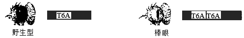

棒眼果蝇X染色体的这种变化属于（ ）

A. 基因突变 B. 基因重组

C. 染色体结构变异 D. 染色体数目变异

3\. 在酵母菌、植物、昆虫等不同生物类群中，rDNA（编码核糖体RNA的基因）的碱基序列大部分是相同的。这一事实为“这些不同生物类群具有共同祖先”的观点提供了（ ）

A. 化石证据 B. 比较解剖学证据

C. 胚胎学证据 D. 分子水平证据

4\. 同一个体的肝细胞和上皮细胞都会表达一些组织特异性的蛋白质。下列叙述错误的是（ ）

A. 肝细胞和上皮细胞没有相同的蛋白质

B. 肝细胞和上皮细胞所含遗传信息相同

C. 肝细胞的形成是细胞分裂、分化的结果

D. 上皮细胞的形成与基因选择性表达有关

5\. 在自然界中，群落演替是普遍现象。下列现象不属于群落演替的是（ ）

A. 裸岩上出现了地衣 B. 草本群落中出现成片灌木

C. 灌木群落中长出大量乔木 D. 常绿阔叶林中樟树明显长高

6\. 细胞是生物体结构和生命活动的基本单位，也是一个开放的系统。下列叙述正确的是（ ）

A. 细胞可与周围环境交换物质，但不交换能量

B. 细胞可与周围环境交换能量，但不交换物质

C. 细胞可与周围环境交换物质，也可交换能量

D. 细胞不与周围环境交换能量，也不交换物质

7\. 溶酶体内含有多种水解酶，是细胞内大分子物质水解的场所。机体休克时，相关细胞内的溶酶体膜稳定性下降，通透性增高，引发水解酶渗漏到胞质溶胶，造成细胞自溶与机体损伤。下列叙述错误的是（ ）

A. 溶酶体内的水解酶由核糖体合成

B. 溶酶体水解产生的物质可被再利用

C. 水解酶释放到胞质溶胶会全部失活

D. 休克时可用药物稳定溶酶体膜

8\. 黄鳝从胚胎期到产卵期都是雌性，产卵过后变为雄性。研究人员对洞庭湖周边某水域捕获的1178尾野生黄鳝进行年龄及性别的鉴定，结果如下表。

<table style="width:71%;">
<colgroup>
<col style="width: 9%" />
<col style="width: 14%" />
<col style="width: 7%" />
<col style="width: 7%" />
<col style="width: 13%" />
<col style="width: 7%" />
<col style="width: 13%" />
</colgroup>
<tbody>
<tr>
<td rowspan="2" style="text-align: center;">生长期</td>
<td rowspan="2" style="text-align: center;">体长（cm）</td>
<td rowspan="2" style="text-align: center;">尾数</td>
<td colspan="2" style="text-align: center;">雌性</td>
<td colspan="2" style="text-align: center;">雄性</td>
</tr>
<tr>
<td style="text-align: center;">尾数</td>
<td style="text-align: center;">比例（%）</td>
<td style="text-align: center;">尾数</td>
<td style="text-align: center;">比例（%）</td>
</tr>
<tr>
<td style="text-align: center;">Ⅰ龄</td>
<td style="text-align: center;">≤30.0</td>
<td style="text-align: center;">656</td>
<td style="text-align: center;">633</td>
<td style="text-align: center;">96.5</td>
<td style="text-align: center;">8</td>
<td style="text-align: center;">1.2</td>
</tr>
<tr>
<td style="text-align: center;">Ⅱ龄</td>
<td style="text-align: center;">30.1~50.0</td>
<td style="text-align: center;">512</td>
<td style="text-align: center;">327</td>
<td style="text-align: center;">63.9</td>
<td style="text-align: center;">116</td>
<td style="text-align: center;">22.7</td>
</tr>
<tr>
<td style="text-align: center;">Ⅲ龄</td>
<td style="text-align: center;">50.1~55.0</td>
<td style="text-align: center;">6</td>
<td style="text-align: center;">2</td>
<td style="text-align: center;">33.3</td>
<td style="text-align: center;">4</td>
<td style="text-align: center;">66.7</td>
</tr>
<tr>
<td style="text-align: center;">Ⅳ龄</td>
<td style="text-align: center;">≥55.1</td>
<td style="text-align: center;">4</td>
<td style="text-align: center;">0</td>
<td style="text-align: center;">0.0</td>
<td style="text-align: center;">4</td>
<td style="text-align: center;">100.0</td>
</tr>
</tbody>
</table>

下列叙述正确的是（ ）

A. 该黄鳝种群的年龄结构为衰退型

B. 种群中雄黄鳝的平均年龄大于雌性

C. 随年龄增长雄黄鳝数量逐渐增加

D. 该黄鳝种群的雌雄比例约为1∶1

9\. 下列关于双链DNA分子结构的叙述，正确的是（ ）

A. 磷酸与脱氧核糖交替连接构成了DNA的基本骨架

B. 双链DNA中T占比越高，DNA热变性温度越高

C. 两条链之间的氢键形成由DNA聚合酶催化

D. 若一条链的G+C占47%，则另一条链的A+T也占47%

阅读下列材料，完成下面小题。

柿子具有较高的营养价值和药用价值。采用液体发酵法可酿制出醋香浓郁、酸味纯正的柿子醋，提高了柿子的经济价值。柿子醋的酿造工艺流程如图所示。

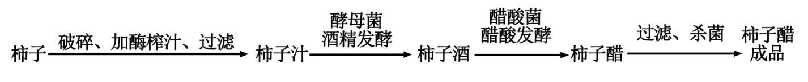

10\. 下列关于酒精发酵和醋酸发酵的叙述，错误的是（ ）

A. 酒精发酵是吸能反应 B. 酒精发酵在无氧条件下进行

C. 醋酸发酵是放能反应 D. 醋酸发酵在有氧条件下进行

11\. 下列关于柿子醋酿造过程的叙述，错误的是（ ）

A 加酶榨汁环节加入果胶酶，有利于提高柿子汁产量

B. 酒精发酵前可对柿子汁进行杀菌，以利于酒精发酵

C. 若柿子酒的酒精度过高，应稀释后再用于醋酸发酵

D. 用不同品种和成熟度的柿子酿造的柿子醋风味相同

12\. 血浆、组织液和淋巴等细胞外液共同构成人体细胞赖以生存的内环境。下列关于淋巴细胞分布的叙述，正确的是（ ）

A. 只存在于淋巴 B. 只存在于血浆和淋巴

C. 只存在于血浆和组织液 D. 存在于血浆、组织液和淋巴

13\. 干旱胁迫下，植物体内脱落酸含量显著增加，赤霉素含量下降。下列叙述正确的是（ ）

A. 干旱胁迫下脱落酸含量上升，促进气孔开放

B. 干旱胁迫下植物含水量上升，增强抗旱能力

C. 干旱胁迫下，脱落酸受体缺失突变体较耐干旱

D. 干旱胁迫下，叶面喷施赤霉素不利于植物抗旱

14\. 脲酶催化尿素水解，产生的氨可作为细菌的氮源。脲酶被去除镍后失去活性。下列叙述错误的是（ ）

A. 镍是组成脲酶的重要元素

B. 镍能提高尿素水解反应的活化能

C. 产脲酶细菌可在以NH4Cl为唯一氮源的培养基生长繁殖

D. 以尿素为唯一氮源的培养基可用于筛选产脲酶细菌

15\. 植物细胞胞质溶胶中的、通过离子通道进入液泡，Na+、Ca2+逆浓度梯度转运到液泡，以调节细胞渗透压。白天光合作用合成的蔗糖可富集在液泡中，夜间这些蔗糖运到胞质溶胶。植物液泡中部分离子与蔗糖的转运机制如图所示。下列叙述错误的是（ ）

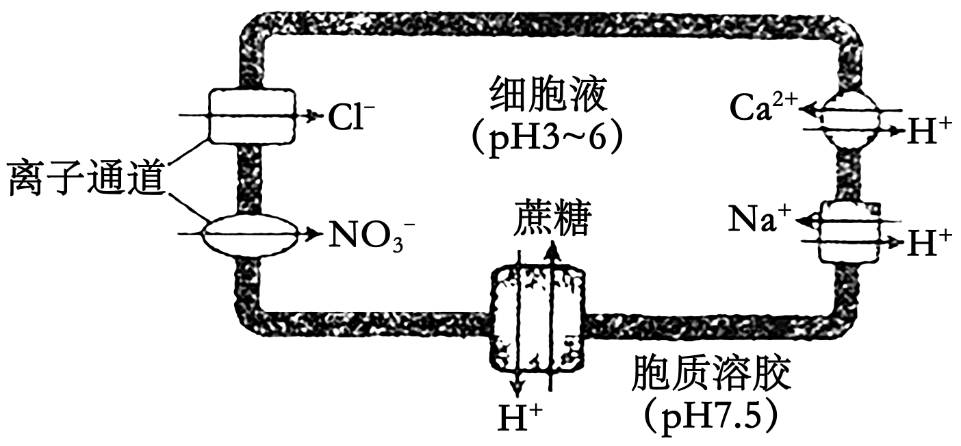

A. 液泡通过主动运输方式维持膜内外的H+浓度梯度

B. 、通过离子通道进入液泡不需要ATP直接供能

C. Na+、Ca2+进入液泡需要载体蛋白协助不需要消耗能量

D. 白天液泡富集蔗糖有利于光合作用的持续进行

16\. 以枪乌贼的巨大神经纤维为材料，研究了静息状态和兴奋过程中，K+、Na+的内向流量与外向流量，结果如图所示。外向流量指经通道外流的离子量，内向流量指经通道内流的离子量。

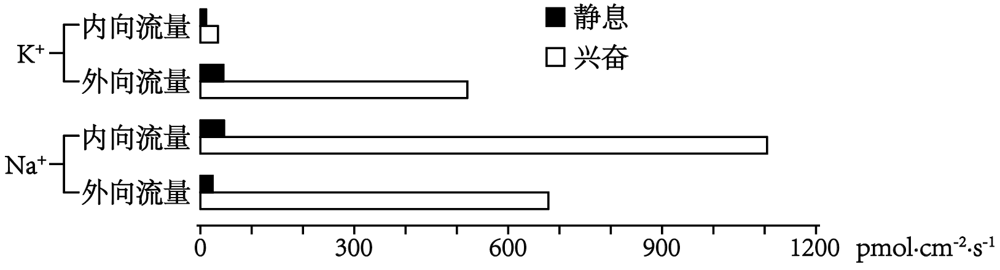

下列叙述正确的是（ ）

A. 兴奋过程中，K+外向流量大于内向流量

B. 兴奋过程中，Na+内向流量小于外向流量

C. 静息状态时，K+外向流量小于内向流量

D 静息状态时，Na+外向流量大于内向流量

17\. 某昆虫的翅型有正常翅和裂翅，体色有灰体和黄体，控制翅型和体色的两对等位基因独立遗传，且均不位于Y染色体上。研究人员选取一只裂翅黄体雌虫与一只裂翅灰体雄虫杂交，F1表型及比例为裂翅灰体雌虫：裂翅黄体雄虫∶正常翅灰体雌虫∶正常翅黄体雄虫=2∶2∶1∶1。让全部F1相同翅型的个体自由交配，F2中裂翅黄体雄虫占F2总数的（ ）

A. 1/12 B. 1/10 C. 1/8 D. 1/6

18\. 某二倍体动物（2n=4）精原细胞DNA中的P均为32P，精原细胞在不含32P的培养液中培养，其中1个精原细胞进行一次有丝分裂和减数第一次分裂后，产生甲~丁4个细胞。这些细胞的染色体和染色单体情况如下图所示。

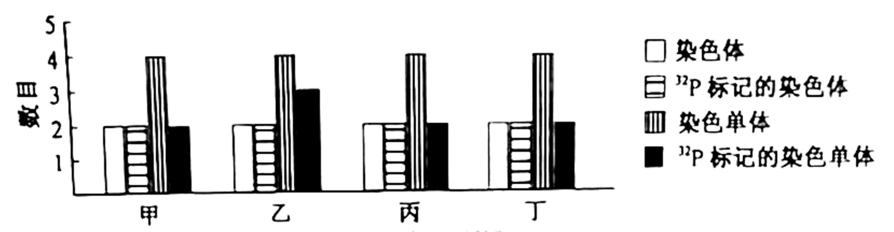

不考虑染色体变异的情况下，下列叙述正确的是（ ）

A. 该精原细胞经历了2次DNA复制和2次着丝粒分裂

B. 4个细胞均处于减数第二次分裂前期，且均含有一个染色体组

C. 形成细胞乙的过程发生了同源染色体的配对和交叉互换

D. 4个细胞完成分裂形成8个细胞，可能有4个细胞不含32P

阅读下列材料，完成下面小题。

疟疾是一种严重危害人类健康的红细胞寄生虫病，可用氯喹治疗。疟原虫*pfcrt*基因编码的蛋白，在第76位发生了赖氨酸到苏氨酸的改变，从而获得了对氯喹的抗性。对患者进行抗性筛查，区分氯喹敏感患者和氯喹抗性患者，以利于分类治疗。

研究人员根据pfcrt基因的序列，设计了F1、F2、R1和R2等4种备选引物，用于扩增目的片段，如图甲所示。为选出正确和有效的引物，以疟原虫基因组DNA为模板进行PCR，产物的电泳结果如图乙所示。

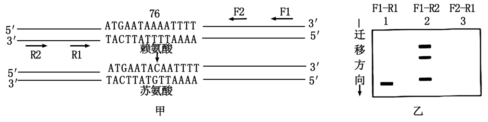

19\. 下列关于引物F1、F2、R1和R2的叙述，错误的是（ ）

A. F1-R1引物可用于特异性地扩增目的片段

B. F1-R2引物不能用于特异性地扩增目的片段

C. F2为无效引物，没有扩增功能，无法使用

D. R2引物可用于特异性地扩增目的片段

20\. 为了筛查疟原虫感染者，以及区分对氯喹的敏感性。现有6份血样，处理后进行PCR。产物用限制酶ApoⅠ消化，酶解产物的电泳结果如图所示。

1~6号血样中，来自于氯喹抗性患者的是（ ）

A. 1号和6号 B. 2号和4号

C. 3号和5号 D. 1号、2号、4号和6号

**非选择题部分**

**二、非选择题（本大题共5小题，共60分）**

21\. 人体受到低血糖和危险等刺激时，神经系统和内分泌系统作出相应反应，以维持人体自身稳态和适应环境。其中肾上腺发挥了重要作用，调节机制如图。

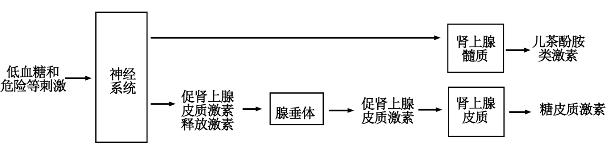

回答下列问题：

（1）遭遇危险时，交感神经促进肾上腺髓质分泌儿茶酚胺类激素，引起心跳加快、血压升高、肌肉血流量\_\_\_\_\_等生理效应，有助于机体做出快速反应。从反射弧的组成分析，交感神经属于\_\_\_\_\_。交感神经纤维末梢与\_\_\_\_\_形成突触，支配肾上腺髓质的分泌。

（2）危险引起的神经冲动还能传到\_\_\_\_\_，该部位的某些神经细胞分泌促肾上腺皮质激素释放激素，该激素作用于腺垂体，最终促进糖皮质激素水平上升，该过程体现了糖皮质激素的分泌具有\_\_\_\_\_调节的特点。

（3）儿茶酚胺类激素和糖皮质激素均为小分子有机物。儿茶酚胺类激素具有较强的亲水性，不进入细胞，其受体位于\_\_\_\_\_。糖皮质激素属于脂溶性物质，进入细胞后与受体结合，产生的复合物与DNA特定位点结合，从而影响相关基因的\_\_\_\_\_。糖皮质激素具有促进非糖物质转化为葡萄糖、抑制组织细胞利用葡萄糖等作用，在血糖浓度调节方面与胰岛素具有\_\_\_\_\_（填“协同”或“拮抗”）作用。

（4）去甲肾上腺素属于肾上腺髓质分泌的儿茶酚胺类激素，也是某些神经元分泌的神经递质。下列关于激素和神经递质的叙述，错误的是哪一项？\_\_\_\_\_

A. 均可作信号分子 B. 靶细胞都具有相应受体

C. 都需要随血流传送到靶细胞 D. 分泌受机体内、外因素的影响

（5）长期较大剂量使用糖皮质激素，停药前应逐渐减量。下列分析合理的有哪几项？\_\_\_\_\_

A. 长期较大剂量用药可引起肾上腺皮质萎缩

B. 立即停药可致体内糖皮质激素不足

C. 停药前可适量使用促肾上腺皮质激素

D. 逐渐减量用药有利于肾上腺皮质功能恢复

22\. 内蒙古草原是我国重要的天然牧场，在畜牧业生产中占有重要的地位。回答下列问题：

（1）调查发现某草原群落中贝加尔针茅生活力强、个体数量多和生物量\_\_\_\_\_，据此判定贝加尔针茅是该群落中占优势的物种，影响其他物种的生存和繁殖，对群落的\_\_\_\_\_和功能起决定性的作用。

（2）为探究草原放牧强度和氮素施加量对草原群落的影响，进行了相应实验。

①思路：设置不同水平的氮素添加组，每个氮素水平都设置\_\_\_\_\_处理，一段时间后对群落的物种丰富度、功能特征等指标进行检测。其中植物物种丰富度的调查常采用\_\_\_\_\_法。

②结果：植物的物种丰富度结果如图所示。

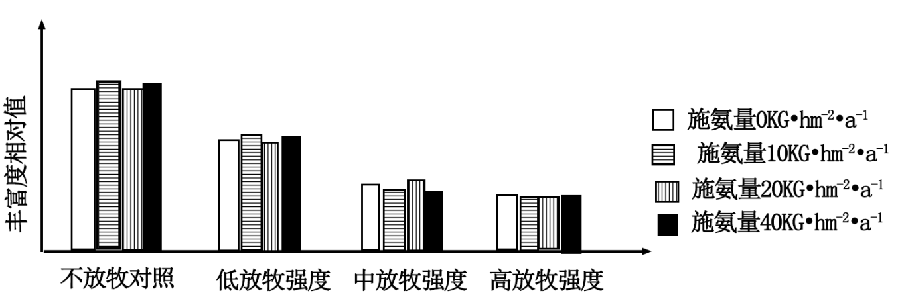

③分析：结果表明，不同水平的氮素添加组之间植物的物种丰富度\_\_\_\_\_。过度放牧会导致植物的物种丰富度\_\_\_\_\_，引起这种变化的原因是过度放牧使适口性好的植物先被家畜采食，使其与适口性\_\_\_\_\_的植物竞争资源时容易处于劣势。

（3）秉承可持续发展理念，既要保护草场资源，又要肉、奶高产，保证牧民经济效益，根据逻辑斯谛增长（“S”形增长）原理，牧民应将家畜种群数量维持在\_\_\_\_\_水平。

23\. 植物体在干旱、虫害或微生物侵害等胁迫过程中会产生防御物质，这类物质属于次生代谢产物。次生代谢产物在植物抗虫、抗病等方面发挥作用，也是药物、香料和色素等的重要来源。次生代谢产物X的研发流程如下：

筛选高产细胞→细胞生长和产物X合成关系的确定→发酵生产X

回答下列问题：

（1）获得高产细胞时，以X含量高的植物品种的器官和组织作为\_\_\_\_\_，经脱分化形成愈伤组织，然后通过液体振荡和用一定孔径的筛网进行\_\_\_\_\_获得分散的单细胞。

（2）对分离获得的单细胞进行\_\_\_\_\_培养，并通过添加\_\_\_\_\_或营养缺陷培养方法获取细胞周期同步、遗传和代谢稳定、来源单一的细胞群。为进一步提高目标细胞的X含量，将微生物菌体或其产物作为诱导子加入到培养基中，该过程模拟了\_\_\_\_\_的胁迫。

（3）在大规模培养高产细胞前，需了解植物细胞生长和产物合成的关系。培养细胞生产次生代谢产物的模型分为3种，如图所示。若X只在细胞生长停止后才能合成，则X的合成符合图\_\_\_\_\_（填“甲”“乙”“丙”），根据该图所示的关系，从培养阶段及其目标角度，提出获得大量X的方法。\_\_\_\_\_

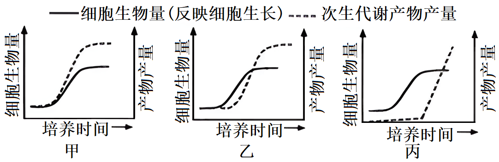

（4）多种次生代谢产物在根部合成与积累，如人参、三叶青等药用植物，可通过\_\_\_\_\_培养替代细胞悬浮培养生产次生代谢产物。随着基因组测序和功能基因组学的发展，在全面了解生物体合成某次生代谢产物的\_\_\_\_\_和\_\_\_\_\_的基础上，可利用合成生物学的方法改造酵母菌等微生物，利用\_\_\_\_\_工程生产植物的次生代谢产物。

24\. 原产热带的观赏植物一品红，花小，顶部有像花瓣一样的红色叶片，下部叶片绿色。回答下列问题：

（1）科学研究一般经历观察现象、提出问题、查找信息、作出假设、验证假设等过程。

①某同学观察一品红的叶片颜色，提出了问题：红叶是否具有光合作用能力。

②该同学检索文献获得相关资料：植物能通过光合作用合成淀粉。检测叶片中淀粉的方法，先将叶片浸入沸水处理；再转入热甲醇处理；然后将叶片置于含有少量水的培养皿内并展开，滴加碘-碘化钾溶液（或碘液），观察颜色变化。

③结合上述资料，作出可通过实验验证的假设：\_\_\_\_\_。

④为验证假设进行实验。请完善分组处理，并将支持假设的预期结果填入表格。

|               |               |
|:------------- |:------------- |
| 分组处理          | 预期结果          |
| 绿叶+光照         | 变蓝            |
| 绿叶+黑暗         | 不变蓝           |
| ⅰ\_\_\_\_\_\_ | ⅱ\_\_\_\_\_\_ |
| ⅲ\_\_\_\_\_\_ | ⅳ\_\_\_\_\_\_ |

⑤分析：检测叶片淀粉的方法中，叶片浸入沸水处理的目的是\_\_\_\_\_。热甲醇处理的目的是\_\_\_\_\_．

（2）对一品红研究发现，红叶和绿叶的叶绿素含量分别为0.02g（Chl）·m-2和0.20g（Chl）·m-2，红叶含有较多的水溶性花青素。在不同光强下测得的qNP值和电子传递速率（ETR）值分别如图甲、乙所示。qNP值反映叶绿体通过热耗散的方式去除过剩光能的能力；ETR值反映光合膜上电子传递的速率，与光反应速率呈正相关。花青素与叶绿素的吸收光谱如图丙所示。

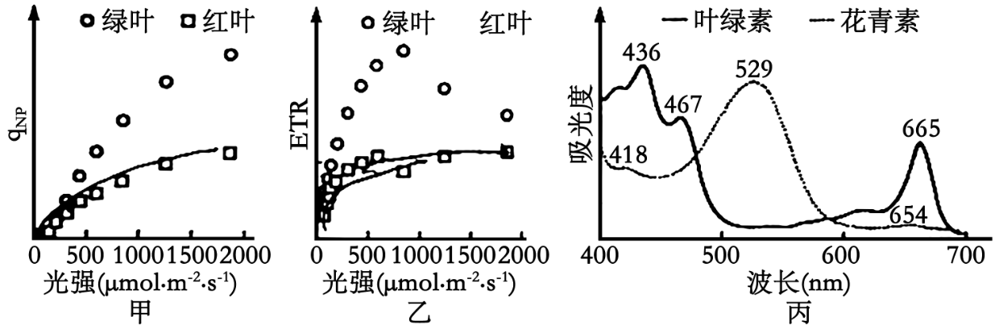

①分析图甲可知，在光强500～2000μmol·m-2·s-1范围内，相对于绿叶，红叶的\_\_\_\_\_能力较弱。分析图乙可知，在光强800～2000μmol·m-2·s-1，范围内，红叶并未出现类似绿叶的光合作用被\_\_\_\_\_现象。结合图丙可知，强光下，贮藏于红叶细胞\_\_\_\_\_内的花青素可通过\_\_\_\_\_方式达到保护叶绿体的作用。

②现有实验证实，生长在高光强环境下的一品红，红叶叶面积大，颜色更红。综合上述研究结果可知，在强光环境下，红叶具有较高花青素含量和较大叶面积，其作用除了能进行光合作用外，还有保护\_\_\_\_\_的功能。一品红的花小，不受关注，但能依赖花瓣状的红叶吸引\_\_\_\_\_，完成传粉。

25\. 瓢虫鞘翅上的斑点图案多样而复杂。早期的杂交试验发现，鞘翅的斑点图案由某条染色体上同一位点（H基因位点）的多个等位基因（h、HC、HS、HSP等）控制的。HC、HS、HSP等基因各自在鞘翅相应部位控制黑色素的生成，分别使鞘翅上形成独特的斑点图案；基因型为hh的个体不生成黑色素，鞘翅表现为全红。通过杂交试验研究，并不能确定H基因位点的具体位置、序列等情况。回答下列问题：

（1）两个体杂交，所得F1的表型与两个亲本均不同，如图所示。

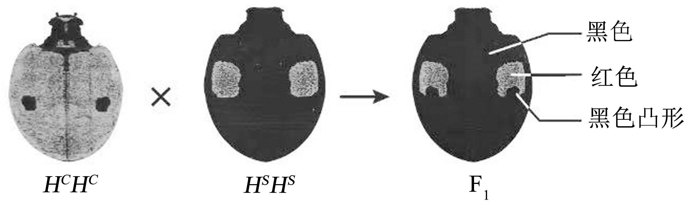

的黑色凸形是基因型为\_\_\_\_\_\_亲本的表型在F1中的表现，表明该亲本的黑色斑是\_\_\_\_\_\_性状。若F1雌雄个体相互交配，F2表型的比例为\_\_\_\_\_。

（2）近期通过基因序列研究发现了P和G两个基因位点，推测其中之一就是H基因位点。为验证该推测，研究人员在翻译水平上分别阻止了P和G位点的基因表达，实验结果如表所示。结果表明，P位点就是控制黑色素生成的H基因位点，那么阻止P位点基因表达的实验结果对应表中哪两组？\_\_\_\_\_\_，判断的依据是\_\_\_\_\_。此外，还可以在\_\_\_\_\_水平上阻止基因表达，以分析基因对表型的影响。

|       |                                                                                                                                                                                     |                                                                                                                                                                                     |                                                                                                                                                                                    |                                                                                                                                                                                     |
|:-----:|:-----------------------------------------------------------------------------------------------------------------------------------------------------------------------------------:|:-----------------------------------------------------------------------------------------------------------------------------------------------------------------------------------:|:----------------------------------------------------------------------------------------------------------------------------------------------------------------------------------:|:-----------------------------------------------------------------------------------------------------------------------------------------------------------------------------------:|
|       | 组1                                                                                                                                                                                  | 组2                                                                                                                                                                                  | 组3                                                                                                                                                                                 | 组4                                                                                                                                                                                  |
| 未阻止表达 | 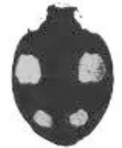 | 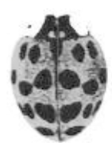    |  | 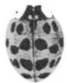 |
| 阻止表达  | 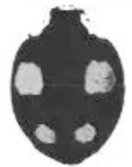 | 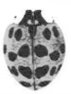 | 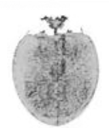 | 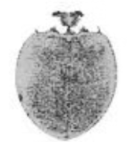 |

（3）为进一步研究P位点基因的功能，进行了相关实验。两个大小相等的完整鞘翅P位点基因表达产生的mRNA总量，如图甲所示，说明P位点基因的表达可以促进鞘翅黑色素的生成，判断的理由是\_\_\_\_\_；黑底红点鞘翅面积相等的不同部位P位点基因表达产生的mRNA总量，如图乙所示，图中a、b、c部位mRNA总量的差异，说明P位点基因在鞘翅不同部位的表达决定\_\_\_\_\_。

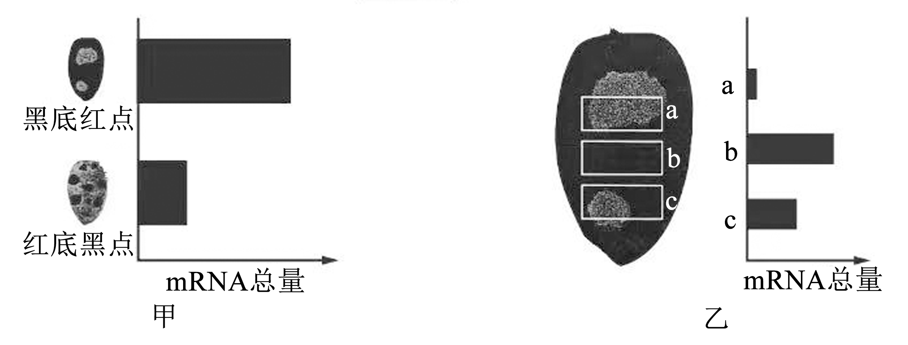

（4）进一步研究发现，鞘翅上有产生黑色素的上层细胞，也有产生红色素的下层细胞，P位点基因只在产生黑色素的上层细胞内表达，促进黑色素的生成，并抑制下层细胞生成红色素。综合上述研究结果，下列对第（1）题中F1（HCHS）表型形成原因的分析，正确的有哪几项\_\_\_\_\_

A. F1鞘翅上，HC、HS选择性表达 B. F1鞘翅红色区域，HC、HS都不表达

C. F1鞘翅黑色凸形区域，HC、HS都表达 D. F1鞘翅上，HC、HS只在黑色区域表达
