**2024年6月浙江省普通高校招生选考科目考试**

**生物学**

**本试题卷分选择题和非选择题两部分，共8页，满分100分，考试时间90分钟**

**考生注意：**

**1．答题前，请务必将自己的姓名、准考证号用黑色字迹的签字笔或钢笔分别填写在试题卷和答题纸规定的位置上。**

**2．答题时，请按照答题纸上“注意事项”的要求，在答题纸相应的位置上规范作答，在本试题卷上的作答一律无效。**

**3．非选择题的答案必须使用黑色字迹的签字笔或钢笔写在答题纸上相应区域内，作图时可先使用2B铅笔，确定后必须使用黑色字迹的签字笔或钢笔描黑。选择题部分**

**一、选择题（本大题共20小题，每小题2分，共40分。每小题列出的四个备选项中只有一个是符合题目要求的，不选，多选、错选均不得分）**

1\. 生物多样性是人类赖以生存和发展的基础。下列叙述错误的是（ ）

A. 在城市动物园饲养濒危动物属于生物多样性的就地保护

B. 在培育转基因生物时需考虑对生物多样性的影响

C. 酸雨、全球变暖等生态环境问题会威胁生物多样性

D. 通过立法、宣传教育，让人们树立起保护生物多样性的意识

【答案】A

【解析】

【分析】保护生物多样性的措施：①就地保护：主要形式是建立自然保护区，是保护生物多样性最有效的措施。②迁地保护/易地保护：将濒危生物迁出原地，移入动物园、植物园、水族馆和濒危动物繁育中心，进行特殊的保护和管理，是对就地保护的补充。③建立濒危物种基因库，保护珍贵的遗传资源。④制定法律法规，加强教育和法制管理，提高公民的环境保护意识等。

【详解】A、在城市动物园饲养濒危动物属于生物多样性的易地保护，而就地保护是指在原地对被保护的生态系统或物种建立自然保护区以及风景名胜区等，A错误；

B、在培育转基因生物时，如果转基因生物释放到环境中，可能会对生态系统中的其他生物造成影响，从而影响生物多样性，所以需考虑对生物多样性的影响，B正确；

C、酸雨会导致水体酸化，危害水生生物的生存；全球变暖会改变生态系统的结构和功能，破坏生物的栖息地，这些生态环境问题都会威胁生物多样性，C正确；

D 、通过立法可以从法律层面规范和约束人们的行为，加强对生物多样性的保护；宣传教育可以提高人们的环保意识，让人们树立起保护生物多样性的意识，共同参与到保护行动中来，D正确。

故选A。

2\. 野生型果蝇的复眼为椭圆形，当果蝇X染色体上的16A片段发生重复时，形成棒状的复眼（棒眼），如图所示。

棒眼果蝇X染色体的这种变化属于（ ）

A. 基因突变 B. 基因重组

C. 染色体结构变异 D. 染色体数目变异

【答案】C

【解析】

【分析】染色体变异是指染色体结构和数目的改变。染色体结构的变异主要有缺失、重复、倒位、易位四种类型，染色体数目变异可以分为两类：一类是细胞内个别染色体的增加或减少，另一类是细胞内染色体数目以染色体组的形式成倍地增加或减少。

【详解】染色体结构的变异主要有缺失、重复、倒位、易位四种类型，果蝇X染色体上的16A片段发生重复时，复眼会由正常的椭圆形变成“棒眼”，该变异属于染色体结构变异中的重复，C正确，ABD错误。

故选C。

3\. 在酵母菌、植物、昆虫等不同生物类群中，rDNA（编码核糖体RNA的基因）的碱基序列大部分是相同的。这一事实为“这些不同生物类群具有共同祖先”的观点提供了（ ）

A. 化石证据 B. 比较解剖学证据

C. 胚胎学证据 D. 分子水平证据

【答案】D

【解析】

【分析】1、化石：指通过自然作用保存在地层中的古代生物的遗体、遗物或生活痕迹。利用化石可以确定地球上曾经生活过的生物的种类及其形态、结构、行为特征。过对大量化石证据的研究发现，生物进化的顺序：有共同的祖先，由简单到复杂，由高等到低等，由水生到陆生等。

2、比较解剖学证据：研究比较脊椎动物的器官、系统的形态和结构，可以为这些生物是否有共同祖先寻找证据。如：人与蝙蝠、鲸与猫都具有相似的脊椎骨组成的脊柱，说明这些动物是由共同祖先进化而来的。

3、胚胎学证据：指研究动植物胚胎的形成和发育过程的学科。比较不同动物以及人的胚胎发育过程，也可以看到进化的蛛丝马迹。脊椎动物在胚胎发育早期都有彼此相似的阶段，这个证据支持了任何其他脊椎动物有共同祖先的观点。如：人的胚胎在发育早期会出现鳃裂和尾，与鱼的胚胎在发育早期相似。

4、细胞和分子水平的证据：当今生物有许多共同的特征，比如都能进行代谢、生长和增殖的细胞，细胞有共同的物质基础和结构基础，这是对生物有共同祖先这一论点的有力支持。不同生物的DNA和蛋白质等生物大分子的共同点，提示人们当今生物有着共同的原始祖先，其差异的大小则揭示了当今生物种类的亲缘关系的远近，以及它们在进化史上出现的顺序。

【详解】不同生物的DNA和蛋白质等生物大分子的共同点，提示人们当今生物有着共同的原始祖先，其差异的大小则揭示了当今生物种类的亲缘关系的远近，以及它们在进化史上出现的顺序。rDNA（编码核糖体RNA的基因）的碱基序列大部分是相同的，属于分子水平的证据，D符合题意。

故选D。

4\. 同一个体的肝细胞和上皮细胞都会表达一些组织特异性的蛋白质。下列叙述错误的是（ ）

A. 肝细胞和上皮细胞没有相同的蛋白质

B. 肝细胞和上皮细胞所含遗传信息相同

C. 肝细胞的形成是细胞分裂、分化的结果

D. 上皮细胞的形成与基因选择性表达有关

【答案】A

【解析】

【分析】细胞分化实质是基因的选择性表达，同一个体的不同细胞是由同一受精卵分裂、分化而来的，所含遗传物质相同。

【详解】A、肝细胞和上皮细胞有相同的蛋白质，如呼吸酶，A错误；

BCD、肝细胞和上皮细胞的形成是细胞分裂、分化的结果，是基因选择性表达的结果，二者是由同一受精卵分化而来的，所含遗传信息相同，BCD正确。

故选A。

5\. 在自然界中，群落演替是普遍现象。下列现象不属于群落演替的是（ ）

A. 裸岩上出现了地衣 B. 草本群落中出现成片灌木

C. 灌木群落中长出大量乔木 D. 常绿阔叶林中樟树明显长高

【答案】D

【解析】

【分析】1、群落演替：随着时间的推移，一个群落被另一个群落代替的过程。主要类型：初生演替和次生演替。

2、初生演替的一般过程是裸岩阶段→地衣阶段→苔藓阶段→草本植物阶段→灌木阶段→森林阶段。

3、人类可以砍伐树木，填湖造地、捕杀动物，也可以封山育林、治理沙漠、管理草原，甚至可以建立人工群落。人类活动往往会使群落演替按照不同于自然演替的速度和方向进行。

【详解】A、裸岩上发生的演替属于初生演替，即裸岩上出现了地衣属于演替现象，不符合题意，A错误；

B、草本群落中出现成片灌木这属于演替过程，即处于优势地位的灌木逐渐把草本植物替代，不符合题意，B错误；

C、灌木群落中长出大量乔木，为群落演替过程，表现为乔木作为优势种取代灌木，不符合题意，C错误；

D、常绿阔叶林中樟树明显长高属于生长现象，不属于演替，符合题意，D正确。

故选D。

6\. 细胞是生物体结构和生命活动的基本单位，也是一个开放的系统。下列叙述正确的是（ ）

A. 细胞可与周围环境交换物质，但不交换能量

B. 细胞可与周围环境交换能量，但不交换物质

C. 细胞可与周围环境交换物质，也可交换能量

D. 细胞不与周围环境交换能量，也不交换物质

【答案】C

【解析】

【分析】细胞是生命活动的结构单位和功能单位，病毒没有细胞结构，不能独立生活，必须寄生在细胞中进行生活。生命活动离不开细胞是指单细胞生物每个细胞能完成各种生命活动，多细胞生物通过各种分化细胞协调完成各种复杂的生命活动。

【详解】细胞是一个开放的系统，每时每刻都与环境进行着物质和能量的交换，ABD错误，C正确。

故选C。

7\. 溶酶体内含有多种水解酶，是细胞内大分子物质水解的场所。机体休克时，相关细胞内的溶酶体膜稳定性下降，通透性增高，引发水解酶渗漏到胞质溶胶，造成细胞自溶与机体损伤。下列叙述错误的是（ ）

A. 溶酶体内的水解酶由核糖体合成

B. 溶酶体水解产生的物质可被再利用

C. 水解酶释放到胞质溶胶会全部失活

D. 休克时可用药物稳定溶酶体膜

【答案】C

【解析】

【分析】溶酶体分布在动物细胞，是单层膜形成的泡状结构，是细胞内的“消化车间”，含多种水解酶，能分解衰老、损伤的细胞器，吞噬并且杀死侵入细胞的病毒和细菌。

【详解】A、溶酶体内的水解酶的本质是蛋白质，合成场所在核糖体，A正确；

B、溶酶体内的水解酶催化相应物质分解后产生的氨基酸、核苷酸等可被细胞再利用，B正确；

C、溶酶体内的pH比胞质溶胶低，水解酶释放到胞质溶胶后活性下降，但仍有活性，因此会造成细胞自溶与机体损伤，C错误；

D、机体休克时，相关细胞内的溶酶体膜稳定性下降，通透性增高，引发水解酶渗漏到胞质溶胶，造成细胞自溶与机体损伤。所以，休克时可用药物稳定溶酶体膜，D正确。

故选C。

8\. 黄鳝从胚胎期到产卵期都是雌性，产卵过后变为雄性。研究人员对洞庭湖周边某水域捕获的1178尾野生黄鳝进行年龄及性别的鉴定，结果如下表。

<table style="width:71%;">
<colgroup>
<col style="width: 9%" />
<col style="width: 14%" />
<col style="width: 7%" />
<col style="width: 7%" />
<col style="width: 13%" />
<col style="width: 7%" />
<col style="width: 13%" />
</colgroup>
<tbody>
<tr>
<td rowspan="2" style="text-align: center;">生长期</td>
<td rowspan="2" style="text-align: center;">体长（cm）</td>
<td rowspan="2" style="text-align: center;">尾数</td>
<td colspan="2" style="text-align: center;">雌性</td>
<td colspan="2" style="text-align: center;">雄性</td>
</tr>
<tr>
<td style="text-align: center;">尾数</td>
<td style="text-align: center;">比例（%）</td>
<td style="text-align: center;">尾数</td>
<td style="text-align: center;">比例（%）</td>
</tr>
<tr>
<td style="text-align: center;">Ⅰ龄</td>
<td style="text-align: center;">≤30.0</td>
<td style="text-align: center;">656</td>
<td style="text-align: center;">633</td>
<td style="text-align: center;">965</td>
<td style="text-align: center;">8</td>
<td style="text-align: center;">1.2</td>
</tr>
<tr>
<td style="text-align: center;">Ⅱ龄</td>
<td style="text-align: center;">30.1~50.0</td>
<td style="text-align: center;">512</td>
<td style="text-align: center;">327</td>
<td style="text-align: center;">63.9</td>
<td style="text-align: center;">116</td>
<td style="text-align: center;">22.7</td>
</tr>
<tr>
<td style="text-align: center;">Ⅲ龄</td>
<td style="text-align: center;">50.1~55.0</td>
<td style="text-align: center;">6</td>
<td style="text-align: center;">2</td>
<td style="text-align: center;">33.3</td>
<td style="text-align: center;">4</td>
<td style="text-align: center;">66.7</td>
</tr>
<tr>
<td style="text-align: center;">Ⅳ龄</td>
<td style="text-align: center;">≥55.1</td>
<td style="text-align: center;">4</td>
<td style="text-align: center;">0</td>
<td style="text-align: center;">0.0</td>
<td style="text-align: center;">4</td>
<td style="text-align: center;">100.0</td>
</tr>
</tbody>
</table>

下列叙述正确的是（ ）

A. 该黄鳝种群的年龄结构为衰退型

B. 种群中雄黄鳝的平均年龄大于雌性

C. 随年龄增长雄黄鳝数量逐渐增加

D. 该黄鳝种群的雌雄比例约为1∶1

【答案】B

【解析】

【分析】种群的年龄结构是指种群中各年龄期个体数目的比例。性别比例是指种群中雄性个体和雌性个体数量的比例。

【详解】A、由表中信息可知：该黄鳝种群幼年（Ⅰ龄期）的个体多，老年（Ⅳ龄期）的个体少，说明该黄鳝种群的年龄结构为增长型，A错误；

B、由题意“黄鳝从胚胎期到产卵期都是雌性，产卵过后变为雄性”可推知：种群中雄黄鳝的平均年龄大于雌性，B正确；

C、分析表中信息可知：Ⅱ龄期雄黄鳝数量最多，Ⅰ龄期、Ⅲ龄期和Ⅳ龄期雄黄鳝数量非常少，C错误；

D、表中信息显示：各年龄期雌性个体的总数明显大于雄性性个体的总数，说明该黄鳝种群的雌雄比例不是1∶1，D错误。

故选B。

9\. 下列关于双链DNA分子结构的叙述，正确的是（ ）

A. 磷酸与脱氧核糖交替连接构成了DNA的基本骨架

B 双链DNA中T占比越高，DNA热变性温度越高

C. 两条链之间的氢键形成由DNA聚合酶催化

D. 若一条链的G+C占47%，则另一条链的A+T也占47%

【答案】A

【解析】

【分析】DNA分子结构的主要特点：DNA是由两条反向平行的脱氧核苷酸长链盘旋而成的双螺旋结构；DNA的外侧由脱氧核糖和磷酸交替连接构成的基本骨架，内侧是碱基通过氢键连接形成的碱基对，碱基之间的配对遵循碱基互补配对原则（A-T、C-G）

【详解】A、DNA的外侧由脱氧核糖和磷酸交替连接构成的基本骨架，内侧是碱基通过氢键连接形成的碱基对，A正确；

B、双链DNA中GC碱基对占比越高，DNA热变性温度越高，B错误；

C、DNA聚合酶催化形成的是磷酸二酯键，C错误；

D、互补的碱基在单链上所占的比例相等，若一条链的G+C占47%，则另一条链的G+C也占47%，A+T占1-47%=53%，D错误。

故选A。

阅读下列材料，完成下面小题。

柿子具有较高的营养价值和药用价值。采用液体发酵法可酿制出醋香浓郁、酸味纯正的柿子醋，提高了柿子的经济价值。柿子醋的酿造工艺流程如图所示。

10\. 下列关于酒精发酵和醋酸发酵的叙述，错误的是（ ）

A. 酒精发酵是吸能反应 B. 酒精发酵在无氧条件下进行

C. 醋酸发酵是放能反应 D. 醋酸发酵在有氧条件下进行

11\. 下列关于柿子醋酿造过程的叙述，错误的是（ ）

A. 加酶榨汁环节加入果胶酶，有利于提高柿子汁产量

B. 酒精发酵前可对柿子汁进行杀菌，以利于酒精发酵

C. 若柿子酒的酒精度过高，应稀释后再用于醋酸发酵

D. 用不同品种和成熟度的柿子酿造的柿子醋风味相同

【答案】10. A 11. D

【解析】

【分析】酒精发酵是利用的酵母菌的无氧呼吸，需要的是无氧条件；醋酸发酵利用的是醋酸菌的有氧呼吸，需要的是有氧条件。

【10题详解】

A、酒精发酵是利用的酵母菌的无氧呼吸，属于放能反应，A错误；

B、酒精发酵是利用的酵母菌的无氧呼吸，需要的是无氧条件，B正确；

C、醋酸发酵利用的是醋酸菌的有氧呼吸，属于放能反应，C正确；

D、醋酸发酵利用的是醋酸菌的有氧呼吸，需要的是有氧条件，D正确。

故选A。

【11题详解】

A、加酶榨汁环节加入果胶酶，破坏其细胞壁，有利于提高柿子汁产量，A正确；

B、酒精发酵前可以可对柿子汁进行杀菌，再接种酵母菌，以利于酒精发酵，B正确；

C、醋酸菌是好氧细菌当阳气糖原充足时可以将糖分解成醋酸，当缺少糖原时可以将乙醇转化为一圈，再有乙醛转化为醋酸，因此若柿子酒的酒精度过高，应稀释后再用于醋酸发酵，C正确；

D、用不同品种和成熟度的柿子酿造的柿子醋风味不相同，D错误。

故选D。

12\. 血浆、组织液和淋巴等细胞外液共同构成人体细胞赖以生存的内环境。下列关于淋巴细胞分布的叙述，正确的是（ ）

A. 只存在于淋巴 B. 只存在于血浆和淋巴

C. 只存在于血浆和组织液 D. 存在于血浆、组织液和淋巴

【答案】D

【解析】

【分析】血浆、组织液和淋巴等细胞外液共同构成人体细胞赖以生存的内环境。

【详解】毛细淋巴管内的淋巴液汇集到淋巴管中，经过淋巴循环由左右锁骨下静脉汇入血浆，所以血浆和淋巴液中都有淋巴细胞；细胞免疫过程中，细胞毒性T细胞需要进入组织液裂解被病原体侵染的靶细胞，因此淋巴细胞也可分布在组织液中，D正确，ABC错误。

故选D。

13\. 干旱胁迫下，植物体内脱落酸含量显著增加，赤霉素含量下降。下列叙述正确的是（ ）

A. 干旱胁迫下脱落酸含量上升，促进气孔开放

B. 干旱胁迫下植物含水量上升，增强抗旱能力

C. 干旱胁迫下，脱落酸受体缺失突变体较耐干旱

D. 干旱胁迫下，叶面喷施赤霉素不利于植物抗旱

【答案】D

【解析】

【分析】脱落酸：合成部位：根冠、姜蔫的叶片等。主要生理功能：抑制植物细胞的分裂和种子的萌发；促进植物进入休眠；促进叶和果实的衰者、脱落。

赤霉素：合成部位：幼芽、幼根和未成熟的种子等幼嫩部分。主要生理功能：促进细胞的伸长；解除种子、块茎的休眠并促进萌发的作用。

【详解】A、干旱胁迫下，植物体内的脱落酸含量显著增加，促使气孔关闭，避免蒸腾失水，A错误；

B、干旱胁迫下，植物含水量下降，避免失水过多，增强抗旱能力，B错误；

C、干旱胁迫下，脱落酸受体缺失突变体因脱落酸不能正常发挥作用，气孔不能正常关闭，一般不耐旱，C错误；

D、干旱胁迫下，叶面喷施赤霉素促进植株生长，不利于植物抗旱，D正确。

故选D。

14\. 脲酶催化尿素水解，产生的氨可作为细菌的氮源。脲酶被去除镍后失去活性。下列叙述错误的是（ ）

A. 镍是组成脲酶的重要元素

B. 镍能提高尿素水解反应的活化能

C. 产脲酶细菌可在以NH4Cl为唯一氮源的培养基生长繁殖

D. 以尿素为唯一氮源的培养基可用于筛选产脲酶细菌

【答案】B

【解析】

【分析】1、在微生物学中，将允许特定种类的微生物生长，同时抑制或阻止其他种类微生物生长的培养基，称为选择培养基。

2、只有能合成脲酶的微生物才能分解尿素，利用以尿素作为唯一氮源的选择培养基，可以从土壤中分离出分解尿素的细菌。

【详解】A、根据题意，脲酶被去除镍后失去活性，说明镍是组成脲酶的重要元素，A正确；

B、脲酶催化尿素水解的机理为降低化学反应所需的活化能，镍作为脲酶的重要组成元素，应该与降低尿素水解反应的活化能有关，B错误；

C、产脲酶细菌可利用NH4Cl里的氮源进行代谢活动，因此产脲酶细菌可在以NH4Cl为唯一氮源的培养基生长繁殖，C正确；

D、产脲酶细菌能利用脲酶催化尿素分解产生NH3，NH3可作为细菌生长的氮源，不能产脲酶的细菌则无法分解尿素获得氮源，因此以尿素为唯一氮源的培养基可用于筛选产脲酶细菌，D正确。

故选B。

15\. 植物细胞胞质溶胶中的、通过离子通道进入液泡，Na+、Ca2+逆浓度梯度转运到液泡，以调节细胞渗透压。白天光合作用合成的蔗糖可富集在液泡中，夜间这些蔗糖运到胞质溶胶。植物液泡中部分离子与蔗糖的转运机制如图所示。下列叙述错误的是（ ）

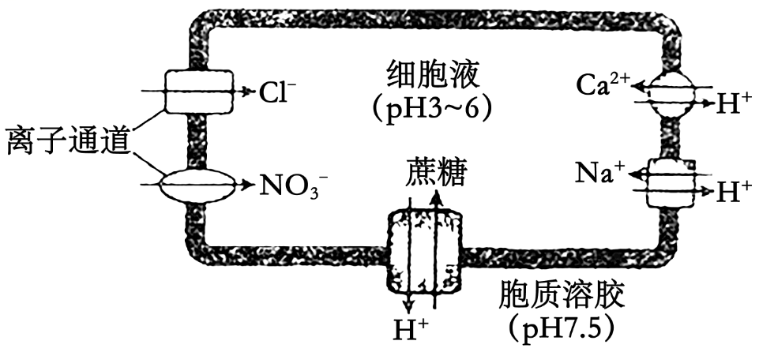

A. 液泡通过主动运输方式维持膜内外的H+浓度梯度

B. 、通过离子通道进入液泡不需要ATP直接供能

C. Na+、Ca2+进入液泡需要载体蛋白协助不需要消耗能量

D. 白天液泡富集蔗糖有利于光合作用的持续进行

【答案】C

【解析】

【分析】液泡内的细胞液中H+浓度大于细胞质基质，说明H+运出液泡是顺浓度梯度，因此方式是协助扩散；液泡膜上的载体蛋白能将H+转运出液泡的同时将细胞质基质中的Na+、Ca2+转运到液泡内，说明Na+、Ca2+进入液泡的直接驱动力是液泡膜两侧的H+电化学梯度，因此该过程Na+、Ca2+的进入液泡的方式为主动运输。

【详解】A、由图可知，细胞液的pH3-6，胞质溶胶的pH7.5，说明细胞液的H+浓度高于细胞溶胶，若要长期维持膜内外的H+浓度梯度，需通过主动运输将细胞溶胶中的H+运输到细胞液中，A正确；

B、通过离子通道运输为协助扩散，、通过离子通道进入液泡属于协助扩散，不需要ATP直接供能，B正确；

C、液泡膜上的载体蛋白能将H+转运出液泡的同时将细胞质基质中的Na+、Ca2+转运到液泡内，说明Na+、Ca2+进入液泡的直接驱动力是液泡膜两侧的H+电化学梯度，因此该过程Na+、Ca2+的进入液泡的方式为主动运输，需要消耗能量，能量由液泡膜两侧的H+电化学梯度提供，C错误；

D、白天蔗糖进入液泡，使光合作用产物及时转移，减少光合作用产物蔗糖在细胞质基质中过度积累，有利于光合作用的持续进行，D正确。

故选C。

16\. 以枪乌贼的巨大神经纤维为材料，研究了静息状态和兴奋过程中，K+、Na+的内向流量与外向流量，结果如图所示。外向流量指经通道外流的离子量，内向流量指经通道内流的离子量。

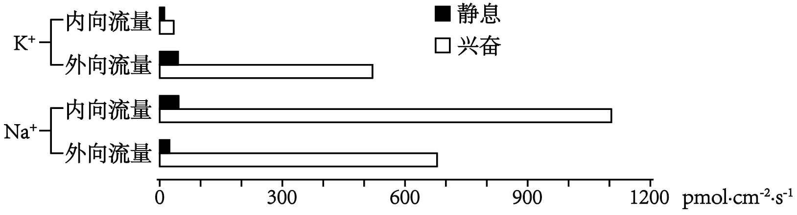

下列叙述正确的是（ ）

A. 兴奋过程中，K+外向流量大于内向流量

B. 兴奋过程中，Na+内向流量小于外向流量

C. 静息状态时，K+外向流量小于内向流量

D. 静息状态时，Na+外向流量大于内向流量

【答案】A

【解析】

【分析】神经细胞内的K+浓度明显高于膜外，神经细胞内的Na+浓度比膜外低。静息时，由于膜主要对K+有通透性，造成K+外流，这是大多数神经细胞产生和维持静息电位的主要原因。受刺激时，细胞膜对Na+的通透性增加，导致Na+内流，这是形成动作电位的基础。

【详解】AB、由图可知：兴奋过程中，K+外向流量大于内向流量，Na+内向流量大于外向流量，A正确，B错误；

CD、静息状态时，K+外向流量大于内向流量，Na+外向流量小于内向流量，CD错误。

故选A。

17\. 某昆虫的翅型有正常翅和裂翅，体色有灰体和黄体，控制翅型和体色的两对等位基因独立遗传，且均不位于Y染色体上。研究人员选取一只裂翅黄体雌虫与一只裂翅灰体雄虫杂交，F1表型及比例为裂翅灰体雌虫：裂翅黄体雄虫∶正常翅灰体雌虫∶正常翅黄体雄虫=2∶2∶1∶1。让全部F1相同翅型的个体自由交配，F2中裂翅黄体雄虫占F2总数的（ ）

A. 1/12 B. 1/10 C. 1/8 D. 1/6

【答案】B

【解析】

【分析】若知道某一性状在子代雌雄个体种出现的比例或数量，则依据该性状在雌雄个体中的比例是否一致可以确定是常染色体遗传还是伴性遗传：若子代性状的表现与性别相关联，则可确定为伴性遗传。

【详解】翅型有正常翅和裂翅，假设控制翅型的基因为A、a，体色有灰体和黄体，假设控制体色的基因为B、b。控制翅型和体色的两对等位基因独立遗传，可知两对基因的遗传遵循自由组合定律。研究人员选取一只裂翅黄体雌虫与一只裂翅灰体雄虫杂交，F1表型及比例为裂翅灰体雌虫：裂翅黄体雄虫∶正常翅灰体雌虫∶正常翅黄体雄虫=2∶2∶1∶1，分析F1表现型可以发现，雌虫全为灰体，雄虫全为黄体，又因为控制翅型和体色的两对等位基因均不位于Y染色体上，因此可推测控制体色的基因位于X染色体上，且黄体为隐性性状。裂翅黄体雌虫与裂翅灰体雄虫杂交，F1出现了正常翅的性状，可以推测裂翅为显性性状，正常翅为隐性性状。由以上分析可以推出亲本裂翅黄体雌虫的基因型为AaXbXb，裂翅灰体雄虫的基因型为为AaXBY。AaXbXb和AaXBY杂交，正常情况下，F1中裂翅∶正常翅=3∶1，实际得到F1中裂翅∶正常翅=2∶1，推测应该是AA存在致死情况。AaXbXb和AaXBY杂交，F1表型及比例为裂翅灰体雌虫（AaXBXb）：裂翅黄体雄虫（AaXbY）∶正常翅灰体雌虫（aaXBXb）∶正常翅黄体雄虫（aaXbY）=2∶2∶1∶1。AaXbXb和AaXBY杂交，将两对基因分开计算，先分析Aa和Aa，子代Aa：aa=2:1，让全部F1相同翅型的个体自由交配，即 2/3Aa和Aa，1/3aa和aa杂交，2/3Aa和Aa杂交，因AA致死，子代为1/3Aa、1/6aa；1/3aa和aa杂交，子代为1/3aa，因此子代中Aa：aa=2:3，即Aa占2/5，aa占3/5。再分析XBXb和XbY，后代产生XbY的概率是1/4，综上可知，F2中裂翅黄体雄虫（AaXbY）占F2总数=（2/5）×（1/4）=1/10。B正确，ACD错误。

故选B。

18\. 某二倍体动物（2n=4）精原细胞DNA中的P均为32P，精原细胞在不含32P的培养液中培养，其中1个精原细胞进行一次有丝分裂和减数第一次分裂后，产生甲~丁4个细胞。这些细胞的染色体和染色单体情况如下图所示。

不考虑染色体变异的情况下，下列叙述正确的是（ ）

A. 该精原细胞经历了2次DNA复制和2次着丝粒分裂

B. 4个细胞均处于减数第二次分裂前期，且均含有一个染色体组

C. 形成细胞乙的过程发生了同源染色体的配对和交叉互换

D. 4个细胞完成分裂形成8个细胞，可能有4个细胞不含32P

【答案】C

【解析】

【分析】DNA中的P均为32P的精原细胞在不含32P的培养液中培养，进行一次有丝分裂后，产生的每个细胞的每条DNA都有一条链含有32P，继续在不含32P的培养液中培养进行减数分裂，完成复制后，8条染色单体中有4条含有32P，减数第一次分裂完成后，理论上，每个细胞中有2条染色体，四条染色单体，其中有2条单体含有32P。

【详解】A、图中的细胞是一个精原细胞进行一次有丝分裂和减数第一次分裂后产生的，据图所示，这些细胞含有染色单体，说明着丝粒没有分裂，因此该精原细胞2次DNA复制，1次着丝粒分裂，A错误；

B、四个细胞还没有进入减数第二次分裂后期（着丝粒分裂），因此可能处于减数第一次分裂末期、减数第二次分裂前期、中期，且均含有一个染色体组，B错误；

C、精原细胞进行一次有丝分裂后，产生的子细胞每个DNA上有一条链含有32P，减数分裂完成复制后，每条染色体上有1个单体含有32P，另一个单体不含32P，减数第一次分裂结束，每个细胞中应该含有2条染色体，四个染色单体，其中有两个单体含有放射性，但乙细胞含有3个染色单体含有放射性，原因是形成乙的过程中发生了同源染色体的配对和交叉互换，C正确；

D、甲、丙、丁完成减数第二次分裂至少产生3个含32P的细胞，乙细胞有3个单体含有32P，完成减数第二次分裂产生的2个细胞都含有32P，因此4个细胞完成分裂形成8个细胞，至多有3个细胞不含32P，D错误。

故选C。

阅读下列材料，完成下面小题。

疟疾是一种严重危害人类健康的红细胞寄生虫病，可用氯喹治疗。疟原虫*pfcrt*基因编码的蛋白，在第76位发生了赖氨酸到苏氨酸的改变，从而获得了对氯喹的抗性。对患者进行抗性筛查，区分氯喹敏感患者和氯喹抗性患者，以利于分类治疗。

研究人员根据pfcrt基因的序列，设计了F1、F2、R1和R2等4种备选引物，用于扩增目的片段，如图甲所示。为选出正确和有效的引物，以疟原虫基因组DNA为模板进行PCR，产物的电泳结果如图乙所示。

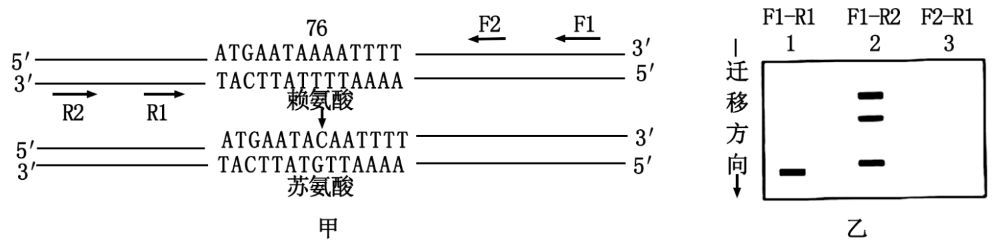

19\. 下列关于引物F1、F2、R1和R2的叙述，错误的是（ ）

A. F1-R1引物可用于特异性地扩增目的片段

B. F1-R2引物不能用于特异性地扩增目的片段

C. F2为无效引物，没有扩增功能，无法使用

D. R2引物可用于特异性地扩增目的片段

20\. 为了筛查疟原虫感染者，以及区分对氯喹的敏感性。现有6份血样，处理后进行PCR。产物用限制酶ApoⅠ消化，酶解产物的电泳结果如图所示。

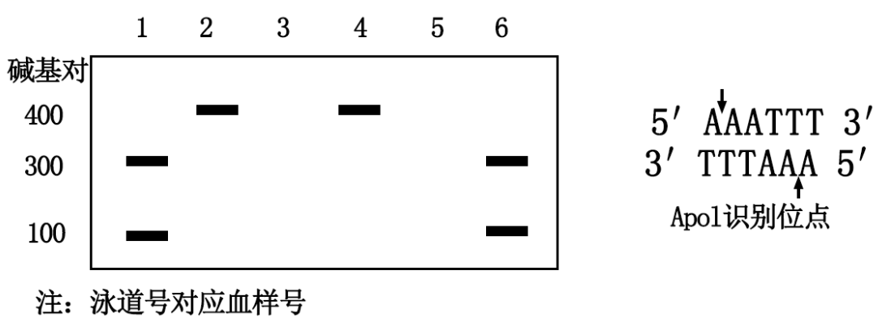

1~6号血样中，来自于氯喹抗性患者的是（ ）

A. 1号和6号 B. 2号和4号

C. 3号和5号 D. 1号、2号、4号和6号

【答案】19. D 20. B

【解析】

【分析】引物是一小段能与DNA母链的一段碱基序列互补配对的短单链核酸，用于PCR的引物长度通常为20~30个核苷酸。

【19题详解】

A、根据图乙结果显示可知，F1-R1引物只扩增出一条片段,说明能够用于特异性扩增目的片段，A正确；

B、根据图乙信息可知，F1-R2引物扩增条带为三条，说明其不能用于特异性扩增目的片段，B正确；

C、根据图乙信息可知，F1-R1能扩增目的1条带，F2-R1无法扩增目的条带，所以F2为无效引物，没有扩增功能，无法使用，C正确；

D、根据图乙显示可知，F1-R1引物只扩增出一条片段，F1-R2引物扩增条带为三条，说明R2引物无法特异性的扩增目的条带，D错误。

故选D。

【20题详解】

根据题干信息可知，疟原虫*pfcrt*基因编码的蛋白，在第76位发生了赖氨酸到苏氨酸的改变，从而获得了对氯喹的抗性。根据酶切位点可知，在具有氯喹抗性的基因组没有ApoⅠ酶切位点，而敏感性基因组中具有该酶切位点，因此对6份血样处理后进行PCR，产物用限制酶ApoⅠ消化，酶解产物的电泳出现两条带则为敏感型，只有一条带的为抗性，所以1~6号血样中，来自于氯喹抗性患者的是2号和4号，B正确，ACD错误。

故选B。

**非选择题部分**

**二、非选择题（本大题共5小题，共60分）**

21\. 人体受到低血糖和危险等刺激时，神经系统和内分泌系统作出相应反应，以维持人体自身稳态和适应环境。其中肾上腺发挥了重要作用，调节机制如图。

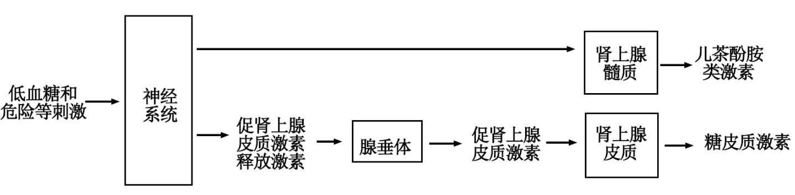

回答下列问题：

（1）遭遇危险时，交感神经促进肾上腺髓质分泌儿茶酚胺类激素，引起心跳加快、血压升高、肌肉血流量\_\_\_\_\_等生理效应，有助于机体做出快速反应。从反射弧的组成分析，交感神经属于\_\_\_\_\_。交感神经纤维末梢与\_\_\_\_\_形成突触，支配肾上腺髓质的分泌。

（2）危险引起的神经冲动还能传到\_\_\_\_\_，该部位的某些神经细胞分泌促肾上腺皮质激素释放激素，该激素作用于腺垂体，最终促进糖皮质激素水平上升，该过程体现了糖皮质激素的分泌具有\_\_\_\_\_调节的特点。

（3）儿茶酚胺类激素和糖皮质激素均为小分子有机物。儿茶酚胺类激素具有较强的亲水性，不进入细胞，其受体位于\_\_\_\_\_。糖皮质激素属于脂溶性物质，进入细胞后与受体结合，产生的复合物与DNA特定位点结合，从而影响相关基因的\_\_\_\_\_。糖皮质激素具有促进非糖物质转化为葡萄糖、抑制组织细胞利用葡萄糖等作用，在血糖浓度调节方面与胰岛素具有\_\_\_\_\_（填“协同”或“拮抗”）作用。

（4）去甲肾上腺素属于肾上腺髓质分泌的儿茶酚胺类激素，也是某些神经元分泌的神经递质。下列关于激素和神经递质的叙述，错误的是哪一项？\_\_\_\_\_

A. 均可作为信号分子 B. 靶细胞都具有相应受体

C. 都需要随血流传送到靶细胞 D. 分泌受机体内、外因素的影响

（5）长期较大剂量使用糖皮质激素，停药前应逐渐减量。下列分析合理的有哪几项？\_\_\_\_\_

A. 长期较大剂量用药可引起肾上腺皮质萎缩

B. 立即停药可致体内糖皮质激素不足

C. 停药前可适量使用促肾上腺皮质激素

D. 逐渐减量用药有利于肾上腺皮质功能恢复

【答案】（1） ①. 增加 ②. 传出神经 ③. 肾上腺髓质

（2） ①. 下丘脑 ②. 分级

（3） ①. 细胞膜上 ②. 转录（表达） ③. 拮抗 （4）C （5）ABCD

【解析】

【分析】自主神经系统由交感神经和副交感神经两部分组成，它们的作用通常是相反的。当人体处于兴奋状态时，交感神经活动占据优势，心跳加快，支气管扩张，但胃肠的蠕动和消化腺的分泌活动减弱；而当人处于安静状态时，副交感神经活动则占据优势，此时，心跳减慢，但胃肠的蠕动和消化液的分泌会加强，有利于食物的消化和营养物质的吸收。交感神经和副交感神经对同一器官的作用，犹如汽车的油门和刹车，可以使机体对外界刺激作出更精确的反应，使机体更好地适应环境的变化。

【小问1详解】

遭遇危险时，交感神经促进肾上腺髓质分泌儿茶酚胺类激素，引起心跳加快、呼吸加深、血压升高、肌肉血流量增加等生理效应，有助于机体做出快速反应。从反射弧的组成分析，交感神经属于传出神经。交感神经纤维末梢与肾上腺髓质形成突触，支配肾上腺髓质的分泌。

【小问2详解】

促肾上腺皮质激素释放激素由下丘脑分泌，因此危险引起的神经冲动还能传到下丘脑，使其分泌促肾上腺皮质激素释放激素，该激素作用于腺垂体，使肾上腺皮质分泌糖皮质激素，最终促进糖皮质激素水平上升，该过程中存在下丘脑-垂体-靶腺体轴，体现了糖皮质激素的分泌具有分级调节的特点。

【小问3详解】

儿茶酚胺类激素具有较强的亲水性，不进入细胞，故其受体位于细胞膜上。糖皮质激素属于脂溶性物质，进入细胞后与受体结合，产生的复合物与DNA特定位点结合，从而影响相关基因的表达。胰岛素具有降血糖的作用，糖皮质激素具有促进非糖物质转化为葡萄糖、抑制组织细胞利用葡萄糖等作用，因此在血糖浓度调节方面与胰岛素具有拮抗作用。

【小问4详解】

A、激素和神经递质都可作为信号分子，A正确；

B、激素和神经递质都与相关受体结合，引起靶细胞相关的生理活动，B正确；

C、激素随血流传送到靶细胞，神经递质通过组织液到达靶细胞，C错误；

D、激素和神经递质的分泌都受机体内、外因素的影响，D正确。

故选C。

【小问5详解】

A、长期较大剂量用药，体内糖皮质激素的浓度很高，可通过负反馈调节导致自身激素合成减少，如促肾上腺皮质激素减少，可引起肾上腺皮质萎缩，A正确；

B、由于长期较大剂量使用糖皮质激素，自身促肾上腺皮质激素释放激素和促肾上腺皮质激素减少，肾上腺皮质功能较弱，自身分泌糖皮质激素不足，立即停药会导致体内糖皮质激素不足，B正确；

C、由于体内促肾上腺皮质激素水平较低，停药前可适量使用促肾上腺皮质激素，C正确；

D、为了避免血中糖皮质激素水平的突然降低，逐渐减量用药以促使自身肾上腺皮质功能的恢复，D正确。

故选ABCD。

22\. 内蒙古草原是我国重要的天然牧场，在畜牧业生产中占有重要的地位。回答下列问题：

（1）调查发现某草原群落中贝加尔针茅生活力强、个体数量多和生物量\_\_\_\_\_，据此判定贝加尔针茅是该群落中占优势的物种，影响其他物种的生存和繁殖，对群落的\_\_\_\_\_和功能起决定性的作用。

（2）为探究草原放牧强度和氮素施加量对草原群落的影响，进行了相应实验。

①思路：设置不同水平的氮素添加组，每个氮素水平都设置\_\_\_\_\_处理，一段时间后对群落的物种丰富度、功能特征等指标进行检测。其中植物物种丰富度的调查常采用\_\_\_\_\_法。

②结果：植物的物种丰富度结果如图所示。

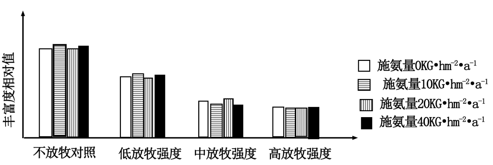

③分析：结果表明，不同水平的氮素添加组之间植物的物种丰富度\_\_\_\_\_。过度放牧会导致植物的物种丰富度\_\_\_\_\_，引起这种变化的原因是过度放牧使适口性好的植物先被家畜采食，使其与适口性\_\_\_\_\_的植物竞争资源时容易处于劣势。

（3）秉承可持续发展理念，既要保护草场资源，又要肉、奶高产，保证牧民经济效益，根据逻辑斯谛增长（“S”形增长）原理，牧民应将家畜种群数量维持在\_\_\_\_\_水平。

【答案】（1） ①. 大 ②. 结构

（2） ①. 不同程度的放牧强度 ②. 样方 ③. 基本相同 ④. 减小 ⑤. 差

（3）K/2

【解析】

【分析】1、物种丰富度是指群落中不同物种的总数。

2、优势种是指对群落的结构和内部环境的形成有明显决定作用的物种。优势种通常是群落中个体数量多，生活力较强的物种。

【小问1详解】

优势种是指对群落的结构和内部环境的形成有明显决定作用的物种。贝加尔针茅作为优势种，应该具有生活力强、个体数量多和生物量大，对群落的结构和功能起决定性的作用。

【小问2详解】

本实验的实验目的是探究草原放牧强度和氮素施加量对草原群落的影响，自变量是放牧强度和氮素施加量，检测指标是丰富度相对量。据图所示，设置不同水平的氮素添加组，每个氮素水平都设置不同程度的放牧强度处理。

植物物种丰富度的调查常采用样方法。

图示结果表明，不同水平的氮素添加组之间植物的物种丰富度基本相同。据图所示，高放牧强度下物种丰富度相对量远小于不放牧对照，说明过度放牧会导致植物的物种丰富度减小。由于过度放牧使适口性好的植物先被家畜采食，使其与适口性差的植物竞争资源时容易处于劣势。

【小问3详解】

K/2时种群增长速率最大，因此根据逻辑斯谛增长（“S”形增长）原理，牧民应将家畜种群数量维持K/2水平。

23\. 植物体在干旱、虫害或微生物侵害等胁迫过程中会产生防御物质，这类物质属于次生代谢产物。次生代谢产物在植物抗虫、抗病等方面发挥作用，也是药物、香料和色素等的重要来源。次生代谢产物X的研发流程如下：

筛选高产细胞→细胞生长和产物X合成关系的确定→发酵生产X

回答下列问题：

（1）获得高产细胞时，以X含量高的植物品种的器官和组织作为\_\_\_\_\_，经脱分化形成愈伤组织，然后通过液体振荡和用一定孔径的筛网进行\_\_\_\_\_获得分散的单细胞。

（2）对分离获得的单细胞进行\_\_\_\_\_培养，并通过添加\_\_\_\_\_或营养缺陷培养方法获取细胞周期同步、遗传和代谢稳定、来源单一的细胞群。为进一步提高目标细胞的X含量，将微生物菌体或其产物作为诱导子加入到培养基中，该过程模拟了\_\_\_\_\_的胁迫。

（3）在大规模培养高产细胞前，需了解植物细胞生长和产物合成的关系。培养细胞生产次生代谢产物的模型分为3种，如图所示。若X只在细胞生长停止后才能合成，则X的合成符合图\_\_\_\_\_（填“甲”“乙”“丙”），根据该图所示的关系，从培养阶段及其目标角度，提出获得大量X的方法。\_\_\_\_\_

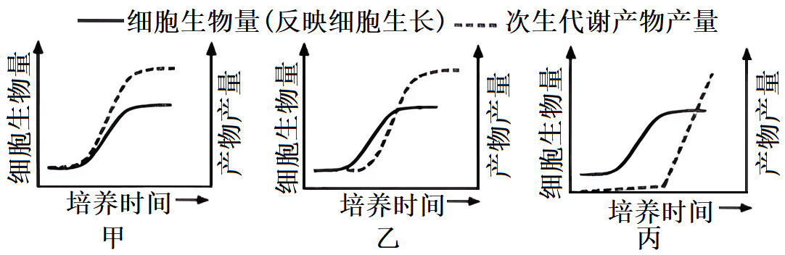

（4）多种次生代谢产物在根部合成与积累，如人参、三叶青等药用植物，可通过\_\_\_\_\_培养替代细胞悬浮培养生产次生代谢产物。随着基因组测序和功能基因组学的发展，在全面了解生物体合成某次生代谢产物的\_\_\_\_\_和\_\_\_\_\_的基础上，可利用合成生物学的方法改造酵母菌等微生物，利用\_\_\_\_\_工程生产植物的次生代谢产物。

【答案】（1） ①. 外植体 ②. 过滤

（2） ①. 扩大 ②. 过量的胸苷 ③. 微生物侵害

（3） ①. 丙 ②. 将细胞培养至稳定期（即停止生长时期）一定时间后，通过分离提纯获得大量X

（4） ①. 根的水培养 ②. 相关基因组成 ③. 基因表达过程 ④. 基因工程和发酵

【解析】

【分析】1、植物组织培养就是在无菌和人工控制的条件下，将离体的植物器官、组织、细胞，培养在人工配制的培养基上，给予适宜的培养条件，诱导其产生愈伤组织、丛芽，最终形成完整的植株。2、植物组织培养的条件：①细胞离体和适宜的外界条件（如适宜温度、适时的光照、pH和无菌环境等）；②一定的营养（无机、有机成分）和植物激素（生长素和细胞分裂素）。

【小问1详解】

植物体的器官和组织、细胞都可以作为外植体，经脱分化形成愈伤组织，将愈伤组织进行振荡培养，使其分散成小的细胞团或单细胞，然后用适当孔径的不锈钢筛网过滤，除去大的细胞团和残渣，离心除去小的残渣，得到单细胞悬浮液。

【小问2详解】

分离获得的单细胞进行扩大培养，并通过添加过量胸苷，（向细胞培养液中加入过量胸苷（TdR），处于S期的细胞立刻被抑制，洗去TdR后可恢复正常分裂，而处于其它时期的细胞不受过量TdR影响）或营养缺陷培养方法获取细胞周期同步、遗传和代谢稳定、来源单一的细胞群。将微生物菌体或其产物作为诱导子加入到培养基中，模拟了微生物侵害的迫害条件。

【小问3详解】

由题可知X只在细胞生长停止后才能合成，所以丙图符合。所以要获得大量X的方法，是将细胞培养知稳定期（即停止生长时期）一定时间后，通过分离提纯获得大量X。

【小问4详解】

由题知，多种次生代谢产物在根部合成与积累，所以要对根进行培养，为了方便进行次生代谢物的收集，可以对根进行水培。要大量获得次生代谢物可以通过基因工程，将相关基因转入酵母菌体内，然后通过发酵工程获得，基因工程的前提是要了解生物体合成某次生代谢产物的相关基因组成和基因表达过程。

24\. 原产热带的观赏植物一品红，花小，顶部有像花瓣一样的红色叶片，下部叶片绿色。回答下列问题：

（1）科学研究一般经历观察现象、提出问题、查找信息、作出假设、验证假设等过程。

①某同学观察一品红的叶片颜色，提出了问题：红叶是否具有光合作用能力。

②该同学检索文献获得相关资料：植物能通过光合作用合成淀粉。检测叶片中淀粉的方法，先将叶片浸入沸水处理；再转入热甲醇处理；然后将叶片置于含有少量水的培养皿内并展开，滴加碘-碘化钾溶液（或碘液），观察颜色变化。

③结合上述资料，作出可通过实验验证的假设：\_\_\_\_\_。

④为验证假设进行实验。请完善分组处理，并将支持假设的预期结果填入表格。

|               |               |
|:------------- |:------------- |
| 分组处理          | 预期结果          |
| 绿叶+光照         | 变蓝            |
| 绿叶+黑暗         | 不变蓝           |
| ⅰ\_\_\_\_\_\_ | ⅱ\_\_\_\_\_\_ |
| ⅲ\_\_\_\_\_\_ | ⅳ\_\_\_\_\_\_ |

⑤分析：检测叶片淀粉的方法中，叶片浸入沸水处理的目的是\_\_\_\_\_。热甲醇处理的目的是\_\_\_\_\_．

（2）对一品红研究发现，红叶和绿叶的叶绿素含量分别为0.02g（Chl）·m-2和0.20g（Chl）·m-2，红叶含有较多的水溶性花青素。在不同光强下测得的qNP值和电子传递速率（ETR）值分别如图甲、乙所示。qNP值反映叶绿体通过热耗散的方式去除过剩光能的能力；ETR值反映光合膜上电子传递的速率，与光反应速率呈正相关。花青素与叶绿素的吸收光谱如图丙所示。

①分析图甲可知，在光强500～2000μmol·m-2·s-1范围内，相对于绿叶，红叶的\_\_\_\_\_能力较弱。分析图乙可知，在光强800～2000μmol·m-2·s-1，范围内，红叶并未出现类似绿叶的光合作用被\_\_\_\_\_现象。结合图丙可知，强光下，贮藏于红叶细胞\_\_\_\_\_内的花青素可通过\_\_\_\_\_方式达到保护叶绿体的作用。

②现有实验证实，生长在高光强环境下的一品红，红叶叶面积大，颜色更红。综合上述研究结果可知，在强光环境下，红叶具有较高花青素含量和较大叶面积，其作用除了能进行光合作用外，还有保护\_\_\_\_\_的功能。一品红的花小，不受关注，但能依赖花瓣状的红叶吸引\_\_\_\_\_，完成传粉。

【答案】（1） ①. 红叶具有光合作用能力 ②. 红叶+光照 ③. 变蓝 ④. 红叶+黑暗 ⑤. 不变蓝 ⑥. 杀死红叶细胞，溶解花青素，以免影响实验结果的观察 ⑦. 溶解叶绿素，以免影响实验结果的观察

（2） ①. 叶绿体通过热耗散的方式去除过剩光能 ②. 抑制 ③. 液泡 ④. 吸收过剩光能的 ⑤. 叶绿体 ⑥. 昆虫（蜜蜂、蝴蝶等）

【解析】

【分析】1、花青素功能：①光保护作用：花青素具有2个吸收高峰，分别位于270~290 nm紫外光区域和500~550 nm可见光区域，这也就决定了植物中所含的花青素在一定程度上会影响光合作用，因此，推测其具有吸收过滤可见光和紫外光的保护作用。②渗透调节作用：花青素作为一种水溶性色素，具有渗透调节的作用。在低温胁迫下，植物花青素合成的相关酶活性增加，促使营养器官中积累的碳水化合物转化为花青素，表皮细胞液泡中的花青素使得叶片渗透势降低，降低冰点以减少冻害，从而抵御逆境胁迫。

2、根据题意及表格内容可知，该实验为对照实验，需要设置绿叶+光照、绿叶+黑暗、红叶+光照、红叶+黑暗四个小组。

3、图甲：自变量为光照强度和叶片颜色，因变量为qNP值；图乙：自变量为光照强度和叶片颜色，因变量为ETR值。

【小问1详解】

根据实验的问题，提出假设：红叶具有光合作用能力。

为探究红叶是否像绿叶一样具有光合作用的能力，需分别设置绿叶+光照、绿叶+黑暗、红叶+光照、红叶+黑暗四个小组。若假设红叶具有光合作用能力成立，则红叶+光照组中，溶液变蓝；红叶+黑暗组中，溶液不变蓝。整个实验步骤中，先用沸水处理叶片，将细胞杀死，溶解细胞中的花青素；再将叶片转移到甲醇溶液中，溶解细胞中的叶绿素，以免影响后续实验结果的观察。

【小问2详解】

分析图甲可知，自变量为光照强度和叶片颜色，因变量为qNP值，当光照强度为500～2000μmol·m-2·s-1范围内时，红叶的qNP值较小，即红叶中叶绿体通过热耗散的方式去除过剩光能的能力较弱。

分析图乙可知，随着光照强度的增加，绿叶的ETR值显增大，当光照强度超过800μmol·m-2·s-1时，ETR值减小，即随着光照强度增加，绿叶光合速率先增大后减小，推出光照强度超过一定范围时，绿叶的光合作用反而被抑制。而根据图示可知，在光照强度为500～2000μmol·m-2·s-1范围内时，红叶并未出现光合作用被抑制的情况。

红叶中叶绿体通过热耗散的方式去除过剩光能的能力较低，结合图丙可知，储藏在细胞的液泡中花青素，可通过吸收吸收多余光能（蓝光、绿光）的方式，从而保护叶绿体不受强光损伤。

大量研究表明，花青素具有缓解叶片中光氧化损伤的潜力，主要通过屏蔽叶绿体过多的高能量量子和清除活性氧物质。综合上述研究结果可知，在强光环境下，大面积的红叶细胞中富含花青素，能有效保护叶绿体不受强光损伤。一品红的花小，不受关注，但能依赖花瓣状的红叶吸引昆虫（蜜蜂、蝴蝶等），为其完成传粉工作。

25\. 瓢虫鞘翅上的斑点图案多样而复杂。早期的杂交试验发现，鞘翅的斑点图案由某条染色体上同一位点（H基因位点）的多个等位基因（h、HC、HS、HSP等）控制的。HC、HS、HSP等基因各自在鞘翅相应部位控制黑色素的生成，分别使鞘翅上形成独特的斑点图案；基因型为hh的个体不生成黑色素，鞘翅表现为全红。通过杂交试验研究，并不能确定H基因位点的具体位置、序列等情况。回答下列问题：

（1）两个体杂交，所得F1的表型与两个亲本均不同，如图所示。

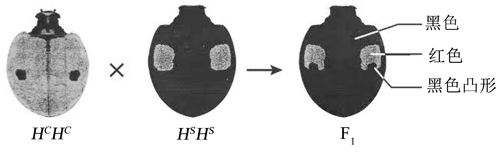

的黑色凸形是基因型为\_\_\_\_\_\_亲本的表型在F1中的表现，表明该亲本的黑色斑是\_\_\_\_\_\_性状。若F1雌雄个体相互交配，F2表型的比例为\_\_\_\_\_。

（2）近期通过基因序列研究发现了P和G两个基因位点，推测其中之一就是H基因位点。为验证该推测，研究人员在翻译水平上分别阻止了P和G位点的基因表达，实验结果如表所示。结果表明，P位点就是控制黑色素生成的H基因位点，那么阻止P位点基因表达的实验结果对应表中哪两组？\_\_\_\_\_\_，判断的依据是\_\_\_\_\_。此外，还可以在\_\_\_\_\_水平上阻止基因表达，以分析基因对表型的影响。

|       |                                                                                                                                                                                     |                                                                                                                                                                                     |                                                                                                                                                                                    |                                                                                                                                                                                     |
|:-----:|:-----------------------------------------------------------------------------------------------------------------------------------------------------------------------------------:|:-----------------------------------------------------------------------------------------------------------------------------------------------------------------------------------:|:----------------------------------------------------------------------------------------------------------------------------------------------------------------------------------:|:-----------------------------------------------------------------------------------------------------------------------------------------------------------------------------------:|
|       | 组1                                                                                                                                                                                  | 组2                                                                                                                                                                                  | 组3                                                                                                                                                                                 | 组4                                                                                                                                                                                  |
| 未阻止表达 | 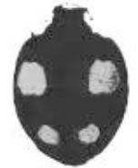 | 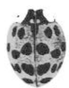    |  | 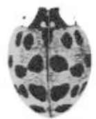 |
| 阻止表达  | 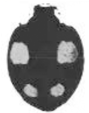 | 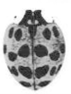 | 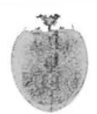 |  |

（3）为进一步研究P位点基因的功能，进行了相关实验。两个大小相等的完整鞘翅P位点基因表达产生的mRNA总量，如图甲所示，说明P位点基因的表达可以促进鞘翅黑色素的生成，判断的理由是\_\_\_\_\_；黑底红点鞘翅面积相等的不同部位P位点基因表达产生的mRNA总量，如图乙所示，图中a、b、c部位mRNA总量的差异，说明P位点基因在鞘翅不同部位的表达决定\_\_\_\_\_。

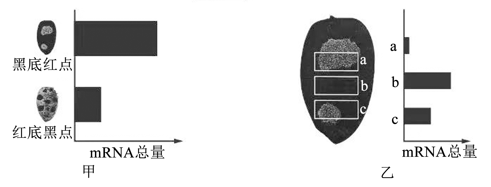

（4）进一步研究发现，鞘翅上有产生黑色素的上层细胞，也有产生红色素的下层细胞，P位点基因只在产生黑色素的上层细胞内表达，促进黑色素的生成，并抑制下层细胞生成红色素。综合上述研究结果，下列对第（1）题中F1（HCHS）表型形成原因的分析，正确的有哪几项\_\_\_\_\_

A. F1鞘翅上，HC、HS选择性表达 B. F1鞘翅红色区域，HC、HS都不表达

C. F1鞘翅黑色凸形区域，HC、HS都表达 D. F1鞘翅上，HC、HS只在黑色区域表达

【答案】（1） ①. HCHC ②. 显性 ③. 1:2:1

（2） ①. 组3、组4 ②. 阻止P位点基因表达后实验结果应该是没有黑色素生成，对应3、4组。 ③. 转录

（3） ①. 黑底红点P位点基因表达产生的mRNA总量远远大于红底黑点 ②. 黑色斑点面积大小 （4）ABD

【解析】

【分析】基因分离定律的实质是位于同源染色体的等位基因随着同源染色体的分开和分离。

【小问1详解】

由图分析，HCHC个体有黑色凸形，所以F1的黑色凸形是基因型为HCHC亲本的表型在F1中的表现，表明该亲本的黑色斑是显性性状。F1的基因型为HCHS，若F1雌雄个体相互交配，F2基因型及比例为HCHC：HCHS：HSHS=1:2:1，三种基因型对应的表型各不相同，所以表型比例为1:2:1。

【小问2详解】

为验证该推测，研究人员在翻译水平上分别阻止了P和G位点的基因表达，实验结果如表所示。结果表明，P位点就是控制黑色素生成的H基因位点，那么阻止P位点基因表达后实验结果应该是没有黑色素生成，对应3、4组。此外，还可以在转录水平上阻止基因表达，以分析基因对表型的影响。

【小问3详解】

两个大小相等的完整鞘翅P位点基因表达产生的mRNA总量，如图甲所示，说明P位点基因的表达可以促进鞘翅黑色素的生成，判断的理由是黑底红点P位点基因表达产生的mRNA总量远远大于红底黑点；黑底红点鞘翅面积相等的不同部位P位点基因表达产生的mRNA总量，如图乙所示，图中a、b、c部位mRNA总量的差异，说明P位点基因在鞘翅不同部位的表达决定黑色斑点面积大小。

【小问4详解】

P位点基因只在产生黑色素的上层细胞内表达，促进黑色素的生成，并抑制下层细胞生成红色素，所以红色区域，HC、HS都不表达，HC、HS只在黑色区域表达，根据图（1）可知HC控制黑色凸形生成，HS控制大片黑色区域生成，所以F1鞘翅上，HC、HS选择性表达，黑色凸形区域，HC表达，ABD正确。
