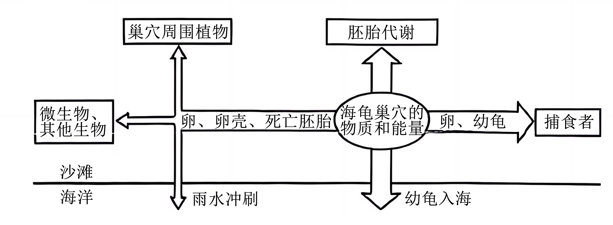
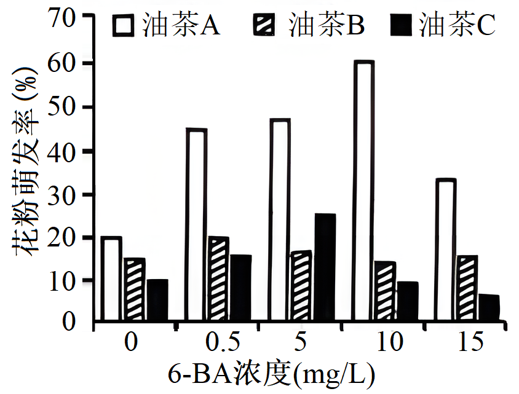
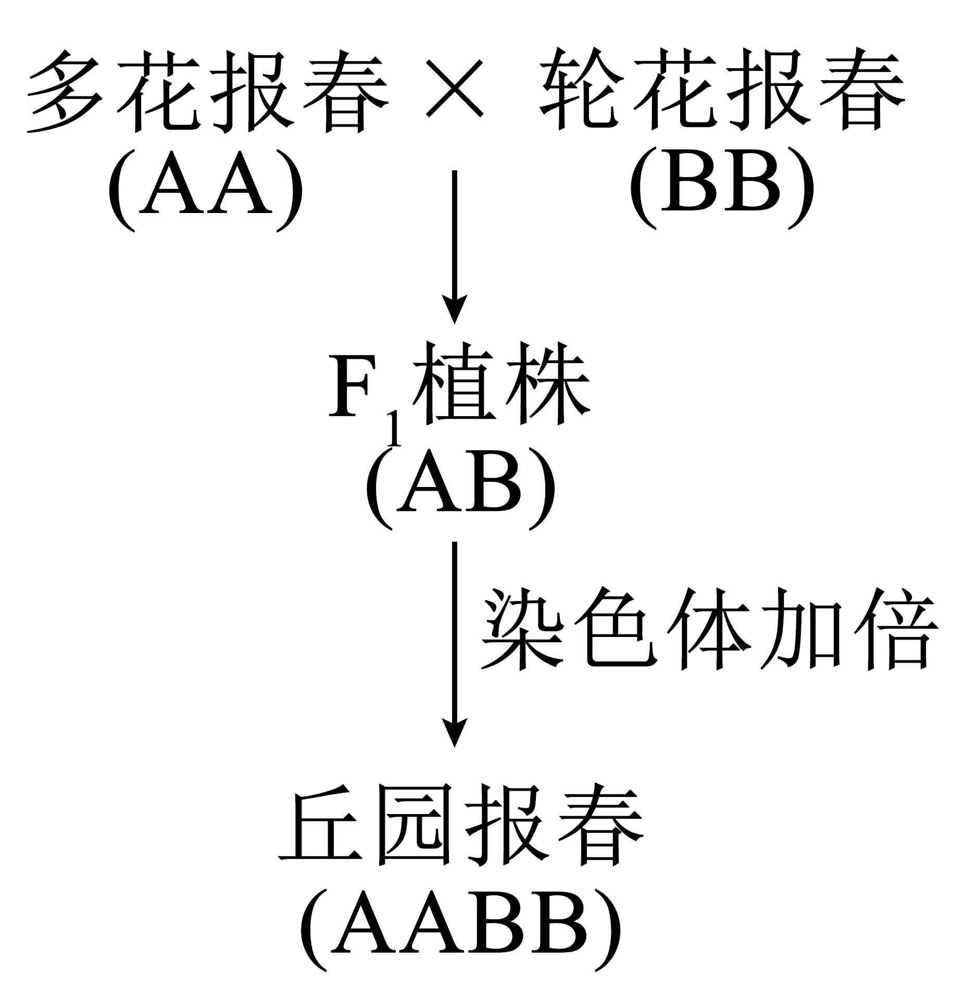
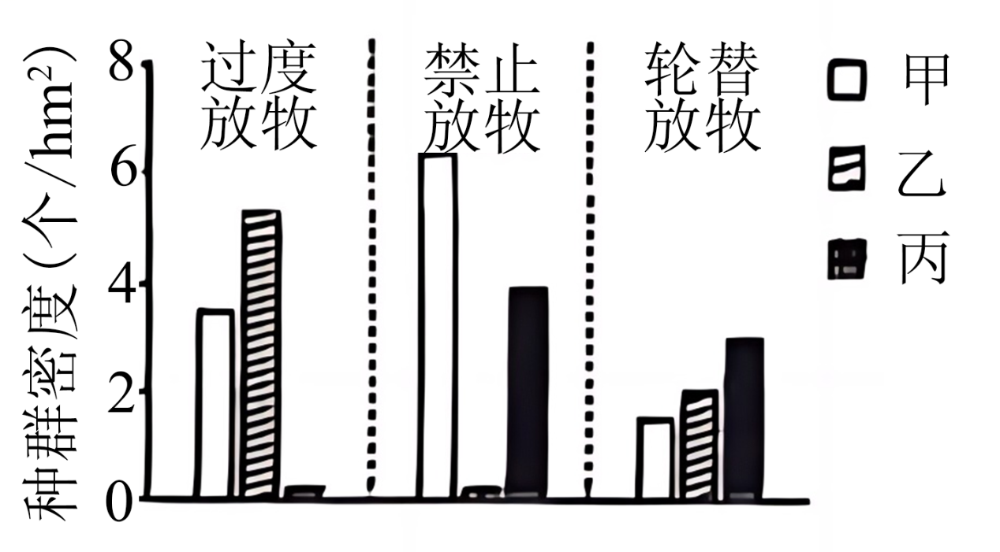
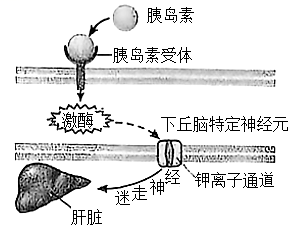
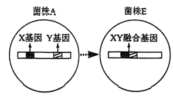

**机密★启用前**

**2024年海南省普通高中学业水平选择性考试**

**生物**

**注意事项：**

**1．答卷前，考生务必将自己的姓名、准考证号填写在答题卡上。**

**2．回答选择题时，选出每小题答案后，用铅笔把答题卡上对应题目的答案标号涂黑，如需改动，用橡皮擦干净后，再选涂其他答案标号。回答非选择题时，将答案写在答题卡上。写在本试卷上无效。**

**3．考试结束后，将本试卷和答题卡一并交回。**

**一、选择题：本题共15小题，每小题3分，共45分。在每小题给出的四个选项中，只有一项是符合题目要求的。**

1\. 海南黎锦是非物质文化遗产，其染料主要来源于植物。DNA条形码技术可利用DNA条形码序列（细胞内一段特定的DNA序列）准确鉴定出染料植物的种类。下列有关叙述正确的是（ ）

A. 不同染料植物的DNA均含有元素C、H、O、N、S

B. DNA条形码序列由核糖核苷酸连接而成

C. 染料植物的DNA条形码序列仅存在于细胞核中

D. DNA条形码技术鉴定染料植物的依据是不同物种的DNA条形码序列不同

2\. 液泡和溶酶体均含有水解酶，二者的形成与内质网和高尔基体有关。下列有关叙述错误的是（ ）

A. 液泡和溶酶体均是具有单层膜的细胞器

B. 内质网上附着的核糖体，其组成蛋白在细胞核内合成

C. 液泡和溶酶体形成过程中，内质网的膜以囊泡的形式转移到高尔基体

D. 核糖体合成水解酶经内质网和高尔基体加工后进入液泡或溶酶体

3\. 许多红树植物从含盐量高的泥滩中吸收盐分，并通过其叶表面的盐腺主动将盐排出体外避免盐害。下列有关这些红树植物的叙述，正确的是（ ）

A. 根细胞吸收盐提高了其细胞液的浓度，有利于水分的吸收

B. 根细胞通过自由扩散的方式吸收泥滩中的K+

C. 通过叶表面的盐腺将盐排出体外，不需要ATP提供能量

D. 根细胞主要以主动运输的方式吸收水分

4\. 水平衡是指人每天摄入和排出的水处于动态平衡之中，是维持机体正常生理功能的必要条件之一。下列有关叙述错误的是（ ）

A. 机体出汗可以排出部分水分，有利于散热

B. 正常机体排尿除了排出部分水分外，还可以排出尿素、葡萄糖等代谢废物

C. 人每天摄入和排出适量的水分，有利于维持机体内环境渗透压的稳定

D. 水参与并促进物质代谢，有利于保障机体正常生理功能

5\. 海龟是国家一级重点保护野生动物，其上岸产卵的行为促进了海洋与陆地间的物质循环和能量流动。在龟卵孵化过程中，巢穴的物质和能量与周围环境的关系如图。下列有关叙述错误的是（ ）

A. 龟卵中的能量来自母龟同化的能量

B. 螃蟹能取食幼龟和死亡胚胎：说明螃蟹既是消费者，又是分解者

C. 巢穴周围的绿色植物能将根插入发育中的龟卵吸收营养，说明二者存在寄生关系

D. 巢穴中的部分物质通过雨水冲刷回到海洋，可为近海的生物提供营养物质

6\. 发展生态农业有助于乡村振兴。某乡村因地制宜实施了“春夏种稻、冬闲种薯、薯糠喂牛、粪尿肥田”的生态农业模式，提高了当地的经济收入，减少了环境污染。下列有关该生态农业模式的叙述，错误的是（ ）

A. 该模式的农田生态系统能自我优化、自我调节、自我更新

B. 可保持土壤肥力，改善土壤结构

C. 可减少化肥使用和水体富营养化

D. 既遵循了自然规律，又考虑了经济和社会因素

7\. 海南龙血树具有药用和观赏价值，可利用植物组织培养技术产生愈伤组织，进而获得该种植株。动物细胞融合技术可将骨髓瘤细胞和产生特定抗体的B淋巴细胞融合形成杂交瘤细胞，进而制备单克隆抗体。下列有关这两种技术的叙述，正确的是（ ）

A. 利用的原理均是细胞的全能性

B. 使用的培养基均需添加葡萄糖和血清

C. 培养时的温度和pH均相同

D. 产生的愈伤组织细胞或杂交瘤细胞均具有增殖能力

8\. 6-苄基腺嘌呤（6-BA）是一种植物生长调节剂。某小组研究了不同浓度的6-BA对三种油茶花粉萌发的影响，结果如图。据图判断，下列有关叙述正确的是（ ）

A. 未添加6-BA时，三种油茶的花粉萌发率相同

B. 6-BA诱导三种油茶花粉萌发的最佳浓度相同

C. 不同浓度的6-BA对三种油茶花粉的萌发均起促进作用

D. 与对照组相比，最佳诱导浓度下花粉萌发率增加倍数最大的是油茶A

9\. 在D-甘露糖作用下，玉米细胞的线粒体结构受损，一类蛋白酶家族被激活，这些蛋白酶可以切割细胞骨架蛋白，并使DNA内切酶的抑制蛋白失活。下列有关叙述错误的是（ ）

A. D-甘露糖会影响玉米细胞内ATP的合成

B. D-甘露糖会改变玉米细胞内各种具膜细胞器的分布

C. D-甘露糖会导致玉米细胞内的DNA被酶切成片段

D. D-甘露糖作用后，被激活的蛋白酶家族各个成员所催化的反应底物相同

10\. 多花报春（AA）和轮花报春（BB）均是二倍体植物，其中A、B分别代表两个远缘物种的1个染色体组，每个染色体组均含9条染色体。异源四倍体植物丘园报春（AABB）形成途径如图。下列有关叙述错误的是（ ）

A. 多花报春芽尖细胞有丝分裂后期染色体数目为36条

B. F1植株通过减数分裂可产生A、B两种配子

C. 利用秋水仙素或低温处理F1幼苗，均可获得丘园报春

D 丘园报春减数分裂过程中能形成18个四分体

11\. 细胞因子作为免疫活性物质在免疫调节中发挥重要作用。I型干扰素具有抑制真核细胞蛋白质合成等多种作用，是一类临床上常用于治疗疾病的细胞因子。下列有关叙述正确的是（ ）

A. 细胞因子与神经递质、激素都属于信号分子，他们的受体结构相同

B. 细胞因子能促进T淋巴细胞和浆细胞的分裂、分化

C. I型干扰素可用于治疗肿瘤和病毒感染性疾病

D. 干扰素、抗体、溶菌酶都属于免疫活性物质，三者发挥相同的免疫作用

12\. 某小组为检测1株粗糙脉孢霉突变株的氨基酸缺陷类型，在相同培养温度和时间的条件下进行实验，结果见表。下列有关叙述错误的是（ ）

|     |                  |      |
|:--- |:---------------- |:---- |
| 组别  | 培养条件             | 实验结果 |
| ①   | 基础培养基            | 无法生长 |
| ②   | 基础培养基+甲、乙、丙3种氨基酸 | 正常生长 |
| ③   | 基础培养基+甲、乙2种氨基酸   | 无法生长 |
| ④   | 基础培养基+甲、丙2种氨基酸   | 正常生长 |
| ⑤   | 基础培养基+乙、丙2种氨基酸   | 正常生长 |

A. 组别①是②③④⑤的对照组

B 培养温度和时间属于无关变量

C. ①②结果表明，甲、乙、丙3种氨基酸中有该突变株正常生长所必需的氨基酸

D. ①~⑤结果表明，该突变株为氨基酸甲缺陷型

13\. 某种鸟的卵黄蛋白原基因的启动子部分区域存在甲基化修饰。成熟雌鸟产生的雌激素可将此甲基化去除，雄鸟因缺乏雌激素仍保持高度甲基化。下列有关叙述正确的是（ ）

A. 卵黄蛋白原基因在成熟雌鸟中可以表达，在雄鸟中表达受到抑制

B. 卵黄蛋白原基因转录出的mRNA中，含有甲基化区域序列的互补序列

C. 该种雌鸟和雄鸟交配产生的雌雄后代发育成熟后，体内均无卵黄蛋白原

D. 卵黄蛋白原基因的乙酰化和甲基化均可产生表观遗传现象

14\. 甲、乙、丙三种啮齿动物共同生活在某牧区。甲和乙偏好开阔生境，喜食植物茎叶，丙偏好有更多遮蔽的生境，喜食植物种子。不同放牧模式影响下，这三种动物种群密度的调查结果如图。下列有关叙述错误的是（ ）

A. 过度放牧加剧了甲和乙的种间竞争

B. 禁止放牧增加了遮蔽度和食物资源，有利于丙的生存

C. 轮替放牧有助于这三种动物共存

D. 三种动物中，甲对放牧模式变化的适应能力最强

15\. 黑腹果蝇（2n=8）的性别决定是XY型，但性别受胚胎性指数i的影响（i=X染色体数目/常染色体组数，i=0.5为雄性，i=1为雌性，i=1.5胚胎致死），有Y染色体的雄性个体可育，无Y染色体的雄性个体不育。常染色体隐性基因t纯合可导致雌蝇变为雄蝇，对雄蝇无影响。下列有关叙述正确的是（ ）

A. 黑腹果蝇体细胞有2个染色体组，每组有4条常染色体

B. 基因型分别为TtXO、ttXXY和ttXYY的黑腹果蝇均为不育雄蝇

C. 基因型为TtXX和ttXY的个体杂交得到F1，F1相互交配得到F2，F2中雌雄比例为5：11

D. 某雄蝇（TtXY）减数分裂II后期X染色体不分离，与正常雌蝇（TtXX）杂交，后代中不育雄蝇占比为1/4

**二、非选择题：本题共5小题，共55分。**

16\. 海南是我国芒果（也称杧果）的重要种植地，芒果的生长和果实储藏受诸多因素影响。回答下列问题：

（1）芒果的生长依赖于光合作用：光合作用必需的酶分布在叶绿体的\_\_\_\_\_和\_\_\_\_\_。

（2）生产中用植物生长调节剂乙烯利浸泡采摘后的芒果，可促进果实成熟，原因是\_\_\_\_\_。

（3）为延长芒果的储藏期，应减弱芒果的呼吸作用，其目的是\_\_\_\_\_。从环境因素考虑；除了降低温度外，减弱芒果呼吸作用的措施还有\_\_\_\_\_（答出1点即可）。

（4）芒果在冷藏期间呼吸速率会降低，有利于保鲜。但芒果对低温敏感，冷藏期间易受到冷害，导致呼吸速率持续下降，影响果实品质。为了探究冷藏前用褪黑素处理芒果是否具有减轻冷害的作用，请以呼吸速率为测定指标，简要写出实验设计思路、预期结果和结论\_\_\_\_\_（注：褪黑素可用蒸馏水配制成溶液）。

17\. 下丘脑特定神经元上的胰岛素受体与胰岛素结合后，导致该神经元的某激酶、钾离子通道相继被激活，最终通过迷走神经作用于肝脏，使肝脏中葡萄糖的生成减少，降低血糖水平。上述过程如图。回答下列问题：

（1）人的神经系统包括中枢神经系统和外周神经系统。图中的迷走神经是脑神经，属于\_\_\_\_\_神经系统。

（2）图中支配肝脏的迷走神经属于副交感神经。当血糖水平降低时，下丘脑某区域兴奋，通过交感神经促进胰岛A细胞分泌\_\_\_\_\_，升高血糖水平。这说明副交感神经和交感神经对血糖调节的作用效果是\_\_\_\_\_。

（3）从血糖来源方面分析，肝脏中葡萄糖生成减少的途径分别是\_\_\_\_\_和\_\_\_\_\_。

（4）某糖尿病模型小鼠补充足量胰岛素后，仍持续存在高血糖。据图分析，小鼠持续存在高血糖的可能原因中，除了胰岛素受体功能障碍外，还有\_\_\_\_\_（答出2点即可）。

（5）据图分析，若一只正常小鼠下丘脑特定神经元的胰岛素受体出现功能障碍，则短期内该小鼠血液中胰岛素含量会\_\_\_\_\_，原因是\_\_\_\_\_。

18\. 海南优越的自然环境适宜开展作物育种。为研究抗稻瘟病水稻的遗传规律，某团队用纯合抗稻瘟病水稻品种甲、乙、丙分别与易感稻癌病品种丁杂交得到F1，F1自交得到F2，结果见表。不考虑染色体互换、染色体变异和基因突变等情况，回答下列问题：

|     |      |                    |                    |
|:--- |:---- |:------------------ |:------------------ |
| 实验  | 杂交组合 | F1表型及比例 | F2表型及比例 |
| ①   | 甲×丁  | 全部抗稻瘟病             | 抗稻瘟病：易感稻瘟病=3：1     |
| ②   | 乙×丁  | 全部抗稻瘟病             | 抗稻瘟病：易感稻瘟病=15：1    |
| ③   | 丙×丁  | 全部抗稻瘟病             | 抗稻瘟病：易感稻瘟病=63：1    |

（1）水稻是两性花植物，人工授粉时需对亲本中的\_\_\_\_\_进行去雄处理。

（2）水稻的抗稻瘟病和易感稻瘟病是一对相对性状。实验①中，抗稻瘟病对易感稻瘟病为\_\_\_\_\_性。实验②中，这一对相对性状至少受\_\_\_\_\_对等位基因控制。

（3）实验③中，F2抗稻瘟病植株的基因型有\_\_\_\_\_种，F2抗稻瘟病植株中的杂合子所占比例为\_\_\_\_\_。

（4）培育耐盐碱的抗稻瘟病水稻对于沿海滩涂及内陆盐碱地的利用具有重要价值。该团队将耐盐碱基因随机插入品种甲基因组中，筛选获得1号、2号、3号植株，耐盐碱基因插入位点如图（注：植株只要含有1个耐盐碱基因即可表现出耐盐碱性状，不含则表现出盐碱敏感性状）。

①据图分析，2号植株产生的雄配子类型有\_\_\_\_\_种，1个雄配子携带的耐盐碱基因最多有\_\_\_\_\_个。

②该团队将1号、2号、3号植株分别自交，理论上所得子一代表型及比例分别是\_\_\_\_\_。

19\. 海南海防林包括本土自然林中的青皮林、人工种植的木麻黄林等，是海岸沿线防风固沙的重要生态屏障。回答下列问题：

（1）青皮植株高大、分枝茂盛、根系发达。青皮林被当地人称为“雨神”，表明青皮林除了防风固沙外，还具有\_\_\_\_\_\_的生态功能（答出1点即可）。

（2）石梅湾青皮林中，青皮的相对密度为0.93，其他树种为0.07，说明青皮在该群落中处于\_\_\_\_\_地位。在青皮种群数量中，幼苗占53%，幼树占40%，成树占7%，说明该种群的年龄结构为\_\_\_\_\_型。

（3）海南有多个不同的青皮种群，若将其他种群的青皮引入石梅湾青皮林，可提高石梅湾青皮种群的\_\_\_\_\_多样性。

（4）外来物种木麻黄能释放出化学物质，抑制周围其他植物生长，这是木麻黄林稳定性低的重要因素，原因是\_\_\_\_\_。

（5）为了提升海防林的稳定性，促进人工木麻黄林逐渐转变为本土自然海防林，从群落演替的角度考虑，可采取的措施是\_\_\_\_\_。

20\. 酿酒酵母是重要的发酵菌种，广泛应用于酿酒、食品加工及生物燃料生产等。研究人员对酿酒酵母菌株A进行基因工程改造以提高发酵中的乙醇产量。回答下列问题：

（1）酿酒酵母在有氧和无氧的条件下都能生存，属于\_\_\_\_\_微生物，在无氧条件下能进行\_\_\_\_\_发酵，可用于制作果酒等。

（2）传统发酵中，新鲜水果不接种酿酒酵母也能制备果酒，原因是\_\_\_\_\_。

（3）工业上常采用单一菌种发酵生产食品。菌株A存在于环境中，实验室获得该单一菌种的分离方法有\_\_\_\_\_和\_\_\_\_\_。

（4）菌株A含有1个FLO基因，其表达的FLO蛋白可提高发酵中乙醇产量，且FLO蛋白量与乙醇产量成正相关，研究人员基于菌株A构建得到菌株B、C、D（如图）。该实验中，构建菌株B的目的是\_\_\_，预期菌株A、B、C、D发酵中乙醇产量的高低为\_\_\_\_\_。

（5）菌株A中，X和Y基因的表达均可以提高发酵中乙醇产量。研究人员将X和Y基因融合在一起，构建了XY融合基因能表达的菌株E（如图），其在发酵中具有更高的乙醇产量。菌株E中无单独的X和Y基因，且其他基因未被破坏。简要写出由菌株A到菌株E的构建思路\_\_\_\_\_。

