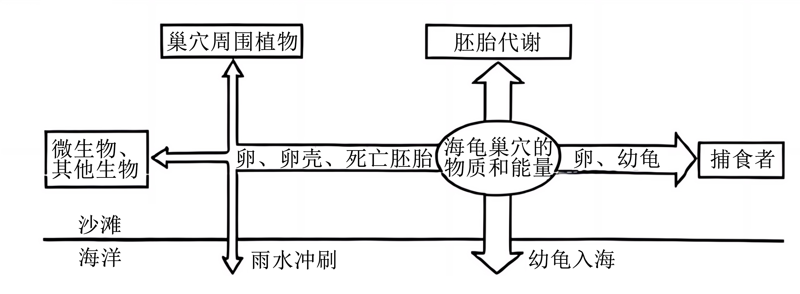
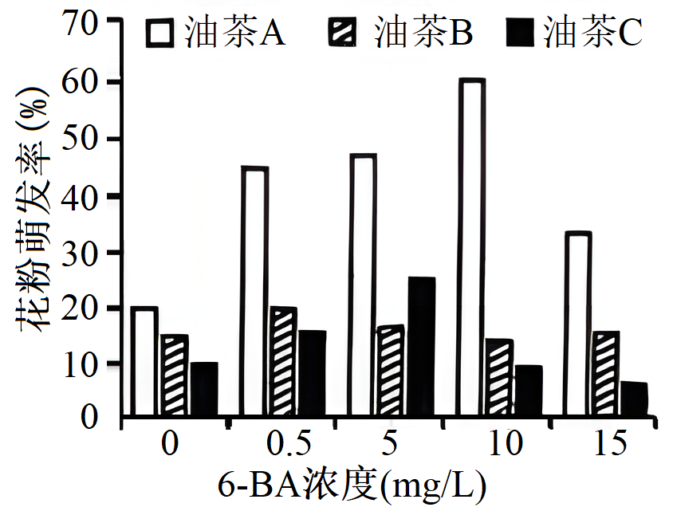
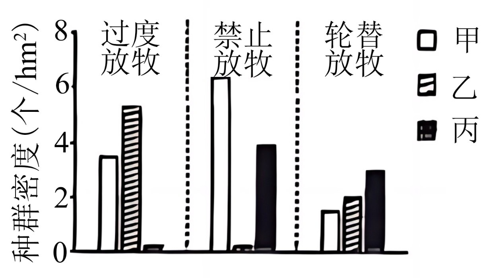
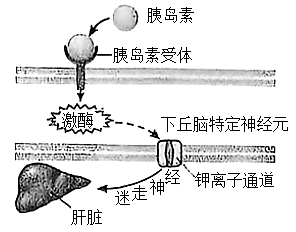
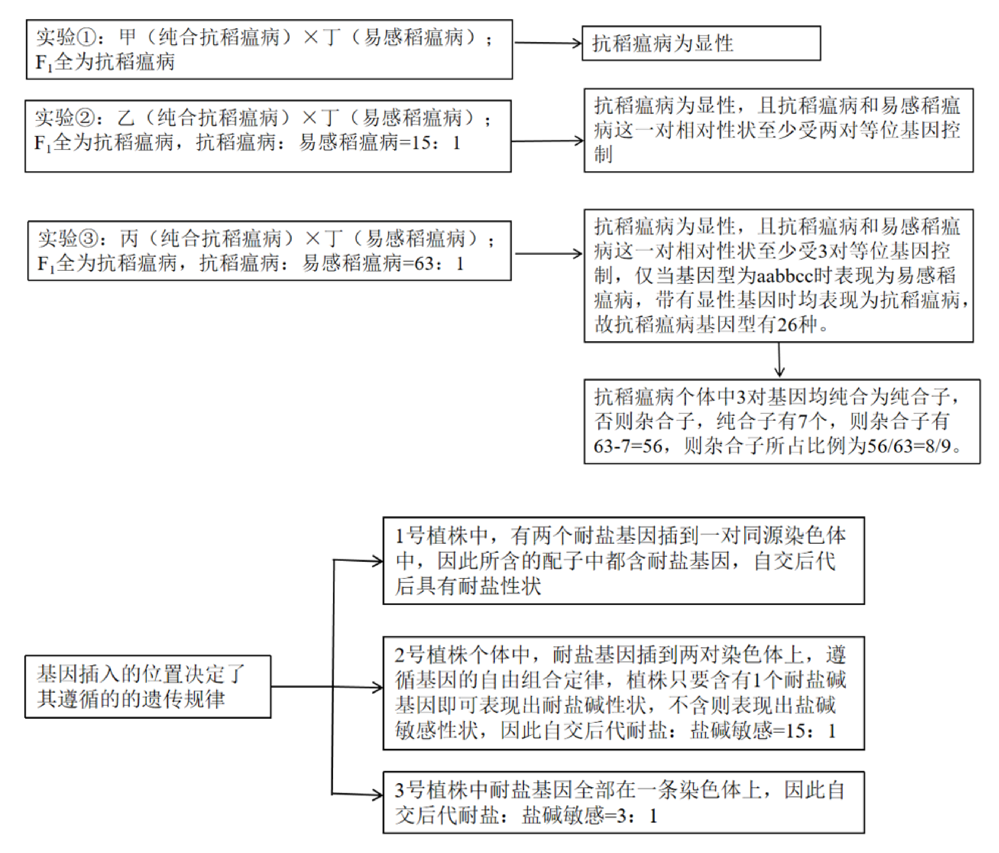
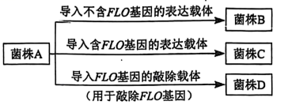
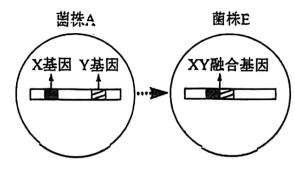

**机密★启用前**

**2024年海南省普通高中学业水平选择性考试**

**生物**

**注意事项：**

**1．答卷前，考生务必将自己的姓名、准考证号填写在答题卡上。**

**2．回答选择题时，选出每小题答案后，用铅笔把答题卡上对应题目的答案标号涂黑，如需改动，用橡皮擦干净后，再选涂其他答案标号。回答非选择题时，将答案写在答题卡上。写在本试卷上无效。**

**3．考试结束后，将本试卷和答题卡一并交回。**

**一、选择题：本题共15小题，每小题3分，共45分。在每小题给出的四个选项中，只有一项是符合题目要求的。**

1\. 海南黎锦是非物质文化遗产，其染料主要来源于植物。DNA条形码技术可利用DNA条形码序列（细胞内一段特定的DNA序列）准确鉴定出染料植物的种类。下列有关叙述正确的是（ ）

A. 不同染料植物的DNA均含有元素C、H、O、N、S

B. DNA条形码序列由核糖核苷酸连接而成

C. 染料植物的DNA条形码序列仅存在于细胞核中

D. DNA条形码技术鉴定染料植物的依据是不同物种的DNA条形码序列不同

【答案】D

【解析】

【分析】细胞中的核酸根据所含五碳糖的不同分为DNA（脱氧核糖核酸）和RNA（核糖核酸）两种，构成DNA与RNA的基本单位分别是脱氧核苷酸和核糖核苷酸，它们含有C、H、O、N、P五种元素。

【详解】A、不同染料植物的DNA均含有元素C、H、O、N、P，不含S，A错误；

B、DNA条形码序列由脱氧核糖核苷酸连接而成，B错误；

C、染料植物的DNA条形码序列主要存在于细胞核中，有少部分存在于细胞质，C错误；

D、不同DNA的区别在于碱基排列顺序不同，DNA条形码技术鉴定染料植物的依据是不同物种的DNA条形码序列不同，D正确。

故选D。

2\. 液泡和溶酶体均含有水解酶，二者的形成与内质网和高尔基体有关。下列有关叙述错误的是（ ）

A. 液泡和溶酶体均是具有单层膜的细胞器

B. 内质网上附着的核糖体，其组成蛋白在细胞核内合成

C. 液泡和溶酶体形成过程中，内质网的膜以囊泡的形式转移到高尔基体

D. 核糖体合成的水解酶经内质网和高尔基体加工后进入液泡或溶酶体

【答案】B

【解析】

【分析】液泡和溶酶体是细胞中的细胞器，具有不同的功能。液泡主要调节细胞内的环境，溶酶体则与细胞内的消化和分解有关。内质网是蛋白质合成和加工的场所，高尔基体对来自内质网的蛋白质进行进一步加工和分类。

【详解】A、液泡和溶酶体都由单层膜包裹，因此液泡和溶酶体均是具有单层膜的细胞器，A正确；

B、内质网上附着的核糖体的组成蛋白在游离核糖体合成的，B错误；

C、内质网的膜可以以囊泡的形式转移到高尔基体，这是细胞内物质运输和膜转化的常见方式，C正确；

D、液泡有类似溶酶体的功能，故二者中均有水解酶，核糖体合成的水解酶经内质网和高尔基体加工后进入溶酶体或液泡，D正确。

故选B。

3\. 许多红树植物从含盐量高的泥滩中吸收盐分，并通过其叶表面的盐腺主动将盐排出体外避免盐害。下列有关这些红树植物的叙述，正确的是（ ）

A. 根细胞吸收盐提高了其细胞液的浓度，有利于水分的吸收

B. 根细胞通过自由扩散的方式吸收泥滩中的K+

C. 通过叶表面的盐腺将盐排出体外，不需要ATP提供能量

D. 根细胞主要以主动运输的方式吸收水分

【答案】A

【解析】

【分析】植物吸收土壤中的无机盐离子往往是逆浓度运输，属于主动运输，消耗能量，使细胞液的浓度升高，增强了植物细胞的吸水能力，从而适应盐碱环境。

【详解】A、根细胞吸收盐提高了其细胞液的浓度，提高细胞渗透压，有利于水分的吸收，A正确；

B、根细胞通过主动运输的方式吸收泥滩中的K+，B错误；

C、根据题干，通过其叶表面的盐腺主动将盐排出体外避免盐害，所以运输方式属于主动运输，需要ATP提供能量，C错误；

D、根细胞吸收水分的原理是渗透作用，运输方式是被动运输，D错误。

故选A。

4\. 水平衡是指人每天摄入和排出的水处于动态平衡之中，是维持机体正常生理功能的必要条件之一。下列有关叙述错误的是（ ）

A. 机体出汗可以排出部分水分，有利于散热

B. 正常机体排尿除了排出部分水分外，还可以排出尿素、葡萄糖等代谢废物

C. 人每天摄入和排出适量的水分，有利于维持机体内环境渗透压的稳定

D. 水参与并促进物质代谢，有利于保障机体正常的生理功能

【答案】B

【解析】

【分析】水平衡对于人体至关重要。人体通过出汗、排尿等方式排出水分，同时也排出一些代谢废物。内环境的渗透压稳定需要水的摄入和排出保持平衡，水还在物质代谢中发挥重要作用。

【详解】A、机体出汗时，水分蒸发会带走热量，从而有利于散热，A正确；

B、正常机体排尿可以排出部分水分、尿素等代谢废物，但葡萄糖一般不会出现在尿液中，除非血糖过高超过肾糖阈，B错误；

C、当摄入和排出的水量合适时，身体里细胞周围液体的浓度就会稳定，这就是内环境渗透压的稳定。如果摄入或排出的水过多或过少，就会打破这个平衡，可能会影响身体的正常功能，C正确；

D、水参与许多化学反应，促进物质代谢，对保障机体正常的生理功能有重要意义，D正确。

故选B。

5\. 海龟是国家一级重点保护野生动物，其上岸产卵的行为促进了海洋与陆地间的物质循环和能量流动。在龟卵孵化过程中，巢穴的物质和能量与周围环境的关系如图。下列有关叙述错误的是（ ）

A. 龟卵中的能量来自母龟同化的能量

B. 螃蟹能取食幼龟和死亡胚胎：说明螃蟹既是消费者，又是分解者

C. 巢穴周围绿色植物能将根插入发育中的龟卵吸收营养，说明二者存在寄生关系

D. 巢穴中的部分物质通过雨水冲刷回到海洋，可为近海的生物提供营养物质

【答案】C

【解析】

【分析】输入第一营养级的能量，一部分在生产者的呼吸作用中以热能的形式散失了;另一部分用于生产者的生长、发育和繁殖等生命活动，储存在植物体的有机物中。构成植物体的有机物中的能量，一部分随着残枝败叶等被分解者分解而释放出来;另一部分则被初级消费者摄入体内，这样，能量就流人了第二营养级。流入第二营养级的能量，一部分在初级消费者的呼吸作用中以热能的形式散失；另一部分用于初级消费者的生长、发育和繁殖等生命活动，其中一些以遗体残骸的形式被分解者利用。如果初级消费者被次级消费者捕食，能量就流入了第三营养级。

【详解】A、母龟同化的能量一部分在呼吸作用中以热能的形式散失；另一部分用于自身的生长、发育和繁殖等生命活动，其中一些以遗体残骸的形式被分解者利用，因此龟卵中的能量来自母龟同化的能量，A正确；

B、螃蟹取食幼龟说明螃蟹是消费者，螃蟹取食死亡龟的胚胎，说明螃蟹是分解者，B正确；

C、植物通常从土壤中吸收水分和矿物质，不会吸收龟卵中的物质，因此二者不存在寄生关系，C错误；

D、巢穴中的部分物质（如卵、卵壳、死亡的胚胎）通过雨水冲刷回到海洋，可为近海的生物提供营养物质，D正确。

故选C。

6\. 发展生态农业有助于乡村振兴。某乡村因地制宜实施了“春夏种稻、冬闲种薯、薯糠喂牛、粪尿肥田”的生态农业模式，提高了当地的经济收入，减少了环境污染。下列有关该生态农业模式的叙述，错误的是（ ）

A. 该模式的农田生态系统能自我优化、自我调节、自我更新

B. 可保持土壤肥力，改善土壤结构

C. 可减少化肥使用和水体富营养化

D. 既遵循了自然规律，又考虑了经济和社会因素

【答案】A

【解析】

【分析】生态工程所遵循的原理：生态工程以生态系统的自组织、自我调节功能为基础，遵循着整体、协调、循环、自生等生态学基本原理。

【详解】A、该农田生态系统不能自我优化、自我调节、自我更新，整个生态系统都依赖人进行协调，A错误；

B、使用粪尿肥田，培育了土壤微生物，微生物分解粪便可提供无机盐给作物，可保持土壤肥力，改善土壤结构，B正确；

C、粪尿肥田可减少化肥使用，从而不容易导致过多的氮、磷排入水体，导致水体富营养化，C正确；

D、既遵循了自然规律，又考虑了经济和社会因素，D正确。

故选A。

7\. 海南龙血树具有药用和观赏价值，可利用植物组织培养技术产生愈伤组织，进而获得该种植株。动物细胞融合技术可将骨髓瘤细胞和产生特定抗体的B淋巴细胞融合形成杂交瘤细胞，进而制备单克隆抗体。下列有关这两种技术的叙述，正确的是（ ）

A. 利用的原理均是细胞的全能性

B. 使用的培养基均需添加葡萄糖和血清

C. 培养时的温度和pH均相同

D. 产生的愈伤组织细胞或杂交瘤细胞均具有增殖能力

【答案】D

【解析】

【分析】(1)植物组织培养利用了植物细胞具有全能性的原理，其流程是：外植体（离体的植物器官、组织或细胞）经脱分化形成愈伤组织，经再分化形成胚状体，长出芽和根，进而形成完整植株。(2)制备单克隆抗体的流程为：①向小鼠体内注射特定的抗原，使其发生免疫，然后从小鼠脾内获得能产生特定抗体的B淋巴细胞。②将小鼠的骨髓瘤细胞与B淋巴细胞融合，用特定的选择培养基筛选出杂交瘤细胞。③克隆化培养和抗体检测，从而筛选出能产生特定抗体的杂交瘤细胞。④将最终筛选出的杂交瘤细胞在体外培养或注射到小鼠腹腔内增殖，从细胞培养液或小鼠的腹水中提取单克隆抗体。

【详解】A、利用植物组织培养技术获得海南龙血树，利用的原理是细胞的全能性；制备单克隆抗体使用了动物细胞培养技术和细胞融合技术，这两种技术利用的原理分别是细胞的增殖和细胞膜的流动性，A错误；

B、利用植物组织培养技术获得海南龙血树，使用培养基中添加的是蔗糖，不需添加葡萄糖和血清，B错误；

C、由于植物细胞和动物细胞生长所需的适宜温度和pH存在差异，所以培养时的温度和pH均不相同， C错误；

D、愈伤组织是外植体（离体的植物器官、组织或细胞）经脱分化形成的，杂交瘤细胞是由骨髓瘤细胞和产生特定抗体的B淋巴细胞融合后形成的，因此产生的愈伤组织细胞或杂交瘤细胞均具有增殖能力，D正确。

故选D。

8\. 6-苄基腺嘌呤（6-BA）是一种植物生长调节剂。某小组研究了不同浓度的6-BA对三种油茶花粉萌发的影响，结果如图。据图判断，下列有关叙述正确的是（ ）

A. 未添加6-BA时，三种油茶的花粉萌发率相同

B. 6-BA诱导三种油茶花粉萌发的最佳浓度相同

C. 不同浓度的6-BA对三种油茶花粉的萌发均起促进作用

D. 与对照组相比，最佳诱导浓度下花粉萌发率增加倍数最大的是油茶A

【答案】D

【解析】

【分析】分析题意，本实验目的是研究不同浓度的6-BA对三种油茶花粉萌发的影响，实验的自变量是油茶类型和6-BA浓度，因变量是花粉萌发率，据此分析作答。

【详解】A、据图可知，未添加6-BA时（浓度为0），三种油茶的花粉萌发率不同，其中油茶A萌发率最高，A错误；

B、6-BA诱导三种油茶花粉萌发的最佳浓度不同：实验范围内，诱导油茶A的最适浓度是10mg/L，诱导油茶B的最适浓度是0.5mg/L，诱导油茶C的最适浓度是5mg/L，B错误；

C、据图可知，浓度为15mg/L的6-BA对油茶C花粉的萌发均起抑制作用，C错误；

D、与对照组相比，最佳诱导浓度下花粉萌发率增加倍数最大的是油茶A（对照组是20%，最佳浓度下是60%），D正确。

故选D。

9\. 在D-甘露糖作用下，玉米细胞的线粒体结构受损，一类蛋白酶家族被激活，这些蛋白酶可以切割细胞骨架蛋白，并使DNA内切酶的抑制蛋白失活。下列有关叙述错误的是（ ）

A. D-甘露糖会影响玉米细胞内ATP的合成

B. D-甘露糖会改变玉米细胞内各种具膜细胞器的分布

C. D-甘露糖会导致玉米细胞内的DNA被酶切成片段

D. D-甘露糖作用后，被激活的蛋白酶家族各个成员所催化的反应底物相同

【答案】D

【解析】

【分析】1、线粒体是细胞进行有氧呼吸的主要场所，是细胞的“动力车间”，细胞生命活动所需要的能量，大约95%来自线粒体。线粒体内膜向内折叠形成嵴，嵴的存在大大增加了内膜的表面积，线粒体内膜和基质中含有许多与有氧呼吸有关的酶。

2、细胞中有维持细胞形态、保持细胞内部结构有序性的细胞骨架。细胞骨架是由蛋白质纤维组成的网架结构，与细胞运动、分裂、分化以及物质运输、能量转换、信息传递等生命活动密切相关。

【详解】A、由题意可知，在D-甘露糖作用下，玉米细胞的线粒体结构受损，线粒体是细胞进行有氧呼吸的主要场所，是玉米细胞内合成ATP的场所之一，所以D-甘露糖会影响玉米细胞内ATP的合成，A正确；

B、细胞骨架能维持细胞形态、保持细胞内部结构有序性，在D-甘露糖作用下，一类蛋白酶家族被激活，这些蛋白酶可以切割细胞骨架蛋白，所以D-甘露糖会改变玉米细胞内各种具膜细胞器的分布，B正确；

C、由题意可知，在D-甘露糖作用下，一类蛋白酶家族被激活，这些蛋白酶能使DNA内切酶的抑制蛋白失活，即DNA内切酶的活性不再被抑制，DNA内切酶会导致玉米细胞内的DNA被酶切成片段，C正确；

D、酶具有专一性，所以D-甘露糖作用后，被激活的蛋白酶家族各个成员所催化的反应底物不一定相同，D错误。

故选D。

10\. 多花报春（AA）和轮花报春（BB）均是二倍体植物，其中A、B分别代表两个远缘物种的1个染色体组，每个染色体组均含9条染色体。异源四倍体植物丘园报春（AABB）形成途径如图。下列有关叙述错误的是（ ）

A. 多花报春芽尖细胞有丝分裂后期染色体数目为36条

B. F1植株通过减数分裂可产生A、B两种配子

C. 利用秋水仙素或低温处理F1幼苗，均可获得丘园报春

D. 丘园报春减数分裂过程中能形成18个四分体

【答案】B

【解析】

【分析】由题意可知，多花报春（AA）和轮花报春（BB）均是二倍体植物，其中A、B分别代表两个远缘物种的1个染色体组，每个染色体组均含9条染色体，则F1植株含有18条染色体，丘园报春含有36条染色体。

【详解】A、多花报春AA体细胞含有2×9=18条染色体，其芽尖细胞有丝分裂后期染色体数目为18×2=36条，A正确；

B、A、B分别代表两个远缘物种的1个染色体组，F1植株中含有9对异源染色体，高度不育，不能产生正常的配子，B错误；

C、利用秋水仙素或低温处理F1幼苗，均可使其染色体加倍，获得丘园报春，C正确；

D、丘园报春为异源四倍体，含有36条染色体，减数分裂过程中能形成18个四分体，D正确。

故选B。

11\. 细胞因子作为免疫活性物质在免疫调节中发挥重要作用。I型干扰素具有抑制真核细胞蛋白质合成等多种作用，是一类临床上常用于治疗疾病的细胞因子。下列有关叙述正确的是（ ）

A. 细胞因子与神经递质、激素都属于信号分子，他们的受体结构相同

B. 细胞因子能促进T淋巴细胞和浆细胞的分裂、分化

C. I型干扰素可用于治疗肿瘤和病毒感染性疾病

D. 干扰素、抗体、溶菌酶都属于免疫活性物质，三者发挥相同的免疫作用

【答案】C

【解析】

【分析】免疫系统的组成包括：（1）免疫器官：淋巴结、胸腺、脾、骨髓、扁桃体等；（2）免疫细胞：树突状细胞、巨噬细胞、T细胞、B细胞，起源于造血干细胞，T细胞在胸腺中发育成熟，B细胞则在骨髓中发育成熟；（3）免疫活性物质：抗体、细胞因子、溶菌酶。

【详解】A、信号分子与受体的结合具有特异性，因此受体结构不同，A错误；

B、细胞因子能促进T淋巴细胞和B淋巴细胞的分裂、分化，B错误；

C、I型干扰素具有抑制真核细胞蛋白质合成等多种作用，可用于治疗肿瘤和病毒感染性疾病，C正确；

D、抗体与抗原发生特异性结合；溶菌酶是一种酶，具有催化作用，能水解细菌细胞壁，同时又作为一种免疫活性物质，具有免疫作用；干扰素（如：I型干扰素）具有抑制真核细胞蛋白质合成等多种作用，三者发挥不相同的免疫作用，D错误。

故选C。

12\. 某小组为检测1株粗糙脉孢霉突变株的氨基酸缺陷类型，在相同培养温度和时间的条件下进行实验，结果见表。下列有关叙述错误的是（ ）

|     |                  |      |
|:--- |:---------------- |:---- |
| 组别  | 培养条件             | 实验结果 |
| ①   | 基础培养基            | 无法生长 |
| ②   | 基础培养基+甲、乙、丙3种氨基酸 | 正常生长 |
| ③   | 基础培养基+甲、乙2种氨基酸   | 无法生长 |
| ④   | 基础培养基+甲、丙2种氨基酸   | 正常生长 |
| ⑤   | 基础培养基+乙、丙2种氨基酸   | 正常生长 |

A. 组别①是②③④⑤的对照组

B. 培养温度和时间属于无关变量

C. ①②结果表明，甲、乙、丙3种氨基酸中有该突变株正常生长所必需的氨基酸

D. ①~⑤结果表明，该突变株为氨基酸甲缺陷型

【答案】D

【解析】

【分析】实验的自变量为培养条件（基础培养基中是否添加氨基酸及添加氨基酸的种类），因变量为粗糙脉孢霉突变株的生长状况，其他的培养条件为无关变量，应该保持相同且适宜。

【详解】A、由表可知：除了组别①之外，其他组别的基础培养基中都添加了氨基酸，因此组别①是②③④⑤的对照组，A正确；

B、由题意表中信息可知：实验的自变量为培养条件，各组别的培养温度和时间均相同，说明培养温度和时间均属于无关变量，B正确；

C、由①②结果可知：粗糙脉孢霉突变株在基础培养基中无法生长，但在添加了甲、乙、丙3种氨基酸的基础培养基中能正常生长，这表明甲、乙、丙3种氨基酸中有该突变株正常生长所必需的氨基酸，C正确；

D、与组别①相比，在基础培养基中，若添加的氨基酸中含有丙种氨基酸，则粗糙脉孢霉突变株都能正常生长，但在只添加甲、乙2种氨基酸的基础培养基中无法生长，说明该突变株为氨基酸丙缺陷型，D错误。

故选D。

13\. 某种鸟的卵黄蛋白原基因的启动子部分区域存在甲基化修饰。成熟雌鸟产生的雌激素可将此甲基化去除，雄鸟因缺乏雌激素仍保持高度甲基化。下列有关叙述正确的是（ ）

A. 卵黄蛋白原基因在成熟雌鸟中可以表达，在雄鸟中表达受到抑制

B. 卵黄蛋白原基因转录出的mRNA中，含有甲基化区域序列的互补序列

C. 该种雌鸟和雄鸟交配产生的雌雄后代发育成熟后，体内均无卵黄蛋白原

D. 卵黄蛋白原基因的乙酰化和甲基化均可产生表观遗传现象

【答案】A

【解析】

【分析】表观遗传是指DNA序列不发生变化，但基因的表达却发生了可遗传的改变，即基因型未发生变化而表现型却发生了改变，如DNA的甲基化，甲基化的基因不能与RNA聚合酶结合，故无法进行转录产生mRNA，也就无法进行翻译，最终无法合成相应蛋白，从而抑制了基因的表达。

【详解】A、启动子是RNA聚合酶识别与结合的位点 ，用于驱动基因的转录，分析题意可知，某种鸟的卵黄蛋白原基因的启动子部分区域存在甲基化修饰，成熟雌鸟产生的雌激素可将此甲基化去除，雄鸟因缺乏雌激素仍保持高度甲基化，卵黄蛋白原基因在成熟雌鸟中可以表达，在雄鸟中表达受到抑制，A正确；

B、启动子是RNA聚合酶识别与结合的位点 ，用于驱动基因的转录，甲基化的DNA无法转录，不能形成mRNA，B错误；

C、该种雌鸟和雄鸟交配产生的雌雄后代发育成熟后，卵黄蛋白原基因在成熟雌鸟中可以表达，成熟雌鸟中有卵黄蛋白原，C错误；

D、除了DNA的甲基化，组蛋白的甲基化和乙酰化（而非基因乙酰化）修饰也可产生表观遗传现象，D错误。

故选A。

14\. 甲、乙、丙三种啮齿动物共同生活在某牧区。甲和乙偏好开阔生境，喜食植物茎叶，丙偏好有更多遮蔽的生境，喜食植物种子。不同放牧模式影响下，这三种动物种群密度的调查结果如图。下列有关叙述错误的是（ ）

A. 过度放牧加剧了甲和乙的种间竞争

B. 禁止放牧增加了遮蔽度和食物资源，有利于丙的生存

C. 轮替放牧有助于这三种动物共存

D. 三种动物中，甲对放牧模式变化适应能力最强

【答案】A

【解析】

【分析】影响种群数量变化的因素分两类，一类是密度制约因素，即影响程度与种群密度有密切关系的因素，如食物、流行性传染病等；另一类是非密度制约因素，即影响程度与种群密度无关的因素，气候、季节、降水等的变化，影响程度与种群密度没有关系，属于非密度制约因素。

【详解】A、过度放牧下，植物数量减少，生境开阔，便于甲和乙生存，甲和乙种间竞争减弱，种群密度增加，A错误；

B、由图可知，禁止放牧时丙的种群密度较高，丙偏好有更多遮蔽的生境，喜食植物种子，因此可推测禁止放牧增加了遮蔽度和食物资源，有利于丙的生存，B正确；

C、相比于禁止放牧和过度放牧，轮替放牧条件下三种动物能共存，即轮替放牧有助于这三种动物共存，C正确；

D、三种放牧模式下，乙和丙的种群密度变化比甲剧烈，因此甲对放牧模式变化的适应能力最强，D正确。

故选A。

15\. 黑腹果蝇（2n=8）的性别决定是XY型，但性别受胚胎性指数i的影响（i=X染色体数目/常染色体组数，i=0.5为雄性，i=1为雌性，i=1.5胚胎致死），有Y染色体的雄性个体可育，无Y染色体的雄性个体不育。常染色体隐性基因t纯合可导致雌蝇变为雄蝇，对雄蝇无影响。下列有关叙述正确的是（ ）

A. 黑腹果蝇体细胞有2个染色体组，每组有4条常染色体

B. 基因型分别为TtXO、ttXXY和ttXYY的黑腹果蝇均为不育雄蝇

C. 基因型为TtXX和ttXY的个体杂交得到F1，F1相互交配得到F2，F2中雌雄比例为5：11

D. 某雄蝇（TtXY）减数分裂II后期X染色体不分离，与正常雌蝇（TtXX）杂交，后代中不育雄蝇占比为1/4

【答案】C

【解析】

【分析】伴性遗传是指在遗传过程中的子代部分性状由性染色体上的基因控制，这种由性染色体上的基因所控制性状的遗传上总是和性别相关，这种与性别相关联的性别遗传方式就称为伴性遗传。

【详解】A、黑腹果蝇（2n=8）的性别决定是XY型，黑腹果蝇体细胞有2个染色体组，每组有3条常染色体和1条性染色体，A错误；

B、性别受胚胎性指数i的影响（i=X染色体数目/常染色体组数，i=0.5为雄性，无Y染色体的雄性个体不育，因此TtXO为不育雄蝇；i=1为雌性，常染色体隐性基因t纯合可导致雌蝇变为雄蝇，有Y染色体的雄性个体可育，无Y染色体的雄性个体不育，因此ttXXY为可育雄蝇；i=0.5为雄性，有Y染色体的雄性个体可育，因此ttXYY为可育雄蝇，B错误；

C、基因型为TtXX的个体产生配子的基因型为TX、tX，ttXY的个体的个体产生配子的基因型为tY、tX，二者杂交，F1的基因为TtXY（可育雄蝇）、ttXY（可育雄蝇）、TtXX（可育雌蝇）、ttXX（不育雄蝇），TtXY、ttXY产生配子的种类及比例为TY：tX：TX：tY=1：3：1：3，TtXX产生配子的种类及比例为TX：tX=1：1，F2的基因型及比例为TTXY（雄）：TtXX（雌）：TTXX（雌）：TtXY（雄）：TtXY（雄）：ttXX（雄）：TtXX（雌）：ttXY（雄）=1：3：1：3：1：3：1：3，由此可知，F2中雌雄比例为5：11，C正确；

D、某雄蝇（TtXY）减数分裂II后期X染色体不分离，其产生配子的类型及比例为TY：tXX：t=2：1：1或tY：TXX：T=2：1：1，正常雌蝇TtXX 产生配子的种类及比例为TX：tX=1：1，二者杂交，若为第一种情况，其后代基因型及比例为TTXY：TtXXX（胚胎致死）：TtX（不育雄蝇）：TtXY：ttXXX（胚胎致死）：ttX（不育雄蝇）=2：1：1：2：1：1，后代中不育雄蝇占比为1/3；若为第一种情况，其后代基因型及比例为TtXY：TTXXX（胚胎致死）：TTX（不育雄蝇）：ttXY：TtXXX（胚胎致死）：TtX（不育雄蝇）=2：1：1：2：1：1，后代中不育雄蝇占比为1/3，D错误。

故选C。

**二、非选择题：本题共5小题，共55分。**

16\. 海南是我国芒果（也称杧果）的重要种植地，芒果的生长和果实储藏受诸多因素影响。回答下列问题：

（1）芒果的生长依赖于光合作用：光合作用必需的酶分布在叶绿体的\_\_\_\_\_和\_\_\_\_\_。

（2）生产中用植物生长调节剂乙烯利浸泡采摘后的芒果，可促进果实成熟，原因是\_\_\_\_\_。

（3）为延长芒果的储藏期，应减弱芒果的呼吸作用，其目的是\_\_\_\_\_。从环境因素考虑；除了降低温度外，减弱芒果呼吸作用的措施还有\_\_\_\_\_（答出1点即可）。

（4）芒果在冷藏期间呼吸速率会降低，有利于保鲜。但芒果对低温敏感，冷藏期间易受到冷害，导致呼吸速率持续下降，影响果实品质。为了探究冷藏前用褪黑素处理芒果是否具有减轻冷害的作用，请以呼吸速率为测定指标，简要写出实验设计思路、预期结果和结论\_\_\_\_\_（注：褪黑素可用蒸馏水配制成溶液）。

【答案】（1） ①. 类囊体薄膜 ②. 基质

（2）乙烯利能释放出乙烯促进果实的成熟

（3） ①. 减少有机物的消耗 ②. 降低氧浓度

（4）实验设计思路为：将采摘后的生长状况相同的芒果均分为两组，标记为甲组和乙组，甲组用褪黑素进行处理,乙组不做处理,两组在相同条件下进行冷藏，实验开始及之后每隔一段时间测定甲、乙两组水果的呼吸速率

预期结果和结论：若甲组呼吸速率高于乙组，说明用褪黑素处理芒果具有减轻冷害的作用；若甲组呼吸速率与乙组相差不多，说明用褪黑素处理芒果不具有减轻冷害的作用；若甲组呼吸速率低于乙组，说明用褪黑素处理芒果加重了冷害的作用

【解析】

【分析】1、乙烯主要作用是促进果实成熟，此外，还有促进老叶等器官脱落的作用。

2、细胞呼吸的原理在生活和生产中得到了广泛的应用。生活中，馒头、面包、泡菜等许多传统食品的制作，现代发酵工业生产青霉素、味精等产品，都建立在对微生物细胞呼吸原理利用的基础上。在农业生产上，人们采取的很多措施也与调节呼吸作用的强度有关。例如，中耕松土适时排水，就是通过改善氧气供应来促进作物根系的呼吸作用，以利于作物的生长；在储藏果实、蔬菜时，往往需要采取降低温度、降低氧气含量等措施减弱果蔬的呼吸作用，以减少有机物的消耗。

【小问1详解】

光合作用包括光反应和暗反应，光反应的场所是叶绿体的类囊体薄膜上，暗反应的场所发生在叶绿体基质，两个过程都需要酶的催化作用，因此光合作用必需的酶分布在叶绿体的类囊体薄膜和叶绿体基质中

【小问2详解】

乙烯利与水或含羟基化合物反应放出乙烯，乙烯能够促进果实成熟。

【小问3详解】

呼吸作用会分解有机物，为延长芒果的储藏期，应减弱芒果的呼吸作用，减少有机物的消耗。影响细胞呼吸的环境因素包括温度、水、氧浓度和二氧化碳浓度等，除了降低温度减弱呼吸作用外，减弱芒果呼吸作用的措施可以通过降低氧浓度。

【小问4详解】

根据题意，该实验的目的是探究冷藏前用褪黑素处理芒果是否具有减轻冷害的作用，实验的自变量是冷藏前是否用褪黑素处理，因变量为呼吸速率。实验设计遵循单一变量和对照性原则，那么实验设计思路为：将采摘后的生长状况相同的芒果均分为两组，标记为甲组和乙组，甲组用褪黑素进行处理,乙组不做处理,两组在相同条件下进行冷藏，实验开始及之后每隔一段时间测定甲、乙两组水果的呼吸速率。

预期实验结果及结论：若甲组呼吸速率高于乙组，说明用褪黑素处理芒果具有减轻冷害的作用；若甲组呼吸速率与乙组相差不多，说明用褪黑素处理芒果不具有减轻冷害的作用；若甲组呼吸速率低于乙组，说明用褪黑素处理芒果加重了冷害的作用。

17\. 下丘脑特定神经元上的胰岛素受体与胰岛素结合后，导致该神经元的某激酶、钾离子通道相继被激活，最终通过迷走神经作用于肝脏，使肝脏中葡萄糖的生成减少，降低血糖水平。上述过程如图。回答下列问题：

（1）人的神经系统包括中枢神经系统和外周神经系统。图中的迷走神经是脑神经，属于\_\_\_\_\_神经系统。

（2）图中支配肝脏的迷走神经属于副交感神经。当血糖水平降低时，下丘脑某区域兴奋，通过交感神经促进胰岛A细胞分泌\_\_\_\_\_，升高血糖水平。这说明副交感神经和交感神经对血糖调节的作用效果是\_\_\_\_\_。

（3）从血糖来源方面分析，肝脏中葡萄糖生成减少的途径分别是\_\_\_\_\_和\_\_\_\_\_。

（4）某糖尿病模型小鼠补充足量胰岛素后，仍持续存在高血糖。据图分析，小鼠持续存在高血糖的可能原因中，除了胰岛素受体功能障碍外，还有\_\_\_\_\_（答出2点即可）。

（5）据图分析，若一只正常小鼠下丘脑特定神经元的胰岛素受体出现功能障碍，则短期内该小鼠血液中胰岛素含量会\_\_\_\_\_，原因是\_\_\_\_\_。

【答案】（1）外周 （2） ①. 胰高血糖素 ②. 相反

（3） ①. 肝糖原分解减少 ②. 脂肪等非糖物质转化减少

（4）迷走神经受损、钾离子通道异常等

（5） ①. 升高 ②.

胰岛素受体功能受损后，肝脏中的葡萄糖持续生成，导致血糖水平升高，血糖升高会刺激胰岛 B 细胞分泌更多胰岛素

【解析】

【分析】自主神经系统：（1）概念：支配内脏、血管和腺体的传出神经，它们的活动不受意识支配，称为自主神经系统。（2）功能：当人体处于兴奋状态时，交感神经活动占据优势，心跳加快，支气管扩张，但胃肠的蠕动和消化腺的分泌活动减弱；当人处于安静状态时，副交感神经活动占据优势，此时，心跳减慢，但胃肠的蠕动和消化液的分泌会加强，有利于食物的消化和营养物质的吸收。

【小问1详解】

神经系统包括中枢神经系统和外周神经系统，中枢神经系统由脑和脊髓组成，脑分为大脑、小脑和脑干；外周神经系统包括脊神经、脑神经，图中的迷走神经是脑神经，属于外周神经系统。

【小问2详解】

胰岛A细胞分泌胰高血糖素能够升高血糖。迷走神经作用于肝脏，使肝脏中葡萄糖的生成减少，降低血糖水平，支配肝脏的迷走神经属于副交感神经，能够降低血糖水平，交感神经促进胰岛A细胞分泌胰高血糖素，升高血糖水平，由此可知，副交感神经和交感神经对血糖调节的作用效果是相反的。

【小问3详解】

人体血液中的血糖来源于食物中的糖类消化吸收、肝糖原分解、脂肪等非糖物质转化，从血糖来源方面分析，肝脏中葡萄糖生成减少的途径分别是肝糖原分解减少，脂肪等非糖物质转化减少。

【小问4详解】

由图可知，下丘脑特定神经元上的胰岛素受体与胰岛素结合后，导致该神经元的某激酶、钾离子通道相继被激活，最终通过迷走神经作用于肝脏，使肝脏中葡萄糖的生成减少，降低血糖水平，某糖尿病模型小鼠补充足量胰岛素后，仍持续存在高血糖，其可能的原因是迷走神经受损、钾离子通道异常，导致迷走神经不能作用于肝脏。

【小问5详解】

若一只正常小鼠下丘脑特定神经元的胰岛素受体出现功能障碍，由于下丘脑特定神经元无法接收胰岛素的信号，不能通过迷走神经作用于肝脏使肝脏中葡萄糖的生成减少，血糖水平升高，血糖升高会刺激胰岛 B 细胞分泌更多胰岛素，所以短期内该小鼠血液中胰岛素含量会升高。

18\. 海南优越的自然环境适宜开展作物育种。为研究抗稻瘟病水稻的遗传规律，某团队用纯合抗稻瘟病水稻品种甲、乙、丙分别与易感稻癌病品种丁杂交得到F1，F1自交得到F2，结果见表。不考虑染色体互换、染色体变异和基因突变等情况，回答下列问题：

|     |      |                    |                    |
|:--- |:---- |:------------------ |:------------------ |
| 实验  | 杂交组合 | F1表型及比例 | F2表型及比例 |
| ①   | 甲×丁  | 全部抗稻瘟病             | 抗稻瘟病：易感稻瘟病=3：1     |
| ②   | 乙×丁  | 全部抗稻瘟病             | 抗稻瘟病：易感稻瘟病=15：1    |
| ③   | 丙×丁  | 全部抗稻瘟病             | 抗稻瘟病：易感稻瘟病=63：1    |

（1）水稻是两性花植物，人工授粉时需对亲本中的\_\_\_\_\_进行去雄处理。

（2）水稻的抗稻瘟病和易感稻瘟病是一对相对性状。实验①中，抗稻瘟病对易感稻瘟病为\_\_\_\_\_性。实验②中，这一对相对性状至少受\_\_\_\_\_对等位基因控制。

（3）实验③中，F2抗稻瘟病植株的基因型有\_\_\_\_\_种，F2抗稻瘟病植株中的杂合子所占比例为\_\_\_\_\_。

（4）培育耐盐碱的抗稻瘟病水稻对于沿海滩涂及内陆盐碱地的利用具有重要价值。该团队将耐盐碱基因随机插入品种甲基因组中，筛选获得1号、2号、3号植株，耐盐碱基因插入位点如图（注：植株只要含有1个耐盐碱基因即可表现出耐盐碱性状，不含则表现出盐碱敏感性状）。

①据图分析，2号植株产生的雄配子类型有\_\_\_\_\_种，1个雄配子携带的耐盐碱基因最多有\_\_\_\_\_个。

②该团队将1号、2号、3号植株分别自交，理论上所得子一代的表型及比例分别是\_\_\_\_\_。

【答案】（1）母本 （2） ① 显 ②. 2##两

（3） ①. 26 ②. 8/9

（4） ①. 4##四 ②. 3##三 ③. 耐盐抗稻瘟病：盐碱敏感抗稻瘟病=1：0、耐盐抗稻瘟病：盐碱敏感抗稻瘟病=15：1、耐盐抗稻瘟病：盐碱敏感抗稻瘟病=3：1。　　

【解析】

【分析】**【关键能力】**

**（1）信息获取与加工**

|                                                             |                                                         |                                                    |
|:-----------------------------------------------------------:|:-------------------------------------------------------:|:--------------------------------------------------:|
| **题干关键信息**                                                  | **所学知识**                                                | **信息加工**                                           |
| F1自交得到F2，F2抗稻瘟病：易感稻瘟病=3：1  | 自交子代出现3：1，其中3对应的性状为显性，1对应的性状为隐性                         | 抗稻瘟病较易感稻瘟病为显性                                      |
| F1自交得到F2，F2抗稻瘟病：易感稻瘟病=15：1 | 自交子代出现9：3：3：1或其变式，说明该对相对性状至少受两对非同源染色体上的非等位基因控制          | 稻瘟病的抗病与抗病这对相对性状受两对非同源染色体上的非等位基因控制                  |
| F1自交得到F2，F2抗稻瘟病：易感稻瘟病=63：1 | 自交子代出现（3：1）n或其变式，则说明该对相对性状受n对非同源染色体上的非等位基因控制 | 稻瘟病的抗病与抗病这对相对性状受三对非同源染色体上的非等位基因控制，且全为隐性基因是表现为易感稻瘟病 |

**（2）逻辑推理与论证：**

【小问1详解】

水稻是两性花植物，一朵花中既有雌蕊又有雄蕊，因此人工授粉时需对亲本中的母本进行去雄处理。

【小问2详解】

水稻的抗稻瘟病和易感稻瘟病是一对相对性状。实验①中，F1自交得到F2，F2中发生性状分离，可知抗稻瘟病对易感稻瘟病为显性。实验②中，F2中性状分离比为15：1，是9：3：3：1的变式，即这一对相对性状至少受两对等位基因控制，且遵循基因的自由组合定律。

【小问3详解】

实验③中，F2表型及比例为抗稻瘟病：易感稻瘟病=63：1，说明受三对等位基因的控制，若用A/a、B/b、C/c分别表示三对等位基因，F1的基因型为AaBbCc，F1自交得到F2，F2种基因型为3×3×3=27种，其中易感稻瘟病基因型为aabbcc，则F2抗稻瘟病植株的基因型有27-1=26种，F2中的纯合子共2×2×2=8种，其中1种是易感稻瘟病，剩余7种为抗稻瘟病，即F2抗稻瘟病植株中的纯合子比例为7/63=1/9，杂合子所占比例为1-1/9=8/9。

【小问4详解】

①据图分析，2号植株个体中，耐盐基因插入两对染色体上，遵循基因的自由组合定律，因此2号植株产生的雄配子类型有2×2=4种，当含有耐盐基因的染色体都在一个配子中时，所含的耐盐基因最多，一条染色体上有2个耐盐基因，一条染色体上有1个耐盐基因，因此1个雄配子携带的耐盐碱基因最多有3个。

②1号植株中，有两个耐盐基因插到一对同源染色体中，因此所含的配子中都含耐盐基因，自交后代后具有耐盐性状；2号植株个体中，耐盐基因插到两对染色体上，遵循基因的自由组合定律，植株只要含有1个耐盐碱基因即可表现出耐盐碱性状，不含则表现出盐碱敏感性状，因此自交后代耐盐：盐碱敏感=15：1；3号植株中耐盐基因全部在一条染色体上，因此自交后代耐盐：盐碱敏感=3：1。1号、2号、3号植株上一对同源染色体的两条染色体上都存在抗稻瘟病基因，因此自交后代都是抗稻瘟病。综上所述，该团队将1号、2号、3号植株分别自交，理论上所得子一代的表型及比例分别是耐盐抗稻瘟病：盐碱敏感抗稻瘟病=1：0、耐盐抗稻瘟病：盐碱敏感抗稻瘟病=15：1、耐盐抗稻瘟病：盐碱敏感抗稻瘟病=3：1。　　　　　。

19\. 海南海防林包括本土自然林中的青皮林、人工种植的木麻黄林等，是海岸沿线防风固沙的重要生态屏障。回答下列问题：

（1）青皮植株高大、分枝茂盛、根系发达。青皮林被当地人称为“雨神”，表明青皮林除了防风固沙外，还具有\_\_\_\_\_\_的生态功能（答出1点即可）。

（2）石梅湾青皮林中，青皮的相对密度为0.93，其他树种为0.07，说明青皮在该群落中处于\_\_\_\_\_地位。在青皮种群数量中，幼苗占53%，幼树占40%，成树占7%，说明该种群的年龄结构为\_\_\_\_\_型。

（3）海南有多个不同的青皮种群，若将其他种群的青皮引入石梅湾青皮林，可提高石梅湾青皮种群的\_\_\_\_\_多样性。

（4）外来物种木麻黄能释放出化学物质，抑制周围其他植物生长，这是木麻黄林稳定性低的重要因素，原因是\_\_\_\_\_。

（5）为了提升海防林的稳定性，促进人工木麻黄林逐渐转变为本土自然海防林，从群落演替的角度考虑，可采取的措施是\_\_\_\_\_。

【答案】（1）调节气候

（2） ①. 优势 ②. 增长

（3）基因 （4）木麻黄抑制周围其他植物生长，导致物种丰富度降低，营养结构简单，自我调节能力弱

（5）减少人为干扰，让群落自然演替；引入本土植物，增加物种丰富度等

【解析】

【分析】森林生态系统具有多种生态功能，比如保持水土、涵养水源、净化空气、调节气候、防风固沙、维持生物多样性等。

【小问1详解】

青皮林被称为 “雨神”，说明青皮林能够增加空气湿度，调节气候，具有调节气候的生态功能。

【小问2详解】

青皮的相对密度为0.93，其他树种为0.07，说明青皮在该群落中处于优势地位。青皮种群中幼苗占53%，幼树占 40%，成树占 7%，幼龄个体数量多，老龄个体数量少，说明该种群的年龄结构为增长型。

【小问3详解】

海南有多个不同的青皮种群，若将其他种群的青皮引入石梅湾青皮林，可增加青皮的基因种类，从而提高石梅湾青皮种群的基因多样性。

【小问4详解】

外来物种木麻黄能释放出化学物质，抑制周围其他植物生长，这会导致物种丰富度降低，营养结构简单，自我调节能力弱，所以木麻黄林稳定性低。

【小问5详解】

为了提升海防林的稳定性，促进人工木麻黄林逐渐转变为本土自然海防林，从群落演替的角度考虑，可以减少人为干扰，让群落自然演替；或者引入本土植物，增加物种丰富度等。

20\. 酿酒酵母是重要的发酵菌种，广泛应用于酿酒、食品加工及生物燃料生产等。研究人员对酿酒酵母菌株A进行基因工程改造以提高发酵中的乙醇产量。回答下列问题：

（1）酿酒酵母在有氧和无氧的条件下都能生存，属于\_\_\_\_\_微生物，在无氧条件下能进行\_\_\_\_\_发酵，可用于制作果酒等。

（2）传统发酵中，新鲜水果不接种酿酒酵母也能制备果酒，原因是\_\_\_\_\_。

（3）工业上常采用单一菌种发酵生产食品。菌株A存在于环境中，实验室获得该单一菌种的分离方法有\_\_\_\_\_和\_\_\_\_\_。

（4）菌株A含有1个FLO基因，其表达FLO蛋白可提高发酵中乙醇产量，且FLO蛋白量与乙醇产量成正相关，研究人员基于菌株A构建得到菌株B、C、D（如图）。该实验中，构建菌株B的目的是\_\_\_，预期菌株A、B、C、D发酵中乙醇产量的高低为\_\_\_\_\_。

（5）菌株A中，X和Y基因的表达均可以提高发酵中乙醇产量。研究人员将X和Y基因融合在一起，构建了XY融合基因能表达的菌株E（如图），其在发酵中具有更高的乙醇产量。菌株E中无单独的X和Y基因，且其他基因未被破坏。简要写出由菌株A到菌株E的构建思路\_\_\_\_\_。

【答案】（1） ①. 异养兼性厌氧 ②. 酒精

（2）新鲜水果表皮附着酵母菌

（3） ①. 平板划线法 ②. 稀释涂布平板法

（4） ①. 作为空白对照组，排除基因表达载体对乙醇产量的影响 ②. 菌株C＞菌株A=菌株B＞菌株D

（5）从菌株A获得X、Y基因，使用4种引物分别扩增X、Y基因，其中X基因后端和Y基因前端的引物末端部分序列互补配对，可形成具有重叠链的PCR产物，接着利用融合PCR技术构建融合基因，再将获得的融合基因构建基因表达载体，将基因表达载体导入菌株，进行目的基因检测与鉴定，最终获得菌株E。

【解析】

【分析】酵母菌是兼性厌氧菌，在无氧条件下进行酒精发酵；醋酸菌是好氧细菌，当氧气、糖源都充足时，能将糖分分解成醋酸，当缺少糖源时，则将乙醇转化为乙醛，再将乙醛变成醋酸。

【小问1详解】

酿酒酵母在有氧和无氧的条件下都能生存，属于异养兼性厌氧型微生物，在无氧条件下能进行酒精发酵，因此常用于制作果酒。

【小问2详解】

传统发酵中，新鲜水果不接种酿酒酵母也能制备果酒，因为新鲜水果表面附着着酵母菌。

【小问3详解】

实验室获得该单一菌种的分离方法有稀释涂布平板法和平板划线法，稀释涂布平板法中，经过一定的稀释后将菌液涂布在固体培养基上，可以获得单菌落；平板划线法是在无菌平板表面进行连续划线，微生物细胞数量将随着划线次数的增加而减少，并逐步分散开来，经多次划线培养后，可在平板表面得到单菌落。

【小问4详解】

菌株B导入不含FLO基因的表达载体作为空白对照组，可以排除表达载体对乙醇产量结果的影响，根据题干可知，FLO基因表达的FLO蛋白可提高发酵中乙醇产量，且FLO蛋白量与乙醇产量成正相关，FLO基因数：菌株C＞菌株B＞菌株D，所以乙醇产量：菌株C＞菌株A=菌株B＞菌株D。

【小问5详解】

菌株E中无单独的X和Y基因，菌株A含有X和Y基因，需要先利用限制酶从菌株A获得X、Y基因，使用4种引物分别扩增X、Y基因，其中X基因后端和Y基因前端的引物末端部分序列互补配对，可形成具有重叠链的PCR产物，利用融合PCR技术构建融合基因，再将获得的融合基因构建基因表达载体，将基因表达载体导入菌株，进行目的基因检测与鉴定，最终获得菌株E。
