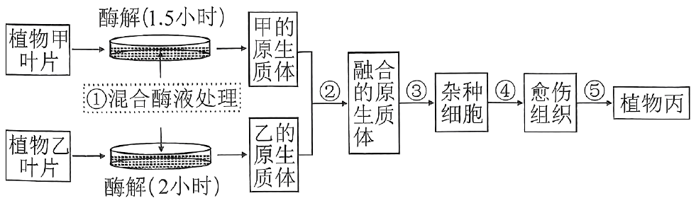
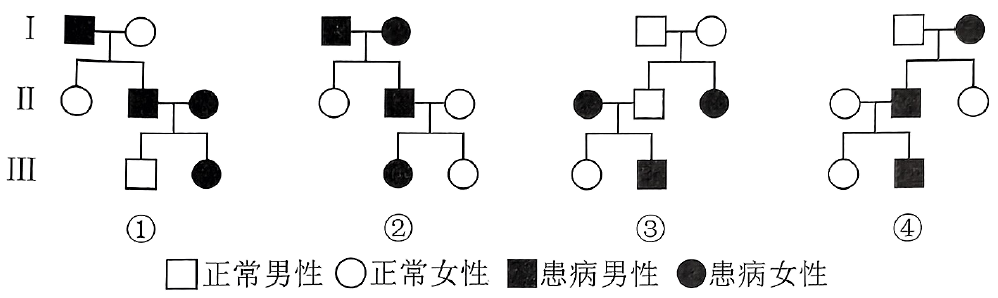

**机密★启用前**

**2024年湖北省普通高中学业水平选择性考试**

**生物学**

**本试卷共8页，22题。全卷满分100分。考试用时75分钟。**

**★祝考试顺利★**

**注意事项：**

**1．答题前，先将自己的姓名、准考证号、考场号、座位号填写在试卷和答题卡上，并认真核准准考证号条形码上的以上信息，将条形码粘贴在答题卡上的指定位置。**

**2．请按题号顺序在答题卡上各题目的答题区域内作答，写在试卷、草稿纸和答题卡上的非答题区域均无效。**

**3．选择题用2B铅笔在答题卡上把所选答案的标号涂黑；非选择题用黑色签字笔在答题卡上作答；字体工整，笔迹清楚。**

**4．考试结束后，请将试卷和答题卡一并上交。**

**一、选择题：本题共18小题，每小题2分，共36分。在每小题给出的四个选项中，只有一项是符合题目要求的。**

1\. 制醋、制饴、制酒是我国传统发酵技术。醋酸菌属于好氧型原核生物，常用于食用醋的发酵。下列叙述错误的是（ ）

A. 食用醋的酸味主要来源于乙酸 B. 醋酸菌不适宜在无氧条件下生存

C. 醋酸菌含有催化乙醇氧化成乙酸的酶 D. 葡萄糖在醋酸菌中的氧化分解发生在线粒体内

2\. 2021年3月，习近平总书记在考察武夷山国家公园时指出，建立以国家公园为主体的自然保护地体系，目的就是按照山水林田湖草是一个生命共同体的理念，保持自然生态系统的原真性和完整性，保护生物多样性。根据以上精神，结合生物学知识，下列叙述错误的是（ ）

A. 在国家公园中引入外来物种，有可能导致生物多样性下降

B. 建立动物园和植物园，能够更好地对濒危动植物进行就地保护

C. 规范人类活动、修复受损生境，有利于自然生态系统的发育和稳定

D. 在破碎化生境之间建立生态廊道，是恢复自然生态系统完整性的重要措施

3\. 据报道，2015年到2019年长江经济带人均生态足迹由0.3212hm2下降至0.2958hm2，5年的下降率为7.91%。人均生态承载力从0.4607hm2下降到0.4498hm2，5年的下降率为2.37%。结合上述数据，下列叙述错误的是（ ）

A. 长江经济带这5年处于生态盈余的状态

B. 长江经济带这5年的环境容纳量维持不变

C. 长江经济带居民绿色环保的生活方式有利于生态足迹的降低

D. 农业科技化和耕地质量的提升可提高长江经济带的生态承载力

4\. 植物甲的花产量、品质（与叶黄素含量呈正相关）与光照长短密切相关。研究人员用不同光照处理植物甲幼苗，实验结果如下表所示。下列叙述正确的是（ ）

|     |             |        |        |               |                                                             |
|:---:|:-----------:|:------:|:------:|:-------------:|:-----------------------------------------------------------:|
| 组别  | 光照处理        | 首次开花时间 | 茎粗（mm） | 花的叶黄素含量（g/kg） | 鲜花累计平均产量（） |
| ①   | 光照8h/黑暗16h  | 7月4日   | 9.5    | 2.3           | 13000                                                       |
| ②   | 光照12h/黑暗12h | 7月18日  | 10.6   | 4.4           | 21800                                                       |
| ③   | 光照16h/黑暗8h  | 7月26日  | 11.5   | 2.4           | 22500                                                       |

A. 第①组处理有利于诱导植物甲提前开花，且产量最高

B. 植物甲花的品质与光照处理中的黑暗时长呈负相关

C. 综合考虑花的产量和品质，应该选择第②组处理

D. 植物甲花的叶黄素含量与花的产量呈正相关

5\. 波尔山羊享有“世界山羊之王”的美誉，具有生长速度快、肉质细嫩等优点。生产中常采用胚胎工程技术快速繁殖波尔山羊。下列叙述错误的是（ ）

A. 选择遗传性状优良的健康波尔母山羊进行超数排卵处理

B. 胚胎移植前可采集滋养层细胞进行遗传学检测

C. 普通品质的健康杜泊母绵羊不适合作为受体

D. 生产中对提供精子的波尔公山羊无需筛选

6\. 研究人员以野生型水稻和突变型水稻（乙烯受体缺失）等作为材料，探究乙烯对水稻根系生长的影响，结果如下表所示。下列叙述正确的是（ ）

<table style="width:65%;">
<colgroup>
<col style="width: 4%" />
<col style="width: 26%" />
<col style="width: 22%" />
<col style="width: 11%" />
</colgroup>
<tbody>
<tr>
<td colspan="2" style="text-align: center;">实验组别</td>
<td style="text-align: center;">植物体内生长素含量</td>
<td style="text-align: center;">根系长度</td>
</tr>
<tr>
<td style="text-align: center;">①</td>
<td style="text-align: center;">野生型水稻</td>
<td style="text-align: center;">＋＋＋</td>
<td style="text-align: center;">＋＋＋</td>
</tr>
<tr>
<td style="text-align: center;">②</td>
<td style="text-align: center;">突变型水稻</td>
<td style="text-align: center;">＋</td>
<td style="text-align: center;">＋</td>
</tr>
<tr>
<td style="text-align: center;">③</td>
<td style="text-align: center;">突变型水稻＋NAA</td>
<td style="text-align: center;">＋</td>
<td style="text-align: center;">＋＋＋</td>
</tr>
<tr>
<td style="text-align: center;">④</td>
<td style="text-align: center;">乙烯受体功能恢复型水稻</td>
<td style="text-align: center;">＋＋＋</td>
<td style="text-align: center;">＋＋＋</td>
</tr>
</tbody>
</table>

注：＋越多表示相关指标的量越大

A. 第④组中的水稻只能通过转基因技术获得

B. 第②组与第③组对比说明乙烯对根系生长有促进作用

C. 第③组与第④组对比说明NAA对根系生长有促进作用

D. 实验结果说明乙烯可能影响生长素的合成，进而调控根系的生长

7\. 研究发现，某种芦鹀分布在不同地区的三个种群，因栖息地环境的差异导致声音信号发生分歧。不同芦鹀种群的两个和求偶有关的鸣唱特征，相较于其他鸣唱特征有明显分歧。因此推测和求偶有关的鸣唱特征，在芦鹀的早期物种形成过程中有重要作用。下列叙述错误的是（ ）

A. 芦鹀的鸣唱声属于物理信息

B. 求偶的鸣唱特征是芦鹀与栖息环境之间协同进化的结果

C. 芦鹀之间通过鸣唱形成信息流，芦鹀既是信息源又是信息受体

D. 和求偶有关的鸣唱特征的差异，表明这三个芦鹀种群存在生殖隔离

8\. 人的前胰岛素原是由110个氨基酸组成的单链多肽。前胰岛素原经一系列加工后转变为由51个氨基酸组成的活性胰岛素，才具有降血糖的作用。该实例体现了生物学中“结构与功能相适应”的观念。下列叙述与上述观念不相符合的是（ ）

A. 热带雨林生态系统中分解者丰富多样，其物质循环的速率快

B. 高温处理后的抗体，失去了与抗原结合的能力

C. 硝化细菌没有中心体，因而不能进行细胞分裂

D. 草履虫具有纤毛结构，有利于其运动

9\. 磷酸盐体系（/）和碳酸盐体系（/）是人体内两种重要的缓冲体系。下列叙述错误的是（ ）

A. 有氧呼吸的终产物在机体内可转变为

B. 细胞呼吸生成ATP的过程与磷酸盐体系有关

C. 缓冲体系的成分均通过自由扩散方式进出细胞

D. 过度剧烈运动会引起乳酸中毒说明缓冲体系的调节能力有限

10\. 研究者探究不同浓度的雌激素甲对牛的卵母细胞和受精卵在体外发育的影响，实验结果如下表所示。根据实验数据，下列叙述错误的是（ ）

|             |         |           |        |        |        |
|:-----------:|:-------:|:---------:|:------:|:------:|:------:|
| 甲的浓度（μg/mL） | 卵母细胞（个） | 第一极体排出（个） | 成熟率（%） | 卵裂数（个） | 卵裂率（％） |
| 0           | 106     | 70        | 66.0   | 28     | 40.0   |
| 1           | 120     | 79        | 65.8   | 46     | 58.2   |
| 10          | 113     | 53        | 46.9   | 15     | 28.3   |
| 100         | 112     | 48        | 42.8   | 5      | 10.4   |

A. 实验结果说明甲抑制卵裂过程

B. 甲浓度过高抑制第一极体的排出

C. 添加1μg/mL甲可提高受精后胚胎发育能力

D. 本实验中，以第一极体的排出作为卵母细胞成熟的判断标准

11\. 植物甲抗旱、抗病性强，植物乙分蘖能力强、结实性好。科研人员通过植物体细胞杂交技术培育出兼有甲、乙优良性状的植物丙，过程如下图所示。下列叙述错误的是（ ）

A. 过程①中酶处理的时间差异，原因可能是两种亲本的细胞壁结构有差异

B. 过程②中常采用灭活的仙台病毒或PEG诱导原生质体融合

C. 过程④和⑤的培养基中均需要添加生长素和细胞分裂素

D. 可通过分析植物丙的染色体，来鉴定其是否为杂种植株

12\. 糖尿病是危害人类健康的主要疾病之一。恢复功能性胰岛B细胞总量是治疗糖尿病的重要策略。我国学者研究发现，向患有糖尿病的小鼠注射胰高血糖素受体单克隆抗体（mAb），可以促进胰岛A细胞增殖，诱导少数胰岛A细胞向胰岛B细胞转化，促进功能性胰岛B细胞再生。根据上述实验结果，下列叙述错误的是（ ）

A. mAb的制备可能涉及细胞融合技术

B. 注射mAb可降低胰腺分泌胰高血糖素的量

C. mAb和胰高血糖素均能与胰高血糖素受体特异性结合

D. 胰高血糖素主要通过促进肝糖原分解和非糖物质转化为糖，升高血糖水平

13\. 芽殖酵母通过出芽形成芽体进行无性繁殖（图1），出芽与核DNA复制同时开始。一个母体细胞出芽达到最大次数后就会衰老、死亡。科学家探究了不同因素对芽殖酵母最大分裂次数的影响，实验结果如图2所示。下列叙述错误的是（ ）

A. 芽殖酵母进入细胞分裂期时开始出芽 B. 基因和环境都可影响芽殖酵母的寿命

C. 成熟芽体的染色体数目与母体细胞的相同 D. 该实验结果为延长细胞生命周期的研究提供新思路

14\. 某二倍体动物的性别决定方式为ZW型，雌性和雄性个体数的比例为1∶1。该动物种群处于遗传平衡，雌性个体中有1/10患甲病（由Z染色体上h基因决定）。下列叙述正确的是（ ）

A. 该种群有11%的个体患该病

B. 该种群h基因的频率是10%

C. 只考虑该对基因，种群繁殖一代后基因型共有6种

D. 若某病毒使该种群患甲病雄性个体减少10%，H基因频率不变

15\. 为探究下丘脑对哺乳动物生理活动的影响，某学生以实验动物为材料设计一系列实验，并预测了实验结果，不合理的是（ ）

A. 若切除下丘脑，抗利尿激素分泌减少，可导致机体脱水

B. 若损伤下丘脑的不同区域，可确定散热中枢和产热中枢的具体部位

C. 若损毁下丘脑，再注射甲状腺激素，可抑制促甲状腺激素释放激素分泌

D. 若仅切断大脑皮层与下丘脑的联系，短期内恒温动物仍可维持体温的相对稳定

16\. 编码某蛋白质的基因有两条链，一条是模板链（指导mRNA合成），其互补链是编码链。若编码链的一段序列为5＇—ATG—3＇，则该序列所对应的反密码子是（ ）

A. 5＇—CAU—3＇ B. 5＇—UAC—3＇ C. 5＇—TAC—3＇ D. 5＇—AUG—3＇

17\. 模拟实验是根据相似性原理，用模型来替代研究对象的实验。比如“性状分离比的模拟实验”（实验一）中用小桶甲和乙分别代表植物的雌雄生殖器官，用不同颜色的彩球代表D、d雌雄配子；“建立减数分裂中染色体变化的模型”模拟实验（实验二）中可用橡皮泥制作染色体模型，细绳代表纺锤丝；DNA分子的重组模拟实验（实验三）中可利用剪刀、订书钉和写有DNA序列的纸条等模拟DNA分子重组的过程。下列实验中模拟正确的是（ ）

A. 实验一中可用绿豆和黄豆代替不同颜色的彩球分别模拟D和d配子

B. 实验二中牵拉细绳使橡皮泥分开，可模拟纺锤丝牵引使着丝粒分裂

C 实验三中用订书钉将两个纸条片段连接，可模拟核苷酸之间形成磷酸二酯键

D. 向实验一桶内添加代表另一对等位基因的彩球可模拟两对等位基因的自由组合

18\. 不同品种烟草在受到烟草花叶病毒（TMV）侵染后症状不同。研究者发现品种甲受TMV侵染后表现为无症状（非敏感型），而品种乙则表现为感病（敏感型）。甲与乙杂交，F1均为敏感型；F1与甲回交所得的子代中，敏感型与非敏感型植株之比为3∶1。对决定该性状的*N*基因测序发现，甲的N基因相较于乙的缺失了2个碱基对。下列叙述正确的是（ ）

A. 该相对性状由一对等位基因控制

B. F1自交所得F2中敏感型和非敏感型的植株之比为13∶3

C. 发生在N基因上的2个碱基对的缺失不影响该基因表达产物的功能

D. 用DNA酶处理该病毒的遗传物质，然后导入到正常乙植株中，该植株表现为感病

**二、非选择题：本题共4小题，共64分。**

19\. 高寒草甸是青藏高原主要的生态系统，多年来受气候变化和生物干扰的共同影响退化严重。高原鼢鼠广泛分布于青藏高原高寒草甸，常年栖息于地下。有研究发现，高原鼢鼠挖掘洞道时形成的众多土丘，能改变丘间草地的微生境土壤物理性状，进而对该栖息生境下植物群落的多样性、空间结构以及物种组成等产生显著影响。随着高原鼢鼠干扰强度增大，鼠丘密度增加，样地内植物物种数明显增多，鼠丘间原优势种在群落中占比减少，其他杂草的占比逐渐增加。回答下列问题：

（1）调查鼠丘样地内高原鼢鼠的种群密度，常采用的方法是\_\_\_\_\_\_\_\_。

（2）高原鼢鼠干扰造成微生境多样化，为栖息地植物提供了更丰富\_\_\_\_\_\_\_\_，促进植物群落物种共存。

（3）如果受到全球气候变暖加剧以及人为干扰如过度放牧等影响，高寒草甸生态系统发生逆行演替，其最终生态系统类型可能是\_\_\_\_\_\_\_\_。与高寒草甸生态系统相比，演替后的最终生态系统发生的变化是\_\_\_\_\_\_\_\_（填序号）。

①群落结构趋于简单，物种丰富度减少 ②群落结构不变，物种丰富度增加 ③群落结构趋于复杂，物种丰富度减少 ④群落结构趋于简单，物种丰富度增加

（4）在高原鼢鼠重度干扰的地区，如果需要恢复到原有的生态系统，从食物链的角度分析，可以采用的措施是\_\_\_\_\_\_\_\_，其原理是\_\_\_\_\_\_\_\_。

（5）上述材料说明，除了人为活动、气候变化外，群落演替还受到\_\_\_\_\_\_\_\_等生物因素的影响（回答一点即可）。

20\. 苏云金芽孢杆菌产生的Bt毒蛋白，被棉铃虫吞食后活化，再与肠道细胞表面受体结合，形成复合体插入细胞膜中，直接导致细胞膜穿孔，细胞内含物流出，直至细胞死亡。科学家将编码Bt毒蛋白的基因转入棉花植株，获得的转基因棉花能有效防控棉铃虫的危害。回答下列问题：

（1）Bt毒蛋白引起的细胞死亡属于\_\_\_\_\_\_\_\_（填“细胞坏死”或“细胞凋亡”）。

（2）如果转基因棉花植株中Bt毒蛋白含量偏低，取食后棉铃虫可通过激活肠干细胞分裂和\_\_\_\_\_\_\_\_产生新的肠道细胞，修复损伤的肠道，由此导致杀虫效果下降。请据此提出一项可提高转基因棉花杀虫效果的改进思路：\_\_\_\_\_\_\_\_。

（3）在Bt毒蛋白的长期选择作用下，种群中具有抗性的棉铃虫存活的可能原因是：肠道细胞表面受体蛋白的\_\_\_\_\_\_\_\_或\_\_\_\_\_\_\_\_发生变化，导致棉铃虫对Bt毒蛋白产生抗性。

（4）将Bt毒蛋白转基因棉花与非转基因棉花混种，可以延缓棉铃虫对转基因棉花产生抗性，原因是\_\_\_\_\_\_\_\_。

21\. 气孔是指植物叶表皮组织上两个保卫细胞之间的孔隙。植物通过调节气孔大小，控制CO2进入和水分的散失，影响光合作用和含水量。科研工作者以拟南芥为实验材料，研究并发现了相关环境因素调控气孔关闭的机理（图1）。已知ht1基因、rhc1基因各编码蛋白甲和乙中的一种，但对应关系未知。研究者利用野生型（wt）、ht1基因功能缺失突变体（h）、rhc1基因功能缺失突变体（r）和ht1/rhc1双基因功能缺失突变体（h/r），进行了相关实验，结果如图2所示。

回答下列问题：

（1）保卫细胞液泡中的溶质转运到胞外，导致保卫细胞\_\_\_\_\_\_\_\_（填“吸水”或“失水”），引起气孔关闭，进而使植物光合作用速率\_\_\_\_\_\_\_\_（填“增大”或“不变”或“减小”）。

（2）图2中的wt组和r组对比，说明高浓度CO2时rhc1基因产物\_\_\_\_\_\_\_\_（填“促进”或“抑制”）气孔关闭。

（3）由图1可知，短暂干旱环境中，植物体内脱落酸含量上升，这对植物的积极意义是\_\_\_\_\_\_\_\_。

（4）根据实验结果判断：编码蛋白甲的基因是\_\_\_\_\_\_\_\_（填“ht1”或“rhc1”）。

22\. 某种由单基因控制的常染色体显性遗传病（S病）患者表现为行走不稳、眼球震颤，多在成年发病。甲乙两人均出现这些症状。遗传咨询发现，甲的家系不符合S病遗传系谱图的特征，而乙的家系符合。经检查确诊，甲不是S病患者，而乙是。回答下列问题：

（1）遗传咨询中医生初步判断甲可能不是S病患者，而乙可能是该病患者，主要依据是\_\_\_\_\_\_\_\_（填序号）。

①血型 ②家族病史 ③B超检测结果

（2）系谱图分析是遗传疾病诊断和优生的重要依据。下列单基因遗传病系谱图中，一定不属于S病的是\_\_\_\_\_\_\_\_（填序号），判断理由是\_\_\_\_\_\_\_\_；一定属于常染色体显性遗传病的系谱图是\_\_\_\_\_\_\_\_（填序号）。

（3）提取患者乙及其亲属的DNA，对该病相关基因进行检测，电泳结果如下图（1是乙，2、3、4均为乙的亲属）。根据该电泳图\_\_\_\_\_\_\_\_（填“能”或“不能”）确定2号和4号个体携带了致病基因，理由是\_\_\_\_\_\_\_\_。

（4）《“健康中国2030”规划纲要》指出，孕前干预是出生缺陷防治体系的重要环节。单基因控制的常染色体显性遗传病患者也有可能产生不含致病基因的健康配子，再通过基因诊断和试管婴儿等技术，生育健康小孩。该类型疾病女性患者有可能产生不含致病基因的卵细胞，请从减数分裂的角度分析，其原因是\_\_\_\_\_\_\_。
