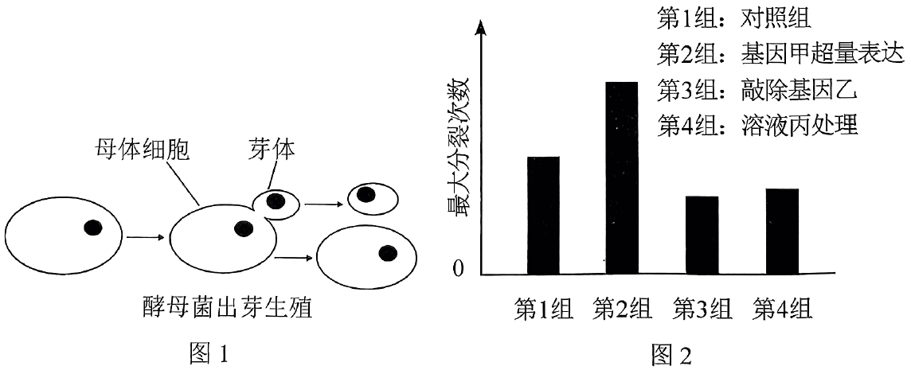
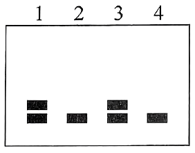

**机密★启用前**

**2024年湖北省普通高中学业水平选择性考试**

**生物学**

**本试卷共8页，22题。全卷满分100分。考试用时75分钟。**

**★祝考试顺利★**

**注意事项：**

**1．答题前，先将自己的姓名、准考证号、考场号、座位号填写在试卷和答题卡上，并认真核准准考证号条形码上的以上信息，将条形码粘贴在答题卡上的指定位置。**

**2．请按题号顺序在答题卡上各题目的答题区域内作答，写在试卷、草稿纸和答题卡上的非答题区域均无效。**

**3．选择题用2B铅笔在答题卡上把所选答案的标号涂黑；非选择题用黑色签字笔在答题卡上作答；字体工整，笔迹清楚。**

**4．考试结束后，请将试卷和答题卡一并上交。**

**一、选择题：本题共18小题，每小题2分，共36分。在每小题给出的四个选项中，只有一项是符合题目要求的。**

1\. 制醋、制饴、制酒是我国传统发酵技术。醋酸菌属于好氧型原核生物，常用于食用醋的发酵。下列叙述错误的是（ ）

A. 食用醋的酸味主要来源于乙酸 B. 醋酸菌不适宜在无氧条件下生存

C. 醋酸菌含有催化乙醇氧化成乙酸的酶 D. 葡萄糖在醋酸菌中的氧化分解发生在线粒体内

【答案】D

【解析】

【分析】参与果醋制作的微生物是醋酸菌，其新陈代谢类型是异养需氧型。果醋制作的原理：当氧气、糖源都充足时，醋酸菌将葡萄汁中的果糖分解成醋酸。当缺少糖源时，醋酸菌将乙醇变为乙醛，再将乙醛变为醋酸。

【详解】A、食用醋的酸味主要来自醋酸，醋酸学名乙酸，A正确；

B、醋酸菌是好氧型细菌，不适宜在无氧的条件下生存，B正确；

C、在制醋时，缺失原料的情况下，醋酸菌将乙醇变为乙醛，再将乙醛变为醋酸，因此醋酸菌体内含有催化乙醇氧化成乙酸的酶，C正确；

D、醋酸菌属于细菌，没有核膜包被的细胞核和众多细胞器，因此没有线粒体，D错误。

故选D。

2\. 2021年3月，习近平总书记在考察武夷山国家公园时指出，建立以国家公园为主体的自然保护地体系，目的就是按照山水林田湖草是一个生命共同体的理念，保持自然生态系统的原真性和完整性，保护生物多样性。根据以上精神，结合生物学知识，下列叙述错误的是（ ）

A. 在国家公园中引入外来物种，有可能导致生物多样性下降

B. 建立动物园和植物园，能够更好地对濒危动植物进行就地保护

C. 规范人类活动、修复受损生境，有利于自然生态系统的发育和稳定

D. 在破碎化生境之间建立生态廊道，是恢复自然生态系统完整性的重要措施

【答案】B

【解析】

【分析】保护生物多样性的措施：（1）就地保护:主要形式是建立自然保护区，是保护生物多样性最有效的措施；（2）迁地保护:将濒危生物迁出原地，移入动物园、植物园、水族馆和濒危动物繁育中心，进行特殊的保护和管理，是对就地保护的补充;（3）建立濒危物种种质库，保护珍贵的遗传资源；（4）加强教育和法制管理，提高公民的环境保护意识。

【详解】A、在国家公园中引入外来物种，可能造成物种入侵，从而导致生物多样性下降，A正确；

B、建立动物园和植物园属于异地保护，就地保护的主要形式是建立自然保护区，B错误；

C、规范人类活动，加强教育和法制管理，提高公民的环境保护意识，修复受损生境，有利于自然生态系统的发育和稳定，保持自然生态系统的原真性和完整性，C正确；

D、生态廊道指适应生物迁移或栖息的通道，可将保护区之间或与之隔离的其他生境相连，在破碎化生境之间建立生态廊道，是恢复自然生态系统完整性的重要措施，D正确。

故选B。

3\. 据报道，2015年到2019年长江经济带人均生态足迹由0.3212hm2下降至0.2958hm2，5年的下降率为7.91%。人均生态承载力从0.4607hm2下降到0.4498hm2，5年的下降率为2.37%。结合上述数据，下列叙述错误的是（ ）

A. 长江经济带这5年处于生态盈余的状态

B. 长江经济带这5年的环境容纳量维持不变

C. 长江经济带居民绿色环保的生活方式有利于生态足迹的降低

D. 农业科技化和耕地质量的提升可提高长江经济带的生态承载力

【答案】B

【解析】

【分析】生态足迹是指维持某一人口单位生存所需的生产资源和吸纳废物的土地及水域的面积，生态承载力是指某区域在一定条件下区域资源与环境的最大供应能力。一个地区的生态承载力小于生态足迹时，出现生态赤字。

【详解】A、长江经济带这5年，人均生态承载力从0.4607hm2下降到0.4498hm2，人均生态足迹由0.3212hm2下降至0.2958hm2，人均生态承载力一直大于人均生态足迹，处于生态盈余的状态，A正确。

B、生态承载力是指某区域在一定条件下区域资源与环境的最大供应能力，生态承载力下降，所以这五年的环境容纳量改变，B错误。

C、长江经济带居民绿色环保的生活方式降低吸纳废物所需的土地及水域面积，有利于生态足迹的降低，C正确。

D、农业科技化和耕地质量的提升可提高生产资源的能力，可提高长江经济带的生态承载力，D正确。

故选B。

4\. 植物甲的花产量、品质（与叶黄素含量呈正相关）与光照长短密切相关。研究人员用不同光照处理植物甲幼苗，实验结果如下表所示。下列叙述正确的是（ ）

|     |             |        |        |               |                                                             |
|:---:|:-----------:|:------:|:------:|:-------------:|:-----------------------------------------------------------:|
| 组别  | 光照处理        | 首次开花时间 | 茎粗（mm） | 花的叶黄素含量（g/kg） | 鲜花累计平均产量（） |
| ①   | 光照8h/黑暗16h  | 7月4日   | 9.5    | 2.3           | 13000                                                       |
| ②   | 光照12h/黑暗12h | 7月18日  | 10.6   | 4.4           | 21800                                                       |
| ③   | 光照16h/黑暗8h  | 7月26日  | 11.5   | 2.4           | 22500                                                       |

A. 第①组处理有利于诱导植物甲提前开花，且产量最高

B. 植物甲花的品质与光照处理中的黑暗时长呈负相关

C. 综合考虑花的产量和品质，应该选择第②组处理

D. 植物甲花的叶黄素含量与花的产量呈正相关

【答案】C

【解析】

【分析】据表分析，该实验的自变量是不同光照处理，因变量是首次开花时间、茎粗、花的叶黄素含量、鲜花累计平均产量，数据表明③组的产量最高，②组的品质最高，①组最先开花。

【详解】A、由表中数据分析可知，三组中，第①组首次开花时间最早，说明第①组处理有利于诱导植物甲提前开花，但在三组中产量最低，A错误；

B、由题干信息可知，植物甲的花品质与叶黄素含量呈正相关，根据表格数据分析，第①组光照处理中的黑暗时长最长，花的叶黄素含量最低，而第③组光照处理中的黑暗时长最短，但花的叶黄素含量却不是最高的，说明植物甲花的品质与光照处理中的黑暗时长不是呈负相关，B错误；

C、由表中信息可知，第②组光照处理，花的叶黄素含量最高，植物甲的花品质最好，第③组光照处理，鲜花累计平均产量最高，说明植物甲的花产量最高，综合考虑花的产量和品质，应该选择第②组处理，C正确；

D、由表中数据分析可知，第②组光照处理，花的叶黄素含量最高，但鲜花累计平均产量却不是最高，说明植物甲花的产量不是最高，所以植物甲花的叶黄素含量与花的产量不是呈正相关，D错误。

故选C。

5\. 波尔山羊享有“世界山羊之王”的美誉，具有生长速度快、肉质细嫩等优点。生产中常采用胚胎工程技术快速繁殖波尔山羊。下列叙述错误的是（ ）

A. 选择遗传性状优良的健康波尔母山羊进行超数排卵处理

B. 胚胎移植前可采集滋养层细胞进行遗传学检测

C. 普通品质的健康杜泊母绵羊不适合作为受体

D. 生产中对提供精子的波尔公山羊无需筛选

【答案】D

【解析】

【分析】胚胎移植的基本程序主要包括：①对供、受体的选择和处理。选择遗传特性和生产性能优秀的供体，有健康的体质和正常繁殖能力的受体，供体和受体是同一物种。并用激素进行同期发情处理，用促性腺激素对供体母牛做超数排卵处理。②配种或人工授精。③对胚胎的收集、检查、培养或保存。配种或输精后第7天，用特制的冲卵装置，把供体母牛子宫内的胚胎冲洗出来（也叫冲卵）。对胚胎进行质量检查，此时的胚胎应发育到桑葚或胚囊胚阶段。直接向受体移植或放入-196℃的液氮中保存。④对胚胎进行移植。⑤移植后的检查。对受体母牛进行是否妊娠的检查。

【详解】A、选择遗传性状优良的健康波尔母山羊作为供体，进行超数排卵处理，A正确；

B、胚胎移植前，采集部分滋养层细胞进行遗传学检测，B正确；

C、作为受体的杜泊母山羊只需具备健康的体质和正常繁殖能力即可，但山羊和绵羊是不同的物种，具有生殖隔离，不能将山羊的胚胎移植到绵羊子宫发育，即普通品质的健康杜泊母绵羊不适合作为受体，C正确；

D、生产中需选择品质良好的波尔公山羊提供精子，D错误。

故选D。

6\. 研究人员以野生型水稻和突变型水稻（乙烯受体缺失）等作为材料，探究乙烯对水稻根系生长的影响，结果如下表所示。下列叙述正确的是（ ）

<table style="width:65%;">
<colgroup>
<col style="width: 4%" />
<col style="width: 26%" />
<col style="width: 22%" />
<col style="width: 11%" />
</colgroup>
<tbody>
<tr>
<td colspan="2" style="text-align: center;">实验组别</td>
<td style="text-align: center;">植物体内生长素含量</td>
<td style="text-align: center;">根系长度</td>
</tr>
<tr>
<td style="text-align: center;">①</td>
<td style="text-align: center;">野生型水稻</td>
<td style="text-align: center;">＋＋＋</td>
<td style="text-align: center;">＋＋＋</td>
</tr>
<tr>
<td style="text-align: center;">②</td>
<td style="text-align: center;">突变型水稻</td>
<td style="text-align: center;">＋</td>
<td style="text-align: center;">＋</td>
</tr>
<tr>
<td style="text-align: center;">③</td>
<td style="text-align: center;">突变型水稻＋NAA</td>
<td style="text-align: center;">＋</td>
<td style="text-align: center;">＋＋＋</td>
</tr>
<tr>
<td style="text-align: center;">④</td>
<td style="text-align: center;">乙烯受体功能恢复型水稻</td>
<td style="text-align: center;">＋＋＋</td>
<td style="text-align: center;">＋＋＋</td>
</tr>
</tbody>
</table>

注：＋越多表示相关指标的量越大

A. 第④组中的水稻只能通过转基因技术获得

B. 第②组与第③组对比说明乙烯对根系生长有促进作用

C. 第③组与第④组对比说明NAA对根系生长有促进作用

D. 实验结果说明乙烯可能影响生长素的合成，进而调控根系的生长

【答案】D

【解析】

【分析】生长素的作用为促进植物生长、促进侧根和不定根的发生和促进植物发芽，生长素还能维持植物的生长优势；萘乙酸（NAA）是生长素类似物，作用与生长素相似。

【详解】A、由题可知，乙烯受体缺失水稻由基因突变得到，因此乙烯受体功能恢复型水稻还可以通过杂交技术获得，A错误；

B、第②组与第③组对比，自变量为是否含有NAA，只能说明NAA对根系生长有促进作用，不能说明乙烯对根系生长有促进作用，B错误；

C、第③组与第④组对比，自变量不唯一，没有遵循单一变量原则，不能说明NAA对根系生长有促进作用，C错误；

D、根据第①组、第②组和第③组的结果可知，野生型水稻和乙烯受体功能恢复型水稻植物体内生长素含量与根系长度的相关指标都比突变型水稻（乙烯受体缺失）组的大，说明乙烯可能影响生长素的合成，进而调控根系的生长，D正确。

故选D。

7\. 研究发现，某种芦鹀分布在不同地区的三个种群，因栖息地环境的差异导致声音信号发生分歧。不同芦鹀种群的两个和求偶有关的鸣唱特征，相较于其他鸣唱特征有明显分歧。因此推测和求偶有关的鸣唱特征，在芦鹀的早期物种形成过程中有重要作用。下列叙述错误的是（ ）

A. 芦鹀的鸣唱声属于物理信息

B. 求偶的鸣唱特征是芦鹀与栖息环境之间协同进化的结果

C. 芦鹀之间通过鸣唱形成信息流，芦鹀既是信息源又是信息受体

D. 和求偶有关的鸣唱特征的差异，表明这三个芦鹀种群存在生殖隔离

【答案】D

【解析】

【分析】1、生态系统中信息的种类

（1）物理信息：生态系统中的光、声、温度、湿度、磁力等，通过物理过程传递的信息，如蜘蛛网的振动频率。

（2）化学信息：生物在生命活动中，产生了一些可以传递信息的化学物质，如植物的生物碱、有机酸，动物的性外激素等。

（3）行为信息：动物的特殊行为，对于同种或异种生物也能够传递某种信息，如孔雀开屏。

2、信息传递在生态系统中的作用：

（1）个体：生命活动的正常进行，离不开信息的传递。

（2）种群：生物种群的繁衍，离不开信息的传递。

（3）群落和生态系统：能调节生物的种间关系，以维持生态系统的稳定。

【详解】A、物理信息是指通过物理过程传递的信息，芦鹀的鸣唱声属于物理信息，A正确；

B、某种芦鹀分布在不同地区的三个种群，因栖息地环境的差异导致声音信号发生分歧，由此可知，求偶的鸣唱特征是芦鹀与栖息环境之间协同进化的结果，B正确；

C、完整信息传递过程包括了信息源、信道和信息受体，芦鹀之间通过鸣唱形成信息流，芦鹀既是信息源又是信息受体，C正确；

D、判断两个种群是否为同一物种，主要依据是它们是否存在生殖隔离，即二者的杂交子代是否可育，由和求偶有关的鸣唱特征的差异，无法表明这三个芦鹀种群是否存在生殖隔离，D错误。

故选D。

8\. 人的前胰岛素原是由110个氨基酸组成的单链多肽。前胰岛素原经一系列加工后转变为由51个氨基酸组成的活性胰岛素，才具有降血糖的作用。该实例体现了生物学中“结构与功能相适应”的观念。下列叙述与上述观念不相符合的是（ ）

A. 热带雨林生态系统中分解者丰富多样，其物质循环的速率快

B. 高温处理后的抗体，失去了与抗原结合的能力

C. 硝化细菌没有中心体，因而不能进行细胞分裂

D. 草履虫具有纤毛结构，有利于其运动

【答案】C

【解析】

【分析】蛋白质的功能：

（1）免疫功能：抗体的本质是免疫球蛋白，会与抗原结合形成沉淀团，被吞噬细胞消化分解。

（2）结构功能：有些蛋白质是构成细胞和生物体的重要物质，如人和动物的肌肉、毛发。

（3）催化功能：绝大多数酶都是蛋白质，具有催化功能。

（4）运输功能：有些蛋白质具有运输载体的功能，如血红蛋白运输氧气。

（5）调节功能：有些蛋白质有信息传递功能，能够调节机体的生命活动，如胰岛素可以调节血糖。

【详解】A、生态系统的结构包括组成成分和营养结构，其中分解者属于组成成分，其以动植物残体、排泄物中的有机物质为生命活动能源，并把复杂的有机物逐步分解为简单的无机物，所以其重要功能是维持生态系统物质循环的正常进行，以保证生态系统结构和功能的稳定，因此热带雨林生态系统中分解者丰富多样，该生态系统物质循环速率会加快，A不符合题意；

B、抗体的本质是免疫球蛋白，会与抗原结合形成沉淀团，被吞噬细胞消化分解，高温会破坏抗体（免疫球蛋白）的空间结构，使抗体失去生物活性（即生物学功能），所以无法与抗原结合，B不符合题意；

C、硝化细菌是原核生物，只含核糖体这一种细胞器，其分裂时，DNA分子附着在细胞膜上并复制为二，然后随着细胞膜的延长，复制而成的两个DNA分子彼此分开；同时细胞中部的细胞膜和细胞壁向内生长，形成隔膜，将细胞质分成两半，形成两个子细胞，该过程即二分裂，依赖于细胞膜和细胞壁，C符合题意；

D、草履虫的纤毛会辅助运动，草履虫靠纤毛的摆动在水中旋转前进，还可帮助口沟摄食，D不符合题意。

故选C。

9\. 磷酸盐体系（/）和碳酸盐体系（/）是人体内两种重要的缓冲体系。下列叙述错误的是（ ）

A. 有氧呼吸的终产物在机体内可转变为

B. 细胞呼吸生成ATP的过程与磷酸盐体系有关

C. 缓冲体系的成分均通过自由扩散方式进出细胞

D. 过度剧烈运动会引起乳酸中毒说明缓冲体系的调节能力有限

【答案】C

【解析】

【分析】1、有氧呼吸的第一、二、三阶段的场所依次是细胞质基质、线粒体基质和线粒体内膜。有氧呼吸第一 阶段是葡萄糖分解成丙酮酸和\[H\]，合成少量ATP；第二阶段是丙酮酸和水反应生成二氧化碳和\[H\]，合成少量ATP；第三阶段是氧气和\[H\]反应生成水，合成大量ATP。

2、无氧呼吸的场所是细胞质基质，无氧呼吸的第一阶段和有氧呼吸的第一阶段相同。无氧呼吸由于不同生物体中相关的酶不同，在植物细胞和酵母菌中产生酒精和二氧化碳，在动物细胞和乳酸菌中产生乳酸。

【详解】A、有氧呼吸的终产物为二氧化碳和水，二氧化碳溶于水后形成H2CO3 ，再由H2CO3形成H+和HCO3-，A正确；

B、细胞呼吸生成ATP的过程与磷酸盐体系有关，如在细胞呼吸中磷酸盐作为底物参与了糖酵解和柠檬酸循环等过程，B正确；

C、缓冲体系的成分如HCO3-、HPO42− 携带电荷，不能通过自由扩散方式进出细胞，C错误；

D、机体内环境中的缓冲物质能够对乳酸起缓冲作用，但过度剧烈运动会引起乳酸中毒说明缓冲体系的调节能力有限，D正确。

故选C。

10\. 研究者探究不同浓度的雌激素甲对牛的卵母细胞和受精卵在体外发育的影响，实验结果如下表所示。根据实验数据，下列叙述错误的是（ ）

|             |         |           |        |        |        |
|:-----------:|:-------:|:---------:|:------:|:------:|:------:|
| 甲的浓度（μg/mL） | 卵母细胞（个） | 第一极体排出（个） | 成熟率（%） | 卵裂数（个） | 卵裂率（％） |
| 0           | 106     | 70        | 66.0   | 28     | 40.0   |
| 1           | 120     | 79        | 65.8   | 46     | 58.2   |
| 10          | 113     | 53        | 46.9   | 15     | 28.3   |
| 100         | 112     | 48        | 42.8   | 5      | 10.4   |

A. 实验结果说明甲抑制卵裂过程

B. 甲浓度过高抑制第一极体的排出

C. 添加1μg/mL的甲可提高受精后胚胎发育能力

D. 本实验中，以第一极体的排出作为卵母细胞成熟的判断标准

【答案】A

【解析】

【分析】据表可知，较对照组（甲浓度为0μg/mL）而言，甲浓度增大均使卵母细胞数量增多，对与第一机体排出个数、成熟率、卵裂数、卵裂率都呈先增加，后下降的趋势。

【详解】A、由表可知，甲低浓度时促进卵裂，高浓度时抑制卵裂，A错误；

B、对照组第一极体排出个数为70个，甲浓度过高（＞10μg/mL，第一极体排出个数＜70）抑制第一极体的排出，B正确；

C、添加1μg/mL的甲，卵裂数增大，即该条件可提高受精后胚胎发育能力，C正确；

D、卵母细胞成熟的判断标准是第一极体的排出，D正确。

故选A。

11\. 植物甲抗旱、抗病性强，植物乙分蘖能力强、结实性好。科研人员通过植物体细胞杂交技术培育出兼有甲、乙优良性状的植物丙，过程如下图所示。下列叙述错误的是（ ）

A. 过程①中酶处理的时间差异，原因可能是两种亲本的细胞壁结构有差异

B. 过程②中常采用灭活的仙台病毒或PEG诱导原生质体融合

C. 过程④和⑤的培养基中均需要添加生长素和细胞分裂素

D. 可通过分析植物丙的染色体，来鉴定其是否为杂种植株

【答案】B

【解析】

【分析】1、植物体细胞杂交技术将来自两个不同植物的体细胞融合成一个杂种细胞（植物体细胞杂交技术），把杂种细胞培育成植株（植物组织培养技术）。其原理是植物细胞具有全能性和细胞膜具有流动性。杂种细胞再生出新的细胞壁是体细胞融合完成的标志，细胞壁的形成与细胞内高尔基体有重要的关系。植物体细胞杂交技术可以克服远源杂交不亲和的障碍、培育作物新品种方面所取得的重大突破。

2、分析题图：图示为甲、乙两种植物细胞融合并培育新植株的过程，其中①表示去壁获取原生质体的过程；②③表示人工诱导原生质体融合以及再生出新细胞壁的过程；④表示脱分化形成愈伤组织；⑤表示再分化以及个体发育形成植株丙的过程。

【详解】A、酶解是为了去除植物细胞的细胞壁，过程①中酶处理的时间不同，说明两种亲本的细胞壁结构有差异，A正确；

B、过程②为原生质体的融合，常用PEG诱导原生质体融合，灭活的仙台病毒可诱导动物细胞融合，不能用于植物，B错误；

C、过程④脱分化和⑤再分化的培养基中均需要添加生长素和细胞分裂素，但在两个过程中比例不同，C正确；

D、植物丙是植物甲和植物乙体细胞杂交形成的个体，应具备两者的遗传物质，因此可通过分析植物丙的染色体，来鉴定其是否为杂种植株，D正确。

故选B。

12\. 糖尿病是危害人类健康的主要疾病之一。恢复功能性胰岛B细胞总量是治疗糖尿病的重要策略。我国学者研究发现，向患有糖尿病的小鼠注射胰高血糖素受体单克隆抗体（mAb），可以促进胰岛A细胞增殖，诱导少数胰岛A细胞向胰岛B细胞转化，促进功能性胰岛B细胞再生。根据上述实验结果，下列叙述错误的是（ ）

A. mAb的制备可能涉及细胞融合技术

B. 注射mAb可降低胰腺分泌胰高血糖素的量

C. mAb和胰高血糖素均能与胰高血糖素受体特异性结合

D. 胰高血糖素主要通过促进肝糖原分解和非糖物质转化为糖，升高血糖水平

【答案】B

【解析】

【分析】血糖调节是神经调节和体液调节共同作用的结果。胰岛素是唯一降血糖的激素，胰高血糖素和肾上腺素是升血糖的激素。血糖平衡调节：由胰岛A细胞分泌胰高血糖素（分布在胰岛外围）提高血糖浓度，促进血糖来源；由胰岛B细胞分泌胰岛素（分布在胰岛内）降低血糖浓度，促进血糖去路，减少血糖来源。

【详解】A、单克隆抗体的制备涉及细胞融合技术和动物细胞培养技术，mAb属于单克隆抗体，其制备可能涉及细胞融合技术，A正确；

B、单克隆抗体（mAb），可以促进胰岛A细胞增殖；而胰岛A细胞可分泌胰高血糖素，可见注射mAb可提高胰岛A细胞分泌胰高血糖素的量，B错误；

C、题干信息，mAb是胰高血糖素受体单克隆抗体，可见Ab和胰高血糖素均能与胰高血糖素受体特异性结合，C正确；

D、胰高血糖素主要作用于肝，促进肝糖原分解成葡萄糖进入血液，促进非糖物质转变成糖，使血糖浓度回升到正常水平，D正确。

故选B

13\. 芽殖酵母通过出芽形成芽体进行无性繁殖（图1），出芽与核DNA复制同时开始。一个母体细胞出芽达到最大次数后就会衰老、死亡。科学家探究了不同因素对芽殖酵母最大分裂次数的影响，实验结果如图2所示。下列叙述错误的是（ ）

A. 芽殖酵母进入细胞分裂期时开始出芽 B. 基因和环境都可影响芽殖酵母的寿命

C. 成熟芽体的染色体数目与母体细胞的相同 D. 该实验结果为延长细胞生命周期的研究提供新思路

【答案】A

【解析】

【分析】由图1可知，芽殖酵母以出芽方式进行增殖，其增殖方式是无性增殖，属于有丝分裂；由图2可知，基因甲和基因乙可提高芽殖酵母的最大分裂次数，而溶液丙可降低芽殖酵母的最大分裂次数。

【详解】A、细胞周期包括分裂间期和分裂期，分裂间期主要进行DNA的复制和有关蛋白质的合成，由题干“出芽与核DNA复制同时开始”可知，芽殖酵母在细胞分裂间期开始出芽；A错误；

B、由图2可知，基因甲和基因乙可提高芽殖酵母的最大分裂次数，而溶液丙可降低芽殖酵母的最大分裂次数，而一个母体细胞出芽达到最大次数后就会衰老、死亡，因此基因和环境都可影响芽殖酵母的寿命，B正确；

C、芽殖酵母通过出芽形成芽体进行无性繁殖，无性繁殖不会改变染色体的数目，C正确；

D、一个母体细胞出芽达到最大次数后就会衰老、死亡，基因甲和基因乙可提高芽殖酵母的最大分裂次数，因此，该实验结果为延长细胞生命周期的研究提供新思路，D正确。

故选A。

14\. 某二倍体动物的性别决定方式为ZW型，雌性和雄性个体数的比例为1∶1。该动物种群处于遗传平衡，雌性个体中有1/10患甲病（由Z染色体上h基因决定）。下列叙述正确的是（ ）

A. 该种群有11%的个体患该病

B. 该种群h基因的频率是10%

C. 只考虑该对基因，种群繁殖一代后基因型共有6种

D. 若某病毒使该种群患甲病雄性个体减少10%，H基因频率不变

【答案】B

【解析】

【分析】分析题干信息可知，雌性个体中有1/10患甲病，且该病由Z染色体上h基因决定，所以Zh的基因频率为10%，ZH的基因频率为90%。

【详解】A、分析题干信息可知，雌性个体中有1/10患甲病，且该病由Z染色体上h基因决定，所以Zh的基因频率为10%，该种群种患该病的个体的基因型有ZhW和ZhZh，由于雌性和雄性个体数的比例为1∶1，该种群患病概率为（10%+10%×10%）×1/2=5.5%，A错误；

B、分析题干信息可知，雌性个体中有1/10患甲病，且该病由Z染色体上h基因决定，所以Zh的基因频率为10%，B正确；

C、只考虑该对基因，种群繁殖一代后基因型有ZHZH、ZHZh、ZhZh、ZHW、ZhW，共5种，C错误；

D、若某病毒使该种群患甲病雄性个体减少10%，则种群中h基因频率降低，H基因频率应增大，D错误。

故选B。

15\. 为探究下丘脑对哺乳动物生理活动的影响，某学生以实验动物为材料设计一系列实验，并预测了实验结果，不合理的是（ ）

A. 若切除下丘脑，抗利尿激素分泌减少，可导致机体脱水

B. 若损伤下丘脑的不同区域，可确定散热中枢和产热中枢的具体部位

C. 若损毁下丘脑，再注射甲状腺激素，可抑制促甲状腺激素释放激素分泌

D. 若仅切断大脑皮层与下丘脑的联系，短期内恒温动物仍可维持体温的相对稳定

【答案】C

【解析】

【分析】1、人体对低温的调节：低温→皮肤冷觉感受器兴奋→传入神经→下丘脑体温调节中枢→皮肤立毛肌收缩、皮肤表层毛细血管收缩，散热减少；同时甲状腺激素和肾上腺激素分泌增多，体内物质氧化加快，产热增多。

2、人体对高温的调节：高温→皮肤温觉感受器兴奋→传入神经→下丘脑体温调节中枢→皮肤立毛肌舒张，皮肤表层毛细血管舒张，汗液分泌增加，散热增加。

【详解】A、下丘脑可合成分泌抗利尿激素，抗利尿激素可作用于肾小管和集合管，促进肾小管和集合管对水的重吸收，减少尿量，若切除下丘脑，抗利尿激素分泌减少，可导致机体脱水，A正确；

B、体温调节中枢位于下丘脑，因此损伤下丘脑的不同区域，可确定散热中枢和产热中枢的具体部位，B正确；

C、甲状腺激素可作用于下丘脑，抑制促甲状腺激素释放激素分泌，若损毁下丘脑，则甲状腺激素无法作用于下丘脑，C错误；

D、体温调节中枢在下丘脑，若仅切断大脑皮层与下丘脑的联系，短期内恒温动物仍可维持体温的相对稳定，D正确。

故选C。

16\. 编码某蛋白质的基因有两条链，一条是模板链（指导mRNA合成），其互补链是编码链。若编码链的一段序列为5＇—ATG—3＇，则该序列所对应的反密码子是（ ）

A. 5＇—CAU—3＇ B. 5＇—UAC—3＇ C. 5＇—TAC—3＇ D. 5＇—AUG—3＇

【答案】A

【解析】

【分析】DNA中进行mRNA合成模板的链为模板链，与模板链配对的为编码链，因此mRNA上的密码子与DNA编码链的碱基序列相近，只是不含T，用U代替，据此答题。

【详解】若编码链的一段序列为5＇—ATG—3＇，则模板链的一段序列为3＇—TAC—5＇，则mRNA碱基序列为5＇—AUG—3＇，该序列所对应的反密码子是5＇—CAU—3＇，A正确，BCD错误。

故选A。

17\. 模拟实验是根据相似性原理，用模型来替代研究对象的实验。比如“性状分离比的模拟实验”（实验一）中用小桶甲和乙分别代表植物的雌雄生殖器官，用不同颜色的彩球代表D、d雌雄配子；“建立减数分裂中染色体变化的模型”模拟实验（实验二）中可用橡皮泥制作染色体模型，细绳代表纺锤丝；DNA分子的重组模拟实验（实验三）中可利用剪刀、订书钉和写有DNA序列的纸条等模拟DNA分子重组的过程。下列实验中模拟正确的是（ ）

A. 实验一中可用绿豆和黄豆代替不同颜色的彩球分别模拟D和d配子

B. 实验二中牵拉细绳使橡皮泥分开，可模拟纺锤丝牵引使着丝粒分裂

C. 实验三中用订书钉将两个纸条片段连接，可模拟核苷酸之间形成磷酸二酯键

D. 向实验一桶内添加代表另一对等位基因的彩球可模拟两对等位基因的自由组合

【答案】A

【解析】

【分析】用甲乙两个小桶分别代表雌雄生殖器官，甲乙两小桶内的彩球分别代表雌雄配子，用不同彩球的随机结合，模拟生物在生殖过程中，雌雄配子的随机组合。

【详解】A、（实验一）中用小桶甲和乙分别代表植物的雌雄生殖器官，小桶甲中的绿豆和黄豆分别模拟D和d两种雌配子，同理小桶乙中的绿豆和黄豆分别模拟D和d两种雄配子，A正确；

B、实验二中牵拉细绳使橡皮泥分开，可模拟纺锤丝牵引姐妹染色单体分离形成染色体，而着丝粒的分裂不是纺锤丝牵引的，是酶在起作用，B错误；

C、实验三中的两个纸条片段代表两条DNA单链，用订书钉将两个纸条片段连接，可模拟两条DNA单链之间形成氢键，C错误；

D、向实验一桶内添加代表另一对等位基因的彩球可模拟雌雄配子的自由组合，D错误。

故选A。

18\. 不同品种烟草在受到烟草花叶病毒（TMV）侵染后症状不同。研究者发现品种甲受TMV侵染后表现为无症状（非敏感型），而品种乙则表现为感病（敏感型）。甲与乙杂交，F1均为敏感型；F1与甲回交所得的子代中，敏感型与非敏感型植株之比为3∶1。对决定该性状的*N*基因测序发现，甲的N基因相较于乙的缺失了2个碱基对。下列叙述正确的是（ ）

A. 该相对性状由一对等位基因控制

B. F1自交所得的F2中敏感型和非敏感型的植株之比为13∶3

C. 发生在N基因上的2个碱基对的缺失不影响该基因表达产物的功能

D. 用DNA酶处理该病毒的遗传物质，然后导入到正常乙植株中，该植株表现为感病

【答案】D

【解析】

【分析】双杂合子测交后代分离比为3∶1，则可推测双杂合子自交后代的分离比为15∶1。

【详解】A、已知品种甲受TMV侵染后表现为无症状（非敏感型），而品种乙则表现为感病（敏感型）。甲与乙杂交，F1均为敏感型，说明敏感型为显性性状，F1与甲回交相当于测交，所得的子代中，敏感型与非敏感型植株之比为3∶1，说明控制该性状的基因至少为两对独立遗传的等位基因，假设为A/a、B/b，A错误；

B、根据F1与甲回交所得的子代中，敏感型与非敏感型植株之比为3∶1，可知子一代基因型为AaBb，甲的基因型为aabb，且只要含有显性基因即表现敏感型，因此子一代AaBb自交所得子二代中非敏感型aabb占1/4×1/4=1/16，其余均为敏感型，即F2中敏感型和非敏感型的植株之比为15∶1，B错误；

C、发生在N基因上的2个碱基对的缺失会导致基因的碱基序列改变，使表现敏感型的个体变为了非敏感型的个体，说明发生在N基因上的2个碱基对的缺失会影响该基因表达产物的功能，C错误；

D、烟草花叶病毒遗传物质为RNA，由于酶具有专一性，用DNA酶处理该病毒的遗传物质，其RNA仍保持完整性，因此将处理后的病毒导入到正常乙植株中，该植株表现为感病，D正确。

故选D。

**二、非选择题：本题共4小题，共64分。**

19\. 高寒草甸是青藏高原主要的生态系统，多年来受气候变化和生物干扰的共同影响退化严重。高原鼢鼠广泛分布于青藏高原高寒草甸，常年栖息于地下。有研究发现，高原鼢鼠挖掘洞道时形成的众多土丘，能改变丘间草地的微生境土壤物理性状，进而对该栖息生境下植物群落的多样性、空间结构以及物种组成等产生显著影响。随着高原鼢鼠干扰强度增大，鼠丘密度增加，样地内植物物种数明显增多，鼠丘间原优势种在群落中占比减少，其他杂草的占比逐渐增加。回答下列问题：

（1）调查鼠丘样地内高原鼢鼠的种群密度，常采用的方法是\_\_\_\_\_\_\_\_。

（2）高原鼢鼠干扰造成微生境多样化，为栖息地植物提供了更丰富的\_\_\_\_\_\_\_\_，促进植物群落物种共存。

（3）如果受到全球气候变暖加剧以及人为干扰如过度放牧等影响，高寒草甸生态系统发生逆行演替，其最终生态系统类型可能是\_\_\_\_\_\_\_\_。与高寒草甸生态系统相比，演替后的最终生态系统发生的变化是\_\_\_\_\_\_\_\_（填序号）。

①群落结构趋于简单，物种丰富度减少 ②群落结构不变，物种丰富度增加 ③群落结构趋于复杂，物种丰富度减少 ④群落结构趋于简单，物种丰富度增加

（4）在高原鼢鼠重度干扰的地区，如果需要恢复到原有的生态系统，从食物链的角度分析，可以采用的措施是\_\_\_\_\_\_\_\_，其原理是\_\_\_\_\_\_\_\_。

（5）上述材料说明，除了人为活动、气候变化外，群落演替还受到\_\_\_\_\_\_\_\_等生物因素的影响（回答一点即可）。

【答案】（1）标记重捕法 （2）土壤物理性状

（3） ①. 荒漠 ②. ①

（4） ①. 引入高原鼢鼠的天敌 ②. 根据生物之间的相互关系，人为地增加有益生物的种群数量，从而达到控制有害生物的效果 （5）动物数量

【解析】

【分析】种群的数量特征包括种群密度、出生率和死亡率、迁入率和迁出率、年龄结构和性别比例，其中种群密度是最基本的数量特征，调查种群密度的方法有样方法和标记重捕法。

【小问1详解】

由于高原鼢鼠活动能量强，活动范围广，所以调查鼠丘样地内高原鼢鼠的种群密度，常采用的方法是标记重捕法。

【小问2详解】

由题干信息可知，高原鼢鼠挖掘洞道时形成的众多土丘，能改变丘间草地的微生境土壤物理性状，进而对该栖息生境下植物群落的多样性、空间结构以及物种组成等产生显著影响，所以高原鼢鼠干扰造成微生境多样化，为栖息地植物提供了更丰富的土壤物理性状，促进植物群落物种共存。

【小问3详解】

如果受到全球气候变暖加剧以及人为干扰如过度放牧等影响，高寒草甸生态系统发生逆行演替，其最终生态系统类型可能是荒漠。与高寒草甸生态系统相比，演替后的最终生态系统发生的变化是群落结构趋于简单，物种丰富度减少，①正确，②③④错误。

故选①。

【小问4详解】

在高原鼢鼠重度干扰的地区，如果需要恢复到原有的生态系统，从食物链的角度分析，可以采用的措施是引入高原鼢鼠的天敌，其原理是根据生物之间的相互关系，人为地增加有益生物的种群数量，从而达到控制有害生物的效果。

【小问5详解】

上述材料说明，除了人为活动、气候变化外，群落演替还受到动物数量等生物因素的影响。

20\. 苏云金芽孢杆菌产生的Bt毒蛋白，被棉铃虫吞食后活化，再与肠道细胞表面受体结合，形成复合体插入细胞膜中，直接导致细胞膜穿孔，细胞内含物流出，直至细胞死亡。科学家将编码Bt毒蛋白的基因转入棉花植株，获得的转基因棉花能有效防控棉铃虫的危害。回答下列问题：

（1）Bt毒蛋白引起的细胞死亡属于\_\_\_\_\_\_\_\_（填“细胞坏死”或“细胞凋亡”）。

（2）如果转基因棉花植株中Bt毒蛋白含量偏低，取食后的棉铃虫可通过激活肠干细胞分裂和\_\_\_\_\_\_\_\_产生新的肠道细胞，修复损伤的肠道，由此导致杀虫效果下降。请据此提出一项可提高转基因棉花杀虫效果的改进思路：\_\_\_\_\_\_\_\_。

（3）在Bt毒蛋白的长期选择作用下，种群中具有抗性的棉铃虫存活的可能原因是：肠道细胞表面受体蛋白的\_\_\_\_\_\_\_\_或\_\_\_\_\_\_\_\_发生变化，导致棉铃虫对Bt毒蛋白产生抗性。

（4）将Bt毒蛋白转基因棉花与非转基因棉花混种，可以延缓棉铃虫对转基因棉花产生抗性，原因是\_\_\_\_\_\_\_\_。

【答案】（1）细胞坏死

（2） ①. 分化 ②. 抑制肠干细胞的激活

（3） ①. 结构 ②. 控制基因

（4）减缓棉铃虫种群抗毒蛋白基因频率的增加速度。

【解析】

【分析】1、细胞坏死：在种种不利因素影响下，由细胞正常代谢活动受损或中断引起的细胞损伤和死亡，物理性或化学性的损害因子及缺氧与营养不良等导致的细胞坏死。

2、细胞的凋亡：由基因决定的细胞自动结束生命的过程。

【小问1详解】

细胞坏死指的是在种种不利因素影响下，由细胞正常代谢活动受损或中断引起的细胞损伤和死亡，Bt毒蛋白作为损害因子，导致该生物的死亡，属于细胞坏死。

【小问2详解】

分析题意可知：干细胞能够通过增殖和分化不断补充到体细胞中去，即肠干细胞分裂和分化产生新肠道细胞，修复损伤的肠道，由此导致杀虫效果下降；所以可以选择抑制肠干细胞分裂和分化的激活，来提高转基因棉花杀虫效果。

【小问3详解】

在Bt毒蛋白的长期选择作用下，会使肠道细胞表面受体蛋白的结构或控制基因发生变化，使该受体蛋白无法正常表达，即无法与Bt毒蛋白结合，导致棉铃虫对Bt毒蛋白产生抗性。

【小问4详解】

该做法为棉铃虫提供正常的取食环境，始终保持一定的敏感棉铃虫种群，即使部分棉铃虫对转基因抗虫棉产生了抗性，但因其与敏感棉铃虫交配，后代抗性基因会发生分离，具备抗性的棉铃虫种群基因频率不会迅速增加。

21\. 气孔是指植物叶表皮组织上两个保卫细胞之间的孔隙。植物通过调节气孔大小，控制CO2进入和水分的散失，影响光合作用和含水量。科研工作者以拟南芥为实验材料，研究并发现了相关环境因素调控气孔关闭的机理（图1）。已知ht1基因、rhc1基因各编码蛋白甲和乙中的一种，但对应关系未知。研究者利用野生型（wt）、ht1基因功能缺失突变体（h）、rhc1基因功能缺失突变体（r）和ht1/rhc1双基因功能缺失突变体（h/r），进行了相关实验，结果如图2所示。

回答下列问题：

（1）保卫细胞液泡中的溶质转运到胞外，导致保卫细胞\_\_\_\_\_\_\_\_（填“吸水”或“失水”），引起气孔关闭，进而使植物光合作用速率\_\_\_\_\_\_\_\_（填“增大”或“不变”或“减小”）。

（2）图2中的wt组和r组对比，说明高浓度CO2时rhc1基因产物\_\_\_\_\_\_\_\_（填“促进”或“抑制”）气孔关闭。

（3）由图1可知，短暂干旱环境中，植物体内脱落酸含量上升，这对植物的积极意义是\_\_\_\_\_\_\_\_。

（4）根据实验结果判断：编码蛋白甲的基因是\_\_\_\_\_\_\_\_（填“ht1”或“rhc1”）。

【答案】（1） ①. 失水 ②. 减小

（2）促进 （3）干旱条件下脱落酸含量升高，促进叶片脱落，抑制气孔开放，能够减少蒸腾作用，保存植物体内水分，使植物能够在干旱中生存

（4）rhc1

【解析】

【分析】1、溶液的渗透压是指溶液中溶质微粒对水的吸引力。

2、脱落酸在根冠和萎蔫的叶片中合成较多，在将要脱落和进入休眠期的器官和组织中含量较多，脱落酸是植物生长抑制剂，它能够抑制细胞的分裂和种子的萌发，还有促进叶和果实的衰老和脱落，促进休眠和提高抗逆能力等作用。

3、分析图2可知，高浓度CO2时，r组气孔开放度均高于wt组、h组和h/r组，结合图1分析，高浓度CO2时蛋白甲经过一系列调控机制最终使气孔关闭。r组是rhc1基因功能缺失突变体，高浓度CO2时，r组气孔开放度高，说明缺失rhc1基因编码的蛋白质不能够引起气孔关闭，由此推测，rhc1基因编码的是蛋白甲。

【小问1详解】

保卫细胞液泡中的溶质转运到胞外，导致细胞液的渗透压降低，保卫细胞失水引起气孔关闭。气孔关闭后，CO2吸收减少，光合速率减小。

【小问2详解】

r组是rhc1基因功能缺失突变体，即缺少rhc1基因产物，wt组能正常表达rhc1基因产物。分析图2，高浓度CO2时，wt组气孔开放度低于r组，说明rhc1基因产物能促进气孔关闭。

【小问3详解】

脱落酸是植物生长抑制剂，它能够抑制细胞的分裂和种子的萌发，还有促进叶和果实的衰老和脱落。干旱条件下脱落酸含量升高，促进叶片脱落，抑制气孔开放，能够减少蒸腾作用，保存植物体内水分，使植物能够在干旱中生存。

【小问4详解】

分析图2可知，高浓度CO2时，r组气孔开放度均高于wt组、h组和h/r组，结合图1分析，高浓度CO2时蛋白甲经过一系列调控机制最终使气孔关闭。r组是rhc1基因功能缺失突变体，高浓度CO2时，r组气孔开放度高，说明缺失rhc1基因编码的蛋白质不能够引起气孔关闭，由此推测，rhc1基因编码的是蛋白甲。

22\. 某种由单基因控制的常染色体显性遗传病（S病）患者表现为行走不稳、眼球震颤，多在成年发病。甲乙两人均出现这些症状。遗传咨询发现，甲的家系不符合S病遗传系谱图的特征，而乙的家系符合。经检查确诊，甲不是S病患者，而乙是。回答下列问题：

（1）遗传咨询中医生初步判断甲可能不是S病患者，而乙可能是该病患者，主要依据是\_\_\_\_\_\_\_\_（填序号）。

①血型 ②家族病史 ③B超检测结果

（2）系谱图分析是遗传疾病诊断和优生的重要依据。下列单基因遗传病系谱图中，一定不属于S病的是\_\_\_\_\_\_\_\_（填序号），判断理由是\_\_\_\_\_\_\_\_；一定属于常染色体显性遗传病的系谱图是\_\_\_\_\_\_\_\_（填序号）。

（3）提取患者乙及其亲属的DNA，对该病相关基因进行检测，电泳结果如下图（1是乙，2、3、4均为乙的亲属）。根据该电泳图\_\_\_\_\_\_\_\_（填“能”或“不能”）确定2号和4号个体携带了致病基因，理由是\_\_\_\_\_\_\_\_。

（4）《“健康中国2030”规划纲要》指出，孕前干预是出生缺陷防治体系的重要环节。单基因控制的常染色体显性遗传病患者也有可能产生不含致病基因的健康配子，再通过基因诊断和试管婴儿等技术，生育健康小孩。该类型疾病女性患者有可能产生不含致病基因的卵细胞，请从减数分裂的角度分析，其原因是\_\_\_\_\_\_\_。

【答案】（1）② （2） ①. ③ ②. 系谱图③中Ⅰ-1、Ⅰ-2不患该病，Ⅱ-3患该病，说明该病为隐性遗传病，一定不属于S病 ③. ①②

（3） ①. 不能 ②. 乙为常染色体显性遗传病，由电泳图可知，乙（1号个体）为杂合子，但无法推断哪条条带携带致病基因，哪条条带携带正常基因

（4）该类型疾病女性患者的致病基因和正常基因是随减数第一次分裂时同源染色体的分离而分开

【解析】

【分析】1、人类遗传病分为单基因遗传病、多基因遗传病和染色体异常遗传病：

（1）单基因遗传病包括常染色体显性遗传病（如并指）、常染色体隐性遗传病（如白化病）、伴X染色体隐性遗传病（如血友病、色盲）、伴X染色体显性遗传病（如抗维生素D佝偻病）；

（2）多基因遗传病是由多对等位基因异常引起的，如青少年型糖尿病；

（3）染色体异常遗传病包括染色体结构异常遗传病（如猫叫综合征）和染色体数目异常遗传病（如21三体综合征）。

2、遗传病的监测和预防：

（1）产前诊断：胎儿出生前，医生用专门的检测手段确定胎儿是否患某种遗传病或先天性疾病，产前诊断可以大大降低病儿的出生率。

（2）遗传咨询：在一定的程度上能够有效的预防遗传病的产生和发展。

（3）禁止近亲婚配：降低隐性遗传病的发病率。

【小问1详解】

①S病为常染色体显性遗传病，不能通过血型进行检测，①错误；

②S病为常染色体显性遗传病，其家族患者多，多代连续得病，可通过遗传咨询进行初步诊断，②正确；

③B超不能用于检测单基因遗传病，③错误。

故选②。

【小问2详解】

①Ⅱ-2、Ⅱ-3患该病，Ⅲ-1不患该病，说明该病为显性遗传病，Ⅱ-2的母亲Ⅰ -1不患该病，说明该病为常染色体显性遗传病；

②Ⅰ-1、Ⅰ-2患该病，Ⅰ-1不患该病，说明该病为显性遗传病，Ⅱ-2的女儿Ⅲ-2不患该病，说明该病为常染色体显性遗传病；

③Ⅰ-1、Ⅰ-2不患该病，Ⅱ-3患该病，说明该病为隐性遗传病，一定不属于S病；

④Ⅱ-2的女儿Ⅲ-1不患该病，排除伴X显性遗传病，但无法判断其是否为常染色体显性遗传病；

故下列单基因遗传病系谱图中，一定不属于S病的是③；一定属于常染色体显性遗传病的系谱图是①②。

【小问3详解】

乙为常染色体显性遗传病，由电泳图可知，乙（1号个体）为杂合子，但无法推断哪条条带携带致病基因，哪条条带携带正常基因，因此该电泳图不能2号和4号个体携带了致病基因。

【小问4详解】

该类型疾病女性患者（杂合子）致病基因和正常基因是随减数第一次分裂时同源染色体的分离而分开，从而产生不含致病基因的卵细胞。
