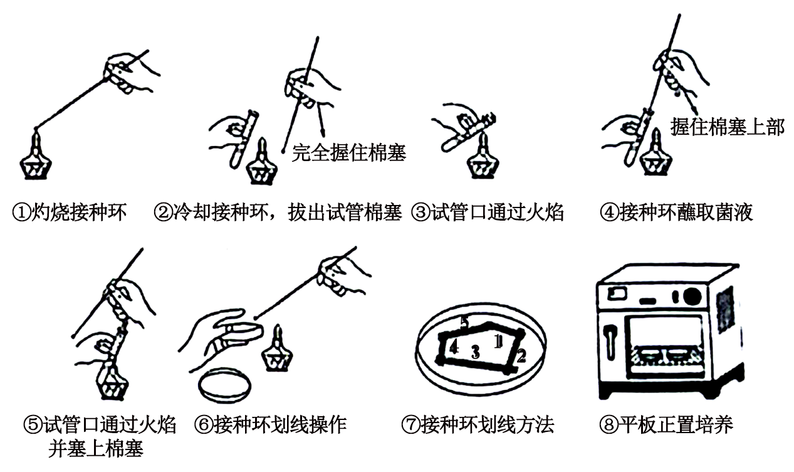
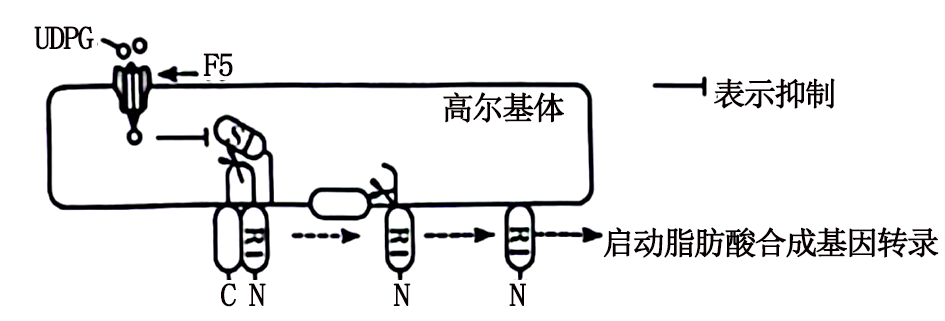
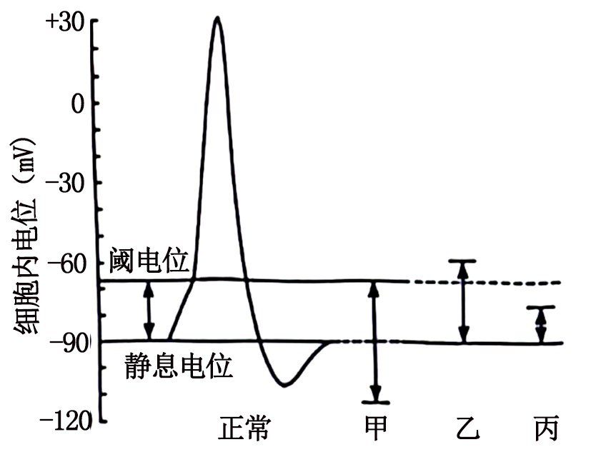
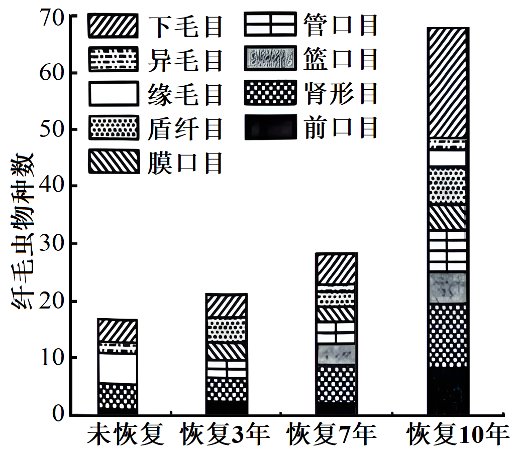
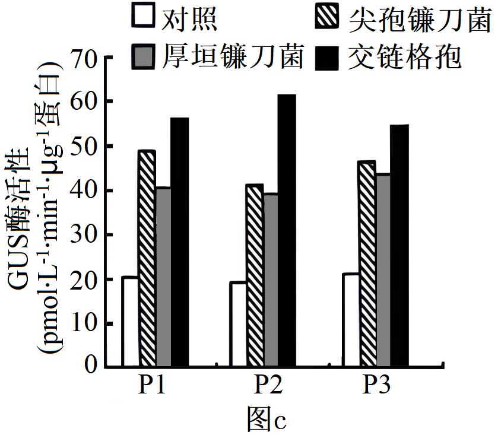

**机密★启用前**

**2024年湖南省普通高中学业水平选择性考试生物学**

**本试卷共8页，22题。全卷满分100分。考试用时75分钟。**

**注意事项：**

**1.答题前，先将自己的姓名、准考证号、考场号、座位号填写在试卷和答题卡上，并认真核准准考证号条形码上的以上信息，将条形码粘贴在答题卡上的指定位置。**

**2.请按题号顺序在答题卡上各题目的答题区域内作答，写在试卷、草稿纸和答题卡上的非答题区域均无效。**

**3.选择题用2B铅笔在答题卡上把所选答案的标号涂黑；非选择题用黑色签字笔在答题卡上作答；字体工整，笔迹清楚。**

**4.考试结束后，请将试卷和答题卡一并上交。**

**一、选择题：本题共12小题，每小题2分，共24分。在每小题组出的四个选项中只有一项是符合题目要求的。**

1\. 细胞膜上的脂类具有重要的生物学功能。下列叙述错误的是（　　）

A. 耐极端低温细菌的膜脂富含饱和脂肪酸

B. 胆固醇可以影响动物细胞膜的流动性

C. 糖脂可以参与细胞表面识别

D. 磷脂是构成细胞膜的重要成分

2\. 抗原呈递细胞（APC）可以通过某类受体识别入侵病原体的独特结构而诱发炎症和免疫反应。下列叙述错误的是（　　）

A. APC的细胞膜上存在该类受体

B. 该类受体也可以在溶酶体膜上

C. 诱发炎症和免疫反应过强可能会引起组织损伤

D. APC包括巨噬细胞、树突状细胞和浆细胞等

3\. 湿地是一种独特的生态系统，是绿水青山的重要组成部分。下列叙述错误的是（　　）

A. 在城市地区建设人工湿地可改善生态环境

B. 移除湖泊中富营养化沉积物有利于生态系统的恢复

C. 移栽适应当地环境的植物遵循了生态工程的协调原理

D. 气温和害虫对湿地某植物种群的作用强度与该种群的密度有关

4\. 部分肺纤维化患者的肺泡上皮细胞容易受损衰老。下列叙述错误的是（　　）

A. 患者肺泡上皮细胞染色体端粒可能异常缩短

B. 患者肺泡上皮细胞可能出现DNA损伤积累

C. 患者肺泡上皮细胞线粒体功能可能增强

D. 患者肺泡上皮细胞中自由基可能增加

5\. 某同学将质粒DNA进行限制酶酶切时，发现DNA完全没有被酶切，分析可能的原因并提出解决方法。下列叙述错误的是（　　）

A. 限制酶失活，更换新的限制酶

B. 酶切条件不合适，调整反应条件如温度和酶的用量等

C. 质粒DNA突变导致酶识别位点缺失，更换正常质粒DNA

D. 酶切位点被甲基化修饰，换用对DNA甲基化不敏感的限制酶

6\. 微生物平板划线和培养的具体操作如图所示，下列操作正确的是（　　）

A. ①②⑤⑥ B. ③④⑥⑦ C. ①②⑦⑧ D. ①③④⑤

7\. 我国科学家成功用噬菌体治疗方法治愈了耐药性细菌引起的顽固性尿路感染。下列叙述错误的是（　　）

A. 运用噬菌体治疗时，噬菌体特异性侵染病原菌

B. 宿主菌经噬菌体侵染后，基因定向突变的几率变大

C. 噬菌体和细菌在自然界长期的生存斗争中协同进化

D. 噬菌体繁殖消耗宿主菌的核苷酸、氨基酸和能量等

8\. 以黑藻为材料探究影响细胞质流动速率的因素，实验结果表明新叶、老叶不同区域的细胞质流动速率不同，且新叶比老叶每个对应区域的细胞质流动速率都高。下列叙述错误的是（　　）

A. 该实验的自变量包括黑藻叶龄及同一叶片的不同区域

B. 细胞内结合水与自由水比值越高，细胞质流动速率越快

C. 材料的新鲜程度、适宜的温度和光照强度是实验成功的关键

D. 细胞质中叶绿体的运动速率可作为细胞质流动速率的指标

9\. 一名甲状腺疾病患者某抗体检测呈阳性，该抗体可与促甲状腺激素（TSH）竞争TSH受体，阻断受体功能。下列叙述错误的是（　　）

A. 该患者可能有怕冷、反应迟钝等症状

B. 该抗体的靶细胞位于垂体上

C. 该患者TSH分泌增多

D. 该患者免疫自稳能力异常

10\. 非酒精性脂肪性肝病是以肝细胞的脂肪变性和异常贮积为病理特征的慢性肝病。葡萄糖在肝脏中以糖原和甘油三酯两种方式储存。蛋白R1在高尔基体膜上先后经S1和S2蛋白水解酶酶切后被激活，进而启动脂肪酸合成基因（核基因）的转录。糖原合成的中间代谢产物UDPG能够通过膜转运蛋白F5进入高尔基体内，抑制S1蛋白水解酶的活性，调控机制如图所示。下列叙述错误的是（　　）

A. 体内多余的葡萄糖在肝细胞中优先转化为糖原，糖原饱和后转向脂肪酸合成

B. 敲除F5蛋白的编码基因会增加非酒精性脂肪肝的发生率

C. 降低高尔基体内UDPG量或S2蛋白失活会诱发非酒精性脂肪性肝病

D. 激活后的R1通过核孔进入细胞核，启动脂肪酸合成基因的转录

11\. 脱落酸（ABA）是植物响应逆境胁迫的信号分子，NaCl和PEG6000（PEG6000不能进入细胞）皆可引起渗透胁迫。图a为某水稻种子在不同处理下基因R的相对表达量变化，图b为该基因的突变体和野生型种子在不同处理下7天时的萌发率。研究还发现无论在正常还是逆境下，基因R的突变体种子中ABA含量皆高于野生型。下列叙述错误的是（　　）

A. NaCl、PEC6000和ABA对种子萌发的调节机制相同

B. 渗透胁迫下种子中内原ABA的含量变化先于基因R的表达变化

C 基因R突变体种子中ABA含量升高可延长种子贮藏寿命

D. 基因R突变可能解除了其对ABA生物合成的抑制作用

12\. 细胞所处内环境变化可影响其兴奋性、膜电位达到阈电位（即引发动作电位的临界值）后，才能产生兴奋。如图所示，甲、乙和丙表示不同环境下静息电位或阈电位的变化情况。下列叙述错误的是（　　）

A. 正常环境中细胞的动作电位峰值受膜内外钠离子浓度差影响

B. 环境甲中钾离子浓度低于正常环境

C. 细胞膜电位达到阈电位后，钠离子通道才开放

D. 同一细胞在环境乙中比丙中更难发生兴奋

**二、选择题：本题共4小题，每小题4分，共16分。在每小题给出的四个选项中，有一项或多项符合题目要求。全部选对的得4分，选对但不全的得2分，有选错的得0分。**

13\. 土壤中纤毛虫的动态变化可反映生态环境的变化。某地实施退耕还林后，10年内不同恢复阶段土壤中纤毛虫物种数情况如图所示。下列叙述错误的是（　　）

A. 统计土壤中某种纤毛虫的具体数目可采用目测估计法

B. 退耕还林期间纤毛虫多样性及各目的种类数不断增加

C. 调查期间土壤纤毛虫丰富度的变化是一种正反馈调节

D. 退耕还林提高了纤毛虫的种群密度和生态系统的稳定性

14\. 缢蛏是我国传统养殖的广盐性贝类之一，自身存在抵抗外界盐度胁迫的渗透调节机制。缢蛏体内游离氨基酸含量随盐度的不同而变化，图为缢蛏在不同盐度下鲜重随培养时间的变化曲线。下列叙述错误的是（　　）

A. 缢蛏在低盐度条件下先吸水，后失水直至趋于动态平衡

B. 低盐度培养8~48h，缢蛏通过自我调节以增加组织中的溶质含量

C. 相同盐度下，游离氨基酸含量高的组织渗透压也高

D. 缢蛏组织中游离氨基酸含量的变化与细胞呼吸有关

15\. 最早的双脱氧测序法是PCR反应体系中，分别再加入一种少量的双脱氧核苷三磷酸（ddATP、ddCTP、ddGTP或ddTTP），子链延伸时，双脱氧核苷三磷酸也遵循碱基互补酸对原则，以加入ddATP的体系为例：若配对的为ddATP，延伸终止；若配对的为脱氧腺苷三磷酸（dATP），继续延伸；PCR产物变性后电泳检测。通过该方法测序某疾病患者及对照个体的一段序列，结果如图所示。下列叙述正确的是（　　）

A. 上述PCR反应体系中只加入一种引物

B. 电泳时产物的片段越小，迁移速率越慢

C. 5'-CTACCCGTGAT-3'为对照个体的一段序列

D. 患者该段序列中某位点的碱基C突变为G

16\. 为研究CO2，O2和H+对呼吸运动的作用（以肺泡通气为检测指标）及其相互影响，进行了相关实验。动脉血中CO2分压（PCO2）、O2分压（PO2）和H+浓度三个因素中，一个改变而另两个保持正常时的肺泡通气效应如图a，一个改变而另两个不加控制时的肺泡通气效应如图b。下列叙述正确的是（　　）

A 一定范围内，增加PCO2、H+浓度和PO2均能增强呼吸运动

B. pH由7.4下降至7.1的过程中，PCO2逐渐降低

C. PO2由60mmHg下降至40mmHg的过程中，PCO2和H+浓度逐渐降低

D. CO2作用于相关感受器，通过体液调节对呼吸运动进行调控

**三、非选择题：本题共5小题，共60分。**

17\. 钾是植物生长发育的必需元素，主要生理功能包括参与酶活性调节、渗透调节以及促进光合产物的运输和转化等。研究表明，缺钾导致某种植物的气孔导度下降，使CO2通过气孔的阻力增大；Rubisco的羧化酶（催化CO2的固定反应）活性下降，最终导致净光合速率下降。回答下列问题：

（1）从物质和能量转化角度分析，叶绿体的光合作用即在光能驱动下，水分解产生\_\_\_\_\_\_\_\_；光能转化为电能，再转化为\_\_\_\_\_\_\_\_中储存的化学能，用于暗反应的过程。

（2）长期缺钾导致该植物的叶绿素含量\_\_\_\_\_\_\_\_，从叶绿素的合成角度分析，原因是\_\_\_\_\_\_\_（答出两点即可）。

（3）现发现该植物群体中有一植株，在正常供钾条件下，总叶绿素含量正常，但气孔导度等其他光合作用相关指标均与缺钾时相近，推测是Rubisco的编码基因发生突变所致。Rubisco由两个基因（包括1个核基因和1个叶绿体基因）编码，这两个基因及两端的DNA序列已知。拟以该突变体的叶片组织为实验材料，以测序的方式确定突变位点。写出关键实验步骤：①\_\_\_\_\_\_\_；②\_\_\_\_\_\_\_；③\_\_\_\_\_\_；④基因测序；⑤\_\_\_\_\_\_。

18\. 色盲可分为红色盲、绿色盲和蓝色盲等。红色肓和绿色盲都为伴X染色体隐性遗传，分别由基因L、M突变所致；蓝色盲属常染色体显性遗传，由基因s突变所致。回答下列问题：

（1）一绿色盲男性与一红色盲女性婚配，其后代可能的表型及比例为\_\_\_\_\_\_\_\_或\_\_\_\_\_\_\_\_；其表型正常后代与蓝色盲患者（Ss）婚配，其男性后代可能的表型及比例为\_\_\_\_\_\_\_（不考虑突变和基因重组等因素）。

（2）1个L与1个或多个M串联在一起，Z是L上游的一段基因间序列，它们在X染色体上的相对位置如图a。为阐明红绿色盲的遗传病因，研究人员将男性红绿色盲患者及对照个体的DNA酶切产物与相应探针杂交，酶切产物Z的结果如图b，酶切产物BL，CL、DL、BM、CM和DM的结果见下表，表中数字表示酶切产物的量。

|     |               |               |               |               |               |               |
|:--- |:------------- |:------------- |:------------- |:------------- |:------------- |:------------- |
|     | BL | CL | DL | BM | CM | DM |
| 对照  | 15.1          | 18.1          | 33.6          | 45.5          | 21.3          | 66.1          |
| 甲   | 0             | 0             | 0             | 21.9          | 10.9          | 61.4          |
| 乙   | 15.0          | 18.5          | 0             | 0             | 0             | 33.1          |
| 丙   | 15.9          | 18.0          | 33.0          | 45.0          | 21.0          | 64.0          |
| 丁   | 16.0          | 18.5          | 33.0          | 45.0          | 21.0          | 65.0          |

①若对照个体在图a所示区域的序列组成为“Z+L+M+M”则患者甲最可能的组成为\_\_\_\_\_\_\_\_（用Z、部分Z，L、部分L，M、部分M表示）。

②对患者丙、丁的酶切产物Z测序后，发现缺失Z1或Z2，这两名患者患红绿色盲的原因是\_\_\_\_\_\_\_。

③本研究表明：红绿色盲的遗传病因是\_\_\_\_\_\_。

19\. 葡萄糖进入胰岛B细胞后被氧化，增加ATP的生成，引起细胞膜上ATP敏感性K+通道关闭，使膜两侧电位差变化，促使Ca2+通道开放，Ca2+内流，刺激胰岛素分泌。进食后，由小肠分泌的肠促胰岛紊（GLP-1和（GIP）依赖于葡萄糖促进胰岛素分泌，称为肠促胰岛素效应。人体内的GLP-1和GIP易被酶D降解，人工研发的类似物功能与GLP-1和GIP一样，但不易被酶D降解。回答下列问题：

（1）胰岛素需要通过\_\_\_\_运输作用于靶细胞。药物甲只能与胰岛B细胞膜表面特异性受体结合，作用于ATP敏感性K+通道，促进胰岛索分泌。使用药物甲后，胰岛B细胞内\_\_\_\_\_\_\_\_（填“K+”“Ca2+”或“K+”和“Ca2+”浓度增大；过量使用会产生严重不良反应，该不良反应可能是\_\_\_\_\_\_\_\_。

（2）与正常人比较，患者A和B的肠促胰岛素效应均减弱，血糖异常升高。使用药物甲后，患者A的血糖得到有效控制，而恩者B血糖无改善，患者B可能有\_\_\_\_\_\_\_\_\_分泌障碍。

（3）研究发现，与正常人比较，患者A的GLP-1表达量较低但其受体数量无变化，而GIP表达量无变化但其受体数量明显下降。若从①GIP类似物②GLP-1类似物③酶D激活剂中筛选治疗患者A的候选新药，首选\_\_\_\_\_\_\_\_（填序号）。若使用该候选药，发生（1）所述不良反应的风险\_\_\_\_\_\_\_（填“大于”“等于”或“小于”）使用药物甲，理由是\_\_\_\_\_\_\_\_。

20\. 土壤中的微生物数量与脲酶活性可反映土壤的肥力状况。为研究不同施肥方式对土壤微生物数量和脲酶活性的影响，试验分组如下：不施肥（CK）、有机肥（M）、化肥（NP）、麦秸还田（S）、有机肥+化肥（M+NP）、麦秸还田+化肥（S+NP），其中，NP中氮肥为尿素，麦秸未经处理直接还田，结果如图所示。回答下列问题：

（1）从生态系统组成成分分析，土壤中的微生物主要属于\_\_\_\_\_\_，施用的肥料属于\_\_\_\_\_。M、NP和S三种施肥方式中，对土壤微生物数量影响最大的是\_\_\_\_\_\_。

（2）研究还表明，与CK组相比，S组小麦产量差异不显著。据图a分析，其原因是\_\_\_\_\_；秸秆可用于生产畜禽饲料和食用菌，畜禽粪便和使用过的食用菌培养基用于还田，该利用方式能降低生态足迹的原因是\_\_\_\_\_\_\_\_。

（3）下列说法错误的是\_\_\_\_\_\_（填序号）。

①合理施肥可以提高氮的循环效率

②施肥可增加土壤微生物数量和脲酶活性

③为提高土壤肥力，短期内施用有机肥比化肥更有效

④施用有机肥时，松土可促进有氧呼吸

21\. 百合具有观赏、食用和药用等多种价值，科研人员对其进行了多种育种技术研究。回答下列问题：

（1）体细胞杂交育种。进行不同种百合体细胞杂交前，先用\_\_\_\_\_\_\_去除细胞壁获得原生质体，使原生质体融合，得到杂种细胞后，继续培养，常用\_\_\_\_\_\_\_（填植物激素名称）诱导愈伤组织形成和分化，获得完整的杂种植株。

（2）单倍体育种。常用\_\_\_\_\_\_\_\_的方法来获得单倍体植株，鉴定百合单倍体植株的方法是\_\_\_\_\_\_\_\_。

（3）基因工程育种。研究人员从野生百合中获得一个抵抗尖孢镰刀菌侵染的基国pL，该基因及其上游的启动子pL和下游的终止子结构如图a。图b是一种Ti质粒的结构示意图，其中基因gus编码CUS酶，GUS酶活性可反映启动子活性。

①研究腐原微生物对L的启动子pL活性的影响。从图a所示结构中获取L，首先选用\_\_\_\_\_\_\_酶切，将其与相同限制酶酶切的Ti质粒连接，再导人烟草。随机选取3组转基因成功的烟草（P1、P2和P3）进行病原微生物胁迫，结果如图c。由此可知：三种病原微生物都能诱导pL的活性增强，其中\_\_\_\_\_\_\_\_的诱导作用最强。

②现发现栽培种百合B中也有L，但其上游的启动子与野生百合不同，且抗病性弱。若要提高该百合中L的表达量，培育具有高抗病原微生物能力的百合新品种，简要写出实验思路\_\_\_\_\_\_\_\_。
