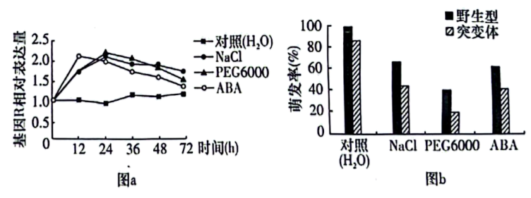
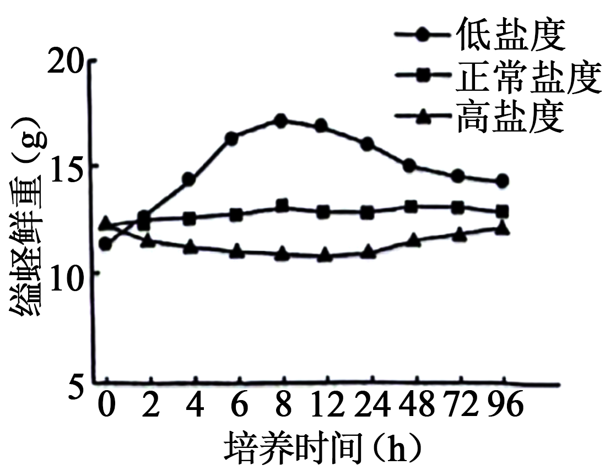
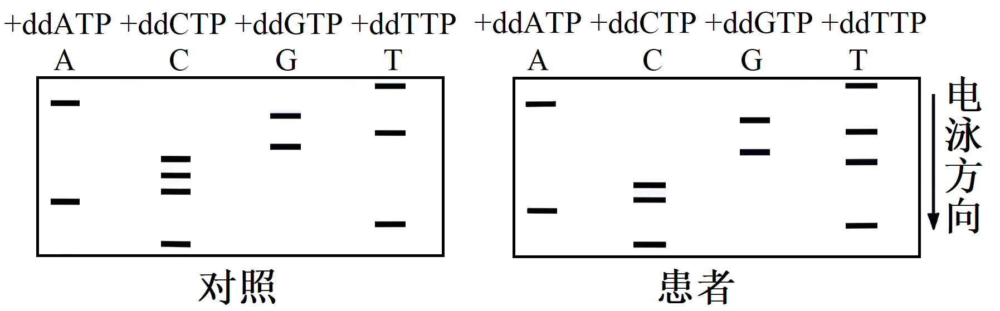
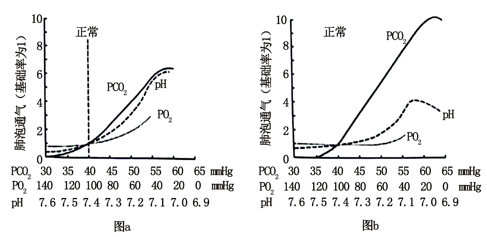
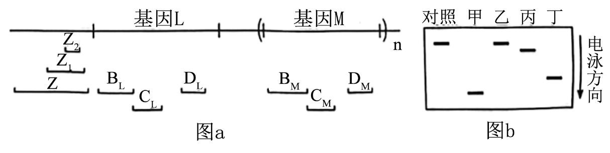
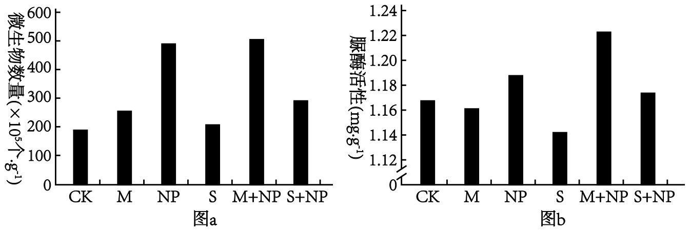
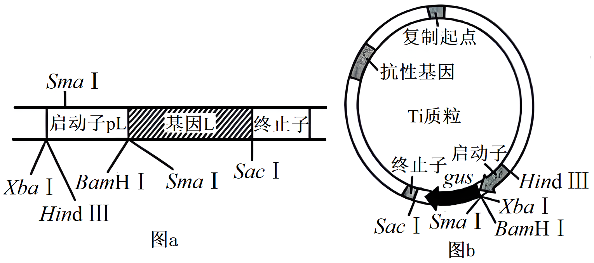

**机密★启用前**

**2024年湖南省普通高中学业水平选择性考试生物学**

**本试卷共8页，22题。全卷满分100分。考试用时75分钟。**

**注意事项：**

**1.答题前，先将自己的姓名、准考证号、考场号、座位号填写在试卷和答题卡上，并认真核准准考证号条形码上的以上信息，将条形码粘贴在答题卡上的指定位置。**

**2.请按题号顺序在答题卡上各题目的答题区域内作答，写在试卷、草稿纸和答题卡上的非答题区域均无效。**

**3.选择题用2B铅笔在答题卡上把所选答案的标号涂黑；非选择题用黑色签字笔在答题卡上作答；字体工整，笔迹清楚。**

**4.考试结束后，请将试卷和答题卡一并上交。**

**一、选择题：本题共12小题，每小题2分，共24分。在每小题组出的四个选项中只有一项是符合题目要求的。**

1\. 细胞膜上的脂类具有重要的生物学功能。下列叙述错误的是（　　）

A. 耐极端低温细菌的膜脂富含饱和脂肪酸

B. 胆固醇可以影响动物细胞膜的流动性

C. 糖脂可以参与细胞表面识别

D. 磷脂是构成细胞膜的重要成分

【答案】A

【解析】

【分析】脂质可以分为脂肪（储能物质，减压缓冲，保温作用）、磷脂（构成生物膜的主要成分）、固醇类物质包括胆固醇（动物细胞膜的成分，参与血液中脂质的运输）、性激素（促进性器官的发育和生殖细胞的产生）和维生素D（促进小肠对钙磷的吸收）。

【详解】A、饱和脂肪酸的熔点较高，容易凝周，耐极端低温细菌的膜脂富含不饱和脂肪酸，A错误；

B、胆固醇是构成动物细胞膜的重要成分，其对于调节膜的流动性具有重要作用，B正确；

C、细胞膜表面的糖类分子可与脂质结合形成糖脂，糖脂与细胞表面的识别、细胞问的信息传递等功能密切相关，C正确；

D、磷脂是构成细胞膜的重要成分，磷脂双分子层构成生物膜的基本支架，D正确。

故选A。

2\. 抗原呈递细胞（APC）可以通过某类受体识别入侵病原体的独特结构而诱发炎症和免疫反应。下列叙述错误的是（　　）

A. APC的细胞膜上存在该类受体

B. 该类受体也可以在溶酶体膜上

C. 诱发炎症和免疫反应过强可能会引起组织损伤

D. APC包括巨噬细胞、树突状细胞和浆细胞等

【答案】D

【解析】

【分析】抗原呈递细胞包括B细胞、树突状细胞和巨噬细胞。

【详解】A、抗原呈递细胞通过细胞表面的受体来识别病原体，因此APC的细胞膜上存在该类受体，A正确；

B、抗原呈递细胞吞噬病原体后，吞噬泡会与溶酶体结合，从而使该类受体出现在溶酶体膜上，B正确；

C、诱发炎症和免疫反应过强时，免疫系统可能攻击自身物质或结构，进而引起组织损伤，C正确；

D、浆细胞不属于抗原呈递细胞，D错误。

故选D。

3\. 湿地是一种独特的生态系统，是绿水青山的重要组成部分。下列叙述错误的是（　　）

A. 在城市地区建设人工湿地可改善生态环境

B. 移除湖泊中富营养化沉积物有利于生态系统的恢复

C. 移栽适应当地环境的植物遵循了生态工程的协调原理

D. 气温和害虫对湿地某植物种群的作用强度与该种群的密度有关

【答案】D

【解析】

【分析】生态工程以生态系系统的自我组织、自我调节为基础，遵循着自生、循环、协调、整体等生态学基本原理。

【详解】A、湿地具有蓄洪防旱、调节区域气候，为动植物提供栖息地等功能，在城市地区建设人工湿地有利于改善生态环境，A正确；

B、移除湖泊中寓营养化沉积物，可改善湖泊水质，有利于生物多样性的保护和生态系统的恢复，B正确；

C、移栽适应当地环境的植物体现了生物与环境的协调与适应，遵循了生态工程的协调原理，C正确；

D、气温等气候因素对种群的作用强度与该种群的密度无关，属于非密度制约因素，D错误。

故选D。

4\. 部分肺纤维化患者的肺泡上皮细胞容易受损衰老。下列叙述错误的是（　　）

A. 患者肺泡上皮细胞染色体端粒可能异常缩短

B. 患者肺泡上皮细胞可能出现DNA损伤积累

C. 患者肺泡上皮细胞线粒体功能可能增强

D. 患者肺泡上皮细胞中自由基可能增加

【答案】C

【解析】

【分析】衰老细胞的特征：（1）细胞内水分减少，细胞萎缩，体积变小，但细胞核体积增大，染色质固缩，染色加深；（2）细胞膜通透性功能改变，物质运输功能降低；（3）细胞色素随着细胞衰老逐渐累积；（4）有些酶的活性降低；（5）呼吸速度减慢，新陈代谢减慢。

【详解】A、根据细胞衰老的端粒学说，染色体中端粒缩短，A正确；

B、染色体中端粒缩短，会造成端粒内侧正常基因的DNA序列受到损伤，细胞活动渐趋异常，导致细胞衰老，B正确；

C、衰老细胞的呼吸速率减慢，表明其线粒体功能可能减弱，C错误；

D、根据细胞衰老的自由基学说，细胞代谢产生的自由基会攻击和破坏细胞内各种执行正常功能的生物分子，引起细胞衰老，D正确。

故选C。

5\. 某同学将质粒DNA进行限制酶酶切时，发现DNA完全没有被酶切，分析可能的原因并提出解决方法。下列叙述错误的是（　　）

A. 限制酶失活，更换新的限制酶

B. 酶切条件不合适，调整反应条件如温度和酶的用量等

C. 质粒DNA突变导致酶识别位点缺失，更换正常质粒DNA

D. 酶切位点被甲基化修饰，换用对DNA甲基化不敏感

【答案】B

【解析】

【分析】酶是活细胞产生的具有催化作用的有机物，大多数是蛋白质，少部分是RNA，酶具有特异性、高效性、易受环境因素影响等特点。限制酶特异性识别并切割DNA上的特定位点。

【详解】A、限制酶失活会使DNA完全不被酶切，此时应更换新的限制酶，A正确；

B、酶切条件不合适通常会使切割效果下降，调整反应条件如温度和PH等，调整酶的用量没有作用，B错误；

C、质粒DNA突变会导致限制酶识别位点缺失，进而造成限制酶无法进行切割，此时应更换为正常质粒，C正确；

D、质粒DNA上酶切位点被甲基化修饰，会导致对DNA甲基化敏感的限制酶无法进行酶切，此时应换用对DNA甲基化不敏感的限制酶，D正确。

故选B。

6\. 微生物平板划线和培养的具体操作如图所示，下列操作正确的是（　　）

A. ①②⑤⑥ B. ③④⑥⑦ C. ①②⑦⑧ D. ①③④⑤

【答案】D

【解析】

【分析】微生物平板划线和培养的过程中要保证始终没有杂菌的污染，接种环、培养基、试管等都需要进行灭菌，实验操作过程应该在酒精灯火焰旁进行。

【详解】由图可知，②中拨出棉塞后应握住棉塞上部；⑥中划线时不能将培养皿的皿盖完全拿开，应只打开一条缝隙；⑦中划线时第5次的划线不能与第1次的划线相连；⑧中平板应倒置培养。

①③④⑤正确，故选D。

7\. 我国科学家成功用噬菌体治疗方法治愈了耐药性细菌引起的顽固性尿路感染。下列叙述错误的是（　　）

A. 运用噬菌体治疗时，噬菌体特异性侵染病原菌

B. 宿主菌经噬菌体侵染后，基因定向突变的几率变大

C. 噬菌体和细菌在自然界长期的生存斗争中协同进化

D. 噬菌体繁殖消耗宿主菌的核苷酸、氨基酸和能量等

【答案】B

【解析】

【分析】噬菌体是一种细菌病毒，噬菌体侵染细菌后，会利用宿主细胞苷酸、氨基酸和能量等来维持自身的生命活动。

【详解】A、噬菌体是一种特异性侵染细菌的病毒，运用噬菌体治疗时，噬菌体特异性侵染病原菌，A正确；

B、基因突变具有不定向性，B错误；

C、噬菌体和细菌在自然界长期的生存斗争中协同进化，C正确；

D、噬菌体作为病毒，侵染细菌后利用宿主细胞的核苷酸、氨基酸和能量等来维持自身的生命活动，D正确。

故选B。

8\. 以黑藻为材料探究影响细胞质流动速率的因素，实验结果表明新叶、老叶不同区域的细胞质流动速率不同，且新叶比老叶每个对应区域的细胞质流动速率都高。下列叙述错误的是（　　）

A. 该实验的自变量包括黑藻叶龄及同一叶片的不同区域

B. 细胞内结合水与自由水比值越高，细胞质流动速率越快

C. 材料的新鲜程度、适宜的温度和光照强度是实验成功的关键

D. 细胞质中叶绿体的运动速率可作为细胞质流动速率的指标

【答案】B

【解析】

【分析】观察细胞质流动选择的材料是黑藻幼嫩的小叶，原因是叶子薄而小，叶绿体较大、数量较少。在适宜的温度和光照强度下，黑藻细胞质的流动速率较快。

【详解】A、该实验的实验目的是探究新叶、老叶不同区域的细胞质流动速率，因此该实验的自变量有黑藻叶龄、同一叶片的不同区域，A正确；

B、新叶比老叶每个对应区域的细胞质流动速率都高，原因新叶比老叶细胞代谢旺盛，而细胞代谢越旺盛，细胞内结合水与自由水的比值越低，B错误；

C、选择新鲜的叶片，在适宜的温度和光照强度下，黑藻细胞质的流动速率较快，实验容易取得成功，C正确；

D、观察细胞质的流动时，常以细胞质基质中叶绿体的运动作为标志，D正确。

故选B。

9\. 一名甲状腺疾病患者某抗体检测呈阳性，该抗体可与促甲状腺激素（TSH）竞争TSH受体，阻断受体功能。下列叙述错误的是（　　）

A. 该患者可能有怕冷、反应迟钝等症状

B. 该抗体的靶细胞位于垂体上

C. 该患者TSH分泌增多

D. 该患者免疫自稳能力异常

【答案】B

【解析】

【分析】下丘脑分泌促甲状腺腺激素释放激素作用于垂体，垂体分泌促甲状腺激素作用于甲状腺，促使甲状腺分泌甲状腺激素，当血液中甲状腺激素达到一定水平时，甲状腺激素通过反馈调节作用于下丘脑和垂体，抑制下丘脑和垂体的分泌活动。

【详解】A、抗体可与促甲状腺激素（TSH）竞争TSH受体，阻断受体功能，从而使甲状腺分泌的甲状腺激素减少，而甲状腺激素具有促进物质代谢和能量转换，提高神经系统兴奋性的作用，因此该患者可能有怕冷、反应迟钝等症状，A正确；

B、促甲状腺激素作用的靶细胞为甲状腺细胞，该抗体可与TSH竞争TSH受体，阻断受体功能，说明该抗体的靶细胞为甲状腺细胞，B错误；

C、在甲状腺激素分泌的过程中，存在分级调节和负反馈调节，该患者的甲状腺激素分泌减少，这会导致垂体分泌的TSH增多，C正确；

D、免疫自稳是指机体清除衰老或损伤的细胞，进行自身调节，维持内环境稳态的功能，正常情况下，免疫系统对自身的抗原物质不产生免疫反应，该病是抗体对甲状腺细胞的受体产生了免疫反应，说明该患者的免疫自稳功能异常，D正确。

故选B。

10\. 非酒精性脂肪性肝病是以肝细胞的脂肪变性和异常贮积为病理特征的慢性肝病。葡萄糖在肝脏中以糖原和甘油三酯两种方式储存。蛋白R1在高尔基体膜上先后经S1和S2蛋白水解酶酶切后被激活，进而启动脂肪酸合成基因（核基因）的转录。糖原合成的中间代谢产物UDPG能够通过膜转运蛋白F5进入高尔基体内，抑制S1蛋白水解酶的活性，调控机制如图所示。下列叙述错误的是（　　）

A. 体内多余的葡萄糖在肝细胞中优先转化为糖原，糖原饱和后转向脂肪酸合成

B. 敲除F5蛋白的编码基因会增加非酒精性脂肪肝的发生率

C. 降低高尔基体内UDPG量或S2蛋白失活会诱发非酒精性脂肪性肝病

D. 激活后的R1通过核孔进入细胞核，启动脂肪酸合成基因的转录

【答案】C

【解析】

【分析】由题干信息可知，蛋白R1需要经过S1和S2蛋白水解酶酶切后才被激活，进而启动脂肪酸合成基因的转录，而糖原合成的中间代谢产物UDPG抑制S1蛋白水解酶的活性，据此可知糖原合成的中间代谢产物UDPG可抑制脂肪酸的合成。

【详解】A、由题干信息可知，糖原合成的中间代谢产物UDPG抑制S1蛋白水解酶的活性，蛋白R1需要经过S1和S2蛋白水解酶酶切后才被激活，进而启动脂肪酸合成基因的转录，据此可知糖原合成的中间代谢产物UDPG可抑制脂肪酸的合成，因此体内多余的葡萄糖在肝细胞中优先转化为糖原，糖原饱和后转向脂肪酸合成，A正确；

B、由题干信息可知，中间代谢产物UDPG通过F5膜转运蛋白进入高尔基体内，抑制S1蛋白水解酶的活性，进而抑制脂肪酸的合成，因此敲除F5蛋白的编码基因有利于脂肪酸的合成，会增加非酒精性脂肪肝的发生率，B正确；

C、由题干信息可知，中间代谢产物UDPG进入高尔基体不利于脂肪酸的合成，降低高尔基体中UDPG量有利于脂肪酸的合成，从而会诱发非酒精性脂肪性肝病；蛋白R1经S1、S2蛋白水解酶酶切后被激活，进而启动脂肪酸合成基因的转录，S2蛋白失活不利于脂肪酸的合成，不会诱发非酒精性脂肪性肝病，C错误；

D、转录发生在细胞核中，因此R1可通过核孔进入细胞核，启动脂肪酸合成基因的转录，D正确。

故选C。

11\. 脱落酸（ABA）是植物响应逆境胁迫的信号分子，NaCl和PEG6000（PEG6000不能进入细胞）皆可引起渗透胁迫。图a为某水稻种子在不同处理下基因R的相对表达量变化，图b为该基因的突变体和野生型种子在不同处理下7天时的萌发率。研究还发现无论在正常还是逆境下，基因R的突变体种子中ABA含量皆高于野生型。下列叙述错误的是（　　）

A. NaCl、PEC6000和ABA对种子萌发的调节机制相同

B. 渗透胁迫下种子中内原ABA的含量变化先于基因R的表达变化

C. 基因R突变体种子中ABA含量升高可延长种子贮藏寿命

D. 基因R突变可能解除了其对ABA生物合成的抑制作用

【答案】A

【解析】

【分析】分析图a，用外源ABA处理，基因R的相对表达量增高，说明ABA可促进基因R的表达；缺失基因R的突变体种子中ABA含量较高，说明基因R的表达又会抑制ABA的合成。

【详解】A、分析图a，用外源ABA处理，基因R的相对表达量增高，说明ABA可促进基因R的表达；缺失基因R的突变体种子中ABA含量较高，说明基因R的表达又会抑制ABA的合成。由题可知，ABA是植物响应逆境胁迫的信号分子，NaCl和PEG6000可以引起渗透胁迫，促进ABA的合成，进而促进基因R的表达，而ABA可以直接促进基因R的表达，因此NaCl、PEC6000和ABA对种子萌发的调节机制不同，A错误；

B、由图a可知，渗透胁迫会先促进内源ABA的合成，内源ABA含量的升高又会促进基因R的表达，B正确；

C、ABA的存在会抑制种子的萌发，因此基因R突变体种子中ABA含盘升高可延长种子贮藏寿命，C正确；

D、无论在正常还是逆境下，基因R突变体种子中ABA的含量皆高于野生型，可能是因为基因R突变解除了其对ABA生物合成的抑制，导致ABA的合成量增加，D正确。

故选A。

12\. 细胞所处的内环境变化可影响其兴奋性、膜电位达到阈电位（即引发动作电位的临界值）后，才能产生兴奋。如图所示，甲、乙和丙表示不同环境下静息电位或阈电位的变化情况。下列叙述错误的是（　　）

A. 正常环境中细胞的动作电位峰值受膜内外钠离子浓度差影响

B. 环境甲中钾离子浓度低于正常环境

C. 细胞膜电位达到阈电位后，钠离子通道才开放

D. 同一细胞在环境乙中比丙中更难发生兴奋

【答案】C

【解析】

【分析】动作电位的形成是Na+内流的结果，Na+的浓度差决定了动作电位的峰值，内外浓度差越大，峰值越大。静息电位的强度与K+的浓度差有关，K+的浓度差越大，静息电位的绝对值越大。负离子例如氯离子的内流会形成抑制作用，导致膜内负电荷增多。

【详解】A、动作电位的产生主要与钠离子顺浓度梯度内流有关，细胞内外钠离子浓度差会影响动作电位峰值，A正确；

B、静息电位的产生主要与钾离子顺浓度梯度外流有关，细胞外钾离子浓度降低时，膜两侧钾离子浓度差增大，钾离子外流增多，静息电位的绝对值增大，环境甲中钾离子浓度低于正常环境，B正确；

C、细胞膜电位达到阈电位前，钠离子通道就已经开放，C错误；

D、分析题图可知，与环境丙相比，细胞在环境乙中阈电位与静息电位的差值更大，受到刺激后更难发生兴奋，D正确。

故选C

**二、选择题：本题共4小题，每小题4分，共16分。在每小题给出的四个选项中，有一项或多项符合题目要求。全部选对的得4分，选对但不全的得2分，有选错的得0分。**

13\. 土壤中纤毛虫的动态变化可反映生态环境的变化。某地实施退耕还林后，10年内不同恢复阶段土壤中纤毛虫物种数情况如图所示。下列叙述错误的是（　　）

A. 统计土壤中某种纤毛虫的具体数目可采用目测估计法

B. 退耕还林期间纤毛虫多样性及各目的种类数不断增加

C. 调查期间土壤纤毛虫丰富度变化是一种正反馈调节

D. 退耕还林提高了纤毛虫的种群密度和生态系统的稳定性

【答案】ABD

【解析】

【分析】据图分析，某地实施退耕还林后，10年内不同恢复阶段土壤中纤毛虫物种数在不断增加。

【详解】A、利用目测估计法只能确定某种纤毛虫的相对数量，A错误；

B、分析题图可知，退耕还林期间纤毛虫的多样性增加，但某些目的种类数会出现波动，B错误；

C、土壤纤毛虫丰富度增大，有利于改善生态环境，而生态环境的改善又会进一步增大纤毛虫的丰富度，这是一种正反馈调节，C正确；

D、仅根据题干信息，无法得知退耕还林对纤毛虫种群密度的影响，D错误。

故选ABD。

14\. 缢蛏是我国传统养殖的广盐性贝类之一，自身存在抵抗外界盐度胁迫的渗透调节机制。缢蛏体内游离氨基酸含量随盐度的不同而变化，图为缢蛏在不同盐度下鲜重随培养时间的变化曲线。下列叙述错误的是（　　）

A. 缢蛏在低盐度条件下先吸水，后失水直至趋于动态平衡

B. 低盐度培养8~48h，缢蛏通过自我调节以增加组织中的溶质含量

C. 相同盐度下，游离氨基酸含量高的组织渗透压也高

D. 缢蛏组织中游离氨基酸含量的变化与细胞呼吸有关

【答案】B

【解析】

【分析】分析题意，图为缢蛏在不同盐度下鲜重随培养时间的变化曲线，实验的自变量是培养时间和盐浓度，因变量是鲜重，据此分析作答。

【详解】A、分析图中曲线，缢蛏在低盐度条件下鲜重先增大后减小，说明其先吸水后失水，最后趋于动态平衡，A正确；

B、低盐度培养时，缢蛏组织渗透压大于外界环境，导致缢蛏吸水，为恢复正常状态，缢蛏应通过自我调节使组织中的溶质含量减少，从而降低组织渗透压，引起组织失水，B错误；

C、组织渗透压的高低与其中的溶质含量有关，溶质越多，渗透压相对越高，因此，相同盐度下，游离氨基酸含量高的组织渗透压也高，C正确；

D、细胞呼吸过程中产生的中间产物可转化为氨基酸、甘油等非糖物质，由此推测缢蛏组织中游离氨基酸含量的变化与细胞呼吸有关，D正确。

故选B。

15\. 最早的双脱氧测序法是PCR反应体系中，分别再加入一种少量的双脱氧核苷三磷酸（ddATP、ddCTP、ddGTP或ddTTP），子链延伸时，双脱氧核苷三磷酸也遵循碱基互补酸对原则，以加入ddATP的体系为例：若配对的为ddATP，延伸终止；若配对的为脱氧腺苷三磷酸（dATP），继续延伸；PCR产物变性后电泳检测。通过该方法测序某疾病患者及对照个体的一段序列，结果如图所示。下列叙述正确的是（　　）

A. 上述PCR反应体系中只加入一种引物

B. 电泳时产物的片段越小，迁移速率越慢

C. 5'-CTACCCGTGAT-3'为对照个体的一段序列

D. 患者该段序列中某位点的碱基C突变为G

【答案】AC

【解析】

【分析】1、PCR技术：

（1）概念：PCR全称为聚合酶链式反应，是一项在生物体外复制特定DNA的核酸合成技术。

（2）原理：DNA复制。

（3）前提条件：要有一段已知目的基因的核苷酸序以便合成一对引物。

（4）条件：模板DNA、四种脱氧核苷酸、一对引物、热稳定DNA聚合酶（Taq酶）。

（5）过程：①高温变性：DNA解旋过程（PCR扩增中双链DNA解开不需要解旋酶，高温条件下氢键可自动解开）；低温复性：引物结合到互补链DNA上；③中温延伸：合成子链。

2、双脱氧测序法的原理：在DNA聚合酶、引物、四种单脱氧核苷酸（dNTP）存在的情况下，如果在四管反应系统中再分别加入四种双脱氧核苷三磷酸（ ddNTP），DNA链合成反应过程中 ddNTP与dNTP处于一种竞争状态，即新合成DNA链既可能掺入正常dNTP，也可能掺入ddNTP并使新合成链终止延伸。这样在每个反应系统中形成的产物是一系列长度不等的多核苷酸片段，这些片段具有相同的起点，即引物的5'端，但有不同的ddNTP终端。 在结束反应后，用四个泳道进行电泳，分别分离各组反应体系中不同长度的DNA 片段，检测DNA片段终止末端位置的碱基种类，从自显影图谱中直接读取到与模板相匹配的新的链序。

【详解】A、利用双脱氧测序法时，PCR反应体系中加入的模板是待测的单链DNA，故只需加入一种引物，A正确；

B、电泳时，产物的片段越大，迁移速率越慢。B错误；

C、依据分析中双脱氧测序法的原理，可以确定每个泳道中的条带（DNA片段）的3'终端的碱基，如+ddATP的泳道中出现的条带（DNA片段）的3'终端碱基就是A。另外由于每个片段的起始点相同，但终止点不同，因此可以通过比较片段的长度来确定DNA序列中每个位置上的碱基；图示电泳方向为从上→下，即对应的DNA片段为长→短，则对应的DNA测序结果为3'→5'，如对照个体的电泳结果最短的条带为+ddCTP泳道组的条带，则说明该DNA片段5'端第一个碱基为C；因此对照个体的测序结果为5'-CTACCCGTGAT-3'，患者的测序结果为5'-CTACCTGTGAT-3'，C正确；

D、对比患者和对照个体的测序结果可知，患者该段序列中某位点的碱基C突变为T，D错误。

故选AC。

16\. 为研究CO2，O2和H+对呼吸运动的作用（以肺泡通气为检测指标）及其相互影响，进行了相关实验。动脉血中CO2分压（PCO2）、O2分压（PO2）和H+浓度三个因素中，一个改变而另两个保持正常时的肺泡通气效应如图a，一个改变而另两个不加控制时的肺泡通气效应如图b。下列叙述正确的是（　　）

A. 一定范围内，增加PCO2、H+浓度和PO2均能增强呼吸运动

B. pH由7.4下降至7.1的过程中，PCO2逐渐降低

C. PO2由60mmHg下降至40mmHg的过程中，PCO2和H+浓度逐渐降低

D. CO2作用于相关感受器，通过体液调节对呼吸运动进行调控

【答案】BC

【解析】

【分析】正常机体通过调节作用，使各个器官、系统协调活动，共同维持内环境的相对稳定状态叫作稳态。稳态不是恒定不变，而是一种动态的平衡，神经-体液-免疫调节网络是机体维持稳态的主要调节机制。

【详解】A、根据图a分析，一定范围内，增加PCO2，H+浓度及降低PO2均能增大肺泡通气，增强呼吸运动，A错误；

B、pH由7.4下降至7.1时，与图a相比，图b中相应曲线增加幅度减小，应是通过PCO2降低和PO2升高对肺泡通气进行了调节，B正确；

C、PO2由60mmHg下降至40mmHg时，与图a相比，图b中相应曲线增加幅度减小，应是通过PCO2降低和pH升高（H+浓度降低）对肺泡通气进行了调节，C正确；

D、CO2作用于相关感受器，通过神经调节对呼吸运动进行调控，D错误。

故选BC。

**三、非选择题：本题共5小题，共60分。**

17\. 钾是植物生长发育的必需元素，主要生理功能包括参与酶活性调节、渗透调节以及促进光合产物的运输和转化等。研究表明，缺钾导致某种植物的气孔导度下降，使CO2通过气孔的阻力增大；Rubisco的羧化酶（催化CO2的固定反应）活性下降，最终导致净光合速率下降。回答下列问题：

（1）从物质和能量转化角度分析，叶绿体的光合作用即在光能驱动下，水分解产生\_\_\_\_\_\_\_\_；光能转化为电能，再转化为\_\_\_\_\_\_\_\_中储存的化学能，用于暗反应的过程。

（2）长期缺钾导致该植物的叶绿素含量\_\_\_\_\_\_\_\_，从叶绿素的合成角度分析，原因是\_\_\_\_\_\_\_（答出两点即可）。

（3）现发现该植物群体中有一植株，在正常供钾条件下，总叶绿素含量正常，但气孔导度等其他光合作用相关指标均与缺钾时相近，推测是Rubisco的编码基因发生突变所致。Rubisco由两个基因（包括1个核基因和1个叶绿体基因）编码，这两个基因及两端的DNA序列已知。拟以该突变体的叶片组织为实验材料，以测序的方式确定突变位点。写出关键实验步骤：①\_\_\_\_\_\_\_；②\_\_\_\_\_\_\_；③\_\_\_\_\_\_；④基因测序；⑤\_\_\_\_\_\_。

【答案】（1） ①. O2和H+ ②. ATP和NADPH

（2） ①. 减少缺钾会使叶绿素合成相关酶的活性降低 ②. 缺钾会影响细胞的渗透调节，进而影响细胞对Mg、N等的吸收，使叶绿素合成减少

（3） ①. 分别提取该组织细胞的细胞核DNA和叶绿体DNA ②. 根据编码Rubisco的两个基因的两端DNA序列设计相应引物 ③. 利用提取的DNA和设计的引物分别进行PCR扩增并电泳 ④. 和已知基因序列进行比较

【解析】

【分析】光合作用包括光反应和暗反应阶段：

1、光反应阶段是在类囊体的薄膜上进行的。叶绿体中光合色素吸收的光能将水分解为氧和H+，氧直接以氧分子的形式释放出去，H+与氧化型辅酶Ⅱ（NADP+）结合，形成还原型辅酶Ⅱ（NADPH）。还原型辅酶Ⅱ作为活泼的还原剂，参与暗反应阶段的化学反应，同时也储存部分能量供暗反应阶段利用；在有关酶的催化作用下，提供能量促使ADP与Pi反应形成ATP。

2、暗反应在叶绿体基质中进行，在特定酶的作用下，二氧化碳与五碳化合物结合，形成两个三碳化合物。在有关酶的催化作用下，三碳化合物接受ATP和NADPH释放的能量，并且被NADPH还原。一些接受能量并被还原的三碳化合物，在酶的作用下经过一系列的反应转化为糖类；另一些接受能量并被还原的三碳化合物，经过一系列变化，又形成五碳化合物。

【小问1详解】

植物光反应过程中水的光解会产生O2和H+，H+和NADP+结合产生NADPH。该过程中光能转化为电能，电能再转化为储存在ATP和NADPH中的化学能。

【小问2详解】

长期缺钾导致该植物的叶绿素含量降低，其原因是钾参与酶活性的调节，缺钾会降低叶绿素合成相关酶的活性；钾参与渗透调节，缺钾会影响细胞渗透压，进而影响细胞对Mg、N等的吸收，而Mg和N是合成叶绿素的原料，因此最终会影响叶绿素的合成。

【小问3详解】

Rubisco由两个基因编码，这两个基因及两端的DNA序列已知，因此检测其是否突变的基本思路利利用PCR技术扩增突变体的相应基因，测序后和已知序列进行比较。其具体步骤为：①分别提取该组织细胞的细胞核DNA和叶绿体DNA；②根据编码Rubisco的两个基因的两端DNA序列设计相应引物；③利用提取的DNA和设计的引物分别进行PCR扩增并电泳；④基因测序；⑤和已知基因序列进行比较。

18\. 色盲可分为红色盲、绿色盲和蓝色盲等。红色肓和绿色盲都为伴X染色体隐性遗传，分别由基因L、M突变所致；蓝色盲属常染色体显性遗传，由基因s突变所致。回答下列问题：

（1）一绿色盲男性与一红色盲女性婚配，其后代可能的表型及比例为\_\_\_\_\_\_\_\_或\_\_\_\_\_\_\_\_；其表型正常后代与蓝色盲患者（Ss）婚配，其男性后代可能的表型及比例为\_\_\_\_\_\_\_（不考虑突变和基因重组等因素）。

（2）1个L与1个或多个M串联在一起，Z是L上游的一段基因间序列，它们在X染色体上的相对位置如图a。为阐明红绿色盲的遗传病因，研究人员将男性红绿色盲患者及对照个体的DNA酶切产物与相应探针杂交，酶切产物Z的结果如图b，酶切产物BL，CL、DL、BM、CM和DM的结果见下表，表中数字表示酶切产物的量。

|     |               |               |               |               |               |               |
|:--- |:------------- |:------------- |:------------- |:------------- |:------------- |:------------- |
|     | BL | CL | DL | BM | CM | DM |
| 对照  | 15.1          | 18.1          | 33.6          | 45.5          | 21.3          | 66.1          |
| 甲   | 0             | 0             | 0             | 21.9          | 10.9          | 61.4          |
| 乙   | 15.0          | 18.5          | 0             | 0             | 0             | 33.1          |
| 丙   | 15.9          | 18.0          | 33.0          | 45.0          | 21.0          | 64.0          |
| 丁   | 16.0          | 18.5          | 33.0          | 45.0          | 21.0          | 65.0          |

①若对照个体在图a所示区域的序列组成为“Z+L+M+M”则患者甲最可能的组成为\_\_\_\_\_\_\_\_（用Z、部分Z，L、部分L，M、部分M表示）。

②对患者丙、丁的酶切产物Z测序后，发现缺失Z1或Z2，这两名患者患红绿色盲的原因是\_\_\_\_\_\_\_。

③本研究表明：红绿色盲的遗传病因是\_\_\_\_\_\_。

【答案】（1） ①. 正常女性∶红色盲男性=1∶1 ②. 正常女性∶绿色盲女性∶红色盲男性∶红绿色盲男性=1∶1∶1∶1 ③. 红蓝色盲∶绿蓝色盲∶红色盲∶绿色盲=1∶1∶1∶1

（2） ①. 部分Z+M+部分M ②. Z发生突变，导致L、M基因无法表达 ③. L、M基因的共用调控序列发生突变或L、M基因发生基因突变

【解析】

【分析】伴性遗传是指在遗传过程中的子代部分性状由性染色体上的基因控制，这种由性染色体上的基因所控制性状的遗传上总是和性别相关，这种与性别相关联的性状遗传方式就称为伴性遗传。

【小问1详解】

根据题意分析，绿色盲男性的基因型为XLmY，红色盲女性的基因型为XLmXLm或XLmMXlm，若该女性的基因型为XLMXLM，则后代的基因型及比例为XLmXLM∶XLMY=1∶1,表型及比例为正常女性∶红色盲男性=1∶1；若该女性的基因型为XLMXlM，则后代的基因型及比例为XlmXlm∶XlmXlm∶XLmY∶XlmY=1∶1∶1∶1表型及比例为正常女性∶绿色盲女性∶红色盲男性∶红绿色盲男性=1∶1∶1∶1.无论哪种情况，后代的正常个体只有女性，且基因型为XLmXLm，若同时考虑蓝色盲，其基因型为aaXLmXLm，而蓝色盲男性的基因型为SxXLmY，两者婚配，其男性后代的基因型及比例为SsXLmY∶SxXLMY∶ssXLmY=1∶1∶1∶1，表型及比例为绿蓝色盲∶红蓝色盲∶绿色盲∶红色盲=1∶1∶1∶1。

【小问2详解】

①根据对照组的实验结果可知，对照组的序列组成为Z+L+M+M，患者甲的Z序列的电泳结果和对照组不同，且电泳距离更远，因此片段较小，只具有部分Z片段；患者甲BL、CL和DL均缺失，因此不含L片段；对照组含有两个M片段，其BM、CM和DM的量分别为45.5、21.3和66.1，而患者甲BM、CM和DM的量分别为21.9、10.9和61.4，其BM、CM的量为对照组的一半，而DM的量和对照组相差不大，因此患者甲含有一个完整的M片段和第二个M片段的DM区，因此其序列组成表示为部分Z+M+部分M。

②患者丙和患者丁的L和M片段的相关结果和对照组无差异，但缺失Z1或Z2，说明Z1和Z2的缺失会影响L和M基因的表达，从而使机体患病，因此其患病的原因是Z发生突变，导致L、M基因无法表达。

③结合①②的结果并分析甲、乙、丙和丁的检测结果可知，红绿色盲的遗传病因是L、M基因的共用调控序列发生突变或L、M基因发生基因突变。

19\. 葡萄糖进入胰岛B细胞后被氧化，增加ATP的生成，引起细胞膜上ATP敏感性K+通道关闭，使膜两侧电位差变化，促使Ca2+通道开放，Ca2+内流，刺激胰岛素分泌。进食后，由小肠分泌的肠促胰岛紊（GLP-1和（GIP）依赖于葡萄糖促进胰岛素分泌，称为肠促胰岛素效应。人体内的GLP-1和GIP易被酶D降解，人工研发的类似物功能与GLP-1和GIP一样，但不易被酶D降解。回答下列问题：

（1）胰岛素需要通过\_\_\_\_运输作用于靶细胞。药物甲只能与胰岛B细胞膜表面特异性受体结合，作用于ATP敏感性K+通道，促进胰岛索分泌。使用药物甲后，胰岛B细胞内\_\_\_\_\_\_\_\_（填“K+”“Ca2+”或“K+”和“Ca2+”浓度增大；过量使用会产生严重不良反应，该不良反应可能是\_\_\_\_\_\_\_\_。

（2）与正常人比较，患者A和B的肠促胰岛素效应均减弱，血糖异常升高。使用药物甲后，患者A的血糖得到有效控制，而恩者B血糖无改善，患者B可能有\_\_\_\_\_\_\_\_\_分泌障碍。

（3）研究发现，与正常人比较，患者A的GLP-1表达量较低但其受体数量无变化，而GIP表达量无变化但其受体数量明显下降。若从①GIP类似物②GLP-1类似物③酶D激活剂中筛选治疗患者A的候选新药，首选\_\_\_\_\_\_\_\_（填序号）。若使用该候选药，发生（1）所述不良反应的风险\_\_\_\_\_\_\_（填“大于”“等于”或“小于”）使用药物甲，理由是\_\_\_\_\_\_\_\_。

【答案】（1） ①. 体液 ②. K+和Ca2+ ③. 机体出现低血糖症状

（2）胰岛素 （3） ①. ② ②. 小于 ③. GLP-1发挥作用依赖于葡萄糖，当胰岛素分泌导致血糖浓度下降时，GLP-1不会持续发挥作用

【解析】

【分析】血糖来源：食物中糖类的消化吸收；肝糖原分解；脂肪等非糖类物质转化；血糖去向：氧化分解；合成糖原；转化为脂肪、某些氨基酸等。胰岛素和胰高血糖素可共同调控血糖平衡。

【小问1详解】

胰岛素是一种激素，在体内激素通过体液运输到身体各处发挥作用。由题可知，胰岛索分泌时ATP敏感性K+通道关闭，Ca2+通道开放。药物甲只能与胰岛B细胞膜表面特异性受体结合，促进胰岛素分泌，因此会减少K+外流，同时会促进Ca2+内流，从而导致细胞内的K+和Ca2+浓度都增大。过量使用药物甲会促使胰岛索大量释放，从而使得血糖浓度持续下降。导致机体可能出现低血糖症状。

【小问2详解】

药物甲的作用是促进胰岛索的分泌，使用药物甲后血糖浓度无改善，说明对于该患者药物甲丧失促使胰岛素分泌的作用，因此患者B可能有胰岛素分泌障碍。

【小问3详解】

根据题意分析，该患者体内的GLP-1表达量较低，即含量少，因此可以选择GLP-1类似物；患者GIP表达量无变化，因此使用GIP类似物不会有明显的改善作用；使用酶D激活剂会促使GLP-1和GIP的降解，不利用疾病的治疗。因此，首选的药物是GLP-1类似物。使用GLP-1类似物一般不会导致低血糖症，其原因是GLP-1发挥作用依赖于葡萄糖，当胰岛索分泌导致血糖浓度下降时，GLP-1不会持续发挥作用，因此不会引起胰岛索持续分泌。避免了低血糖症的发生。

20\. 土壤中的微生物数量与脲酶活性可反映土壤的肥力状况。为研究不同施肥方式对土壤微生物数量和脲酶活性的影响，试验分组如下：不施肥（CK）、有机肥（M）、化肥（NP）、麦秸还田（S）、有机肥+化肥（M+NP）、麦秸还田+化肥（S+NP），其中，NP中氮肥为尿素，麦秸未经处理直接还田，结果如图所示。回答下列问题：

（1）从生态系统组成成分分析，土壤中的微生物主要属于\_\_\_\_\_\_，施用的肥料属于\_\_\_\_\_。M、NP和S三种施肥方式中，对土壤微生物数量影响最大的是\_\_\_\_\_\_。

（2）研究还表明，与CK组相比，S组小麦产量差异不显著。据图a分析，其原因是\_\_\_\_\_；秸秆可用于生产畜禽饲料和食用菌，畜禽粪便和使用过的食用菌培养基用于还田，该利用方式能降低生态足迹的原因是\_\_\_\_\_\_\_\_。

（3）下列说法错误的是\_\_\_\_\_\_（填序号）。

①合理施肥可以提高氮的循环效率

②施肥可增加土壤微生物数量和脲酶活性

③为提高土壤肥力，短期内施用有机肥比化肥更有效

④施用有机肥时，松土可促进有氧呼吸

【答案】（1） ①. 分解者 ②. 非生物的物质和能量 ③. NP

（2） ①. 麦秸还田对微生物的数量几乎没有影响，不能增加土壤中营养成分的含量 ②. 实现物质和能量的多级利用，提高能量利用率，减少人类对生态和环境的影响

（3）②③

【解析】

【分析】图a分析，与不施肥作对比，施用有机肥（M）、化肥（NP）、麦秸还田（S）、有机肥+化肥（M+NP）、麦秸还田+化肥（S+NP），均能在一定程度上增加微生物数量。图b分析，与对照组相比，化肥（NP）、有机肥+化肥（M+NP）、麦秸还田+化肥（S+NP）能够在一定程度上提高脲酶的活性。

【小问1详解】

生态系统的组成成分包括生物成分和非生物成分，生物成分包括生产者、消费者和分解者，非生物成分包括非生物的物质和能量。分解者能将动植物遗体和动物的排遗物分解成无机物，土壤中的微生物的作用主要是将有机物分解为无机物，因此主要属于分解者；

施用的肥料属于非生物的物质和能量。根据图a可知，与CK相比，M、NP和S三种施肥方式中对土壤微生物效援影响最大的是NP。

【小问2详解】

已知S组施用的麦秸未经处理，从图a的结果可以看出，与CK组相比，S组对微生物的数量几乎没有影响，不能增加土壤中营养成分的含量，导致小麦产量差异不显著。

秸秆用于生产畜禽饲料和食用菌，畜禽粪便和使用过的食用菌培养基用于还田，这种利用方式实现了物质和能量的多级利用，可提高能量的利用率，从而减少了人类对生态和环境的影响，降低了生存所需的生产资源和吸纳废物的土地与水域的面积，导致生态足迹降低。

【小问3详解】

根据图示信息，合理施肥可以增加土壤中微生物的数量和脲酶的活性，从而提高氮的循环效率，①正确；

施肥的方法不同，土壤微生物数量和脲酶活性也存在差异，麦秸还田对土壤微生物的数量几乎没有影响，并可降低脲酶活性，②错误；

为提高土壤肥力，短期内施用化肥比有机肥更有效，因为使用化肥后土壤微生物数量增加速度和脲酶活性增大的幅度都最大，③错误；

施用有机肥时，松土可增加土壤中的空气含量，利于土壤中需氧微生物的有氧呼吸，促进有机肥的分解利用，④正确。

21\. 百合具有观赏、食用和药用等多种价值，科研人员对其进行了多种育种技术研究。回答下列问题：

（1）体细胞杂交育种。进行不同种百合体细胞杂交前，先用\_\_\_\_\_\_\_去除细胞壁获得原生质体，使原生质体融合，得到杂种细胞后，继续培养，常用\_\_\_\_\_\_\_（填植物激素名称）诱导愈伤组织形成和分化，获得完整的杂种植株。

（2）单倍体育种。常用\_\_\_\_\_\_\_\_的方法来获得单倍体植株，鉴定百合单倍体植株的方法是\_\_\_\_\_\_\_\_。

（3）基因工程育种。研究人员从野生百合中获得一个抵抗尖孢镰刀菌侵染的基国pL，该基因及其上游的启动子pL和下游的终止子结构如图a。图b是一种Ti质粒的结构示意图，其中基因gus编码CUS酶，GUS酶活性可反映启动子活性。

①研究腐原微生物对L的启动子pL活性的影响。从图a所示结构中获取L，首先选用\_\_\_\_\_\_\_酶切，将其与相同限制酶酶切的Ti质粒连接，再导人烟草。随机选取3组转基因成功的烟草（P1、P2和P3）进行病原微生物胁迫，结果如图c。由此可知：三种病原微生物都能诱导pL的活性增强，其中\_\_\_\_\_\_\_\_的诱导作用最强。

②现发现栽培种百合B中也有L，但其上游的启动子与野生百合不同，且抗病性弱。若要提高该百合中L的表达量，培育具有高抗病原微生物能力的百合新品种，简要写出实验思路\_\_\_\_\_\_\_\_。

【答案】（1） ①. 纤维素酶和果胶酶 ②. 生长素和细胞分裂素

（2） ①. 花药离体培养 ②. 利用显微镜观察根尖有丝分裂中期细胞中染色体的数目

（3） ①. HindⅢ、BamHⅠ ②. 交链格孢 ③. 利用转基因技术将百合B中L基因的启动子替换为野生百合中L基因的启动子pL

【解析】

【分析】植物体细胞杂交的基本过程是：首先用酶解法获得原生质体，然后通过一定的技术手段如电刺激、离心、振荡、聚乙二醇等诱导，实现原生质体的融合。只要将水解酶去除，融合的原生质体经培养后，能很快再生出新的细胞壁，形成杂种细胞。杂种细胞具有全能性，经过培养能进一步分裂、分化，进而发育成完整的植株。

【小问1详解】

因植物细胞细胞壁的成分主要是纤维素和果胶，因此获得原生质体的方法是用纤维素酶和果胶酶对植物细胞进行处理。得到原生质体后使原生质体融合，形成杂种细胞，再用生长素和细胞分裂素诱导愈伤组织形成和分化，从而获得完整的杂种植株。

【小问2详解】

获得单倍体植株的常用方法是花药（花粉）离体培养；鉴定百合单倍体植株的方法是利用显微镜观察根尖有丝分裂中期细胞中染色体的数目，如果染色体数目减少一半，则获得的植株即为单倍体植株。

【小问3详解】

根据目的片段以及质粒上限制酶的识别位点，若要获得pL并连接到质粒上，可选用限制酶HindⅢ、BamHⅠ进行酶切，以替换Ti质粒中的启动子，从而达到根据GUS酶活性反映启动子活性的目的。根据图c的结果可知，交链格孢处理的每一组转基因烟草中的GUS酶活性都最高，可确定其诱导作用最强。欲培育具有高抗病原微生物能力的百合新品种，可利用转基因技术将百合B中L基因的启动子替换为野生百合中L基因的启动子pL。
