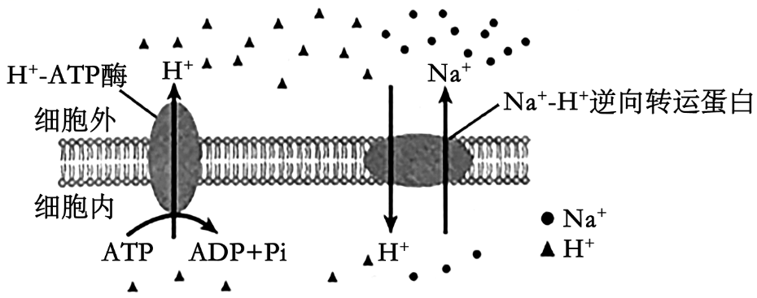
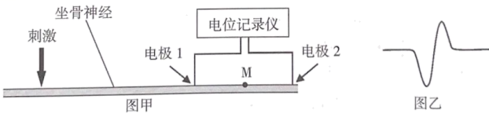
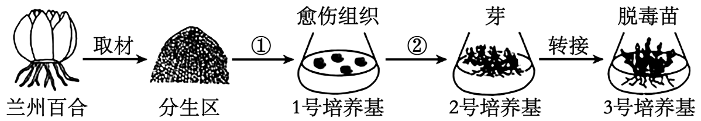
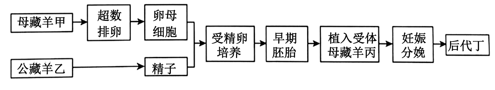
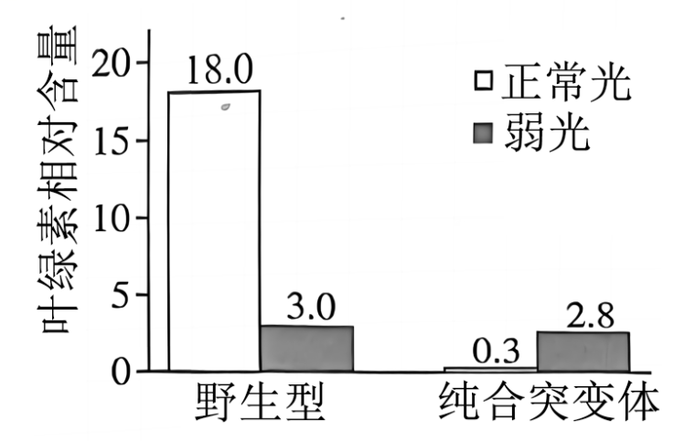
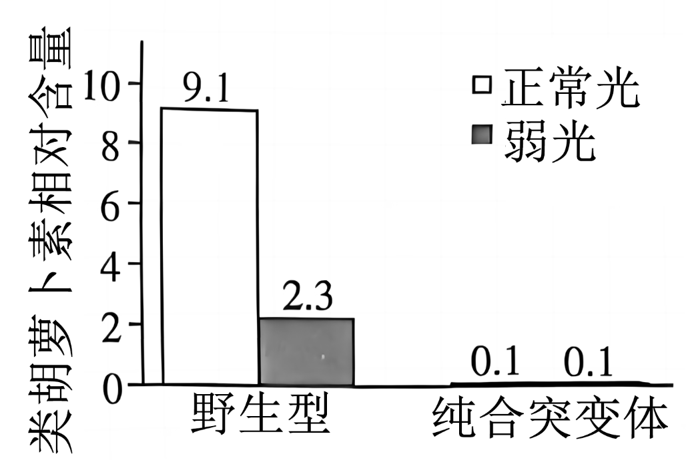
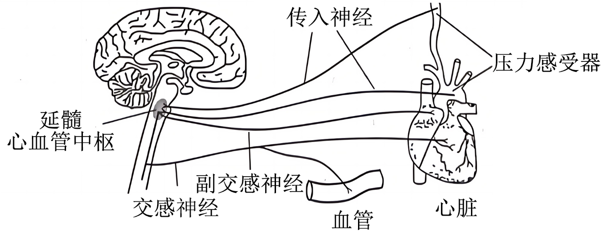
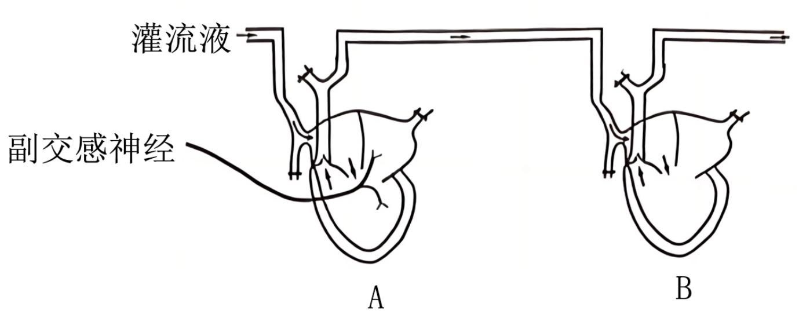
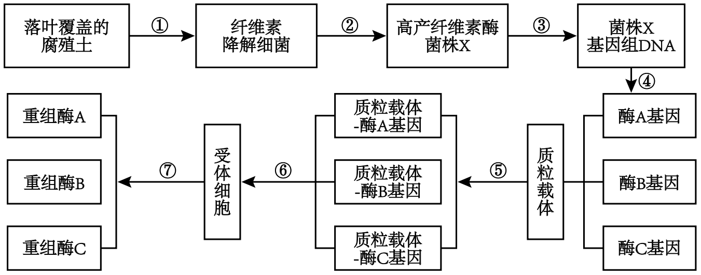

**2024年甘肃省普通高校招生统一考试**

**生物学**

**注意事项：**

**1.答卷前，考生务必将自己的姓名、准考证号填写在答题卡上。**

**2.回答选择题时，选出每小题答案后，用2B铅笔把答题卡上对应题目的答案标号框涂黑。如需改动，用橡皮擦干净后，再选涂其它答案标号框。回答非选择题时，将答案写在答题卡上。写在本试卷上无效。**

**3.考试结束后，将本试卷和答题卡一并交回。**

**一、选择题：本题共16小题，每小题3分，共48分。在每小题给出的四个选项中，只有一项是符合题目要求的。**

1\. 甘肃陇南的“武都油橄榄”是中国国家地理标志产品，其果肉呈黄绿色，子叶呈乳白色，均富含脂肪。由其生产的橄榄油含有丰富的不饱和脂肪酸，可广泛用于食品、医药和化工等领域。下列叙述错误的是（ ）

A. 不饱和脂肪酸的熔点较低，不容易凝固，橄榄油在室温下通常呈液态

B. 苏丹Ⅲ染液处理油橄榄子叶，在高倍镜下可观察到橘黄色的脂肪颗粒

C. 油橄榄种子萌发过程中有机物的含量减少，有机物的种类不发生变化

D. 脂肪在人体消化道内水解为脂肪酸和甘油后，可被小肠上皮细胞吸收

2\. 维持细胞的Na+平衡是植物的耐盐机制之一。盐胁迫下，植物细胞膜（或液泡膜）上的H+-ATP酶（质子泵）和Na+-H+逆向转运蛋白可将Na+从细胞质基质中转运到细胞外（或液泡中），以维持细胞质基质中的低Na+水平（见下图）。下列叙述错误的是（ ）

A. 细胞膜上的H+-ATP酶磷酸化时伴随着空间构象的改变

B. 细胞膜两侧的H+浓度梯度可以驱动Na+转运到细胞外

C. H+-ATP酶抑制剂会干扰H+的转运，但不影响Na+转运

D. 盐胁迫下Na+-H+逆向转运蛋白的基因表达水平可能提高

3\. 梅兰竹菊为花中四君子，很多人喜欢在室内或庭院种植。花卉需要科学养护，养护不当会影响花卉的生长，如兰花会因浇水过多而死亡，关于此现象，下列叙述错误的是（ ）

A. 根系呼吸产生的能量减少使养分吸收所需的能量不足

B. 根系呼吸产生的能量减少使水分吸收所需的能量不足

C 浇水过多抑制了根系细胞有氧呼吸但促进了无氧呼吸

D. 根系细胞质基质中无氧呼吸产生的有害物质含量增加

4\. 某研究团队发现，小鼠在禁食一定时间后，细胞自噬相关蛋白被募集到脂质小滴上形成自噬体，随后与溶酶体融合形成自噬溶酶体，最终脂质小滴在溶酶体内被降解。关于细胞自噬，下列叙述错误的是（ ）

A. 饥饿状态下自噬参与了细胞内的脂质代谢，使细胞获得所需的物质和能量

B. 当细胞长时间处在饥饿状态时，过度活跃的细胞自噬可能会引起细胞凋亡

C. 溶酶体内合成的多种水解酶参与了细胞自噬过程

D. 细胞自噬是细胞受环境因素刺激后的应激性反应

5\. 科学家发现染色体主要是由蛋白质和DNA组成。关于证明蛋白质和核酸哪一种是遗传物质的系列实验，下列叙述正确的是（ ）

A. 肺炎链球菌体内转化实验中，加热致死的S型菌株的DNA分子在小鼠体内可使R型活菌的相对性状从无致病性转化为有致病性

B. 肺炎链球菌体外转化实验中，利用自变量控制的“加法原理”，将“S型菌DNA+DNA酶”加入R型活菌的培养基中，结果证明DNA是转化因子

C. 噬菌体侵染实验中，用放射性同位素分别标记了噬菌体的蛋白质外壳和DNA，发现其DNA进入宿主细胞后，利用自身原料和酶完成自我复制

D. 烟草花叶病毒实验中，以病毒颗粒的RNA和蛋白质互为对照进行侵染，结果发现自变量RNA分子可使烟草出现花叶病斑性状

6\. 癌症的发生涉及原癌基因和抑癌基因一系列遗传或表观遗传的变化，最终导致细胞不可控的增殖。下列叙述错误的是（ ）

A. 在膀胱癌患者中，发现原癌基因*H-ras*所编码蛋白质的第十二位氨基酸由甘氨酸变为缬氨酸，表明基因突变可导致癌变

B. 在肾母细胞瘤患者中，发现抑癌基因*WT1*的高度甲基化抑制了基因的表达，表明表观遗传变异可导致癌变

C. 在神经母细胞瘤患者中，发现原癌基因*N-myc*发生异常扩增，基因数目增加，表明染色体变异可导致癌变

D. 在慢性髓细胞性白血病患者中，发现9号和22号染色体互换片段，原癌基因*abl*过度表达，表明基因重组可导致癌变

7\. 青藏高原隆升引起的生态地理隔离促进了物种的形成。该地区某植物不同区域的两个种群，进化过程中出现了花期等性状的分化，种群甲花期结束约20天后，种群乙才开始开花，研究发现两者间人工授粉不能形成有活力的种子。下列叙述错误的是（ ）

A. 花期隔离标志着两个种群间已出现了物种的分化

B. 花期隔离进一步增大了种群甲和乙的基因库差异

C. 地理隔离和花期隔离限制了两种群间的基因交流

D. 物种形成过程实质上是种间生殖隔离建立的过程

8\. 条件反射的建立提高了人和动物对外界复杂环境的适应能力，是人和高等动物生存必不可少的学习过程。下列叙述正确的是（ ）

A. 实验犬看到盆中的肉时唾液分泌增加是先天具有的非条件反射

B. 有人听到“酸梅”有止渴作用是条件反射，与大脑皮层言语区的S区有关

C. 条件反射的消退是由于在中枢神经系统内产生了抑制性效应的结果

D. 条件反射的建立需要大脑皮层参与，条件反射的消退不需要大脑皮层参与

9\. 图甲是记录蛙坐骨神经动作电位的实验示意图。在图示位置给予一个适宜电刺激，可通过电极1和2在电位记录仪上记录到如图乙所示的电位变化。如果在电极1和2之间的M点阻断神经动作电位的传导，给予同样的电刺激时记录到的电位变化图是（ ）

A.  B. 

C.  D. 

10\. 高原大气中氧含量较低，长期居住在低海拔地区的人进入高原后，血液中的红细胞数量和血红蛋白浓度会显著升高，从而提高血液的携氧能力。此过程主要与一种激素——促红细胞生成素（EPO）有关，该激素是一种糖蛋白。下列叙述错误的是（ ）

A. 低氧刺激可以增加人体内EPO的生成，进而增强造血功能

B. EPO能提高靶细胞血红蛋白基因的表达并促进红细胞成熟

C. EPO是构成红细胞膜的重要成分，能增强膜对氧的通透性

D. EPO能与造血细胞膜上的特异性受体结合并启动信号转导

11\. 乙脑病毒进入机体后可穿过血脑屏障侵入脑组织细胞并增殖，使机体出现昏睡、抽搐等症状。下列叙述错误的是（ ）

A. 细胞毒性T细胞被抗原呈递细胞和辅助性T细胞分泌的细胞因子激活，识别并裂解乙脑病毒

B. 吞噬细胞表面受体识别乙脑病毒表面特定蛋白，通过内吞形成吞噬溶酶体消化降解病毒

C. 浆细胞分泌的抗体随体液循环并与乙脑病毒结合，抑制该病毒的增殖并发挥抗感染作用

D. 接种乙脑疫苗可刺激机体产生特异性抗体、记忆B细胞和记忆T细胞，预防乙脑病毒的感染

12\. 热带雨林是生物多样性最高的陆地生态系统，对调节气候、保持水土、稳定碳氧平衡等起着非常重要的作用。近年来，随着人类活动影响的加剧，热带雨林面积不断减小，引起人们更多的关注和思考。下列叙述正确的是（ ）

A. 热带雨林垂直分层较多，一般不发生光竞争

B. 热带雨林水热条件较好，退化后恢复相对较快

C. 热带雨林林下植物的叶片大或薄、叶绿体颗粒小

D. 热带雨林物种组成和结构复杂，物质循环相对封闭

13\. 土壤镉污染影响粮食生产和食品安全，是人类面临的重要环境问题。种植富集镉的植物可以修复镉污染的土壤。为了筛选这些植物，某科研小组研究了土壤中添加不同浓度镉后植物A和B的生长情况，以不添加镉为对照（镉含量0.82mg·kg-1）。一段时间后，测量植物的地上、地下生物量和植物体镉含量，结果如下表。下列叙述错误的是（ ）

<table style="width:95%;">
<colgroup>
<col style="width: 21%" />
<col style="width: 11%" />
<col style="width: 11%" />
<col style="width: 11%" />
<col style="width: 11%" />
<col style="width: 13%" />
<col style="width: 13%" />
</colgroup>
<tbody>
<tr>
<td style="text-align: left;">镉浓度（mg·kg-1）</td>
<td colspan="2" style="text-align: left;">地上生物量（g·m-2）</td>
<td colspan="2" style="text-align: left;">地下生物量（g·m-2）</td>
<td colspan="2" style="text-align: left;">植物体镉含量（mg·kg-1）</td>
</tr>
<tr>
<td style="text-align: left;"></td>
<td style="text-align: left;">植物A</td>
<td style="text-align: left;">植物B</td>
<td style="text-align: left;">植物A</td>
<td style="text-align: left;">植物B</td>
<td style="text-align: left;">植物A</td>
<td style="text-align: left;">植物B</td>
</tr>
<tr>
<td style="text-align: left;">对照</td>
<td style="text-align: left;">120.7</td>
<td style="text-align: left;">115.1</td>
<td style="text-align: left;">23.5</td>
<td style="text-align: left;">18.0</td>
<td style="text-align: left;">2.5</td>
<td style="text-align: left;">27</td>
</tr>
<tr>
<td style="text-align: left;">2</td>
<td style="text-align: left;">101.6</td>
<td style="text-align: left;">42.5</td>
<td style="text-align: left;">15.2</td>
<td style="text-align: left;">7.2</td>
<td style="text-align: left;">10.1</td>
<td style="text-align: left;">5.5</td>
</tr>
<tr>
<td style="text-align: left;">5</td>
<td style="text-align: left;">105.2</td>
<td style="text-align: left;">35.2</td>
<td style="text-align: left;">14.3</td>
<td style="text-align: left;">4.1</td>
<td style="text-align: left;">12.9</td>
<td style="text-align: left;">7.4</td>
</tr>
<tr>
<td style="text-align: left;">10</td>
<td style="text-align: left;">97.4</td>
<td style="text-align: left;">28.3</td>
<td style="text-align: left;">12.1</td>
<td style="text-align: left;">2.3</td>
<td style="text-align: left;">27.4</td>
<td style="text-align: left;">11.6</td>
</tr>
</tbody>
</table>

A. 在不同浓度的镉处理下，植物A和B都发生了镉的富集

B. 与植物A相比，植物B更适合作土壤镉污染修复植物

C. 在被镉污染的土壤中，镉对植物B生长的影响更大

D. 若以两种植物作动物饲料，植物A的安全风险更大

14\. 沙漠化防治一直是困扰人类的难题。为了固定流沙、保障包兰铁路的运行，我国人民探索出将麦草插入沙丘防止沙流动的“草方格”固沙技术。流沙固定后，“草方格”内原有沙生植物种子萌发、生长，群落逐渐形成，沙漠化得到治理。在“草方格”内种植沙生植物，可加速治沙进程。甘肃古浪八步沙林场等地利用该技术，成功阻挡了沙漠的侵袭，生态效益显著，成为沙漠化治理的典范。关于“草方格”技术，下列叙述错误的是（ ）

A. 采用“草方格”技术进行流沙固定、植被恢复遵循了生态工程的自生原理

B. 在“草方格”内种植沙拐枣、梭梭等沙生植物遵循了生态工程的协调原理

C. 在未经人工种植的“草方格”内，植物定植、群落形成过程属于初生演替

D. 实施“草方格”生态工程促进了生态系统防风固沙、水土保持功能的实现

15\. 兰州百合栽培过程中易受病毒侵染，造成品质退化。某研究小组尝试通过组织培养技术获得脱毒苗，操作流程如下图。下列叙述正确的是（ ）

A. ①为脱分化过程，1号培养基中的愈伤组织是排列规则的薄壁组织团块

B. ②为再分化过程，愈伤组织细胞分化时可能会发生基因突变或基因重组

C. 3号培养基用于诱导生根，其细胞分裂素浓度与生长素浓度的比值大于1

D. 百合分生区附近的病毒极少，甚至无病毒，可以作为该研究中的外植体

16\. 甘加藏羊是甘肃高寒牧区的优良品种，是季节性发情动物，每年产羔一次，每胎一羔，繁殖率较低。为促进畜牧业发展，研究人员通过体外受精、胚胎移植等胚胎工程技术提高藏羊的繁殖率，流程如下图。下列叙述错误的是（ ）

A. 藏羊甲需用促性腺激素处理使其卵巢卵泡发育和超数排卵

B. 藏羊乙的获能精子能与刚采集到的藏羊甲的卵母细胞受精

C. 受体藏羊丙需和藏羊甲进行同期发情处理

D. 后代丁的遗传物质来源于藏羊甲和藏羊乙

**二、非选择题：本题共5小题，共52分。**

17\. 类胡萝卜素不仅参与光合作用，还是一些植物激素的合成前体。研究者发现了某作物的一种胎萌突变体，其种子大部分为黄色，少部分呈白色，白色种子未完全成熟即可在母体上萌发。经鉴定，白色种子为某基因的纯合突变体。在正常光照下（400μmol·m-2•s-1），纯合突变体叶片中叶绿体发育异常、类囊体消失。将野生型和纯合突变体种子在黑暗中萌发后转移到正常光和弱光（1μmol·m-2•s-1）下培养一周，提取并测定叶片叶绿素和类胡萝卜素含量，结果如图所示。回答下列问题。

（1）提取叶片中叶绿素和类胡萝卜素常使用的溶剂是\_\_\_\_\_\_，加入少许碳酸钙可以\_\_\_\_\_\_。

（2）野生型植株叶片叶绿素含量在正常光下比弱光下高，其原因\_\_\_\_\_\_。

（3）正常光照条件下种植纯合突变体将无法获得种子，因为\_\_\_\_\_\_。

（4）现已知此突变体与类胡萝卜素合成有关，本研究中支持此结论的证据有：①纯合体种子为白色；②\_\_\_\_\_\_。

（5）纯合突变体中可能存在某种植物激素X的合成缺陷，X最可能是\_\_\_\_\_\_。若以上推断合理，则干旱处理能够提高野生型中激素X的含量，但不影响纯合突变体中X的含量。为检验上述假设，请完成下面的实验设计：

①植物培养和处理：取野生型和纯合突变体种子，萌发后在\_\_\_\_\_\_条件下培养一周，然后将野生型植株均分为A、B两组，将突变体植株均分为C、D两组，A、C组为对照，B、D组干旱处理4小时。

②测量指标：每组取3-5株植物的叶片，在显微镜下观察、测量并记录各组的\_\_\_\_\_\_。

③预期结果：\_\_\_\_\_\_。

18\. 机体心血管活动和血压的相对稳定受神经、体液等因素的调节。血压是血管内血液对单位面积血管壁的侧压力。人在运动、激动或受到惊吓时血压突然升高，机体会发生减压反射（如下图）以维持血压的相对稳定。回答下列问题。

（1）写出减压反射的反射弧\_\_\_\_\_\_。

（2）在上述反射活动过程中，兴奋在神经纤维上以\_\_\_\_\_\_形式传导，在神经元之间通过\_\_\_\_\_\_传递。

（3）血压升高引起的减压反射会使支配心脏和血管的交感神经活动\_\_\_\_\_\_。

（4）为了探究神经和效应器细胞之间传递的信号是电信号还是化学信号，科学家设计了如下图所示的实验：①制备A、B两个离体蛙心，保留支配心脏A的副交感神经，剪断支配心脏B的全部神经；②用适当的溶液对蛙的离体心脏进行灌流使心脏保持正常收缩活动，心脏A输出的液体直接进入心脏B。

刺激支配心脏A的副交感神经，心脏A的收缩变慢变弱（收缩曲线见下图）。预测心脏B收缩的变化，补全心脏B的收缩曲线，并解释原因：\_\_\_\_\_\_。

19\. 生态位可以定量测度一个物种在群落中的地位或作用。生态位重叠指的是两个或两个以上物种在同一空间分享或竞争资源的情况。某研究小组调查了某山区部分野生哺乳动物的种群特征，并计算出它们之间的时间生态位重叠指数，如下表。

回答下列问题。

|     |      |      |      |      |      |     |
|:--- |:---- |:---- |:---- |:---- |:---- |:--- |
| 物种  | S1   | S2   | S3   | S4   | S5   | S6  |
| S1  | 1    |      |      |      |      |     |
| S2  | 0.36 | 1    |      |      |      |     |
| S3  | 0.40 | 0.02 | 1    |      |      |     |
| S4  | 0.37 | 0.00 | 0.93 | 1    |      |     |
| S5  | 0.73 | 0.39 | 0.38 | 0.36 | 1    |     |
| S6  | 0.70 | 0.47 | 0.48 | 0.46 | 0.71 | 1   |

（1）物种的生态位包括该物种所处的空间位置、占用资源的情况以及\_\_\_\_\_\_等。长时间调查生活在隐蔽、复杂环境中的猛兽数量，使用\_\_\_\_\_\_（填工具）对动物干扰少。

（2）具有捕食关系的两个物种之间的时间生态位重叠指数一般相对较\_\_\_\_\_\_（填“大”或“小”）。那么，物种S1的猎物有可能是物种\_\_\_\_\_\_和物种\_\_\_\_\_\_。

（3）物种S3和物种S4可能是同一属的动物，上表中支持此观点的证据是\_\_\_\_\_\_。

（4）已知物种S2是夜行性动物，那么最有可能属于昼行性动物的是物种\_\_\_\_\_\_和物种\_\_\_\_\_\_，判断依据是\_\_\_\_\_\_。

20\. 自然群体中太阳鹦鹉的眼色为棕色，现于饲养群体中获得了甲和乙两个红眼纯系。为了确定眼色变异的遗传方式，某课题组选取甲和乙品系的太阳鹦鹉做正反交实验，F1雌雄个体间相互交配，F2的表型及比值如下表。回答下列问题（要求基因符号依次使用A/a，B/b）

|     |      |      |
|:--- |:---- |:---- |
| 表型  | 正交   | 反交   |
| 棕眼雄 | 6/16 | 3/16 |
| 红眼雄 | 2/16 | 5/16 |
| 棕眼雌 | 3/16 | 3/16 |
| 红眼雌 | 5/16 | 5/16 |

（1）太阳鹦鹉的眼色至少由两对基因控制，判断的依据为\_\_\_\_\_\_；其中一对基因位于z染色体上，判断依据为\_\_\_\_\_\_。

（2）正交的父本基因型为\_\_\_\_\_\_，F1基因型及表型为\_\_\_\_\_\_。

（3）反交的母本基因型为\_\_\_\_\_\_，F1基因型及表型为\_\_\_\_\_\_。

（4）下图为太阳鹦鹉眼色素合成的可能途径，写出控制酶合成的基因和色素的颜色\_\_\_\_\_。

21\. 源于细菌的纤维素酶是一种复合酶，能降解纤维素。为了提高纤维素酶的降解效率，某课题组通过筛选高产纤维素酶菌株，克隆表达降解纤维素的三种酶（如下图），研究了三种酶混合的协同降解作用，以提高生物质资源的利用效率。回答下列问题。

（1）过程①②采用以羧甲基纤维素钠为唯一碳源的培养基筛选菌株X，能起到筛选作用的原因是\_\_\_\_\_\_。高产纤维素酶菌株筛选时，刚果红培养基上的菌落周围透明圈大小反映了\_\_\_\_\_\_。

（2）过程④扩增不同目的基因片段需要的关键酶是\_\_\_\_\_\_。

（3）过程⑤在基因工程中称为\_\_\_\_\_\_，该过程需要的主要酶有\_\_\_\_\_\_。

（4）过程⑥大肠杆菌作为受体细胞的优点有\_\_\_\_\_\_。该过程用Ca2+处理细胞，使其处于一种\_\_\_\_\_\_的生理状态。

（5）课题组用三种酶及酶混合物对不同生物质原料进行降解处理，结果如下表。表中协同系数存在差异的原因是\_\_\_\_\_\_（答出两点）。

<table style="width:64%;">
<colgroup>
<col style="width: 13%" />
<col style="width: 6%" />
<col style="width: 6%" />
<col style="width: 6%" />
<col style="width: 6%" />
<col style="width: 7%" />
<col style="width: 7%" />
<col style="width: 8%" />
</colgroup>
<tbody>
<tr>
<td rowspan="2" style="text-align: left;">生物质原料</td>
<td colspan="5" style="text-align: left;">降解率（%）</td>
<td colspan="2" style="text-align: left;">协同系数</td>
</tr>
<tr>
<td style="text-align: left;">酶A</td>
<td style="text-align: left;">酶B</td>
<td style="text-align: left;">酶C</td>
<td style="text-align: left;">混1</td>
<td style="text-align: left;">混2</td>
<td style="text-align: left;">混1</td>
<td style="text-align: left;">混2</td>
</tr>
<tr>
<td style="text-align: left;">小麦秸秆</td>
<td style="text-align: left;">7.08</td>
<td style="text-align: left;">6.03</td>
<td style="text-align: left;">819</td>
<td style="text-align: left;">8.61</td>
<td style="text-align: left;">26.98</td>
<td style="text-align: left;">74.33</td>
<td style="text-align: left;">114.64</td>
</tr>
<tr>
<td style="text-align: left;">玉米秸秆</td>
<td style="text-align: left;">2.62</td>
<td style="text-align: left;">1.48</td>
<td style="text-align: left;">3.76</td>
<td style="text-align: left;">3.92</td>
<td style="text-align: left;">9.88</td>
<td style="text-align: left;">24.98</td>
<td style="text-align: left;">77.02</td>
</tr>
<tr>
<td style="text-align: left;">玉米芯</td>
<td style="text-align: left;">0.62</td>
<td style="text-align: left;">0.48</td>
<td style="text-align: left;">0.86</td>
<td style="text-align: left;">0.98</td>
<td style="text-align: left;">6.79</td>
<td style="text-align: left;">1.82</td>
<td style="text-align: left;">11.34</td>
</tr>
</tbody>
</table>

注：混1和混2表示三种酶的混合物
