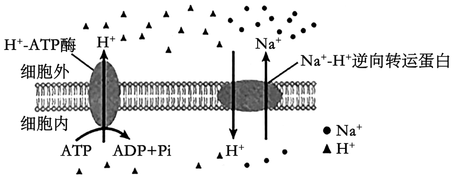
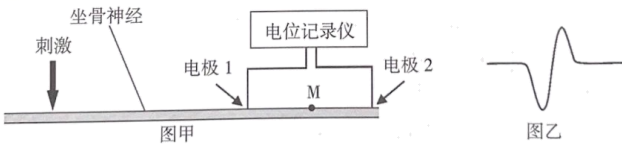
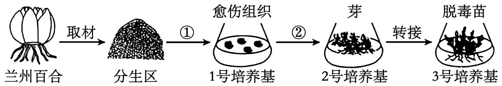
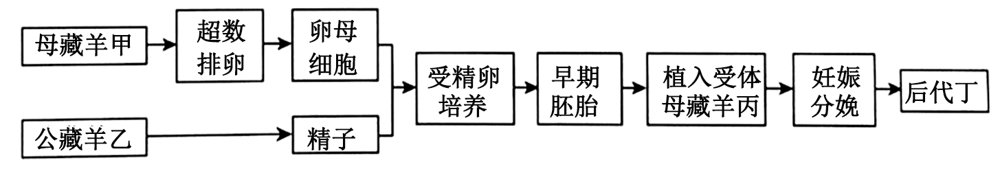
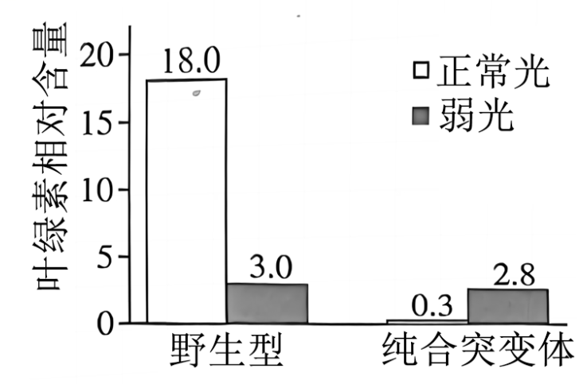
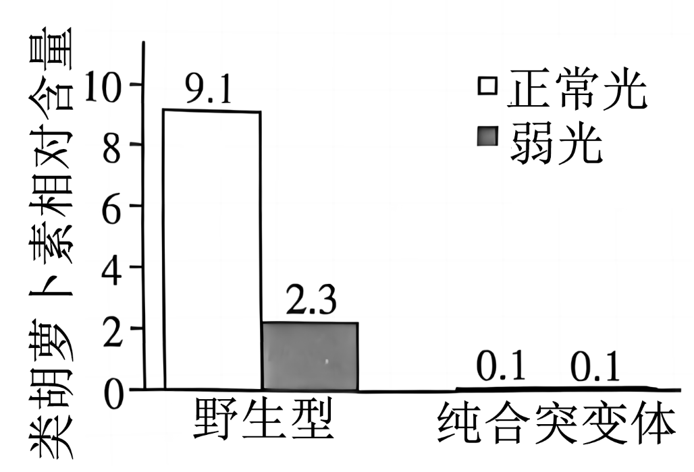
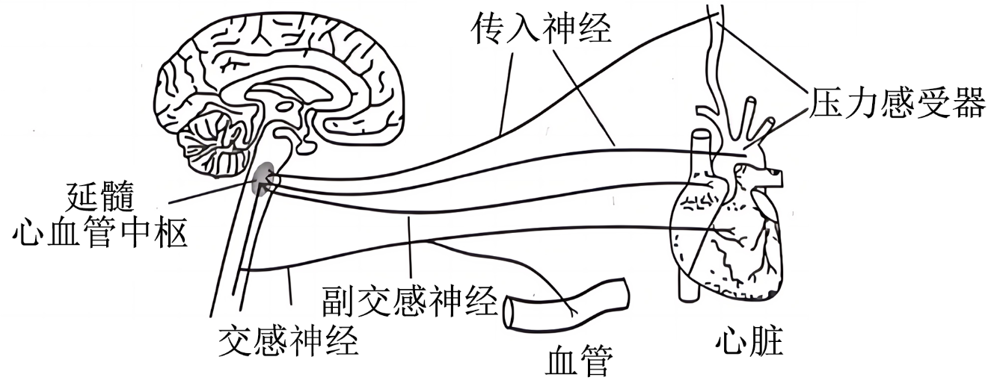
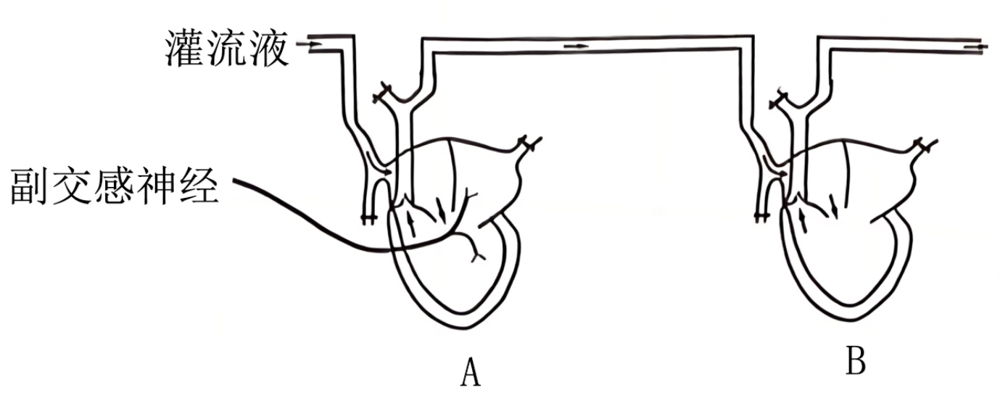
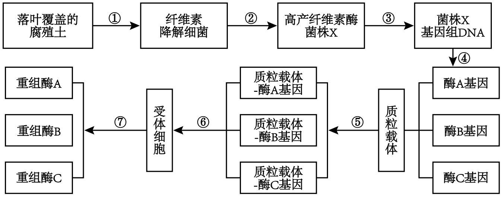

**2024年甘肃省普通高校招生统一考试**

**生物学**

**注意事项：**

**1.答卷前，考生务必将自己的姓名、准考证号填写在答题卡上。**

**2.回答选择题时，选出每小题答案后，用2B铅笔把答题卡上对应题目的答案标号框涂黑。如需改动，用橡皮擦干净后，再选涂其它答案标号框。回答非选择题时，将答案写在答题卡上。写在本试卷上无效。**

**3.考试结束后，将本试卷和答题卡一并交回。**

**一、选择题：本题共16小题，每小题3分，共48分。在每小题给出的四个选项中，只有一项是符合题目要求的。**

1\. 甘肃陇南的“武都油橄榄”是中国国家地理标志产品，其果肉呈黄绿色，子叶呈乳白色，均富含脂肪。由其生产的橄榄油含有丰富的不饱和脂肪酸，可广泛用于食品、医药和化工等领域。下列叙述错误的是（ ）

A. 不饱和脂肪酸的熔点较低，不容易凝固，橄榄油在室温下通常呈液态

B. 苏丹Ⅲ染液处理油橄榄子叶，在高倍镜下可观察到橘黄色的脂肪颗粒

C. 油橄榄种子萌发过程中有机物的含量减少，有机物的种类不发生变化

D. 脂肪在人体消化道内水解为脂肪酸和甘油后，可被小肠上皮细胞吸收

【答案】C

【解析】

【分析】脂肪是由三分子脂肪酸与一分子甘油发生反应而形成的酯，即三酰甘油(又称甘油三酯)。其中甘油的分子比较简单，而脂肪酸的种类和分子长短却不相同。脂肪酸可以是饱和的，也可以是不饱和的。植物脂肪大多含有不饱和脂肪酸，在室温时呈液态；大多数动物脂肪含有饱和脂肪酸，室温时呈固态。

【详解】A、植物脂肪大多含有不饱和脂肪酸，不饱和脂肪酸的熔点较低，不容易凝固，橄榄油含有丰富的不饱和脂肪酸，在室温下通常呈液态，A正确；

B、油橄榄子叶富含脂肪，脂肪可被苏丹Ⅲ染液染成橘黄色，因此在高倍镜下可观察到橘黄色的脂肪颗粒，B正确；

C、油橄榄种子萌发过程中由于细胞呼吸的消耗，有机物的总量减少，但由于发生了有机物的转化，故有机物的种类增多，C错误；

D、脂肪是由三分子脂肪酸与一分子甘油发生反应而形成的酯，脂肪在人体消化道内水解为脂肪酸和甘油后，可被小肠上皮细胞吸收，D正确。

故选C。

2\. 维持细胞的Na+平衡是植物的耐盐机制之一。盐胁迫下，植物细胞膜（或液泡膜）上的H+-ATP酶（质子泵）和Na+-H+逆向转运蛋白可将Na+从细胞质基质中转运到细胞外（或液泡中），以维持细胞质基质中的低Na+水平（见下图）。下列叙述错误的是（ ）

A. 细胞膜上的H+-ATP酶磷酸化时伴随着空间构象的改变

B. 细胞膜两侧的H+浓度梯度可以驱动Na+转运到细胞外

C. H+-ATP酶抑制剂会干扰H+的转运，但不影响Na+转运

D. 盐胁迫下Na+-H+逆向转运蛋白的基因表达水平可能提高

【答案】C

【解析】

【分析】1、由图可知，H+-ATP酶（质子泵）向细胞外转运H+时伴随着ATP的水解，且为逆浓度梯度运输，推出H+-ATP酶向细胞外转运H+为主动运输；

2、由图可知，H+进入细胞为顺浓度梯度运输，Na+出细胞为逆浓度梯度运输，均通过Na+-H+逆向转运蛋白，H+顺浓度梯度进入细胞所释放的势能是驱动Na+转运到细胞外的直接动力，由此推出Na+-H+逆向转运蛋白介导的Na+跨膜运输为主动运输。

【详解】A、细胞膜上的H+-ATP酶介导H+向细胞外转运时为主动运输，需要载体蛋白的协助。载体蛋白需与运输分子结合，引起载体蛋白空间结构改变，A正确；

B、H+顺浓度梯度进入细胞所释放的势能是驱动Na+转运到细胞外的直接动力，B正确；

C、H+-ATP酶抑制剂干扰H+的转运，进而影响膜两侧H+浓度，对Na+的运输同样起到抑制作用，C错误；

D、耐盐植株的Na+-H+逆向转运蛋白比普通植株多，以适应高盐环境，因此盐胁迫下Na+-H+逆向转运蛋白的基因表达水平可能提高，D正确。

故选C

3\. 梅兰竹菊为花中四君子，很多人喜欢在室内或庭院种植。花卉需要科学养护，养护不当会影响花卉的生长，如兰花会因浇水过多而死亡，关于此现象，下列叙述错误的是（ ）

A. 根系呼吸产生的能量减少使养分吸收所需的能量不足

B. 根系呼吸产生的能量减少使水分吸收所需的能量不足

C. 浇水过多抑制了根系细胞有氧呼吸但促进了无氧呼吸

D. 根系细胞质基质中无氧呼吸产生的有害物质含量增加

【答案】B

【解析】

【分析】1、有氧呼吸是指细胞在氧气的参与下，通过酶的催化作用，把糖类等有机物彻底氧化分解，产生出二氧化碳和水，同时释放出大量能量的过程；

2、有氧呼吸的第一、二、三阶段的场所依次是细胞质基质、线粒体基质和线粒体内膜。有氧呼吸第一阶段是葡萄糖分解成丙酮酸和NADP，释放少量能量；第二阶段是丙酮酸和水反应生成二氧化碳和NADP，释放少量能量；第三阶段是氧气和NADP反应生成水，释放大量能量；

3、无氧呼吸是指在无氧条件下通过酶的催化作用，细胞把糖类等有机物不彻底氧化分解，同时释放少量能量的过程；

4、无氧呼吸的场所是细胞质基质，无氧呼吸的第一阶段和有氧呼吸的第一阶段相同，无氧呼吸的第二阶段丙酮酸和NADP反应生成酒精和CO2或乳酸，第二阶段不合成ATP。

【详解】A、大多数营养元素的吸收是与植物根系代谢活动密切相关的过程，这些过程需要根系细胞呼吸产生的能量，浇水过多会使根系呼吸产生的能量减少，使养分吸收所需的能量不足，A正确；

B、根系吸收水分是被动运输，不消耗能量，B错误；

C、浇水过多使土壤含氧量减少，抑制了根细胞的有氧呼吸，但促进了无氧呼吸的进行，C正确；

D、根细胞无氧呼吸整个过程都发生在细胞质基质中，会产生酒精或乳酸等有害物质，D正确。

故选B。

4\. 某研究团队发现，小鼠在禁食一定时间后，细胞自噬相关蛋白被募集到脂质小滴上形成自噬体，随后与溶酶体融合形成自噬溶酶体，最终脂质小滴在溶酶体内被降解。关于细胞自噬，下列叙述错误的是（ ）

A. 饥饿状态下自噬参与了细胞内的脂质代谢，使细胞获得所需的物质和能量

B. 当细胞长时间处在饥饿状态时，过度活跃的细胞自噬可能会引起细胞凋亡

C. 溶酶体内合成的多种水解酶参与了细胞自噬过程

D. 细胞自噬是细胞受环境因素刺激后的应激性反应

【答案】C

【解析】

【分析】细胞自噬是指在一定条件下，细胞会将受损或功能退化的细胞结构等，通过溶酶体降解后再利用，这就是细胞自噬。处于营养缺乏条件下的细胞，通过细胞自噬可以获得维持生存所需的物质和能量；在细胞受到损伤、微生物入侵或细胞衰老时，通过细胞自噬，可以清除受损或衰老的细胞器，以及感染的微生物和毒素，从而维持细胞内部环境的稳定。有些激烈的细胞自噬，可能诱导细胞凋亡。

【详解】A、由题干信息可知，小鼠在禁食一定时间后，细胞自噬相关蛋白被募集到脂质小滴上形成自噬体，随后与溶酶体融合形成自噬溶酶体，最终脂质小滴在溶酶体内被降解，所以在饥饿状态下自噬参与了细胞内的脂质代谢，使细胞获得所需的物质和能量，来支持基本的生命活动，A正确；

B、细胞长时间处在饥饿状态时，细胞可能无法获得足够的能量和营养素，细胞自噬会过度活跃，导致细胞功能紊乱，可能会引起细胞凋亡，B正确；

C、溶酶体内水解酶的化学本质是蛋白质，其合成场所是核糖体，在溶酶体内发挥作用，参与了细胞自噬过程，C错误；

D、细胞自噬是细胞感应外部环境刺激后表现出的应激性与适应性行为，来支持基本的生命活动，从而维持细胞内部环境的稳定，D正确。

故选C。

5\. 科学家发现染色体主要是由蛋白质和DNA组成。关于证明蛋白质和核酸哪一种是遗传物质的系列实验，下列叙述正确的是（ ）

A. 肺炎链球菌体内转化实验中，加热致死的S型菌株的DNA分子在小鼠体内可使R型活菌的相对性状从无致病性转化为有致病性

B. 肺炎链球菌体外转化实验中，利用自变量控制的“加法原理”，将“S型菌DNA+DNA酶”加入R型活菌的培养基中，结果证明DNA是转化因子

C. 噬菌体侵染实验中，用放射性同位素分别标记了噬菌体的蛋白质外壳和DNA，发现其DNA进入宿主细胞后，利用自身原料和酶完成自我复制

D. 烟草花叶病毒实验中，以病毒颗粒的RNA和蛋白质互为对照进行侵染，结果发现自变量RNA分子可使烟草出现花叶病斑性状

【答案】D

【解析】

【分析】肺炎链球菌转化实验包括格里菲思体内转化实验和艾弗里体外转化实验，其中格里菲思体内转化实验证明S型细菌中存在某种“转化因子”，能将R型细菌转化为S型细菌；艾弗里体外转化实验证明DNA是遗传物质。

【详解】A、格里菲思的肺炎链球菌体内转化实验未单独研究每种物质的作用，在艾弗里的肺炎链球菌体外转化实验中，加热致死的S型菌株的DNA分子在小鼠体内可使R型活菌的相对性状从无致病性转化为有致病性，A错误；

B、在肺炎链球菌的体外转化实验中，利用自变量控制中的“减法原理”设置对照实验，通过观察只有某种物质存在或只有某种物质不存在时，R型菌的转化情况，最终证明了DNA是遗传物质，例如“S型菌DNA+DNA酶”组除去了DNA，B错误；

C、噬菌体为DNA病毒，其DNA进入宿主细胞后，利用宿主细胞的原料和酶完成自我复制，C错误；

D、烟草花叶病毒的遗传物质是RNA，以病毒颗粒的RNA和蛋白质互为对照进行侵染，结果发现RNA分子可使烟草出现花叶病斑性状，而蛋白质不能使烟草出现花叶病斑性状，D正确。

故选D。

6\. 癌症的发生涉及原癌基因和抑癌基因一系列遗传或表观遗传的变化，最终导致细胞不可控的增殖。下列叙述错误的是（ ）

A. 在膀胱癌患者中，发现原癌基因*H-ras*所编码蛋白质的第十二位氨基酸由甘氨酸变为缬氨酸，表明基因突变可导致癌变

B. 在肾母细胞瘤患者中，发现抑癌基因*WT1*的高度甲基化抑制了基因的表达，表明表观遗传变异可导致癌变

C. 在神经母细胞瘤患者中，发现原癌基因*N-myc*发生异常扩增，基因数目增加，表明染色体变异可导致癌变

D. 在慢性髓细胞性白血病患者中，发现9号和22号染色体互换片段，原癌基因*abl*过度表达，表明基因重组可导致癌变

【答案】D

【解析】

【分析】染色体结构变异包括染色体片段的缺失、重复、易位和倒位，染色体结构变异会改变基因的数目和排列顺序进而引起生物性状的改变。

【详解】A、在膀胱癌患者中，发现原癌基因H-ras所编码蛋白质的第十二位氨基酸由甘氨酸变为缬氨酸，可能是由于碱基的替换造成的属于基因突变，表明基因突变可导致癌变，A正确；

B、抑癌基因WT1的高度甲基化抑制了基因的表达，表明表观遗传变异可导致癌变，B正确；

C、原癌基因N-myc发生异常扩增，基因数目增加，属于染色体变异中的重复，表明染色体变异可导致癌变，C正确；

D、9号和22号染色体互换片段，原癌基因abl过度表达，表明染色体变异可导致癌变，D错误。

故选D。

7\. 青藏高原隆升引起的生态地理隔离促进了物种的形成。该地区某植物不同区域的两个种群，进化过程中出现了花期等性状的分化，种群甲花期结束约20天后，种群乙才开始开花，研究发现两者间人工授粉不能形成有活力的种子。下列叙述错误的是（ ）

A. 花期隔离标志着两个种群间已出现了物种的分化

B. 花期隔离进一步增大了种群甲和乙的基因库差异

C. 地理隔离和花期隔离限制了两种群间的基因交流

D. 物种形成过程实质上是种间生殖隔离建立的过程

【答案】A

【解析】

【分析】突变（包括基因突变和染色体变异）和基因重组、自然选择及隔离是物种形成过程的三个基本环节，通过它们的综合作用，种群产生分化，最终导致新物种的形成。突变和基因重组产生生物进化的原材料，自然选择使种群的基因频率发生定向的改变并决定生物进化的方向，隔离是新物种形成的必要条件，新物种形成的标志是产生生殖隔离。

【详解】A、花期隔离只是会导致种群间个体不能进行交配，但不一定导致出现了生殖隔离，花期隔离不能说明两个种群间已出现了物种的分化，A错误；

B、花期隔离使得2个种群间不能进行交配，进一步增大了种群甲和乙的基因库差异，B正确；

C、地理隔离和花期隔离，都能导致不同种群间的个体在自然条件下不能进行交配，都限制了两种群间的基因交流，C正确；

D、生殖隔离是物种形成的标志，故物种形成过程实质上是种间生殖隔离建立的过程，D正确。

故选A。

8\. 条件反射的建立提高了人和动物对外界复杂环境的适应能力，是人和高等动物生存必不可少的学习过程。下列叙述正确的是（ ）

A. 实验犬看到盆中的肉时唾液分泌增加是先天具有的非条件反射

B. 有人听到“酸梅”有止渴作用是条件反射，与大脑皮层言语区的S区有关

C. 条件反射的消退是由于在中枢神经系统内产生了抑制性效应的结果

D. 条件反射的建立需要大脑皮层参与，条件反射的消退不需要大脑皮层参与

【答案】C

【解析】

【分析】在中枢神经系统的参与下，机体对内外刺激所产生的规律性应答反应，叫做反射，反射是神经调节的基本方式，完成反射的结构基础是反射弧，反射活动需要经过完整的反射弧来实现，如果反射弧中任何环节在结构、功能上受损，反射就不能完成。反射分为条件反射和非条件反射。

【详解】A、实验犬看到盆中的肉时唾液分泌增加，是后天性行为，需在大脑皮层的参与下完成的高级反射活动，属于条件反射，A错误；

B、有人听到“酸梅”有止渴作用是条件反射，与大脑皮层言语区的H区（听觉性语言中枢）有关，B错误；

C、条件反射的消退不是条件反射的简单丧失，而是神经中枢把原先引起兴奋性效应的信号转变为产生抑制性效应的信号，使得条件发射逐渐减弱直至消失，因此条件反射的消退是由于在中枢神经系统内产生了抑制性效应的结果，C正确；

D、条件反射的建立需要大脑皮层参与，而条件反射的消退也是一个新的学习过程，也需要大脑皮层的参与，D错误。

故选C。

9\. 图甲是记录蛙坐骨神经动作电位的实验示意图。在图示位置给予一个适宜电刺激，可通过电极1和2在电位记录仪上记录到如图乙所示的电位变化。如果在电极1和2之间的M点阻断神经动作电位的传导，给予同样的电刺激时记录到的电位变化图是（ ）

A.  B. 

C.  D. 

【答案】B

【解析】

【分析】神经纤维未受到刺激时，细胞膜内外的电荷分布情况是外正内负，当某一部位受刺激时，其膜电位变为外负内正。静息时，K+外流，造成膜两侧的电位表现为内负外正；受刺激后，Na+内流，造成膜两侧的电位表现为内正外负。

【详解】分析题意，在图示位置给予一个适宜电刺激，由于兴奋先后到达电极1和电极2，则电位记录仪会发生两次方向相反的偏转，可通过电极1和2在电位记录仪上记录到如图乙所示的电位变化；如果在电极1和2之间的M点阻断神经动作电位的传导，兴奋只能传导至电极1，无法传至电极2，只发生一次偏转，对应的图形应是图乙中的前半段，B符合题意。

故选B。

10\. 高原大气中氧含量较低，长期居住在低海拔地区的人进入高原后，血液中的红细胞数量和血红蛋白浓度会显著升高，从而提高血液的携氧能力。此过程主要与一种激素——促红细胞生成素（EPO）有关，该激素是一种糖蛋白。下列叙述错误的是（ ）

A. 低氧刺激可以增加人体内EPO的生成，进而增强造血功能

B. EPO能提高靶细胞血红蛋白基因的表达并促进红细胞成熟

C. EPO是构成红细胞膜的重要成分，能增强膜对氧的通透性

D. EPO能与造血细胞膜上的特异性受体结合并启动信号转导

【答案】C

【解析】

【分析】激素调节是指由内分泌器官（或细胞）分泌的化学物质进行的调节。不同激素的化学本质组成不同，但它们的作用方式却有一些共同的特点：（1）微量和高效；（2）通过体液运输；（3）作用于靶器官和靶细胞。激素一经靶细胞接受并起作用后就被灭活了。激素只能对生命活动进行调节，不参与生命活动。

【详解】A、分析题意，人体缺氧时，EPO生成增加，并使血液中的红细胞数量和血红蛋白浓度会显著升高，从而提高血液的携氧能力，A正确；

B、长期居住在低海拔地区的人进入高原后，血液中的红细胞数量和血红蛋白浓度会显著升高，从而提高血液的携氧能力，据此推测，该过程中EPO能提高靶细胞血红蛋白基因的表达，使血红蛋白增多，并促进红细胞成熟，使红细胞数目增加，B正确；

C、EPO是一种激素，激素不参与构成细胞膜，C错误；

D、EPO是一种激素，其作为信号分子能与造血细胞膜上的特异性受体结合并启动信号转导，进而引发靶细胞生理活动改变，D正确。

故选C。

11\. 乙脑病毒进入机体后可穿过血脑屏障侵入脑组织细胞并增殖，使机体出现昏睡、抽搐等症状。下列叙述错误的是（ ）

A. 细胞毒性T细胞被抗原呈递细胞和辅助性T细胞分泌的细胞因子激活，识别并裂解乙脑病毒

B. 吞噬细胞表面受体识别乙脑病毒表面特定蛋白，通过内吞形成吞噬溶酶体消化降解病毒

C. 浆细胞分泌的抗体随体液循环并与乙脑病毒结合，抑制该病毒的增殖并发挥抗感染作用

D. 接种乙脑疫苗可刺激机体产生特异性抗体、记忆B细胞和记忆T细胞，预防乙脑病毒的感染

【答案】A

【解析】

【分析】1、免疫活性物质是指由免疫细胞或其他细胞产生的、并发挥免疫作用的物质。

2、B细胞激活后可以产生抗体，由于抗体存在于体液中，所以这种主要靠抗体“作战”的方式称为体液免疫。

【详解】A、细胞毒性T细胞的激活需要靶细胞的接触和辅助性T细胞分泌的细胞因子的刺激，不需要抗原呈递细胞的作用，A错误；

B、吞噬细胞表面受体可以识别乙脑病毒表面特定蛋白，并通过内吞形成吞噬溶酶体消化降解病毒，B正确；

C、抗体是浆细胞分泌产生的分泌蛋白，可以通过体液的运输，并与抗原乙脑病毒结合，抑制该病毒的增殖并发挥抗感染作用（或对人体细胞的黏附），C正确；

D、乙脑疫苗是一种抗原，可以刺激机体产生特异性抗体、记忆B细胞和记忆T细胞，预防乙脑病毒的感染，D正确。

故选A。

12\. 热带雨林是生物多样性最高的陆地生态系统，对调节气候、保持水土、稳定碳氧平衡等起着非常重要的作用。近年来，随着人类活动影响的加剧，热带雨林面积不断减小，引起人们更多的关注和思考。下列叙述正确的是（ ）

A. 热带雨林垂直分层较多，一般不发生光竞争

B. 热带雨林水热条件较好，退化后恢复相对较快

C. 热带雨林林下植物的叶片大或薄、叶绿体颗粒小

D. 热带雨林物种组成和结构复杂，物质循环相对封闭

【答案】D

【解析】

【分析】生态系统：（1）概念：在一定空间内，由生物群落与它的非生物环境相互作用而形成的统一整体，叫作生态系统。（2）组成成分：生产者、消费者、分解者、非生物的物质和能量。其中生产者为自养生物，消费者和分解者为异养生物。（3）营养结构：食物链和食物网。（4）功能：①能量流动：生态系统中能量的输入、传递、转化和散失的过程，称为生态系统的能量流动。②物质循环：组成生物体的C、H、O、N、P、S等元素，都不断进行着从非生物环境到生物群落，又从生物群落到非生物环境的循环过程，这就是生态系统的物质循环。③信息传递：生态系统中的信息传递既存在于同种生物之间，也发生在不同生物之间，还能发生在生物与无机环境之间。

【详解】A、热带雨林的生物组分较多，垂直分层现象更明显，不同高度的植物之间会竞争阳光等环境资源，A错误；

B、生态系统在受到不同的干扰后，其恢复速度与恢复时间是不同的，虽然热带雨林虽然水热条件较好，但退化后恢复时间很漫长，恢复难度很大，B错误；

C、热带雨林林下光线相对较弱，林下植物的叶片大或薄，叶绿体颗粒大，呈深绿色，以适应在弱光条件下生存，C错误；

D、热带雨林物种组成和结构复杂，物质在生态系统中循环往复运动，在热带雨林中，不需要从外界获取物质补给，就能长期维持其正常功能，物质循环相对封闭，D正确。

故选D

13\. 土壤镉污染影响粮食生产和食品安全，是人类面临的重要环境问题。种植富集镉的植物可以修复镉污染的土壤。为了筛选这些植物，某科研小组研究了土壤中添加不同浓度镉后植物A和B的生长情况，以不添加镉为对照（镉含量0.82mg·kg-1）。一段时间后，测量植物的地上、地下生物量和植物体镉含量，结果如下表。下列叙述错误的是（ ）

<table style="width:95%;">
<colgroup>
<col style="width: 21%" />
<col style="width: 11%" />
<col style="width: 11%" />
<col style="width: 11%" />
<col style="width: 11%" />
<col style="width: 13%" />
<col style="width: 13%" />
</colgroup>
<tbody>
<tr>
<td style="text-align: left;">镉浓度（mg·kg-1）</td>
<td colspan="2" style="text-align: left;">地上生物量（g·m-2）</td>
<td colspan="2" style="text-align: left;">地下生物量（g·m-2）</td>
<td colspan="2" style="text-align: left;">植物体镉含量（mg·kg-1）</td>
</tr>
<tr>
<td style="text-align: left;"></td>
<td style="text-align: left;">植物A</td>
<td style="text-align: left;">植物B</td>
<td style="text-align: left;">植物A</td>
<td style="text-align: left;">植物B</td>
<td style="text-align: left;">植物A</td>
<td style="text-align: left;">植物B</td>
</tr>
<tr>
<td style="text-align: left;">对照</td>
<td style="text-align: left;">120.7</td>
<td style="text-align: left;">115.1</td>
<td style="text-align: left;">23.5</td>
<td style="text-align: left;">18.0</td>
<td style="text-align: left;">2.5</td>
<td style="text-align: left;">2.7</td>
</tr>
<tr>
<td style="text-align: left;">2</td>
<td style="text-align: left;">101.6</td>
<td style="text-align: left;">42.5</td>
<td style="text-align: left;">15.2</td>
<td style="text-align: left;">7.2</td>
<td style="text-align: left;">10.1</td>
<td style="text-align: left;">5.5</td>
</tr>
<tr>
<td style="text-align: left;">5</td>
<td style="text-align: left;">105.2</td>
<td style="text-align: left;">35.2</td>
<td style="text-align: left;">14.3</td>
<td style="text-align: left;">4.1</td>
<td style="text-align: left;">12.9</td>
<td style="text-align: left;">7.4</td>
</tr>
<tr>
<td style="text-align: left;">10</td>
<td style="text-align: left;">97.4</td>
<td style="text-align: left;">28.3</td>
<td style="text-align: left;">12.1</td>
<td style="text-align: left;">2.3</td>
<td style="text-align: left;">27.4</td>
<td style="text-align: left;">11.6</td>
</tr>
</tbody>
</table>

A. 在不同浓度的镉处理下，植物A和B都发生了镉的富集

B. 与植物A相比，植物B更适合作为土壤镉污染修复植物

C. 在被镉污染的土壤中，镉对植物B生长的影响更大

D. 若以两种植物作动物饲料，植物A的安全风险更大

【答案】B

【解析】

【分析】本实验的目的是为了筛选可以修复镉污染土壤的植物，自变量为镉的浓度和植物种类，因变量为植物的地上、地下生物量和植物体镉含量。

【详解】A、由表可知，与对照组相比，不同浓度的镉处理下，植物A和B的植物体镉含量都有所增加，说明植物A和B都发生了镉的富集，A正确；

B、由表可知，在不同浓度的镉处理下，植物A的植物体镉含量，地上生物量和地下生物量都高于植物B，所以与植物B相比，植物A更适合作为土壤镉污染修复植物，B错误；

C、由表可知，在相同的镉浓度处理下，植物A的地上生物量和地下生物量都高于植物B，说明在被镉污染的土壤中，镉对植物B生长的影响更大，C正确；

D、由表可知，在不同浓度的镉处理下，植物A的植物体镉含量高于植物B，说明植物A对镉的富集能力更强，若以植物A作动物饲料，镉会沿着食物链进行富集，安全风险更大，D正确。

故选B。

14\. 沙漠化防治一直是困扰人类的难题。为了固定流沙、保障包兰铁路的运行，我国人民探索出将麦草插入沙丘防止沙流动的“草方格”固沙技术。流沙固定后，“草方格”内原有沙生植物种子萌发、生长，群落逐渐形成，沙漠化得到治理。在“草方格”内种植沙生植物，可加速治沙进程。甘肃古浪八步沙林场等地利用该技术，成功阻挡了沙漠的侵袭，生态效益显著，成为沙漠化治理的典范。关于“草方格”技术，下列叙述错误的是（ ）

A. 采用“草方格”技术进行流沙固定、植被恢复遵循了生态工程的自生原理

B. 在“草方格”内种植沙拐枣、梭梭等沙生植物遵循了生态工程的协调原理

C. 在未经人工种植的“草方格”内，植物定植、群落形成过程属于初生演替

D. 实施“草方格”生态工程促进了生态系统防风固沙、水土保持功能的实现

【答案】C

【解析】

【分析】生态工程以生态系的自组织、自我调节功能为基础，遵循着整体、协调、循环、自生等生态系基本原理。

【详解】A、采用“草方格”技术进行流沙固定，创造有益于生物组分生长、发育、繁殖，使植被逐渐恢复，该过程遵循了生态工程的自生原理，A正确；

B、在“草方格”内种植沙拐枣、梭梭等沙生植物时考虑了生物与环境、生物与生物的协调与适应，遵循了生态工程的协调原理，B正确；

C、初生演替是指一个从来没有被植物覆盖的地面，或者是原来存在过植被，但是被彻底消灭了的地方发生的演替，而次生演替指原来有的植被虽然已经不存在，但是原来有的土壤基本保留，甚至还保留有植物的种子和其他繁殖体的地方发生的演替，“草方格”内保留有原有沙生植物种子，故该群落形成过程属于次生演替，C错误；

D、“草方格”固沙技术能防止沙子流动，有利于植被恢复，促进了生态系统防风固沙、水土保持功能的实现，D正确。

故选C。

15\. 兰州百合栽培过程中易受病毒侵染，造成品质退化。某研究小组尝试通过组织培养技术获得脱毒苗，操作流程如下图。下列叙述正确的是（ ）

A. ①为脱分化过程，1号培养基中的愈伤组织是排列规则的薄壁组织团块

B. ②为再分化过程，愈伤组织细胞分化时可能会发生基因突变或基因重组

C. 3号培养基用于诱导生根，其细胞分裂素浓度与生长素浓度的比值大于1

D. 百合分生区附近的病毒极少，甚至无病毒，可以作为该研究中的外植体

【答案】D

【解析】

【分析】植物组织培养过程是：离体的植物器官、组织或细胞脱分化形成愈伤组织，然后再分化生成根、芽，最终形成植物体。植物组织培养依据的原理是植物细胞的全能性。

【详解】A、在脱分化过程中，1号培养基中的愈伤组织是排列不规则的薄壁组织团块，A错误；

B、愈伤组织细胞分化时可能会发生基因突变，但基因重组发生在减数分裂过程中，而愈伤组织细胞的分化过程是有丝分裂，所以不会发生基因重组，B错误。

C、3号培养基用于诱导生根，其细胞分裂素浓度与生长素浓度的比值应该小于1，C错误；

D、百合分生区附近的病毒极少，甚至无病毒，因此可以作为该研究中的外植体，D正确；

故选D。

16\. 甘加藏羊是甘肃高寒牧区的优良品种，是季节性发情动物，每年产羔一次，每胎一羔，繁殖率较低。为促进畜牧业发展，研究人员通过体外受精、胚胎移植等胚胎工程技术提高藏羊的繁殖率，流程如下图。下列叙述错误的是（ ）

A. 藏羊甲需用促性腺激素处理使其卵巢卵泡发育和超数排卵

B. 藏羊乙的获能精子能与刚采集到的藏羊甲的卵母细胞受精

C. 受体藏羊丙需和藏羊甲进行同期发情处理

D. 后代丁的遗传物质来源于藏羊甲和藏羊乙

【答案】B

【解析】

【分析】胚胎移植基本程序主要包括：1、对供、受体的选择和处理。2、配种或人工授精。3、对胚胎的收集、检查、培养或保存。4、对胚胎进行移植。5、移植后的检查。

【详解】A、促性腺激素能作用于卵巢，藏羊甲需用促性腺激素处理使其卵巢卵泡发育和超数排卵，A正确；

B、从卵巢中刚采集的卵母细胞需培养成熟（减数第二次分裂中期）后才可与获能的精子进行体外受精，B错误；

C、在胚胎移植前要对接受胚胎的受体和供体进行同期发情处理，使受体的生理状况相同，因此受体藏羊丙需和藏羊甲进行同期发情处理，C正确；

D、后代丁是由藏羊甲的卵细胞和藏羊乙的精子结合形成的受精卵发育而来，因此后代丁的遗传物质来源于藏羊甲和藏羊乙，D正确。

故选B。

**二、非选择题：本题共5小题，共52分。**

17\. 类胡萝卜素不仅参与光合作用，还是一些植物激素的合成前体。研究者发现了某作物的一种胎萌突变体，其种子大部分为黄色，少部分呈白色，白色种子未完全成熟即可在母体上萌发。经鉴定，白色种子为某基因的纯合突变体。在正常光照下（400μmol·m-2•s-1），纯合突变体叶片中叶绿体发育异常、类囊体消失。将野生型和纯合突变体种子在黑暗中萌发后转移到正常光和弱光（1μmol·m-2•s-1）下培养一周，提取并测定叶片叶绿素和类胡萝卜素含量，结果如图所示。回答下列问题。

（1）提取叶片中叶绿素和类胡萝卜素常使用的溶剂是\_\_\_\_\_\_，加入少许碳酸钙可以\_\_\_\_\_\_。

（2）野生型植株叶片叶绿素含量在正常光下比弱光下高，其原因是\_\_\_\_\_\_。

（3）正常光照条件下种植纯合突变体将无法获得种子，因为\_\_\_\_\_\_。

（4）现已知此突变体与类胡萝卜素合成有关，本研究中支持此结论的证据有：①纯合体种子为白色；②\_\_\_\_\_\_。

（5）纯合突变体中可能存在某种植物激素X的合成缺陷，X最可能是\_\_\_\_\_\_。若以上推断合理，则干旱处理能够提高野生型中激素X的含量，但不影响纯合突变体中X的含量。为检验上述假设，请完成下面的实验设计：

①植物培养和处理：取野生型和纯合突变体种子，萌发后在\_\_\_\_\_\_条件下培养一周，然后将野生型植株均分为A、B两组，将突变体植株均分为C、D两组，A、C组为对照，B、D组干旱处理4小时。

②测量指标：每组取3-5株植物的叶片，在显微镜下观察、测量并记录各组的\_\_\_\_\_\_。

③预期结果：\_\_\_\_\_\_。

【答案】（1） ①. 无水乙醇 ②. 防止研磨中色素被破坏

（2）叶绿素的形成需要光照，正常光下更有利于叶绿素的形成

（3）纯合突变体叶片中的叶绿素和类胡萝卜素的相对含量都极低，光合作用极弱，无法满足植株生长对有机物的需求，

（4）与野生型相比，纯合突变体叶片中类胡萝卜素含量极低（几乎为零）。

（5） ①. 细胞分裂素 ②. 含水量等适宜 ③. 叶绿体的大小及数量，取其平均值 ④. B组叶绿体的大小及数量高于A组，C、D两组叶绿体的大小及数量无差异且均明显低于A、B两组。

【解析】

【分析】影响植物光合作用的因素有光合色素的含量、光照、水等。细胞分裂素能够促进叶绿素的合成。

【小问1详解】

叶片中的叶绿素和类胡萝卜素都能溶解在有机溶剂中，所以常使用无水乙醇提取。加入少许碳酸钙可以防止研磨中色素被破坏。

【小问2详解】

叶绿素的形成需要光照，正常光下更有利于叶绿素的形成，所以野生型植株叶片叶绿素含量在正常光下比弱光下高。

【小问3详解】

在正常光照下（400μmol·m-2•s-1），纯合突变体叶片中叶绿体发育异常、类囊体消失，叶绿素和类胡萝卜素的相对含量都极低，分别为0.3和0.1，说明纯合突变体的光合作用极弱，无法满足植株生长对有机物的需求，使得植株难以生长，因此正常光照条件下种植纯合突变体将无法获得种子。

【小问4详解】

由图可知：与野生型相比，纯合突变体叶片中类胡萝卜素含量极低（几乎为零），说明此突变体与类胡萝卜素合成有关。

【小问5详解】

纯合突变体中可能存在某种植物激素X的合成缺陷。由图可知：纯合突变体叶片中的叶绿素和类胡萝卜素的相对含量都极低，而细胞分裂素能促进叶绿素的合成， 据此可推知：X最可能是细胞分裂素。若以上推断合理，则干旱处理能够提高野生型中激素X的含量，但不影响纯合突变体中X的含量。为检验上述假设，并结合题意“在正常光照下，纯合突变体叶片中叶绿体发育异常、类囊体消失”可知：该实验的自变量是植株的种类和培养条件，因变量是叶绿体的大小及数量，而在实验过程中对植株的生长有影响的无关变量应控制相同且适宜。据此，依据实验设计遵循的对照原则和单一变量原则和题干中给出的不完善的实验设计可推知，补充完善的实验设计如下：

①植物培养和处理：取野生型和纯合突变体种子，萌发后在含水量等适宜条件下培养一周，然后将野生型植株均分为A、B两组，将突变体植株均分为C、D两组，A、C组为对照，B、D组干旱处理4小时。

②测量指标：每组取3-5株植物的叶片，在显微镜下观察、测量并记录各组的叶绿体的大小及数量，取其平均值。

③预期结果：本实验为验证性实验，其结论是已知的，即干旱处理能够提高野生型中激素X的含量，但不影响纯合突变体中X的含量，所以预期的结果是：B组叶绿体的大小及数量高于A组，C、D两组叶绿体的大小及数量无差异且均明显低于A、B两组。

18\. 机体心血管活动和血压的相对稳定受神经、体液等因素的调节。血压是血管内血液对单位面积血管壁的侧压力。人在运动、激动或受到惊吓时血压突然升高，机体会发生减压反射（如下图）以维持血压的相对稳定。回答下列问题。

（1）写出减压反射的反射弧\_\_\_\_\_\_。

（2）在上述反射活动过程中，兴奋在神经纤维上以\_\_\_\_\_\_形式传导，在神经元之间通过\_\_\_\_\_\_传递。

（3）血压升高引起的减压反射会使支配心脏和血管的交感神经活动\_\_\_\_\_\_。

（4）为了探究神经和效应器细胞之间传递的信号是电信号还是化学信号，科学家设计了如下图所示的实验：①制备A、B两个离体蛙心，保留支配心脏A的副交感神经，剪断支配心脏B的全部神经；②用适当的溶液对蛙的离体心脏进行灌流使心脏保持正常收缩活动，心脏A输出的液体直接进入心脏B。

刺激支配心脏A的副交感神经，心脏A的收缩变慢变弱（收缩曲线见下图）。预测心脏B收缩的变化，补全心脏B的收缩曲线，并解释原因：\_\_\_\_\_\_。

【答案】（1）压力感受器→传入神经→心血管中枢→副交感神经和交感神经→心脏和血管

（2） ①. 神经冲动##动作电位 ②. 突触 （3）减弱

（4）支配心脏A的副交感神经末梢释放的化学物质，随灌流液在一定时间后到达心脏B，使心脏B跳动变慢

【解析】

【分析】自主神经系统由交感神经和副交感神经两部分组成。它们的作用通常是相反的。当人体处于兴奋状态时，交感神经活动占据优势，心跳加快，支气管扩张，但胃肠的蠕动和消化腺的分泌活动减弱；当人处于安静状态时，副交感神经活动占据优势，此时，心跳减慢，但胃肠的蠕动和消化液的分泌会加强，有利于食物的消化和营养物质的吸收。交感神经和副交感神经对同一器官的调节作用通常是相反的，对机体的意义是使机体对外界刺激作出更精确的反应，更好的适应环境的变化。

【小问1详解】

减压反射的反射弧：压力感受器→传入神经→心血管中枢→副交感神经和交感神经→心脏和血管。

【小问2详解】

上述反射活动过程中，兴奋在神经纤维上以神经冲动或电信号的形式传导，在神经元之间通过突触结构传递。

【小问3详解】

血压升高引起的减压反射会使支配心脏和血管的交感神经活动减弱。

【小问4详解】

支配心脏A的副交感神经末梢释放的化学物质（神经递质），可随灌流液在一定时间后到达心脏B，使心脏B跳动变慢，故心脏B的收缩曲线如下： 。

19\. 生态位可以定量测度一个物种在群落中的地位或作用。生态位重叠指的是两个或两个以上物种在同一空间分享或竞争资源的情况。某研究小组调查了某山区部分野生哺乳动物的种群特征，并计算出它们之间的时间生态位重叠指数，如下表。

回答下列问题。

|     |      |      |      |      |      |     |
|:--- |:---- |:---- |:---- |:---- |:---- |:--- |
| 物种  | S1   | S2   | S3   | S4   | S5   | S6  |
| S1  | 1    |      |      |      |      |     |
| S2  | 0.36 | 1    |      |      |      |     |
| S3  | 0.40 | 0.02 | 1    |      |      |     |
| S4  | 0.37 | 0.00 | 0.93 | 1    |      |     |
| S5  | 0.73 | 0.39 | 0.38 | 0.36 | 1    |     |
| S6  | 0.70 | 0.47 | 0.48 | 0.46 | 0.71 | 1   |

（1）物种的生态位包括该物种所处的空间位置、占用资源的情况以及\_\_\_\_\_\_等。长时间调查生活在隐蔽、复杂环境中的猛兽数量，使用\_\_\_\_\_\_（填工具）对动物干扰少。

（2）具有捕食关系的两个物种之间的时间生态位重叠指数一般相对较\_\_\_\_\_\_（填“大”或“小”）。那么，物种S1的猎物有可能是物种\_\_\_\_\_\_和物种\_\_\_\_\_\_。

（3）物种S3和物种S4可能是同一属的动物，上表中支持此观点的证据是\_\_\_\_\_\_。

（4）已知物种S2是夜行性动物，那么最有可能属于昼行性动物的是物种\_\_\_\_\_\_和物种\_\_\_\_\_\_，判断依据是\_\_\_\_\_\_。

【答案】（1） ①. 与其他物种的关系 ②. 红外相机

（2） ①. 大 ②. S5 ③. S6

（3）物种S3和物种S4重叠指数最大，说明这两种生物利用同一资源或共同占有某一资源因素(食物、营养成分、空间等)的可能性较大

（4） ①. S3 ②. S4 ③. S2与S3、S4重叠指数最小，说明它们占用相同资源较少

【解析】

【分析】生态位：一个物种在群落中的地位或作用，包括所处的空间位置、占用资源的情况、以及与其他物种的关系等，称为这个物种的生态位。生态位是生态学中的一个重要概念，指物种在生物群落或生态系统中的地位和角色。对于某一生物种群来说，其只能生活在一定环境条件范围内，并利用特定的资源，甚至只能在特殊时间里在该环境出现。这些因子的交叉情况描述了生态位。生态位主要是指在自然生态系统中的一个种群在时间、空间的位置及其与相关种群之间的功能关系。

【小问1详解】

物种的生态位包括该物种所处的空间位置、占用资源的情况以及与其他物种的关系等。长时间调查生活在隐蔽、复杂环境中的猛兽数量，使用红外相机对动物干扰少；

小问2详解】

存在捕食关系的两个物种生态位有重叠，当两个物种利用同一资源或共同占有某一资源因素(食物、营养成分、空间等)时,就会出现生态位重叠现象。所以具有捕食关系的两个物种之间的时间生态位重叠指数一般相对较大；因此由表格可以看出，S1与S5、S6的重叠指数最大，因此物种S1的猎物有可能是物种S5和物种S6；

【小问3详解】

由表格信息可知，物种S3和物种S4重叠指数最大，说明这两种生物利用同一资源或共同占有某一资源因素(食物、营养成分、空间等)的可能性较大，因此二者可能属于同一属的动物；

【小问4详解】

由表格信息可知，S2与S3、S4重叠指数最小，说明它们占用相同资源较少，因此最有可能属于昼行性动物的是物种S3和物种S4。

20\. 自然群体中太阳鹦鹉的眼色为棕色，现于饲养群体中获得了甲和乙两个红眼纯系。为了确定眼色变异的遗传方式，某课题组选取甲和乙品系的太阳鹦鹉做正反交实验，F1雌雄个体间相互交配，F2的表型及比值如下表。回答下列问题（要求基因符号依次使用A/a，B/b）

|     |      |      |
|:--- |:---- |:---- |
| 表型  | 正交   | 反交   |
| 棕眼雄 | 6/16 | 3/16 |
| 红眼雄 | 2/16 | 5/16 |
| 棕眼雌 | 3/16 | 3/16 |
| 红眼雌 | 5/16 | 5/16 |

（1）太阳鹦鹉眼色至少由两对基因控制，判断的依据为\_\_\_\_\_\_；其中一对基因位于z染色体上，判断依据为\_\_\_\_\_\_。

（2）正交的父本基因型为\_\_\_\_\_\_，F1基因型及表型为\_\_\_\_\_\_。

（3）反交的母本基因型为\_\_\_\_\_\_，F1基因型及表型为\_\_\_\_\_\_。

（4）下图为太阳鹦鹉眼色素合成的可能途径，写出控制酶合成的基因和色素的颜色\_\_\_\_\_。

【答案】（1） ①. 6:2:3:5（3:5:3:5）是9:3:3:1的变式 ②. 正交、反交结果不同

（2） ①. aaZBZB ②. AaZBZb、AaZBW 表型均为棕色

（3） ①. aaZBW ②. AaZBZb、AaZbW 表型分别为棕色、红色

（4）①为基因A（或B）；②为基因B（或A）；③为红色；④为棕色

【解析】

【分析】伴性遗传是指在遗传过程中的子代部分性状由性染色体上的基因控制，这种由性染色体上的基因所控制性状的遗传上总是和性别相关，这种与性别相关联的性状遗传方式就称为伴性遗传。

【小问1详解】

依据表格信息可知，无论是正交6:2:3:5，还是反交3:5:3:5，均是9:3:3:1的变式，故可判断太阳鹦鹉的眼色至少由两对基因控制；但正交和反交结果不同，说明其中一对基因位于z染色体上。

【小问2详解】

依据正交结果，F2中棕眼：红眼=9:7，说明棕眼性状为双显性个体，红眼为单显性或双隐性个体，鹦鹉为ZW型性别决定，在雄性个体中，棕眼为6/8=3/4X1，在雌性个体中，棕眼为3/8=3/4X1/2，故可推知，F1中的基因型为AaZBZb、AaZBW，表型均为棕色，亲本为纯系，其基因型为：aaZBZB（父本）、AAZbW（母本）。

【小问3详解】

依据反交结果，结合第二小问可知，亲本基因型为，AAZbZb、aaZBW，则F1的基因型为AaZBZb、AaZbW，对应的表型依次为棕色、红色。

【小问4详解】

结合第二小问可知，棕眼性状为双显性个体，红眼为单显性或双隐性个体，故可知基因①为A（或B），控制酶1的合成，促进红色前体物合成红色中间物，基因②为B（或A），控制酶2的合成，促进红色中间物合成棕色产物。

21\. 源于细菌的纤维素酶是一种复合酶，能降解纤维素。为了提高纤维素酶的降解效率，某课题组通过筛选高产纤维素酶菌株，克隆表达降解纤维素的三种酶（如下图），研究了三种酶混合的协同降解作用，以提高生物质资源的利用效率。回答下列问题。

（1）过程①②采用以羧甲基纤维素钠为唯一碳源的培养基筛选菌株X，能起到筛选作用的原因是\_\_\_\_\_\_。高产纤维素酶菌株筛选时，刚果红培养基上的菌落周围透明圈大小反映了\_\_\_\_\_\_。

（2）过程④扩增不同目的基因片段需要的关键酶是\_\_\_\_\_\_。

（3）过程⑤在基因工程中称为\_\_\_\_\_\_，该过程需要的主要酶有\_\_\_\_\_\_。

（4）过程⑥大肠杆菌作为受体细胞的优点有\_\_\_\_\_\_。该过程用Ca2+处理细胞，使其处于一种\_\_\_\_\_\_的生理状态。

（5）课题组用三种酶及酶混合物对不同生物质原料进行降解处理，结果如下表。表中协同系数存在差异的原因是\_\_\_\_\_\_（答出两点）。

<table style="width:64%;">
<colgroup>
<col style="width: 13%" />
<col style="width: 6%" />
<col style="width: 6%" />
<col style="width: 6%" />
<col style="width: 6%" />
<col style="width: 7%" />
<col style="width: 7%" />
<col style="width: 8%" />
</colgroup>
<tbody>
<tr>
<td rowspan="2" style="text-align: left;">生物质原料</td>
<td colspan="5" style="text-align: left;">降解率（%）</td>
<td colspan="2" style="text-align: left;">协同系数</td>
</tr>
<tr>
<td style="text-align: left;">酶A</td>
<td style="text-align: left;">酶B</td>
<td style="text-align: left;">酶C</td>
<td style="text-align: left;">混1</td>
<td style="text-align: left;">混2</td>
<td style="text-align: left;">混1</td>
<td style="text-align: left;">混2</td>
</tr>
<tr>
<td style="text-align: left;">小麦秸秆</td>
<td style="text-align: left;">7.08</td>
<td style="text-align: left;">6.03</td>
<td style="text-align: left;">8.19</td>
<td style="text-align: left;">8.61</td>
<td style="text-align: left;">26.98</td>
<td style="text-align: left;">74.33</td>
<td style="text-align: left;">114.64</td>
</tr>
<tr>
<td style="text-align: left;">玉米秸秆</td>
<td style="text-align: left;">2.62</td>
<td style="text-align: left;">1.48</td>
<td style="text-align: left;">3.76</td>
<td style="text-align: left;">3.92</td>
<td style="text-align: left;">9.88</td>
<td style="text-align: left;">24.98</td>
<td style="text-align: left;">77.02</td>
</tr>
<tr>
<td style="text-align: left;">玉米芯</td>
<td style="text-align: left;">0.62</td>
<td style="text-align: left;">0.48</td>
<td style="text-align: left;">0.86</td>
<td style="text-align: left;">0.98</td>
<td style="text-align: left;">6.79</td>
<td style="text-align: left;">1.82</td>
<td style="text-align: left;">11.34</td>
</tr>
</tbody>
</table>

注：混1和混2表示三种酶的混合物

【答案】（1） ①. 只有能利用羧甲基纤维素钠的微生物才能生长繁殖 ②. 菌落产生的纤维素酶的活性和量有关

（2）耐高温的DNA聚合酶

（3） ①. 基因表达载体的构建 ②. 限制酶、DNA连接酶

（4） ①. 繁殖能力强、生理结构和遗传物质简单、对环境因素敏感、容易进行遗传操作等 ②. 能吸收周围环境中DNA分子

（5）降解时的温度不同、降解时的pH不同

【解析】

【分析】据图可知，①②是利用选择培养基筛选出高产纤维素酶菌株X，③是提取菌株X基因组，④为基因工程操作程序中“目的基因的筛选和获取”，⑤为“基因表达载体的构建”，⑥为“将目的基因导入受体细胞”，⑦为从培养体系中分离得到重组酶。

【小问1详解】

选择培养基是指一类根据特定微生物的特殊营养要求或其对某理化因素抗性的原理而设计的培养基。具有只允许特定的微生物生长，而同时抑制或阻止其他微生物生长的功能。在以羧甲基纤维素钠为唯一碳源的选择培养基中，只有能利用羧甲基纤维素钠的微生物才能生长繁殖。

刚果红能与培养基中的纤维素形成红色复合物，使得含有纤维素的培养基呈现红色。当纤维素被纤维素酶分解时，刚果红与纤维素的复合物无法形成，培养基中就会出现以纤维素分解菌为中心的透明圈。这个透明圈的大小直接反映了纤维素分解菌分解纤维素的能力。透明圈越大，说明纤维素分解菌分解纤维素的能力越强，即菌落产生的纤维素酶的活性强、量多。

【小问2详解】

扩增目的基因片段在PCR仪中进行，因此需要耐高温的DNA聚合酶。

【小问3详解】

根据图示中酶基因与质粒载体经过过程⑤构成重组质粒，推导出过程⑤为基因表达载体的构建，该过程需要限制酶和DNA连接酶。

【小问4详解】

大肠杆菌作为受体细胞的优点繁殖能力强、生理结构和遗传物质简单、对环境因素敏感、容易进行遗传操作等。

先用Ca2+ 处理细胞，使其成为感受态细胞，使其处于一种能吸收周围环境中DNA分子的生理状态。将重组质粒加于缓冲液中与感受态细胞混合，在一定的温度下促进感受态细胞吸收DNA分子，完成转化过程。

【小问5详解】

不同酶的最适温度、最适pH不同，当温度和pH改变时，酶促反应速率也会受到影响。
