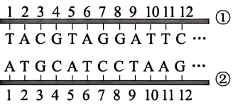
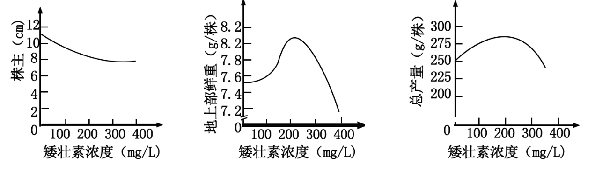
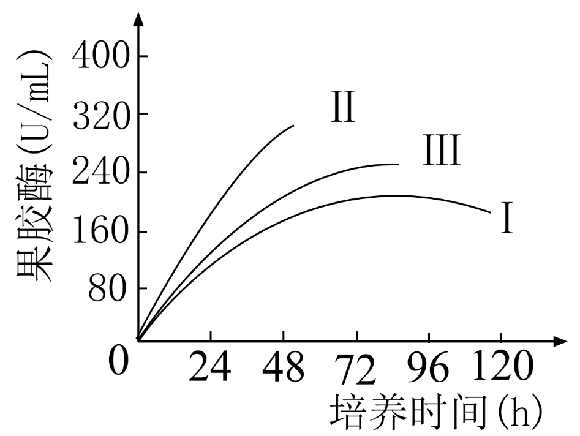
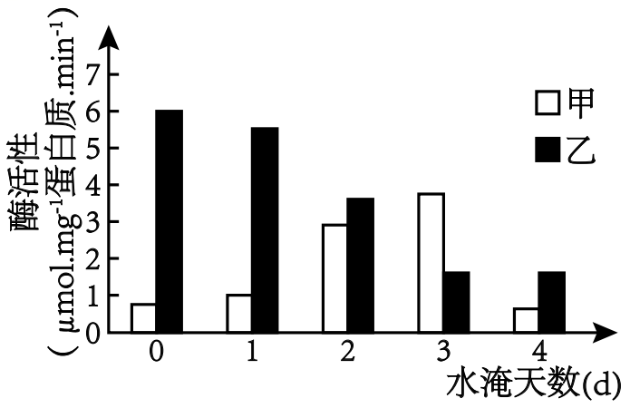
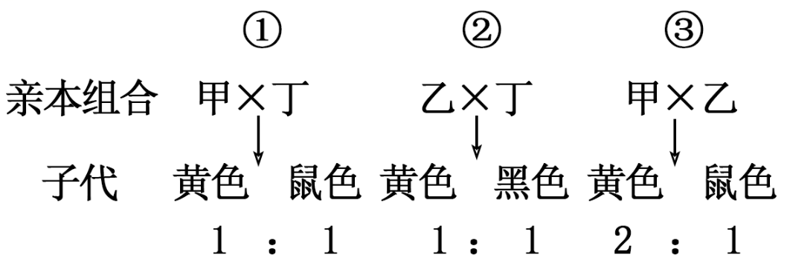

**贵州省2024年普通高中学业水平选择性考试**

**生物学**

**注意事项：**

**1．答卷前，考生务必将自己的姓名、准考证号填写在答题卡上。**

**2．回答选择题时，选出每小题答案后，用2B铅笔把答题卡上对应题目的答案标号涂黑。如需改动，用橡皮擦干净后，再选涂其他答案标号。回答非选择题时，将答案写在答题卡上。写在本试卷上无效。**

**3．考试结束后，将本试卷和答题卡一并交回。**

**一、选择题：本题共16小题，每小题3分，共48分。在每小题给出的四个选项中，只有一项符合题目要求。**

1\. 种子萌发形成幼苗离不开糖类等能源物质，也离不开水和无机盐。下列叙述正确的是（ ）

A. 种子吸收的水与多糖等物质结合后，水仍具有溶解性

B. 种子萌发过程中糖类含量逐渐下降，有机物种类不变

C. 幼苗细胞中的无机盐可参与细胞构建，水不参与

D. 幼苗中的水可参与形成NADPH，也可参与形成NADH

2\. 蝌蚪长出四肢，尾巴消失，发育成蛙。下列叙述正确的是（ ）

A. 四肢细胞分裂时会发生同源染色体分离

B. 四肢的组织来自于干细胞的增殖分化

C. 蝌蚪尾巴逐渐消失是细胞坏死的结果

D. 蝌蚪发育成蛙是遗传物质改变的结果

3\. 为探究不同光照强度对叶色的影响，取紫鸭跖草在不同光照强度下，其他条件相同且适宜，分组栽培，一段时间后获取各组光合色素提取液，用分光光度法（一束单色光通过溶液时，溶液的吸光度与吸光物质的浓度成正比）分别测定每组各种光合色素含量。下列叙述错误的是（ ）

A. 叶片研磨时加入碳酸钙可防止破坏色素

B. 分离提取液中的光合色素可采用纸层析法

C. 光合色素相对含量不同可使叶色出现差异

D. 测定叶绿素的含量时可使用蓝紫光波段

4\. 茶树根细胞质膜上硫酸盐转运蛋白可转运硒酸盐。硒酸盐被根细胞吸收后，随者植物的生长；吸收的大部分硒与胞内蛋白结合形成硒蛋白，硒蛋白转移到细胞壁中储存。下列叙述错误的是（ ）

A. 硒酸盐以离子的形式才能被根细胞吸收

B. 硒酸盐与硫酸盐进入细胞可能存在竞争关系

C. 硒蛋白从细胞内转运到细胞壁需转运蛋白

D. 利用呼吸抑制剂可推测硒酸盐的吸收方式

5\. 大鼠脑垂体瘤细胞可分化成细胞Ⅰ和细胞Ⅱ两种类型，仅细胞Ⅰ能合成催乳素。细胞Ⅰ和细胞Ⅱ中催乳素合成基因的碱基序列相同，但细胞Ⅱ中该基因多个碱基被甲基化。细胞Ⅱ经氮胞苷处理后，再培养可合成催乳素。下列叙述错误的是（ ）

A. 甲基化可以抑制催乳素合成基因的转录

B. 氮胞苷可去除催乳素合成基因的甲基化

C. 处理后细胞Ⅱ的子代细胞能合成催乳素

D. 该基因甲基化不能用于细胞类型的区分

6\. 人类的双眼皮基因对单眼皮基因是显性，位于常染色体上。一个色觉正常的单眼皮女性（甲），其父亲是色盲：一个色觉正常的双眼皮男性（乙），其母亲是单眼皮。下列叙述错误的是（ ）

A. 甲的一个卵原细胞在有丝分裂中期含有两个色盲基因

B. 乙的一个精原细胞在减数分裂Ⅰ中期含四个单眼皮基因

C. 甲含有色盲基因并且一定是来源于她的父亲

D. 甲、乙婚配生出单眼皮色觉正常女儿的概率为1/4

7\. 如图是某基因编码区部分碱基序列，在体内其指导合成肽链的氨基酸序列为：甲硫氨酸-组氨酸-脯氨酸-赖氨酸……下列叙述正确的是（ ）

注：AUG（起始密码子）：甲硫氨酸 CAU、CNC：组氨酸 CCU：脯氨酸 AAG：赖氨酸 UCC：丝氨酸 UAA（终止密码子）

A. ①链是转录的模板链，其左侧是5'端，右侧是3'端

B. 若在①链5～6号碱基间插入一个碱基G，合成的肽链变长

C. 若在①链1号碱基前插入一个碱基G，合成的肽链不变

D. 碱基序列不同的mRNA翻译得到的肽链不可能相同

8\. 将台盼蓝染液注入健康家兔的血管，一段时间后，取不同器官制作切片观察，发现肝和淋巴结等被染成蓝色，而脑和骨骼肌等未被染色。下列叙述错误的是（ ）

A. 实验结果说明，不同器官中毛细血管通透性有差异

B. 脑和骨骼肌等未被染色，是因为细胞膜能控制物质进出

C. 肝、淋巴结等被染成蓝色，说明台盼蓝染液进入了细胞

D. 靶向治疗时，需要考虑药物分子大小与毛细血管通透性

9\. 矮壮素可使草莓植株矮化，提高草莓的产量。科研人员探究了不同浓度的矮壮素对草莓幼苗的矮化和地上部鲜重，以及对果实总产量的影响，实验结果如图所示。下列叙述正确的是（ ）

A. 矮壮素是从植物体提取的具有调节作用的物质

B. 种植草莓时，施用矮壮素的最适浓度为400mg/L

C. 一定范围内，随浓度增加，矮壮素对草莓幼苗的矮化作用减弱

D 一定浓度范围内，果实总产量与幼苗地上部鲜重变化趋势相近

10\. 接种疫苗是预防传染病的重要手段，下列疾病中可通过接种疾苗预防的是（ ）

①肺结核 ②白化病 ③缺铁性贫血 ④流行性感冒 ⑤尿毒症

A. ①④ B. ②③ C. ①⑤ D. ③④

11\. 在公路边坡修复过程中，常选用“豆科-禾本科”植物进行搭配种植。下列叙述错误的是（ ）

A. 边坡修复优先筛选本地植物是因为其适应性强

B. “豆科-禾本科”搭配种植可减少氮肥的施用

C. 人类对边坡的修复加快了群落演替的速度

D. 与豆科植物共生的根瘤菌属于分解者

12\. 孑遗植物杪椤，在贵州数量多、分布面积大。调查发现，常有害虫啃食杪椤嫩叶，影响杪椤的生长、发育和繁殖。下列叙述正确的是（ ）

A. 杪椤的植株高度不属于生态位的研究范畴

B. 建立孑遗植物杪椤的基因库属于易地保护

C. 杪椤有观赏性属于生物多样性的潜在价值

D. 能量从杪椤流向害虫的最大传递效率为20%

13\. 生物学实验中合理选择材料和研究方法是顺利完成实验的前提条件。下列叙述错误的是（ ）

A. 稀释涂布平板法既可分离菌株又可用于计数

B. 进行胚胎分割时通常是在原肠胚期进行分割

C. 获取马铃薯脱毒苗常选取茎尖进行组织培养

D. 使用不同的限制酶也能产生相同的黏性末端

14\. 酵母菌W是一种产果胶酶工程菌。为探究酵母菌W的果胶酶产量与甲醇浓度（Ⅰ\<Ⅱ\<Ⅲ）的关系。将酵母菌W以相同的初始接种量接种到发酵罐，在适宜条件下培养，结果如图所示。下列叙述正确的是（ ）

A. 发酵罐中接种量越高，酵母菌W的K值越大

B. 甲醇浓度为Ⅲ时，酵母菌W的果胶酶合成量最高

C. 72h前，三组实验中，甲醇浓度为Ⅱ时，产果胶酶速率最高

D. 96h后，是酵母菌W用于工业生产中收集果胶酶的最佳时期

15\. 研究结果的合理推测或推论，可促进科学实验的进一步探究。下列对研究结果的推测或推论正确的是（ ）

|     |                       |                                                                                                                  |
|:---:|:---------------------:|:----------------------------------------------------------------------------------------------------------------:|
| 序号  | 研究结果                  | 推测成推论                                                                                                            |
| ①   | 水分子通过细胞膜的速率高于人工膜      | 细胞膜存在特殊的水分子通道                                                                                                    |
| ②   | 人成熟红细胞脂质单分子层面积为表面积的2倍 | 细胞膜的磷脂分子为两层                                                                                                      |
| ③   | 注射加热致死的S型肺炎链球菌，小鼠不死亡  | S型肺炎链球菌DNA被破坏 |
| ④   | DNA双螺旋结构              | 半保留复制                                                                                                            |
| ⑤   | 单侧光照射，胚芽鞘向光弯曲生长       | 胚芽鞘尖端产生生长素                                                                                                       |

A. ①②④ B. ②③⑤ C. ①④⑤ D. ②③④

16\. 李花是两性花，若花粉落到同一朵花的柱头上，萌发产生的花粉管在花柱中会停止生长，原因是花柱细胞产生一种核酸酶降解花粉管中的rRNA所致。下列叙述错误的是（ ）

A. 这一特性表明李不能通过有性生殖繁殖后代

B. 这一特性表明李的遗传多样性高，有利于进化

C. rRNA彻底水解的产物是碱基、核糖、磷酸

D. 该核酸酶可阻碍花粉管中核糖体的形成

**二、非选择题：本题共5小题，共52分。**

17\. 农业生产中，旱粮地低洼处易积水，影响作物根细胞的呼吸作用。据研究，某作物根细胞的呼吸作用与甲、乙两种酶相关，水淹过程中其活性变化如图所示。

回答下列问题。

（1）正常情况下，作物根细胞的呼吸方式主要是有氧呼吸，从物质和能量的角度分析，其代谢特点有\_\_\_\_\_\_\_\_\_\_\_；参与有氧呼吸的酶是\_\_\_\_\_\_\_\_\_\_\_（选填“甲”或“乙”）。

（2）在水淹0～3d阶段，影响呼吸作用强度的主要环境因素是\_\_\_\_\_\_\_\_\_\_\_；水淹第3d时，经检测，作物根的CO2释放量为0.4μnol·g-1·min-1，O2吸收量为0.2μmol·g-1·min-1，若不考虑乳酸发酵，无氧呼吸强度是有氧呼吸强度的\_\_\_\_\_\_\_\_\_\_\_倍。

（3）若水淹3d后排水、稍染长势可在一定程度上得到恢复，从代谢角度分析，原因是\_\_\_\_\_\_\_\_\_\_\_（答出2点即可）。

18\. 每当中午放学时、同学们结伴而行，有说有笑走进食堂排队就餐。回答下列问题。

（1）同学们看到喜欢吃的食物时、唾液的分泌就会增加，这一现象属于\_\_\_\_\_\_\_\_\_\_\_（选填“条件”或“非条件”）反射。完成反射的条件有\_\_\_\_\_\_\_\_\_\_\_。

（2）食糜进入小肠后，可刺激小肠黏膜释放的激素是\_\_\_\_\_\_\_\_\_\_\_，使胰液大量分泌。为验证该激素能促进胰腺大量分泌胰液，以健康狗为实验对象设计实验。写出实验思路\_\_\_\_\_\_\_\_\_\_\_。

19\. 贵州地势西高东低，地形复杂、地貌多样，孕育着森林、湿地、高山草甸等多种多样的生态系统。回答下列问题。

（1）若随海拔的升高，生态系统的类型发生相应改变，导致这种改变的非生物因素主要是\_\_\_\_\_\_\_\_\_\_\_。在一个生态系统中，影响种群密度的直接因素有\_\_\_\_\_\_\_\_\_\_\_。

（2）除了非生物环境外，不同生态系统差别是群落的\_\_\_\_\_\_\_\_\_\_\_不同（答出2点即可）。在不同的群落中，由于地形变化、土壤湿度的差异等，不同种群呈镶嵌分布，这属于群落的\_\_\_\_\_\_\_\_\_\_\_结构。

（3）一般情况下，与非交错区相比，两种生态系统交错区物种之间的竞争\_\_\_\_\_\_\_\_\_\_\_（选填“较强”或“较弱”），原因是\_\_\_\_\_\_\_\_\_\_\_。

20\. 已知小鼠毛皮的颜色由一组位于常染色体上的复等位基因B1（黄色）、B2（鼠色）、B3（黑色）控制。现有甲（黄色短尾）、乙（黄色正常尾）、丙（鼠色短尾）、丁（黑色正常尾）4种基因型的雌雄小鼠若干，某研究小组对其开展了系列实验，结果如图所示。

回答下列问题。

（1）基因B1、B2、B3之间的显隐性关系是\_\_\_\_\_\_\_\_\_\_\_。实验③中的子代比例说明了\_\_\_\_\_\_\_\_\_\_\_，其黄色子代的基因型是\_\_\_\_\_\_\_\_\_\_\_。

（2）小鼠群体中与毛皮颜色有关的基因型共有\_\_\_\_\_\_\_\_\_\_\_种，其中基因型组合为\_\_\_\_\_\_\_\_\_\_\_的小鼠相互交配产生的子代毛皮颜色种类最多。

（3）小鼠短尾（D）和正常尾（d）是一对相对性状，短尾基因纯合时会导致小鼠在胚胎期死亡。小鼠毛皮颜色基因和尾形基因遗传符合自由组合定律，若甲雌雄个体相互交配，则子代表型及比例为\_\_\_\_\_\_\_\_\_\_\_；为测定丙产生的配子类型及比例，可选择丁个体与其杂交，选择丁的理由是\_\_\_\_\_\_\_\_\_\_\_。

21\. 研究者用以蔗糖为唯一碳源的液体培养基，培养真菌A的野生型（含NV基因）、突变体（NV基因突变）和转基因菌株（转入NV基因），检测三种菌株NV酶的生成与培养液中的葡萄糖含量，结果如表所示（表中“+”表示有，“—”表示无）。

|       |     |     |           |
|:-----:|:---:|:---:|:---------:|
| 检测用菌株 | 蔗糖  | NV酶 | 葡萄糖（培养液中） |
| 野生型   | \+  | \+  | \+        |
| 野生型   | —   | —   | —         |
| 突变体   | \+  | —   | —         |
| 转基因菌株 | \+  | \+  | \+        |

回答下列问题。

（1）据表可推测\_\_\_\_\_\_\_\_\_\_\_诱导了NV基因表达。NV酶的作用是\_\_\_\_\_\_\_\_\_\_\_。检测NV酶活性时，需测定的指标是\_\_\_\_\_\_\_\_\_\_\_（答出1点即可）。

（2）表中突变体由T-DNA随机插入野生型菌株基因组DNA筛选获得。从野生型与突变体中分别提取基因组DNA作为模板，用与\_\_\_\_\_\_\_\_\_\_\_（选填“T-DNA”或“NV基因”）配对的引物进行PCR扩增。若突变体扩增片段长度\_\_\_\_\_\_\_\_\_\_\_（选填“\>”“=”或“\<”）野生型扩增片段长度，则表明突变体构建成功，从基因序列分析其原因是\_\_\_\_\_\_\_\_\_\_\_。

（3）为进一步验证NV基因的功能，表中的转基因菌株是将NV基因导入\_\_\_\_\_\_\_\_\_\_\_细胞获得的。在构建NV基因表达载体时，需要添加新的标记基因，原因是\_\_\_\_\_\_\_\_\_\_\_。
