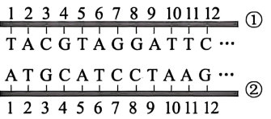
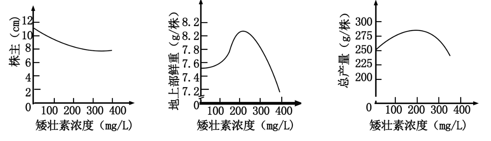
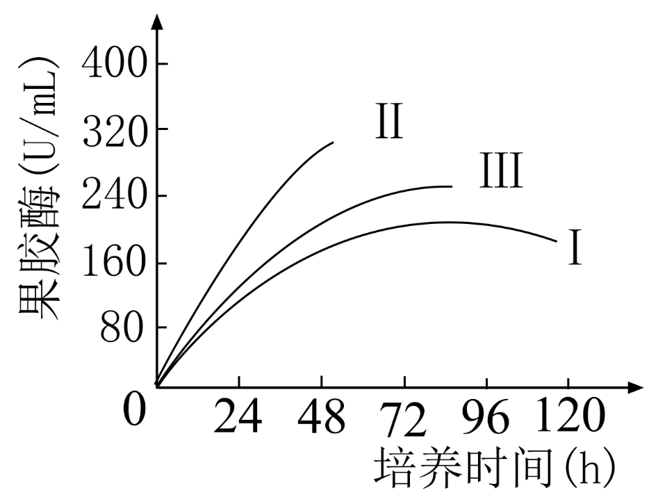
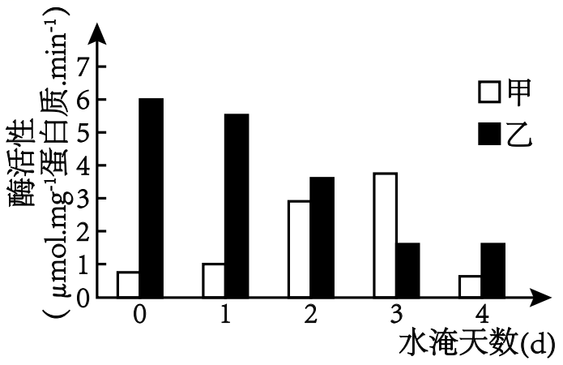
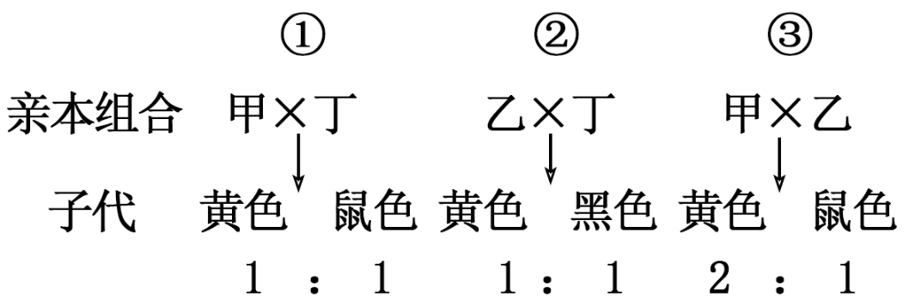

**贵州省2024年普通高中学业水平选择性考试**

**生物学**

**注意事项：**

**1．答卷前，考生务必将自己的姓名、准考证号填写在答题卡上。**

**2．回答选择题时，选出每小题答案后，用2B铅笔把答题卡上对应题目的答案标号涂黑。如需改动，用橡皮擦干净后，再选涂其他答案标号。回答非选择题时，将答案写在答题卡上。写在本试卷上无效。**

**3．考试结束后，将本试卷和答题卡一并交回。**

**一、选择题：本题共16小题，每小题3分，共48分。在每小题给出的四个选项中，只有一项符合题目要求。**

1\. 种子萌发形成幼苗离不开糖类等能源物质，也离不开水和无机盐。下列叙述正确的是（ ）

A. 种子吸收的水与多糖等物质结合后，水仍具有溶解性

B. 种子萌发过程中糖类含量逐渐下降，有机物种类不变

C. 幼苗细胞中的无机盐可参与细胞构建，水不参与

D. 幼苗中的水可参与形成NADPH，也可参与形成NADH

【答案】D

【解析】

【分析】1、有氧呼吸的第一、二、三阶段的场所依次是细胞质基质、线粒体基质和线粒体内膜。有氧呼吸第一阶段是葡萄糖分解成丙酮酸和［ H\]\],合成少量 ATP ；第二阶段是丙酮酸和水反应生成二氧化碳和［ H \]，合成少量 ATP ；第三阶段是氧气和［ H ］反应生成水，合成大量 ATP 。

2、光合作用：①光反应场所在叶绿体类囊体薄膜，发生水的光解、 ATP 和 NADPH 的生成；②暗反应场所在叶绿体的基质，发生CO2的固定和C3的还原，消耗 ATP 和 NADPH 。

【详解】A、种子吸收的水与多糖等物质结合后，这部分水位结合水，失去了溶解性，A错误；

B、种子萌发过程中糖类含量逐渐下降，有机物种类增加，B错误；

C、水也参与细胞构成，如结合水是细胞的重要组成成分，C错误；

D、幼苗中的水可参与光合作用形成NADPH，也可通过有氧呼吸第二阶段丙酮酸和水生成NADH，D正确。

故选D。

2\. 蝌蚪长出四肢，尾巴消失，发育成蛙。下列叙述正确的是（ ）

A. 四肢细胞分裂时会发生同源染色体分离

B. 四肢的组织来自于干细胞的增殖分化

C. 蝌蚪尾巴逐渐消失是细胞坏死的结果

D. 蝌蚪发育成蛙是遗传物质改变的结果

【答案】B

【解析】

【分析】在“蝌蚪长出四肢，尾巴消失，发育成蛙”的过程中，涉及到细胞的增殖、凋亡、分化。

【详解】A、四肢细胞分裂属于有丝分裂，不会发生同源染色体分离，同源染色体分离发生在减数分裂过程中，A错误；

B、动物和人体内仍保留着少数具有分裂和分化能力的细胞，这些细胞叫作干细胞，四肢的组织细胞是来自于干细胞的增殖分化，B正确；

C、蝌蚪尾巴逐渐消失是细胞凋亡的结果，C错误；

D、蝌蚪发育成蛙是细胞分化的结果，细胞分化是细胞中基因选择性表达，而不是遗传物质改变，D错误。

故选B。

3\. 为探究不同光照强度对叶色的影响，取紫鸭跖草在不同光照强度下，其他条件相同且适宜，分组栽培，一段时间后获取各组光合色素提取液，用分光光度法（一束单色光通过溶液时，溶液的吸光度与吸光物质的浓度成正比）分别测定每组各种光合色素含量。下列叙述错误的是（ ）

A. 叶片研磨时加入碳酸钙可防止破坏色素

B. 分离提取液中的光合色素可采用纸层析法

C. 光合色素相对含量不同可使叶色出现差异

D. 测定叶绿素的含量时可使用蓝紫光波段

【答案】D

【解析】

【分析】叶绿体色素的提取和分离实验：（1）提取色素原理：色素能溶解在酒精或丙酮等有机溶剂中，所以可用无水酒精等提取色素。（2）分离色素原理：各色素随层析液在滤纸上扩散速度不同，从而分离色素。溶解度大，扩散速度快；溶解度小，扩散速度慢。（3）各物质作用：无水乙醇或丙酮：提取色素；层析液：分离色素；二氧化硅：使研磨得充分；碳酸钙：防止研磨中色素被破坏。（4）结果：滤纸条从上到下依次是：胡萝卜素（最窄）、叶黄素、叶绿素a（最宽）、叶绿素b（第2宽），色素带的宽窄与色素含量相关。

【详解】A、提取光合色素加入碳酸钙可以防止色素被破坏，A正确；

B、由于不同色素在层析液中溶解度不同，因此在滤纸上的扩散速度不同，从而达到分离的效果，这是纸层析法，B正确；

C、不同光合色素颜色不同，因此光合色素相对含量不同可使叶色出现差异 ，叶绿素多使叶片呈现绿色，而秋季类胡萝卜素增多使叶片呈黄色，C正确；

D、叶绿素和类胡萝卜素都可以吸水蓝紫光，所以不能用蓝紫光波段测定叶绿素含量，D错误。

故选D。

4\. 茶树根细胞质膜上的硫酸盐转运蛋白可转运硒酸盐。硒酸盐被根细胞吸收后，随者植物的生长；吸收的大部分硒与胞内蛋白结合形成硒蛋白，硒蛋白转移到细胞壁中储存。下列叙述错误的是（ ）

A. 硒酸盐以离子的形式才能被根细胞吸收

B. 硒酸盐与硫酸盐进入细胞可能存在竞争关系

C. 硒蛋白从细胞内转运到细胞壁需转运蛋白

D. 利用呼吸抑制剂可推测硒酸盐的吸收方式

【答案】C

【解析】

【分析】根细胞从土壤吸收无机盐离子的方式主要是主动运输，该运输方式的特点是：从低浓度一侧运输到高浓度一 侧，需要载体蛋白的协助，同时还需要消耗细胞内化学反应所释放的能量。

【详解】A、硒酸盐是无机盐，必需以离子的形式才能被根细胞吸收，A正确；

B、根据题意，由于根细胞质膜上的硫酸盐转运蛋白可转运硒酸盐，故硒酸盐与硫酸盐进入细胞可能存在竞争关系，B正确；

C、硒蛋白从细胞内转运到细胞壁是通过胞吐的方式实现的，故不需转运蛋白，C错误；

D、利用呼吸抑制剂处理根细胞，根据处理前后根细胞吸收硒酸盐的量可推测硒酸盐的吸收方式，D正确。

故选C。

5\. 大鼠脑垂体瘤细胞可分化成细胞Ⅰ和细胞Ⅱ两种类型，仅细胞Ⅰ能合成催乳素。细胞Ⅰ和细胞Ⅱ中催乳素合成基因碱基序列相同，但细胞Ⅱ中该基因多个碱基被甲基化。细胞Ⅱ经氮胞苷处理后，再培养可合成催乳素。下列叙述错误的是（ ）

A. 甲基化可以抑制催乳素合成基因的转录

B. 氮胞苷可去除催乳素合成基因的甲基化

C. 处理后细胞Ⅱ的子代细胞能合成催乳素

D. 该基因甲基化不能用于细胞类型的区分

【答案】D

【解析】

【分析】表观遗传是指DNA序列不发生变化，但基因的表达却发生了可遗传的改变，即基因型未发生变化而表现型却发生了改变，如DNA的甲基化，甲基化的基因不能与RNA聚合酶结合，故无法进行转录产生mRNA，也就无法进行翻译，最终无法合成相应蛋白，从而抑制了基因的表达。

【详解】A、由题意可知，细胞Ⅰ和细胞Ⅱ中催乳素合成基因的碱基序列相同，但细胞Ⅱ中该基因多个碱基被甲基化，导致仅细胞Ⅰ能合成催乳素，说明甲基化可以抑制催乳素合成基因的转录，A正确；

B、细胞Ⅱ经氮胞苷处理后，再培养可合成催乳素，说明氮胞苷可去除催乳素合成基因的甲基化，B正确；

C、甲基化可以遗传，同理，细胞Ⅱ经氮胞苷处理后，再培养可合成催乳素，这一特性也可遗传，所以处理后细胞Ⅱ的子代细胞能合成催乳素，C正确；

D、题中细胞Ⅰ和细胞Ⅱ两种类型就是按基因是否甲基化划分的，D错误。

故选D。

6\. 人类双眼皮基因对单眼皮基因是显性，位于常染色体上。一个色觉正常的单眼皮女性（甲），其父亲是色盲：一个色觉正常的双眼皮男性（乙），其母亲是单眼皮。下列叙述错误的是（ ）

A. 甲的一个卵原细胞在有丝分裂中期含有两个色盲基因

B. 乙的一个精原细胞在减数分裂Ⅰ中期含四个单眼皮基因

C. 甲含有色盲基因并且一定是来源于她的父亲

D. 甲、乙婚配生出单眼皮色觉正常女儿的概率为1/4

【答案】B

【解析】

【分析】红绿色盲由X染色体上的隐性基因控制，假设用B/b表示相关基因。色觉正常女性，其父亲是红绿色盲患者，其基因型为XBXb。

【详解】A、假设人类的双眼皮基因对单眼皮基因用A、a表示，A表示双眼皮，B、b表示红绿色盲，一个色觉正常的单眼皮女性（甲），其父亲是色盲，则该甲的基因型为aaXBXb，一个色觉正常的双眼皮男性（乙），其母亲是单眼皮，乙的基因型为AaXBY，甲的卵原细胞在有丝分裂中期，DNA进行了复制，有2个b，A正确；

B、乙的基因型为AaXBY，减数分裂前，DNA进行复制，减数分裂Ⅰ中期含2个单眼皮基因，B错误；

C、甲不患红绿色盲，一定有一个B，其父亲患红绿色盲，有b基因，遗传给甲，所以甲的基因型为aaXBXb，甲含有色盲基因并且一定是来源于她的父亲，C正确；

D、甲的基因型为aaXBXb，乙的基因型为AaXBY，甲、乙婚配生出单眼皮色觉正常女儿的概率为1/2×1/2=1/4，D正确。

故选B。

7\. 如图是某基因编码区部分碱基序列，在体内其指导合成肽链的氨基酸序列为：甲硫氨酸-组氨酸-脯氨酸-赖氨酸……下列叙述正确的是（ ）

注：AUG（起始密码子）：甲硫氨酸 CAU、CNC：组氨酸 CCU：脯氨酸 AAG：赖氨酸 UCC：丝氨酸 UAA（终止密码子）

A. ①链是转录的模板链，其左侧是5'端，右侧是3'端

B. 若在①链5～6号碱基间插入一个碱基G，合成的肽链变长

C. 若在①链1号碱基前插入一个碱基G，合成的肽链不变

D. 碱基序列不同的mRNA翻译得到的肽链不可能相同

【答案】C

【解析】

【分析】转录是以DNA的一条链为模板，合成RNA的过程。

【详解】A、转录是以DNA的一条链为模板，按照碱基互补配对原则合成RNA的过程，由于起始密码子是AUG，故①链是转录的模板链，转录时模板链读取的方向是3'→5'，即左侧是3'端，右侧是5'端，A错误；

B、在①链5～6号碱基间插入一个碱基G，将会导致终止密码子提前出现，故合成的肽链变短，B错误；

C、若在①链1号碱基前插入一个碱基G，在起始密码子之前加了一个碱基，不影响起始密码子和终止密码子之间的序列，故合成的肽链不变，C正确；

D、由于mRNA是翻译模板，但由于密码子的简并性，故碱基序列不同的mRNA翻译得到的肽链也可能相同，D错误。

故选C。

8\. 将台盼蓝染液注入健康家兔的血管，一段时间后，取不同器官制作切片观察，发现肝和淋巴结等被染成蓝色，而脑和骨骼肌等未被染色。下列叙述错误的是（ ）

A. 实验结果说明，不同器官中毛细血管通透性有差异

B. 脑和骨骼肌等未被染色，是因为细胞膜能控制物质进出

C. 肝、淋巴结等被染成蓝色，说明台盼蓝染液进入了细胞

D. 靶向治疗时，需要考虑药物分子大小与毛细血管通透性

【答案】C

【解析】

【分析】血浆、组织液和淋巴构成了内环境；内环境中包含水、激素、神经递质、缓冲物质、小分子有机物、无机盐等成分；只存在于细胞内的成分不属于内环境，如呼吸酶和血红蛋白等，不能进入细胞的大分子不属于内环境，如纤维素等，消化酶不存在于内环境，细胞膜上的载体不属于内环境。

【详解】A、由于毛细血管通透性不同，导致物质进出细胞有差异，实验结果说明，不同器官中毛细血管通透性有差异，A正确；

BC、有的器官可以被台盼蓝细胞染色，说明大分子物质可以进入组织液，而不能被台盼蓝染色的器官大分子不能进入组织液；脑和骨骼肌等未被染色，是因为台盼蓝染液未进入脑、骨骼肌细胞之间的组织液，且这些细胞的细胞膜能控制物质进出；肝、淋巴结等被染成蓝色，说明台盼蓝染液进入了肝、淋巴结细胞之间的组织液，B正确、C错误；

D、根据题目信息分析，只有小分子物质才能进入脑和骨骼肌，靶向治疗时，需要考虑药物分子大小与毛细血管通透性，D正确。

故选C。

9\. 矮壮素可使草莓植株矮化，提高草莓的产量。科研人员探究了不同浓度的矮壮素对草莓幼苗的矮化和地上部鲜重，以及对果实总产量的影响，实验结果如图所示。下列叙述正确的是（ ）

A. 矮壮素是从植物体提取的具有调节作用的物质

B. 种植草莓时，施用矮壮素的最适浓度为400mg/L

C. 一定范围内，随浓度增加，矮壮素对草莓幼苗的矮化作用减弱

D. 一定浓度范围内，果实总产量与幼苗地上部鲜重变化趋势相近

【答案】D

【解析】

【分析】矮壮素是一种植物生长调节剂，能抑制植株的营养生长，促进生殖生长，使植株节间缩短，长得矮、壮、粗，从而提高作物的抗倒伏能力和抗逆性。 矮壮素可以用于多种作物，如小麦、水稻、棉花、玉米等，能防止作物徒长和倒伏，增加产量。但使用时需要注意浓度和使用时期，浓度过高或使用不当可能会对作物产生不良影响，如导致植株生长停滞、畸形等。

【详解】A、矮壮素是人工合成的具有调节作用的物质，不是从植物体提取的，A 错误；

B、由图可知，施用矮壮素最适浓度不是 400mg/L，应该在200mg/L左右，B 错误；

C 、由图可知，一定范围内，随浓度增加，矮壮素对草莓幼苗的矮化作用先增强后减弱，C 错误；

D 、从图中可以看出，在一定浓度范围内，果实总产量与幼苗地上部鲜重的变化趋势较为相近，D 正确。

故选D。

10\. 接种疫苗是预防传染病的重要手段，下列疾病中可通过接种疾苗预防的是（ ）

①肺结核 ②白化病 ③缺铁性贫血 ④流行性感冒 ⑤尿毒症

A. ①④ B. ②③ C. ①⑤ D. ③④

【答案】A

【解析】

【分析】疫苗是指用各类病原微生物制作的用于预防接种的生物制品。

【详解】① 肺结核是由结核分枝杆菌引起的传染病，可以通过接种卡介苗预防，①正确；

②白化病是一种遗传性疾病，不能通过接种疫苗预防，②错误；

③缺铁性贫血是由于铁摄入不足等原因导致的营养性疾病，不是传染病，不能通过接种疫苗预防，③错误；

④流行性感冒是由流感病毒引起的传染病，可以通过接种流感疫苗预防，④正确；

⑤尿毒症是各种晚期的肾脏病共有的临床综合征，不是传染病，不能通过接种疫苗预防，⑤错误；

综上①④正确，A正确，BCD错误。

故选A。

11\. 在公路边坡修复过程中，常选用“豆科-禾本科”植物进行搭配种植。下列叙述错误的是（ ）

A. 边坡修复优先筛选本地植物是因为其适应性强

B. “豆科-禾本科”搭配种植可减少氮肥的施用

C. 人类对边坡的修复加快了群落演替的速度

D. 与豆科植物共生的根瘤菌属于分解者

【答案】D

【解析】

【分析】1、群落演替是指随着时间的推移，一个群落被另一个群落代替的过程。

2、生态系统的成分包括生产者、消费者、分解者、非生物的物质和能量。

【详解】A、边坡修复优先筛选本地植物是因为其适应性强，同时避免外来物种带来了生态危害，A正确；

B、根瘤菌和豆科植物共生可以固氮生成氮肥，所以“豆科-禾本科”搭配种植可减少氮肥的施用，B正确；

C、人类活动可以改变群落演替的速度和方向，对边坡的修复加快了群落演替的速度，C正确；

D、根瘤菌朱姐利用豆科植物光合作用产生的营养物质，与豆科植物共生的根瘤菌属于消费者，D错误。

故选D。

12\. 孑遗植物杪椤，在贵州数量多、分布面积大。调查发现，常有害虫啃食杪椤嫩叶，影响杪椤的生长、发育和繁殖。下列叙述正确的是（ ）

A. 杪椤的植株高度不属于生态位的研究范畴

B. 建立孑遗植物杪椤的基因库属于易地保护

C. 杪椤有观赏性属于生物多样性的潜在价值

D. 能量从杪椤流向害虫的最大传递效率为20%

【答案】D

【解析】

【分析】生态位：（1）概念：物种利用各种资源的幅度以及该物种与种群中其他物种关系的总和；（2）作用：决定生活在什么地方，而且决定于它与食物、天敌和其他生物的关系；（3）意义：它表示物种在群落中的地位、作用和重要性。

【详解】A、研究某种植物的生态位，通常要研究它在研究区域内的出现频率﹑种群密度、植株高度等特征，以及它与其他物种的关系等，A错误；

B、易地保护是指把保护对象从原地迁出，在异地进行专门保护，例如,建立植物园、动物园以及濒危动植物繁育中心等，建立杪锣的基因库不属于易地保护，B错误；

C、杪锣有观赏性属于生物多样性的直接价值，C错误；

D、能量流动具有逐级递减的特点，下一个营养级最多获得上一个营养级能量的20%，所以能量从杪椤流向害虫的最大传递效率为20% ，D正确。

故选D。

13\. 生物学实验中合理选择材料和研究方法是顺利完成实验的前提条件。下列叙述错误的是（ ）

A. 稀释涂布平板法既可分离菌株又可用于计数

B. 进行胚胎分割时通常是在原肠胚期进行分割

C. 获取马铃薯脱毒苗常选取茎尖进行组织培养

D. 使用不同的限制酶也能产生相同的黏性末端

【答案】B

【解析】

【分析】胚胎分割是指采用机械方法将早期胚胎切割成2等份、4等份或8等份等，经移植获得同卵双胎或多胎的技术。

【详解】A、稀释涂布平板法除可以用于分离微生物外，也常用来统计样品中活菌的数目。当样品的稀释度足够高时，培养基表面生长的一个单菌落，来源于样品稀释液中的一个活菌，通过统计平板上的菌落数，就能推测出样品中大约含有多少活菌，A正确；

B、在进行胚胎分割时，应选择发育良好、形态正常的桑葚胚或囊胚，B错误；

C、马铃薯顶端分生区附近（如茎尖）的病毒极少，甚至无病毒，所以可以选取马铃薯茎尖进行组织培养获得脱毒苗，C正确；

D、不同的限制酶识别的DNA序列不同，但使用不同的限制酶也能产生相同的黏性末端，D正确。

故选B。

14\. 酵母菌W是一种产果胶酶工程菌。为探究酵母菌W的果胶酶产量与甲醇浓度（Ⅰ\<Ⅱ\<Ⅲ）的关系。将酵母菌W以相同的初始接种量接种到发酵罐，在适宜条件下培养，结果如图所示。下列叙述正确的是（ ）

A. 发酵罐中接种量越高，酵母菌W的K值越大

B. 甲醇浓度为Ⅲ时，酵母菌W的果胶酶合成量最高

C. 72h前，三组实验中，甲醇浓度为Ⅱ时，产果胶酶速率最高

D. 96h后，是酵母菌W用于工业生产中收集果胶酶的最佳时期

【答案】C

【解析】

【分析】由图可知，图中曲线属于S形曲线，当甲醇浓度为Ⅱ时，酵母菌W的果胶酶合成量最高，72h前，产果胶酶速率最高，即相应曲线的斜率最大。

【详解】A、K值与接种量无关，与空间、资源等因素有关，A错误；

B、由图可知，甲醇浓度为Ⅱ时，酵母菌W的果胶酶合成量最高，B错误；

C、72h前，三组实验中，甲醇浓度为Ⅱ时，产果胶酶速率最高，即相应曲线的斜率最大，C正确；

D、收集果胶酶的最佳时期应在K/2处，不同甲醇浓度对用的收集时间不同，但不会在96h后，此时已达到K值，D错误。

故选C。

15\. 研究结果的合理推测或推论，可促进科学实验的进一步探究。下列对研究结果的推测或推论正确的是（ ）

|     |                       |                |
|:---:|:---------------------:|:--------------:|
| 序号  | 研究结果                  | 推测成推论          |
| ①   | 水分子通过细胞膜的速率高于人工膜      | 细胞膜存在特殊的水分子通道  |
| ②   | 人成熟红细胞脂质单分子层面积为表面积的2倍 | 细胞膜的磷脂分子为两层    |
| ③   | 注射加热致死的S型肺炎链球菌，小鼠不死亡  | S型肺炎链球菌的DNA被破坏 |
| ④   | DNA双螺旋结构              | 半保留复制          |
| ⑤   | 单侧光照射，胚芽鞘向光弯曲生长       | 胚芽鞘尖端产生生长素     |

A. ①②④ B. ②③⑤ C. ①④⑤ D. ②③④

【答案】A

【解析】

【分析】1925年，两位荷兰科学家用丙酮从人的红细胞中提取脂质，在空气一水界面上铺展成单分子层，测得单分子层的面积恰为红细胞表面积的2倍。由此他们得出的结论是细胞膜中的脂质分子排列为连续的两层。

【详解】①由于水可以通过水通道蛋白进入细胞，且速度更快，而人工膜缺少水分子通道蛋白，所以水分子通过细胞膜的速率高于人工膜，①正确；

②人成熟红细胞不含任何细胞器，故可由其脂质单分子层面积为表面积的2倍，推测细胞膜中的磷脂分子为两层，②正确；

③如果只是注射加热致死的S型肺炎链球菌，由于缺少R型细菌，所以小鼠不会死亡，不能得出S型肺炎链球菌的DNA被破坏的结论，③错误；

④沃森和克里克根据DNA的双螺旋结构提出了遗传物质自我复制假说，这种复制方式称作半保留复制，④正确；

⑤单侧光照射时，胚芽鞘向光弯曲生长，只能说明胚芽鞘具有向光性，由于缺乏相应对照，无法说明胚芽鞘尖端产生生长素，⑤错误。

故选A。

16\. 李花是两性花，若花粉落到同一朵花的柱头上，萌发产生的花粉管在花柱中会停止生长，原因是花柱细胞产生一种核酸酶降解花粉管中的rRNA所致。下列叙述错误的是（ ）

A. 这一特性表明李不能通过有性生殖繁殖后代

B. 这一特性表明李的遗传多样性高，有利于进化

C. rRNA彻底水解的产物是碱基、核糖、磷酸

D. 该核酸酶可阻碍花粉管中核糖体的形成

【答案】A

【解析】

【分析】根据题意，核酸酶水解rRNA（核糖体RNA），导致花粉管在花柱中会停止生长。

【详解】A、根据题意，李花是两性花，若花粉落到同一朵花的柱头上，萌发产生的花粉管在花柱中会停止生长，即李花不能自花传粉，但可以异花传粉，故能通过有性生殖繁殖后代，A错误；

B、由于李花通过异花传粉繁殖后代，故遗传多样性高，有利于进化，B正确；

C、rRNA彻底水解的产物有ACGU碱基、核糖和磷酸，C正确；

D、由于rRNA和蛋白质构成核糖体，故核酸酶可阻碍花粉管中核糖体的形成，D正确。

故选A。

**二、非选择题：本题共5小题，共52分。**

17\. 农业生产中，旱粮地低洼处易积水，影响作物根细胞的呼吸作用。据研究，某作物根细胞的呼吸作用与甲、乙两种酶相关，水淹过程中其活性变化如图所示。

回答下列问题。

（1）正常情况下，作物根细胞的呼吸方式主要是有氧呼吸，从物质和能量的角度分析，其代谢特点有\_\_\_\_\_\_\_\_\_\_\_；参与有氧呼吸的酶是\_\_\_\_\_\_\_\_\_\_\_（选填“甲”或“乙”）。

（2）在水淹0～3d阶段，影响呼吸作用强度的主要环境因素是\_\_\_\_\_\_\_\_\_\_\_；水淹第3d时，经检测，作物根的CO2释放量为0.4μnol·g-1·min-1，O2吸收量为0.2μmol·g-1·min-1，若不考虑乳酸发酵，无氧呼吸强度是有氧呼吸强度的\_\_\_\_\_\_\_\_\_\_\_倍。

（3）若水淹3d后排水、稍染长势可在一定程度上得到恢复，从代谢角度分析，原因是\_\_\_\_\_\_\_\_\_\_\_（答出2点即可）。

【答案】（1） ①. 有氧条件下，将葡萄糖彻底氧化分解产生能量 ②. 乙

（2） ①. O2含量 ②. 3

（3）无氧呼吸产生酒精对植物有毒害作用，3d后排水可以将酒精排除，减轻毒害作用；3d后排水可以使有氧呼吸增强，增加产能

【解析】

【分析】细胞呼吸主要为有氧呼吸，有氧呼吸分为三个阶段：

第一阶段：在细胞质的基质中，一个分子的葡萄糖分解成两个分子的丙酮酸，同时脱下4个\[H\](活化氢)；在葡萄糖分解的过程中释放出少量的能量，其中一部分能量用于合成ATP，产生少量的ATP。这一阶段不需要氧的参与，是在细胞质基质中进行的。

第二阶段：丙酮酸进入线粒体的基质中，两分子丙酮酸和6个水分子中的氢全部脱下，共脱下20个\[H\]，丙酮酸被氧化分解成二氧化碳；在此过程释放少量的能量，其中一部分用于合成ATP，产生少量的能量。这一阶段也不需要氧的参与，是在线粒体基质中进行的。

第三阶段：在线粒体的内膜上，前两阶段脱下的共24个\[H\]与从外界吸收或叶绿体光合作用产生的6个O2结合成水；在此过程中释放大量的能量，其中一部分能量用于合成ATP，产生大量的能量。这一阶段需要氧的参与，是在线粒体内膜上进行的。

【小问1详解】

正常情况下，作物根细胞的呼吸方式主要是有氧呼吸，有氧呼吸是在氧气充足的情况下，将葡萄糖彻底氧化分解，将能量释放出来。随着水淹天数的增多，乙的活性降低，说明乙是与有氧呼吸有关的酶。

【小问2详解】

在水淹0～3d阶段，随着水淹天数的增加，氧气含量减少，有氧呼吸减弱，无氧呼吸增强。CO2释放量为0.4μnol·g-1·min-1，O2吸收量为0.2μmol·g-1·min-1，有氧呼吸需要消耗氧气，葡萄糖的消耗量、氧气消耗量和CO2释放量为1：6：6，所以有氧呼吸葡萄糖消耗1/3，无氧呼吸葡萄糖消耗量和CO2释放量比为1：2，无氧呼吸产生0.4μnol·g-1·min-1 CO2，消耗葡萄糖为1，所以无氧呼吸强度是有氧呼吸强度的3倍。

【小问3详解】

若水淹3d后排水，植物长势可在一定程度上得到恢复，一方面是排水后氧气含量上升，有氧呼吸增强，产生的能量增多；另一方面，由图可知，第四天无氧呼吸有关的酶活性显著降低，可能是第四天无氧呼吸产生的酒精毒害作用达到了一定程度，之后就很难恢复，所以要在水淹3天排水。

18\. 每当中午放学时、同学们结伴而行，有说有笑走进食堂排队就餐。回答下列问题。

（1）同学们看到喜欢吃的食物时、唾液的分泌就会增加，这一现象属于\_\_\_\_\_\_\_\_\_\_\_（选填“条件”或“非条件”）反射。完成反射的条件有\_\_\_\_\_\_\_\_\_\_\_。

（2）食糜进入小肠后，可刺激小肠黏膜释放的激素是\_\_\_\_\_\_\_\_\_\_\_，使胰液大量分泌。为验证该激素能促进胰腺大量分泌胰液，以健康狗为实验对象设计实验。写出实验思路\_\_\_\_\_\_\_\_\_\_\_。

【答案】（1） ①. 条件 ②. 需要完整的反射弧和适宜的刺激

（2） ①. 促胰液素 ②. 1、剪取甲狗的一段小肠，刮取黏膜并用稀盐酸浸泡一段时间后，将其研磨液注入乙狗的静脉，观察实验现象；2、不用稀盐酸浸泡，直接将等量的甲狗小肠黏膜研磨液注入乙狗静脉，观察实验现象；3、直接将等量的稀盐酸注入乙狗静脉，观察实验现象。

【解析】

【分析】反射分为条件或非条件反射，结构基础是反射弧；食糜可进入人的小肠，可刺激小肠黏膜分泌促胰液素，该物质通过体液运输作用于胰腺，引起胰腺分泌胰液。胰腺分泌胰液是离不开激素调节。

【小问1详解】

同学们看到喜欢吃的食物时，唾液的分泌就会增加，这一现象属于条件反射，是后天形成的，完成反射的条件有需要经过完整的反射弧，不经过完整的反射弧引起的生理过程不认为是反射，还有是要有适宜的刺激，当刺激达到一定的强度时，才会引起反射；

【小问2详解】

食糜进入小肠后，可刺激小肠黏膜释放的激素是促胰液素，该物质通过体液运输作用于胰腺，引起胰腺分泌胰液，这属于激素调节。为验证该激素能促进胰腺大量分泌胰液，以健康狗为实验对象设计实验，遵循对照原则，写出实验思路如下：准备相关实验材料，1、剪取甲狗的一段小肠，刮取黏膜并用稀盐酸浸泡一段时间后，将其研磨液注入乙狗的静脉，观察实验现象；2、不用稀盐酸浸泡，直接将等量的甲狗小肠黏膜研磨液注入乙狗静脉，观察实验现象；3、直接将等量的稀盐酸注入乙狗静脉，观察实验现象。综上所述，得出结论，促胰液素促进胰腺大量分泌胰液。

19\. 贵州地势西高东低，地形复杂、地貌多样，孕育着森林、湿地、高山草甸等多种多样的生态系统。回答下列问题。

（1）若随海拔的升高，生态系统的类型发生相应改变，导致这种改变的非生物因素主要是\_\_\_\_\_\_\_\_\_\_\_。在一个生态系统中，影响种群密度的直接因素有\_\_\_\_\_\_\_\_\_\_\_。

（2）除了非生物环境外，不同生态系统的差别是群落的\_\_\_\_\_\_\_\_\_\_\_不同（答出2点即可）。在不同的群落中，由于地形变化、土壤湿度的差异等，不同种群呈镶嵌分布，这属于群落的\_\_\_\_\_\_\_\_\_\_\_结构。

（3）一般情况下，与非交错区相比，两种生态系统交错区物种之间的竞争\_\_\_\_\_\_\_\_\_\_\_（选填“较强”或“较弱”），原因是\_\_\_\_\_\_\_\_\_\_\_。

【答案】（1） ①. 温度 ②. 出生率、死亡率、迁入率和迁出率

（2） ①. 物种组成不同、物种数目不同 ②. 水平

（3） ①. 较强 ②. 在生态系统交错区不同物种之间的竞争不仅体现在对资源的争夺上，还体现在生态位和生存空间的竞争上

【解析】

【分析】1、生态系统的组成成分包括非生物的物质和能量，生产者、消费者和分解者。

2、在自然界，种群的数量变化受到阳光、温度、水等非 生物因素的影响。

3、种群密度是种群最基本的数量特征。种群的 其他数量特征是影响种群密度的重要因素，其中出生率和死 亡率、迁入率和迁出率直接决定种群密度，年龄结构影响出 生率和死亡率，性别比例影响出生率，进而影响种群密度。

【小问1详解】

在自然界，种群的数量变化受到阳光、温度、水等非生物因素的影响；若随海拔的升高，生态系统的类型发生相应改变，导致这种改变的非生物因素主要是温度。种群密度是种群最基本的数量特征。种群的 其他数量特征是影响种群密度的重要因素，其中出生率和死亡率、迁入率和迁出率直接决定种群密度，年龄结构影响出生率和死亡率，性别比例影响出生率，进而影响种群密度；在一个生态系统中，影响种群密度的直接因素有出生率、死亡率、迁入率和迁出率。

【小问2详解】

要认识一个群落，首先要分析该群落的物种组成。物 种组成是区别不同群落的重要特征，也是决定群落性质最重要的因素；不同群落的物种组成不同， 物种的数目也有差别；可见不同生态系统的差别是群落的物种组成不同、物种的数目也不同。群落的结构包括垂直结构和水平结构，在不同的群落中，由于地形变化、土壤湿度的差异等，不同种群呈镶嵌分布，这属于群落的水平结构。

【小问3详解】

群落交错区是指两个或多个群落之间的过渡区域；在群落交错区，由于多个生物群落的共存和相互影响，物种之间的竞争尤为激烈。这种竞争不仅体现在对资源的争夺上，还体现在生态位和生存空间的竞争上。这种竞争对于群落交错区的物种组成和生态系统结构具有重要影响。可见一般情况下，与非交错区相比，两种生态系统交错区物种之间的竞争较强，原因是，在生态系统交错区不同物种之间的竞争不仅体现在对资源的争夺上，还体现在生态位和生存空间的竞争上。

20\. 已知小鼠毛皮的颜色由一组位于常染色体上的复等位基因B1（黄色）、B2（鼠色）、B3（黑色）控制。现有甲（黄色短尾）、乙（黄色正常尾）、丙（鼠色短尾）、丁（黑色正常尾）4种基因型的雌雄小鼠若干，某研究小组对其开展了系列实验，结果如图所示。

回答下列问题。

（1）基因B1、B2、B3之间显隐性关系是\_\_\_\_\_\_\_\_\_\_\_。实验③中的子代比例说明了\_\_\_\_\_\_\_\_\_\_\_，其黄色子代的基因型是\_\_\_\_\_\_\_\_\_\_\_。

（2）小鼠群体中与毛皮颜色有关的基因型共有\_\_\_\_\_\_\_\_\_\_\_种，其中基因型组合为\_\_\_\_\_\_\_\_\_\_\_的小鼠相互交配产生的子代毛皮颜色种类最多。

（3）小鼠短尾（D）和正常尾（d）是一对相对性状，短尾基因纯合时会导致小鼠在胚胎期死亡。小鼠毛皮颜色基因和尾形基因的遗传符合自由组合定律，若甲雌雄个体相互交配，则子代表型及比例为\_\_\_\_\_\_\_\_\_\_\_；为测定丙产生的配子类型及比例，可选择丁个体与其杂交，选择丁的理由是\_\_\_\_\_\_\_\_\_\_\_。

【答案】（1） ①. B1对B2、B3为显性，B2对B3为显性 ②. 基因型B1B1的个体死亡且B2对B3为显性 ③. B1B2、B1B3

（2） ①. 5##五 ②. B1B3和B2B3

（3） ①. 黄色短尾：黄色正常尾：鼠色短尾：鼠色正常尾=4：2：2：1 ②. 丁是隐性纯合子B3B3dd

【解析】

【分析】根据题意，B1、B2、B3之间的显隐性关系是B1对B2、B3为显性，B2对B3为显性。

【小问1详解】

根据图中杂交组合②可知，B1对B3为显性；根据图中杂交组合③可知，B1对B2为显性；根据图中杂交组合①可知，B2对B3为显性，故B1对B2、B3为显性，B2对B3为显性。实验③中的子代比例说明基因型B1B1的个体死亡且B2对B3为显性，其黄色子代的基因型是B1B2、B1B3。

【小问2详解】

根据（1）可知，小鼠群体中与毛皮颜色有关的基因型有B1B2、B1B3、B2B2、B2B3、B3B3，共有5种。其中B1B3和B2B3交配后代的毛色种类最多，共有黄色、鼠色和黑色3种。

【小问3详解】

根据题意，甲的基因型是B1B2Dd，则该基因型的雌雄个体相互交配，子代表型及比例为黄色短尾：黄色正常尾：鼠色短尾：鼠色正常尾=4：2：2：1。丙为鼠色短尾，其基因型表示为B2\_Dd，为测定丙产生的配子类型及比例，可采用测交的方法，即丁个体与其杂交，理由是丁是隐性纯合子B3B3dd。

21\. 研究者用以蔗糖为唯一碳源的液体培养基，培养真菌A的野生型（含NV基因）、突变体（NV基因突变）和转基因菌株（转入NV基因），检测三种菌株NV酶的生成与培养液中的葡萄糖含量，结果如表所示（表中“+”表示有，“—”表示无）。

|       |     |     |           |
|:-----:|:---:|:---:|:---------:|
| 检测用菌株 | 蔗糖  | NV酶 | 葡萄糖（培养液中） |
| 野生型   | \+  | \+  | \+        |
| 野生型   | —   | —   | —         |
| 突变体   | \+  | —   | —         |
| 转基因菌株 | \+  | \+  | \+        |

回答下列问题。

（1）据表可推测\_\_\_\_\_\_\_\_\_\_\_诱导了NV基因表达。NV酶的作用是\_\_\_\_\_\_\_\_\_\_\_。检测NV酶活性时，需测定的指标是\_\_\_\_\_\_\_\_\_\_\_（答出1点即可）。

（2）表中突变体由T-DNA随机插入野生型菌株基因组DNA筛选获得。从野生型与突变体中分别提取基因组DNA作为模板，用与\_\_\_\_\_\_\_\_\_\_\_（选填“T-DNA”或“NV基因”）配对的引物进行PCR扩增。若突变体扩增片段长度\_\_\_\_\_\_\_\_\_\_\_（选填“\>”“=”或“\<”）野生型扩增片段长度，则表明突变体构建成功，从基因序列分析其原因是\_\_\_\_\_\_\_\_\_\_\_。

（3）为进一步验证NV基因的功能，表中的转基因菌株是将NV基因导入\_\_\_\_\_\_\_\_\_\_\_细胞获得的。在构建NV基因表达载体时，需要添加新的标记基因，原因是\_\_\_\_\_\_\_\_\_\_\_。

【答案】（1） ①. 蔗糖 ②. 参与蔗糖分解代谢，将蔗糖分解生成葡萄糖 ③. 单位时间内葡萄糖的生成量（或蔗糖的减少量等）

（2） ①. NV 基因 ②. \< ③. T-DNA 插入导致 NV 基因部分序列缺失

（3） ①. 突变体 ②. 便于筛选出成功导入 NV 基因的细胞

【解析】

【分析】基因工程，又称基因拼接技术或 DNA 重组技术，是指按照人们的愿望，进行严格的设计，通过体外 DNA 重组和转基因等技术，赋予生物以新的遗传特性，创造出更符合人们需要的新的生物类型和生物产品。

【小问1详解】

根据表格，野生型菌株加入蔗糖就会合成NV酶，不加就不会合成，推测蔗糖诱导了 NV 基因表达。 分析表可知有NV 酶，菌株就能将蔗糖分解出葡萄糖，因此NV酶可能参与蔗糖的分解代谢过程，将蔗糖分解生成葡萄糖。 检测 NV 酶活性时，可以测定单位时间内葡萄糖的生成量或蔗糖的减少量等。

【小问2详解】

从题目中可知，突变体是通过 T-DNA 随机插入野生型菌株基因组 DNA 筛选获得的。在进行 PCR 扩增时，使用的引物需要与特定的 DNA 序列配对结合，才能启动 DNA 的扩增。野生型菌株的基因组 DNA 中没有 T-DNA 的插入，所以用与 NV 基因配对的引物进行扩增时，可以扩增出完整的 NV 基因片段。而突变体由于 T-DNA 的随机插入，导致 NV 基因的部分序列发生了缺失。这样一来，使用同样的引物进行扩增时，扩增片段的长度就会小于野生型扩增片段的长度。因此若突变体扩增片段长度\<野生型扩增片段长度，则表明突变体构建成功。 从基因序列分析其原因是 T-DNA 插入导致 NV 基因部分序列缺失。

【小问3详解】

为进一步验证 NV 基因的功能，表中的转基因菌株是将 NV 基因导入突变体细胞获得的。突变体由于 NV 基因发生突变，无法正常表达 NV 酶，导致相关生理功能缺失或异常。通过将正常的 NV 基因导入突变体细胞，如果能够恢复原本在突变体中缺失或异常的生理功能，就可以有力地证明 NV 基因确实具有特定的功能。 在构建 NV 基因表达载体时，需要添加新的标记基因，原因是便于筛选出成功导入 NV 基因的细胞。
