**2024年普通高等学校招生选择性考试（辽宁卷）**

**生物学**

**本试卷共11页。考试结束后，将本试卷和答题卡一并交回。**

**注意事项：1．答题前，考生先将自己的姓名、准考证号码填写清楚，将条形码准确粘贴在考生信息条形码粘贴区。**

**2．选择题必须使用2B铅笔填涂；非选择题必须使用0.5毫米黑色字迹的签字笔书写，字体工整、笔迹清楚。**

**3．请按照题号顺序在答题卡各题目的答题区域内作答，超出答题区域书写的答案无效；在草稿纸、试卷上答题无效。**

**4．作图可先使用铅笔画出，确定后必须用黑色字迹的签字笔描黑。**

**5．保持卡面清洁，不要折叠，不要弄破、弄皱，不准使用涂改液、修正带、刮纸刀。**

**一、选择题：本题共15小题，每小题2分，共30分。在每小题给出的四个选项中，只有一项符合题目要求。**

1\. 钙调蛋白是广泛存在于真核细胞的Ca2+感受器。小鼠钙调蛋白两端有近似对称的球形结构，每个球形结构可结合2个Ca2+。下列叙述错误的是（ ）

A. 钙调蛋白的合成场所是核糖体

B. Ca2+是钙调蛋白的基本组成单位

C. 钙调蛋白球形结构的形成与氢键有关

D. 钙调蛋白结合Ca2+后，空间结构可能发生变化

2\. 手术切除大鼠部分肝脏后，残留肝细胞可重新进入细胞周期进行增殖；肝脏中的卵圆细胞发生分化也可形成新的肝细胞，使肝脏恢复到原来体积。下列叙述错误的是（ ）

A. 肝细胞增殖过程中，需要进行DNA复制

B. 肝细胞自然更新伴随着细胞凋亡的过程

C. 卵圆细胞分化过程中会出现基因的选择性表达

D. 卵圆细胞能形成新的肝细胞，证明其具有全能性

3\. 下列关于森林群落演替的叙述，正确的是（ ）

A. 土壤的理化性质不会影响森林群落演替

B. 植物种群数量的改变不会影响森林群落演替

C. 森林由乔木林变灌木林属于群落演替

D. 砍伐树木对森林群落演替的影响总是负面的

4\. 关于人类活动对生态环境的影响，下列叙述错误的是（ ）

A. 清洁能源使用能够降低碳足迹

B. 在近海中网箱养鱼不会影响海洋生态系统

C. 全球性的生态环境问题往往与人类活动有关

D. 水泥生产不是导致温室效应加剧的唯一原因

5\. 弗兰克氏菌能够与沙棘等非豆科木本植物形成根瘤，进行高效的共生固氮，促进植物根系生长，增强其对旱、寒等逆境的适应性。下列叙述错误的是（ ）

A. 沙棘可作为西北干旱地区的修复树种

B. 在矿区废弃地选择种植沙棘，未遵循生态工程的协调原理

C. 二者共生改良土壤条件，可为其他树种生长创造良好环境

D. 研究弗兰克氏菌的遗传多样性有利于沙棘在生态修复中的应用

6\. 迷迭香酸具有多种药理活性。进行工厂化生产时，先诱导外植体形成愈伤组织，再进行细胞悬浮培养获得迷迭香酸，加入诱导剂茉莉酸甲酯可大幅提高产量。下列叙述错误的是（ ）

A. 迷迭香顶端幼嫩的茎段适合用作外植体

B. 诱导愈伤组织时需加入NAA和脱落酸

C. 悬浮培养时需将愈伤组织打散成单个细胞或较小的细胞团

D. 茉莉酸甲酯改变了迷迭香次生代谢产物的合成速率

7\. 关于采用琼脂糖凝胶电泳鉴定PCR产物的实验，下列叙述正确的是（ ）

A. 琼脂糖凝胶浓度的选择需考虑待分离DNA片段的大小

B. 凝胶载样缓冲液中指示剂的作用是指示DNA分子的具体位置

C. 在同一电场作用下，DNA片段越长，向负极迁移速率越快

D. 琼脂糖凝胶中的DNA分子可在紫光灯下被检测出来

8\. 鲟类是最古老的鱼类之一，被誉为鱼类的“活化石”。我国学者新测定了中华鲟、长江鲟等的线粒体基因组，结合已有信息将鲟科分为尖吻鲟类、大西洋鲟类和太平洋鲟类三个类群。下列叙述错误的是（ ）

A. 鲟类的形态结构和化石记录可为生物进化提供证据

B. 地理隔离在不同水域分布的鲟类进化过程中起作用

C. 鲟类稳定的形态结构能更好地适应不断变化的环境

D. 研究鲟类进化关系时线粒体基因组数据有重要价值

9\. 下图表示DNA半保留复制和甲基化修饰过程。研究发现，50岁同卵双胞胎间基因组DNA甲基化的差异普遍比3岁同卵双胞胎间的差异大。下列叙述正确的是（ ）

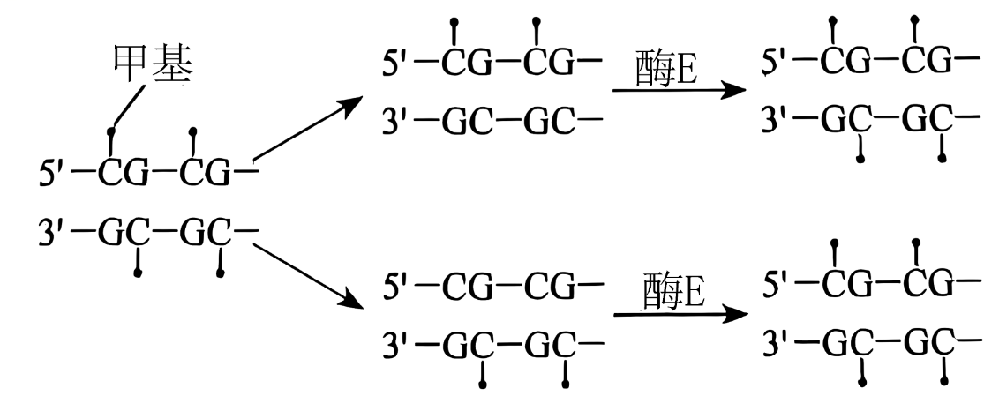

A. 酶E的作用是催化DNA复制

B. 甲基是DNA半保留复制的原料之一

C. 环境可能是引起DNA甲基化差异的重要因素

D. DNA甲基化不改变碱基序列和生物个体表型

10\. 为研究禁食对机体代谢的影响，研究者用大鼠开展持续7天禁食（正常饮水）的实验研究，结果发现血清中尿素、尿酸（嘌呤核苷酸代谢产物）的水平显著升高。下列叙述错误的是（ ）

A. 血清中尿素、尿酸水平可作为检验内环境稳态的指标

B. 禁食初期交感神经兴奋，支配胰岛A细胞使血糖回升

C. 禁食后血清中的尿酸可来源于组织细胞碎片的分解

D. 禁食后血清中高水平的尿素来源于脂肪的分解代谢

11\. 梅尼埃病表现为反复发作的眩晕、听力下降，并伴有内耳淋巴水肿。检测正常人及该病患者急性发作期血清中相关激素水平的结果如下表，临床上常用利尿剂（促进尿液产生）进行治疗。下列关于该病患者的叙述错误的是（ ）

|       |                             |                           |
|:-----:|:---------------------------:|:-------------------------:|
| 组别    | 抗利尿激素浓度/（ng-L-1） | 醛固酮浓度/（ng-L-1） |
| 正常对照组 | 19.83                       | 98.40                     |
| 急性发病组 | 24.93                       | 122.82                    |

A. 内耳的听觉感受细胞生存的内环境稳态失衡会影响听力

B. 发作期抗利尿激素水平的升高使细胞外液渗透压升高

C. 醛固酮的分泌可受下丘脑一垂体一肾上腺皮质轴调控

D. 急性发作期使用利尿剂治疗的同时应该保持低盐饮食

12\. 下图表示某抗原呈递细胞（APC）摄取、加工处理和呈递抗原的过程，其中MHCⅡ类分子是呈递抗原的蛋白质分子。下列叙述正确的是（ ）

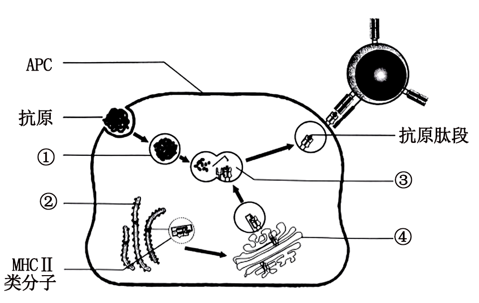

A. 摄取抗原的过程依赖细胞膜的流动性，与膜蛋白无关

B. 直接加工处理抗原的细胞器有①②③

C. 抗原加工处理过程体现了生物膜系统结构上的直接联系

D. 抗原肽段与MHCⅡ类分子结合后，可通过囊泡呈递到细胞表面

13\. 为研究土壤中重金属砷抑制拟南芥生长的原因，研究者检测了高浓度砷酸盐处理后拟南芥根的部分指标。据图分析，下列推测错误的是（ ）

A. 砷处理6h，根中细胞分裂素的含量会减少

B. 砷处理抑制根的生长可能与生长素含量过高有关

C. 增强LOG2蛋白活性可能缓解砷对根的毒害作用

D. 抑制根生长后，植物因吸收水和无机盐的能力下降而影响生长

14\. 从小鼠胚胎中分离获取胚胎成纤维细胞进行贴壁培养，在传代后的不同时间点检测细胞数目，结果如图。下列叙述正确的是（ ）

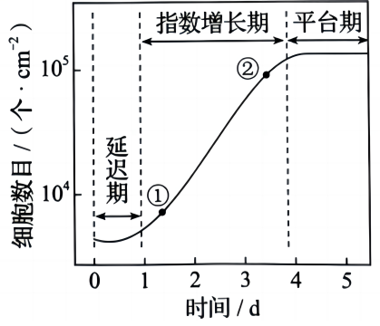

A. 传代培养时，培养皿需密封防止污染

B. 选取①的细胞进行传代培养比②更合理

C. 直接用离心法收集细胞进行传代培养

D. 细胞增长进入平台期可能与细胞密度过大有关

15\. 栽培马铃薯为同源四倍体，育性偏低。GBSS基因（显隐性基因分别表示为G和g）在直链淀粉合成中起重要作用，只有存在G基因才能产生直链淀粉。不考虑突变和染色体互换，下列叙述错误的是（ ）

A. 相比二倍体马铃薯，四倍体马铃薯的茎秆粗壮，块茎更大

B. 选用块茎繁殖可解决马铃薯同源四倍体育性偏低问题，并保持优良性状

C. Gggg个体产生的次级精母细胞中均含有1个或2个G基因

D. 若同源染色体两两联会，GGgg个体自交，子代中产直链淀粉的个体占35/36

**二、选择题：本题共5小题，每小题3分，共15分。在每小题给出的四个选项中，有一项或多项符合题目要求。全部选对得3分，选对但不全得1分，有选错得0分。**

16\. 下图为某红松人工林能量流动的调查结果。此森林的初级生产量有很大部分是沿着碎屑食物链流动的，表现为枯枝落叶和倒木被分解者分解，剩余积累于土壤。据图分析，下列叙述正确的是（ ）

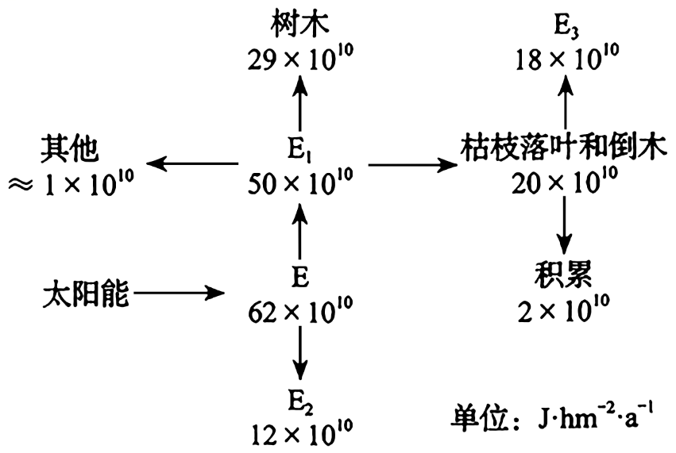

注：植物所固定的太阳能或所制造的有机物质称为初级生产量，其包括净初级生产量和自身呼吸消耗的能量。

A. E是太阳照射到生态系统的能量

B. E2属于未被利用的能量

C. E3占净初级生产量的36%

D. E3的产生过程是物质循环的必要环节

17\. 病毒入侵肝脏时，肝巨噬细胞快速活化，进而引起一系列免疫反应，部分过程示意图如下。下列叙述正确的是（ ）

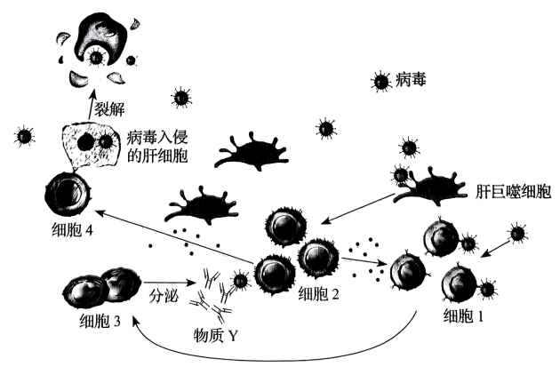

A. 肝巨噬细胞既能参与非特异性免疫，也能参与特异性免疫

B. 细胞2既可以促进细胞4的活化，又可以促进细胞1的活化

C. 细胞3分泌的物质Y和细胞4均可直接清除内环境中的病毒

D. 病毒被清除后，活化的细胞4的功能将受到抑制

18\. 研究人员对小鼠进行致病性大肠杆菌接种，构建腹泻模型。用某种草药进行治疗，发现草药除了具有抑菌作用外，对于空肠、回肠黏膜细胞膜上的水通道蛋白3（AQP3）的相对表达量也有影响，结果如图所示。下列叙述正确的是（ ）

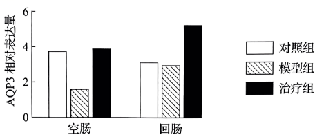

A. 水的吸收以自由扩散为主、水通道蛋白的协助扩散为辅

B. 模型组空肠黏膜细胞对肠腔内水的吸收减少，引起腹泻

C. 治疗后空肠、回肠AQP3相对表达量提高，缓解腹泻，减少致病菌排放

D. 治疗后回肠AQP3相对表达量高于对照组，可使回肠对水的转运增加

19\. 某些香蕉植株组织中存在的内生菌可防治香蕉枯萎病，其筛选流程及抗性检测如图。下列操作正确的是（ ）

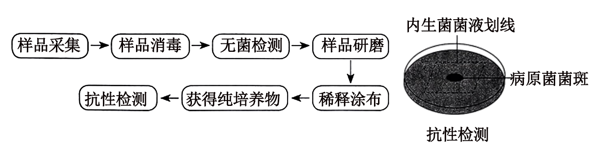

A. 在大量感染香蕉枯萎病的香蕉种植园内，从感病植株上采集样品

B. 将采集样品充分消毒后，用蒸馏水冲洗，收集冲洗液进行无菌检测

C. 将无菌检测合格的样品研磨，经稀释涂布平板法分离得到内生菌的单菌落

D. 判断内生菌的抗性效果需比较有无接种内生菌的平板上的病原菌菌斑大小

20\. 位于同源染色体上的短串联重复序列（STR）具有丰富的多态性。跟踪STR的亲本来源可用于亲缘关系鉴定。分析下图家系中常染色体上的STR（D18S51）和X染色体上的STR（DXS10134，Y染色体上没有）的传递，不考虑突变，下列叙述正确的是（ ）

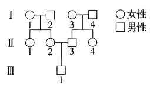

A. Ⅲ-1与Ⅱ-1得到Ⅰ代同一个体的同一个D18S51的概率为1/2

B. Ⅲ-1与Ⅱ-1得到Ⅰ代同一个体的同一个DXS10134的概率为3/4

C. Ⅲ-1与Ⅱ-4得到Ⅰ代同一个体的同一个D18S51的概率为1/4

D. Ⅲ-1与Ⅱ-4得到Ⅰ代同一个体的同一个DXS10134的概率为0

**三、非选择题：本题共5小题，共55分。**

21\. 在光下叶绿体中的C5能与CO2反应形成C3；当CO2/O2比值低时，C5也能与O2反应形成C2等化合物。C2在叶绿体、过氧化物酶体和线粒体中经过一系列化学反应完成光呼吸过程。上述过程在叶绿体与线粒体中主要物质变化如图1。

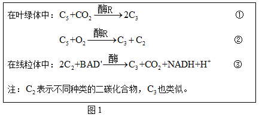

光呼吸将已经同化的碳释放，且整体上是消耗能量的过程。回答下列问题。

（1）反应①是\_\_\_\_\_\_过程。

（2）与光呼吸不同，以葡萄糖为反应物的有氧呼吸产生NADH的场所是\_\_\_\_\_\_和\_\_\_\_\_\_。

（3）我国科学家将改变光呼吸的相关基因转入某种农作物野生型植株（WT），得到转基因株系1和2，测定净光合速率，结果如图2、图3。图2中植物光合作用CO2的来源除了有外界环境外，还可来自\_\_\_\_\_\_和\_\_\_\_\_\_（填生理过程）。7—10时株系1和2与WT净光合速率逐渐产生差异，原因是\_\_\_\_\_\_。据图3中的数据\_\_\_\_\_\_（填“能”或“不能”）计算出株系1的总光合速率，理由是\_\_\_\_\_\_。

（4）结合上述结果分析，选择转基因株系1进行种植，产量可能更具优势，判断的依据是\_\_\_\_\_\_。

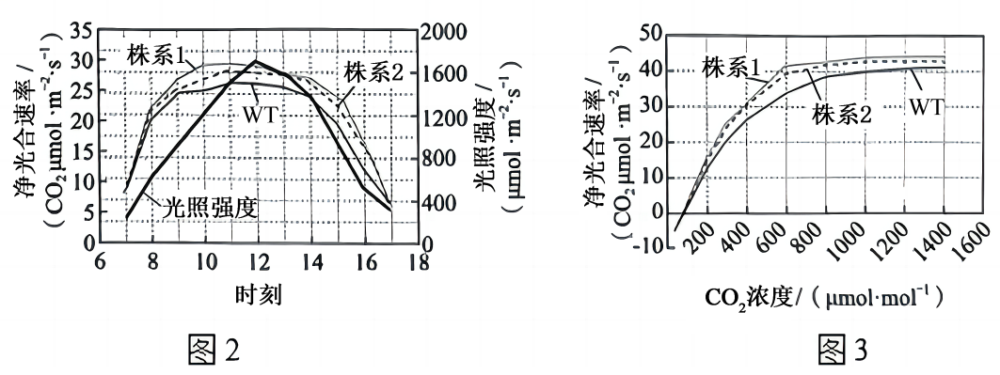

22\. 为协调渔业资源的开发和保护，实现可持续发展，研究者在近海渔业生态系统的管控区中划分出甲（捕捞）、乙（非捕捞）两区域，探究捕捞产生的生态效应，部分食物链如图1。回答下列问题。

（1）甲区域岩龙虾的捕捞使海胆密度上升，海藻生物量下降。捕捞压力加剧了海胆的种内竞争，引起海胆的迁出率和\_\_\_\_\_\_上升。乙区域禁捕后，捕食者的恢复\_\_\_\_\_\_（填“缓解”或“加剧”）了海胆的种内竞争，海藻生物量增加。以上研究说明捕捞能\_\_\_\_\_\_（填“直接”或“间接”）降低海洋生态系统中海藻的生物量。

（2）根据乙区域的研究结果推测，甲区域可通过\_\_\_\_\_\_调节机制恢复到乙区域的状态。当甲区域达到生态平衡，其具有的特征是结构平衡、功能平衡和\_\_\_\_\_\_。

（3）为了合理开发渔业资源，构建生态学模型，探究岩龙虾种群出生率和死亡率与其数量的动态关系。仅基于模型（图2）分析，对处于B状态的岩龙虾种群进行捕捞时，为持续获得较大的岩龙虾产量，当年捕捞量应为\_\_\_\_\_\_只；当年最大捕捞量不能超过\_\_\_\_\_\_只，否则需要采取有效保护措施保证岩龙虾种群的延续，原因是\_\_\_\_\_\_。

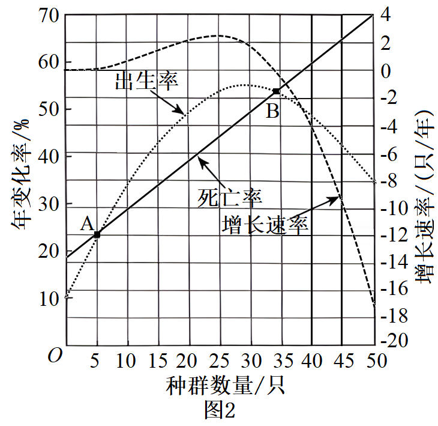

23\. “一条大河波浪宽，风吹稻花香两岸……”，熟悉的歌声会让人不由自主地哼唱。听歌和唱歌都涉及到人体生命活动的调节。回答下列问题。

（1）听歌跟唱时，声波传入内耳使听觉感受细胞产生\_\_\_\_\_\_，经听神经传入神经中枢，再通过中枢对信息的分析和综合后，由\_\_\_\_\_\_支配发声器官唱出歌声，该过程属于神经调节的\_\_\_\_\_\_（填“条件”或“非条件”）反射活动。

（2）唱歌时，呼吸是影响发声的重要因素，需要有意识地控制“呼”与“吸”。换气的随意控制由\_\_\_\_\_\_和低级中枢对呼吸肌的分级调节实现。体液中CO2浓度变化会刺激中枢化学感受器和外周化学感受器，从而通过神经系统对呼吸运动进行调节。切断动物外周化学感受器的传入神经前后，让动物短时吸入CO2（5%CO2和95%O2），检测肺通气量的变化，结果如图1。据图分析，得出的结论是\_\_\_\_\_\_。

（3）失歌症者先天唱歌跑调却不自知，为检测其对音乐的感知和学习能力，对正常组和失歌症组进行“前测一训练一后测”的实验研究，结果如图2。从不同角度分析可知，与正常组相比，失歌症组\_\_\_\_\_\_（答出2点）；仅分析失歌症组后测和前测音乐感知准确率的结果，可得出的结论是\_\_\_\_\_\_，因此，应该鼓励失歌症者积极学习音乐和训练歌唱。

24\. 作物在成熟期叶片枯黄，若延长绿色状态将有助于提高产量。某小麦野生型在成熟期叶片正常枯黄（熟黄），其单基因突变纯合子ml在成熟期叶片保持绿色的时间延长（持绿）。回答下列问题。

（1）将ml与野生型杂交得到F1，表型为\_\_\_\_\_\_（填“熟黄”或“持绿”），则此突变为隐性突变（A1基因突变为al基因）。推测A1基因控制小麦熟黄，将A1基因转入\_\_\_\_\_\_个体中表达，观察获得的植株表型可验证此推测。

（2）突变体m2与ml表型相同，是A2基因突变为a2基因的隐性纯合子，A2基因与A1基因是非等位的同源基因，序列相同。A1、A2、a1和a2基因转录的模板链简要信息如图1。据图1可知，与野生型基因相比，a1基因发生了\_\_\_\_\_\_，a2基因发生了\_\_\_\_\_\_，使合成的mRNA都提前出现了\_\_\_\_\_\_，翻译出的多肽链长度变\_\_\_\_\_\_，导致蛋白质的空间结构改变，活性丧失。A1（A2）基因编码A酶，图2为检测野生型和两个突变体叶片中A酶的酶活性结果，其中\_\_\_\_\_\_号株系为野生型的数据。

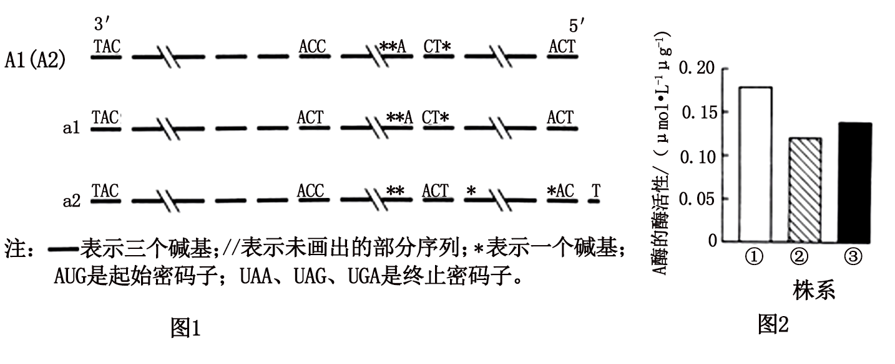

（3）A1和A2基因位于非同源染色体上，ml的基因型为\_\_\_\_\_\_，m2的基因型为\_\_\_\_\_\_。若将ml与m2杂交得到F1，F1自交得到F2，F2中自交后代不发生性状分离个体的比例为\_\_\_\_\_\_。

25\. 将天然Ti质粒改造成含有Vir基因的辅助质粒（辅助T-DNA转移）和不含有Vir基因、含有T-DNA的穿梭质粒，共同转入农杆菌，可提高转化效率。细菌和棉花对密码子偏好不同，为提高翻译效率，增强棉花抗病虫害能力，进行如下操作。回答下列问题。

注：F1-F3，R1-R3表示引物；T-DNA-LB表示左边界；T-DNA-RB表示右边界；Ori表示复制原点；KanR表示卡那霉素抗性基因；HygBR表示潮霉素B抗性基因。

（1）从苏云金杆菌提取DNA时，需加入蛋白酶，其作用是\_\_\_\_\_\_。提取过程中加入体积分数为95%的预冷酒精，其目的是\_\_\_\_\_\_。

（2）本操作中获取目的基因的方法是\_\_\_\_\_\_和\_\_\_\_\_\_。

（3）穿梭质粒中p35s为启动子，其作用是\_\_\_\_\_\_，驱动目的基因转录；插入两个p35s启动子，其目的可能是\_\_\_\_\_\_。

（4）根据图中穿梭质粒上的KanR和HygBR两个标记基因的位置，用\_\_\_\_\_\_基因对应的抗生素初步筛选转化的棉花愈伤组织。

（5）为检测棉花植株是否导入目的基因，提取棉花植株染色体DNA作模板，进行PCR，应选用的引物是\_\_\_\_\_\_和\_\_\_\_\_\_。

（6）本研究采用的部分生物技术属于蛋白质工程，理由是\_\_\_\_\_\_。

A. 通过含有双质粒的农杆菌转化棉花细胞

B. 将苏云金杆菌Bt基因导入棉花细胞中表达

C. 将1-1362基因序列改变为棉花细胞偏好密码子的基因序列

D. 用1-1362合成基因序列和1363-1848天然基因序列获得改造的抗虫蛋白
