**2024年普通高等学校招生选择性考试（辽宁卷）**

**生物学**

**本试卷共11页。考试结束后，将本试卷和答题卡一并交回。**

**注意事项：1．答题前，考生先将自己的姓名、准考证号码填写清楚，将条形码准确粘贴在考生信息条形码粘贴区。**

**2．选择题必须使用2B铅笔填涂；非选择题必须使用0.5毫米黑色字迹的签字笔书写，字体工整、笔迹清楚。**

**3．请按照题号顺序在答题卡各题目的答题区域内作答，超出答题区域书写的答案无效；在草稿纸、试卷上答题无效。**

**4．作图可先使用铅笔画出，确定后必须用黑色字迹的签字笔描黑。**

**5．保持卡面清洁，不要折叠，不要弄破、弄皱，不准使用涂改液、修正带、刮纸刀。**

**一、选择题：本题共15小题，每小题2分，共30分。在每小题给出的四个选项中，只有一项符合题目要求。**

1\. 钙调蛋白是广泛存在于真核细胞的Ca2+感受器。小鼠钙调蛋白两端有近似对称的球形结构，每个球形结构可结合2个Ca2+。下列叙述错误的是（ ）

A. 钙调蛋白的合成场所是核糖体

B. Ca2+是钙调蛋白的基本组成单位

C. 钙调蛋白球形结构的形成与氢键有关

D. 钙调蛋白结合Ca2+后，空间结构可能发生变化

【答案】B

【解析】

【分析】蛋白质的合成场所为核糖体，组成蛋白质的基本单位为氨基酸，蛋白质一定含有的元素为C、H、O、N。

【详解】A、钙调蛋白的合成场所是核糖体，核糖体是生产蛋白质的机器，A正确；

B、Ca2+不是钙调蛋白的基本组成单位，钙调蛋白的基本组成单位是氨基酸，B错误；

C、氨基酸之间能够形成氢键等，从而使得肽链能够盘曲、折叠，形成具有一定空间结构的蛋白质分子，钙调蛋白球形结构的形成与氢键有关，C正确；

D、小鼠钙调蛋白两端有近似对称的球形结构，每个球形结构可结合2个Ca2+，钙调蛋白结合Ca2+后，空间结构可能发生变化，D正确。

故选B。

2\. 手术切除大鼠部分肝脏后，残留肝细胞可重新进入细胞周期进行增殖；肝脏中的卵圆细胞发生分化也可形成新的肝细胞，使肝脏恢复到原来体积。下列叙述错误的是（ ）

A. 肝细胞增殖过程中，需要进行DNA复制

B. 肝细胞的自然更新伴随着细胞凋亡的过程

C. 卵圆细胞分化过程中会出现基因的选择性表达

D. 卵圆细胞能形成新的肝细胞，证明其具有全能性

【答案】D

【解析】

【分析】细胞的全能性是指细胞分裂分裂和分化后，仍具有产生完整有机体或分化成其他各种细胞的潜能和特性。

【详解】A、肝细胞增殖过程中，会发生细胞的分裂使得细胞数目增多，需要进行DNA复制，A正确；

B、肝细胞的自然更新伴随着细胞凋亡的过程，有利于维持机体内部环境的相对稳定，B正确；

C、卵圆细胞分化过程中会出现基因的选择性表达，合成承担相应功能的蛋白质，C正确；

D、细胞的全能性是指细胞分裂分裂和分化后，仍具有产生完整有机体或分化成其他各种细胞的潜能和特性，卵圆细胞能形成新的肝细胞，未证明其具有全能性，D错误。

故选D。

3\. 下列关于森林群落演替的叙述，正确的是（ ）

A. 土壤的理化性质不会影响森林群落演替

B. 植物种群数量的改变不会影响森林群落演替

C. 森林由乔木林变为灌木林属于群落演替

D. 砍伐树木对森林群落演替的影响总是负面的

【答案】C

【解析】

【分析】人类对生物群落演替的影响远远超过其他某些自然因素，因为人类生产活动通常是有意识、有目的地进行的，可以对自然环境中的生态关系起着促进、抑制、改造和重建的作用。但人类的活动对群落的演替也不是只具有破坏性的，也可以是通过建立新的人工群落实现受损生态系统的恢复。

【详解】A、土壤的理化性质会影响森林群落演替，A错误；

B、植物种群数量的改变会影响森林群落演替，B错误；

C、群落演替是指随着时间的推移，一个群落被另一个群落代替的过程，森林由乔木林变为灌木林也属于群落演替，C正确；

D、人类活动往往会改变群落演替的方向，但不一定总是负面的，适度的砍伐对森林群落的演替是有意义的，D错误。

故选C。

4\. 关于人类活动对生态环境的影响，下列叙述错误的是（ ）

A. 清洁能源使用能够降低碳足迹

B. 在近海中网箱养鱼不会影响海洋生态系统

C. 全球性的生态环境问题往往与人类活动有关

D. 水泥生产不是导致温室效应加剧的唯一原因

【答案】B

【解析】

【分析】全球性的生态问题有：全球气候变暖、水资源短缺、臭氧层破坏、土地荒漠化、生物多样性丧失、环境污染等。

【详解】A、碳足迹表示扣除海洋对碳的吸收量之后，吸收化石燃料燃烧排放的二氧化碳等所需的森林面积，洁能源的使用能够降低碳足迹，A正确；

B、在近海中网箱养鱼，养殖过程中大量饵料及产生的排泄物等有机物长时间的累积，对近岸海域海洋生态环境会产生各种影响，B错误；

C、全球性的生态环境问题往往与人类活动有关，如过度砍伐森林等，C正确；

D、水泥生产不是导致温室效应加剧的唯一原因，除此之外还有煤、石油和天然气的大量燃烧，D正确。

故选B。

5\. 弗兰克氏菌能够与沙棘等非豆科木本植物形成根瘤，进行高效的共生固氮，促进植物根系生长，增强其对旱、寒等逆境的适应性。下列叙述错误的是（ ）

A. 沙棘可作为西北干旱地区的修复树种

B. 在矿区废弃地选择种植沙棘，未遵循生态工程的协调原理

C. 二者共生改良土壤条件，可为其他树种的生长创造良好环境

D. 研究弗兰克氏菌的遗传多样性有利于沙棘在生态修复中的应用

【答案】B

【解析】

【分析】生态工程遵循着整体、协调、循环、自生等生态学基本原理。自生：生态系统具有独特的结构与功能，一方面是源于其中的“生物”，生物能够进行新陈代谢、再生更新等；另一方面是这些生物之间通过各种相互作用（特别是种间关系）进行自组织，实现系统结构与功能的协调，形成有序的整体。这一有序的整体可以自我维持。这种由生物组分而产生的自组织、自我优化、自我调节、自我更新和维持就是系统的自生。遵循自生原理，需要在生态工程中有效选择生物组分。

【详解】A、结合题干，弗兰克氏菌能够与沙棘等非豆科木本植物形成根瘤，促进植物根系生长，增强其对旱、寒等逆境的适应性，故沙棘可作为西北干旱地区的修复树种，A正确；

B、在矿区废弃地选择种植沙棘，因地制宜，种植适合该地区生长的物种，遵循生态工程的协调原理，B错误；

C、弗兰克氏菌能够与沙棘等非豆科木本植物形成根瘤，进行高效的共生固氮，二者共生改良土壤条件，可为其他树种的生长创造良好环境，C正确；

D、弗兰克氏菌能够与沙棘等非豆科木本植物形成根瘤，利于固氮和增强植物的抗逆性，研究弗兰克氏菌的遗传多样性有利于沙棘在生态修复中的应用，D正确。

故选B。

6\. 迷迭香酸具有多种药理活性。进行工厂化生产时，先诱导外植体形成愈伤组织，再进行细胞悬浮培养获得迷迭香酸，加入诱导剂茉莉酸甲酯可大幅提高产量。下列叙述错误的是（ ）

A. 迷迭香顶端幼嫩的茎段适合用作外植体

B. 诱导愈伤组织时需加入NAA和脱落酸

C. 悬浮培养时需将愈伤组织打散成单个细胞或较小的细胞团

D. 茉莉酸甲酯改变了迷迭香次生代谢产物的合成速率

【答案】B

【解析】

【分析】1、植物组织培养就是在无菌和人工控制的条件下，将离体的植物器官、组织、细胞，培养在人工配制的培养基上，给予适宜的培养条件，诱导其产生愈伤组织、丛芽，最终形成完整的植株。

2、植物组织培养的条件：①细胞离体和适宜的外界条件（如适宜温度、适时的光照、pH和无菌环境等）；②一定的营养（无机、有机成分）和植物激素（生长素和细胞分裂素）。

【详解】A、迷迭香顶端幼嫩的茎段适合用作外植体，生长旺盛，分裂能力较强，A正确；

B、诱导愈伤组织时需加入NAA和细胞分裂素，B错误；

C、悬浮培养时需将愈伤组织打散成单个细胞或较小的细胞团，获得更多的营养物质和氧气，使得其可以进一步分裂，C正确；

D、加入诱导剂茉莉酸甲酯可大幅提高产量，推测茉莉酸甲酯改变了迷迭香次生代谢产物（不是植物生长所必须的）的合成速率，D正确。

故选B

7\. 关于采用琼脂糖凝胶电泳鉴定PCR产物的实验，下列叙述正确的是（ ）

A. 琼脂糖凝胶浓度的选择需考虑待分离DNA片段的大小

B. 凝胶载样缓冲液中指示剂的作用是指示DNA分子的具体位置

C. 在同一电场作用下，DNA片段越长，向负极迁移速率越快

D. 琼脂糖凝胶中的DNA分子可在紫光灯下被检测出来

【答案】A

【解析】

【分析】琼脂糖凝胶电泳鉴定PCR产物的原理主要基于DNA分子在电场作用下的迁移行为以及琼脂糖凝胶的特性。

【详解】A、琼脂糖凝胶的浓度会影响DNA分子在凝胶中的迁移率和分辨率，琼脂糖凝胶的浓度通常是根据所需分离的DNA片段大小来选择的。对于较大的DNA片段，比如基因组DNA或质粒DNA，通常选择较低浓度的琼脂糖凝胶，因为它们需要更大的孔径来有效迁移。而对于较小的DNA片段，比如PCR产物或酶切片段，则需要选择较高浓度的琼脂糖凝胶，以提供更好的分辨率和分离效果，A正确；

B、 凝胶载样缓冲液指示剂通常是一种颜色较深的染料，可以作为电泳进度的指示分子， 当溴酚蓝到凝胶2/3处时(可看蓝色条带)，则停止电泳，B错误；

C、在琼脂糖凝胶电泳中，当电场作用时，DNA片段实际上是向正极迁移的，而不是向负极迁移。同时，DNA片段的迁移速率与其大小成反比，即DNA片段越长，迁移速率越慢，C错误；

D、琼脂糖凝胶中的DNA分子需染色后，才可在波长为300nm的紫外灯下被检测出来，D错误。

故选A。

8\. 鲟类是最古老的鱼类之一，被誉为鱼类的“活化石”。我国学者新测定了中华鲟、长江鲟等的线粒体基因组，结合已有信息将鲟科分为尖吻鲟类、大西洋鲟类和太平洋鲟类三个类群。下列叙述错误的是（ ）

A. 鲟类的形态结构和化石记录可为生物进化提供证据

B. 地理隔离在不同水域分布的鲟类进化过程中起作用

C. 鲟类稳定的形态结构能更好地适应不断变化的环境

D. 研究鲟类进化关系时线粒体基因组数据有重要价值

【答案】C

【解析】

【分析】化石是指通过自然作用保存在地层中的古代生物的遗体、遗物或生活痕迹等。

【详解】A、比较脊椎动物的器官、系统的形态结构，可以为这些生物是否有共同祖先寻找证据，化石是研究生物进化最直接、最重要的证据，所以鲟类的形态结构和化石记录可为生物进化提供证据，A正确；

B、地理隔离是指同一种生物由于地理上的障碍而分成不同的种群，使得种群间不能发生基因交流的现象，不同的地理环境可以对生物的变异进行选择，进而影响生物的进化，故地理隔离在不同水域分布的鲟类进化过程中起作用，B正确；

C、群落中出现可遗传的有利变异和环境的定向选择是适应环境的必要条件，故鲟类稳定的形态结构不能更好地适应不断变化的环境，C错误；

D、不同生物的DNA等生物大分子的共同点，可以揭示生物有着共同的原始祖先，其差异的大小可以揭示当今生物种类亲缘关系的远近，故研究鲟类进化关系时线粒体基因组数据有重要价值，D正确。

故选C。

9\. 下图表示DNA半保留复制和甲基化修饰过程。研究发现，50岁同卵双胞胎间基因组DNA甲基化的差异普遍比3岁同卵双胞胎间的差异大。下列叙述正确的是（ ）

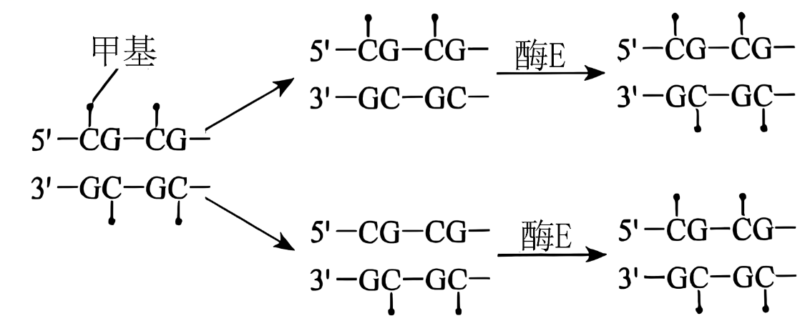

A. 酶E的作用是催化DNA复制

B. 甲基是DNA半保留复制的原料之一

C. 环境可能是引起DNA甲基化差异的重要因素

D. DNA甲基化不改变碱基序列和生物个体表型

【答案】C

【解析】

【分析】甲基化是指在DNA某些区域的碱基上结合一个甲基基团，故不会发生碱基对的缺失、增加或减少，甲基化不同于基因突变。DNA甲基化后会控制基因表达，可能会造成性状改变，DNA甲基化后可以遗传给后代。

【详解】A、由图可知，酶E的作用是催化DNA甲基化，A错误；

B、DNA半保留复制的原料为四种脱氧核糖核苷酸，没有甲基，B错误；

C、“研究发现，50岁同卵双胞胎间基因组DNA甲基化的差异普遍比3岁同卵双胞胎间的差异大”，说明环境可能是引起DNA甲基化差异的重要因素，C正确；

D、DNA甲基化不改变碱基序列，但会影响生物个体表型，D错误。

故选C。

10\. 为研究禁食对机体代谢的影响，研究者用大鼠开展持续7天禁食（正常饮水）的实验研究，结果发现血清中尿素、尿酸（嘌呤核苷酸代谢产物）的水平显著升高。下列叙述错误的是（ ）

A. 血清中尿素、尿酸水平可作为检验内环境稳态的指标

B. 禁食初期交感神经兴奋，支配胰岛A细胞使血糖回升

C. 禁食后血清中的尿酸可来源于组织细胞碎片的分解

D. 禁食后血清中高水平的尿素来源于脂肪的分解代谢

【答案】D

【解析】

【分析】血糖平衡的调节存在神经调节和体液调节。血糖偏高时，能直接刺激胰岛B细胞分泌更多胰岛素，胰岛素能促进组织细胞加速摄取、利用、储存葡萄糖，使血糖降低；同时，高血糖也能刺激下丘脑的某区域，通过神经控制促进胰岛B细胞的分泌。血糖偏低时，能直接刺激胰岛A细胞分泌更多胰高血糖素，胰高血糖素能促进肝糖原分解，促进一些非糖物质转化为葡萄糖，使血糖水平升高；同时，低血糖也能刺激下丘脑的另外的区域，通过神经控制促进胰岛A细胞的分泌。

【详解】A、内环境的稳态包括化学成分和理化性质的相对稳定，血清中尿素、尿酸作为代谢产物，可作为检验内环境稳态的指标，A正确；

B、禁食初期血糖降低，交感神经兴奋，支配胰岛A细胞使血糖回升，B正确；

C、尿酸为嘌呤核苷酸代谢产物，禁食后血清中的尿酸可来源于组织细胞碎片（DNA、RNA）的分解，C正确；

D、禁食后血清中高水平的尿素来源于蛋白质的分解代谢，D错误。

故选D。

11\. 梅尼埃病表现为反复发作的眩晕、听力下降，并伴有内耳淋巴水肿。检测正常人及该病患者急性发作期血清中相关激素水平的结果如下表，临床上常用利尿剂（促进尿液产生）进行治疗。下列关于该病患者的叙述错误的是（ ）

|       |                             |                           |
|:-----:|:---------------------------:|:-------------------------:|
| 组别    | 抗利尿激素浓度/（ng-L-1） | 醛固酮浓度/（ng-L-1） |
| 正常对照组 | 19.83                       | 98.40                     |
| 急性发病组 | 24.93                       | 122.82                    |

A. 内耳的听觉感受细胞生存的内环境稳态失衡会影响听力

B. 发作期抗利尿激素水平的升高使细胞外液渗透压升高

C. 醛固酮的分泌可受下丘脑一垂体一肾上腺皮质轴调控

D. 急性发作期使用利尿剂治疗的同时应该保持低盐饮食

【答案】B

【解析】

【分析】抗利尿激素：下丘脑合成，垂体释放，作用于肾小管和集合管，促进肾小管和集合管对水的吸收，减少尿量。

醛固酮：促进肾小管和集合管对Na＋的重吸收，维持血钠的平衡。

【详解】A、内环境稳态是细胞进行正常生命活动的必要条件，内耳的听觉感受细胞生存的内环境稳态失衡会影响听力，A正确；

B、发作期抗利尿激素水平的升高，促进促进肾小管和集合管对水的吸收，使细胞外液渗透压降低，B错误；

C、醛固酮的分泌可受下丘脑一垂体一肾上腺皮质轴调控，存在分级调节，C正确；

D、利尿剂能促进尿液产生，急性发作期使用利尿剂治疗的同时应该保持低盐饮食，避免细胞外液渗透压升高不利于尿液的排出，D正确。

故选B。

12\. 下图表示某抗原呈递细胞（APC）摄取、加工处理和呈递抗原的过程，其中MHCⅡ类分子是呈递抗原的蛋白质分子。下列叙述正确的是（ ）

A. 摄取抗原的过程依赖细胞膜的流动性，与膜蛋白无关

B. 直接加工处理抗原的细胞器有①②③

C. 抗原加工处理过程体现了生物膜系统结构上的直接联系

D. 抗原肽段与MHCⅡ类分子结合后，可通过囊泡呈递到细胞表面

【答案】D

【解析】

【分析】1、分泌蛋白的合成与分泌过程：附着在内质网上的核糖体合成蛋白质→内质网进行粗加工→内质网“出芽”形成囊泡→高尔基体进行再加工形成成熟的蛋白质→高尔基体“出芽”形成囊泡→细胞膜，整个过程还需要线粒体提供能量。

2、由图可知，抗原呈递细胞通过胞吞作用摄取抗原。辅助性T细胞不能直接识别外源性抗原，无摄取、加工和处理抗原的能力。

【详解】A、摄取抗原的过程是胞吞，依赖细胞膜的流动性，与膜蛋白有关，A错误；

B、由图可知，抗原是先由抗原呈递细胞吞噬形成①吞噬小泡，再由③溶酶体直接加工处理的，B错误；

C、MHCⅡ类分子作为分泌蛋白，其加工过程有核糖体、内质网和高尔基体的参与，体现了生物膜之间的间接联系，C错误；

D、由图可知，抗原肽段与MHCⅡ类分子结合后，在溶酶体内水解酶的作用下，可以将外源性抗原降解为很多的小分子肽，其中具有免疫原性的抗原肽会与MHC形成复合物，由囊泡呈递于APC表面，D正确。

故选D。

13\. 为研究土壤中重金属砷抑制拟南芥生长的原因，研究者检测了高浓度砷酸盐处理后拟南芥根的部分指标。据图分析，下列推测错误的是（ ）

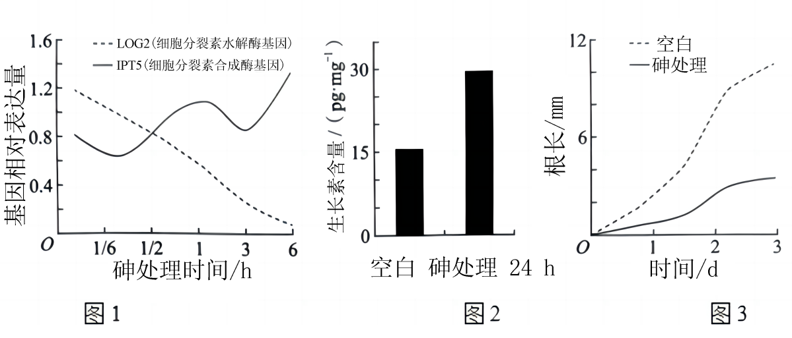

A. 砷处理6h，根中细胞分裂素的含量会减少

B. 砷处理抑制根的生长可能与生长素含量过高有关

C. 增强LOG2蛋白活性可能缓解砷对根的毒害作用

D. 抑制根生长后，植物因吸收水和无机盐的能力下降而影响生长

【答案】A

【解析】

【分析】生长素的作用具有两重性：低浓度促进生长，高浓度抑制生长。

【详解】A、分析图1可知，砷处理6h，细胞分裂素水解酶基因相对表达量远低于细胞分裂素合成酶基因相对表达量，根中细胞分裂素的含量会增加，A错误；

B、结合图2、3推测，与空白对照组相比，砷处理组生长素含量高但是根长度短，砷处理抑制根的生长可能与生长素含量过高有关，B正确；

C、结合图1，随着砷处理时间的延长，LOG2基因相对表达量减少，推测增强LOG2蛋白活性可能缓解砷对根的毒害作用，C正确；

D、根可吸收水和无机盐，抑制根生长后，植物因吸收水和无机盐的能力下降而影响生长，D正确。

故选A。

14\. 从小鼠胚胎中分离获取胚胎成纤维细胞进行贴壁培养，在传代后的不同时间点检测细胞数目，结果如图。下列叙述正确的是（ ）

A. 传代培养时，培养皿需密封防止污染

B. 选取①的细胞进行传代培养比②更合理

C. 直接用离心法收集细胞进行传代培养

D. 细胞增长进入平台期可能与细胞密度过大有关

【答案】B

【解析】

【分析】动物细胞培养的流程：取动物组织块（动物胚胎或幼龄动物的器官或组织）→剪碎→用胰蛋白酶处理分散成单个细胞→制成细胞悬液→转入培养瓶中进行原代培养→贴满瓶壁的细胞重新用胰蛋白酶处理分散成单个细胞继续传代培养。动物细胞培养需要的条件有：①无菌、无毒的环境；②营养；③温度和pH；④气体环境：95%空气+5%CO2；动物细胞培养技术主要应用在：制备病毒疫苗、制备单克隆抗体、检测有毒物质等。

【详解】A、传代培养时需要营造无菌、无毒以及95%空气+5%CO2的气体环境，而非密封，A错误；

B、选取①的细胞进行传代培养比②更合理，①的细胞核型更为稳定，B正确；

C、对于贴壁生长的细胞进行传代培养时，先需要用胰蛋白酶等处理，使之分散为单个细胞，然后再用离心法收集，C错误；

D、细胞增长进入平台期可能与接触抑制有关，D错误。

故选B。

15\. 栽培马铃薯为同源四倍体，育性偏低。GBSS基因（显隐性基因分别表示为G和g）在直链淀粉合成中起重要作用，只有存在G基因才能产生直链淀粉。不考虑突变和染色体互换，下列叙述错误的是（ ）

A. 相比二倍体马铃薯，四倍体马铃薯的茎秆粗壮，块茎更大

B. 选用块茎繁殖可解决马铃薯同源四倍体育性偏低问题，并保持优良性状

C. Gggg个体产生的次级精母细胞中均含有1个或2个G基因

D. 若同源染色体两两联会，GGgg个体自交，子代中产直链淀粉的个体占35/36

【答案】C

【解析】

【分析】多倍体具有的特点：茎秆粗壮，叶、果实和种子较大，糖分和蛋白质等营养物质含量较多。

【详解】A、相比二倍体马铃薯，四倍体马铃薯的茎秆粗壮，块茎更大，所含的营养物质也更多，A正确；

B、植物可进行无性繁殖，可保持母本的优良性状，选用块茎繁殖可解决马铃薯同源四倍体育性偏低问题，并保持优良性状，B正确；

C、Gggg细胞复制之后为GGgggggg，减数第一次分裂后期同源染色体分离，非同源染色体自由组合，故Gggg个体产生的次级精母细胞含有2或0个G基因，C错误；

D、若同源染色体两两联会，GGgg个体自交，GGgg产生的配子为1/6GG、4/6Gg、1/6gg，只有存在G基因才能产生直链淀粉，故子代中产直链淀粉的个体占1—1/6×1/6＝35/36，D正确。

故选C。

**二、选择题：本题共5小题，每小题3分，共15分。在每小题给出的四个选项中，有一项或多项符合题目要求。全部选对得3分，选对但不全得1分，有选错得0分。**

16\. 下图为某红松人工林能量流动的调查结果。此森林的初级生产量有很大部分是沿着碎屑食物链流动的，表现为枯枝落叶和倒木被分解者分解，剩余积累于土壤。据图分析，下列叙述正确的是（ ）

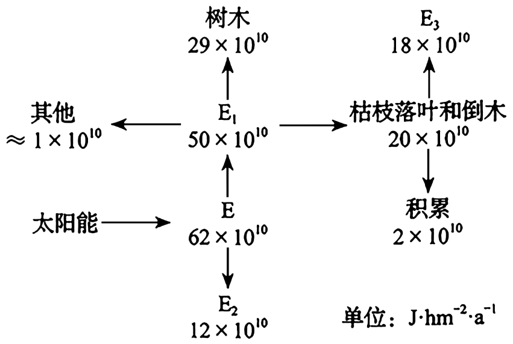

注：植物所固定的太阳能或所制造的有机物质称为初级生产量，其包括净初级生产量和自身呼吸消耗的能量。

A. E是太阳照射到生态系统的能量

B. E2属于未被利用的能量

C. E3占净初级生产量的36%

D. E3的产生过程是物质循环的必要环节

【答案】CD

【解析】

【分析】分析题意可知，总初级生产量指生产者通过光合作用固定的能量；次级生产量是指在单位时间内由于动物和微生物的生长和繁殖而增加的生物量或所贮存的能量；次级生产量=同化量-呼吸量。

【详解】A、E是生产者固定的太阳能，A错误；

B、E2属于呼吸作用散失的热能，B错误；

C、E3占净初级生产量的18×1010÷（50×1010）×100％＝36％，C正确；

D、E3的产生过程是依靠分解者的分解作用实现的，是物质循环的必要环节，D正确。

故选CD。

17\. 病毒入侵肝脏时，肝巨噬细胞快速活化，进而引起一系列免疫反应，部分过程示意图如下。下列叙述正确的是（ ）

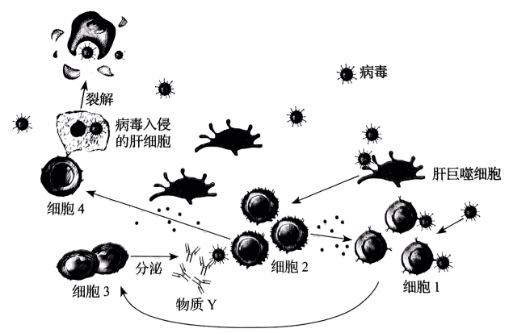

A. 肝巨噬细胞既能参与非特异性免疫，也能参与特异性免疫

B. 细胞2既可以促进细胞4的活化，又可以促进细胞1的活化

C. 细胞3分泌的物质Y和细胞4均可直接清除内环境中的病毒

D. 病毒被清除后，活化的细胞4的功能将受到抑制

【答案】ABD

【解析】

【分析】1、体液免疫的过程为，当病原体侵入机体时，一些病原体可以和B细胞接触，这为激活B细胞提供了第一个信号。一些病原体被树突状细胞、B细胞等抗原呈递细胞摄取。抗原呈递细胞将抗原处理后呈递在细胞表面，然后传递给辅助性T细胞。辅助性T细胞表面的特定分子发生变化并与B细胞结合，这是激活细胞的第二个信号；辅助性T细胞开始分裂、分化。并分泌细胞因子。在细胞因子的作用下，B细胞接受两个信号的刺激后，增殖、分化，大部分分化为浆细胞，小部分分化为记忆B细胞。随后浆细胞产生并分泌抗体。在多数情况下，抗体与病原体结合后会发生进一步的变化，如形成沉淀等，进而被其他免疫细胞吞噬消化。记忆细胞可以在抗原消失后存活，当再接触这种抗原时，能迅速增殖分化，分化后快速产生大量抗体。

2、细胞免疫的过程：被病毒感染的靶细胞膜表面的某些分子发生变化，细胞毒性T细胞识别变化的信号，开始分裂并分化，形成新的细胞毒性T细胞和记忆T细胞。同时辅助性T细胞分泌细胞因子加速细胞毒性T细胞的分裂、分化。新形成的细胞毒性T细胞在体液中循环，识别并接触、裂解被同样病原体感染的靶细胞，靶细胞裂解、死亡后，病原体暴露出来，抗体可以与之结合，或被其他细胞吞噬掉。

【详解】A、肝巨噬细胞能够吞噬病原体，也可以呈递抗原，所以既能参与非特异性免疫，也能参与特异性免疫，A正确；

B、细胞2是辅助性T细胞，在细胞免疫过程中可以促进细胞4细胞毒性T细胞的活化，在体液免疫过程总可以促进细胞1B细胞的活化，B正确；

C、细胞3分泌的物质Y是抗体，抗体与抗原结合形成沉淀或细胞集团，不能将病毒清除；细胞4细胞毒性T细胞可裂解靶细胞，使抗原被释放，但是不能直接清除内环境中的病毒，需要吞噬细胞的吞噬和消化才能清除，C错误；

D、病毒在人体内被清除后，活化的细胞毒性T细胞的功能将受到抑制，机体将逐渐恢复到正常状态，D正确。

故选ABD。

18\. 研究人员对小鼠进行致病性大肠杆菌接种，构建腹泻模型。用某种草药进行治疗，发现草药除了具有抑菌作用外，对于空肠、回肠黏膜细胞膜上的水通道蛋白3（AQP3）的相对表达量也有影响，结果如图所示。下列叙述正确的是（ ）

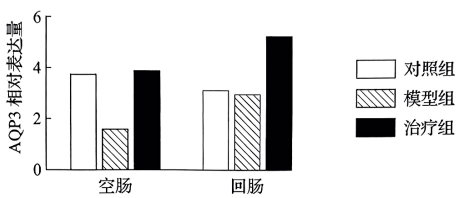

A. 水的吸收以自由扩散为主、水通道蛋白的协助扩散为辅

B. 模型组空肠黏膜细胞对肠腔内水的吸收减少，引起腹泻

C. 治疗后空肠、回肠AQP3相对表达量提高，缓解腹泻，减少致病菌排放

D. 治疗后回肠AQP3相对表达量高于对照组，可使回肠对水的转运增加

【答案】BCD

【解析】

【分析】1、自由扩散是物质从高浓度扩散至低浓度，不需要载体协助也不耗能；协助扩散是物质从高浓度扩散至低浓度，需要转运蛋白协助，但不耗能，转运速率受转运蛋白数量制约。

2、水通道蛋白是一种位于细胞膜上的蛋白质（内在膜蛋白），在细胞膜上组成“孔道”，可控制水在细胞的进出，就像是“细胞的水泵”一样。

【详解】A、水分子跨膜运输的主要方式是经过水通道蛋白的协助扩散，A错误；

B、模型组空肠AQP3相对表达量降低，空肠黏膜细胞对肠腔内水的吸收减少，引起腹泻，B正确；

C、治疗后空肠、回肠AQP3相对表达量提高，对水的转运增加，缓解腹泻，减少致病菌排放，C正确；

D、治疗组回肠AQP3相对表达量高于对照组，可使回肠对水的转运增加，D正确。

故选BCD。

19\. 某些香蕉植株组织中存在的内生菌可防治香蕉枯萎病，其筛选流程及抗性检测如图。下列操作正确的是（ ）

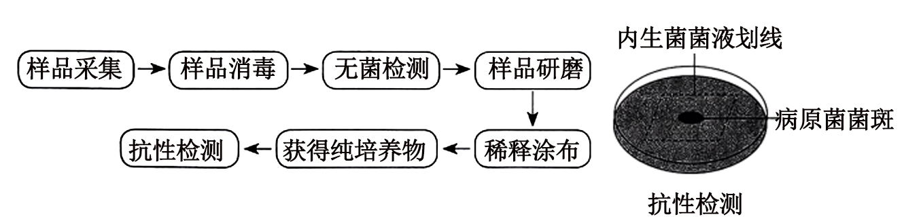

A. 在大量感染香蕉枯萎病的香蕉种植园内，从感病植株上采集样品

B. 将采集的样品充分消毒后，用蒸馏水冲洗，收集冲洗液进行无菌检测

C. 将无菌检测合格的样品研磨，经稀释涂布平板法分离得到内生菌的单菌落

D. 判断内生菌的抗性效果需比较有无接种内生菌的平板上的病原菌菌斑大小

【答案】CD

【解析】

【分析】1、获得纯净的微生物培养物的关键是防止杂菌污染。无菌技 术应围绕着如何避免杂菌的污染展开，主要包括消毒和灭菌。

2、稀释涂布平板法除可以用于分离微生物外，也常用来 统计样品中活菌的数目。当样品的稀释度足够高时，培养 基表面生长的一个单菌落，来源于样品稀释液中的一个活 菌。通过统计平板上的菌落数，就能推测出样品中大约含 有多少活菌。为了保证结果准确，一般选择菌落数为30〜300 的平板进行计数。

【详解】A、题干信息：某些香蕉植株组织中存在的内生菌可防治香蕉枯萎病，故在大量感染香蕉枯萎病的香蕉种植园内，从未感病植株上采集样品，A错误；

B、获得纯净的微生物培养物的关键是防止杂菌污染；将采集的样品充分消毒后，用无菌水冲洗，收集冲洗液进行无菌检测，B错误；

C、题图可知，样品研磨后进行了稀释涂布，可见将无菌检测合格的样品研磨，经稀释涂布平板法分离得到内生菌的单菌落，C正确；

D、题图抗性检测可知，判断内生菌的抗性效果需设置对照组和实验组，对照组不接种内生菌得到病原菌菌斑，实验组接种内生菌得到病原菌菌斑，然后比较对照组和实验组的菌斑大小，实验组病原菌菌斑越小表明内生菌抗性效果越好，D正确。

故选CD。

20\. 位于同源染色体上的短串联重复序列（STR）具有丰富的多态性。跟踪STR的亲本来源可用于亲缘关系鉴定。分析下图家系中常染色体上的STR（D18S51）和X染色体上的STR（DXS10134，Y染色体上没有）的传递，不考虑突变，下列叙述正确的是（ ）

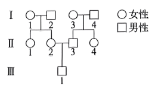

A. Ⅲ-1与Ⅱ-1得到Ⅰ代同一个体的同一个D18S51的概率为1/2

B. Ⅲ-1与Ⅱ-1得到Ⅰ代同一个体的同一个DXS10134的概率为3/4

C. Ⅲ-1与Ⅱ-4得到Ⅰ代同一个体的同一个D18S51的概率为1/4

D. Ⅲ-1与Ⅱ-4得到Ⅰ代同一个体的同一个DXS10134的概率为0

【答案】D

【解析】

【分析】由题意可知，STR（D18S51）位于常染色体上，STR（DXS10134）位于X染色体的非同源区段。

【详解】A、STR（D18S51）位于常染色体上，具有同源染色体，Ⅱ-1和Ⅱ-2得到Ⅰ代同一个体的同一个D18S51的概率为1/2，Ⅲ-1得到Ⅱ-1来自Ⅰ代同一个体的同一个D18S51的概率为1/4，由此可知，Ⅲ-1与Ⅱ-1得到Ⅰ代同一个体的同一个D18S51的概率为1/2×1/4=1/8，A错误；

B、TR（DXS10134）位于X染色体的非同源区段，Ⅱ-1和Ⅱ-2得到Ⅰ代同一个体的同一DXS10134的概率为1/2，Ⅲ-1得到Ⅱ-1来自Ⅰ代同一个体的同一个D18S51的概率为1/2，由此可知，Ⅲ-1与Ⅱ-1得到Ⅰ代同一个体的同一个DXS10134的概率为1/2×1/2=1/4，B错误；

C、STR（D18S51）位于常染色体上，具有同源染色体，Ⅱ-3和Ⅱ-4得到Ⅰ代同一个体的同一个D18S51的概率为1/2，Ⅲ-1得到Ⅱ-3来自Ⅰ代同一个体的同一个D18S51的概率为1/4，由此可知，Ⅲ-1与Ⅱ-4得到Ⅰ代同一个体的同一个D18S51的概率为1/2×1/4=1/8，C错误；

D、STR（DXS10134）位于X染色体的非同源区段，Ⅲ-1只能从Ⅰ代遗传Y基因，Ⅱ-4只能从Ⅰ代遗传X基因，因此Ⅲ-1与Ⅱ-4得到Ⅰ代同一个体的同一个DXS10134的概率为0，D正确。

故选D。

**三、非选择题：本题共5小题，共55分。**

21\. 在光下叶绿体中的C5能与CO2反应形成C3；当CO2/O2比值低时，C5也能与O2反应形成C2等化合物。C2在叶绿体、过氧化物酶体和线粒体中经过一系列化学反应完成光呼吸过程。上述过程在叶绿体与线粒体中主要物质变化如图1。

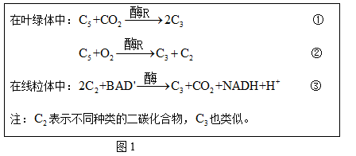

光呼吸将已经同化的碳释放，且整体上是消耗能量的过程。回答下列问题。

（1）反应①是\_\_\_\_\_\_过程。

（2）与光呼吸不同，以葡萄糖为反应物的有氧呼吸产生NADH的场所是\_\_\_\_\_\_和\_\_\_\_\_\_。

（3）我国科学家将改变光呼吸的相关基因转入某种农作物野生型植株（WT），得到转基因株系1和2，测定净光合速率，结果如图2、图3。图2中植物光合作用CO2的来源除了有外界环境外，还可来自\_\_\_\_\_\_和\_\_\_\_\_\_（填生理过程）。7—10时株系1和2与WT净光合速率逐渐产生差异，原因是\_\_\_\_\_\_。据图3中的数据\_\_\_\_\_\_（填“能”或“不能”）计算出株系1的总光合速率，理由是\_\_\_\_\_\_。

（4）结合上述结果分析，选择转基因株系1进行种植，产量可能更具优势，判断的依据是\_\_\_\_\_\_。

【答案】（1）CO2的固定

（2） ①. 细胞质基质 ②. 线粒体基质

（3） ①. 光呼吸 ②. 呼吸作用 ③. 7—10时，随着光照强度的增加，株系1和2由于转入了改变光呼吸的相关基因，导致光呼吸速率降低，光呼吸将已经同化的碳释放，且整体上是消耗能量的过程 ④. 不能 ⑤. 总光合速率=净光合速率+呼吸速率，呼吸速率为光照强度为0时二氧化碳的释放速率，图3的横坐标为二氧化碳的浓度，无法得出呼吸速率，

（4）与株系2与WT相比，转基因株系1的净光合速率最大

【解析】

【分析】1、光合作用包括光反应和暗反应两个阶段，①光合作用的光反应阶段（场所是叶绿体的类囊体膜上）：水的光解产生NADPH与氧气，以及ATP的形成；②光合作用的暗反应阶段（场所是叶绿体的基质中）：CO2被C5固定形成C3，C3在光反应提供的ATP和NADPH的作用下还原生成糖类等有机物；光合作用是指绿色植物通过叶绿体，利用光能把二氧化碳和水转变成储存着能量的有机物，并释放出氧气的过程。

2、有氧呼吸的第一、二、三阶段的场所依次是细胞质基质、线粒体基质和线粒体内膜。有氧呼吸第一 阶段是葡萄糖分解成丙酮酸和NADH，合成少量ATP；第二阶段是丙酮酸和水反应生成二氧化碳和NADH，合成少量ATP；第三阶段是氧气和NADH反应生成水，合成大量ATP。

【小问1详解】

在光合作用暗反应过程中，CO2在特定酶的作用下，与C5结合形成两个C3，这个过程称作CO2的固定，故反应①是CO2的固定过程。

【小问2详解】

有氧呼吸的第一、二、三阶段的场所依次是细胞质基质、线粒体基质和线粒体内膜。有氧呼吸第一阶段是葡萄糖分解成丙酮酸和NADH，合成少量ATP；第二阶段是丙酮酸和水反应生成二氧化碳和NADH，合成少量ATP，以葡萄糖为反应物的有氧呼吸产生NADH的场所是细胞质基质、线粒体基质。

【小问3详解】

由图1可知，在线粒体中进行光呼吸的过程中，也会产生二氧化碳，因此植物光合作用CO2的来源除了有外界环境外，还可来自光呼吸、呼吸作用。7—10时，随着光照强度的增加，株系1和2由于转入了改变光呼吸的相关基因，导致光呼吸速率降低，光呼吸将已经同化的碳释放，且整体上是消耗能量的过程，因此与WT相比，株系1和2的净光合速率较高。总光合速率=净光合速率+呼吸速率，呼吸速率为光照强度为0时二氧化碳的释放速率，图3的横坐标为二氧化碳的浓度，因此无法得出呼吸速率，故据图3中的数据不能计算出株系1的总光合速率。

【小问4详解】

由图2、图3可知，与株系2与WT相比，转基因株系1的净光合速率最大，因此选择转基因株系1进行种植，产量可能更具优势。

22\. 为协调渔业资源的开发和保护，实现可持续发展，研究者在近海渔业生态系统的管控区中划分出甲（捕捞）、乙（非捕捞）两区域，探究捕捞产生的生态效应，部分食物链如图1。回答下列问题。

（1）甲区域岩龙虾的捕捞使海胆密度上升，海藻生物量下降。捕捞压力加剧了海胆的种内竞争，引起海胆的迁出率和\_\_\_\_\_\_上升。乙区域禁捕后，捕食者的恢复\_\_\_\_\_\_（填“缓解”或“加剧”）了海胆的种内竞争，海藻生物量增加。以上研究说明捕捞能\_\_\_\_\_\_（填“直接”或“间接”）降低海洋生态系统中海藻的生物量。

（2）根据乙区域的研究结果推测，甲区域可通过\_\_\_\_\_\_调节机制恢复到乙区域的状态。当甲区域达到生态平衡，其具有的特征是结构平衡、功能平衡和\_\_\_\_\_\_。

（3）为了合理开发渔业资源，构建生态学模型，探究岩龙虾种群出生率和死亡率与其数量的动态关系。仅基于模型（图2）分析，对处于B状态的岩龙虾种群进行捕捞时，为持续获得较大的岩龙虾产量，当年捕捞量应为\_\_\_\_\_\_只；当年最大捕捞量不能超过\_\_\_\_\_\_只，否则需要采取有效保护措施保证岩龙虾种群的延续，原因是\_\_\_\_\_\_。

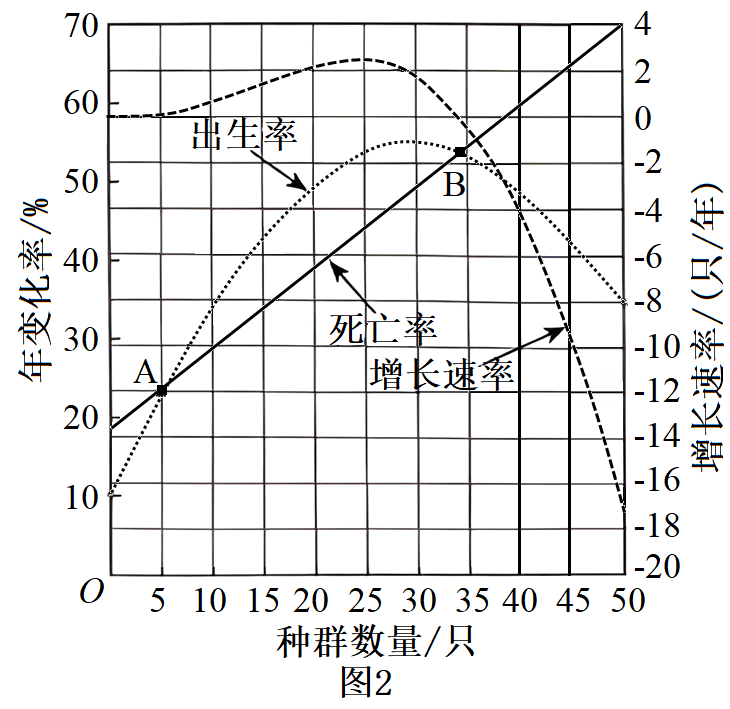

【答案】（1） ①. 死亡率 ②. 缓解 ③. 间接

（2） ①. 负反馈 ②. 收支平衡

（3） ①. 10 ②. 30 ③. 处于B状态的岩龙虾种群数量为35只时，若当年最大捕捞量超过30只，种群数量降到A点以下，死亡率大于出生率，种群会衰退

【解析】

【分析】负反馈调节是生态系统自我调节的基础，它是生态系统中普遍存在的一种抑制性调节机制 。 例如，在草原生态系统中， 食草动物瞪羚的数量增加，会引起其天敌猎豹数量的增加和草数量的下降，两者共同作用引起瞪羚种群数量下降，维持了生态系统中瞪羚数量的稳定。

【小问1详解】

甲区域岩龙虾的捕捞使海胆密度上升，加剧了海胆的种内竞争，引起海胆的迁出率和死亡率上升，乙区域禁捕后，捕食者数量恢复，大量捕食海胆，导致海胆数目下降，缓解了海胆的种内竞争，以上研究说明捕捞能通过影响海胆的数目间接降低海洋生态系统中海藻的生物量。

【小问2详解】

负反馈调节是生态系统自我调节的基础，因此根据乙区域的研究结果推测，甲区域可通过负反馈调节机制恢复到乙区域的状态。处于生态平衡的生态系统具有结构平衡、功能平衡和收支平衡的特征。

【小问3详解】

分析图2可知，B状态的岩龙虾种群数量为35只，岩龙虾种群数量为25只时，该种群的增长速率最快，因此为持续获得较大的岩龙虾产量，当年捕捞量应为35-25=10只；当年最大捕捞量超过35-5=30只，种群数量降到A点以下，死亡率大于出生率，种群会衰退，需要采取有效保护措施保证岩龙虾种群的延续。

23\. “一条大河波浪宽，风吹稻花香两岸……”，熟悉的歌声会让人不由自主地哼唱。听歌和唱歌都涉及到人体生命活动的调节。回答下列问题。

（1）听歌跟唱时，声波传入内耳使听觉感受细胞产生\_\_\_\_\_\_，经听神经传入神经中枢，再通过中枢对信息的分析和综合后，由\_\_\_\_\_\_支配发声器官唱出歌声，该过程属于神经调节的\_\_\_\_\_\_（填“条件”或“非条件”）反射活动。

（2）唱歌时，呼吸是影响发声的重要因素，需要有意识地控制“呼”与“吸”。换气的随意控制由\_\_\_\_\_\_和低级中枢对呼吸肌的分级调节实现。体液中CO2浓度变化会刺激中枢化学感受器和外周化学感受器，从而通过神经系统对呼吸运动进行调节。切断动物外周化学感受器的传入神经前后，让动物短时吸入CO2（5%CO2和95%O2），检测肺通气量的变化，结果如图1。据图分析，得出的结论是\_\_\_\_\_\_。

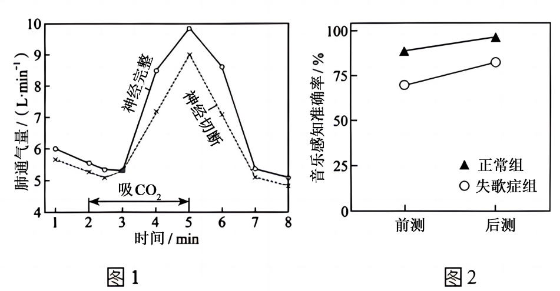

（3）失歌症者先天唱歌跑调却不自知，为检测其对音乐的感知和学习能力，对正常组和失歌症组进行“前测一训练一后测”的实验研究，结果如图2。从不同角度分析可知，与正常组相比，失歌症组\_\_\_\_\_\_（答出2点）；仅分析失歌症组后测和前测音乐感知准确率的结果，可得出的结论是\_\_\_\_\_\_，因此，应该鼓励失歌症者积极学习音乐和训练歌唱。

【答案】（1） ①. 神经冲动（兴奋） ②. 传出神经 ③. 条件

（2） ①. 大脑皮层 ②. 肺通气量主要受中枢化学感受器控制

（3） ①. 失歌症组前测对音乐感知准确率较低，经训练后测，失歌症组对音乐感知准确率上升 ②. 失歌症组后测比前测音乐感知准确率有一定提高

【解析】

【分析】反射是神经调节的方式，反射弧是反射的基本结构，完整的反射弧包括：感受器、传入神经、神经中枢、传出神经和效应器。

【小问1详解】

听歌跟唱时，声波传入内耳使听觉感受细胞产生神经冲动（兴奋），经听神经传入神经中枢，再通过中枢对信息的分析和综合后，由传出神经支配发声器官唱出歌声，该过程属于神经调节的条件反射活动，需要大脑皮层的参与。

【小问2详解】

唱歌时，呼吸是影响发声的重要因素，需要有意识地控制“呼”与“吸”。换气的随意控制由高级中枢（脑干）和低级中枢对呼吸肌的分级调节实现。切断动物外周化学感受器的传入神经前后，让动物短时吸入CO2（5%CO2和95%O2），据图分析，神经切断前后，肺通气量先增加后下降。

【小问3详解】

对正常组和失歌症组进行“前测一训练一后测”的实验研究，结果如图2。从不同角度分析可知，与正常组相比，失歌症组前测对音乐感知准确率较低，经训练后测，失歌症组对音乐感知准确率上升。仅分析失歌症组后测和前测音乐感知准确率的结果，可得出的结论是失歌症组后测比前测音乐感知准确率有一定的提高，因此，应该鼓励失歌症者积极学习音乐和训练歌唱。

24\. 作物在成熟期叶片枯黄，若延长绿色状态将有助于提高产量。某小麦野生型在成熟期叶片正常枯黄（熟黄），其单基因突变纯合子ml在成熟期叶片保持绿色的时间延长（持绿）。回答下列问题。

（1）将ml与野生型杂交得到F1，表型为\_\_\_\_\_\_（填“熟黄”或“持绿”），则此突变为隐性突变（A1基因突变为al基因）。推测A1基因控制小麦熟黄，将A1基因转入\_\_\_\_\_\_个体中表达，观察获得的植株表型可验证此推测。

（2）突变体m2与ml表型相同，是A2基因突变为a2基因的隐性纯合子，A2基因与A1基因是非等位的同源基因，序列相同。A1、A2、a1和a2基因转录的模板链简要信息如图1。据图1可知，与野生型基因相比，a1基因发生了\_\_\_\_\_\_，a2基因发生了\_\_\_\_\_\_，使合成的mRNA都提前出现了\_\_\_\_\_\_，翻译出的多肽链长度变\_\_\_\_\_\_，导致蛋白质的空间结构改变，活性丧失。A1（A2）基因编码A酶，图2为检测野生型和两个突变体叶片中A酶的酶活性结果，其中\_\_\_\_\_\_号株系为野生型的数据。

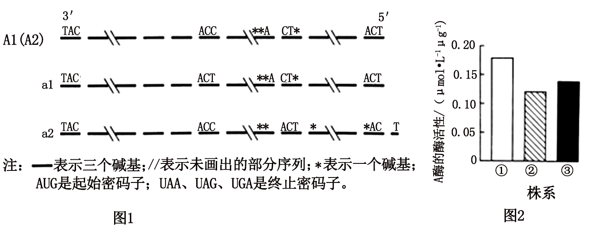

（3）A1和A2基因位于非同源染色体上，ml的基因型为\_\_\_\_\_\_，m2的基因型为\_\_\_\_\_\_。若将ml与m2杂交得到F1，F1自交得到F2，F2中自交后代不发生性状分离个体的比例为\_\_\_\_\_\_。

【答案】（1） ①. 熟黄 ②. 持绿（或m1或突变型）

（2） ①. 碱基对的替换 ②. 碱基对的增添 ③. 终止密码子 ④. 短 ⑤. ①

（3） ①. a1a1A2A2 ②. A1A1a2a2 ③. 1/2##0.5##50%

【解析】

【分析】1、基因自由组合定律的实质是：位于非同源染色体上的非等位基因的分离或自由组合是互不干扰的；在减数分裂过程中，同源染色体上的等位基因彼此分离的同时，非同源染色体上的非等位基因自由组合。

2、基因突变：DNA分子中发生碱基的替换、增添或缺失，而引起的基因碱基序列的改变，叫做基因突变。

【小问1详解】

若此突变为隐性突变，则m1的基因型为a1a1，野生型的基因型为A1A1，m1野生型A1a1，表型为野生型，即熟黄。若要证明此推测，可将A1基因转入持绿（或m1或突变型）个体中表达，若植株表现为熟黄，则可验证此推测。

【小问2详解】

依据题干和图1可知，①A2基因与A1基因是非等位的同源基因，序列相同；②突变体m2与ml表型相同，且均为对应基因的隐性纯合子；③由于终止密码子为UAA、UAG、UGA，可知对应模板链上碱基为ATT、ATC、ACT。与野生型基因相比较，a1发生了碱基的替代，a2基因发生了碱基的增添（增添了碱基T），即a1序列上提前出现了ACT，a2序列上出现ACT，即使合成的mRNA都提前出现了终止密码子，导致翻译出的多肽链长度变短，导致蛋白质的空间结构改变，活性丧失。A1（A2）基因编码A酶，且突变体m2与ml表型相同，可知m2与ml中A酶的酶活性大体相同，所以据图2，可知，①号株系为野生型数据。

【小问3详解】

依据题干信息，A1和A2基因位于非同源染色体上，则ml的基因型为a1a1A2A2，m2的基因型为A1A1a2a2。mlm2F1：A1a1A2a2，F1F2：A1 - A2 - ：a1a1A2 - ：A1 - a2a2 ：a1a1a2a2=9:3:3:1，对应的表型为野生型：突变型=9:7，后代中不会发生性状分裂的基因型为：A1A1A2A2、a1a1A2 -、A1 - a2a2、a1a1a2a2，所占的比例为1/16+3/16+3/16+1/16=1/2。

25\. 将天然Ti质粒改造成含有Vir基因的辅助质粒（辅助T-DNA转移）和不含有Vir基因、含有T-DNA的穿梭质粒，共同转入农杆菌，可提高转化效率。细菌和棉花对密码子偏好不同，为提高翻译效率，增强棉花抗病虫害能力，进行如下操作。回答下列问题。

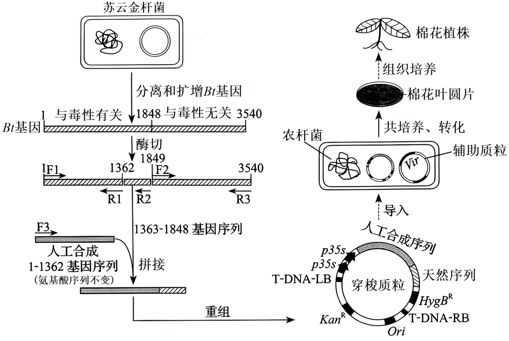

注：F1-F3，R1-R3表示引物；T-DNA-LB表示左边界；T-DNA-RB表示右边界；Ori表示复制原点；KanR表示卡那霉素抗性基因；HygBR表示潮霉素B抗性基因。

（1）从苏云金杆菌提取DNA时，需加入蛋白酶，其作用是\_\_\_\_\_\_。提取过程中加入体积分数为95%的预冷酒精，其目的是\_\_\_\_\_\_。

（2）本操作中获取目的基因的方法是\_\_\_\_\_\_和\_\_\_\_\_\_。

（3）穿梭质粒中p35s为启动子，其作用是\_\_\_\_\_\_，驱动目的基因转录；插入两个p35s启动子，其目的可能是\_\_\_\_\_\_。

（4）根据图中穿梭质粒上的KanR和HygBR两个标记基因的位置，用\_\_\_\_\_\_基因对应的抗生素初步筛选转化的棉花愈伤组织。

（5）为检测棉花植株是否导入目的基因，提取棉花植株染色体DNA作模板，进行PCR，应选用的引物是\_\_\_\_\_\_和\_\_\_\_\_\_。

（6）本研究采用的部分生物技术属于蛋白质工程，理由是\_\_\_\_\_\_。

A. 通过含有双质粒的农杆菌转化棉花细胞

B. 将苏云金杆菌Bt基因导入棉花细胞中表达

C. 将1-1362基因序列改变为棉花细胞偏好密码子的基因序列

D. 用1-1362合成基因序列和1363-1848天然基因序列获得改造的抗虫蛋白

【答案】（1） ①. 水解蛋白质，使得DNA与蛋白质分离 ②. 溶解蛋白质等物质，析出不溶于酒精的DNA

（2） ①. PCR技术扩增 ②. 人工合成

（3） ①. RNA聚合酶识别并结合的部位 ②. 同时实现两个目的基因的共同表达及调控，从而降低基因工程的成本与复杂性

（4）HygBR （5） ①. F3 ②. R2 （6）CD

【解析】

【分析】基因工程技术的基本步骤：（1）目的基因的获取：方法有从基因文库中获取、利用PCR技术扩增和人工合成。（2）基因表达载体的构建：是基因工程的核心步骤，基因表达载体包括目的基因、启动子、终止子和标记基因等。（3）将目的基因导入受体细胞：根据受体细胞不同，导入的方法也不一样。（4）目的基因的检测与鉴定。

【小问1详解】

从苏云金杆菌提取DNA时，需加入蛋白酶，其作用是水解蛋白质，使得DNA与蛋白质分离。提取过程中加入体积分数为95%的预冷酒精，其目的是溶解蛋白质等物质，析出不溶于酒精的DNA。

【小问2详解】

本操作中获取目的基因的方法是人工合成和PCR技术扩增。

【小问3详解】

穿梭质粒中p35s为启动子，其作用是RNA聚合酶识别并结合的部位，驱动目的基因转录；插入两个p35s启动子，其目的可能是同时实现两个目的基因的共同表达及调控，从而降低基因工程的成本与复杂性。

【小问4详解】

结合基因表达载体的示意图，根据图中穿梭质粒上的KanR和HygBR两个标记基因的位置，用HygBR基因对应的抗生素初步筛选转化的棉花愈伤组织。

【小问5详解】

为检测棉花植株是否导入目的基因，提取棉花植株染色体DNA作模板，进行PCR，应选用的引物是F3和R2。

【小问6详解】

蛋白质工程是指以蛋白质分子的结构规律及其与生物功能的关系作为基础，通过改造或合成基因，来改造现有蛋白质，或制造一种新的蛋白质，以满足人类生产和生活的需求，本研究采用的部分生物技术属于蛋白质工程，理由是将1-1362基因序列改变为棉花细胞偏好密码子的基因序列、用1-1362合成基因序列和1363-1848天然基因序列获得改造的抗虫蛋白，AB不符合题意，CD符合题意。

故选CD。
