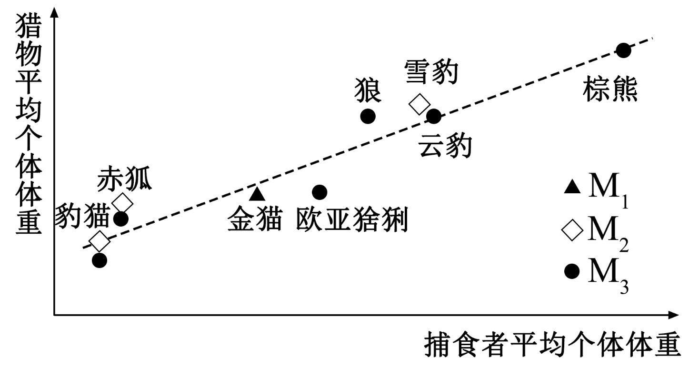
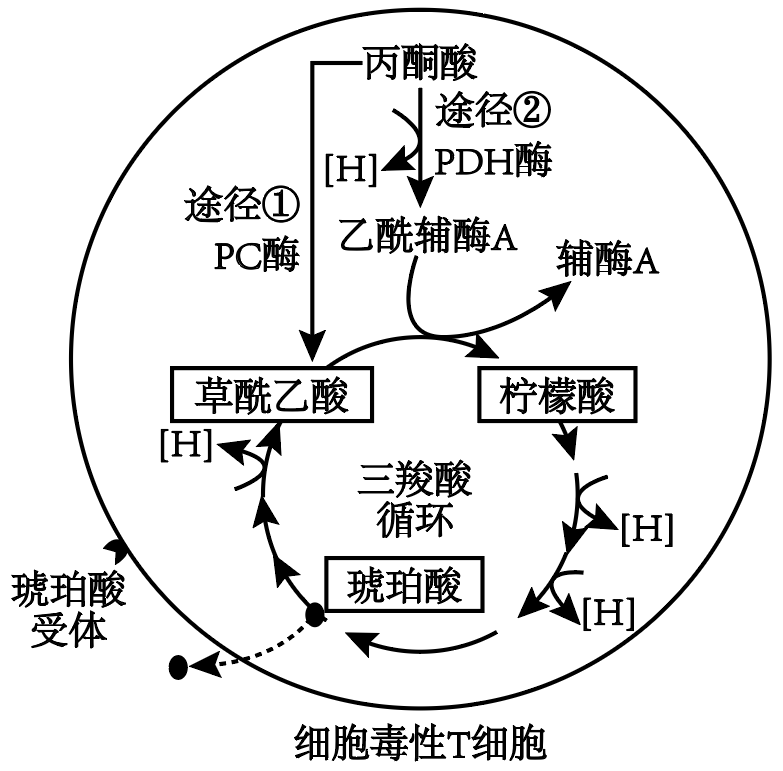
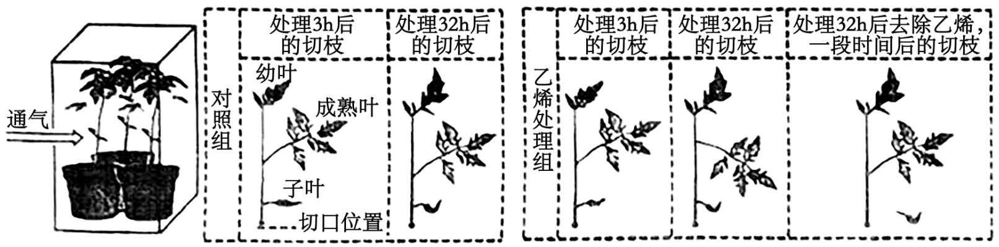
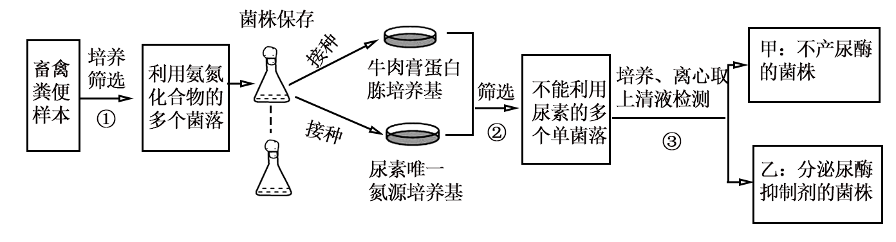
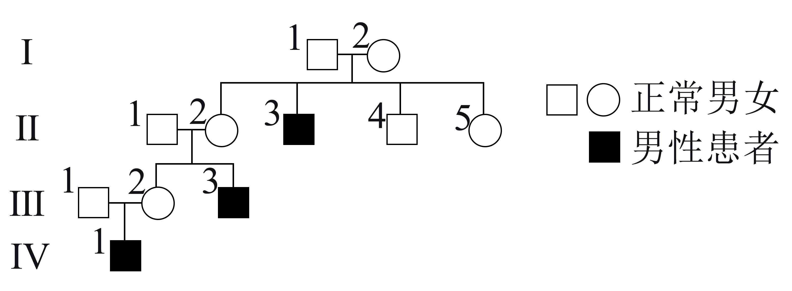
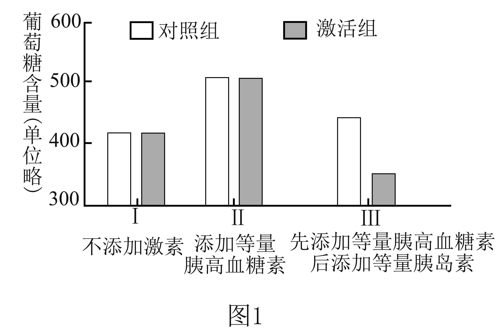
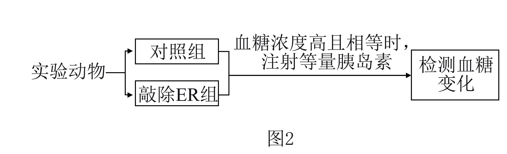
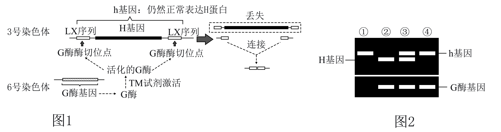

**2024年重庆新课标高考生物试卷**

1\. 苹果变甜主要是因为多糖水解为可溶性糖，细胞中可溶性糖储存的主要场所是（ ）

A. 叶绿体 B. 液泡 C. 内质网 D. 溶酶体

2\. 下表据《中国膳食指南》得到女性3种营养元素每天推荐摄入量，据表推测，下列错误的是（ ）

|                                                                                                                                                                                |         |         |                                                    |
|:------------------------------------------------------------------------------------------------------------------------------------------------------------------------------:|:-------:|:-------:|:--------------------------------------------------:|
|  | 钙（mg/d） | 铁（mg/d） | 碘 |
| 0.5-1岁                                                                                                                                                                         | 350     | 10      | 115                                                |
| 25-30岁（未孕）                                                                                                                                                                     | 800     | 18      | 120                                                |
| 25-30岁（孕中期）                                                                                                                                                                    | 800     | 25      | 230                                                |
| 65-75岁                                                                                                                                                                         | 800     | 10      | 120                                                |

A. 以单位体重计，婴儿对碘的需求高于成人

B. 与孕前期相比，孕中期女性对氧的需求量升高

C. 对25岁与65岁女性，大量元素的推荐摄入量不同

D. 即使按推荐量摄入钙，部分女性也会因缺维生素D而缺钙

3\. 正常重力环境中，成骨细胞分泌的PGE2与感觉神经上的EP4结合，将信号传入下丘脑抑制某类交感神经活动。进而对骨骼中血管和成骨细胞进行调节，促进骨生成以维持骨量稳定。长时间航天飞行会使宇航员骨量下降。下列分析合理的是（ ）

A. PGE2与EP4的合成过程均发生在内环境

B. PGE与EP4的结合使骨骼中血管收缩

C. 长时间航天飞行会使宇航员成骨细胞分泌PGE2增加

D. 使用抑制该类交感神经的药物有利于宇航员的骨量恢复

4\. 心脏受损的病人，成纤维细胞异常表达FAP蛋白，使心脏纤维化。科研人员设计编码FAP-CAR蛋白（识别FAP）的mRNA，用脂质体携带靶向运输到某种T细胞中表达，再由囊泡运输到T细胞膜上，作用于受损的成纤维细胞，以减轻症状。以下说法错误的（ ）

A. mRNA放置于脂质体双层分子之间

B. T细胞的核基因影响FAP-CAR的合成

C. T细胞的高尔基体参与FAP-CAR的修饰和转运

D. 脂质体有能识别T细胞表面抗原的抗体，可靶向运输

5\. 科学家证明胸腺是免疫系统的重要组成，说法正确的是（ ）

<table style="width:83%;">
<colgroup>
<col style="width: 7%" />
<col style="width: 24%" />
<col style="width: 24%" />
<col style="width: 13%" />
<col style="width: 13%" />
</colgroup>
<tbody>
<tr>
<td rowspan="2" style="text-align: center;">分组</td>
<td colspan="2" style="text-align: center;">实验步骤</td>
<td colspan="2" style="text-align: center;">实验结果</td>
</tr>
<tr>
<td style="text-align: center;">步骤一</td>
<td style="text-align: center;">步骤二</td>
<td style="text-align: center;">成功率（%）</td>
<td style="text-align: center;">排斥率（%）</td>
</tr>
<tr>
<td style="text-align: center;">①</td>
<td style="text-align: center;">出生后不摘除胸腺</td>
<td rowspan="3" style="text-align: center;">移植不同品系小鼠皮肤</td>
<td style="text-align: center;">0</td>
<td style="text-align: center;">100</td>
</tr>
<tr>
<td style="text-align: center;">②</td>
<td style="text-align: center;">出生后1~16小时摘除胸腺</td>
<td style="text-align: center;">71</td>
<td style="text-align: center;">29</td>
</tr>
<tr>
<td style="text-align: center;">③</td>
<td style="text-align: center;">出生后5天摘除胸腺</td>
<td style="text-align: center;">0</td>
<td style="text-align: center;">100</td>
</tr>
</tbody>
</table>

A. ①组排斥时不用辅助性T细胞参与

B. ②组成功小鼠比排斥小鼠更易患肿瘤

C. ③组使用免疫抑制剂可避免免疫排斥

D. 根据所给信息推测，出生后20小时摘除胸腺，再移植皮肤后不出现排斥

6\. 为了解动物共存方式，科学家调查M1等西南3个山系肉食动物的捕食偏好，如图推断最合理的（ ）

A. 棕熊从低营养级中获得能量少，对其所在生态系统的影响较弱

B. M2的豹猫和雪豹均为三级消费者，处于第四营养级

C. 3个山系中，M3的肉食动物丰富度和生态系统的抵抗力稳定性均最高

D. 大型捕食者偏好捕食小型猎物，大、小型肉食动物通过生态位分离实现共存

7\. 肿瘤所处环境中的细胞毒性T细胞存在题图所示代谢过程。其中，PC酶和PDH酶控制着丙酮酸产生不同的代谢产物，进入有氧呼吸三羧酸循环。增加PC酶的活性会增加琥珀酸的释放，琥珀酸与受体结合可增强细胞毒性T细胞的杀伤能力，若环境中存在乳酸，PC酶的活性会被抑制。下列叙述正确的是（ ）

A. 图中三羧酸循环的代谢反应直接需要氧

B. 图中草酰乙酸和乙酰辅酶A均产生于线粒体内膜

C. 肿瘤细胞无氧呼吸会增强细胞毒性T细胞的杀伤能力

D. 葡萄糖有氧呼吸的所有代谢反应中至少有5步会生成［H］

8\. 科研小组以某种硬骨鱼为材料在鱼鳍（由不同组织构成）“开窗”研究组织再生的方向性和机制（题图所示），下列叙述不合理的是（ ）

A. “窗口”愈合过程中，细胞之间的接触会影响细胞增殖

B. 对照组“窗口”远端，细胞不具有增殖和分化的潜能

C. “窗口”再生的方向与两端H酶的活性高低有关，F可抑制远端H酶活性

D. 若要比较尾鳍近、远端的再生能力，则需沿鳍近、远端各开“窗口”观察

9\. 白鸡（tt）生长较快，麻鸡（TT）体型大更受市场欢迎，但生长较慢。因此育种场引入白鸡，通过杂交改良麻鸡。麻鸡感染ALV（逆转录病毒）后，来源于病毒的核酸插入常染色体是显性基因T突变为t，生产中常用快慢羽性状（由性染色体的R、r控制，快羽为隐性）鉴定雏鸡性别。现以雌性慢羽白鸡、雄性快羽麻鸡为亲本，下列叙述正确的是（ ）

A. 一次杂交即可获得T基因纯合麻鸡

B. 快羽麻鸡在F1代中所占的比例可为1/4

C. 可通过快慢羽区分F2代雏鸡性别

D. t基因上所插入核酸与ALV核酸结构相同

10\. 自然条件下，甲、乙两种鱼均通过体外受精繁殖后代，甲属于国家保护的稀有物种，乙的种群数量多且繁殖速度较甲快。我国科学家通过下图所示流程进行相关研究，以期用于濒危鱼类的保护。下列叙述正确的是（ ）

A. 诱导后的iPGCs具有胚胎干细胞的特性

B. 移植的iPGCs最终产生的配子具有相同的遗传信息

C. 该实验中，子一代的遗传物质来源于物种甲

D. 通过该实验可以获得甲的克隆

11\. 为探究乙烯在番茄幼苗生长过程中的作用，研究人员在玻璃箱中对若干番茄幼苗分组进行处理，一定时间后观测成熟叶叶柄与茎的夹角变化，然后切取枝条，检测各部位乙烯的量。题图，为其处理方式和结果的示意图（切枝上各部位颜色越深表示乙烯量越多）。据此分析，下列叙述错误的是（ ）

A. 由切口处乙烯的积累，可推测机械伤害加速乙烯合成

B. 由幼叶发育成熟过程中乙烯量减少，可推测IAA抑制乙烯合成

C. 乙烯处理使成熟叶向下弯曲，可能是由于叶柄上侧细胞生长快于下侧细胞

D. 去除乙烯合成后成熟叶角度恢复，可能是因为叶柄上、下侧细胞中IAA比值持续增大

12\. 某种海鱼鳃细胞的NKA酶是一种载体蛋白，负责将细胞内的Na+转运到血液中，为研究NKA与Na+浓度的关系，研究小组将若干海鱼放在低于海水盐度的盐水中，按时间点分组取样检测，部分结果见下表。结合数据分析，下列叙述错误的是（ ）

<table style="width:77%;">
<colgroup>
<col style="width: 12%" />
<col style="width: 9%" />
<col style="width: 12%" />
<col style="width: 11%" />
<col style="width: 11%" />
<col style="width: 20%" />
</colgroup>
<tbody>
<tr>
<td rowspan="2" style="text-align: center;">时间（h）</td>
<td colspan="2" style="text-align: center;">Na+浓度（单位略）</td>
<td colspan="2" style="text-align: center;">NKA表达（相对值）</td>
<td rowspan="2" style="text-align: center;">NKA酶的相对活性</td>
</tr>
<tr>
<td style="text-align: center;">血液</td>
<td style="text-align: center;">鳃细胞</td>
<td style="text-align: center;">mRNA</td>
<td style="text-align: center;">蛋白质</td>
</tr>
<tr>
<td style="text-align: center;">0</td>
<td style="text-align: center;">320</td>
<td style="text-align: center;">15</td>
<td style="text-align: center;">1.0</td>
<td style="text-align: center;">1.0</td>
<td style="text-align: center;">1.0</td>
</tr>
<tr>
<td style="text-align: center;">0.5</td>
<td style="text-align: center;">290</td>
<td style="text-align: center;">15</td>
<td style="text-align: center;">15</td>
<td style="text-align: center;">10</td>
<td style="text-align: center;">0.8</td>
</tr>
<tr>
<td style="text-align: center;">3</td>
<td style="text-align: center;">220</td>
<td style="text-align: center;">15</td>
<td style="text-align: center;">0.6</td>
<td style="text-align: center;">1.0</td>
<td style="text-align: center;">0.6</td>
</tr>
<tr>
<td style="text-align: center;">6</td>
<td style="text-align: center;">180</td>
<td style="text-align: center;">15</td>
<td style="text-align: center;">0.4</td>
<td style="text-align: center;">0.4</td>
<td style="text-align: center;">0.4</td>
</tr>
<tr>
<td style="text-align: center;">12</td>
<td style="text-align: center;">180</td>
<td style="text-align: center;">15</td>
<td style="text-align: center;">0.2</td>
<td style="text-align: center;">0.2</td>
<td style="text-align: center;">0.4</td>
</tr>
</tbody>
</table>

A. NKAmRNA和蛋白质表达趋势不一致是NKA基因中甲基化导致的

B. 本实验中时间变化不是影响NKA基因转录变化的直接因素

C. NKA酶在维持海鱼鳃细胞内渗透压平衡时需要直接消耗ATP

D. 与0h组相比，表中其他时间点的海鱼红细胞体积会增大

13\. 养殖场粪便是农家肥的重要来源，其中某些微生物可使氨氮化合物转化为尿素进而产生NH3，影响畜禽健康。为筛选粪便中能利用氨氮化合物且减少NH3产生的微生物。兴趣小组按图进行实验获得目的菌株，正确的是（ ）

A. ①通常在等比稀释后用平板划线法获取单个菌落

B. ②挑取在2种培养基上均能生长的用于后续的实验

C. ③可通过添加脲酶并检测活性，筛选得到甲、乙

D. 粪便中添加菌株甲比乙更有利于NH3的减少

14\. 某些树突状细胞可迁移到抗原所在部位，特异性识别主要组织相容性复合体，增殖后大部分形成活化的树突状细胞，小部分形成记忆树突状细胞。为验证树突状细胞的免疫记忆，研究人员用3种不同品系的小鼠（同一品系小鼠具有相同的主要组织相容性复合体）进行了如图实验，下列叙述错误的是（ ）

A. 树突状细胞的免疫记忆体现在抗原呈递功能增强

B. ③中活化的树突状细胞可识别丙品系小鼠的抗原

C. II组中检测到的活化树突状细胞与I组相近

D. II组和III组骨髓中均可检测到记忆树突状细胞

15\. 一种罕见遗传病的致病基因只会引起男性患病，但其遗传方式未知。结合遗传系谱图和患者父亲基因型分析，该病遗传方式可能性最小的是（ ）

A. 常染色体隐性遗传 B. 常染色体显性遗传

C. 伴X染色体隐性遗传 D. 伴X染色体显性遗传

16\. 热带雨林是陆地生态系统中生物多样性最丰富的森林类型之一。

（1）用于区别不同群落的重要特征是\_\_\_\_\_\_\_\_\_\_\_\_。热带雨林独特的群落结构特征有\_\_\_\_\_\_\_\_\_（答一点）。

（2）群落的丰富度可用样方法进行测定，取样面积要基本能够体现出群落中所有植物的种类（即最小取样面积）。热带雨林的最小取样面积应\_\_\_\_\_\_\_\_\_\_（填“大于”“等于”或“小于”）北方针叶林。

（3）研究发现，热带雨林优势树种通过“同种负密度制约”促进物种共存，维持极高的生物多样性。

①题图所示为优势树种的“同种负密度制约”现象，对产生这种现象的合理解释是\_\_\_\_\_\_\_\_\_\_\_\_（填选项）。

a．母树附近光照不足，影响了幼苗存活

b．母树附近土壤中专一性致病菌更丰富，导致幼苗死亡率上升

c．母树附近其幼苗密度过高时，释放化学信息影响幼苗的存活率

d．母树附近捕食者对种子的选择性取食强度加大，降低了种子成为幼苗的概率

e．母树附近凋落叶阻止了幼苗对土壤中水分和养分的吸收，降低了幼苗的存活率

A．abd B．ace C．bcd D．cde

②“同种负密度制约”维持热带雨林极高生物多样性的原因是\_\_\_\_\_\_\_\_\_\_\_\_。

（4）热带雨林是“水库、粮库、钱库、碳库”，这一观点体现了生物多样性的\_\_\_\_\_\_\_\_\_价值。

17\. 胰岛素作用于肝细胞调节血糖平衡。为探究雌激素是否对胰岛素的作用产生影响，研究者进行了相关实验。

（1）卵细胞产生的雌激素通过\_\_\_\_\_\_\_\_运输到肝细胞，作用于雌激素受体（ER），ER激活肝细胞内的下游信号。

（2）研究者构建雌激素激活肝细胞模型鼠，将肝细胞置于不含葡萄糖的培养液中，分别处理一段时间后测定培养液中葡萄糖的含量。如图1。为提高葡萄糖含量以便检测，添加了胰高血糖素进行处理，胰高血糖素提高血糖的原因是\_\_\_\_\_\_\_\_\_\_（答一点）。如图1处理，Ⅱ组用胰高血糖素处理，除验证胰高血糖素升高血糖的作用外，还有什么作用？\_\_\_\_\_\_\_\_\_\_\_\_\_\_。由实验可以得出，在降低血糖上，雌激素和胰岛素的相互作用是\_\_\_\_\_\_\_\_\_\_\_\_\_\_。

（3）为进一步验证上述结论，实验者进行体内实验，有人认为实验设计不合理，即使不考虑其他激素对血糖水平的影响，也无法得出雌激素与胰岛素之间的相互关系，你认为的原因可能是\_\_\_\_\_\_\_\_。

18\. 重庆石柱是我国著名传统中药黄连的主产区之一，黄连生长缓慢，存在明显的光饱和（光合速率不再随光强增加而增加）和光抑制（光能过剩导致光合速率降低）现象。

（1）探寻提高黄连产量的技术措施，研究人员对黄连的光合特征进行了研究，结果见图1。

①黄连的光饱和点约为\_\_\_\_\_\_\_\_umol\*m-2\*s-1。光强大于1300umol\*m-2\*s-1后，胞间二氧化碳浓度增加主要是由于\_\_\_\_\_\_\_\_。

②推测光强对黄连生长的影响主要表现为\_\_\_\_\_。黄连叶片适应弱光的特征有\_\_\_\_\_\_（答2点）。

（2）黄连露天栽培易发生光抑制，严重时其光合结构被破坏（主要受损的部位是位于类囊体薄膜上的色素蛋白复合体），为减轻光抑制，黄连能采取调节光能在叶片上各去向（题图2）的比例，提升修复能力等防御机制，具体可包括\_\_\_\_\_\_\_\_（多选）。①叶片叶绿体避光运动，②提高光合产物生成速率，③自由基清除能力增强，④提高叶绿素含量，⑤增强热耗散。

（3）生产上常采用搭棚或林下栽培减轻黄连的光抑制，为增强黄连光合作用以提高产量还可采取的措施施及其作用是\_\_\_\_\_。

19\. 大豆是重要的粮油作物，提高大豆产量是我国农业领域的重要任务。我国研究人员发现，基因S在大豆品种DN（种子较大）中的表达量高于品种TL（种子较小），然后克隆了该基因（两品种中基因S序列无差异）及其上游的启动子序列，并开展相关研究。

（1）基因S启动子的基本组成单位是\_\_\_\_\_\_\_\_\_\_\_\_。

（2）通过基因工程方法,将DN克隆的“启动子D+基因S”序列导入无基因S的优质大豆品种YZ。根据题19图所示信息（不考虑未标明序列）判断构建重组表达载体时，为保证目标序列的完整性，不宜使用的限制酶是\_\_\_\_\_\_\_\_\_\_\_\_；此外，不宜同时选用酶SpeⅠ和XbaⅠ。原因是\_\_\_\_\_\_\_\_\_\_\_\_。

（3）为验证“启动子D+基因S”是否连接在表达载体上，可用限制酶对重组表达载体酶切后进行电泳。电泳时，对照样品除指示分子大小的标准参照物外，还应有\_\_\_\_\_\_\_\_\_\_\_\_\_\_。经验证的重组表达载体需转入农杆菌，检测转入是否成功的技术是\_\_\_\_\_\_\_\_\_\_\_\_\_\_。

（4）用检测后的农杆菌转化品种YZ所得再生植株YZ-1的种子变大。同时将从TL克隆的“启动子T+基因S”序列成功导入YZ，所得再生植株YZ-2的种子也变大，但小于YZ-1。综合分析，大豆品种DN较TL种子大的原因是\_\_\_\_\_\_\_\_\_\_\_\_\_\_\_。

20\. 有研究者构建了H基因条件敲除小鼠用于相关疾病的研究，原理如图。构建过程如下：在H基因前后均插入LX序列突变成h基因（仍正常表达H蛋白），获得Hh雌性小鼠；将噬菌体的G酶基因插入6号染色体上，获得G+G-雄鼠（G+表示插入，G\_表示未插入G酶基因）

（1）以上述雌雄小鼠为亲本，最快繁殖两代就可以获得H基因条件敲除小鼠（hhG+G-和hhG+G+）。在该过程中，用于繁殖F1的基因型是\_\_\_\_\_\_\_\_\_\_\_\_\_。长期采用近亲交配，会导致小鼠后代生存和生育能力下降，诱发这种情况的遗传学原因是\_\_\_\_\_\_\_\_\_\_\_\_\_。在繁殖时，研究人员偶然发现一只G+G-不表达G酶的小鼠，经检测发现在6号和8号染色体上含有部分G酶基因序列，该异常结果形成的原因是\_\_\_\_\_\_\_\_\_\_\_\_\_。

（2）部分小鼠的基因型鉴定结果如图2，③的基因型为\_\_\_\_\_\_\_\_\_\_\_\_\_。结合图1的原理，若将图2中所有基因型的小鼠都喂食TM试剂一段时间后，检测H蛋白水平为0的是\_\_\_\_\_\_\_\_\_\_\_\_\_（填序号）。

（3）某种病的患者在一定年龄会表现出智力障碍，该病与H蛋白表达下降有关（小鼠H蛋白与人的功能相同）。现有H基因完全敲除鼠甲和H基因条件敲除鼠乙用于研究缺失H蛋白导致该病发生的机制，更适合的小鼠是\_\_\_\_\_\_\_\_\_\_\_\_\_（“甲”或“乙”），原因是\_\_\_\_\_\_\_\_\_\_\_\_\_。
