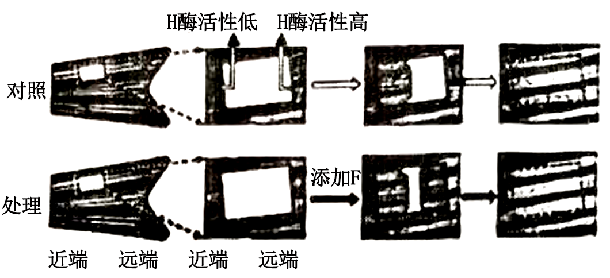
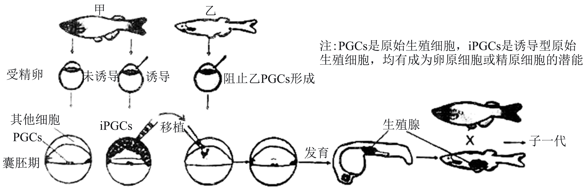
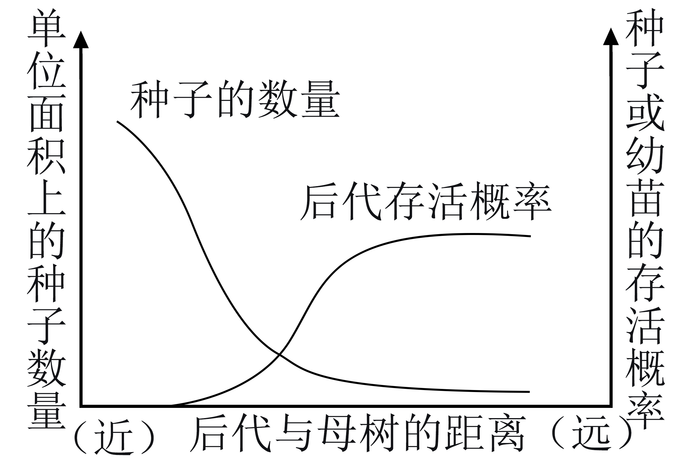
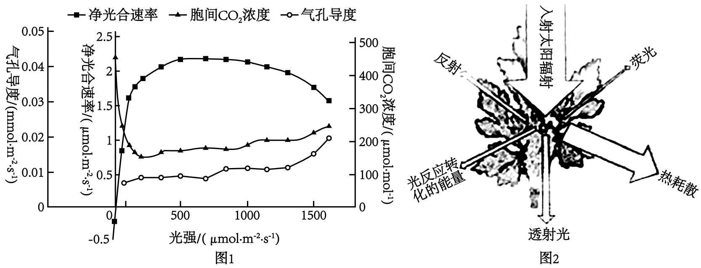

**2024年重庆新课标高考生物试卷**

1\. 苹果变甜主要是因为多糖水解为可溶性糖，细胞中可溶性糖储存的主要场所是（ ）

A. 叶绿体 B. 液泡 C. 内质网 D. 溶酶体

【答案】B

【解析】

【分析】细胞质中有线粒体、内质网、核糖体、高尔基体等细胞器，植物细胞有的有叶绿体。这些细胞器既有分工，又有合作。

【详解】A、叶绿体是绿色植物能进行光合作用的细胞含有的细胞器，是植物细胞的“养料制造车间”和“能量转换站”。据此可知，叶绿体不是苹果细胞中可溶性糖储存的主要场所，A不符合题意；

B、液泡主要存在于植物的细胞中，内有细胞液，含糖类、无机盐、色素和蛋白质等。据此可知，苹果细胞中的可溶性糖储存的主要场所是液泡，B符合题意；

C、内质网是蛋白质等大分子物质的合成、加工场所和运输通道。据此可知，内质网不是苹果细胞中可溶性糖储存的主要场所，C不符合题意；

D、溶酶体主要分布在动物细胞中，是细胞的“消化车间”，内部含有多种水解酶。据此可知，溶酶体不是苹果细胞中可溶性糖储存的主要场所，D不符合题意。

故选B。

2\. 下表据《中国膳食指南》得到女性3种营养元素每天推荐摄入量，据表推测，下列错误的是（ ）

|                                                                                                                                                                                |         |         |                                                    |
|:------------------------------------------------------------------------------------------------------------------------------------------------------------------------------:|:-------:|:-------:|:--------------------------------------------------:|
|  | 钙（mg/d） | 铁（mg/d） | 碘 |
| 0.5-1岁                                                                                                                                                                         | 350     | 10      | 115                                                |
| 25-30岁（未孕）                                                                                                                                                                     | 800     | 18      | 120                                                |
| 25-30岁（孕中期）                                                                                                                                                                    | 800     | 25      | 230                                                |
| 65-75岁                                                                                                                                                                         | 800     | 10      | 120                                                |

A. 以单位体重计，婴儿对碘的需求高于成人

B. 与孕前期相比，孕中期女性对氧的需求量升高

C. 对25岁与65岁女性，大量元素的推荐摄入量不同

D. 即使按推荐量摄入钙，部分女性也会因缺维生素D而缺钙

【答案】C

【解析】

【分析】大量元素主要有C、H、O、N、P、S、K、Ca、Mg；微量元素主要有Fe、Mn、Zn、Cu、B、Mo；主要元素有C、H、O、N、P、S；基本元素有C、H、O、N；最基本元素是C。

【详解】A、由表格数据可知，婴儿碘每天的摄入量为115μg，成人为120μg，相差不大，但成人的体重远高于婴儿，所以以单位体重计，婴儿对碘的需求高于成人，A正确；

B、铁是血红蛋白在重要成分，表中数据可知，孕中期铁的摄入量高于未孕，由此推测孕中期胎儿发育加快，孕妇的新陈代谢加快，与孕前期相比，孕中期女性对氧的需求量升高，B正确；

C、大量元素主要有C、H、O、N、P、S、K、Ca、Mg，由表格数据可知对25岁与65岁女性，钙的推荐摄入量均为800mg/d，C错误；

D、维生素D可以促进钙的吸收，所以即使按推荐量摄入钙，部分女性也会因缺维生素D而缺钙，D正确。

故选C。

3\. 正常重力环境中，成骨细胞分泌的PGE2与感觉神经上的EP4结合，将信号传入下丘脑抑制某类交感神经活动。进而对骨骼中血管和成骨细胞进行调节，促进骨生成以维持骨量稳定。长时间航天飞行会使宇航员骨量下降。下列分析合理的是（ ）

A. PGE2与EP4的合成过程均发生在内环境

B. PGE与EP4的结合使骨骼中血管收缩

C. 长时间航天飞行会使宇航员成骨细胞分泌PGE2增加

D. 使用抑制该类交感神经的药物有利于宇航员的骨量恢复

【答案】D

【解析】

【分析】自主神经系统包括交感神经和副交感神经。交感神经和副交感神经是调节人体内脏功能的神经装置，所以也叫内脏神经系统，因为其功能不完全受人类的意识支配，所以又叫自主神经系统，也可称为植物性神经系统。

【详解】A、PGE2是细胞分泌的神经递质，EP4是神经上的受体，这两个物质的合成场所都是在细胞内完成的，不属于内环境，A错误；

B、PGE2与EP4结合后传入下丘脑抑制某类交感神经活动，这通常会导致血管扩张而不是收缩，B错误；

C、长时间航天飞行会导致宇航员骨量下降，而不是通过增加PGE2的分泌来尝试维持骨量，C错误；

D、根据题意，交感神经活动的抑制有助于促进骨生成以维持骨量稳定，抑制交感神经活动的药物可能有助于宇航员在长时间航天飞行后恢复骨量，D正确；

故选D。

4\. 心脏受损的病人，成纤维细胞异常表达FAP蛋白，使心脏纤维化。科研人员设计编码FAP-CAR蛋白（识别FAP）的mRNA，用脂质体携带靶向运输到某种T细胞中表达，再由囊泡运输到T细胞膜上，作用于受损的成纤维细胞，以减轻症状。以下说法错误的（ ）

A. mRNA放置于脂质体双层分子之间

B. T细胞的核基因影响FAP-CAR的合成

C. T细胞的高尔基体参与FAP-CAR的修饰和转运

D. 脂质体有能识别T细胞表面抗原的抗体，可靶向运输

【答案】A

【解析】

【分析】分泌蛋白质合成与分泌过程为：核糖体合成蛋白质→内质网进行粗加工→高尔基体进行再加工→细胞膜（胞吐）→细胞外。

【详解】A、脂质体双层分子中磷脂分子亲水头部在外，而疏水的尾部在内，而mRNA是亲水的大分子物质，所以mRNA放置于脂质体内部，A错误；

B、FAP-CAR蛋白的mRNA用脂质体携带靶向运输到某种T细胞中表达，细胞核是细胞代谢和遗传的控制中心，所以T细胞的核基因影响FAP-CAR的合成，B正确；

C、FAP-CAR由囊泡运输到T细胞膜上，其合成过程类似于分泌蛋白，需要高尔基体参与其修饰和转运，C正确；

D、根据抗原和抗体特异性结合的特点，脂质体携带mRNA可以靶向运输到某种T细胞，所以脂质体有能识别T细胞表面抗原的抗体，可靶向运输，D正确。

故选A。

5\. 科学家证明胸腺是免疫系统的重要组成，说法正确的是（ ）

<table style="width:83%;">
<colgroup>
<col style="width: 7%" />
<col style="width: 25%" />
<col style="width: 24%" />
<col style="width: 13%" />
<col style="width: 13%" />
</colgroup>
<tbody>
<tr>
<td rowspan="2" style="text-align: center;">分组</td>
<td colspan="2" style="text-align: center;">实验步骤</td>
<td colspan="2" style="text-align: center;">实验结果</td>
</tr>
<tr>
<td style="text-align: center;">步骤一</td>
<td style="text-align: center;">步骤二</td>
<td style="text-align: center;">成功率（%）</td>
<td style="text-align: center;">排斥率（%）</td>
</tr>
<tr>
<td style="text-align: center;">①</td>
<td style="text-align: center;">出生后不摘除胸腺</td>
<td rowspan="3" style="text-align: center;">移植不同品系小鼠皮肤</td>
<td style="text-align: center;">0</td>
<td style="text-align: center;">100</td>
</tr>
<tr>
<td style="text-align: center;">②</td>
<td style="text-align: center;">出生后1~16小时摘除胸腺</td>
<td style="text-align: center;">71</td>
<td style="text-align: center;">29</td>
</tr>
<tr>
<td style="text-align: center;">③</td>
<td style="text-align: center;">出生后5天摘除胸腺</td>
<td style="text-align: center;">0</td>
<td style="text-align: center;">100</td>
</tr>
</tbody>
</table>

A. ①组排斥时不用辅助性T细胞参与

B. ②组成功小鼠比排斥小鼠更易患肿瘤

C. ③组使用免疫抑制剂可避免免疫排斥

D. 根据所给信息推测，出生后20小时摘除胸腺，再移植皮肤后不出现排斥

【答案】B

【解析】

【分析】1、胸腺位于胸骨的后面，呈扁平的椭圆形，分左、右两叶。胸腺随年龄而增长，在青春期时达到高峰，以后逐渐退化。胸腺是 T 细胞分化、发育、成熟的场所。

2、人体的免疫包括非特异性免疫和特异性免疫。特异性免疫是通过体液免疫和细胞免疫两种方式，针对特定的病原体发生的免疫反应，它的分子基础是抗体与抗原、免疫细胞表面的受体与抗原的特异性结合。体液免疫主要靠体液中的抗体来作战，细胞免疫主要靠T细胞直接杀伤靶细胞。体液免疫和细胞免疫相互配合，共同完成对机体稳态的调节。

【详解】A、①组为对照组，小鼠未摘除胸腺，体内含有各种类型T细胞。异体皮肤移植时小鼠发生免疫排斥反应。在免疫排斥反应中，细胞毒性T细胞的活化离不开辅助性T细胞的辅助，故①组排斥时需辅助性T细胞参与，A错误；

B、据表分析可知，②组小鼠在出生后1~16小时摘除了胸腺，异体皮肤移植后，移植成功率71%，说明②组移植成功的小鼠发生特异性免疫反应能力弱，而发生排斥的小鼠发生特异性免疫反应能力强。据此可知，②组成功小鼠比排斥小鼠更易患肿瘤，B正确；

C、免疫抑制剂主要通过抑制T细胞、B细胞等免疫相关细胞的增长和繁殖，从而抑制异常的免疫反应。据表中信息可知，③组中小鼠出生后5天摘除胸腺，发生免疫排斥反应过程中起作用的细胞已经是完成分化的细胞， 故使用免疫抑制剂不能避免免疫排斥，C错误；

D、据表中数据表明，出生后1~16小时摘除胸腺，异体皮肤移植成功率为71%，出生后5天摘除胸腺，异体皮肤移植成功率为0，说明出生后越晚摘除胸腺，发生排斥的可能性越大。故出生后20小时摘除胸腺，再移植皮肤后会出现排斥，D错误。

故选B。

6\. 为了解动物共存方式，科学家调查M1等西南3个山系肉食动物的捕食偏好，如图推断最合理的（ ）

A. 棕熊从低营养级中获得能量少，对其所在生态系统的影响较弱

B. M2的豹猫和雪豹均为三级消费者，处于第四营养级

C. 3个山系中，M3肉食动物丰富度和生态系统的抵抗力稳定性均最高

D. 大型捕食者偏好捕食小型猎物，大、小型肉食动物通过生态位分离实现共存

【答案】C

【解析】

【分析】题图分析，食肉动物与其猎物的体重之间存在正相关性，体型相近的食肉动物之间具有更高程度的食性重叠。

【详解】A、棕熊为顶级的大型肉食动物，处于食物链的顶端，对其所在的生态系统的影响较大，A错误；

B、豹猫和雪豹为肉食动物，可能属于次级消费者、三级消费者等，处于第三、第四营养级等，B错误；

C、有图可知，三个山系中，M3的肉食动物最多，食物网最复杂，肉食动物丰富度和生态系统的抵抗力稳定性均最高，C正确；

D、食肉动物与其猎物的体重之间存在正相关性，一般来说，大型捕食者偏好捕食大型猎物，D错误。

故选C。

7\. 肿瘤所处环境中的细胞毒性T细胞存在题图所示代谢过程。其中，PC酶和PDH酶控制着丙酮酸产生不同的代谢产物，进入有氧呼吸三羧酸循环。增加PC酶的活性会增加琥珀酸的释放，琥珀酸与受体结合可增强细胞毒性T细胞的杀伤能力，若环境中存在乳酸，PC酶的活性会被抑制。下列叙述正确的是（ ）

A. 图中三羧酸循环的代谢反应直接需要氧

B. 图中草酰乙酸和乙酰辅酶A均产生于线粒体内膜

C. 肿瘤细胞无氧呼吸会增强细胞毒性T细胞的杀伤能力

D. 葡萄糖有氧呼吸的所有代谢反应中至少有5步会生成［H］

【答案】D

【解析】

【分析】由题意可知，若环境中存在乳酸，PC酶的活性会被抑制，而增加PC酶的活性会增加琥珀酸的释放，琥珀酸与受体结合可增强细胞毒性T细胞的杀伤能力，肿瘤细胞无氧呼吸会增加细胞中乳酸含量，从而抑制PC酶活性，从而减弱细胞毒性T细胞的杀伤能力。

【详解】A、由图可知，图中三羧酸循环的代谢反应无直接需氧环节，A错误；

B、草酰乙酸和乙酰辅酶A均产生于线粒体基质，B错误；

C、由题意可知，若环境中存在乳酸，PC酶的活性会被抑制，而增加PC酶的活性会增加琥珀酸的释放，琥珀酸与受体结合可增强细胞毒性T细胞的杀伤能力，肿瘤细胞无氧呼吸会增加细胞中乳酸含量，从而抑制PC酶活性，减弱细胞毒性T细胞的杀伤能力，C错误；

D、葡萄糖有氧呼吸的所有代谢反应中至少有5步会生成［H］，分别是有氧呼吸第一阶段及图中的4步，D正确。

故选D。

8\. 科研小组以某种硬骨鱼为材料在鱼鳍（由不同组织构成）“开窗”研究组织再生的方向性和机制（题图所示），下列叙述不合理的是（ ）

A. “窗口”愈合过程中，细胞之间的接触会影响细胞增殖

B. 对照组“窗口”远端，细胞不具有增殖和分化的潜能

C. “窗口”再生的方向与两端H酶的活性高低有关，F可抑制远端H酶活性

D. 若要比较尾鳍近、远端的再生能力，则需沿鳍近、远端各开“窗口”观察

【答案】B

【解析】

【分析】题图分析，该实验研究的是组织再生的方向和机制，由图可知，组织再生的方向为由H酶活性低向H酶活性高方向延伸，添加F后，能抑制远端H酶的活性，组织延伸方向为两端向中间延伸，据此答题。

【详解】A、“窗口”愈合过程中存在细胞增殖以增加细胞的数量，正常细胞增殖过程中存在接触抑制，即细胞之间的接触会影响细胞增殖，A正确；

B、处理组与对照组比较发现，添加F后，“窗口”远端的细胞继续增殖和分化，说明对照组“窗口”远端的细胞保留了增殖分化的能力，B错误；

C、由图可知，“窗口”再生的方向与两端H酶的活性高低有关，由活性低的向活性高的方向再生，添加F后可抑制远端H酶活性，使组织再生的方向往中间延伸，C正确；

D、图中的近端和远端为同一个“窗口”，只能判断出再生的方向，若要判断出再生的能力，则需沿鳍近、远端各开“窗口”分别观察，D正确。

故选B。

9\. 白鸡（tt）生长较快，麻鸡（TT）体型大更受市场欢迎，但生长较慢。因此育种场引入白鸡，通过杂交改良麻鸡。麻鸡感染ALV（逆转录病毒）后，来源于病毒的核酸插入常染色体是显性基因T突变为t，生产中常用快慢羽性状（由性染色体的R、r控制，快羽为隐性）鉴定雏鸡性别。现以雌性慢羽白鸡、雄性快羽麻鸡为亲本，下列叙述正确的是（ ）

A. 一次杂交即可获得T基因纯合麻鸡

B. 快羽麻鸡在F1代中所占的比例可为1/4

C. 可通过快慢羽区分F2代雏鸡性别

D. t基因上所插入核酸与ALV核酸结构相同

【答案】B

【解析】

【分析】鸡的性别决定方式为ZW型，雌性的性染色体组成为ZW，而雄性的性染色体组成为ZZ。雌性慢羽白鸡的基因型为ttZRW，雄性快羽麻鸡的基因型为TtZrZr。

【详解】AB、由题干信息可知，雌性慢羽白鸡的基因型为ttZRW，雄性快羽麻鸡的基因型为TtZrZr，一次杂交子代的基因型为TtZRZr、TtZrW、ttZRZr、ttZrW，不能获得T基因纯合麻鸡，快羽麻鸡（TtZrW）在F1代中所占的比例可为1/4，A错误，B正确；

C、F1的基因型为TtZRZr、TtZrW、ttZRZr、ttZrW，只考虑快慢羽，F2的基因型为ZRZr、ZrZr、ZRW、ZrW，无法通过快慢羽区分F2代雏鸡性别，C错误；

D、t基因为双链的DNA结构，ALV为逆转录病毒，其核酸为单链的RNA结构，二者的结构不同，D错误。

故选B。

10\. 自然条件下，甲、乙两种鱼均通过体外受精繁殖后代，甲属于国家保护的稀有物种，乙的种群数量多且繁殖速度较甲快。我国科学家通过下图所示流程进行相关研究，以期用于濒危鱼类的保护。下列叙述正确的是（ ）

A. 诱导后的iPGCs具有胚胎干细胞的特性

B. 移植的iPGCs最终产生的配子具有相同的遗传信息

C. 该实验中，子一代的遗传物质来源于物种甲

D. 通过该实验可以获得甲的克隆

【答案】C

【解析】

【分析】胚胎移植的基本程序主要包括：①对供、受体的选择和处理。②配种或人工授精。③对胚胎的收集、检查、培养或保存。④对胚胎进行移植。⑤移植后的检查。

体外受精主要包括：卵母细胞的采集和培养、精子的采集和获能、受精。

【详解】A、胚胎干细胞具有发育的全能性，iPGCs是诱导型原始生殖细胞，具有成为卵原细胞或精原细胞的潜能，诱导后的iPGCs不具有胚胎干细胞的特性，A错误；

B、移植的iPGCs分化形成卵原细胞或精原细胞后，通过减数分裂形成配子，在减数分裂过程中基因会发生重组，最终产生的配子的遗传信息不一定相同，B错误；

C、由图可知，将物种甲的囊胚期的iPGCs移植到阻止PGCs形成的乙鱼的胚胎中，培育出的乙鱼的生殖腺中的细胞由甲鱼的iPGCs增值分化而来，该乙鱼再与物种甲杂交，配子均是由物种甲的生殖腺细胞产生，故子一代的遗传物质来源于物种甲，C正确；

D、克隆属于无性繁殖，该实验过程中涉及到有性生殖，D错误。

故选C。

11\. 为探究乙烯在番茄幼苗生长过程中的作用，研究人员在玻璃箱中对若干番茄幼苗分组进行处理，一定时间后观测成熟叶叶柄与茎的夹角变化，然后切取枝条，检测各部位乙烯的量。题图，为其处理方式和结果的示意图（切枝上各部位颜色越深表示乙烯量越多）。据此分析，下列叙述错误的是（ ）

A. 由切口处乙烯的积累，可推测机械伤害加速乙烯合成

B. 由幼叶发育成熟过程中乙烯量减少，可推测IAA抑制乙烯合成

C. 乙烯处理使成熟叶向下弯曲，可能是由于叶柄上侧细胞生长快于下侧细胞

D. 去除乙烯合成后成熟叶角度恢复，可能是因为叶柄上、下侧细胞中IAA比值持续增大

【答案】B

【解析】

【分析】 1、植物激素指的是在植物体内一定部位合成，从产生部位运输到作用部位，并且对植物体的生命活动产生显著调节作用的微量有机物。植物生长调节剂：人工合成的对植物的生长发育有调节作用的化学物质。

2、不同植物激素的生理作用：

生长素：合成部位：幼嫩的芽、叶和发育中的种子。主要生理功能：生长素具有促进细胞伸长生长、诱导细胞分化；促进侧根和不定根发生，影响花、叶和果实发育等功能，生长素的作用表现为两重性，即：低浓度促进生长，高浓度抑制生长。

赤霉素：合成部位：幼芽、幼根和未成熟的种子等幼嫩部分。主要生理功能：促进细胞的伸长；解除种子、块茎的休眠并促进萌发的作用。

细胞分裂素：合成部位：正在进行细胞分裂的幼嫩根尖。主要生理功能：促进细胞分裂；诱导芽的分化；防止植物衰老。

脱落酸：合成部位：根冠、萎蔫的叶片等。主要生理功能：抑制植物细胞的分裂和种子的萌发；促进植物进入休眠；促进叶和果实的衰老、脱落。

乙烯：合成部位：植物体的各个部位都能产生。主要生理功能：促进果实成熟；促进器官的脱落；促进多开雌花。

【详解】A、与处理3h后相比，处理32h后的颜色加深，这说明处理32h后切口处乙烯的积累加剧，由此可推测机械伤害加速乙烯合成，A正确；

B、由图可知，幼叶发育成熟过程中颜色加深，由此说明幼叶发育成熟过程中乙烯量增多，B错误；

C、乙烯处理后，可能是由于叶柄上侧细胞生长快于下侧细胞，导致叶柄上侧重量多于下侧，从而导致成熟叶向下弯曲，C正确；

D、去除乙烯合成后，可能是因为叶柄上、下侧细胞中IAA比值持续增大，由于生长素具有低浓度促进，高浓度抑制的特点，导致叶柄上侧细胞的生长减慢，重量减轻，从而使成熟叶角度恢复，D正确。

故选B。

12\. 某种海鱼鳃细胞NKA酶是一种载体蛋白，负责将细胞内的Na+转运到血液中，为研究NKA与Na+浓度的关系，研究小组将若干海鱼放在低于海水盐度的盐水中，按时间点分组取样检测，部分结果见下表。结合数据分析，下列叙述错误的是（ ）

<table style="width:78%;">
<colgroup>
<col style="width: 12%" />
<col style="width: 9%" />
<col style="width: 12%" />
<col style="width: 11%" />
<col style="width: 11%" />
<col style="width: 20%" />
</colgroup>
<tbody>
<tr>
<td rowspan="2" style="text-align: center;">时间（h）</td>
<td colspan="2" style="text-align: center;">Na+浓度（单位略）</td>
<td colspan="2" style="text-align: center;">NKA表达（相对值）</td>
<td rowspan="2" style="text-align: center;">NKA酶的相对活性</td>
</tr>
<tr>
<td style="text-align: center;">血液</td>
<td style="text-align: center;">鳃细胞</td>
<td style="text-align: center;">mRNA</td>
<td style="text-align: center;">蛋白质</td>
</tr>
<tr>
<td style="text-align: center;">0</td>
<td style="text-align: center;">320</td>
<td style="text-align: center;">15</td>
<td style="text-align: center;">1.0</td>
<td style="text-align: center;">1.0</td>
<td style="text-align: center;">1.0</td>
</tr>
<tr>
<td style="text-align: center;">0.5</td>
<td style="text-align: center;">290</td>
<td style="text-align: center;">15</td>
<td style="text-align: center;">1.5</td>
<td style="text-align: center;">1.0</td>
<td style="text-align: center;">0.8</td>
</tr>
<tr>
<td style="text-align: center;">3</td>
<td style="text-align: center;">220</td>
<td style="text-align: center;">15</td>
<td style="text-align: center;">0.6</td>
<td style="text-align: center;">1.0</td>
<td style="text-align: center;">0.6</td>
</tr>
<tr>
<td style="text-align: center;">6</td>
<td style="text-align: center;">180</td>
<td style="text-align: center;">15</td>
<td style="text-align: center;">0.4</td>
<td style="text-align: center;">0.4</td>
<td style="text-align: center;">0.4</td>
</tr>
<tr>
<td style="text-align: center;">12</td>
<td style="text-align: center;">180</td>
<td style="text-align: center;">15</td>
<td style="text-align: center;">0.2</td>
<td style="text-align: center;">0.2</td>
<td style="text-align: center;">0.4</td>
</tr>
</tbody>
</table>

A. NKAmRNA和蛋白质表达趋势不一致是NKA基因中甲基化导致的

B. 本实验中时间变化不是影响NKA基因转录变化的直接因素

C. NKA酶在维持海鱼鳃细胞内渗透压平衡时需要直接消耗ATP

D. 与0h组相比，表中其他时间点的海鱼红细胞体积会增大

【答案】A

【解析】

【分析】生物体基因的碱基序列保持不变，但基因表达和表型发生可遗传变化的现象，叫做表观遗传。

【详解】A、NKAmRNA和蛋白质表达趋势之所以不一致，可能与NKA基因的转录和翻译不是同步的有关，而不是由NKA基因中甲基化导致的，A错误；

B、依据题干信息，NKA酶是一种载体蛋白，负责将海鱼鳃细胞内的Na+转运到血液中，将海鱼放在低于海水盐度的盐水中，随着时间的延长，血液中的Na+浓度逐渐降低，说明NKA酶参与向外转运的Na+减少，由此可推知，时间变化不是影响NKA基因转录变化的直接因素，B正确；

C、NKA酶介导的运输是一种主动运输，在维持海鱼鳃细胞内渗透压平衡时需要直接消耗ATP，C正确；

D、与0h组相比，其他时间点的血液Na+浓度降低，与红细胞内的渗透压相比较，浓度差减小，细胞会吸水，体积会增大，D正确。

故选A。

13\. 养殖场粪便是农家肥的重要来源，其中某些微生物可使氨氮化合物转化为尿素进而产生NH3，影响畜禽健康。为筛选粪便中能利用氨氮化合物且减少NH3产生的微生物。兴趣小组按图进行实验获得目的菌株，正确的是（ ）

A. ①通常在等比稀释后用平板划线法获取单个菌落

B. ②挑取在2种培养基上均能生长的用于后续的实验

C. ③可通过添加脲酶并检测活性，筛选得到甲、乙

D. 粪便中添加菌株甲比乙更有利于NH3的减少

【答案】C

【解析】

【分析】由图可知，所筛选出的菌株之所以不能利用尿素，可能是由于不产生脲酶或分泌脲酶抑制剂。图中②筛选的是不能在尿素唯一氮源培养基上生长，而能在牛肉膏蛋白胨培养基上生长的菌株用于后续的实验。

【详解】A、平板划线法无需稀释，A错误；

B、由图可知，②筛选不能在尿素唯一氮源培养基上生长，而能在牛肉膏蛋白胨培养基上生长的菌株用于后续的实验，B错误；

C、所筛选出的菌株之所以不能利用尿素，可能是由于不产生脲酶或分泌脲酶抑制剂，所以③可通过添加脲酶并检测活性，筛选得到甲、乙，C正确；

D、由图可知，甲不产生脲酶而乙可以产生脲酶，且乙同时分泌脲酶抑制剂，粪便中可能还含有其他能产生脲酶的菌株使甲能够产生NH3，所以粪便中添加菌株乙比甲更有利于NH3的减少，D错误。

故选C。

14\. 某些树突状细胞可迁移到抗原所在部位，特异性识别主要组织相容性复合体，增殖后大部分形成活化的树突状细胞，小部分形成记忆树突状细胞。为验证树突状细胞的免疫记忆，研究人员用3种不同品系的小鼠（同一品系小鼠具有相同的主要组织相容性复合体）进行了如图实验，下列叙述错误的是（ ）

A. 树突状细胞的免疫记忆体现在抗原呈递功能增强

B. ③中活化的树突状细胞可识别丙品系小鼠的抗原

C. II组中检测到的活化树突状细胞与I组相近

D. II组和III组骨髓中均可检测到记忆树突状细胞

【答案】A

【解析】

【分析】树突状细胞的功能是摄取、处理病原体使之暴露出特有的抗原，然后将抗原呈递给辅助性T细胞，激发机体的特异性免疫过程。

【详解】A、由题图可知，树突状细胞的免疫记忆体现在活化的树突状细胞数量增多，A错误；

B、②操作移植丙品系小鼠骨髓作为抗原，故③中活化的树突状细胞可识别丙品系小鼠的抗原，B正确；

C、由于①中I、II两组未注射丙品系小鼠的细胞，III组注射丙品系小鼠肝细胞，故III组会有识别丙品系小鼠抗原的记忆树突状细胞，故II组中检测到的活化树突状细胞与I组相近，III组的最高，C正确；

D、II组和III组注射其他品系小鼠肝细胞，故骨髓中均可检测到记忆树突状细胞，D正确。

故选A。

15\. 一种罕见遗传病的致病基因只会引起男性患病，但其遗传方式未知。结合遗传系谱图和患者父亲基因型分析，该病遗传方式可能性最小的是（ ）

A. 常染色体隐性遗传 B. 常染色体显性遗传

C. 伴X染色体隐性遗传 D. 伴X染色体显性遗传

【答案】A

【解析】

【分析】伴X染色体隐性遗传病的特征是，女性患者的儿子和父亲一定患病。

伴X染色体显性遗传病的特征是，男性患者的女儿和母亲定患病。

【详解】由题意知，没有病的双亲生出患病的孩子，说明该致病基因为隐性，Ⅱ-3患病男子父亲Ⅰ-1不患病，说明不是伴Y遗传，则可能是常染色体遗传病或伴X遗传病，若为常染色体隐性遗传病，则男女患病概率一样，若为伴X染色体遗传病，则患者男性多于女性,又由于其患病方式只会引起男性患病，因此该遗传方式可能性最小的应该是常染色体隐性遗传，A正确，BCD错误；

故选A。

16\. 热带雨林是陆地生态系统中生物多样性最丰富森林类型之一。

（1）用于区别不同群落的重要特征是\_\_\_\_\_\_\_\_\_\_\_\_。热带雨林独特的群落结构特征有\_\_\_\_\_\_\_\_\_（答一点）。

（2）群落的丰富度可用样方法进行测定，取样面积要基本能够体现出群落中所有植物的种类（即最小取样面积）。热带雨林的最小取样面积应\_\_\_\_\_\_\_\_\_\_（填“大于”“等于”或“小于”）北方针叶林。

（3）研究发现，热带雨林优势树种通过“同种负密度制约”促进物种共存，维持极高的生物多样性。

①题图所示为优势树种“同种负密度制约”现象，对产生这种现象的合理解释是\_\_\_\_\_\_\_\_\_\_\_\_（填选项）。

a．母树附近光照不足，影响了幼苗存活

b．母树附近土壤中专一性致病菌更丰富，导致幼苗死亡率上升

c．母树附近其幼苗密度过高时，释放化学信息影响幼苗的存活率

d．母树附近捕食者对种子的选择性取食强度加大，降低了种子成为幼苗的概率

e．母树附近凋落叶阻止了幼苗对土壤中水分和养分的吸收，降低了幼苗的存活率

A．abd B．ace C．bcd D．cde

②“同种负密度制约”维持热带雨林极高生物多样性的原因是\_\_\_\_\_\_\_\_\_\_\_\_。

（4）热带雨林是“水库、粮库、钱库、碳库”，这一观点体现了生物多样性的\_\_\_\_\_\_\_\_\_价值。

【答案】（1） ①. 物种组成 ②. 垂直分层多且复杂（或树冠不齐，分层不明显）

（2）大于 （3） ①. C ②. 优势树种降低其周围幼苗种群密度，为其他物种提供了生存空间和资源

（4）直接和间接

【解析】

【分析】生物多样性的价值：

①直接价值：对人类有食用、药用和工业原料等使用意义，以及有旅游观赏、科学研究和文学艺术创作等非实用意义的。

②间接价值：对生态系统起重要调节作用的价值（生态功能）。

③潜在价值：目前人类不清楚的价值。

【小问1详解】

物种组成是群落的最基本特征，所以用于区别不同群落的重要特征是群落的物种组成；

热带雨林降雨比较丰富，所以特的群落结构特征有垂直分层多且复杂（或树冠不齐，分层不明显）。

【小问2详解】

相对于北方针叶林，热带雨林物种丰富度较高，所以为体现出群落中所有植物的种类，最小取样面积应该大于北方针叶林。

【小问3详解】

从图中看出，后代与母树的距离越远，种子数量越少，后代存活的概率越高，这是“同种负密度制约”现象。

a“同种负密度制约”现象，可以维持较高的生物多样性，说明母树周围也存在光照且能够满足其他物种的生存，说明该现象不是由于光照不足造成，a错误；

b、母树附近土壤中专一性致病菌更丰富，可以使同种的生物不能存活，导致幼苗死亡率上升，引起“同种负密度制约”现象，b正确；

c、母树附近其幼苗密度过高时，可能会释放化学信息影响幼苗的存活率，使周围的本物种数目减少，符合题意，c正确；

d、母树附近可能存在捕食者对种子的选择性取食强度加大，使母树周围本物种种子数目减少，符合题意，d正确；

e、如果母树附近凋落叶阻止了幼苗对土壤中水分和养分的吸收，降低了幼苗的存活率，则其他物种也不能生存，不符合题意，e错误。

bcd正确。

故选C。

“同种负密度制约”使母树周围的同种生物减少，优势树种降低其周围幼苗种群密度，为其他物种提供了生存空间和资源。

【小问4详解】

热带雨林是水库、粮库、钱库体现了生物多样性的直接价值，而碳库则体现了生物多样性的间接价值。

17\. 胰岛素作用于肝细胞调节血糖平衡。为探究雌激素是否对胰岛素的作用产生影响，研究者进行了相关实验。

（1）卵细胞产生的雌激素通过\_\_\_\_\_\_\_\_运输到肝细胞，作用于雌激素受体（ER），ER激活肝细胞内的下游信号。

（2）研究者构建雌激素激活肝细胞模型鼠，将肝细胞置于不含葡萄糖的培养液中，分别处理一段时间后测定培养液中葡萄糖的含量。如图1。为提高葡萄糖含量以便检测，添加了胰高血糖素进行处理，胰高血糖素提高血糖的原因是\_\_\_\_\_\_\_\_\_\_（答一点）。如图1处理，Ⅱ组用胰高血糖素处理，除验证胰高血糖素升高血糖的作用外，还有什么作用？\_\_\_\_\_\_\_\_\_\_\_\_\_\_。由实验可以得出，在降低血糖上，雌激素和胰岛素的相互作用是\_\_\_\_\_\_\_\_\_\_\_\_\_\_。

（3）为进一步验证上述结论，实验者进行体内实验，有人认为实验设计不合理，即使不考虑其他激素对血糖水平的影响，也无法得出雌激素与胰岛素之间的相互关系，你认为的原因可能是\_\_\_\_\_\_\_\_。

【答案】（1）血液/体液/血浆

（2） ①. 促进肝糖原分解/促进非糖物质转化 ②. 排除胰高血糖素对Ⅲ组实验结果的影响/证明胰高血糖素对雌激素的作用无影响 ③. 协同/雌激素促进胰岛素的降糖功能

（3）没有排除内源胰岛素的影响

【解析】

【分析】①血糖平衡的调节，是通过调节血糖的来源和去向，使其处于平衡状态。当血糖浓度升高到一定程度时，胰岛B细胞分泌胰岛素增加，胰岛素一方面促进血糖进入组织细胞进行氧化分解，进入肝、肌肉并合成糖原，进入脂肪组织细胞转变为甘油三酯，另一方面又能抑制肝糖原的分解和非糖物质转变成糖，这样既增加了血糖的去向，又减少了血糖的来源，使血糖浓度恢复到正常水平；当血糖浓度降低时，胰岛A细胞分泌胰高血糖素增加，胰高血糖素主要作用于肝，促进肝糖原分解成葡萄糖进入血液，促进非糖物质转变成糖，使血糖浓度回升到正常水平。

②在研究动物激素生理功能的实验设计中，要注意设计对照实验，遵循单一变量原则（常用摘除法、植入法、饲喂法、注射法等），排除无关变量的影响，使实验结论更加科学。

【小问1详解】

内分泌腺分泌的激素可以直接进入腺体内的毛细血管，并随血液循环输送到全身各处，激素等化学物质，是通过体液传送的方式对生命活动进行调节，因此，卵细胞产生的雌激素可通过血液/体液/血浆运输到干细胞。

【小问2详解】

①胰高血糖素主要作用于肝，促进肝糖原分解成葡萄糖进入血液，促进非糖物质转变成糖，使血糖浓度回升到正常水平；

②根据题目信息可知，为提高葡萄糖含量，添加了胰高血糖素进行处理，但本实验是探究雌激素是否对胰岛素的作用产生影响，因此为控制单一变量，Ⅱ组单用胰高血糖素处理，可排除胰高血糖素对III组实验结果的影响/证明胰高血糖素对雌激素的作用无影响；

③对比图1中Ⅱ组与Ⅲ组的数据信息可以发现，Ⅲ组激活组血糖下降幅度明显大于对照组，由此可推测，雌激素能够促进胰岛素的降糖作用（或者是协同作用）。

【小问3详解】

实验动物体本身的胰岛B细胞也能合成分泌胰岛素，本实验没有排除内源胰岛素对实验结果的影响。

18\. 重庆石柱是我国著名传统中药黄连的主产区之一，黄连生长缓慢，存在明显的光饱和（光合速率不再随光强增加而增加）和光抑制（光能过剩导致光合速率降低）现象。

（1）探寻提高黄连产量的技术措施，研究人员对黄连的光合特征进行了研究，结果见图1。

①黄连的光饱和点约为\_\_\_\_\_\_\_\_umol\*m-2\*s-1。光强大于1300umol\*m-2\*s-1后，胞间二氧化碳浓度增加主要是由于\_\_\_\_\_\_\_\_。

②推测光强对黄连生长的影响主要表现为\_\_\_\_\_。黄连叶片适应弱光的特征有\_\_\_\_\_\_（答2点）。

（2）黄连露天栽培易发生光抑制，严重时其光合结构被破坏（主要受损的部位是位于类囊体薄膜上的色素蛋白复合体），为减轻光抑制，黄连能采取调节光能在叶片上各去向（题图2）的比例，提升修复能力等防御机制，具体可包括\_\_\_\_\_\_\_\_（多选）。①叶片叶绿体避光运动，②提高光合产物生成速率，③自由基清除能力增强，④提高叶绿素含量，⑤增强热耗散。

（3）生产上常采用搭棚或林下栽培减轻黄连的光抑制，为增强黄连光合作用以提高产量还可采取的措施施及其作用是\_\_\_\_\_。

【答案】（1） ①. 500 ②. 光合作用受到抑制，消耗的二氧化碳减少，且气孔导度增加 ③. 黄连在弱光随光强增加生长快速达到最大，光照过强其生长受到抑制 ④. 叶片较薄，叶绿素较多，（叶色深绿，叶绿体颗粒较大，叶绿体类囊体膜面积更大）

（2）①②③⑤ （3）合理施肥增加光合面积，补充二氧化碳提高暗反应

【解析】

【分析】分析图1：光照强度小于500umol\*m-2\*s-1时，净光合速率随着光照强度的增强而增强，当光照强度大于500umol\*m-2\*s-1时，随着光照强度的增强而减弱；胞间二氧化碳浓度随着光照强度的增强先下降后缓慢上升；气孔导度随着光照强度的增强而缓慢上升。

分析图2：叶片对入射太阳辐射的主要去向为热消耗。

【小问1详解】

①光饱和点为光合速率不再随光强增加而增加时的光照强度，由图1净光合速率的曲线可知当光照强大达到500umol\*m-2\*s-1时光合速率不再增加；光强大于1300umol\*m-2\*s-1后，由图1可知光合作用受到抑制，且气孔导度增加，所以胞间二氧化碳浓度增加主要是由于光合作用受到抑制，消耗的二氧化碳减少，且气孔导度增加。

②由图1净光合速率曲线可知光强对黄连生长的影响主要表现为在弱光随光强增加生长快速达到最大，光照过强其生长受到抑制；弱光时，可通过增加受光面积或增加光合色素的含量来增加光合速率，所以黄连叶片适应弱光的特征有叶片较薄，叶绿素较多，（叶色深绿，叶绿体颗粒较大，叶绿体类囊体膜面积更大）。

【小问2详解】

为减轻光抑制，黄连能采取调节光能在叶片上各去向的比例，由图2可看出光能的主要去向为热消耗，所以黄连提升修复能力等防御机制，具体可包括⑤增强热耗散；①叶片叶绿体避光运动：减少对光的吸收；②提高光合产物生成速率，从而提高光合速率消耗更多的光能；③自由基清除能力增强：减少对光合结构的破坏。而④提高叶绿素含量会增加对光能的吸收不能减轻光抑制。

【小问3详解】

为增强黄连光合作用以提高产量还可采取的措施及其作用有合理施肥增加光合面积，补充二氧化碳提高暗反应，合理密植等。

19\. 大豆是重要的粮油作物，提高大豆产量是我国农业领域的重要任务。我国研究人员发现，基因S在大豆品种DN（种子较大）中的表达量高于品种TL（种子较小），然后克隆了该基因（两品种中基因S序列无差异）及其上游的启动子序列，并开展相关研究。

（1）基因S启动子的基本组成单位是\_\_\_\_\_\_\_\_\_\_\_\_。

（2）通过基因工程方法,将DN克隆的“启动子D+基因S”序列导入无基因S的优质大豆品种YZ。根据题19图所示信息（不考虑未标明序列）判断构建重组表达载体时，为保证目标序列的完整性，不宜使用的限制酶是\_\_\_\_\_\_\_\_\_\_\_\_；此外，不宜同时选用酶SpeⅠ和XbaⅠ。原因是\_\_\_\_\_\_\_\_\_\_\_\_。

（3）为验证“启动子D+基因S”是否连接在表达载体上，可用限制酶对重组表达载体酶切后进行电泳。电泳时，对照样品除指示分子大小的标准参照物外，还应有\_\_\_\_\_\_\_\_\_\_\_\_\_\_。经验证的重组表达载体需转入农杆菌，检测转入是否成功的技术是\_\_\_\_\_\_\_\_\_\_\_\_\_\_。

（4）用检测后的农杆菌转化品种YZ所得再生植株YZ-1的种子变大。同时将从TL克隆的“启动子T+基因S”序列成功导入YZ，所得再生植株YZ-2的种子也变大，但小于YZ-1。综合分析，大豆品种DN较TL种子大的原因是\_\_\_\_\_\_\_\_\_\_\_\_\_\_\_。

【答案】（1）脱氧核糖核苷酸（脱氧核苷酸）

（2） ①. EcoRⅠ ②. 酶切后形成的片段黏性末端相同，易自我环化；不能保证目标片段与载体定向链接（反向链接）

（3） ①. 酶切后的空载体片段，启动子D+基因S片段 ②. PCR

（4）品种DN的

【解析】

【分析】基因工程技术的基本步骤：(1)目的基因的获取:方法有从基因文库中获取、利用PCR技术扩增和人工合成。(2)基因表达载体的构建:是基因工程的核心步骤，基因表达载体包括目的基因、启动子、终止子和标记基因等。(3)将目的基因导入受体细胞：根据受体细胞不同，导入的方法也不一样。将目的基因导入植物细胞的方法有农杆菌转化法、基因枪法和花粉管通道法；将目的基因导入动物细胞最有效的方法是显微注射法；将目的基因导入微生物细胞的方法是感受态细胞法。(4)目的基因的检测与鉴定：分子水平上的检测有DNA分子杂交、RNA分子杂交、抗原-抗体杂交；个体水平上的鉴定有抗虫鉴定、抗病鉴定、活性鉴定等。

【小问1详解】

启动子是RNA聚合酶识别和结合的部位，用于启动DNA的转录，是一段DNA片段，其基本组成单位是四种脱氧核糖核苷酸。

【小问2详解】

①根据图示信息可知，“启动子D＋基因S”的DNA序列上存在EcoR Ⅰ的识别序列，若使用限制酶EcoR Ⅰ，会使目的基因序列被破坏；

②根据图中限制酶的识别序列可知，酶Spe Ⅰ和Xba Ⅰ切割产生的黏性末端相同，若用这两种限制酶切割，形成的DNA片段在构建基因表达载体时，容易出现自我环化，以及无法保证目的基因片段与载体片段单向连接，影响目的基因在受体细胞中的表达。

【小问3详解】

①DNA电泳可以分离不同大小的DNA片段，用限制酶对重组表达载体酶切后的产物不仅有“启动子D+基因S”片段，还有酶切后的空载体片段，因此电泳时，对照样品除指示分子大小的标准参照物外，还应有酶切后的空载体片段和“启动子D+基因S”片段；

②在分子水平上检测目的基因是否转入成过可通过PCR等技术检测受体细胞的DNA上是否插入目的基因或目的基因是否转录出mRNA。

【小问4详解】

根据（4）题目信息可知，再生植株YZ-1导入的目的基因为取自品种DN的“启动子D＋基因S”序列，再生植株YZ-2导入的目的基因为取自品种TL的“启动子T＋基因S”序列，结合题干信息“两品种中基因S序列无差异”可推测：品种DN的基因S上游的启动子D的效应强于品种TL的启动子T，启动子D使基因S表达量更高，因而种子更大。

20\. 有研究者构建了H基因条件敲除小鼠用于相关疾病的研究，原理如图。构建过程如下：在H基因前后均插入LX序列突变成h基因（仍正常表达H蛋白），获得Hh雌性小鼠；将噬菌体的G酶基因插入6号染色体上，获得G+G-雄鼠（G+表示插入，G\_表示未插入G酶基因）

（1）以上述雌雄小鼠为亲本，最快繁殖两代就可以获得H基因条件敲除小鼠（hhG+G-和hhG+G+）。在该过程中，用于繁殖F1的基因型是\_\_\_\_\_\_\_\_\_\_\_\_\_。长期采用近亲交配，会导致小鼠后代生存和生育能力下降，诱发这种情况的遗传学原因是\_\_\_\_\_\_\_\_\_\_\_\_\_。在繁殖时，研究人员偶然发现一只G+G-不表达G酶的小鼠，经检测发现在6号和8号染色体上含有部分G酶基因序列，该异常结果形成的原因是\_\_\_\_\_\_\_\_\_\_\_\_\_。

（2）部分小鼠的基因型鉴定结果如图2，③的基因型为\_\_\_\_\_\_\_\_\_\_\_\_\_。结合图1的原理，若将图2中所有基因型的小鼠都喂食TM试剂一段时间后，检测H蛋白水平为0的是\_\_\_\_\_\_\_\_\_\_\_\_\_（填序号）。

（3）某种病的患者在一定年龄会表现出智力障碍，该病与H蛋白表达下降有关（小鼠H蛋白与人的功能相同）。现有H基因完全敲除鼠甲和H基因条件敲除鼠乙用于研究缺失H蛋白导致该病发生的机制，更适合的小鼠是\_\_\_\_\_\_\_\_\_\_\_\_\_（“甲”或“乙”），原因是\_\_\_\_\_\_\_\_\_\_\_\_\_。

【答案】（1） ①. HhG+G- ②. 近亲繁殖会导致隐性致病基因纯合可能性增加 ③. 染色体片段从一条染色体移接到另一条非同源染色体上

（2） ①. HhG+G+、HhG+G- ②. ④

（3） ①. 乙 ②. 乙的H基因敲除后表达受TM试剂调控

【解析】

【分析】由图1可知，H基因条件敲除小鼠，H基因表达受TM试剂调控；由图2可知①只含有h基因，仍正常表达H蛋白，②③都含有H基因，可正常表达H蛋白，④含有h基因和G基因。

【小问1详解】

由题干可知，亲本为HhG-G-、HHG+G-，要获得H基因条件敲除小鼠hhG+G-和hhG+G+，则用于繁殖F1的基因型是HhG+G-。近亲繁殖会导致隐性致病基因纯合可能性增加，会导致小鼠后代生存和生育能力下降。6号和8号染色体上含有部分G酶基因序列，G酶基因序列分开到两条染色体上，异常表达，其变异为染色体片段从一条染色体移接到另一条非同源染色体上。

【小问2详解】

由图2可知，③含有基因H、h、G，故其基因型为HhG+G+、HhG+G-。结合图1和图2，①只含有h基因，仍正常表达H蛋白，②③都含有H基因，可正常表达H蛋白，④含有h基因和G基因，TM试剂激活G酶可剪切LX序列，使h基因异常，无法表达H蛋白，故检测H蛋白水平为0的是④。

【小问3详解】

由题干可知，患者在一定年龄会表现出智力障碍，该病与H蛋白表达下降有关，由题干和题图可知，乙的H基因敲除后表达受TM试剂调控，故选择H基因条件敲除鼠乙。
