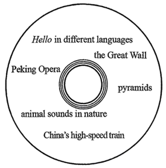

**2025年普通高等学校招生全国统一考试（天津卷）**

**英语笔试 （第二次）**

1\. — Let me try, captain! I won’t let you down.

—OK, Paul! .

A. You got me wrong B. It is your time to shine

C. You must be kidding D. Mind your own business

【答案】B

【解析】

【详解】考查情景交际。句意：——让我试试，船长！我不会让你失望的。——好的，保罗！该你大显身手了。A. You got me wrong你误解我了；B. It is your time to shine该你大显身手了；C. You must be kidding你一定是在开玩笑；D. Mind your own business管好你自己的事。根据“OK, Paul!”可知，船长同意保罗尝试，所以此处应该是鼓励保罗，说“该你大显身手了”。故选B项。

2\. \_\_\_\_\_\_\_\_ virtual reality becomes more accessible, many schools are setting up virtual science labs.

A. As B. Until C. Unless D. Although

【答案】A

【解析】

【详解】考查状语从句。句意：随着虚拟现实技术变得越来越普及，许多学校都在设立虚拟科学实验室。根据后文“virtual reality becomes more accessible”可知，引导时间状语从句，表示“随着”用as。故选A。

3\. The Stone Age is the name given to the time over 2,000,000 years ago, life was very different from today.

A. why B. which C. when D. where

【答案】C

【解析】

【详解】考查定语从句。句意：“石器时代”指是大约200万年前的那个时期，在那个时期，人类的生活与如今大不相同。非限制性定语从句修饰先行词time，在从句作时间状语，用when。故选C。

4\. Deng Jiaxian was one of the 23 scientists who awarded for their extraordinary contributions to China’s “two bombs, one satellite” project.

A. was B. were C. has D. have

【答案】B

【解析】

【详解】考查主谓一致和动词语态。句意：邓稼先，是因对中国“两弹一星”工程做出卓越贡献而获奖的 23 位科学家之一。who引导定语从句，先行词是the 23 scientists（复数名词），关系词who代替先行词在从句中作主语，且与award为被动关系，事情发生在过去，时态用一般过去时，从句用一般过去时的被动语态，be动词用were。故选B。

5\. The children are encouraged to follow their natural , and learn about what interests them.

A. curiosity B. balance C. defence D. limitation

【答案】A

【解析】

【详解】考查名词词义辨析。句意：孩子们被鼓励去追随自己天生的好奇心，去探索他们感兴趣的事物。A. curiosity好奇心；B. balance平衡；C. defence防御；D. limitation限制。根据后文“and learn about what interests them”指鼓励孩子追随自己的好奇心。故选A。

6\. Engineers in the UK are going to build a new satellite to track solar storms.

A. designed B. designing C. to design D. having designed

【答案】A

【解析】

【详解】考查非谓语动词。句意：英国的工程师们将建造一颗新的卫星，该卫星旨在监测太阳风暴。此处design与satellite构成被动关系，故用过去分词作定语。故选A。

7\. — With my brother’s help, I finally completed my chemistry project.

— Congratulations! .

A. Loose lips sink ships B. Don’t jump in with two feet

C. Don’t be a wet blanket D. Two heads are better than one

【答案】D

【解析】

【详解】考查固定表达。句意：——在哥哥的帮助下，我终于完成了我的化学实验项目。——祝贺！三个臭皮匠顶个诸葛亮。A. Loose lips sink ships口无遮拦会酿成大祸；B. Don’t jump in with two feet不要鲁莽行事；C. Don’t be a wet blanket别扫大家的兴；D. Two heads are better than one三个臭皮匠顶个诸葛亮。根据上文“With my brother’s help,”可知，夸赞多人合作比一人单独做更有效，故选D。

8\. The Song Dynasty the introduction of *jiaozi*, which is supposedly the world’s first paper money.

A. has seen B. had seen C. sees D. saw

【答案】D

【解析】

【详解】考查动词时态。句意：宋朝见证了交子的出现，交子据说是世界上第一种纸币。see(见证)作主句谓语，结合“The Song Dynasty”可知，这一动作发生在过去，应用一般过去时。故选D项。

9\. With robots various industrial tasks, factories have increased production efficiency.

A. to perform B. to be performed C. performing D. being performed

【答案】C

【解析】

【详解】考查非谓语动词。句意：随着机器人执行各种工业任务，工厂提高了生产效率。perform(执行)在with复合结构中作宾语补足语，用非谓语形式，与其逻辑主语robots之间是主动关系，应现在分词表主动。故选C项。

10\. Knowing your weakness lies is one of the first and most challenging steps in learning to manage yourself.

A. that B. what C. how D. where

【答案】D

【解析】

【详解】考查宾语从句。句意：知道你的弱点在哪里是学习自我管理的第一步也是最具挑战性的步骤之一。“your weakness lies”是宾语从句，表示“你的弱点在哪里”，用连接副词where引导宾语从句，在从句中作地点状语。故选D项。

11\. There are no displays in the art museum and exhibitions change all the time.

A. permanent B. temporary C. elegant D. alternative

【答案】A

【解析】

【详解】考查形容词词义辨析。句意：艺术博物馆没有永久性的展览，展览总是在变化。A. permanent永久的；B. temporary临时的；C. elegant优雅的；D. alternative可供选择的。根据“exhibitions change all the time”可推知，艺术博物馆的展览不是固定不变的，即没有永久性的展览，用形容词permanent作定语，描述展览的性质。故选A项。

12\. New measures are to improve English translations in public places in China.

A. at rest B. in place C. under pressure D. beyond reach

【答案】B

【解析】

【详解】考查介词短语辨析。句意：中国已出台新措施以改善公共场所的英文翻译工作。A. at rest静止的；B. in place实施；C. under pressure受到压力；D. beyond reach无法达到。根据上文“New measures are”可知，指措施得到实施。故选B。

13\. A family day out is an opportunity to work and school and spend quality time together.

A. put aside B. pass on C. take up D. give away

【答案】A

【解析】

【详解】考查动词短语辨析。句意：全家外出游玩是一个放下工作和学校事务，共度美好时光的机会。A. put aside把……放在一边，暂不考虑；B. pass on传递；C. take up占据；D. give away赠送。结合“and spend quality time together”可知，空格处应表达“放下（工作和学校事务）”，故用put aside。故选A。

14\. No reader remove a book from the library without permission.

A. would B. might C. shall D. need

【答案】C

【解析】

【详解】考查情态动词。句意：未经图书馆管理员允许，任何读者不得将书带出图书馆。考查情态动词。A. would将会； B. might可能；C. shall将要，将会；D. need需要。shall用于第二、三人称表示命令、威胁、许诺、警告、规定等。故选C。

15\. There are many things teens should when deciding what colleges to apply to.

A. set in motion B. get under control

C. bring to an end D. take into consideration

【答案】D

【解析】

【详解】考查动词短语辨析。句意：青少年在决定申请哪所大学时，有很多事情需要考虑。A. set in motion使开始；B. get under control控制住；C. bring to an end结束；D. take into consideration考虑。根据“when deciding what colleges to apply to”可知，在决定申请大学时，需要考虑很多事情，用动词短语take into consideration表示“考虑”，符合语境。故选D项。

Life is a road full of minor inconveniences and major setbacks, which everyone faces, <u>\_\_\_\_16\_\_\_\_</u> wealth or social rank. That is why optimism, the ability to see the <u>\_\_\_\_17\_\_\_\_</u> side of every negative situation, is key to success.

What made optimism so meaningful to me was when I <u>\_\_\_\_18\_\_\_\_</u> the A team of the basketball club for the upcoming season. I had always been the starting point guard, and my <u>\_\_\_\_19\_\_\_\_</u> on the A team was something I took for granted. However, I only made the B team, <u>\_\_\_\_20\_\_\_\_</u> I worked my hardest. I didn’t understand why until I saw the new A team, crowded with players that all <u>\_\_\_\_21\_\_\_\_</u> me.

I had to give the B team a chance. But to my <u>\_\_\_\_22\_\_\_\_</u>, the play level was much lower than what I was used to. I lost the drive I’d had before and gradually became <u>\_\_\_\_23\_\_\_\_</u>.

One day I came across a social media post of another basketball team, whose point guard was much more <u>\_\_\_\_24\_\_\_\_</u> than her teammates. When her teammates made multiple mistakes <u>\_\_\_\_\_25\_\_\_\_\_</u>, which cost them several points, I expected her to be upset, but <u>\_\_\_\_\_26\_\_\_\_\_</u>, she patted her teammates on the back and comforted them. As I watched her more, I noticed that she led her team, always <u>\_\_\_\_\_27\_\_\_\_\_</u> and uplifting her teammates.

The realization hit me like lightning. What I thought was a <u>\_\_\_\_\_28\_\_\_\_\_</u> turned out to be a valuable opportunity, presenting a rare chance to develop <u>\_\_\_\_\_29\_\_\_\_\_</u>. So, I started using my <u>\_\_\_\_\_30\_\_\_\_\_</u> to be a leader for my team. When our coach needed a(n) <u>\_\_\_\_\_31\_\_\_\_\_</u>, I was the first to raise my hand. When my teammates needed help with a skill, I <u>\_\_\_\_\_32\_\_\_\_\_</u> taught them over and over again. My effort paid off as I <u>\_\_\_\_\_33\_\_\_\_\_</u> remarkably not just as a player, but as a person — something I could have never achieved on the A team.

When facing challenges in life, some people <u>\_\_\_\_\_34\_\_\_\_\_</u> them with optimism, while others tend to complain. Optimism is a palette, with which you can paint your own light in the darkness, shelter in a storm, and most importantly, a better <u>\_\_\_\_\_35\_\_\_\_\_</u> of yourself!

16\. A. regardless of B. due to C. but for D. apart from

17\. A. commercial B. positive C. crucial D. practical

18\. A. looked back on B. gave in to C. put up with D. tried out for

19\. A. position B. focus C. comment D. impression

20\. A. as if B. in case C. now that D. even though

21\. A. ran into B. agreed with C. towered over D. saw through

22\. A. relief B. confusion C. amazement D. disappointment

23\. A. unmotivated B. disqualified C. determined D. engaged

24\. A. amused B. advanced C. emotional D. familiar

25\. A. to a degree B. as a rule C. in a row D. at a distance

26\. A. instead B. meanwhile C. otherwise D. furthermore

27\. A. evaluating B. interrupting C. encouraging D. interviewing

28\. A. trick B. misfortune C. mistake D. conflict

29\. A. reputation B. innovation C. leadership D. friendship

30\. A. privacy B. experience C. schedule D. occupation

31\. A. example B. announcement C. competitor D. donation

32\. A. nervously B. patiently C. gratefully D. hesitantly

33\. A. protested B. resigned C. developed D. emerged

34\. A. create B. approach C. influence D. perform

35\. A. appearance B. shape C. identity D. version

【答案】16. A 17. B 18. D 19. A 20. D 21. C 22. D 23. A 24. B 25. C 26. A 27. C 28. B 29. C 30. B 31. A 32. B 33. C 34. B 35. D

【解析】

【导语】这是一篇记叙文。作者未入选篮球A队后失落，受另一球队控卫乐观鼓励队友的启发，在B队主动担当领导，最终实现个人成长，强调乐观对克服困境的重要性。

【16题详解】

考查介词短语辨析。句意：生活是一条布满小麻烦和大挫折的漫长道路，每个人都会经历这样的过程，无论其财富多少或社会地位如何。A. regardless of不管，无论；B. due to因为；C. but for要不是；D. apart from除了……之外。根据后文“wealth or social rank”以及上文“which everyone faces”可知，每个人都会经历生活中的挫折，无论其财富多少或社会地位如何。故选A。

【17题详解】

考查形容词词义辨析。句意：这就是为什么乐观精神——即在每一种不利情况下都能看到积极面的能力——是取得成功的关键所在。A. commercial商业的；B. positive积极的；C. crucial重要的；D. practical实际的。根据上文“That is why optimism”可知，乐观精神指的是看到积极面的能力。故选B。

【18题详解】

考查动词短语辨析。句意：让我觉得乐观精神如此重要的原因在于，当我参加即将开始的赛季中篮球队的A队选拔时。A. looked back on回顾；B. gave in to屈服于；C. put up with忍受；D. tried out for角逐，参加……的选拔。根据后文“the A team of the basketball club for the upcoming season”可知，作者要参加篮球队的选拔。故选D。

【19题详解】

考查名词词义辨析。句意：我一直担任首发控球后卫，所以我在A队的位置对我来说是理所当然的。A. position位置；B. focus集中；C. comment评论；D. impression印象。根据上文“I had always been the starting point guard”可知，此处指作者在球队中的位置。故选A。

【20题详解】

考查连词词义辨析。句意：然而，我只入选了B队——尽管我全力以赴了。A. as if好像；B. in case万一；C. now that既然；D. even though即使。根据上文“I only made the B team”以及后文“I worked my hardest”可知为转折关系，even though引导让步状语从句。故选D。

【21题详解】

考查动词短语辨析。句意：直到我看到新的A队阵容时，我才明白其中的原因，那队里全是身材比我高大的球员。A. ran into遇到；B. agreed with同意；C. towered over高耸在上方，在身高或能力上超越；D. saw through看透。根据上文“I only made the B team”以及“I saw the new A team, crowded with players that all”可知，作者只入选了B队，说明A队队员能力比作者出众。故选C。

【22题详解】

考查名词词义辨析。句意：但令我感到失望的是，这队的水平远低于我以往的预期。A. relief安慰；B. confusion困惑；C. amazement惊讶；D. disappointment失望。根据后文“the play level was much lower than what I was used to”可知，B队水平低于预期，作者感到失望。故选D。

【23题详解】

考查形容词词义辨析。句意：我失去了之前拥有的动力，渐渐地变得毫无干劲了。A. unmotivated不感兴趣的；B. disqualified不合格的；C. determined坚定的；D. engaged参与的。根据上文“I lost the drive I’d had before and gradually became”以及“the play level was much lower than what I was used to”可知，作者因为失望，失去了动力，渐渐地变得毫无干劲了。故选A。

【24题详解】

考查形容词词义辨析。句意：有一天，我在社交媒体上看到了一则关于另一支篮球队的帖子，该队的控球后卫比队友们的技术要高超得多。A. amused被逗乐的；B. advanced高超的，高级的；C. emotional情感的；D. familiar熟悉的。根据后文“I noticed that she led her team”可知，可以带领队伍说明技术高超。故选B。

【25题详解】

考查介词短语辨析。句意：当她的队友们接连犯下多处错误，导致他们失去了不少分数时，我原本以为她会感到沮丧，但出乎意料的是，她却轻拍着队友们的肩膀，安慰着他们。A. to a degree在某种程度上；B. as a rule通常；C. in a row连续；D. at a distance远离。根据后文“which cost them several points”可知，失去不少分数说明连续出现错误，故选C。

【26题详解】

考查副词词义辨析。句意：当她的队友们接连犯下多处错误，导致他们失去了不少分数时，我原本以为她会感到沮丧，但出乎意料的是，她却轻拍着队友们的肩膀，安慰着他们。A. instead反而；B. meanwhile同时；C. otherwise否则；D. furthermore此外。根据上文“I expected her to be upset”以及后文“she patted her teammates on the back and comforted them.”可知，作者本以为她会感到沮丧，但出乎意料的是，她却轻拍着队友们的肩膀，安慰着他们。instead表示“反而”符合语境。故选A。

【27题详解】

考查动词词义辨析。句意：当我更仔细地观察她时，我发现她总是带领着她的团队，总是充满鼓励地激励着队友们。A. evaluating评估；B. interrupting打断；C. encouraging鼓励；D. interviewing采访。根据后文“and uplifting her teammates”可知，她总是鼓励和激励队友们。故选C。

【28题详解】

考查名词词义辨析。句意：我原本以为是件倒霉事，结果却成了一个宝贵的机会，为我提供了难得的提升领导能力的机遇。A. trick诡计；B. misfortune倒霉事，不幸；C. mistake错误；D. conflict冲突。根据上文“However, I only made the B team”以及“the play level was much lower than what I was used to”可知，作者一开始认为进入了B队是件倒霉事，故选B。

【29题详解】

考查名词词义辨析。句意：我原本以为是件倒霉事，结果却成了一个宝贵的机会，为我提供了难得的提升领导能力的机遇。A. reputation名誉；B. innovation创新；C. leadership领导；D. friendship友谊。根据后文“to be a leader for my team”可知，这次机会让作者提升领导能力。故选C。

【30题详解】

考查名词词义辨析。句意：所以，我开始利用自己的经验来担任团队的领导者。A. privacy隐私；B. experience经验；C. schedule日程表；D. occupation职业。根据上文“I had always been the starting point guard”可知，作者开始利用自己的经验担任领导者。故选B。

【31题详解】

考查名词词义辨析。句意：当我们的教练需要一个榜样时，我第一个举起了手。A. example榜样，例子；B. announcement公告；C. competitor竞争者；D. donation捐赠。根据后文“I was the first to raise my hand”以及上文“to be a leader for my team”可知，作者开始积极投入队伍建设，所以教练需要榜样的时候，自己第一个举手。故选A。

【32题详解】

考查副词词义辨析。句意：当我的队友们在某项技能上需要帮助时，我便耐心地一遍又一遍地指导他们。A. nervously紧张地；B. patiently耐心地；C. gratefully感谢地；D. hesitantly犹豫地。根据后文“over and over again”可知，作者耐心指导队友。故选B。

【33题详解】

考查动词词义辨析。句意：我的努力得到了回报，无论是作为球员还是个人，我都取得了显著的成长 —— 而这是我在A队永远无法实现的。A. protested抗议；B. resigned辞职；C. developed发展；D. emerged出现。根据上文“My effort paid off as I”可知，指作者的努力取得回报，作为球员取得了显著的进步，得到了发展，故选C。

【34题详解】

考查动词词义辨析。句意：在面对生活中的挑战时，有些人会以乐观的态度去应对，而另一些人则倾向于抱怨。A. create创造；B. approach应对，靠近；C. influence影响；D. perform表现。根据上文“When facing challenges in life”以及后文them指的是challenges，即以乐观的态度去应对挑战，故选B。

【35题详解】

考查名词词义辨析。句意：乐观就像一盏调色盘，借助它，你可以在黑暗中描绘出属于自己的光芒，在风暴中找到庇护，而最重要的是，能塑造出一个更好的自己！A. appearance外表；B. shape形状；C. identity身份；D. version版本。根据上文“My effort paid off as”以及“something I could have never achieved on the A team”可知，作者因为乐观，在B队也取得了进步，即，乐观让作者成为了更好的自己，a better version of yourself此处表示“更出色的自己”。故选D。

**A**

Welcome to our university’s Botanic Garden — plan your visit, and find out about what we do!

You can either pay at the Ticket Office on arrival, or book your tickets online. Please note: Tickets cannot be used on any date other than the one they were booked for and are non- refundable (不可退款的).

**Guidelines for Visitors**

The Garden is an active research facility and a living museum with a collection of over 8,000 plants.

Please bear in mind some simple rules for your visit:

Only trained working dogs are permitted to enter the Garden.

Children must stay with a grown-up at all times.

Stick strictly to the paths and lawns (草坪).

Do not climb the trees.

Please do not pick any part of a growing plant.

Cycling and ball games are not permitted in the Garden.

**Guided Tours in the Garden**

With over 8,000 plant species and a wonderful range of gardens and plantings to enjoy, there is something for everyone at the Garden, and many different aspects to appeal to a wide variety of interest groups.

◆ Free Drop-in Weekend Tours

Enjoy a free-of-charge Garden tour with one of our expert guides, taking in the seasonal highlights of the Garden.

Our weekend tours are available every Sunday at 11:30 a. m. and 2p. m. throughout the year. During the months of January and February these tours focus on the Winter Garden, Snowdrops and general winter interest.

The free tours last one hour and start from the Fountain, near the MainLawn.

**Group Tours**

Our experienced volunteer guides will help you enjoy the highlights and provide some of the background history and development of this amazing garden.

These 90-minute, pre-bookable tours are ideal for adult groups wishing to make the most of their visit to our 40-acre site. Please visit the Group Guided Tours page for more details.

36\. What should a potential visitor take note of before booking a ticket to the Garden?

A. Whether one can afford the visit.

B. Whether the Garden website is accessible.

C. Whether one can accept the ticket-booking policy.

D. Whether the tickets are still available at the Ticket Office.

37\. A kid is allowed to visit the Garden when they are .

A. well trained B. with a bicycle

C. accompanied by an adult D. guided by their working dog

38\. What behaviour is acceptable in the Garden?

A. Picking a flower. B. Climbing a tree.

C. Playing a ball game. D. Walking on the lawns.

39\. Where do the free drop-in weekend tours start?

A. Snowdrops. B. The Fountain.

C. The Main Lawn. D. The Winter Garden.

40\. What special service can visitors enjoy on the group tour?

A. The company of professional guides.

B. The explanation of how the Garden works.

C. The extended visit in and around the Garden.

D. The introduction to the birth and growth of the Garden.

【答案】36. C 37. C 38. D 39. B 40. D

【解析】

【导语】这是一篇应用文。文章介绍大学植物园的购票规则、游客需遵守的规定，还提及免费周末导览和需预约的团体导览，助力游客规划参观。

【36题详解】

细节理解题。根据第二段“Tickets cannot be used on any date other than the one they were booked for and are non- refundable (不可退款的).(这些票只能在预订的日期使用，其他日期不可使用，而且一经售出不予退款)”可知，在预订前往花园的门票之前，潜在游客应该注意是否能接受该门票预订政策。故选C。

【37题详解】

细节理解题。根据Guidelines for Visitors部分“Children must stay with a grown-up at all times.(孩子们任何时候都必须由成年人陪同)”可知，孩子由成人陪同下可以进入花园。故选C。

【38题详解】

细节理解题。根据Guidelines for Visitors部分“Stick strictly to the paths and lawns (草坪).(一定要沿着人行道和草坪行走)”可知，在草坪上行走是被允许的。故选D。

【39题详解】

细节理解题。根据◆ Free Drop-in Weekend Tours部分“The free tours last one hour and start from the Fountain, near the MainLawn.(免费导览活动时长一小时，从靠近主草坪的喷泉处开始)”可知，免费的周末旅游从喷泉处开始。故选B。

【40题详解】

细节理解题。根据倒数第二段“Our experienced volunteer guides will help you enjoy the highlights and provide some of the background history and development of this amazing garden.(我们经验丰富的志愿者导游会帮助您领略这座花园的精华之处，并为您介绍一些有关这座神奇花园的历史背景和发展历程)”可知，团体游中游客可以享受到介绍花园的诞生与成长。故选D。

**B**

My great grandmother received the dollhouse (玩具小屋) from a family friend back in the late 1800s. It was then passed down from generation to generation. I was seven when I discovered it underneath the tree on Christmas morning.

In our house, Mom set up a sewing area. I sat at her sewing machine, my feet barely reaching the presser foot. Mom bent over me, her hands on mine, gently guiding small bits of cloth under the needle to create dollhouse bedding. She also taught me to make mini-blankets. With a little paint and glue, Mom demonstrated that anything could be turned into dollhouse furniture. I learnt to view the world as a place of possibility. I spent hours of my girlhood sitting before my dollhouse, telling made-up stories, and creating miniatures (缩微模型). But eventually school activities took over, and the dollhouse was moved to the attic (阁楼).

Over the next 40 years, the storytelling skills I’d practiced with the dollhouse grew into novel writing skills, and I developed a career as an author. One day, after hours of working on my fourth book, I took a break by surfing the Internet and happened to notice the beautiful dollhouses people posted on social media. They reminded me of mine. I went to the attic, brought it back to my room and started updating it.

During the mindless hours of sewing and furnishing (布置家具), I listened to audiobooks about the history of dollhouses, learning that they were not invented for play. There’s a long, rich history of people in hardship turning to dollhouses to find comfort. They weren’t produced as toys until mass production became standard after 1945. This inspired me to create a novel where art saves the day.

The truth was I myself needed art to save the day. Mom was then slipping away from me owing to progressive memory loss. The only topic we could discuss with any genuine joy was the update of the dollhouse. She loved retelling its history — those old memories. Mom didn’t find it strange at all that her 50-year-old daughter was updating the dollhouse. She just thought it fun and beautiful. And it was. It was a world where Mom and I were at our best together.

41\. What did the author’s mother teach her to do?

A. To sew and create miniatures.

B. To add imaginary figures to the dollhouse.

C. To make up fairy tales set in the dollhouse.

D. To do oil paintings and glue them onto the little walls.

42\. Why did the author decide to update the dollhouse decades later?

A. She intended to follow the trend on social media.

B. She was eager to start a new career as a toy designer.

C. She felt the urge to compete with other dollhouse makers.

D. She was inspired by people sharing their dollhouses online.

43\. What did the author learn about dollhouses from the audiobooks?

A. They were initially created for play.

B. People once sought comfort in them.

C. Rich people sold them for money during difficult times.

D. A uniform standard for their production was set in 1945.

44\. What role did the dollhouse play in strengthening the emotional ties between the author and her aging mother?

A. A reminder of their childhood dreams. B. A mirror of the eventful family history.

C. A tool to bring back good old memories. D. A means to improve her mother’s memory.

45\. What would be the best title for the passage?

A. The Dollhouse: A Lifelong Toy B. Growing up with the Dollhouse

C. The Dollhouse: More Than Just a Toy D. Dollhouse Making and Novel Writing

【答案】41. A 42. D 43. B 44. C 45. C

【解析】

【导语】本文是一篇记叙文。文章主要讲述了作者与玩具小屋之间的故事，包括其来源、作者小时候与母亲一起制作玩具小屋内的物品、长大后因玩具小屋而走上写作道路，以及多年后因母亲记忆力衰退而重新更新玩具小屋，并在此过程中与母亲共度美好时光的经历。

【41题详解】

细节理解题。根据第二段中“Mom bent over me, her hands on mine, gently guiding small bits of cloth under the needle to create dollhouse bedding. She also taught me to make mini-blankets. With a little paint and glue, Mom demonstrated that anything could be turned into dollhouse furniture. (妈妈俯身在我身上，双手放在我的手上，轻轻地把小块布料引到针下，做成玩具小屋的床上用品。她还教我制作迷你毯子。妈妈用一点颜料和胶水向我展示，任何东西都可以变成玩具小屋的家具。)”可知，作者的妈妈教她缝纫和制作微型物品。故选A项。

42题详解】

细节理解题。根据第三段中“One day, after hours of working on my fourth book, I took a break by surfing the Internet and happened to notice the beautiful dollhouses people posted on social media. They reminded me of mine. I went to the attic, brought it back to my room and started updating it. (一天，在写了四个小时的第四本书后，我上网休息了一下，碰巧注意到人们在社交媒体上发布的漂亮的玩具小屋。它们让我想起了我的玩具小屋。我去了阁楼，把它带回我的房间，开始更新它。)”可知，作者决定更新玩具小屋是因为她在网上看到人们分享他们的玩具小屋，这让她想起了自己的玩具小屋。故选D项。

【43题详解】

细节理解题。根据第四段中“During the mindless hours of sewing and furnishing (布置家具), I listened to audiobooks about the history of dollhouses, learning that they were not invented for play. There’s a long, rich history of people in hardship turning to dollhouses to find comfort. (在无意识地缝纫和布置家具的几个小时里，我听了一些关于玩具小屋历史的有声书，了解到它们并不是为了玩而发明的。人们在困境中求助于玩具小屋以寻求安慰，有着悠久而丰富的历史。)”可知，作者从有声书中了解到人们曾经在玩具小屋中寻求安慰。故选B项。

【44题详解】

推理判断题。根据最后一段中“The truth was I myself needed art to save the day. Mom was then slipping away from me owing to progressive memory loss. The only topic we could discuss with any genuine joy was the update of the dollhouse. She loved retelling its history — those old memories. (事实是我自己也需要艺术来拯救这一天。当时，由于记忆力逐渐衰退，妈妈正从我身边溜走。我们唯一能真正愉快地讨论的话题就是玩具小屋的更新。她喜欢重述它的历史——那些古老的记忆。)”可知，玩具小屋是作者和母亲一起回忆美好旧时光的工具，在母亲记忆力衰退的情况下，它成为了加强她们之间情感联系的纽带。故选C项。

【45题详解】

主旨大意题。通读全文，根据最后一段中“The truth was I myself needed art to save the day. Mom was then slipping away from me owing to progressive memory loss. The only topic we could discuss with any genuine joy was the update of the dollhouse. She loved retelling its history — those old memories. (事实是我自己也需要艺术来拯救这一天。当时，由于记忆力逐渐衰退，妈妈正从我身边溜走。我们唯一能真正愉快地讨论的话题就是玩具小屋的更新。她喜欢重述它的历史——那些古老的记忆。)”可知，文章主要讲述了作者与玩具小屋之间的故事，玩具小屋不仅仅是玩具，它承载了作者和母亲的美好回忆和情感，C项“The Dollhouse: More Than Just a Toy (玩具小屋：不仅仅是一个玩具)”概括文章主旨，适合作为标题。故选C项。

**C**

All animals take in oxygen from the air they breathe in, and release CO₂ from their blood when breathing out. Most mammals (哺乳动物) can’t directly detect oxygen levels in the blood supplied to their tissues. Instead, they rely on the rising level of CO₂ in their blood to signal that they might need to take a breath. But a recent study published in Science suggests seals (海豹) can sense the amount of oxygen in the blood, and change their diving behavior in response.

To find out if oxygen levels affected seal behavior, Professor McKnight at the University of St. Andrews and his colleagues created a special section in a pool where young seals were held. In one corner, there was a breathing chamber (呼吸室), where they were sheltered from the rain and the wind.

The breathing chamber was surrounded by panels that prevented surface swimming, yet swimming below the surface for about 200 feet would give the seals access to a feeder where they could eat as much fish as they liked. Once the seals got familiar with the setup, the researchers started to gradually change the composition of the air in the breathing chamber, increasing or reducing the levels of oxygen and CO₂ to see an effect on their behavior. Sure enough: the higher the level of oxygen, the longer the seals stayed at the feeder.

The finding suggests that seals don’t just physically respond to oxygen levels by changing their heart rate or breathing, but that they are sufficiently aware of them to change their behavior. This ability would put seals in a class beyond any land mammals that have been tested. Since oxygen levels on land remain stable, humans don’t seem to have evolved (演化) to notice low blood oxygen levels, sometimes not even when they’re about to pass out in free-diving.

Therefore in free-diving without oxygen tanks, accidents are quite common. Our reliance on sensing CO₂ levels in our blood instead of oxygen may be to blame. Actually, this is a perfectly reasonable strategy on land, where growing CO₂ tends to signal breathing issues. But when holding our breath during diving, relying on CO₂ levels is risky, especially on repeated dives. Because every time we surface and breathe in, our sensitivity to CO₂ is decreased, even if its levels are already high, and this increases the chance that a person will, without awareness, pass out before they get to the surface.

46\. What do most mammals rely on to determine when to take a breath?

A. The growing amount of CO₂ in their blood.

B. The rising level of oxygen in their lungs.

C. The intensity of their physical activity.

D. The blood supply to body tissues.

47\. When would the seals stay at the feeder for a longer period of time?

A. When they needed to take in more food at the feeder.

B. When the oxygen level in the chamber grew higher.

C. When they familiarized themselves with the setup.

D. When the CO₂ level in the chamber was raised.

48\. What results in humans’ inability to notice low oxygen levels in their blood?

A. The unstable CO₂ levels in the air.

B. Their lack of attention to breathing.

C. The constant oxygen levels on land.

D. Their functionally changeable heart rate.

49\. Why do accidents often occur when divers go free-diving?

A. Their breath cannot be held long enough.

B. They cannot adjust the consumption of oxygen.

C. They may fail to notice rising CO₂ levels soon enough.

D. Their breathing organs stop working properly underwater.

50\. Which statement is probably supported by McKnight’s seal research?

A. Seals have evolved to survive in low oxygen environments.

B. Seals are quick to sense oxygen levels and act accordingly.

C. Seals can maintain their heart rate even with low blood oxygen levels.

D. Seals are more sensitive to changes in the environment than other mammals.

【答案】46. A 47. B 48. C 49. C 50. B

【解析】

【导语】本文是一篇说明文。文章主要讲述了海豹能感知血液中氧气量并据此改变潜水行为，人类则因陆地氧气稳定未演化出此能力。

【46题详解】

细节理解题。根据第一段中“Most mammals (哺乳动物) can’t directly detect oxygen levels in the blood supplied to their tissues. Instead, they rely on the rising level of CO₂ in their blood to signal that they might need to take a breath.(大多数哺乳动物不能直接检测供应给组织的血液中的氧气水平。相反，它们依靠血液中二氧化碳水平的上升来发出可能需要呼吸的信号)”可知，大多数哺乳动物依靠血液中二氧化碳含量的上升来判断何时呼吸。故选A。

【47题详解】

细节理解题。根据第三段中“Once the seals got familiar with the setup, the researchers started to gradually change the composition of the air in the breathing chamber, increasing or reducing the levels of oxygen and CO₂ to see an effect on their behavior. Sure enough: the higher the level of oxygen, the longer the seals stayed at the feeder.(一旦海豹熟悉了这种设置，研究人员开始逐渐改变呼吸室中空气的成分，增加或减少氧气和二氧化碳的水平，以观察对其行为的影响。果然如此：氧气水平越高，海豹在喂食器停留的时间就越长)”可知，当呼吸室中的氧气水平升高时，海豹会在喂食器停留更长时间。故选B。

【48题详解】

细节理解题。根据第四段中“Since oxygen levels on land remain stable, humans don’t seem to have evolved (演化) to notice low blood oxygen levels, sometimes not even when they’ re about to pass out in free-diving.(由于陆地上的氧气水平保持稳定，人类似乎没有进化出注意到血液中低氧水平的能力，有时甚至在自由潜水即将昏倒时也没有)”可知，人类无法察觉血液中低氧水平是因为陆地上氧气水平稳定。故选C。

【49题详解】

细节理解题。根据最后一段中“Because every time we surface and breathe in, our sensitivity to CO₂ is decreased, even if its levels are already high, and this increases the chance that a person will, without awareness, pass out before they get to the surface.(因为每次我们浮出水面吸气时，我们对二氧化碳的敏感性都会降低，即使其水平已经很高，这也会增加一个人在浮出水面之前无意识地昏倒的可能性)”可知，潜水员在自由潜水时经常发生事故是因为他们可能没有及时注意到二氧化碳水平的上升。故选C。

【50题详解】

推理判断题。根据第一段中“But a recent study published in Science suggests seals (海豹) can sense the amount of oxygen in the blood,and change their diving behavior in response.(但最近发表在《科学》杂志上的一项研究表明，海豹可以感知血液中的氧气量，并相应地改变它们的潜水行为)”和第四段中“The finding suggests that seals don’t just physically respond to oxygen levels by changing their heart rate or breathing, but that they are sufficiently aware of them to change their behavior.(这一发现表明，海豹不仅仅是通过改变心率或呼吸来对氧气水平做出身体反应，而是它们对氧气水平有足够的意识来改变它们的行为)”可知，McKnight的海豹研究表明，海豹能迅速感知氧气水平并据此采取行动。故选B。

**D**

Science serves as a powerful tool for unlocking the mysteries of the universe, but understanding its limitations is essential for its effective application. There are occasions where I have used the handle of a knife as a hammer (锤子), but the result would have been better if I’d had a more suitable tool at hand. As far as science goes, it is really good at testing things that are testable, but not so for those that are not.

We can do, and have done, an impressive amount with our brains. But there are limits. Sometimes these limits go away if we keep at it for long enough — we just need better facilities and experiments to get the answer. Breaking new ground in modern science this way can be costly. Next-generation supercomputers or incredibly large telescopes are expensive, yet these may be required to find answers to some of the unsolved mysteries of the universe.

Sometimes the limits we encounter in trying to unlock the nature of the universe are cognitive (认知的). Think about this: human DNA is only about 1.2 percent different from that of chimps (黑猩猩). Chimps are smart, no question. But could you teach them advanced mathematics? What if our DNA were another 1.2 percent further evolved than it is? What might our brains be capable of then? The level of abstract thinking might be unimaginable.

Sometimes the limits we hit are fundamental. There are laws of nature we may never be able to understand, however advanced our brains might become. There are experiments we might never be able to perform. We may never be able to test what caused the universe to be created, and what caused the cause of the universe being created. This is where science may never break through.

For something to be considered scientific, it must, by definition, be testable. There is a problem here: it may not need to be testable right now, but it must be testable at some point in the future by experiment. If an idea is untestable, that doesn’t mean it is wrong. It means it is untestable for now. These untestable ideas also happen to be some of the most interesting ones, probably because they’ve puzzled humanity for centuries.

51\. Why does the author mention “knife” and “hammer” in Paragraph 1?

A. To demonstrate how tools can be used creatively.

B. To highlight consequences of using a wrong tool.

C. To show the necessity of keeping a handy tool within reach.

D. To stress the need for the right tool to achieve desired results.

52\. What is often required in breaking new ground in science?

A. Broader science education. B. More advanced facilities for experiments.

C. Deeper understanding of the brain power. D. More investment in next-generation scientists.

53\. How does the author assess human beings in terms of their cognitive capacity?

A. They are just 2.4% away from true abstract thinking.

B. They are slightly smarter than other intelligent beings.

C. They are yet to evolve further to learn more about the universe.

D. They are good at solving problems with advanced mathematics.

54\. What message does Paragraph 4 convey?

A. Some puzzles about the universe are way beyond scientific exploration.

B. Experimental research lays solid foundations for space technology.

C. Boundaries of science can be pushed back with determined efforts.

D. Limitations of science may result from insufficient testing.

55\. What has the author added to the definition of a scientific idea?

A. Correct ideas are testable. B. Untestable ideas can be true.

C. Some scientific ideas may never be testable. D. An idea must be testable to be seen as correct.

【答案】51. D 52. B 53. C 54. A 55. B

【解析】

【导语】这是一篇说明文。文章指出科学是探索宇宙的有力工具，但存在局限，包括需先进设备、人类认知待进化、有根本性难题难突破，还补充不可测试的想法未必错误。

【51题详解】

推理判断题。根据第一段“Science serves as a powerful tool for unlocking the mysteries of the universe, but understanding its limitations is essential for its effective application. There are occasions where I have used the handle of a knife as a hammer (锤子), but the result would have been better if I’d had a more suitable tool at hand. As far as science goes, it is really good at testing things that are testable, but not so for those that are not. (科学是解开宇宙奥秘的有力工具，但了解其局限性对于其有效应用至关重要。有时我会把刀柄当作锤子来使用，但要是手边有更合适的工具就好了。就科学而言，它在能进行测试的事物上表现得非常出色，但对于那些无法测试的事物则不然。)”可知，作者在第一段中提及“刀”和“锤子”是为了强调使用合适的工具以达到预期效果的重要性。故选D。

【52题详解】

细节理解题。根据第二段“We can do, and have done, an impressive amount with our brains. But there are limits. Sometimes these limits go away if we keep at it for long enough — we just need better facilities and experiments to get the answer. Breaking new ground in modern science this way can be costly. Next-generation supercomputers or incredibly large telescopes are expensive, yet these may be required to find answers to some of the unsolved mysteries of the universe. (我们的大脑能够完成并且已经完成了大量的工作。但也有其局限性。有时，如果我们持续努力足够长的时间，这些局限性就会消失——我们只是需要更先进的设备和实验来得出答案。以这种方式在现代科学领域开辟新领域可能会耗费大量资源。下一代超级计算机或极其巨大的望远镜价格不菲，但这些可能是解决宇宙中一些未解之谜所必需的。)”可知，在科学领域开拓新领域时，通常需要更先进的实验设备。故选B。

【53题详解】

细节理解题。根据第三段“What if our DNA were another 1.2 percent further evolved than it is? What might our brains be capable of then? The level of abstract thinking might be unimaginable. (倘若我们的DNA进化程度再提高1.2%呢？那我们的大脑又会具备怎样的能力呢？抽象思维的水平或许会令人难以想象。)”可知，作者认为人类的认知能力尚未进一步进化以更好地了解宇宙。故选C。

【54题详解】

主旨大意题。根据第四段“Sometimes the limits we hit are fundamental. There are laws of nature we may never be able to understand, however advanced our brains might become. There are experiments we might never be able to perform. We may never be able to test what caused the universe to be created, and what caused the cause of the universe being created. This is where science may never break through. (有时我们所遭遇的限制是根本性的。存在着一些自然法则，即便我们的大脑变得再先进，我们也可能永远无法理解。还有一些实验我们可能永远无法进行。我们或许永远无法验证是什么导致了宇宙的诞生，以及是什么导致了宇宙诞生的原因。这就是科学可能永远无法取得突破的地方。)”可知，第4段传达了有些关于宇宙的谜题远远超出了科学探索的范畴。故选A。

【55题详解】

细节理解题。根据第五段“If an idea is untestable, that doesn’t mean it is wrong. It means it is untestable for now. These untestable ideas also happen to be some of the most interesting ones, probably because they’ve puzzled humanity for centuries. (如果一个想法无法进行验证，这并不意味着它就是错误的。这意味着目前它还无法被验证。而这些无法验证的想法恰恰往往是最具趣味性的，可能是因为它们已经困扰人类数百年之久。)”可知，作者认为不可测试的想法也可能是正确的。故选B。

**阅读表达**

In the morning, I write this to-do list:

1\. Go to the bank.

2\. Get a nice haircut.

3\. Pick up my academic statement from college.

4\. Submit my poems.

I think, “That’s enough for one day.”

Up until a few years ago, I didn’t aim to be anywhere. And in order to be nowhere, one does not need a to-do list as a guide. Focusing only on the most pressing matter in front of me was enough. Let the next urgent moment think for me.

My mother had tried to teach me about planning my day ever since I was 10. But I never practiced it until I was 25 and done with college. That’s when I <u>awoke to</u> the fact that I didn’t want to waste any more time. I live in Nigeria, where life and success can be difficult. There seem to be many roads to failure here.

I grew up seeing my mother firmly in charge of her day. She knew — and still knows — where she needed to be at every moment, in every detail. She may not be good at singing, acting, or sports. But she is excellent at planning. Every day she writes a list. I never understood why she had to write down a list that consists of items you can easily hold in your mind. “Your to-do list is like your second mind,” she told my younger self. “If you ever feel lost or overwhelmed, you consult your second mind.”

I didn’t understand what she meant by “a second mind” until I seemed to lose my first mind in my everyday life. Sometimes, it seems as though it’s the rainy season in my mind, flooded with confused and distracting thoughts that lead nowhere. I need a second mind — now!

As I sit in the barbershop awaiting my nice haircut, a friend asks me, “What’s next?”

“Pick up my academic statement from college” I say. “Then submit my poems.”

“You’ve got it figured out like a granny,” he jokes.

“No,” I say, “like my mother.”

56\. Why did the author believe he didn’t need a to-do list before he turned 25?(no more than 10 words)

\_\_\_\_\_\_\_\_\_\_\_\_\_\_\_\_\_\_\_\_\_\_\_\_\_\_\_\_\_\_\_\_\_\_\_\_\_\_\_\_\_\_\_\_\_\_\_\_\_\_\_\_\_\_\_\_\_\_\_\_\_\_\_\_\_\_\_\_\_\_\_\_\_\_\_\_\_

57\. What does the underlined phrase mean?(no more than 3 words)

\_\_\_\_\_\_\_\_\_\_\_\_\_\_\_\_\_\_\_\_\_\_\_\_\_\_\_\_\_\_\_\_\_\_\_\_\_\_\_\_\_\_\_\_\_\_\_\_\_\_\_\_\_\_\_\_\_\_\_\_\_\_\_\_\_\_\_\_\_\_\_\_\_\_\_\_\_

58\. What kind of person is the author’s mother?(no more than 10words)

\_\_\_\_\_\_\_\_\_\_\_\_\_\_\_\_\_\_\_\_\_\_\_\_\_\_\_\_\_\_\_\_\_\_\_\_\_\_\_\_\_\_\_\_\_\_\_\_\_\_\_\_\_\_\_\_\_\_\_\_\_\_\_\_\_\_\_\_\_\_\_\_\_\_\_\_\_

59\. When did the author turn to “a second mind” for help?(no more than 10 words)

\_\_\_\_\_\_\_\_\_\_\_\_\_\_\_\_\_\_\_\_\_\_\_\_\_\_\_\_\_\_\_\_\_\_\_\_\_\_\_\_\_\_\_\_\_\_\_\_\_\_\_\_\_\_\_\_\_\_\_\_\_\_\_\_\_\_\_\_\_\_\_\_\_\_\_\_\_

60\. How have you benefited from some advice given by a family member? Please explain with an example.(no more than 20 words)

\_\_\_\_\_\_\_\_\_\_\_\_\_\_\_\_\_\_\_\_\_\_\_\_\_\_\_\_\_\_\_\_\_\_\_\_\_\_\_\_\_\_\_\_\_\_\_\_\_\_\_\_\_\_\_\_\_\_\_\_\_\_\_\_\_\_\_\_\_\_\_\_\_\_\_\_\_

【答案】56. He only focused on urgent matters.

57\. Realized/Became aware.

58\. She is good at planning her day.

59\. When his mind was confused.

60\. Mom told me to plan study; I improved grades.

【解析】

【导语】这是一篇说明文。作者曾不做待办清单，25岁后受尼日利亚生活压力及擅长规划的母亲影响开始列清单，借清单应对思绪混乱，明确每日安排。

【56题详解】

考查细节理解。根据第七段“Focusing only on the most pressing matter in front of me was enough. Let the next urgent moment think for me.(只专注于眼前最紧迫的事情就足够了。让接下来更为紧急的时刻替我做出决定吧)”可知，作者在25岁之前认为自己不需要待办事项清单因为他只关注那些紧急的事情。故答案为He only focused on urgent matters.

【57题详解】

考查词句猜测。根据划线词后文“the fact that I didn’t want to waste any more time(我不想再浪费任何时间了)”可知，作者意识到自己不想浪费时间，故划线词意思是“意识到”。故答案为Realized/Became aware.

【58题详解】

考查细节理解。根据倒数第六段“I grew up seeing my mother firmly in charge of her day. She knew — and still knows — where she needed to be at every moment, in every detail. She may not be good at singing, acting, or sports. But she is excellent at planning. Every day she writes a list.(我从小就看到母亲时刻掌控着自己的生活。她清楚——而且现在依然清楚——自己在每一刻、每一个细节中该做些什么。她或许不擅长唱歌、表演或运动。但她非常擅长规划。每天她都会列一个清单)”可知，作者的母亲擅长规划日常。故答案为She is good at planning her day.

【59题详解】

考查细节理解。根据倒数第五段“Sometimes, it seems as though it’s the rainy season in my mind, flooded with confused and distracting thoughts that lead nowhere. I need a second mind — now!(有时候，我的脑海里仿佛正值雨季，充斥着混乱又扰人的思绪，却毫无方向。我现在就需要一个“第二大脑”！)”可知，作者思绪混乱时求助。故答案为When his mind was confused.

【60题详解】

考查开放题。根据“您从一位家庭成员给出的建议中获得了怎样的益处？请举例说明。”可回答：妈妈让我安排好学习计划；我的成绩因此得到了提高。故答案为Mom told me to plan study; I improved grades.

61\. 假如你是晨光中学的李津，你在宇航爱好者论坛“Space Awaits”看到一则英文讨论帖：一张记录地球文明的光盘将随探测器飞向外太空，光盘拟收录具有代表性的音像资料。根据各国网友的提名，图中六项人气较高。请你根据以下提示用英文跟帖：

（1）对提名的项目进行概括性评论；

（2）从中选取或另行推介一个你认为最值得收录的项目，并说明理由。

<table style="width:85%;">
<colgroup>
<col style="width: 19%" />
<col style="width: 66%" />
</colgroup>
<tbody>
<tr>
<td colspan="2" style="text-align: left;">Space Awaits</td>
</tr>
<tr>
<td rowspan="2" style="text-align: left;"><strong>Li</strong> <strong>Jin</strong></td>
<td style="text-align: left;">Posted on June 8th, 2025 4:30 p.m.</td>
</tr>
<tr>
<td style="text-align: left;"><strong>此处不能答题</strong></td>
</tr>
</tbody>
</table>

注意：

（1）词数不少于100；

（2）可适当加入细节，使内容充实、行文连贯。

\_\_\_\_\_\_\_\_\_\_\_\_\_\_\_\_\_\_\_\_\_\_\_\_\_\_\_\_\_\_\_\_\_\_\_\_\_\_\_\_\_\_\_\_\_\_\_\_\_\_\_\_\_\_\_\_\_\_\_\_\_\_\_\_\_\_\_\_\_\_\_\_\_\_\_\_\_\_\_\_\_\_\_\_\_\_\_\_\_\_\_\_\_\_\_\_\_\_\_\_\_\_\_\_\_\_\_\_\_\_\_\_\_\_\_\_\_\_\_\_\_\_\_\_\_\_\_\_\_\_\_\_\_\_\_\_\_\_\_\_\_\_\_\_\_\_\_\_\_\_\_\_\_\_\_\_\_\_\_\_\_\_\_\_\_\_\_\_\_\_\_\_\_\_\_\_\_\_\_\_\_\_\_\_\_\_\_\_\_\_\_\_\_\_\_\_\_\_\_\_\_\_\_\_\_\_\_\_\_\_\_\_\_\_\_\_\_\_\_\_\_\_\_\_\_\_\_\_\_\_\_\_\_\_\_\_\_\_\_\_\_\_\_\_\_\_\_\_\_\_\_\_\_\_\_\_\_\_\_\_\_\_\_\_\_\_\_\_\_\_\_\_\_\_\_\_\_\_\_\_\_\_\_\_\_\_\_\_\_\_\_\_\_\_\_\_\_\_\_\_\_\_\_\_\_\_\_\_\_\_\_\_\_\_\_\_\_\_\_\_\_\_\_\_\_\_\_\_\_\_\_\_\_\_\_\_\_\_\_\_\_\_\_\_\_\_\_\_\_\_\_\_\_\_\_\_\_\_\_\_\_\_\_\_\_\_\_\_\_\_\_\_\_\_\_\_\_\_\_\_\_\_\_\_\_\_\_\_\_\_\_\_\_\_\_\_\_\_\_\_\_\_\_\_\_\_\_\_\_\_\_\_\_\_\_\_\_\_\_\_\_\_\_\_\_\_\_\_\_\_\_\_\_\_\_\_\_\_\_\_\_\_\_\_\_\_\_\_\_\_\_\_\_\_\_\_\_\_\_\_\_\_\_\_\_\_\_\_\_\_\_\_\_\_\_\_\_\_\_\_\_\_\_\_\_\_\_\_\_\_\_\_\_\_\_\_\_\_\_\_\_\_\_\_\_\_\_\_\_\_\_\_\_\_\_\_\_\_\_\_\_\_\_\_\_\_\_\_\_\_\_\_\_\_\_

【答案】范文

All the items nominated here reflect the richness of human civilization. From the impressive Great Wall to the ancient pyramids, we can see humankind’s architectural achievements. The lively animal sounds show our connection with nature, and “Hello” in different languages highlights our global diversity. Meanwhile, Peking Opera and modern high-speed trains represent cultural heritage and technological progress.

Of all these items, I believe “Hello” in different languages deserves special attention. It reminds us that despite our various cultures and histories, we share the same desire to communicate and connect with each other. If aliens ever come across the disc, a universal greeting will be a warm and friendly invitation for them to learn more about our beautiful planet and the people on it.

【解析】

【导语】本篇书面表达属于开放性作文。要求考生用英文跟帖，要求内容对提名的项目进行概括性评论以及从中选取或另行推介一个你认为最值得收录的项目，并说明理由。

【详解】1.词汇积累

成就：achievement→accomplishment

各种各样：various→a variety of

发现：come across→discover

同时：meanwhile→at the same time

2.句式拓展

句型转换

原句：Of all these items, I believe “Hello” in different languages deserves special attention.

拓展句：Of all these items, I hold the belief that “Hello” in different languages deserves special attention.

【点睛】【高分句型1】If aliens ever come across the disc, a universal greeting will be a warm and friendly invitation for them to learn more about our beautiful planet and the people on it.（运用了if引导条件状语从句）

【高分句型2】Of all these items, I believe “Hello” in different languages deserves special attention.（运用了省略that的宾语从句）
