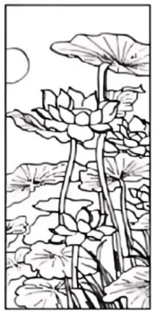

绝密★启用前

2025年普通高等学校招生全国统一考试

语文试题

本试卷共9页，共150分。考试时长150分钟。

注意事项：

1．答题前，考生务必将自己的姓名、准考证号填写在答题卡上。

2．回答选择题时，选出每小题答案后，用铅笔把答题卡上对应题目的答案标号涂黑。如需改动，用橡皮擦干净后，再选涂其他答案标号。回答非选择题时，将案写在答题卡上。写在本试卷上无效。

3．考试结束后，监考员将试卷、答题卡一并交回。

**一、阅读（72分）**

**（一）阅读Ⅰ（本题共5小题，19分）**

阅读下面的文字，完成下面小题。

**种植入门问答**

**问一：**譬如种植一株树，或者一株花，如何能使之必然生活，而且会发荣滋长？

**答：**如果这一株花或树，得来时并无重大损伤，且出土未久，未曾枯槁，依法种植，断无不能生活之理。

**问二：**如何说是依法种植？

**答：**第一须择天晴之候，泥土干燥，深耕浅种。如有多枝，勿使分枝之处埋入土内，将泥土桩实，浇足凉水，这水要使地下之土与盖上之土，和花树之根结成一体，是谓依法种植。

**问三：**依理想而论，种植花树以阴雨天为宜，为何舍此不取，反要选择天晴之日？

**答：**烈日之下，种植固非所宜，然须择晴天的早上或晚上。因为在雨天，泥土一经雨淋，容易成块，种植之后，不能与花树之根及加入之土融合凝结，以致中多空隙，根须不但不能发达，且易腐蚀。所以必求天晴之日，将干泥粉碎，加入根之四周，使无一处空隙，然后灌之以水，则花树之根能与泥土融成一片，是以种树必得趁晴天。

**问四：**……

**答：**……

**问五：**深耕浅种之说，如何解释？

**答：**所谓深耕，即是种树之穴必掘之稍深，较种下之树根越一倍；种时仍将掘出之松泥，填入穴内，中部稍稍高起，这就指浅种。继乃将树根安置妥帖，而旋转一周，使泥土与根相和洽。然后四周再加泥土，让其与穴外原有之泥土相和洽，于是稍加坚实，再浇足水，是谓深耕浅种。

**问六：**必须深耕之理由安在？

**答：**花树发达与否，全靠乎根，假使根须不能发达，花树亦不能发达。倘使种植时仅掘至应种之下而止，则根须不易发展，花树即不能繁荣，此为必须深耕之理由。

**问七：**既深耕矣，深种有何妨碍，何以必须浅种？

**答：**花与树之呼吸，在枝干与叶，如人之有口鼻，人苟闭塞口鼻，必致窒息。使花与树之枝干，深陷土内，亦必致窒息，此即不可深种之理由。

**问八：**种植花树方法，尚有其他不可不知的条件否？

**答：**尚有三端不可不明白：第一，种植花树的地位；第二，种植后的浇灌干湿；第三，施肥料的时期和浓淡。三端缺一，不能使种后之花树延长生命，而且也不能发达。

**问九：**如何是地位？

**答：**地位有两种，一种是方向，一种是高低。

**问十：**方向应当如何？古人说是向阳的好，是否如此？

**答：**这是不差的，但是也有较为喜阴的，即使喜阳的花树，长久晒在烈日之下，亦非所宜。

**问十一：**高低又怎样解释？

**答：**花树有喜干的，也有喜湿的，但即使喜湿的花树，如时常浸在水内，除浮萍水草等外，绝不能耐。所以种植花树之地，必较平地为高，使大雨之后，无积水之患。

**问十二：**请问浇灌的干湿如何？

**答：**浇灌必依天时的干湿而定：风和日暖，雨水调畅之时，不必浇灌；天晴较久，夜无露水，间日浇灌；炎夏烈日，每日浇灌，或晨夕各一次浇灌。浇灌必须在日尚未出，或日已没落时，地面热气全消，方为有益无害。不然，郁热之气，蕴蓄于根，易致腐烂。假使干湿难定，则自以较干为宜，常言道“湿不如干”，乃经验之谈也。

**问十三：**请问施用肥料之时期和浓淡，如何方称适当？

**答：**时期各有先后，然就普通而言，以立冬之后与立春之前，最为适宜。施用肥料，须在天晴之后，若在雨天肥料随流水而去，不但效用全无，且雨时根须已湿，加以肥料沾着易致腐烂。至于肥料浓淡以及肥料多少，常语曰“肥不如瘠”。如此观之，施肥不若淡而次数多为妙，湿时施干肥，干时施液肥可也。

**问十四：**“湿不如干”“肥不如瘠”，依理想而论，似乎相反，请问理由安在？

**答：**所谓湿干肥瘠，皆是过分而言。因为过干如经发觉，可以立刻浇灌而使之湿，过湿则不能立刻使之干也，肥瘠亦然。盖一则能补救，一则不能补救，此其理之一。过干过瘠之弊，花树枝叶至多暂时憔悴，一经发觉，实时浇水、上肥，尚易补救。过湿过肥，其病先在于根，根已腐烂，枝叶尚繁茂，及至根部腐烂殆尽，枝叶变化，补救已无及矣，此其理之二。

**问十五：**除以上问答外，尚有不可不知之事理否？

**答：**尚有一端为入门不可不知者，余常谓培植花树，与教育儿童无异。教育儿童的最要条件，为多注意，少干涉。假使少注意，而多干涉，不但于儿童身心无益处，反多弊害也。种植花树亦然，一花一树，既经依法种植之后，须时时留意，有无害虫滋蔓，或风吹、雨打、日炙、霜侵，有则及时补救。切不可时常移植，攀折摇动，使之不能安定，如此则自然枝叶茁发，花果丰饶。而所谓入门，亦尽于此矣。

（摘编自黄岳渊、黄德邻《花经》）

1\. 下列对原文相关内容的理解和分析，正确的一项是（ ）

A. 阴天或下雨时种植花木，浇水量、施肥量过多，炎夏烈日时每日浇灌，这些情况往往容易导致植物的根部腐烂。

B. 问三和问十四均用“依理想而论”对回答者的观点表示不解和疑问，回答者进行了解释，指出提问者原有认知的不合理之处。

C. 问八的回答“尚有三端”以及问十五的回答“尚有一端”，这些内容可作为问六“必须深耕之理由安在”这一问题的补充。

D. 问一到问三以及问五到问七讨论的是花木在种植过程中的存活问题，问八到问十五讨论的是花木移植到固定的地方后培育的注意事项。

2\. 下列对原文相关内容的分析和评价，不正确的一项是（ ）

A. “如何能使之必然生活”“施用肥料之时期”中“生活”“时期”的含义与今天最常使用的意义不相同。

B. 原文在部分回答结束时使用“是谓……”“是以…”“此为……”收尾，起到了回应提问、强调观点的作用。

C. 问六的回答体现了在分析问题和解决问题时要善于抓住重点的思想，而问十二的回答则体现了具体问题具体分析的思想。

D. “作物之施肥，犹似人之饮食，饮不可过度，食不可过饱，否则作物之生长，似极茂盛，实则易为风雨吹倒”此句可全面且形象地回答问十三。

3\. 根据原文内容，在下面文段的横线处补写出恰当的语句，每处不超过10个字。

牡丹具有喜干怕湿、忌积水的习性，因此其种植地最好选择在干燥向阳、 <u>①</u> 的地方。栽种前先挖土坑，坑的具体大小以根系放入后能充分舒展为原则。再将基肥填入坑底，覆上一层约10厘米的厚土。然后将植株置入坑内，用手扶持端正，填土一半，轻提植株并左右摇动，使 <u>②</u> 。栽植深度不可过深或过浅，过深则 <u>③</u> ，过浅又容易发生倒伏。最后将土填满，用脚踩实后再浇透水。

4\. 根据上下文，问四提出的问题可能是什么？请写出一个并阐述理由。

5\. 与本文类似，柳宗元《种树郭橐驼传》也把种树比作对待孩子，二者的养护理念有什么不同？产生这种不同的原因是什么？

【答案】1. B 2. D

3 ①地势比平地稍高

②泥土与根系相和洽

③不利于植株的呼吸 4. 示例一：

问题：种植之前如何预判天气是晴天还是雨天？

理由：问三和问五围绕问二回答的第一句话提问，因此问四应针对问三的回答设置问题。问三回答的主要内容是雨天种植的弊端以及晴天种植的方法，而在种植之前预判天气是至关重要的。

示例二：

问题：为使花树之根与泥土融合凝结，浇水量具体多少才算合适？

理由：紧承问三的回答设置问题，问三的回答中对浇水量多少才算合适解释得并不清晰，没有给出具体标准。

5\. 第一问：①柳文认为应遵循自然生长规律，让树木依照本性生长，不再管它；②本文强调依法种植之后，还应依常规进行养护。

第二问：①柳文的写作目的是借种树之道说明政令频出的危害，希望为官者不要打扰百姓的生产生活；②本文是希望读者培育的植物可以枝叶茁发、花果丰饶。

【解析】

【导语】这篇文章以问答形式系统介绍了花木种植的实用技巧，从选苗、种植时机到后期养护，内容详实专业。作者通过“深耕浅种”“湿不如干”等经验总结，强调遵循植物生长规律的重要性，并将种植之道与育人智慧巧妙类比，体现“多注意，少干涉”的养护哲学。既有科学依据又蕴含生活哲理，是一篇兼具实用性和思想性的园艺指导文章。

【1题详解】

本题考查学生对原文相关内容的理解和分析的能力。

A.“这些情况往往容易导致植物的根部腐烂”错误。原文信息是“在雨天，泥土一经雨淋，容易成块，种植之后，不能与花树之根及加入之土融合凝结，以致中多空隙，根须不但不能发达，且易腐蚀”（问三）、“施用肥料，须在天晴之后，若在雨天肥料随流水而去，不但效用全无，且雨时根须已湿，加以肥料沾着易致腐烂”（问十三），“过湿过肥，其病先在于根，根已腐烂”（问十四），“炎夏烈日，每日浇灌，或晨夕各一次浇灌。浇灌必须在日尚未出，或日已没落时，地面热气全消，方为有益无害。不然，郁热之气，蕴蓄于根，易致腐烂”（问十二），可见选项杂糅了阴雨天、“浇水量、施肥量过多”导致烂根的相关信息；而“炎夏烈日，每日浇灌”是正确的做法，只是文中对浇灌时间有要求，选项原因表述与原文不符，遗漏了具体条件。

C.“这些内容可作为问六‘必须深耕之理由安在’这一问题的补充”错误。问八的回答“尚有三端”以及问十五的回答“尚有一端”，这些内容与问六“必须深耕之理由安在”这一问题无关。问六的深耕属于深耕属于种植操作，而问八的“三端”指“第一，种植花树的地位；第二，种植后的浇灌干湿；第三，施肥料的时期和浓淡”，其中“地位”指的是“方向”“高低”，而“三端”属后期养护；问十五“种植花树亦然，一花一树，既经依法种植之后，须时时留意，有无害虫滋蔓，或风吹、雨打、日炙、霜侵，有则及时补救。切不可时常移植，攀折摇动，使之不能安定”也与问六无直接补充关系。

D.“问八到问十五讨论的是花木移植到固定的地方后培育的注意事项”错误。文中问八到问十五未提到“移植”这个前提条件，且问八至问十一有关于花树的位置，即方向和高低问题，这是种植选址问题，而非栽后养护相关内容。

故选B。

【2题详解】

本题考查学生对原文相关内容的分析和评价的能力。

D.“此句可全面且形象地回答问十三”错误。问十三具体内容有“请问施用肥料之时期和浓淡，如何方称适当”，可见问十三内容涉及多方面，而选项比喻的是饮食过度，仅说明忌浓肥，未涵盖“施用肥料之时期”和“淡肥多次”等内容，故无法全面回答。

故选D。

【3题详解】

本题考查学生更具原文相关内容进行情境补写的能力。

①结合语境“牡丹具有喜干怕湿、忌积水的习性，因此其种植地最好选择在干燥向阳、……的地方”分析，空处应该对应“忌积水”，然后根据问十一“花树有喜干的，也有喜湿的，但即使喜湿的花树，如时常浸在水内，除浮萍水草等外，绝不能耐。所以种植花树之地，必较平地为高，使大雨之后，无积水之患”可知，牡丹适宜地势较高的位置来防积水，故可填：地势比平地稍高。

②结合语境“然后将植株置入坑内，用手扶持端正，填土一半，轻提植株并左右摇动，使……”可知，空处内容要填种植效果或目的，再根据问五“继乃将树根安置妥帖，而旋转一周，使泥土与根相和洽。然后四周再加泥土，让其与穴外原有之泥土相和洽”确定目的或效果是让泥土和根系既贴合紧密，又松软舒服，故可填：泥土与根系相和洽。

③结合语境“栽植深度不可过深或过浅，过深则……”可知，空处强调“过深”的后果，再根据问七“使花与树之枝干，深陷土内，亦必致窒息”分析出过深的后果是窒息而亡，故可填：不利于植株的呼吸。

【4题详解】

本题考查学生分析原文相关内容的并进行合理推断的能力。

示例一：从整个问答的逻辑结构来看，问二提出了“依法种植”的概念并在答语中指出“第一须择天晴之候，泥土干燥，深耕浅种”，然后问三和问五分别针对“须择天晴之候”和“深耕浅种”进行具体深入地探讨，所以处在中间的问四则应对问三的具体回答来提问。由上文问三“依理想而论，种植花树以阴雨天为宜，为何舍此不取，反要选择天晴之日？”以及答语“是以种树必得趁晴天”可知其解决了为何要选择晴天种植的问题，然而仅仅知道晴天种植优于雨天种植是不够的，种植者还需要在种植之前准确预判天气状况，才能合理安排种植时间，所以问四应该进一步设问：种植之前如何预判天气是晴天还是雨天？

示例二：问三的回答重点强调了晴天种植时浇水的重要性以及浇水的作用，即让“花树之根能与泥土融成一片”。然而，对于浇水量具体多少才算合适这一关键问题，问三并没有给出明确的答案。在实际种植过程中，浇水量过多或过少都会对花树的生长产生不利影响。浇水量过多可能导致积水，使根须腐烂；浇水量过少则可能无法使泥土与根充分融合凝结。因此，为了使“依法种植”的内容更加完整、具体，问四提出“为使花树之根与泥土融合凝结，浇水量具体多少才算合适”这个问题是很有必要的。

理由：一是要结合全文问答的逻辑结构出发，理清上下文之间的问答关系，明确问四是对问三的具体深入探讨。二是要结合种植实践需求，合理提出问题。首先，在种植花树的实际操作中，天气状况是一个关键因素，如果种植者无法准确预判天气，就可能在不适合的天气条件下进行种植，从而影响花树的成活和生长。其次，种植者在实际操作中需要具体的指导，而浇水量是一个重要的操作参数，只有明确了合适的浇水量，种植者才能按照标准进行浇水，确保花树能够健康生长。

【5题详解】

本题考查学生知识迁移以及比较分析的能力。

第一问：

①由“橐驼非能使木寿且孳也，能顺木之天，以致其性焉尔。凡植木之性，其本欲舒，其培欲平，其土欲故，其筑欲密。既然已，勿动勿虑，去不复顾。其莳也若子，其置也若弃，则其天者全而其性得矣”可知柳文认为应遵循自然生长规律，让树木依照本性生长，不再管它；

②本文“尚有一端为入门不可不知者，余常谓培植花树，与教育儿童无异。教育儿童的最要条件，为多注意，少干涉。假使少注意，而多干涉，不但于儿童身心无益处，反多弊害也。种植花树亦然，一花一树，既经依法种植之后，须时时留意，有无害虫滋蔓，或风吹、雨打、日炙、霜侵，有则及时补救”强调依法种植之后，还应依常规进行养护。

第二问：

①由“我知种树而已，官理，非吾业也。然吾居乡，见长人者好烦其令，若甚怜焉，而卒以祸。旦暮吏来而呼曰：‘官命促尔耕，勖尔植，督尔获，早缫而绪，早织而缕，字而幼孩，遂而鸡豚。’鸣鼓而聚之，击木而召之。吾小人辍飧饔以劳吏者，且不得暇，又何以蕃吾生而安吾性耶？故病且怠”可知，柳文的写作目的是借种树之道说明政令频出的危害，希望为官者不要打扰百姓的生产生活；

②由“尚有一端为入门不可不知者，余常谓培植花树，与教育儿童无异。……种植花树亦然，一花一树，既经依法种植之后，须时时留意，有无害虫滋蔓，或风吹、雨打、日炙、霜侵，有则及时补救。切不可时常移植，攀折摇动，使之不能安定，如此则自然枝叶茁发，花果丰饶”可知，本文是希望读者培育的植物可以枝叶茁发、花果丰饶。

**（二）阅读Ⅱ（本题共4小题，16分）**

阅读下面文字，完成下面小题。

文本一：

**鼓书艺人**【注】（节选）

老舍

一九三八年夏，汉口战局吃紧。

浑浊的长江，浩浩荡荡地往东奔流。形形色色的难民，历尽了人间苦难，正没命地朝着相反的方向奔逃。翅膀下贴着红膏药的飞机，一个劲儿地扔炸弹。炸弹发出揪心的咝咝声往下落，一掉进水里，就溅起混着血的冲天水柱。

一只叫作“民生”的白色小江轮，满载着难民，正沿江而上，开往重庆。船上的烟囱突突地冒着黑烟，慢慢开进了“七十二滩”的第一滩，两岸的悬崖峭壁，把江水紧紧挤在中间。

房舱和统舱里都挤满了人，甲板上也是水泄不通。在浓烟直冒的烟囱底下，有五六十个小孩子，手足无措地紧紧挤在一起。他们已经没了家，没了父母，浑身都是煤烟和尘土，就像刚打煤堆里钻出来一样。

湍急的长江，两岸怪石林立，江水像条怒龙，发狂地在两山之间扭来扭去。过了一道险滩，紧接着又是一道，然后直泻而下。船在江面上颠来簸去，像一条毛毛虫在挣命。汽笛一响，船上每个人都吓得大气也不敢出，唯恐大难临头。有的时候，迎着激流而上的满载的船，猛地摇晃起来，江水从船帮一涌而入，把甲板上的每个人都浇个透湿。

太阳一落到峭崖的背后，寒风就吹得乘客们直打战。偶尔一线阳光从岩石缝里漏过来，在汹涌的江面上投下一道彩虹，美得出奇。

<u>大江两岸，座座青山，处处陡坡，都有自己的名字。它们千姿万态，构成一幅无穷无尽的画卷。古往今来，多少人讴歌过江上变幻莫测的美景，多少人吟咏过有关它的神奇传说。楚怀王和巫山神女幽会的古迹犹存。可是这些逃难的旅客已顾不得这些，当江轮穿过巫峡，打绝代佳人——神女峰面前驶过时，他们都毫不动心。</u>

难民们没闲心，也没立足的地方，没法凭栏观赏景致。所有乘客，不分老少贵贱，都被眼前的危险和茫茫前途吓住了。特别使人难受的，是生活上的不便。房舱里的人出不来，因为甲板上满是人，行李堆成了山。甲板上的人也活动不了，因为没空当儿。所有的人都紧紧地挤在一块儿。可是，疲劳不堪的茶房还是想法给乘客们开饭。他们光着脚走路。那些沾满了煤烟和尘土的脚丫子，把它们挨过的所有东西都蹭脏了，在行李卷和包袱上留下小泥饼子。他们的脚沾不着甲板，只好见什么踩什么，——哪怕是踩在乘客的脸上或身上呢。被踩的人又叫又骂，结果是更乱，更惨。

在“民生”轮上，谁心里也不平静，人们不是烦恼，就是生气，悲伤。两岸美丽的青山映入眼帘也振奋不了他们。生活太无情，真是遭不完的罪孽，说不尽的伤心。

乘客中看来只有一个人是既不悲伤，也不发愁。这人就是方宝庆，四十开外，他靠一面大鼓、一副鼓板和一把三弦，在茶馆里唱大鼓、说评书吃饭。他是个走江湖卖艺的，大半生带着全家走南闯北。日本人进了北平，宝庆带着全家去上海。上海沦陷了，他们又到汉口。如今敌人进逼到汉口市郊了，他和全家又跟大伙儿一起往重庆逃。北平是宝庆的家。他唱的大鼓，全是京韵的。他要想留在北平很容易，用不着遭这么大罪，受这么多苦。他不明白自己是不是爱国，可是他宁愿丢下舒舒服服的家和心爱的东西，不愿在飘着日本旗的城里挣钱吃饭。

上了“民生”不到几个钟头，他就认得了几乎所有同船的人。没过多久，船的每个角落他都熟悉，什么东西在哪里，他都知道。要是他实在找不到别的事情可干，就顺着狭窄的铁梯，爬上甲板，看看烟囱下面那些没人管的，满身是煤烟的小孩儿。

宝庆看到这些一身煤烟的可怜孩子，觉着心疼。看着他们，想起他说过的那些动人心弦的故事，他体会得出这些可怜的小家伙在大乱中失去爹娘时的那份伤心劲儿。他也想象得出他们怎样没衣没食，挨饿受冻，从上海、南京一路捱过来，现在又往四川奔。

他希望能拿出三四百个热腾腾的肉包子来，给这些面带病容的黑乎乎的小宝贝儿吃。可是有什么法子呢，他什么也拿不出。他想要给孩子们唱上一段，可是心里直翻腾，开不了口。他跑江湖卖唱，多年学来的要来就来的笑容和容易交朋友的习惯，在这些遭难的孩子面前，一点儿也使不上。他一言不发，傻里傻气地站着发愣。突突冒烟的烟囱里落下来的黑煤灰，在他那没戴帽子的秃头上，慢慢地积了厚厚的一层。

听见下面甲板上传来欢呼声，他像从梦中醒来，往下看，乘客们都在高兴，因为船已经驶过了最后一道险滩。两岸只有平缓的山坡，江面变得又开阔，又平静。

船拢岸时，西边天上的太阳已经现出金红色。一时间谁也没动。那些驾着船安然穿过险滩的船长和领港，那些瞧着他们的茶房和乘客，一个个都累得不想动了。

宝庆掸了掸光头上的煤灰，张大了嘴，大声对孩子们叫道：“来，快来，都来，洗个澡。”他推开人群，领着孩子们走过跳板，像赶一群鸭子，扑通扑通地跳进水里。

（马小弥译，有删改）

文本二：

**我为什么离开武汉**（节选）

老舍

在大时代中，专凭着看与听，是不能够了解它的，旁观者清，只是看清了事实的动态，而不能明白事态中人物的情感。看别人荷枪赴前线，并不能体念到战士的心情。要明白大时代，必须在大时代中分担一部分工作。有了操作的经验与热情，而后才能认识时代一部分的真情真意。一部分自然与全面有异，可是认识了一个山峰，到底比瞪着眼看着千重雾岭强。因此，我既然由亡城逃出来，到了武汉，我就想作一点我所能作的，而且是有益于抗战的事。干什么去呢？最理想的当然是到军队里服务。但是，我去不了。我的身体弱。

伤心与自怨是没用的。我决定停在武汉，写稿子，不再作赴前方的梦。一边写文章，一边办理中华全国文艺界抗敌协会的事务，一直到了今年七月月尾。这时候，武汉已遭过两次大轰炸。轰炸，随便吧，炸不死就写稿子。炸弹有两次都落在离我不很远的地方。有些人已向我讨论迁移的问题了，我不大起劲，我以离开武汉为耻。多住一天，仿佛就多一份勇气与力量。

…………

我真不愿走！迁移之议既成，武汉不允许我住下去了。船票不易得，抓到一张，便须起身。流亡者的生活一半是在舟车之上。

（发表于1938年10月，有删改）

**【**注】老舍于1948年至1949年创作了长篇小说《鼓书艺人》，被译为英文，1952年出版。中文原稿遗失，后根据英译本回译为中文。

6\. 下列对文本相关内容和艺术特色的分析鉴赏，正确的一项是（ ）

A. 文本一开头写长江向东奔流与难民向西奔逃，炸弹下落与水柱溅起，富有镜头感，将“战局吃紧”真切地呈现出来。

B. 文本一写“江水像条怒龙，发狂地在两山之间扭来扭去”，这里的江水象征抗战的艰辛曲折以及人们不屈不挠的意志。

C. 文本一写乘客们在寒风中打战，转而又写阳光在江面上投下彩虹，这里的阳光和彩虹都象征着难民们的希望。

D. 文本二是老舍在抗战中的自述，从不愿离开武汉到最终离开武汉，他在思想和认识上发生了重大转变。

7\. 关于文本一中方宝庆这个人物，下列说法不正确的一项是( )

A. 方宝庆不到几个钟头“就认得了几乎所有同船的人”，这与他“在茶馆里唱大鼓、说评书”的身份是相符的。

B. 方宝庆使不上“多年学来的要来就来的笑容”，表明他虽有半生闯荡江湖的经验，却也无力应对眼前的局面。

C. 方宝庆看着小孩发愣，头上“慢慢地积了厚厚的一层”黑煤灰，侧面表现出他的心灵因残酷的现实已趋于麻木。

D. 写船拢岸时，方宝庆赶着孩子们“扑通扑通地跳进水里”洗澡，一定程度上舒缓了前文营造的沉重压抑的氛围。

8\. 文本一画线段落写江轮穿过巫峡，意蕴丰富，请简要分析。

9\. 文本二提出：“有了操作的经验与热情，而后才能认识时代一部分的真情真意。”请谈谈文本一的创作是如何体现作者这一认知的。

【答案】6. A 7. C

8\. ①写乘客只求生存，而无心顾及眼前胜景，反映了难民们逃亡中的心力交瘁；②江上美景和神奇传说，与山河破碎的现实构成对比，令人忧愤于国家蒙辱、人民蒙难、文明蒙尘。

9\. ①《鼓书艺人》的创作源自作者抗战时期的亲身经历；②文本一的场景再现了作者在战争中感受到的人民流离失所的社会现实；③文本一的人物刻画投注了作者的热情，他不是旁观者，而与普通民众休戚与共；④文本一主要人物方宝庆的个人遭际与民族命运交织在一起，隐含了作者对民族前途的思考。

【解析】

【导语】以抗战时期为背景，展现了战争阴影下的民众苦难与精神挣扎。文本一通过难民船上的众生相，呈现战乱中的悲凉与坚韧，环境描写极具画面感，凸显个体在时代洪流中的无力与温情。文本二则表达知识分子在国难中的责任与矛盾，强调亲历者视角对时代真相的把握。两文共同传递了战争年代的民族伤痛与不屈精神。

【6题详解】

本题考查学生分析鉴赏文章内容和艺术特色的能力。

B．“象征抗战艰辛曲折以及人们不屈不挠的意志”错误。该项涉及文本一第五段，这一段是对轮船在长江上艰难航行的描绘，把“江水”比喻为“怒龙”，是为了突出长江的湍急汹涌；“发狂地在两山之间扭来扭去”，写出了由于地势原因，长江在两山相夹的峡谷之间蜿蜒而又迅疾流淌之势，这是一种写实化的呈现，江水奔腾而下，不仅壮观，而且让人感到恐惧。以发狂的怒龙为喻，写出了江水的形象和气势，非常生动逼真，而且与下文写江轮“像一条毛毛虫在挣命”形成鲜明对比，凸显了难民在凶险的自然环境下的渺小无助。

C．“这里的阳光和彩虹都象征着难民们的希望”错误。该项涉及文本一第六段。这一段写江轮在三峡中航行，两岸有高山峭崖，当太阳被峭崖遮挡时就比较阴冷，再加上江上的寒风，乘客们冷得打战；而随着船的前行，太阳又间或从山间或岩石缝里露出来，江面上水汽大，阳光射入，容易在江面上投下彩虹，这些属写实，难民们这时并没有感觉到希望，因为接下来第八段写他们“都被眼前的危险和茫茫前途吓住了”，第九段又写“人们不是烦恼，就是生气，悲伤”，这些都表明他们的心情并未因阳光和彩虹而变得积极乐观。

D．“他在思想和认识上发生了重大转变”错误。文本二中，老舍细致交代了他对抗战中个人何为的思考：他到武汉就是为参加抗战，以文报国，他在武汉“一边写文章，一边办理中华全国文艺界抗敌协会的事务”；他不愿意离开武汉，因为有“在大时代分担一部分的工作”的强烈意愿，待在武汉，正是“勇气与力量”的表现；而后来武汉战局吃紧，“迁移之议既成”，老舍无法继续在武汉从事“文协”相关工作，这才乘船去往大后方。他为抗战工作的意愿并未发生变化。所以，他在思想和认识上并没有发生“重大转变”，他的“勇气和力量”是贯穿抗战始终的。

故选A。

【7题详解】

本题考查学生鉴赏人物形象的能力。

C．“他的心灵因残酷的现实已趋于麻木”错误，结合前面“宝庆看到这些一身煤烟的可怜孩子，觉着心疼”“他希望能拿出三四百个热腾腾的肉包子来，给这些面带病容的黑乎乎的小宝贝儿吃。可是有什么法子呢，他什么也拿不出。他想要给孩子们唱上一段，可是心里直翻腾，开不了口”“在这些遭难的孩子面前，一点儿也使不上”可知，方宝庆同情这些“一身煤烟”“没了家，没了父母”的孩子，但在现实的重压下，方宝庆对命运无何奈何，想帮助弱小者却爱莫能助，内心是痛苦而无奈的，并非趋于麻木。

故选C。

【8题详解】

本题考查学生理解句子丰富意蕴，分析段落作用的能力。

首先分析画线段落写了什么。语段以“可是”一词为分界，“可是”之前是写大江两岸的美景、神奇传说以及楚怀王与巫山神女幽会的古迹；“可是”之后是逃难旅客面对这些的表现“毫不动心”。然后分析所写内容的作用和意蕴。

①结合上文“翅膀下贴着红膏药的飞机，一个劲儿地扔炸弹。炸弹发出揪心的咝咝声往下落，一掉进水里，就溅起混着血的冲天水柱”“船上每个人都吓得大气也不敢出，唯恐大难临头”以及下文“难民们没闲心，也没立足的地方，没法凭栏观赏景致。所有乘客，不分老少贵贱，都被眼前的危险和茫茫前途吓住了”可知，这些逃难的旅客面对死亡的威胁以及未知的前途，已经无心顾及眼前的美景，这体现出难民们逃亡之时的心力交瘁。

②结合“一九三八年夏，汉口战局吃紧”“日本人进了北平，宝庆带着全家去上海。上海沦陷了，他们又到汉口。如今敌人进逼到汉口市郊了，他和全家又跟大伙儿一起往重庆逃”可知，当时日本入侵，山河破碎，国土沦陷，人民流离失所，这与眼前江上的“画卷”“美景”“神奇传说”构成鲜明对比，令人更加忧愤于国家、人民以及中华古老文明所蒙受的灾难屈辱，怎能有闲情逸致来凭栏观赏景致！

【9题详解】

本题考查学生探讨创作背景以及个性化阅读的能力。

首先要理解题干中“有了操作的经验与热情，而后才能认识时代一部分的真情真意”这句话的意思。结合文本二可知，这句话强调了实践和情感投入在理解时代和历史中的重要性。老舍在文本二中提到，仅仅通过观察和听闻是无法完全理解时代的，必须亲自参与其中，分担工作，才能体会到时代的真实情感和动态。这种实践经验和情感投入使得作者能够更深刻地理解时代的变迁和人物的内心世界。

然后结合文本一的内容进行具体分析。

①如文本一中写方宝庆等难民的逃难历程，结合文本二“迁移之议既成，武汉不允许我住下去了。船票不易得，抓到一张，便须起身。流亡者的生活一半是在舟车之上”可知，作者在抗战时期也有流亡的经历，所以《鼓书艺人》的创作应是源自作者抗战时期的经历。

②如文本一中描写了日军轰炸之下“民生”江轮上难民的场景，如挤满人的船舱、水泄不通的甲班、挤在烟囱底下的孩子，结合文本二“这时候，武汉已遭过两次大轰炸。轰炸，随便吧，炸不死就写稿子。炸弹有两次都落在离我不很远的地方”可知，作者目睹了日军的轰炸，所以文本一中难民们的流离失所是作者现实亲历的再现。

③如文本一中，作者用细致的笔墨描写无家的孩子“在浓烟直冒的烟囱底下，有五六十个小孩子，手足无措地紧紧挤在一起。他们已经没了家，没了父母，浑身都是煤烟和尘土，就像刚打煤堆里钻出来一样”，写甲板上逃难的人民“生活太无情，真是遭不完的罪孽，说不尽的伤心”，写方宝庆“看到这些一身煤烟的可怜孩子，觉着心疼”“希望能拿出三四百个热腾腾的肉包子来，给这些面带病容的黑乎乎的小宝贝儿吃”，在这些人物刻画中，倾注了作者的热情，此时此刻，他已经融入了这个逃难的群体之中，与他们共同承受着灾难。

④如文本一写“日本人进了北平，宝庆带着全家去上海。上海沦陷了，他们又到汉口。如今敌人进逼到汉口市郊了，他和全家又跟大伙儿一起往重庆逃”，国家遭遇日本入侵，国土沦陷，而方宝庆也失去了家园，四处奔逃，个人遭际和民族的命运交织在一起，体现了作者对民族前途的思考。

**（三）阅读Ⅲ（本题共5小题，22分）**

阅读下面的文言文，完成下面小题。

材料一：

郑伯如晋，子大叔相，见范献子\[注\]。献子曰：“若王室何？”对曰：“老夫其国家不能恤，敢及王室？抑人亦有言曰：‘嫠不恤其纬，而忧宗周之陨，为将及焉。’今王室实蠢蠢焉，吾小国惧矣，然大国之忧也，吾侪何知焉？吾子其早图之。”

（节选自《左传·昭公二十四年》）

材料二：

漆室女者，鲁漆室邑之女也。当穆公时，君老，太子幼。女倚柱而啸，旁人闻之，莫不为之惨者。其邻人妇从之游，谓曰：“何啸之悲也？”漆室女曰：“吾忧鲁君老，太子幼。”邻妇笑曰：“此乃鲁大夫之忧，妇人何与焉！”漆室女曰：“不然，非子所知也。昔晋客舍吾家，系马园中。马佚驰走，践吾葵，使我终岁不食葵。邻人女奔，随人亡，其家倩吾兄行追之。逢霖水出，溺流而死，令吾终身无兄。<u>今鲁君老悖，太子少愚，愚伪日起。</u>夫鲁国有患者君臣父子皆被其辱祸及众庶妇人独安所避乎！吾甚忧之。”

（节选自刘向《列女传》卷三）

材料三：

<u>鲁监门之女婴相从绩，中夜而泣涕，其偶曰：“何谓而泣也？</u>”婴曰：“吾闻卫世子不肖，所以泣也。”其偶曰：“卫世子不肖，诸侯之忧也，子曷为泣也？”婴曰：“吾闻之异乎子之言也。昔者宋之桓司马得罪于宋君，出于鲁，其马佚而吾园，而食吾园之葵。是岁，吾闻园人亡利之半。越王勾践起兵而攻吴，诸侯畏其威，鲁往献女，吾姊与焉，兄往视之，道畏而死。越兵威者，吴也；兄死者，我也。今卫世子甚不肖，好兵，吾男弟三人，能无忧乎？”

（节选自韩婴《韩诗外传》卷二）

材料四：

战国之时，说客辨士尤好借物以喻其意，非以为实有此事也，乃汉晋著述者往往误以为实事而采之入书。《春秋传》子大叔云“嫠不恤其纬，而忧宗周之陨，为将及焉”，此不过设言耳。其后衍之，遂谓漆室之女不绩其麻而忧鲁国；其后又衍之，遂谓鲁监门之女婴忧卫世子之不肖。而有“终岁不食葵”“终身无兄”之言，若真有其人其事者矣。由是韩婴竟采之以入《诗外传》，刘向采之以入《列女传》。传之益久，信者愈多，遂至虚言竟成实事。乃世之士但见汉人之书有之，遂信之而不疑，抑亦过矣。

（节选自崔述《考信录》）

\[注\] 春秋末期，宗周王室动荡，晋强郑弱。子大叔为郑国正卿，范献子为晋国大臣。

10\. 材料二画波浪线的部分有三处需要断句，请用铅笔将答题卡上相应位置的答案标号涂黑。

夫鲁国A有患者B君臣父子C皆被其辱D祸E及众庶F妇人G独安H所避乎！

11\. 下列对材料中加点的词语及相关内容的解说，不正确的一项是（ ）

A. 如，往、去，与《屈原列传》“使使如秦受地”“臣请往如楚”的“如”意义相同。

B. 与，音yù，参与，与《离骚》“恐年岁之不吾与”的“与”读音、意义均不相同。

C. 曷为，“曷”作“为”的前置宾语，与《短歌行》“何以解忧”的“何以”结构相同。

D. 若，连词，如果，与《烛之武退秦师》“若舍郑以为东道主”的“若”意义相同。

12\. 下列对材料有关内容的概述，不正确的一项是（ ）

A. 范献子向子大叔咨询如何对待王室之事，子大叔认为王室动荡，将殃及郑国，郑国很恐惧，但他现在无能为力，希望范献子早作打算。

B. 漆室之女倚柱而啸，邻妇问她为何啸声如此悲惨，漆室女告知原因：晋客的马践踏菜园，我一年吃不上葵菜；兄长溺水而亡，我终身没有了兄长。

C. 监门之女说：桓司马得罪宋君，出逃到鲁国，导致菜园收成损失一半；越国进攻吴国，而我失去了兄长。同理，如今卫世子不肖，也可能危及我。

D. 根据材料四，《春秋传》中的“嫠不恤其纬，而忧宗周之陨，为将及焉”是假设之辞，而漆室女、监门女之事都是由此衍生出来的故事。

13\. 把材料中画横线的句子翻译成现代汉语。

(1)今鲁君老悖，太子少愚，愚伪日起。

(2)鲁监门之女婴相从绩，中夜而泣涕，其偶曰：“何谓而泣也？”

14\. 崔述运用三则材料说明了什么观点？请概括他的观点并谈谈你的认识。

【答案】10. BDF

11\. D 12. B

13\. (1)如今鲁国君主年老糊涂，太子年少无知，愚昧欺诈的事情天天发生。

(2)鲁国监门人的女儿婴随人一起绩麻，半夜哭泣起来，她同伴问她：“为什么哭泣？”

14\. 观点：对“借物喻意”的故事，刘向、韩婴不应该直接采信，后人不应该信而不疑。

认识：①对古书中的记载不宜盲目相信，而需加以辨析；②对于“借物喻意”的故事，重在理解故事所阐述的道理，不必强求其真实性。

【解析】

【导语】这篇文言文阅读材料以“忧国”为主题展现文学衍变。《左传》“嫠不恤纬”设喻，《列女传》《韩诗外传》将其演绎为具体故事，崔述《考信录》指出虚言演变为“实事”的现象。四则材料构成递进关系，前三则展文学想象铺展，后一则揭示创作规律，体现文学虚构性与学者考据意识。

【10题详解】

本题考查学生文言文断句的能力。

句意：鲁国一旦发生祸患，君臣父子都会遭受耻辱，灾祸波及所有百姓，妇人又能逃到哪里去呢！

“鲁国”是主语，“有”是谓语，“患”是宾语，句子完整，可在B处断开；

“君臣父子”是主语，“皆被其辱”是被动句式，“祸”为下句主语，可在D处断开；

“妇人”为主语，可在其前断开，即在F处断开。

故选BDF。

【11题详解】

本题考查学生对文言词语中的一词多义现象的理解能力。

A.正确。句意：郑伯去往晋国。/派使者到秦国去接受土地‌。/臣请求前往楚国。

B.正确。yù，参与/yǔ，等待。句意：妇人参与什么呢？/担心时光不会等待我。

C.正确。句意：你为什么哭泣？/靠什么来排解忧闷？

D.错误。好像/如果。句意：好像真有这样的人这样的事一样。/如果您放弃围攻郑国而把它作为东方道路上（招待过客）的主人。

故选D。

【12题详解】

本题考查学生理解和分析文章内容的能力。

B.“漆室女告知原因……我终身没有了兄长”错误。材料二中“漆室女曰：‘吾忧鲁君老，太子幼。’”是对邻妇“何啸之悲也？”之问的回答，这也正是她“倚柱而啸，啸声如此悲惨”的原因。而后文她所说的“……践吾葵，使我终岁不食葵……令吾终身无兄”是对邻妇“此乃鲁大夫之忧，妇人何与焉！”的反驳，是她为解释观点所举的具体事例，并非她“倚柱而啸，啸声如此悲惨”的原因。

故选B。

【13题详解】

本题考查学生理解并翻译文言文句子的能力。

（1）“悖”，糊涂；“日”，名词作状语，天天。

（2）“中夜”，半夜；“何谓而泣”，宾语前置句，正常语序为“谓何而泣”，为何哭泣。

【14题详解】

本题考查学生筛选并概括文中信息的能力。

观点：从对刘向、韩婴的角度看，崔述指出《春秋传》中的“嫠不恤其纬，而忧宗周之陨，为将及焉”只是假设之辞，但后来刘向、韩婴却将其衍生为漆室女、监门女之事，并采入《列女传》《韩诗外传》，导致虚言变实事，这说明刘向、韩婴未加辨析就直接采信了这类故事，是不妥的。从对后人的角度看，崔述提到“传之益久，信者愈多，遂至虚言竟成实事。乃世之士但见汉人之书有之，遂信之而不疑”，表明后人因书中有记载就轻信，没有保持应有的质疑精神，所以崔述认为后人也不应盲目信从。

认识：

①崔述通过分析“借物喻意”故事的演变，如从《春秋传》的假设之辞到刘向、韩婴的采信编入书，再到后人以讹传讹，说明古书中存在虚构成分，警示我们不能看到古书记载就全盘接受，需仔细甄别。

②像“嫠不恤其纬，而忧宗周之陨，为将及焉”这类故事，虽是为表达忧虑等意图而假设，但它传达出对国家、大局等的关切之情等道理，我们应关注其内涵，而非纠结故事是否真实发生。

参考译文：

材料一：

郑伯到晋国去，子大叔辅佐，见到范献子。范献子说：“王室怎么样？”回答说：“我自己的国家都不能顾及，怎么还能顾及王室呢？而且人们有句话说：‘寡妇不操心纺织，却担心宗周的削弱，因为害怕灾祸会降临到她自己身上。’现在王室确实动乱不安，我们这些小国非常害怕。（但如何解决王室之乱）这该是大国要操心的事，我辈又哪里知道呢？您作为大国之卿，还是早作打算吧！

材料二：

鲁漆室女，是鲁国漆室氏之邑的女儿。当时正是鲁国穆公执政时代，穆公年纪老了，太子又还小。鲁漆室女为此靠着柱子长啸，在旁的人听到这悲愤的啸声，没有一个不为之感伤的。她邻居家有个妇女平常跟她玩在一起，对她说：“你的啸声听起来为什么这样悲惨！”漆室女说：“我担忧着鲁君老、太子幼的事啊！”邻居妇人笑着说：“这是鲁国大夫该操心的国家大事，和我们妇女有什么关系呢？”漆室女说：“不是这样。这不是你能知道的。以前晋国有客人住在我家，把马拴在菜园里，不料马脱逃奔跑，将菜园里的葵菜全都践踏死了，使我家一年到头吃不到葵菜。又有一次，邻居家的女儿私奔，跟着别人逃走了，她家里的人请我哥哥前往追赶，途中正碰上因久雨涨水，落入水流中淹死，使我终身失去了哥哥。现在鲁君年老惑乱，太子年幼无知，在无知和惑乱之间，奸恶欺诈的事就会不停发生。鲁国一旦有了什么灾祸，君臣也好，父子也好，都会遭到耻辱，还会祸及百姓，我们妇女能独自平安地逃过吗？我正担忧此事。”

材料三：

鲁国守城门官的女儿名叫婴，和其他女子一块儿缉麻线，到了半夜，她哭了起来。她的同伴问道：“你为什么流泪呢？”婴说：“我听说卫国的世子不好，所以哭泣。”她的同伴说：“卫国的世子不好，这是诸侯担忧的事，你为什么哭泣呢？”婴说：“我听说的同你问的不同。从前，宋国的司马桓魋得罪了宋国国君，逃亡到鲁国来，他的马逃奔了，在我的菜园里打滚，吃掉了我的菜园里的葵菜。那一年，我听说种菜的人损失了一半的利益。越王勾践出兵攻打吴国，诸侯畏惧他的威势，鲁国把女子奉献给越王，我的姊姊也在被奉献之列，我的哥哥到越国去探望姊姊，路上遇到危险，死了。越国军队威胁的是吴国，可是死掉哥哥的是我。现在卫国的世子非常不好，喜好战争，我有三个弟弟，能够不替他们担忧吗？”《诗经》上说：“大夫不问水的深浅，鲁莽渡河，我的内心就忧愁起来。”这难道不是同类的事情吗！

材料四：

战国时期，说客、辩士尤其喜欢借事物比喻他们自己的意图，并非真有这样的事情，但是汉晋时期的著书者往往误以为是实事而采录到书中。《春秋传》中子大叔说“寡妇不忧虑纬纱不足，却担忧宗周覆灭，因为灾祸将波及自身”，这不过是设喻罢了。后来（这个故事）衍生开来，就说成是漆室的女子不纺自己的麻却忧虑鲁国；再后来又衍生开来，就说成是鲁国守门人的女儿婴忧虑卫国世子的品行不端。并且有了“整年吃不上葵菜”“终身失去兄长”这样的话，好像真有这样的人这样的事一样。于是韩婴竟然采录它写进《韩诗外传》，刘向也采录它写进《列女传》。流传得越久，相信的人越多，最终虚妄的言辞竟然成了真实的事情。但是世上的读书人只看到汉代人的书里有这些记载，就相信它而不怀疑，这也太过分了。

**（四）阅读Ⅳ（本题共2小题，9分）**

阅读下面这首宋诗，完成下面小题。

**元珍以诗送绿石砚所谓玉堂**①**新样者**

王安石

玉堂新样世争传，况以蛮溪②绿石镌。

嗟我长来无异物，愧君持赠有佳篇。

久埋瘴雾看犹湿，一取春波洗更鲜。

还与故人袍色③似，论心于此亦同坚。

【注】①玉堂：宋代称翰林院为玉堂。②蛮溪：指南方的溪流。③袍色：官袍的颜色。古时低级官员袍服为青绿色。

15\. 下列对这首诗的理解和赏析，不正确的一项是（ ）

A. 诗歌开头没有多加铺垫，而是开门见山，直接书写所咏之物。

B. 诗人从样式、材料产地以及材质等方面，对绿石砚加以鉴赏。

C. 朋友馈赠的绿石砚以及随砚附送的诗作，都令诗人心存感念。

D. 石砚出自瘴雾之地，看起来水渍斑斑，但洗后就变得鲜亮了。

16\. 尾联丰富了诗歌的情感内涵，请简要赏析。

【答案】15. D 16. ①尾联两句以砚喻人。②由石砚的绿色联想到友人官位低微，暗含惋惜；③继而赞美友人的节操坚贞不移，一如石砚的质地坚硬纯正。

【解析】

【分析】王安石此诗以绿石砚为媒，展露士人雅趣与宦海情谊。前两联以“玉堂新样”起势，颔联“愧君持赠”转入人情酬唱，颈联“瘴雾”“春波”意象对比。尾联妙用“袍色”双关，将砚石之坚与故交之贞绾合，升华出超越器物精神共鸣。

【15题详解】

本题考查学生对诗歌的综合理解和赏析能力。

D.“看起来水渍斑斑，但洗后就变得鲜亮了”错误。颈联“久埋瘴雾看犹湿，一取春波洗更鲜”意思是砚台虽久埋潮湿环境仍保持润泽，经春水洗涤愈发鲜亮。而非“水渍斑斑”。

故选D。

【16题详解】

本题考查学生鉴赏诗歌炼句、评价作者思想情感的能力。

①尾联“还与故人袍色似，论心于此亦同坚”表面上写砚“与故人袍色似”，实则写友人“于此亦同坚”，借绿石砚代指友人，借物喻人。

②上句“还与故人袍色似”将绿石砚的颜色与友人官袍颜色比较，两者极为相似。结合注释可知，古时低级官员袍服为青绿色，诗人由砚台的颜色联想到与故人为低级官员所穿的绿袍，可知友人虽然“有佳篇”，有才华，却如同绿石砚般“久埋瘴雾”，官位低级，作者不免为其遭遇感到惋惜。

③下句“论心于此亦同坚”意思是，你的心意也如同这砚台一样坚定。尽管绿石砚出于“蛮溪”，“久埋瘴雾”，但却“洗更鲜”，且质地坚硬。作者以物喻人，指友人高洁的品质也如同绿石砚般坚定不移。尽管友人身居低位，但其品性如砚台的质地“绿石”般坚硬不屈，如砚台的形制般坦荡如砥。

**（五）名篇名句默写（本题共1小题，6分）**

17\. 补写出下列句子中的空缺部分。

(1)在毕业典礼上，柳教授谦逊地引用韩愈《师说》中的“\_\_\_\_\_\_\_，\_\_\_\_\_\_\_”两句，勉励学生们青出于蓝而胜于蓝。

(2)张老师给守卫边疆的丈夫发信息，引用秦观《鹊桥仙》中“\_\_\_\_\_\_\_，\_\_\_\_\_\_\_”两句，表示虽不能朝夕相守，但仍情长意久。

(3)与左图内容相契合的古诗文名句，可以是：“\_\_\_\_\_\_\_，\_\_\_\_\_\_\_。”

【答案】 ①. (是故)弟子不必不如师 ②. 师不必贤于弟子 ③. 两情若是久长时 ④. 又岂在朝朝暮暮 ⑤. 水面清圆 ⑥. 一一风荷举（江南可采莲，莲叶何田田/惟有绿荷红菡萏，卷舒开合任天真/接天莲叶无穷碧，映日荷花别样红)

【解析】

【详解】本题考查学生默写常见的名篇名句的能力。

易错字词：久长、岂、暮、清、菡萏

**二、语言文字运用(本题共5 小题，18分)**

阅读下面的文字，完成各题。

谐音双关是一种常见的修辞手法，即有意使用语音相同、相近而语义不同的词构成双重语义，表面上是一个意思，暗中隐藏着另一个意思。比如“春蚕到死丝方尽”中“丝”与“思”谐音，形成一个巧妙自然的双关，写出了对爱情的至死不渝。

①谐音双关早在先秦时期就已出现，②至今已有超过两千多年的历史。③汉魏至唐宋诗歌中有大量谐音双关的例子，④尤其是格律诗，⑤常利用谐音双关形成借对，⑥因此维持诗句的工整对仗。如孟浩然《裴司士员司户见寻》：“厨人具鸡黍，稚子摘杨梅。”“杨”音同“羊”，借以与“鸡”对仗。此外，谐音双关在谜语、歇后语中也不乏用例。

在当代社会，谐音双关也很常见。民俗节庆文化中，常用到表示具体形象的谐音字，如兔年的年画“大展宏‘兔’(图)”；电视广告里，则有“默默无‘蚊’(闻)的奉献”(蚊香广告)等有趣的说法； 。

不过，有些谐音双关违反公序良俗，背弃道德法则，要杜绝使用，如给餐厅取名“饭醉团伙”。有些谐音双关表意不明，易对公众产生误导，如某地商圈大屏幕上的活动宣传语为“共享新夜态”，“夜态”的意思不明确，使人( )。所以，使用谐音双关，要注意语言格调高雅和信息传递有效，避免出现上述问题。

18\. 文中第二段标序号的部分有两处表述不当，请指出其序号并做修改，使语言准确流畅，逻辑严密。可少量增删词语，不得改变原意。

19\. 下列填入文中横线处的句子，衔接最恰当的一项是( )

A. 谐音双关在网络空间更是普遍，有些“谐音梗”还成为大众流行语

B. 谐音双关在网络空间更是普遍，有些大众流行语就是从网络“谐音梗”来的

C. 网络空间的谐音双关更是普遍，有些“谐音梗”还成为大众流行语

D. 网络空间的谐音双关更是普遍，有些大众流行语就是从网络“谐音梗”来的

20\. 填入文中第四段括号内的词语，不恰当的一项是( )

A. 莫名其妙 B. 无所适从 C. 大惑不解 D. 一头雾水

21\. 剪纸是我国传统民间艺术，常用具体的形象表达纳福迎祥的寓意。请从下面剪纸画中任选一幅，说明其寓意，并从图画构成和谐音两方面进行简单解释。

22\. 论文写作常通过解决一个个紧密关联的问题来完成。请写出四个问句，作为本文的写作提纲。

【答案】18. （1）语句②修改为：“至今已有两千多年的历史”/“至今已有超过两千年的历史”；

（2）语句⑥修改为：“以此维持诗句的工整对仗”/“以维持诗句的工整对仗”/“维持诗句的工整对仗”

19\. C 20. B

21\. 左图示例：寓意：连年有余/年年有余。

解释：①图画由莲和鱼构成；②“莲”和“连”/“年”谐音，“鱼”和“余”谐音，合在一起即“连年有余”/“年年有余”。

右图示例：寓意：喜上眉梢。

解释：①图画由喜鹊和梅花构成；②“梅”和“眉”谐音，喜鹊登上梅花枝头，即“喜上眉梢”。

22\. 示例：①什么是谐音双关？②历史上谐音双关常用于哪些语境？③现在谐音双关常用于什么场合？④使用谐音双关要注意什么？/使用谐音双关要避免出现哪些问题？

【解析】

【18题详解】

本题考查学生辨析并修改病句的能力。

②“超过两千多年”重复赘余，“超过”表示突破某个数值上限，后面跟确数来表示约数，再跟约数只会造成表意赘余，“超过”和“多”二者留一。

⑥“利用谐音双关形成借对，因此……”不合逻辑，“因此”表结果，而此处“维持诗句的工整对仗”是“利用谐音双关形成借对”的目的，“因此”改为“以此”或“以”，也可以直接删除“因此”。

【19题详解】

本题考查学生语言表达衔接连贯的能力。

本段文字是说当代社会各个领域中“谐音双关”的现象，采用总分的结构；分说部分先列举“民俗节庆文化中”“电视广告里”的“谐音双关”现象，分号表示并列，所选句子也应该先表明领域，故应以“网络空间”作为开头，排除AB；

从语意连贯、话题一致的角度来看，选项第一分句是说“谐音双关”“普遍”，第二分句应紧承前一句来写“谐音梗”，排除D。

故选C。

【20题详解】

本题考查学生理解并正确使用成语的能力。

莫名其妙：指事情很奇怪，说不出道理来。

无所适从：在多方意见或复杂局面下无法做出决策，常用来形容面对复杂情境时的迷茫状态。

大惑不解：感到非常迷惑，不能理解。

一头雾水：形容摸不着头脑，糊里糊涂。

由前面“有些谐音双关表意不明”“‘夜态’的意思不明确”可知，此处是说商圈大屏幕上“共享新夜态”这一宣传语中的“夜态”因表意不明而让人费解，可以使用“莫名其妙”“大惑不解”“一头雾水”。

此处是说无法理解“夜态”的意思，而非在“多方意见”或“复杂局面”中的迷茫，所以“无所适从”不合语境。

故选B。

【21题详解】

本题考查学生图文转换以及语言表达的能力。

由题干可知，本题答案应由两个部分组成，即寓意和解释。

结合题干“常用具体的形象表达纳福迎祥的寓意”“图画构成和谐音两方面”可知，考生可以先分析图画的构成，即由哪些具体的形象组成，这些形象的谐音是什么，谐音应和“福”“祥”有关，然后再用简洁的语言概括出其“纳福迎祥”的寓意。

如左图，从构成来看，图上主要包含两个部分，即几朵连在一起的莲花（含莲蓬）以及中间的鱼；从谐音来看，“莲”的谐音词有“连”“年”等，而“鱼”的谐音词是“余”，故可用“连年有余”或“年年有余”。“连年有余”，连续多年都有余裕、富余。“年年有余”，年年都有盈余。

如右图，从构成来看，图上包含两个部分，下为梅花，上为喜鹊；从谐音来看，“梅”的谐音词是“眉”，喜鹊落在梅花枝头，即“喜上眉梢”。“喜上眉梢”，指喜悦的心情从眉眼上表现出来。

【22题详解】

本题考查学生压缩概括语段内容的能力。

论文写作常通过解决一个个紧密关联的问题来完成。请写出四个问句，作为本文的写作提纲。

由题干可知，考生需要用四个紧密关联的问句呈现本文的思路，浏览整个语段，可以明确核心话题是“谐音双关”，这四个问题应该都与“谐音双关”有关。

第一段有两个分句，第一个分句是解释“谐音双关”的内涵，第二个分句是举例说明，由此可知，第一段设置的问题为“什么是谐音双关”或“何为谐音双关”。

第二段由“先秦”“汉魏至唐宋”等可知，这是说历史上的“谐音双关”现象；由“唐宋诗歌中有大量谐音双关的例子，尤其是格律诗”“此外，谐音双关在谜语、歇后语中也不乏用例”可知，这是说谐音双关出现的语境，故第二段设置的问题为“历史上谐音双关常用于哪些语境”。

第三段是总分结构，第一句“在当代社会，谐音双关也很常见”是总，后面以“民俗节庆文化中”“电视广告里”等展现当代社会“谐音双关”使用的场合，故第三段设置的问题为“现在谐音双关常用于什么场合”。

第四段是分总结构，先以“有些谐音双关违反公序良俗……”“有些谐音双关表意不明……”说明使用谐音双关时存在的问题，最后得出结论“所以，使用谐音双关，要注意语言格调高雅和信息传递有效，避免出现上述问题”，可知最后是说使用“谐音双关”要注意的问题，故第四段设置的问题为“使用谐音双关要注意什么”或“使用谐音双关要避免出现哪些问题”。

**三、作文**

23\. **阅读下面的材料，根据要求写作。**

他想要给孩子们唱上一段，可是心里直翻腾，开不了口。

——老舍《鼓书艺人》（见全国一卷阅读II）

假如我是一只鸟，

我也应该用嘶哑的喉咙歌唱

——艾青《我爱这土地》

我要以带血的手和你们一一拥抱，

因为一个民族已经起来

——穆旦《赞美》

以上材料引发了你怎样的联想和思考？请写一篇文章。

要求：选准角度，确定立意，明确文体，自拟标题；不要套作，不得抄袭；不得泄露个人信息；不少于800字。

【答案】**例文：**

**喉间哽咽家国事，血泪铸就民族魂**

当老舍笔下那位鼓书艺人面对孩童却“开不了口”时，那喉间的翻腾何尝不是对家国命运的欲说还休？艾青诗中嘶哑歌唱的鸟儿，恰似近代中国在烽火中发出的不屈呐喊；而穆旦笔下“带血的手”，更是一个民族在生死存亡之际的血泪抗争。这些穿越时空的声音告诉我们：真正的家国情怀，从来不是高亢的口号，而是深藏于血脉中的文化基因，是在民族危难时自然迸发的生命力量。

对故土文化的眷恋与传承，是家国情怀最深厚的根基。在贵州山区，乡村教师顾亚用一把吉他点燃了留守儿童的音乐梦想，他组织的摇滚乐队让大山里回荡起《海阔天空》的旋律。这不仅仅是音乐教育，更是在贫瘠土壤中播撒的文化火种。故宫古钟表修复师王津，四十年如一日地让沉睡的文物重获新生。他曾为修复一座西洋钟连续工作36小时，只因坚信“这些钟表走起来，历史就活了”。这些平凡人的坚守，恰如艾青笔下那只用嘶哑喉咙歌唱的鸟儿，用最质朴的方式表达着对这片土地的热爱。

当国家面临危难时，家国情怀便升华为舍生忘死的责任担当。2020年武汉抗疫期间，快递小哥汪勇从自发接送医护人员开始，最终构建起覆盖全城的志愿者网络。这个普通人的义举背后，是“看不得医生护士走路回家”的朴素情怀。在喀喇昆仑高原，00后战士陈祥榕用生命践行了“清澈的爱，只为中国”的誓言，他那被冻得通红却紧握钢枪的双手，成为新时代军魂的生动写照。这些不同身份的人们，躬身诠释了什么是穆旦诗中“带血的手”的拥抱。危难时刻，正是这样的担当精神，筑起了护卫家国的钢铁长城。

在和平发展的今天，家国情怀转化为推动民族复兴的实干力量。“天眼”总工程师南仁东扎根贵州深山十二载，即使身患重病仍坚持工作，最终让中国睁开了探索宇宙的“眼睛”。重庆山火中，由90后、00后组成的摩托车队连夜运输物资，在火光中筑起了一道“星光长城”。这些建设者如同老舍笔下那位欲言又止的艺人，将满腔热忱化作脚踏实地的奋斗。他们用行动证明：家国情怀不仅是危难时的挺身而出，更是平凡日子里的久久为功。

喉间哽咽家国事，血泪铸就民族魂。在这个充满挑战的时代，家国情怀正以新的形式焕发着蓬勃生机，它不是遥不可及的宏大叙事，而是由每个中国人的生命故事共同编织的精神图谱。当快递小哥在街头巷尾穿梭，当青年学子在实验室挑灯夜战，当边防战士在雪域高原站岗，他们都在用自己的方式演绎着家国情怀的当代内涵。这种植根于文化血脉、淬炼于时代征程的民族魂，必将继续引领中华民族在复兴之路上砥砺前行，创造新的辉煌。

【解析】

【详解】本题考查学生写作的能力。

**审题：**

这是一则引语式材料作文题。

题目由三则材料构成。材料一取自现代文阅读，意即他因内心翻腾不已而无法开口给孩子们唱上一段。材料二取自艾青的诗，意即我要用嘶哑的喉咙歌唱这土地。材料三取自穆旦的诗，意即我要与人民一起呐喊、拼搏，甘愿为了民族站起来而受伤流血甚至牺牲。

三则材料均与抗战有关，材料一以抗战为背景，材料二、三作于抗战期间，考生可以基于这个前提来解读三则材料。材料一中“他”目睹深受苦难的孩子，心里“翻腾”的是对他们的同情和关爱，体现了一个普通艺人的悲悯情怀。材料二中“鸟”“嘶哑的喉咙”具有象征意味，是苦难者，是为民族存亡而呐喊者呼号不已、宁鸣而生的明证。无论侵略者的铁蹄如何践踏，脚下伤痕累累的土地都是我们赖以生存的家园，我们都应以炽热的情感去为它发声，呵护它，歌唱它。材料三中“带血的手”象征为民族“起来”而付出的艰辛努力甚至流血牺牲，“你们”指广大人民，“拥抱”象征赞美、认同和团结，“民族已经起来”意指民族站立、崛起。这里赞美的是苦难背景下毅然勇敢奋战、同仇敌忾的人们，是他们的顽强隐忍和不可摧毁的不屈意志。可见三则材料虽各有侧重，却体现了一个共同的主题，那就是家国情怀，是青年应具有的时代的责任感和使命感，是面对苦难的坚韧和抗争，是我们的民族魂。

更为特别的是，三则材料均以极为深沉的热烈情感直击考生心灵，让考生在这种滚烫的情怀中，站在承前启后的节点上回望历史，从国家和民族的苦难中总结教训，从无数前辈身上汲取力量，懂得国即是家、家即是国的大义，明白“覆巢之下，安有完卵”的道理，无论面对何种困境和灾难，都要万众一心，众志成城。同时在痛定思痛后，更珍惜眼前来之不易的幸福和繁华，并且奋然前行，将自己的力量汇入民族前行的洪流，为中华民族的伟大复兴梦而奋斗不息，努力不止。据此可见，材料可立意的角度非常宽泛，为考生抒发真情实感提供了极为广阔的空间：个人与集体（个人是集体的一份子，集体是个人的根基和底气，二者相辅相成），平凡与伟大（每个人是平凡的，但许多平凡的人可以创造伟大的成就），苦难与希望（直面苦难，对战苦难，就是希望的星星之火），历史与未来（历史可以为未来奠基，更可以为未来蓄势，苦难的历史未必不能造就一个璀璨的未来），个人与时代（每个人都应是时代的弄潮儿，都应承担起时代的责任和使命）。

从“联想和思考”可知，文体是记叙文或议论文。若写记叙文，可以选取身边的人与事或是自身经历，运用欲扬先抑、对比衬托等多种手法，讲述平凡的“我”或个体在时代洪流中心怀家国的事迹和经历，凸显人物的家国情怀。若写议论文，可以运用层进式结构，首先回望历史，阐述在民族苦难中奋进的前辈胸怀家国的意义和价值，然后联系现实，运用例证法和引证法分析新时代的青年应该如何培养和表达自己的家国情怀，让民族魂得以传承和庚续。文章要有真情实感，切忌无病呻吟。

**立意：**

1.声带嘶哑处，灵魂震响时。

2.眼凝苍生，胸怀家国。

3.苦难刻下的是伤痕，催生的是奋进。

4.身无彩凤双飞翼，肯助复兴梦成真。
