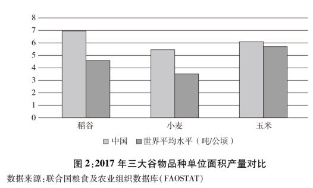
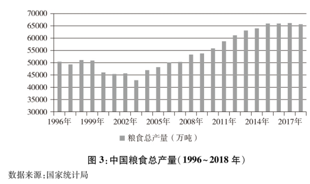

**绝密☆启用前**

**2021年普通高等学校招生全国统一考试（乙卷）**

**语文**

**注意事项：**

**1.答卷前，考生务必将自己的姓名，准考证号填写在答题卡上。**

**2.回答选择题时，选出每小题答案后，用铅笔把答题卡上对应题目的答案标号涂黑。如需改动，用橡皮擦干净后，再选涂其他答案标号。回答非选择题时，将答案写在答题卡上，写在本试卷上无效。**

**3.考试结束后，将本试卷和答题卡一并交回。**

**一、现代文阅读（36分）**

**（一）论述类文本阅读（本题共3小题，9分）**

阅读下面的文字，完成下面小题。

对于人文研究来说，计算方法以往只是作为辅助手段而存在的，而今天已取得了不可替代的地位。一种新的人文研究形态应运而生，这就是“数字人文”。学者莫莱蒂曾设想一种建立在全部文学文本之上的世界文学研究，人们必须借助计算机对大规模的文学文本集合进行采样、统计、图绘，分类，描述文学史的总体特征，然后再做文学评论式的解读。为此，他提出了与“细读”相对的“远读“作为方法论。弄清计算机的远读与人的细读之间的差别，不仅能使我们清晰地界定计算方法在人文研究中的作用，而且可以帮助我们重新确立人的阅读的价值。

计算机是为科学计算而创造出来的，擅长的是“计数”，而非理解。要处理自然语言文本，计算机必须先将文本置换成便于计数的词汇集合，或者用更复杂的代数模型和概率模型来表示文本，这一过程被称为“数据化”。数据化之后所得到的文本替代物（集合、向量、概率）虽然损失了原始文本的丰富语义，但终究是可以计算的了。不过，尽管计算机能处理海量的语料，执行复杂的统计、分类、查询等任务，但它并不能理解文本的内容。

远读是数字人文的基石。大规模的文本集合上的远读，基本上可以归为两类：一是对文本集合整体统计特征的描述，一是对文本集合内在结构特征的揭示。例如，数字人文学者米歇尔等人对数百万册数字化图书进行多种词汇和词频统计，以分析英语世界的语言演变，这属于前者；莫莱蒂用地图、树结构来分别展示文学作品的地理特征和侦探故事的类型结构，这属于后者。无论是宏观统计描述还是内在结构揭示，都是超越文本具体内容的抽象表示，所得结果都是需要解读的。正如米歇尔所说，在巨量文本集合上得到的统计分析结果，为人文材料的宏观研究提供了证据；但是要解读这些证据，就像分析古代生物化石一样，是有挑战性的。对远读结果的解读，仍然是依赖学者在细读文本的基础上所建立起来的对本领域的认知和理解。一句话，人的阅读不可替代。

需要补充的是，当考查单篇文本的文本特征（例如计算一篇文档中所有单字的出现频率），或者分析其内部结构（例如提取一部小说中所有人物的对话网络）时，数据量也会增长到个人无法处理的程度。所以，上述对文本集合所做的讨论在单篇文本层面也是成立的。

一个普遍存在的对数字人文的评判依据，是看数字人文能不能更好地回答传统人文学者所关心的问题。严格说来，只有当数据量或者数据精度超出了个人阅读理解的能力范围时，才有理由借助计算机来对文本或者文本集合的特征予以量化描述，进而提供给人去进行深入解读。数字人文不仅仅是新的手段和方法，更重要的是，它赋予我们提出新问题的能力。我们现在可以问，五千年来全人类使用最频繁的词是什么。透过这类问题，可以获得观察超长历史时段文化现象的新视角。

（摘编自王军《从人文计算到可视化——数字人文的发展脉络梳理》）

1\. 下列关于原文内容的理解和分析，不正确的一项是（ ）

A. 在数字人文的概念提出之前，计算方法已被引入人文领域，在研究中发挥作用。

B. 要实现莫莱蒂设想的世界文学研究，首先应进行大规模的文学文本集合的数据化。

C. 选择远读还是细读的方法，取决于阅读的对象是大规模的文本集合还是单篇文本。

D. 数字人文不仅为文本处理提供了新的手段和方法，而且为人文研究提供了新视角。

2\. 下列对原文论证的相关分析，不正确的一项是（ ）

A. 文章区分“计数”与“理解”，是为了论证计算机不能处理某些特定类型的文本。

B. 文章转述数字人文学者米歇尔本人的说法，有助于论证应该更全面地看待远读。

C. 文章第四段讨论单篇文本层面的问题，对前文补充论证，使得论证更加周密。

D. 文章同时肯定计算机远读和人的细读的作用，有助于避免人们对远读的误解。

3\. 根据原文内容，下列说法正确的一项是（ ）

A. 人文研究的主体，在数字人文中实现了从具体的学者个人向计算机的转变。

B. 远读不是要深化对文本内容的理解，而是要发掘文本集合的共同形式特征。

C. 数字人文的价值，在于将历史上未被注意和阅读的文本都进行数据化并做研究。

D. 和人的细读相比，远读的理念和做法体现出大数据时代文理融合的跨学科取向。

**（二）实用类文本阅读（本题共3小题，12分）**

阅读下面的文字，完成下面小题。

材料一：

新中国成立后，中国始终把解决人民吃饭问题作为治国安邦的首要任务。70年来，在中国共产党领导下，经过艰苦奋斗和不懈努力，中国在农业基础十分薄弱、人民生活极端贫困的基础上，依靠自己的力量实现了粮食基本自给，不仅成功解决了近14亿人口的吃饭问题，而且居民生活质量和营养水平显著提升，粮食安全取得了举世瞩目的巨大成就。

党的十八大以来，以习近平同志为核心的党中央把粮食安全作为治国理政的头等大事，提出了“确保谷物基本自给、口粮绝对安全”的新粮食安全观，确立了以我为主、立足国内、确保产能、适度进口、科技支撑的国家粮食安全战略，走出了一条中国特色粮食安全之路。

（摘自国务院新闻办公室《中国的粮食安全》白皮书）

材料二：

山东省临朐县是一个有着90多万人口和近90万亩耕地的山区农业大县。临朐县山区丘陵面积较大，而且地形错综复杂，起伏多变，成百上千亩集中连片且开阔平坦的农田很少见，加之农田基础设施落后，从自然村落到田间地头的道路基本都是土路，交通极其不便。用乡亲们的话说：“开门就见山，种田走半天。耕地就像百衲衣，一顶苇笠也能盖一块地。”近年来，临朐县在推进高标准农田建设时，立足山区实际，把解决地块零散、水电路不配套等问题作为重点，坚持集中连片规划建设，着力补齐农业基础设施短板，合理利用土地资源，为粮食稳产增产夯实了基础。“十三五”以来，全县共改造中低产田373万亩，建成高标准农田12万亩。

（摘编自张正瑜等《山东临朐 立足山区实际 科学谋划建设高标准农田》）

材料三：

近几年，江西省南昌市安义县长埠镇江下村村容村貌有了翻天覆地的变化，全村6个村小组前前后后共修建了逾11公里的水泥路，95％的水塘进行了清淤处理，建成了3.2公里高标准农田沟渠。过去，江下村因土地贫瘠，一直没有找到产业发展的好路子，祖辈守着一亩三分地种水稻及常规农作物，产量较低的“斗笠田”随处可见。为改变现状，村干部主动为江下村争取了高标准农田项目，引进种粮大户盘活荒地。作为高标准农田的“集成模块”，越来越多的新技术在江下村大显身手——粮食耕、种、管、收实现全程机械化，逐步提高智能作业的精准度和覆盖率……去年11月，江下村2168亩高标准农田建设项目开始动工，项目如今已全部完成。现在村里的耕地质量普遍提升两个等级，粮食产能平均提高15%，亩均粮食产量提高100公斤，高标准农田已成为带动农民持续增收、实现贫困群众稳步脱贫的有力引擎。

（摘编自李慧《粮食安全：把饭碗牢牢端在自己手中》，《光明日报》2020年12月24日）

4\. 下列对材料一相关内容的理解和分析，不正确的一项是（ ）

A. 我国粮食单位面积产量显著提高，2010年开始平均每公顷粮食产量突破5000公斤，粮食生产取得了举世瞩目的巨大成就。

B. 2017年我国稻谷、小麦、玉米的每公顷产量明显高于世界平均水平，可见居民的生活质量和营养水平得到了显著提升。

C. 2003～2015年，粮食总产量连续多年保持增长势头，中国特色粮食安全之路越走越稳健，粮食生产能力不断增强。

D. 从2015年起，我国粮食总产量连续四年稳定在65000万吨以上水平，这有助于保障国家粮食安全、促进经济社会发展。

5\. 下列对材料相关内容的概括和分析，正确的一项是（ ）

A. 交通极其不便、产业发展路径缺失、开阔平坦的农田数量较少，这些曾经是制约临朐县山区发展现代农业的主要因素。

B. 在提升粮食产能方面，临朐县山区与安义县江下村的工作侧重点有所不同，前者着力解决地块零散的问题，后者着重改变村容村貌。

C. “开门就见山，种田走半天”，这是临朐县山区地形和耕地的特点，安义县江下村“斗笠田”的地形地貌也呈现出这种特点。

D. 村干部主动作为，引进种粮大户盘活荒地，利用新技术推进农业机械化，这是推动江下村农民持续增收、稳步脱贫的有效举措。

6\. 在促进粮食增产方面，临朐县山区与安义县江下村有哪些相同的经验，请概括说明。

**（三）文学类文本阅读（本题共3小题，15分）**

阅读下面的文字，完成下面小题。

**秦琼卖马**

谈歌

民国二十二年立秋这天下午，保定城淹没在一片知了的鸣叫声中。一辆人力三轮停在了古董店艺园斋门前。一个身着灰布大褂的中年汉子下了三轮，提个柳条箱进了店门。伙计杨三忙迎上来，给汉子让座沏茶。

“我找韩定宝先生。”

杨三怔了一下，低声答道：“韩老板已经去世三年了。”

汉子惊了脸，手里的茶碗险些跌落。杨三又道：“现在的老板是杨成岳先生。”汉子呆了片刻，缓声道：“我想见一见杨老板。”说着取出一张名片。杨三接过看了一眼，惊讶道：“您就是王超杰先生啊。您稍等。”

王超杰，人称北方铁嗓，专攻老生。平生喜好收藏官窑彩瓷。几年前一场中风，愈后左腿不利落，便不再登台。

不一刻，一壮年男人出来，拱手道：“王先生，幸会。我是杨成岳。早年曾听过王先生的大戏，今日竟是有缘在此相见。”王超杰笑笑：“这么说杨老板也是门里人了？”杨成岳笑道：“不瞒王先生，杨某也曾是票友，只是不敢与王先生坐论其道。——不知王先生到保定有何贵干？”王超杰笑道：“有几件古瓷，想让杨先生鉴赏。”便打开柳条箱，取出一摞盘子，放在桌案上，共是六件。

杨成岳凑近细看，看了半刻，便向王超杰点头微笑。王超杰笑道：“这是我多年前从一个落魄商家手里收购而来。地道上品，还请杨老板说个价钱。”杨成岳问：“此乃王先生心爱之物，何故出手呢？”王超杰长叹一声：“生计所迫，还望杨老板成全。”杨成岳点头笑笑：“本店小本生意，实在不好言价了。还请王先生体谅。”王超杰脸上滑过一丝失望，杨成岳道：“买卖不成仁义在，先不说价钱，容我再想想。”王超杰起身告辞，杨成岳却一定留他吃饭。吃过饭，又给王超杰找了一家上等客栈，店钱饭钱都由艺园斋开支。

王超杰来到保定的消息很快传开。这一天，名琴师张小武请王超杰和杨成岳吃酒。吃过几杯酒，话便多了起来。杨成岳道：“王先生，当年听您一出戏可真是不易，一张票要卖到十五块大洋。”王超杰摆手笑道：“好汉不提当年啊。”张小武笑道：“今日何不乘兴唱上几段，一饱我二人的耳福呢。”王超杰笑道：“二位想听，那我就干唱几句吧。”张小武忙摆手：“不行不行。取我的胡琴来。”

胡琴响起，王超杰就唱起来：“店主东拉过了黄骠马，不由得秦叔宝珠泪洒下……”一曲唱罢，杨成岳击掌叫好。“王先生唱得字正腔圆，只是悲凉了些，壮气不足。秦琼秦叔宝盖世英雄，一时落魄，壮志不减才对。”王超杰笑道：“秦叔宝到了那时，壮志不减也得减了。毕竟不知道单雄信能够出来啊。”三人都笑了。

说笑了几句，王超杰笑道：“超杰此次来保定不是卖马，而是卖瓷器。只是杨老板不肯成交啊。”杨成岳沉吟了一下：“王先生一定要卖，就请说一句落底的话吧。”王超杰笑道：“这几只雍正官窑粉彩过枝碧桃大盘，我当年得来也的确不易。一只盘子五百块大洋总是值的吧。”杨成岳想了想，笑道：“那好，明天你到我店里去，我们当面钱货两讫。”

第二天，王超杰带着箱子去了艺园斋。进了店门，见张小武和杨成岳已经等在那里。

王超杰笑道：“二位摆好功架，是否还要我再唱上一段助兴？”杨成岳击掌大笑：“正是此意。”王超杰想了想，就说：“今日就唱一段《奇冤报》吧。”胡琴响起，王超杰唱起：“未曾开言两泪汪，尊一声太爷听端详……”

杨成岳击掌叫好。张小武叹道：“今日真是大大地过了一场瘾。”王超杰笑道：“也唱过了，就请成岳先生过目吧。”杨成岳让账房取过一箱大洋，笑道：“超杰先生，清点一下。”王超杰摆手道：“不必不必。”

王超杰告辞，杨成岳和张小武送出门外，直到看不见了，二人才转回店里。杨成岳盯着那六件瓷盘发呆。

张小武笑道：“成岳，不知道你能赚多少。”杨成岳一笑：“你说呢？”猛一挥手，那六件瓷盘竟被掸落，摔在地上，碎了。张小武大吃一惊：“你……” 杨成岳道：“请随我来。”进了里屋，只见货架上有几只盘子。杨成岳叹道：“这才是真的。”张小武结舌道：“你是说，超杰先生带来的，是赝品……”杨成岳道：“正是，那东西顶多值上几吊钱。我看出王先生心爱此物，不好说破，也只好装痴作呆了。”说罢长叹一声。

张小武皱眉道：“那三千大洋……”杨成岳一笑：“我们一共听了超杰先生两出戏，也就值了。钱这东西，生不带来，死不带走，送与王先生，也便是用在了去处。”

张小武默默无语，转身要走。杨成岳喊住他：“小武兄，何不操琴，我今天直是嗓子作痒了。”张小武怔了一下，就坐下，操起了琴。杨成岳唱起，苍凉的唱段就灌了满店：“一轮明月照窗前，愁人心中似箭穿……”

门外已经是秋风一片。

（有删改）

7\. 下列对小说相关内容和艺术特色的分析鉴赏，不正确的一项是（ ）

A. 王超杰说话多是“笑道”，唱的戏词则是“珠泪两下”“两泪汪”，这种细节写出了他当时的处境与心态。

B. 杨成岳当着张小武的面，把重金买到的六件瓷盘掸落地上，这一转折将故事推向高潮，也使杨成岳形象更为饱满。

C. 小说语言比较独特，用语考究，古朴典雅，对话不用日常口语，有种舞台味道，与人物的身份地位极为相符。

D. 小说从立秋这天的知了鸣叫写起，以“门外已经是秋风一片”收尾，借秋意加深来传达人世的苍凉之感。

8\. 王超杰为什么选择《秦琼卖马》唱段，且唱得壮气不足？请简要分析。

9\. 买卖瓷盘的过程中，杨成岳的心理发生了哪些变化？请结合作品简要说明。

**二、古代诗文阅读（34分）**

**（一）文言文阅读（本题共4小题，19分）**

阅读下面文言文，完成下面小题。

戴胄忠清公直擢为大理少卿上以选人多诈冒资荫敕令自首不首者死未几有诈冒事觉者上欲杀之胄奏据法应流上怒曰：“卿欲守法，而使朕失信乎？”对曰：“敕者出于一时之喜怒，法者国家所以布大信于天下也。陛下忿选人之多诈，故欲杀之，<u>而既知其不可，复断之以法，此乃忍小忿而存大信也</u>。”上曰：“卿能执法，朕复何忧！”胄前后犯颜执法，言如涌泉，上皆从之，天下无冤狱。鄃令裴仁轨私役门夫，上怒，欲斩之。殿中侍御史长安李乾祐谏曰：“法者，陛下所与天下共也，非陛下所独有也。今仁轨坐轻罪而抵极刑，臣恐人无所措手足。”上悦，免仁轨死，以乾祐为侍御史。上谓侍臣曰：“朕以死刑至重，故令三覆奏，盖欲思之详熟故也。而有司须臾之间，三覆已讫。又，古刑人，君为之彻乐减膳。朕庭无常设之乐，然常为之不啖酒肉，又，百司断狱，唯据律文，虽情在可矜，而不敢违法，其间岂能尽无冤乎？”丁亥，制：“决死囚者，二日中五覆奏，下诸州者三覆奏。行刑之日，尚食勿进酒肉，内教坊及太常不举乐。<u>皆令门下覆视，有据法当死而情可矜者，录状以闻。</u>”由是全活甚众。其五覆奏者以决前一二日，至决日又三覆奏。唯犯恶逆者一覆奏而已。上尝与侍臣论狱，魏征曰：“炀帝时尝有盗发，帝令於士澄捕之，少涉疑似，皆拷讯取服，凡二千余人，帝悉令斩之。大理丞张元济怪其多，试寻其状，内五人尝为盗，余皆平民。竟不敢执奏，尽杀之。”上曰：“此岂唯炀帝无道，其臣亦不尽忠。君臣如此，何得不亡？公等宜戒之！”

（节选自《通鉴经事本末·贞观君臣论治》）

10\. 下列对文中画波浪线部分的断句，正确的一项是（ ）

A. 戴胄忠清公直/擢为大理少卿/上以选人/多诈冒资荫/敕令自首/不首者死/未几有诈冒事觉者/上欲杀之/胄奏/据法应流/

B. 戴胄忠清公直/擢为大理少卿/上以选人多诈冒资荫/敕令自首/不首者死/未几有诈冒/事觉者上欲杀之/胄奏/据法应流

C. 戴胄忠清公直/擢为大理少卿/上以选人多诈冒资荫/敕令自首/不首者死/未几有诈冒事觉者/上欲杀之/胄奏据法应流/

D. 戴胄忠清公直/擢为大理少卿/上以选人/多诈冒资荫/敕令自首/不首者死/未几有诈冒/事觉者上欲杀之/胄奏/据法应流/

11\. 下列对文中加点词语的相关内容的解说，不正确的一项是（ ）

A. 犯颜，指敢于冒犯君王或尊长的威严，常常用于表示直言敢谏的执着态度。

B. 抵极刑，抵刑即处刑，抵极刑指犯人受到死刑外加上尸体示众的极端刑罚。

C. 减膳，古代帝王遇到天灾等让自己感到内疚的情况时，常食素或减少肴馔。

D. 大理丞，大理丞是大理寺的重要官员，大理寺是我国古代掌管刑狱的官署。

12\. 下列对原文有关内容的概述，不正确的一项是（ ）

A. 戴胄认为法律是国家用以取信于天下的条例，若皇上敕令与法冲突，应以法为准绳，唐太宗听从了戴胄的意见，并高度评价他的看法。

B. 裴仁轨因私事使唤门夫，唐太宗要处死他，李乾祐说法律为皇帝与天下共有，不可轻罪重判；太宗免去仁轨死罪，以乾祐为侍御史。

C. 唐太宗认为死刑关乎人命，如果机械执行法条难免会出现冤案，于是加强死刑覆奏，让判决更为审慎，这一举措使许多人得以活命。

D. 魏征说，隋炀帝滥杀无辜，张元济不敢谏诤；唐太宗认为正是因为臣不尽忠，最终导致了隋朝灭亡，因此告诫群臣一定要吸取教训。

13\. 把文中面横线的句子翻译成现代汉语。

（1）而既知其不可，复断之以法，此乃忍小忿而存大信也。

（2）皆令门下覆视，有据法当死而情可矜者，录状以闻。

**（二）古代诗歌阅读（本题共2小题，9分）**

阅读下面这首宋词，完成下面小题。

**鹊桥仙·赠鹭鸶**

辛弃疾

溪边白鹭，来吾告汝：“溪里鱼儿堪数。主人怜汝汝怜鱼，要物我欣然一处。

白沙远浦，青泥别渚，剩有虾跳鳅舞。听君飞去饱时来，看头上风吹一缕。”

14\. 下列对这首词的理解与赏析，不正确的一项是（ ）

A. 上阕结尾句“要物我欣然一处”，表达了人与自然和谐共处的美好愿望。

B. 因“溪里鱼儿堪数”，故作者建议鹭鸶去虾鳅较多的“远浦”“别渚”。

C. 本词将鹭鸶作为题赠对象，以“汝”“君”相称，营造出轻松亲切的氛围。

D. 词末从听觉和视觉上分别书写了鹭鸶饱食后心满意足的状态，活灵活现。

15\. 这首词的语言特色鲜明，请简要分析。

**（三）名篇名句默写（本题共1小题，6分）**

16\. 补写出下列句子中空缺部分。

（1）乐曲演奏过程中的停顿也有情感表达作用。白居易《琵琶行》中对此进行说明的诗句是：“\_\_\_\_\_\_\_\_\_\_\_\_\_\_，\_\_\_\_\_\_\_\_\_\_\_\_\_\_\_\_。”

（2）即便“故国不堪回首”，李煜在《虞美人》（春花秋月何时了）中还是不由自主地想到自己当年在金陵的宫殿，慨叹已物是人非：“\_\_\_\_\_\_\_\_\_\_\_\_\_\_\_\_，\_\_\_\_\_\_\_\_\_\_\_\_\_\_\_\_”。

（3）范仲淹《岳阳楼记》中描写了春日的洞庭湖景色，其中写到花草的句子是：“\_\_\_\_\_\_\_\_\_\_\_\_\_\_，\_\_\_\_\_\_\_\_\_\_\_\_\_\_\_。”

**三、语言文字运用（20分）**

**（一）语言文字运用I（本题共3小题，9分）**

阅读下面文字，完成下面小题。

有人说，互联网虽然实现了我们的一个古老的梦想，把远在天涯的人变得\_\_\_\_\_\_\_\_\_\_\_，但与此同时也可能恰好相反，把身边的人变得如在天涯，因而引发了一种普遍的担心：当我们越来越习惯于线上的虚拟世界时，我们是否会最终失去与现实世界的联系。对线上虚拟世界的担心，并非\_\_\_\_\_\_\_\_\_\_\_。正如有研究者指出的那样，互联网已经深入到我们生活中的方方面面，过度沉迷有可能让一些人“越来越拥抱技术、越来越忽略彼此”。

实际上，线上与线下之间的界限也不是那么\_\_\_\_\_\_\_\_\_\_\_\_\_。研究发现，互联网中的社交关系大多是通过“上传”线下的好友形成的，是现实社交的延续。从空间角度来讲，互联网有助于我们维系远距离的线下关系；从时间角度来看，媒介化创造了一种广泛的双向即时互动。空间和时间由于不断压缩，大大增强了互动性，社会交往效率有助于得到显著提高。（ ）。“虚拟”与“现实”早已是你中有我，我中有你。现实世界为虚拟生活\_\_\_\_\_\_\_\_\_\_\_\_地提供养料，虚拟生活又能激发和充实现实世界的活力。

17\. 依次填入文中横线上的词语，全都恰当的一项是（ ）

A. 近在咫尺 杞人忧天 泾渭分明 源源不断

B. 触手可及 空穴来风 泾渭分明 取之不尽

C. 近在咫尺 空穴来风 非此即彼 源源不断

D. 触手可及 杞人忧天 非此即彼 取之不尽

18\. 下列填入文中括号内的语句，衔接最恰当的一项是（ ）

A. 社会交往是如此，我们工作和生活的其他方面也是如此

B. 不但社会交往如此，而且我们工作和生活的其他方面也是如此

C. 我们工作和生活的其他方面，和社会交往也是一样的

D. 我们工作和生活的其他方面也是这样，除了社会交往

19\. 文中画波浪线的句子有语病，下列修改最恰当的一项是（ ）

A. 由于空间和时间不断压缩，大大增强了互动性，有助于社会交往效率显著提高。

B. 空间和时间由于不断压缩，互动性大大增加，社会交往效率得到显著提高。

C. 空间和时间由于不断压缩，大大增强了互动性，社会交往效率得到显著提高。

D. 空间和时间由于不断压缩，互动性大大增强，有助于社会交往效率显著提高。

**（二）语言文字运用II（本题共2小题，11分）**

阅读下面的文字，完成下面小题。

很多人认为，水果越甜，含糖量越高，热量也越高。其实这种说法并不准确。因为水果的甜度<u>①</u> ，还与“糖”的种类以及含酸性物质的多少有关。水果中的“糖类”，主要包括单糖（果糖，葡萄糖）、双糖（蔗糖，麦芽糖）和多糖（淀粉）。其中<u>②</u> ，蔗糖的甜度次之，葡萄糖和麦芽糖更次之，淀粉则基本没有甜味。有的水果，如西瓜，由于所含果糖的比例较大，甜度远高于含糖量更高但以葡萄糖为主的水果，如猕猴桃。水果中的有机酸，可以使其甜度不那么明显，例如山楂的含糖量比草莓高得多，但吃起来没有草莓甜，就是<u>③</u> 。

对超重人群和糖尿病人群来说，水果是不是必须“拉黑”呢？实际上，这类人群往往需要控制摄入食物的总热量，对含糖量较高的鲜枣等水果，尽量少吃或不吃，尤其要注意那些不太甜但含糖量较高的水果，如百香果。最好选择糖少的水果，如草莓等。但必须要说明的是，即使是含糖量较少的水果，也要有所限制，建议平均一天不超过200克。

20\. 请在文中横线处补写恰当的语句，使整段文字语意完整连贯，内容贴切，逻辑严密，没处不超过12个字。

21\. 简述第二自然段的主要内容。要求使用包含因果关系的句子，表达简洁流畅，不超过65个字。

**四、写作（60分）**

22\. 阅读下面的材料，根据要求写作。

古人常以比喻说明对理想的追求，涉及基础、方法、路径、目标及其关系等。如汉代扬雄就曾以射箭为喻，他说：“修身以为弓，矫思以为矢，立义以为的，奠而后发，发必中矣。”大意是，只要不断加强修养，端正思想，并将“义”作为确定的目标，再付诸行动，就能实现理想。

上述材料能给追求理想的当代青年以启示，请结合你对自身发展的思考写一篇文章。

要求：选准角度，确定立意，明确文体，自拟标题；不要套作，不得抄袭；不得泄露个人信息；不少于800字。
