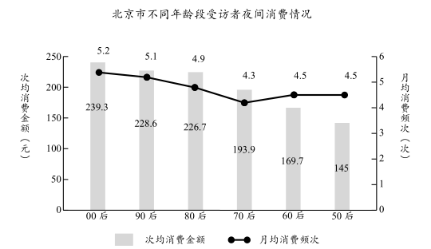

**绝密★启用前**

**2021年普通高等学校招生全国统一考试（天津卷）**

**语文**

**本试卷分为第Ⅰ卷（选择题）和第Ⅱ卷两部分，共150分，考试用时150分钟。第Ⅰ卷1至6页，第Ⅱ卷7至11页。**

**答卷前，考生务必将自己的姓名、考生号、考场号和座位号填写在答题卡上，并在规定位置粘贴考试用条形码。答卷时，考生务必将答案涂写在答题卡上，答在试卷上的无效。考试结束后，将本试卷和答题卡一并交回。**

**祝各位考生考试顺利！**

**第Ⅰ卷**

**注意事项：**

**1.每小题选出答案后，用铅笔将答题卡上对应题目的答案标号涂黑。如需改动，用橡皮擦干净后，再选涂其他答案标号。**

**2.本卷共11小题，每小题3分，共33分。在每小题给出的四个选项中，只有一项是最符合题目要求的。**

**一、（9分）**

阅读下面一段文字，完成下面小题。

古往今来，最使人们感到（ ）莫测的客观存在就是时间了。尽管在物理学家和哲学家那里，空间也是一个缠夹不清的概念，但对于普通人来说，空间毕竟是容易感觉和理解的。时间则不同了，它究竟是什么东西呀？看不见，摸不着，却又无处不在。它（ ），却又千金难买。伏尔泰在哲理小说《查第格》中编了一个谜语：“世界上哪样东西是最长的又是最短的，最快的又是最慢的，最能分割的又是最广大的，最不受重视又是最受惋惜的；没有它，什么事都做不成，它使一切渺小的东西归于消灭，使一切伟大的东西生命不绝？”谜底就是“时间”。在时间的各项性质中，\_\_\_\_\_\_\_\_\_\_\_。孔子在河边叹息说：“逝者如斯夫，不舍昼夜！”后代的诗人也（ ）地用滔滔东流的河水来比喻时间。唐代的韩琮甚至认为只要听听流水的声音就能感受到时间的消逝：“行人莫听宫前水，流尽年光是此声！”

（选自《莫砺锋诗话》，有删节）

1\. 依次填入文中括号内的词语，最恰当的一组是（ ）

A. 神奇 一文不名 异曲同工

B. 神妙 不值一钱 异曲同工

C. 神奇 不值一钱 不约而同

D. 神妙 一文不名 不约而同

2\. 下列填入文中画线处的句子，最恰当的一项是（ ）

A. 最使人们无能为力却又感到切肤之痛的就是它的飞速流逝且永不复返

B. 最使人们感到切肤之痛却又无能为力的就是它的永不复返且飞速流逝

C. 最使人们无能为力却又感到切肤之痛的就是它的永不复返且飞速流逝

D. 最使人们感到切肤之痛却又无能为力的就是它的飞速流逝且永不复返

3\. 下列与“时间”相关的表述，有误的一项是（ ）

A. “逝者如斯夫，不舍昼夜”出自语录体散文《论语》，孔子用这句话抒发了对时间流逝、永不停歇的感慨。

B. 《逍遥游》中的“朝菌不知晦朔，蟪蛄不知春秋”，揭示出生命长短的相对性。“晦”“朔”分别指阴历每月第一天和最后一天。

C. 《孔雀东南飞》中的“奄奄黄昏后，寂寂人定初”两句，写出了由天色已暗到夜深人静的时间变化。

D. 《滕王阁序》中“东隅已逝，桑榆非晚”

**二、（9分）**

阅读下面的文字，完成下面小题。

材料一：

中国文旅产业在高质量发展中蓄积变革力量，稳中有进。各个城市的文旅融合实践，通过挖掘城市文化特色，在区域整体规划中统筹文化潜力、融合科技力量、盘活文化资源、创新文化场景，基于文化内质进行多维延伸，全方位赋能城市旅游产业发展，逐步形成了“百花齐放”的整体格局。以“沉浸式体验”为核心的数字创意智慧旅游、“文化+IP+数字消费”的互联网智慧旅游等新业态发展迅猛。

约翰·菲斯克说：“交换和流通的不是财富，而是意义、快乐和社会身份……消费者在相似的商品中做出选择时，通常不是比较其使用价值，而是比较其文化价值；从诸多商品中做出一种选择，就成了消费者对意义、快乐和社会身份的选择。”由此可见，游客群体对以文化为内涵的数字创意文旅产品存在消费诉求，这也反映出对凝结文化精粹并融入科技元素的创意型产品所彰显的文化价值的肯定。在对产品的期待与消费后，消费者间接地完成了对社会身份的选择。

材料二：

数字技术创造智慧文旅新形态。伴随5G技术开始步入商用，VR、AR、区块链等技术频频介入文旅产业应用。目前，国内已有1000多家景区开通了线上游览服务。通过“虚拟景区”“云机游”“旅游+直播”“智能地图”等模式，利用VR、AR、全景影像等技术，在内容创造、虚拟运营、智能服务、交互体验等方面推出了更多的玩法，实现了景区的智慧化、数字化升级。

南京市红山森林动物园开通了“Zoo直播”，直播内容包括动物日常活动、饲养员工作、答网友问并科普相关知识等，使游客足不出户“云”游动物园。据统计，累计观看量达到190多万人次。可见，影响受众选择的不仅是事实本身，更是它扩散和传播的方式。

材料三：

夜间经济成为文旅产业的重要板块。中国的夜间经济早在汉代就初见端倪，夜市在宋代拥有了合法地位，商品交易和娱乐活动异彩纷呈。《东京梦华录》载，夜市“直至三更尽，才五更又复开张”，热闹非凡。如今，夜间经济成为城市发展与经济增长的新引擎，其繁荣程度代表着一个城市的经济开放度和活跃度。无论国家还是地方都认识到夜间经济的重要意义，并将其上升至战略高度。2018年11月，天津市发布《关于加快推进夜间经济发展的实施意见》，集中打造具有天津本地特色的夜间经济示范街区。2019年4月，上海市发布《关于本市推动夜间经济发展的指导意见》，旨在加快国际消费城市建设。《指导意见》界定了“夜间经济”的概念，即从晚7时至次日6时在城市特定地段发生的各种合法商业经营活动的总称，指出夜间经济是都市经济的重要组成部分。夜间经济所带动的创收指数是城市文旅的重要量化指标，也是文旅消费评价体系的新维度。

（以上三则材料取材于司若主编《中国文旅产业发展报告（2020）》）

材料四：

（取材于《2019年北京市夜间消费调查报告》）

4\. 根据材料一、材料二，下列理解不正确的一项是（ ）

A. 城市文旅融合实践充分调动文化、科技等要素，全方位赋能城市旅游产业发展。

B. 数字创意智慧旅游和互联网智慧旅游等新业态在科技力量助推下发展迅猛。

C. 消费者看重商品

D. 国内大量景区应用数字技术，推出更多服务，实现了智慧化、数字化升级。

5\. 下列与“夜间经济”相关的表述，不正确的一项是（ ）

A. 中国自古以来就存在夜间经济形态，到宋代其繁盛度和开放度达到巅峰。

B. 津沪两地先后出台了促进夜间经济发展的相关文件，打造城市经济增长新引擎。

C. 要对城市文旅消费进行评价，需要引入夜间经济所带动的创收指数作为参考。

D. 据图表，四十岁以下人群是夜间消费的主力军，“00后”受访者月均消费最高。

6\. 下面对材料的理解和推断，正确的一项是（ ）

A. 云直播、云旅游等模式主要依靠技术手段提升用户体验，吸引了大量年轻用户。

B. 大众只关注事实的扩散传播方式，掌握影响群体期待的手段就能引导大众。

C. 夜间经济已被提升到发展战略高度，但也需要根据城市文化特色稳步推进。

D. 北京市“70后”受访者月均消费频次最低，可见夜间消费不适合“70后”。

**三、（15分）**

阅读下面的文言文，完成下面小题。

世之所谓智者，知天下之利害，而审乎计之得失，如斯而已矣。此其为智犹有所穷。唯见天下之利而为之，唯其害而不为，则是有时而穷焉，亦不能尽天下之利。古之所谓大智者，知天下利害得失之计，而权之以人。是故有所犯天下之至危而卒以成大功者，此以其人权之。轻敌者败，重敌者无成功。何者？天下未尝有百全之利也，举事而待其百全，则必有所格，是故知吾之所以胜人，而人不知其所以胜我者，天下莫能敌之。

当汉氏之衰，豪杰并起而图天下，二袁、董、吕争为强暴，而孙权、刘备又已区区于一隅，其用兵制胜，固不足以敌曹氏，然天下终于分裂，讫魏之世，而不能一。盖尝试论之。魏武长于料事，而不长于料人。刘备有盖世之才，而无应卒之机。方其新破刘璋，蜀人未附，一日而四五惊，斩之不能禁。释此时不取，而其后遂至于不敢加兵者终其身。孙权勇而有谋，此不可以声势恐喝取也。魏武不用中原之长，而与之争于舟楫之间，一日一夜，行三百里以争利。<u>犯此二败以攻孙权，是以丧师于赤壁，以成吴之强。</u>且夫刘备可以急取，而不可以缓图。方其危疑之间，卷甲而趋之，虽兵法之所忌，可以得志。孙权者，可以计取，而不可以势破也，而欲以荆州新附之卒，乘胜而取之。彼非不知其难，特欲侥幸于权之不敢抗也。此用之于新造之蜀，乃可以逞。故夫魏武重发于刘备而丧其功，轻为于孙权而至于败。<u>此不亦长于料事而不长于料人之过欤</u>？

嗟夫！事之利害，计之得失，天下之能者举知之。知之而不能权之以人则亦纷纷焉或胜或负争为雄强而未见其能一也。

（宋·苏轼《魏武帝论》，有删节）

观曹公明锐权略，神变不穷，兵折而意不衰，在危而听不惑，临事决机，举无遗悔，近古以来，未之有也。虽复名微众寡，地小力穷，官渡受围，濮阳战屈。然天下精明之士，拓落之材，趋若百川之崇巨海，游尘之集高岳。故有荀彧、郭嘉等，或敛风长感，或一见尽怀。然后览英雄之心，骋熊罴之勇，挟天子以崇大顺，扶幼主而显至公，武功赫然，霸业成矣。

（唐·朱敬则《魏武帝论》，有删节）

7\. 对下列各句中加点词的解释，不正确的一项是（ ）

A. 而审乎计之得失 审：仔细考量

B. 则必有所格 格：阻止，阻碍

C. 此用之于新造之蜀 造：拜访

D. 或一见尽怀 或：有的人

8\. 下列各句中加点词的意义和用法，相同的一组是（ ）

A. 则是有时而穷焉 盘盘焉，囷囷焉

B. 而权之以人 臣以供养无主，辞不赴命

C. 特欲侥幸于权之不敢抗也 臣诚恐见欺于王而负赵

D. 游尘之集高岳 不知东方之既白

9\. 文中画波浪线的句子，断句最合理的一项是（ ）

A. 知之而不能权之/以人则亦纷纷焉/或胜或负/争为雄强而未见/其能一也

B. 知之而不能权之以人/则亦纷纷焉或胜或负/争为雄强/而未见其能一也

C. 知之而不能/权之以人则亦纷纷焉/或胜或负争为雄强/而未见其能一也

D. 知之/而不能权之以人/则亦纷纷焉或胜/或负争

10\. 下列六句分编四组，都属于苏轼认为曹操应该采取的正确做法的一组是（ ）

①孙权勇而有谋，此不可以声势恐喝取也 ②与之争于舟楫之间

③行三百里以争利 ④刘备可以急取，而不可以缓图

⑤方其危疑之间，卷甲而趋之 ⑥欲以荆州新附之卒，乘胜而取之

A. ①③⑥ B. ①④⑤ C. ②③④ D. ②⑤⑥

11\. 下列对选文的理解与分析，不恰当的一项是（ ）

A. 苏轼一开篇就肯定了明辨利害即为“智者”的看法，并认为“大智者”还必须善于权衡对手。

B. 苏轼认为曹操过于重视刘备、又过于轻视孙权，因而错失统一的时机。

C. 朱敬则认为曹操在名望、实力上不占优势，又屡次战败，但最终扶持幼主，使朝廷稳定。

D. 两则选文摆事实、讲道理，观点鲜明，条理清晰，文气充沛，很有说服力。

12\. 把文言文阅读材料中画横线的句子翻译成现代汉语。

（1）犯此二败以攻孙权，是以丧师于赤壁，以成吴之强。

（2）此不亦长于料事而不长于料人之过欤？

13\. 请用自己的话概括苏轼和朱敬则对曹操评价的不同之处。

**第Ⅱ卷**

**注意事项：**

**1.用黑色墨水的钢笔或签字笔将答案写在答题卡上。**

**2.本卷共12小题，共117分。**

**四、（25分）**

阅读下面的词，按要求作答。

**念奴娇**

用傅安道和朱希真梅词韵

\[宋\]朱熹

临风一笑，问群芳、谁是真香纯白？独立无朋，算只有、姑射注山头仙客。绝艳谁怜，真心自保，邈与尘缘隔。天然殊胜，不关风露冰雪。

应笑俗李粗桃，无言翻引得、狂蜂轻蝶。争似黄昏闲弄影，清浅一溪霜月。画角吹残，瑶台梦断，直下成休歇。绿阴青子，莫教容易披折。

\[注\]姑射：神话中的山名，神仙所居之处。

14\. 下列对这首词的理解和赏析，不恰当的一项是（ ）

A. “和”，即和韵，是诗词写作的一种方式。这首词就是朱熹依照傅安道和朱希真梅花词的韵而创作的。

B. 词的开篇运用拟人手法，并以问句提起，将梅花与“群芳”比较，突出梅花的清香与洁白。

C. 词中写梅花美艳无比，与姑射山仙人相伴；“风露冰雪”的考验赋予了梅花不同寻常的韵致。

D. “画角”“绿阴”数句，写梅花宁愿休歇凋零，也不愿结出青青的梅子而被人折断梅枝。

15\. “黄昏闲弄影，清浅一溪霜月”描绘了怎样的画面？

16\. 请指出词人借梅花寄托了怎样的理想人格。

17\. 补写出下列句子中的空缺部分。

（1）仰观宇宙之大，\_\_\_\_\_\_\_\_\_\_\_\_\_\_\_\_\_\_。（王羲之《兰亭集序》）

（2）江间波浪兼天涌，\_\_\_\_\_\_\_\_\_\_\_\_\_\_\_\_\_\_。（杜甫《秋兴八首（其一）》）

（3）\_\_\_\_\_\_\_\_\_\_\_\_\_\_\_\_\_\_，石破天惊逗秋雨。（李贺《李凭箜篌引》）

（4）想当年，金戈铁马，\_\_\_\_\_\_\_\_\_\_\_\_\_\_\_\_\_\_。（辛弃疾《永遇乐·京口北固亭怀古》）

（5）田园是中国古代文人的精神家园。陶渊明在《归去来兮辞》中用“\_\_\_\_\_\_\_\_\_\_\_\_\_\_\_\_\_\_，\_\_\_\_\_\_\_\_\_\_\_\_\_\_\_\_\_\_”描写万物在春日复苏、繁荣滋长的美好景象，表达对田园生活的热爱，引发对生命的思考。

**五、（22分）**

阅读下面的文章，完成下面小题。

**送一位远征的友人**

——给到×北工作的的L

方龄贵

来信说：“……是时候了，我要去了。我来自遥远的北方，还要回北方去。……祖国喂养我二十年，是为她出力的时候了。我决定二次北征。……如果我倒下来，请为我的光荣欢喜，节制你的悲哀，并设法通知我远在松花江边的家，告诉他们我躺在祖国的原野上了……”

寄来这么短短的一章，你就毅然去了。

朋友，眼看你回到北方投身在这神圣的斗争中了，而我还在这边荒的一角，寂寞地活着。我心里有许多话却一时无从叙说。我于是把想象放在一个辽远的地方，你的故乡，也是我的故乡。我屈起手指头，已经不多不少五个年头了，自从我们背起行囊走出那个地方。

当我们跳下车，在北平城里停下我们脚步的时候，发觉这里并不如我们所想象。它太沉闷，太无生气。人们似乎已经遗忘了关山以外的土地，被膏药旗子压得喘不过一口气来。我们的祖国就是这样一个破碎的祖国，苦难的祖国。我们时刻不能忘记，我们来是为了受苦，为祖国受苦。当整个国家在苦难里挣扎的时节，一切轻蔑，损害，污辱都算不了什么。给家里去信，只说：“这里很好，只是太好玩，恐怕心野了收不回来，将来不想回家了。”故意把话说得那么轻松，想减少文字在老人心中所掷放的分量，自己却不敢再看第二遍。

两年的时光消度过去了，我们到了南京。落日黄昏，山边水崖，你总是惆怅地向远遥望着，怀念烽烟的北国。江南的山水，你一点也不留恋，你只想呼吸离家较近一点的地方的空气。你不能安于这种平静的生活，终于在一个迷雾蒙蒙的早晨，又背起你的小行囊，向北迈开你的步子。回北平不久，信来了，仿佛生活得非常痛快，如心。接着来了“七七”。七月二十八日北平失守，你被困在里面了，情形混乱，敌兵到处搜查，拘捕，风声鹤唳。你呢，家里的接济断了，两个铜板，到街上换一个烧饼，不是为了果腹，只是为了运动嘴唇，慢到不能再慢地咀嚼着。有时连这也得不到，便只有硬呷两口白开水。……读到这个地方，我用尽所有的力量抑止我眼泪的外流也不可能了。我们无愧于我们的祖国，不是为了她，在家里我们并不缺乏温饱。你嘱我不要为你的贫苦伤心，这对你是一种磨练，一种经验。你那故作宽慰的苦心双倍加重我的悲哀。没有比有心地隐藏自己的悲哀更可悲的了。

你已经不能安心读书。祖国在呼唤你，战争呼唤你。你为她的远景所吸引，控制不住自己的热情，随着××训练班去了。彼此都无消息，完全隔绝在两个世界里。你在哪里呢？到底还是你自己，把这个谜底揭开了。一封信从黄河边上飞到我的手里来，原来你到离炮火最近的地方找工作。信上充满了战斗的热情，说从早到晚都可听到炮火和炸弹爆裂的声音，并不惮烦琐地描绘着，描绘着你怎样在炮火和炸弹的空隙处理你的工作。还说，北方，我歌颂她，她有多么美丽，健康！每天有小米饭吃，像回了家。……

然而你不满足，说自己太年青，做事的力量不够，你还想学习。像从天上飞下来一样，在一个春天的下午，我又握到了你的手。

那是一双多么粗糙有力的手！完全失去了以前的光滑和纤弱。你脸上蒙上一层风尘的颜色，似乎有一点苍老。在那狭小的旅店里，对着酒我们尽情地诉说。夜晚来时，望着满天星月，向我叙说北中国的消息，或者忘情地唱起救亡歌。我就像从前听老人讲故事一样地听着。年余没见，你的胸襟更扩大了。

你住下来，你想学一点专门的技能，到敌人后方去工作。你兴奋，你即刻要去长沙，然而问题发生在钱上。那使我一生也忘不了的一天！落着小雨，我们捡点了几件衣服，到街上换钱。那该多么难为情！自己觉得脸上发烧，把慈母的手缀注转让给别人。<u>我们低着头，把衣服的面积折成最小，怕的是遇见熟人。秦琼卖过他的黄骠马，我们现在卖衣服。我们装作买东西，走进店铺里，怯生生地把衣服拿出来，（好像偷来的一样）低声地问他们：“买衣服么？”那声音模糊得几乎连自己也听不清楚。真想一转身，收起衣服跑回去。然而没有，我们忍住了。一家不成，又走一家，为的是多争几毛或几分。那条二里长的小街被我们走到尽头。眼巴巴地瞧着自己的衣服换了主人，像离别一位患难中的朋友，接过手中的几张票子，头也不回我们走出来了。……外面落着小雨，感觉一阵空虚。一转身我看见你偷偷用手巾擦眼泪。……我把头转到另一方向，我瞩望阴沉的天空。天空怎么那样暗呢。</u>

你到了长沙。你学习怎样运用你的“武器”。而现在，你是向北方去了，你所怀念的地方。

我不留恋，也不伤感。我为你欢喜，为你祝福。我们都经历了太多的忧患，感情脆弱得像一支绷紧的弦。这不成：时代不容许我们。你劝我要坚强，现在我自己勉励自己。别以为我们的苦难是偏得的不幸，我们不过是苦难的祖国的一个小小章节，放开眼睛，有多少人失掉乡土，拆散了家，有多少灵魂，为我们的祖国，把血洒在大地上。我们，后死者们，得接替上去，继续把血液输送给祖国的土地，滋养她，肥沃她，使自由在这上面生长。

朋友，你放心去吧，祖国正需要你。我们来自北方，北方有我们祖先的坟墓，有我们的家乡，还有慷慨悲歌的英雄。朋友，你去了，珍重你自己吧，莫忘记时常给我捎几个字来。我祝福你，愿你平安。

（选自1940年2月25、27日《大公报》，有删改）

\[注\]手缀：此处指母亲亲手做的衣服。

18\. 下列对文章的理解与分析，不恰当的两项是（ ）

A. 文章以抗日救国为背景，按照时间

B. 作者谈今忆往，叙写友人多次的人生选择，表达了对友人的思念和关切，流露出浓浓的同乡情、同胞情。

C. 在特殊的政治环境下，文章多处用语隐讳，如“×北”“××训练班”“运用你的‘武器’”等，带有鲜明的时代烙印。

D. 文章以“我”和友人作对比，用友人在求学、工作、流亡、抗战等经历中表现出的思想境界，反衬出“我”的惭愧心情。

E. 文章以第一人称“我”的视角展现友人行踪，语言华丽工巧，节奏张弛有度，感情含蓄深沉。

19\. 文章在开头直接引用友人来信有何作用？

20\. 结合文本说明画线部分运用了哪些艺术手法？表现了怎样的心情？

21\. 在作者笔下，友人L是一个怎样的人？

22\. 李大钊说：“中华自身无所谓运命也，而以青年之运命为运命。”结合文章主题，联系实际，谈谈你对这句话的认识。

**六、（10分）**

23\. 校文学社拟从《论语》《三国演义》《红楼梦》中选取一个场景拍摄视频短剧。假如你是导演，会选取哪部书中的哪个经典场景？请说明理由。要求100字左右。

24\. 下面文段画线部分有两个病句，请指出其序号并提出修改意见。

一切文明成果，都是劳动者迈向进步的脚印。<u>①今天谈到劳动时，脑海中浮现的已经不仅仅是农田里稻浪滚滚、工地上火花四溅的景象</u>。②<u>随着科技的进步，使劳动的内容和环境发生了很大的变化</u>。③<u>不过，劳动给社会带来财富并推动社会发展这一意义不会变化</u>。④<u>“劳动光荣、创造伟大”这句话，始终是对于人类文明进步历程的重要诠释。</u>

**七、（60分）**

25\. 阅读下面

如果说时间是一条单行道，那么纪念日就是道路两侧最醒目的路标，它告诉我们怎样从昨天走到了今天。时间永不停步，纪念日不会消失。记住它，可以让日历上简单的数字成为岁月厚重的注脚，而它也不断提醒着我们带着初心奔向前方。

你对这段话有怎样的理解和感悟？请结合自身体验，写一篇文章。

要求：①自选角度，自拟标题； 

②文体不限（诗歌除外），文体特征明显；

③不少于800字； 

④不得抄袭，不得套作。
