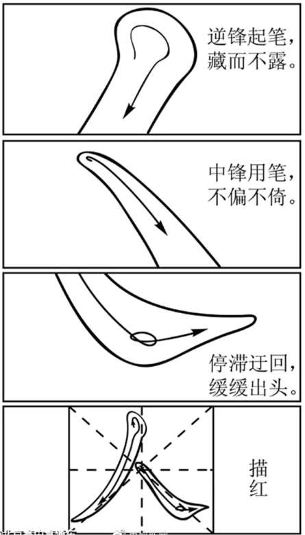

**绝密★启用前**

**2021年普通高等学校招生全国统一考试（新高考全国Ⅱ卷）**

**语文**

**一、现代文阅读（35分）**

**（一）现代文阅读（本题共5小题，17分）**

阅读下面的文字，完成下面小题。

网络空间是将人群聚集起来的一种新型社会空间，更是年轻一代学习、娱乐和交往的平台，为保证网络空间的有序，制定和遵守相应的规则是必要的。不仅如此，网络空间还需要每个人对网上的其他人给予应有的尊重。简言之，互联网不是法外之地。

网络行为是由网民的观念意识引导的，而文明的网络行为是在一系列文明的观念意识支配下形成的。由于青年是网民的主体，其网络行为对网络空间的文明状况有极大影响，因此引导他们树立文明的网络行为观，无疑有助于网络行为失范的校正和网络空间的治理，有助于青年一代的健康成长。网络规范必不可少，这已是共识。但需要有什么样的规范，则是一个复杂的问题。底线伦理或“负面清单”是共识性最强也是最起码的网络行为规范，通过明确“不能做什么”来列出的网络行为负面清单，通常也是有法律强制性的禁区，构成最低层次的网络道德规范。

归纳学术界对网络失范行为的分析，我们可以从“五不”来认识网络行为的底线要求，或以此作为网民尤其是青年们文明上网的负面清单。不伤害——网络行为者既不要有意作恶，也不能无意为恶，如在网上进行攻击、谩骂，诋毁他人的名誉，或侵犯他人的安全、自由、隐私和利益等。不偷盗——在网络信息空间中，要像对待现实世界中的商品一样，以合法合规的方式获取所需的信任，抵制侵犯知识产权的不道德行为。不造假——每一个网民要从不进行信息造假做起，确保自己在网上发送的信息是真实的，尤其是自媒体，不能为了吸引眼球而编造耸人听闻或哗众取宠的谣言。不浪费——即不发生信息浪费的行为，向网络发送垃圾信息不但会造成网络资源的浪费，也会耗费网民的时间和精力。信息时代工作效率的提高本来使我们获得了认知盈余，但网上的垃圾信息造谣与辟谣之间的拉锯战又无端消耗了我们的认知盈余。不盲从——上网时保持冷静清醒的头脑，不轻信网络谣言而上当受骗，没有造谣的网民，就没有网谣的市场，网民就不会被网络污染的策划者所利用，不会不明真相卷入人肉搜索或网络围攻。

底线意识主要是从否定性的角度确立了网络中能做什么；而一旦在网络空间中产生了行为，无疑就是开始了“做什么”，只要有行为，就必须有一定的规范和要求去主导人的行为，于是就有了肯定意义上的网络行为意识。其中，做到平等待人或尊重他人可以说是形成积极网络行为的基准意识，而这种基准意识可以通过“等效意识”“反身意识”“价值意识”和“契约意识”来具体体现。

所谓“等效意识”，就是当线上虚拟世界出现道德失范行为时，要将其视为与现实世界中的道德失范行为具有等效的实际影响，因此需要一视同仁地对我们线上和线下的行为提出道德规范要求。所谓“反身意识”，可以说是等效意识在自我和他人关系上的延伸，即一个人的不当行为有可能损害到他人时，转换视角去设想当自己是这种行为的受害人时会有什么样的切身之痛，有了这样的反身意识，就会自觉抵制许多不良的网络行为，就不会到网上去传播谣言。“价值意识”在网络行为中有多方面的体现:第一，它表现为对他人信息劳动的价值认同，比如尊重知识产权；第二，重视信息内容的文化意义，从而积极传播内容健康的信息；第三，意识到网络作为信息技术的价值负载，从而关注信息技术使用的道德效应。由于技术普遍是负载价值的，不当使用网络可能会产生出负价值，如对网络游戏的沉迷会耽误学业和事业，此外，网络是“内容为王”的空间，是各种思想交锋的新的疆场，青年人尤其是被争夺的对象。因此，正确的价值观对他们而言具有主导性的作用。“契约意识”就是要具有信息契约精神。网络空间中，在信息的生产、传播和使用中新出现了大量的利益分配乃至利益冲突问题，冲击了传统的信任机制，通过订立契约的方式来规范各自权利和义务成为重构信任机制的重要方式之一。当作为未来希望的青年一代在网上讲诚信、守契约、服从大局时，网络中新的信任机制可随之形成。

（摘编自肖峰《从底线伦理到担当精神:当代青年的网络文明意识》）

1\. 下列对原文内容的理解和分析，正确的一项是（ ）

A. 青年是网络空间的参与主体，因此有必要制定相应的规则，来规范和管理网络。

B. 网络上充塞的垃圾信息消耗了人们的认知盈余，导致线上工作效率不如线下。

C. 青年在进入网络空间时首先应遵从“五不”底线，明确在网络中不能做什么。

D. “等效意识”要求网络行为的主体在现实和网络空间中的行为要始终保持一致。

2\. 根据原文内容，下列说法不正确的一项是（ ）

A. “五不”是从否定性角度对网络行为作出的范，如违反可能会受到法律的惩罚。

B. 基准意识是对网络行为的积极要求，说明“能做什么”，比“不做什么”更重要。

C. 中国传统美德中

D. 网络信息的生产、传播和使用产生了一些传信任机制框架内无法解决的新问题。

3\. 下列选项，最能全面而准确概括原文主要观点的一项是（ ）

A. 没有健全而成熟的网络立法，违法的网络行不被惩治，文明的网络行为就得不到保护，诚信社会也难以建成。

B. 网络行为必须要有文明的观念意识加以引导，而“等效意识”“价值意识”等能够规范人们的网络文明行为。

C. “五不”作为网民尤其是青年们上网的负面清单，可以为网络行为的基准意识提供重要参照。

D. 引导青年树立文明的网络行为观念，有助网络行为失范的校正和网络空间的治理，有助于青年一代健康成长。

4\. 请简要分析文章的论证结构。

5\. 互联网上，有年轻人为炫耀技术故意在网络植入病毒，导致病毒传播。请根据文章，谈谈你对这种现象的看法。

**（二）现代文阅读Ⅱ（本题共4小题，18分）**

阅读下面的文字，完成下面小题

文本一

**放猖**

废名

故乡到处有五猖庙，其规模比土地庙还要小得多，土地庙好比是一乘轿子，与之相比五猖庙则等于一个火柴匣子而已。猖神一共有五个，大约都是士兵阶级，在春秋佳日，常把他们放出去“猖”一下，所以驱疫也。“猖”的意思就是各处乱跑一阵，故做母亲的见了自己的孩子应归家时未归家，归家了乃责备他道：“你在哪里“猖”了回来呢？”猖神例以壮丁扮之，都是自愿的。有时又由小孩子扮之，这便等于额外兵，是父母替他许愿，当了猖兵便可以没有灾难，身体健康。我当时非常羡慕这种小猖兵，心想我家大人何以不让我也来做一个呢？猖兵赤膊，着黄布背心，这算是制服，公备的。另外，谁做猖谁自己得去借一件女裤穿着，而且必须是红的。装束好了以后，再来“打脸”。打脸即是画花脸，这是我最感兴趣的，看着他们打脸，羡慕已极，其中有小猖兵，更觉得天下只有他们有地位了，可以自豪了，像我这天生的，本来如此的脸面，算什么呢？打脸之后，再来“练猖”，即由道士率领着在神前画符念咒，然后便是猖神了，他们再没有人间的自由，即是不准他们说话，一说话便要肚子痛的。这也是我最感兴趣的，人间的自由本来莫过于说话，而现在不准他们说话，没比这个更显得他们已经是神了，他们不说话，他们已经同我们隔得很远，他们显得是神，我们是人是小孩子，我们可以淘气，可以嬉笑着逗他们，逗得他们说话，而一看他们是花脸，这其间便无可奈何似的，我们只有退避三舍了，我们简直已经不认得他们。何况他们这时手上已经拿着叉，拿着察郎当郎当的响，真是天兵天将的模样了。说到叉，是我小时最喜欢的武器，叉上串有几个铁轮，拿着把柄一上一下郎当着，那个声音把小孩子的什么话都说出了，便是小孩子的欢喜，我最不会做手工，我记得我曾做过叉，以吃饭的筷子做把柄，其不讲究可知，然而是我的创作了。我的叉的铁轮是在城一个高坡上（我家住在城里）拾得的洋铁屑片剪成的。在练猖一幕之后，才是名副其实放猖，<u>即由一个凡人拿了一面大锣敲着，在前面率领着，拼命地跑着，五猖在后面跟着拼命地跑着，沿家逐户地跑着，每家都得升堂入室，被爆竹欢迎着，跑进去，又跑来，不大的工夫在乡一村在城一门家家跑遍了。</u>我则跟在后面喝彩。放猖的时间总在午后，到了夜间则是“游猖”，这时不是跑，是抬出神来，由五猖护着，沿村或沿街巡视一遍，灯烛辉煌，打锣打鼓还要吹喇叭，我的心里却寂寞之至，正如过年到了元夜的寂寞，因为游猖接着就是“收猖”了，今年的已经完了。

到了第二天，遇见昨日的猖兵时，我每每把他从头至脚打量一番，仿佛一朵花已经谢了，他的奇迹都到哪里去了呢？尤其是看着他说话，他说话的语言太是贫穷了，还不如不说话。

（有删改）

文本二:

**莫须有先生教国语**

废名

莫须有先生教国语，第一要学生知道写什么，第二要怎么写，说起来是两件事，其实是一件，只要你知道写什么，你自然知道怎么写。要小孩子知道写什么，其实很简单，只要你自己是小孩子，你能懂得小孩子的欢喜你便能引得他们写什么了。

莫须有先生在金家寨小学教国语，有一回出一个“荷花”的作文题，因为他小时喜欢乡下塘里的荷花、荷叶、藕。凡属小孩子都应该喜欢，而且曾经有李笠翁关于这个题目写了一篇很好的散文，莫须有先生自己的文章还近于诗，诗则有时强人之所不能，若李笠翁的《芙蕖》能说到荷叶的用处，是训练小孩子作文的好例子。荷叶还可以拿到杂货店里去包东西。莫须有先生出了荷花这个题目，心里便有一种预期，不知有学生能从荷塘说到杂货店否？结果没有，莫须有先生颇寂寞，有一学生之所作，篇幅甚短，极饶意趣，他说清早起来看见荷塘里荷叶上有一小青蛙，青蛙蹲在荷叶上动也不动一动，“像羲皇时代的老百姓”，莫须有先生很佩服他的写实。

民间有“放猖”“送油”的风俗，莫须有先生小时顶喜欢看“放猖”，看“送油”，现在在乡下住着，这些事情真是“乐与数晨夕”了，颇想记录下来，却是少暇，因之拿来出题给学生作文，看他们能写生否，他们能将“放猖”“送油”写在纸上，国语教育可算成功了。作这两个题目的学生很多，但都不能写得清楚明白，令异乡人读之如身临其境、一目了然。可见文字非易事，单是知道写什么也还是不行的。小孩子都喜欢“放猖”，喜欢“送油”，然而他们写不出，他们的文字等于做手势而已。

莫须有先生坐飞机以后，已经重来大学执教了，莫须有先生又开始有闲作文章，乃居然写了一篇《放猖》，此事令他很愉快，好像是一种补过的快乐。

（节选自《莫须有先生坐飞机以后》，有删改）

6\. 下列对文本一相关内容和艺术特色的分析鉴赏，不正确的一项是（ ）

A. 火柴匣子是日常生活中的事物，文章将猖神庙比作火柴匣子，既强调猖神庙的小，也点出猖神世俗性的一面。

B. 猖兵画花脸后显得有地位，而“我”天生的面反而不算什么，这个对比表达了“我”对猖兵的羡慕之意。

C. “仿佛一朵花已经谢了”，这个比喻写猖兵的“奇迹”不再，也写“我”因放猖结束而感到失落。

D. 文章写了放猖从开始到结束

7\. 下列对文本二相关内容的理解和分析，不正确的一项是（ ）

A. 莫须有先生让学生写荷花时，期待他们从荷花说到杂货店，是因为他希望学生作文时能写到生活实际。

B. 莫须有先生所说的“写生”，是指文章应该把事物写得清楚明白，让对该事物陌生的人读了也能一目了然。

C. 小孩子喜欢“放猖”“送油”，却写不出，这说明作文除了要知道写什么，还要知道怎么写。

D. 莫须有先生在乡下时要写“放猖”以记民俗，但未写成，后来弥补了这一过失，所以说是“补过

8\. 文本一中画线部分用了多个“跑”字，请简要分析这样写的好处。

9\. 文本二指出，教小孩子作文要“能懂得小孩子的欢喜”，谈谈文本一是如何实践“能懂得小孩子的欢喜”这一主张的。

**二、古代诗文阅读（35分）**

**（一）文言文阅读（本题共5小题，20分）**

阅读下面的文言文，完成下面小题。

初范阳祖逖少有大志与刘琨俱为司州主薄同寝中夜闻鸡鸣蹴琨觉曰此非恶声也因起舞及渡江，左丞相睿以为军祭酒，逖居京口，纠合骁健，言于睿曰:“晋室之乱非上无道而下怨叛也，由宗室争权，自相鱼肉，遂使戎狄乘隙，毒流中土。今遗民既遭残贼，人思自奋，大王诚能命将出师，使如逖者统之以复中原，郡国豪杰必有望风响应者矣。”睿素无北伐之志，以逖为奋威将军、州刺史，给千人廪，布三千匹，不给铠仗，使自召募。秋八月，逖将其部曲百余家渡，中流，击楫而誓曰:“祖逖不能清中原而复济者，有如大江！”遂屯淮阴，起冶铸兵，募得二千余人而后进。逖既入谯城，石勒遣石虎围谯，桓宣救之，虎解去。晋王传檄天下，称:“石虎敢帅犬羊，渡河纵毒，今遣九军，锐卒三万，水陆四道，径造贼场，受祖逖节度。”大兴三年，逖镇雍丘，数遣兵邀击后赵兵，后赵镇戍归逖者甚多，境渐蹙。秋七月，诏加逖镇西将军。逖在军，与将士同甘苦，约己务施，劝课农桑，抚纳附，虽疏贱者皆结以恩礼。逖练兵积谷，为取河北之计。后赵王勒患之，乃下幽州为逖修祖、父墓，置守冢二家，因与逖书，求通使及互市。<u>逖不报书，而听其互市，收利十倍</u>。禁诸将不使侵暴后赵之民。边境之间，稍得休息。四年秋七月，以尚书仆射戴渊为西将军，镇合肥，逖以已翦荆棘收河南地，而渊一旦来统之，意甚怏怏，又闻王敦与刘刁构隙，将有内难。<u>知大功不遂，感激发病</u>。九月，卒于雍丘。豫州士女若丧父母，谯、梁间皆为立祠。祖逖既卒，后赵屡寇河南，拔襄城、城父，围谯。豫州刺史祖约不能御，退屯寿春。后赵遂取陈留，梁、郑之间复骚然矣。

（节选自《通鉴纪事本末·祖逖北伐》）

10\. 下列对文中画波浪线部分的断句，正确的一项是（ ）

A. 初/范阳祖逖少有大志/与刘琨俱为司州主簿/同寝中夜/闻鸡鸣/蹴琨觉曰/此非恶声也/因起舞/

B. 初/范阳祖逖少/有大志/与刘琨俱为司州主簿/同寝中夜/闻鸡鸣/蹴琨/觉曰/此非恶声也/因起舞

C. 初/范阳祖逖少有大志/与刘琨俱为司州主簿/同寝/中夜闻鸡鸣/蹴琨觉曰/此非恶声也/因起舞

D. 初/范阳祖逖少/有大志/与刘琨俱为司州主簿同寝/中夜闻鸡鸣/蹴琨/觉曰/此非恶声也/因起舞

11\. 下列对文中加点词语的相关内容的解说，不正确的一项是（ ）

A. 京口，古城名，在今江苏省镇江市，是古代长江下游军事重镇，为兵家所重。

B. 遗民，指改朝换代后仍然忠于前朝的人，也泛指沦陷区的人民，文中指后者。

C. 部曲，原指古代豪门大族和将领招募的私人军，文中是指部队的编制单位。

D. 传檄，指檄文，是古代官府用以征召、晓谕声讨的文书，传檄即传布檄文。

12\. 下列对原文有关内容的概述，不正确的一项是（ ）

A. 祖逖力请北伐，时任左丞相的司马睿虽无北伐之志，但仍然尽力支持，这坚定了祖逖的斗志，祖逖指江发誓:若不能收复中原就不再渡江返回江南。

B. 祖逖北伐，先在谯城遭石虎围攻，幸得桓宣救；后镇雍丘，屡次派兵邀击后赵军队，使后赵疆土日益缩小；又为攻取河北练兵积谷，与后赵相持。

C. 大兴三年秋，朝廷任命祖逖为镇西将军。祖逖与将士同甘共苦，严于律己，广施恩惠，勉励督促农桑，安抚接纳新来归附的人，不论贵贱都加以礼遇。

D. 祖逖死后，后赵频频侵犯河南地区，攻陷襄城、城父，包围谯城，豫州刺史祖约抵挡不住，退驻寿春，后赵攻取陈留，梁、郑之间又重新陷入了骚乱。

13\. 把文中画横线的句子翻译成现代汉语。

（1）逖不报书，而听其互市，收利十倍。

（2）知大功不遂，感激发病。

14\. 文中说到“边境之间，稍得休息”，具体原因是什么？请简要说明。

**（二）古代诗歌阅读（本题共2小题，9分）**

阅读下面这首宋诗，完成下面小题。

**示儿子**

陆游

禄食无功我自知，汝曹何以报明时？

为农为士亦奚异，事国事亲惟不欺。

道在六经宁有尽，躬耕百亩可无饥。

最亲切处今相付，热读周公七月诗。

【注】七月诗：指《诗经·风·七月》，是一首描写农民劳作和生活的农事诗。

15\. 下列对这首诗的理解和赏析，不正确的一项是（ ）

A. 本诗的首联以问句领起全篇，自然引出下文诗人对儿子的谆谆教诲。

B. 诗人指出，不论是侍奉父母还是服务国家，“不欺”都是至关重要的。

C. 诗人认为，生逢“明时”不必读书求仕，“躬耕”才是一种理想状态。

D. 诗人在最后强调，自己传授给儿子的人生道理是最为真切、确实的。

16\. 诗人指出“道在六经宁有尽”，又让儿子“熟读周公七月诗”，对此你是如何理解的？

**（三）名篇名句默写（本题共1小题，6分）**

17\. 补写出下列句子中的空缺部分。

（1）陶渊明《归园田居》（其一）中“\_\_\_\_\_\_，\_\_\_\_\_\_”两句，采用对仗句式，连用两个比喻，表达诗人对官场的厌倦以及对田园的向往。

（2）欧阳修在《伶官传序》中感慨：当李存勖强盛的时候，“\_\_\_\_\_\_，\_\_\_\_\_\_”；而等到他衰败的时候，几十个伶人围困他，就身死国灭，被天下人讥笑。

（3）古代的诗人受到《楚辞·湘夫人》“袅袅兮秋风，洞庭波兮木叶下”的启发，创造出“落木”一词，以指代落叶。该词在古典诗词中经常出现，如“\_\_\_\_\_\_\_，\_\_\_\_\_\_\_”。

**三、语言文字运用（20分）**

**（一）语言文字运用I（本题共3小题，9分）**

阅读下面的文字，完成下面小题。

吃喝当然是人生一大乐事，如果生活在太空，我们还能愉快地享用大餐吗？

最早的太空餐是让人 的“牙膏”：宇航员从管子里面挤出半流体的食物，不需要咀嚼便直接咽下去，没有咀嚼的快感，没有多样的选择，首代宇航员的饮食条件相当艰苦。然而，吃货的生产力 ，很快，（ ）。如今，宇航员们已能在太空中自如地使用各种餐具，与地面用餐相当接近。与此同时，太空食品的种类也丰富起来。<u>正因为目前国际空间站中有上百种餐品，使得宇航员可以自由选择自己的用餐计划，然而这一用餐计划是每八天循环一次的</u>。而且宇航员们还在不停地开发新的太空料理：小饼干、寿司、花生酱冰棍，甚至是“昨的咖啡”——采访中一位航天飞机的指挥官曾自豪地展示过一批再生水，而原料是什么，自然 。

然而，制订太空莱谱仍然受到很大的限制。大部分蔬果在宇宙中最多只能保持两天鲜度，空间站中新鲜食品 ，绝大多数食品只能脱水或加工成罐头运上太空。目前科学家们正想方设法解决这一难题。

18\. 依次填入文中横线上的词语，全都恰当的一项是（ ）

A. 望而却步 不胜枚举 不言而喻 寥寥无几

B. 踌躇不前 不可低估 心照不宣 寥寥无几

C. 望而却步 不可低估 不言而喻 极其稀缺

D. 踌躇不前 不胜枚举 心照不宣 极其稀缺

19\. 下列填入文中括号内

A. 人们就发明了种种能在无重力环境中使用的餐具，并且还有咖啡杯和煎锅

B. 人们就发明了种种能在无重力环境中使用的餐具，甚至还有咖啡杯和煎锅

C. 人们就将种种能在无重力环境中使用的餐具发明出来，而且包括咖啡杯和煎锅

D. 人们就将种种能在无重力环境中使用的餐具发明出来，还包括咖啡杯和煎锅

20\. 文中画波浪线的句子有语病，下列修改最恰当的一项是（ ）

A. 目前国际空间站中有上百种餐品，宇航员可以自由选择自己的用餐计划——虽然这一用餐计划是每八天循环一次的。

B. 正因为目前国际空间站中有上百种餐品，使得宇航员可以自由选择自己的用餐计划——虽然这一用餐计划是每八天循环一次的。

C. 正因为目前国际空间站中有上百种餐品，所以宇航员可以自由选择自己的用餐计划——然而这一用餐计划是每八天循环一次的。

D. 目前国际空间站中有上百种餐品，这使得宇航员可以自由选择自己的用餐计划——然而这一用餐计划是每八天循环一次的。

**（二）语言文字运用IⅡ（本题共2小题，11分）**

阅读下面的文字，完成下面小题。

东西方文化不同，艺术的表现也不同。一般来，东方艺术重主观，<u>①</u> 。表现在绘画上，西洋画重写实，重形似，而中国画重神韵，重意境。

中国画通常<u>\_②</u> 。这看起来是以题材为标准类，其实是用艺术表现了一些独特的观念和思想，即中国画概括了自然和人生三个方面：人物画表现的是人类社会中人与人之间的关系；山水画表现的是<u>③</u> ，将人与自然融为一体；花鸟画则表现大自然的各种生命与人的和谐相处。中国画的分类，体现了中华民族传统的哲学观念和审美观。

中国画讲究虚实相生的意境美。老舍曾请齐白石以“蛙声十里出山泉”为题作画，十里蛙声，如何入画？潺潺山泉，如何表达？白石老人思考良久，终于画成了一幅经典之作：<u>六尾蝌蚪在山峦映衬下的山涧内的乱石之中不断涌出的潺潺清泉里摇曳着尾巴顺流而下</u>。看过此画的人无不拍案叫绝。

21\. 请在文中横线处补写恰当的语句，使整段文字语意完整连贯，内容贴切，逻辑严密，每处不超过15个字。

22\. 文中画波浪线处是个长句，请改成几个较短

**作文（全国新高考Ⅱ卷作文）**

23\. 阅读下面的材料，根据要求写作。

（唐光雨漫画作品，有改动）

\[注\]描红：用毛笔蘸墨在红模子上描着写字。

请整体把握漫画的内容和寓意写一篇文章，反映你的认识与评价、鉴别与取舍，体现新时代青年的思考。

要求：选好角度，确定立意，明确文体，自拟标题；

不要套作，不得抄袭；

不得泄露个人信息；

不少于800字。
