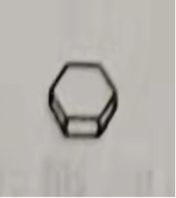
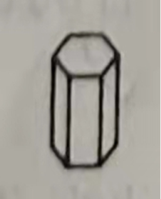
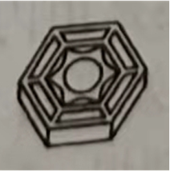
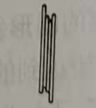
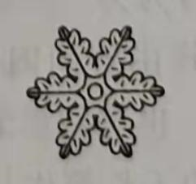
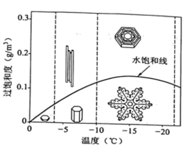
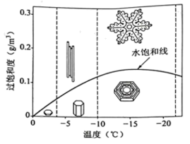
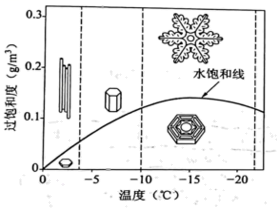
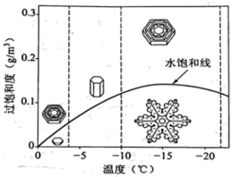

**2022年高考全国乙卷语文**

**注意事项：**

**1.答卷前，考生务必将自己的姓名、准考证号填写在答题卡上。**

**2、回答选择题时，选出每小题答案后，用铅笔把答题卡上对应题目的答案标号涂黑。如需改动，用橡皮擦干净后，再选涂其他答案标号。回答非选择题时，将答案写在答题卡上。写在本试卷上无效。**

**3.考试结束后，将本试卷和答题卡一并交回。**

**一、现代文阅读（36分）**

**（一）论述类文本阅读（本题共3小题，9分）**

阅读下面的文字，完成下面小题。

与西方叙事作品的定点透视不同，中国传统叙事作品往往采取流动的视角或复眼映视式的视角。

流动视角的所谓流动，就是叙事者带领读者与书中主要人物采取同一视角，实行“三体交融”：设身处地地进入叙事情境，主要人物变了，与之交融的叙事者和读者也随之改变视角。读《水浒传》的人可能有一个幻觉，你读宋江似乎变成宋江，读武松似乎变成武松，这便是视角上“三体交融”的效应。中国古代句式不时省略主语，更强化了这种效应。比如武松大闹快活林：武松一路喝过了十来处酒肆，远远看见一处林子。抢过林子背后，才见一个金刚大汉在槐下乘凉。武松自付这一定是蒋门神了。转到门前绿栏杆，才看见两把销金旗上写着“醉里乾坤大，壶中日月长”的对联。西方小说往往离开人物，从另一视角描写环境，细及它的细枝末节、历史沿革，以便给人物活动预先构建一个场景，如《巴黎圣母院》在描绘那座伟大的建筑时，就先用了数十页篇幅。而这里的视角则几乎寸步不离地随武松的行迹眼光游动，武松看不到的东西，读者也无从看到。游动视角不仅紧随人物眼光，也投射了人物性情，这只能是武松的眼光，他豪侠中不失精细，看清环境才动手；换作李逵恐怕就板斧一挥图个痛快了。

流动视角有时也采取圆形轨迹。《水浒传》中杨志、索超大名府比武，采取由外向内聚焦的圆形视角；梁山泊军队攻陷大名府，采取由内向外辐射的圆形视角。杨、索比武本身着墨不多，却写月台上梁中书看呆了；两边众军官喝彩不迭；阵面上军士们窃议，多年征战未见这等好汉厮杀；将台上李成、闻达不住声叫“好斗”；观战的诸色人物各具身份神态。金圣叹的眉评甚妙：“一段写满教场眼晴都在两人身上，却不知作者眼晴乃在满教场人身上也。作者眼睛在满教场人身上，遂使读者眼晴不觉在两人身上。”流动视角妙处在于：看客反成被看客，着墨不多自风流。

杨志比武的描写，是在单纯中求洒脱；大名府陷落的描写，要在复杂中求专注，千头万绪由何处着手？叙事者心灵手捷，一下子捉住了梁中书遑遑然如丧家犬的身影和目光，举一纲而收拢千丝万缕。行文没有让梁中书轻易脱险，而是在他逃遍东南西北四门和三闯南门的过程中，由内往外地辐射出圆形的视角，把瞬间遍及满城的战火统一于一人的眼光之中。

视角可以分为内视角、外视角和旁视角等处在不同层面上的类型。视角的流动，可以在同一层面上采取对位的、波浪状的或者圆形的种种流动方式；也可以在不同层面上采取跳跃的或者台阶式的流动方式。纪昀的《阅微草堂笔记》有一则二百余字的故事，使用有如昆虫复眼一般的视角，它先用外视角，写翰林院一位官员从征伊梨，突围时身死，两昼夜后复苏，疾驰归队。随之，作者和翰林院一位同事问起他的经历，采取他“自言被创时”的方式转向内视角。内视角把人物在生死边缘上迷离恍惚的意识滑动，寓于灵魂离体后的徘徊，简直是某种意识流的写法。最后作品又转到旁视角，借同事之口表达对这位官员的赞叹。复眼映视式视角的运用，使小小文本具有多重功能：情节功能、深度心理功能和口碑功能，因而这篇笔记简直成了视角及其功能的小小实验室。

（摘编自杨义《中国叙事学：逻辑起点和操作程式》）

1\. 下列关于原文内容的理解和分析，不正确的一项是（ ）

A. “三体交融”指叙事者以作品主要人物的视角，带领读者跟随人物进入叙事情境。

B. 西方语言没有不时省略主语的句式特点，叙事时较难将人物和场景融为一体。

C. 如果流动视角采取圆形轨迹展开，叙事者和主要人物的视角有时并不一致。

D. 纪昀通过内视角呈现从征伊犁的官员的意识流动，赋予了故事深度心理功能。

2\. 下列对原文论证的相关分析，正确的一项是（ ）

A. 文章通过对中国传统叙事作品视角的分析，证明了流动视角和复眼映视式的视角优于定点透视。

B. 文章第二段以《水浒传》中“大闹快活林”为例，论证流动视角更利于人物性格的塑造。

C. 文章末段以《阅微草堂笔记》中一则小故事为例，论证视角在同一层面和不同层面流动存在着差别。

D. 除了举例论证，文章还使用了对比论证等方法，让专业性很强的叙事学概念变得较易理解。

3\. 根据原文内容，下列说法不正确的一项是（ ）

A. 视角的流动既包括从人物的内视角转为外视角、旁视角，也包括由某一人的内视角转为另一人的内视角。

B. 选择由外向内聚焦的圆形叙事还是由内向外辐射的圆形叙事，与叙述的内容相关，也与叙事者希望达到的叙述效果相关。

C. 相较于长篇作品，笔记小说短小精悍，在采用流动视角或复眼映视式视角叙事时，更容易实现多重的叙事功能。

D. 《红楼梦》“林黛玉进贾府”一节采用流动视角，既写“众人见黛玉年貌虽小，其 举止言谈不俗”，又写黛玉眼中的凤姐、宝玉等人。

【答案】1. B 2. D 3. C

【解析】

【1题详解】

本题考查学生筛选并整合文中信息的能力。

B.“西方语言没有不时省略主语的句式特点”于文无据。文中只说“中国古代句式不时省略主语，更强化了这种效应”，至于西方语言有没有这一特点及其作用文中并未提及。

故选B。

【2题详解】

本题考查学生分析论点论据和论证方法的能力。

A.“证明了流动视角和复眼映视式的视角优于定点透视”于文无据。文章重在论述中国传统叙事作品的流动视角和复眼映视式视角的特点和效果，虽然也有和西方定点透视视角的比较，但并没有阐明孰优孰劣。

B.“流动视角更利于人物性格的塑造”错误。由原文：“中国古代句式不时省略主语，更强化了这种效应。比如武松大闹快活林：……”可知，作者举“大闹快活林”的例子是为了证明“中国古代句式不时省略主语，更强化了这种效应”这一观点。

C.“论证视角在同一层面和不同层面流动存在着差别”错误。根据文中“复眼映视式视角的运用，使小小文本具有多重功能：……”可知作者举《阅微草堂笔记》中的小故事是为了论证复眼映视式视角的多重功能。

故选D。

【3题详解】

本题考查学生分析概括作者在文中的观点态度的能力。

C.笔记小说“更容易实现多重的叙事功能”于文无据。原文与笔记小说有关的论述在最后一段：“复眼映视式视角的运用，使小小文本具有多重功能：情节功能、深度心理功能和口碑功能，因而这篇笔记简直成了视角及其功能的小小实验室。”这段论述主要谈复眼映视式视角的多重功能和纪昀的这篇笔记小说的独特之处，没有将其与长篇作品进行比较。

故选C。

**（二）实用类文本阅读（本题共3小题，12分）**

阅读下面的文字，完成各题。

**材料一：**

雪花是六瓣的这一事实是什么人最先在文献上发表的呢？是中国人。西汉人韩婴在《韩诗外传》中就指出“凡草木花多五出，雪花独六出”。这比西方早了1000多年。可是在其后的古文献中，却没有人去研究雪花为何是六瓣的。开普勒出于对几何、对称的兴趣，写了一本小书专门来研究雪花为何是六瓣的，尽管他当时所掌握的知识是不足以解释其成因的，但是，他这个方向是很有意思的。

（摘编自杨振宁《对称与物理》）

**材料二：**

17世纪初，雪花吸引了德国天文学家开普勒的眼光。当穿过布拉格的一座大桥时，他注意到落在衣服上的一片雪花，并因此思考它六角形的几何形状。开普勒认为雪花呈六角形的原因不能通过“材质”寻找，因为水汽是无形且流动的，原因只能存在于某种机制中。进而，他猜想这个机制可能是冰“球”的有序堆积过程。显微镜发明之后，雪花成了大受欢迎的观察对象。英国物理学家罗伯特•胡克在1665年出版的《显微术》一书中，展现了他借助显微镜画出的雪花图片，并对雪花晶体结构进行了阐述，这被看作是人类首次具体记录雪花的形态。

（摘编自尹传红《由雪引发的科学实验》）

**材料三**：

雪晶会根据其形成的云层中的温度和过饱和度的不同而生成不同的形状，在一些温度范围内雪晶呈柱状，在另一些温度范围内则呈板状。随着过饱和度的升高，雪晶变得越来越大，形状也越来越复杂。雪晶的基本形状主要取决于温度：在-2℃左右时呈板状，在-5℃左右时呈柱状，在-15℃左右时又呈板状，在低于-25℃时呈柱状或板状。雪晶的结构更多地取决于过饱和度，即取决于生成速度：当湿度高时，快速生成的柱状晶体会变成轻软的针状晶体，而六角形板状晶体会变成星状的枝蔓晶体。随着温度的下降，雪晶的形状会在板状和柱状之间来回变化好几次，而且变化很大：在几度温差范围内，雪晶会从又细又长的针状晶体（-5℃）变为薄而平的板状晶体（-15℃）。

>     

实心板状 实心棱柱状 薄板状 针状 枝蔓状

**雪晶形态图**

（摘编自肯尼思•利布雷希特《冰的形态发生：雪晶中的物理学》）

4\. 下列图解，最符合材料三相关内容的一项是（ ）

A. 

B. 

C. 

D. 

5\. 下列对材料相关内容的概括和分析，正确的一项是（ ）

A. 关于雪花具有对称的六角形结构这一事实，《韩诗外传》中“凡草木花多五出，雪花独六出”是世界上最早的表述。

B. 开普勒思考雪花是六瓣的原因，只是出于对几何和对称的兴趣，因此他的研究没有向前推进，也没有得出可信的结论。

C. 开普勒认为雪花呈六角形与水汽无关，原因可能存在于某种机制中，但是受到当时的知识限制，他没有再对此机制作出解释。

D. 雪晶的具体形状是受到温度和过饱和度的共同作用而形成的，其基本形状主要取决于温度，过饱和度则会影响雪晶结构的复杂性。

6\. 开普勒关于雪花的思考对科学研究有什么意义？给我们带来哪些启示？请简要说明。

【答案】4. B 5. D

6\. 意义：①开普勒关于雪花的思考打开了人们研究雪花的一扇窗口，这对后人的研究起到了引领作用；②开普勒关于雪花呈六角形的原因的思考以及对机制的猜测给后人提供了研究方向。\
启发：①兴趣是进行科学研究很重要的条件；②科学研究要善于观察，有对自然现象的敏感度，并善于进行分析和思考；③科学研究要敢于大胆假设、推理。

【解析】

【4题详解】

本题考查学生筛选并辨析信息的能力。

材料三相关表述是“在-2℃左右时呈板状，在-5℃左右时呈柱状，在-15℃左右时又呈板状，在低于-25℃时呈柱状或板状”“当湿度高时，快速生成的柱状晶体会变成轻软的针状晶体，而六角形板状晶体会变成星状的枝蔓晶体。随着温度的下降，雪晶的形状会在板状和柱状之间来回变化好几次，而且变化很大：在几度温差范围内，雪晶会从又细又长的针状晶体（-5℃）变为薄而平的板状晶体（-15℃）”。

雪晶的形状“在-15℃左右时……呈板状”；过饱和度湿度高时，“六角形板状晶体会变成星状的枝蔓晶体”，而AD项六角形板状晶体在上 ，星状的枝蔓晶体在下，正好相反，可排除AD；

雪晶的形状“在-2℃左右时呈板状”；过饱和度湿度高时“快速生成的柱状晶体会变成轻软的针状晶体”，而C项是由实心板状晶体变成的针状晶体，可排除C。

故选B。

【5题详解】

本题考查学生对多个信息进行比较、辨析的能力。

A.“雪花具有对称的六角形结构”错，原文是“雪花是六瓣的这一事实”；“是世界上最早的表述”错，原文是“最先在文献上发表的”；

B.“因此”强加因果。原文是“开普勒出于对几何、对称的兴趣，写了一本小书专门来研究雪花为何是六瓣的，尽管他当时所掌握的知识是不足以解释其成因的，但是，他这个方向是很有意思的”，可见他的研究没有向前推进，也没有得出可信的结论不是因为他的研究“只是出于对几何和对称的兴趣”，而是因为“他当时所掌握的知识是不足以解释其成因”；

C.“开普勒认为雪花呈六角形与水汽无关”与文本不符。原文“开普勒认为雪花呈六角形的原因不能通过‘材质’寻找。”

“他没有再对此机制作出解释”错，原文是“进而，他猜想这个机制可能是冰‘球’的有序堆积过程”，可见开普勒对机制作出了猜想。

另外，题干中的“原因可能存在于某种机制中”与原文“原因只能存在于某种机制中”表述不符，或然和必然混淆。

故选D。

【6题详解】

本题考查学生评价文本主要观点和倾向及凭借社会价值和影响的能力。

第一问：

材料一说“开普勒出于对几何、对称的兴趣，写了一本小书专门来研究雪花为何是六瓣的，尽管他当时所掌握的知识是不足以解释其成因的，但是，他这个方向是很有意思的”，表明开普勒关于雪花的思考打开了人们研究雪花的一扇窗口，这对后人的研究起到了引领作用；

材料二说“开普勒认为雪花呈六角形的原因不能通过‘材质’寻找，因为水汽是无形且流动的，原因只能存在于某种机制中。进而，他猜想这个机制可能是冰‘球’的有序堆积过程”，开普勒关于雪花呈六角形的原因的思考以及对机制的猜测给后人提供了研究方向。

第二问：

材料一说“开普勒出于对几何、对称的兴趣，写了一本小书专门来研究雪花为何是六瓣的”，表明兴趣是进行科学研究很重要的条件；

材料二说“17世纪初，雪花吸引了德国天文学家开普勒的眼光。当穿过布拉格的一座大桥时，他注意到落在衣服上的一片雪花，并因此思考它六角形的几何形状”“开普勒认为雪花呈六角形的原因不能通过‘材质’寻找，因为水汽是无形且流动的，原因只能存在于某种机制中”，表明科学研究要善于观察，有对自然现象的敏感度，并善于进行分析和思考；

材料二说“进而，他猜想这个机制可能是冰‘球’的有序堆积过程”，表明科学研究要敢于大胆假设、推理。

**（三）文学类文本阅读（本题共3小题，15分）**

阅读下面的文字，完成下面小题。

**“九一八”致弟弟书**

萧红

可弟：小战士，你也做了战士了，这是我想不到的。

世事恍恍惚惚地就过了；记得这十年中只有那么一个短促的时间是与你相处的，现在想起就像连你的面孔还没有来得及记住，而你就去了。

记得当我们都是小孩子的时候，当我离开家的时候，那一天的早晨你还在大门外和一群孩子玩着，那时你才十三四岁，你看着我离开家，向着那白银似的满铺着雪的无边的大地奔去。你恋着玩，对于我的出走，你连看我也不看。

而事隔六七年，你也就长大了，有时写信给我，因为我的漂流不定，信有时收到，有时收不到。但我读了之后，竟看不见你，不是因为那信不是你写的，而是在那信里边你所说的话，都不像是你说的。比方说一生活在这边，前途是没有希望的……

我看了非常的生疏，又非常的新鲜，但心里边都不表示什么同情，因为我总有一个印象，你晓得什么，你小孩子。所以我回信的时候，总是愿意说一些空话，问一问，家里的樱桃树这几年结樱桃多少？红玫瑰依旧开花否？或者是看门的大白狗怎样了？你的回信，说祖父的坟头上长了一棵小树。在这样的话里，我才体味到这信是弟弟写给我的。但是没有读过你的几封这样的信，我又走了，越走越离得你远了。

可弟，我们都是自幼没有见过海的孩子，海是生疏的，我们怕，但是也就上了海船，飘飘荡荡的，前边没有什么一定的目的，也就往前走了。

不知多久，忽然又有信来，是来自东京的，说你是在那边念书了。恰巧那年我也要到东京去看看，我想这一次可以见到你了。这是多么出奇的一个奇遇。我一到东京就写信给你，约你第三天的下午六点在某某饭馆等我。

那天，我五点钟就等在那里，一直到了六点钟，没有人来，我又多等了一刻钟，我又多等了半点钟，我想或者你有事情会来晚了的。到最后的几分钟，竟想到，大概你来过了，或者已经不认识我。第二天，我想还是到你住的地方看一趟。有一个老婆婆，说你已经在月初走了，离开了东京了。你那帘子里头静悄悄的，好像你在里边睡午觉的，半年之后，我还没有回上海，你又来了信，说你已经到了上海，是到上海找我的。我想这可糟了，又来了一个小吉卜赛。

这流浪的生活，怕你过不惯，也怕你受不住。

但你说：“你可以过得惯，为什么我过不惯？”

等我一回到上海，你每天到我的住处来，我看见了你的黑黑的人影，我的心里充满了慌乱。我想这些流浪的年轻人，都将流浪到哪里去。常常在街上碰到你们的一伙，你们都是年轻的，都是北方的粗直的青年，内心充满了力量。你们是被逼着来到这人地生疏的地方，你们都怀着万分的勇敢，只有向前，没有回头。但是你们都充满了饥饿，所以每天到处找工作。你们是可怕的一群，在街上落叶似的被秋风卷着，弯着腰，抱着膀，那时你不知我心里的忧郁，你总是早上来笑着，晚上来笑着。进到我屋子来，看到打着寒战。

可吃的就吃，看到书就翻，累了，躺在床上就休息是欢喜了，但还是心口不一地说：“快起来吧，看这么懒。”

你那种傻里傻气的样子，我看了，有的时候，觉得讨厌，有的时候也觉得喜欢，虽是欢喜了，但还是心口不一地说：“快起来吧，看这么懒。”

不多时就“七七”事变，很快你就决定了，到西北去，做抗日军去。

你走的那天晚上，满天都是星，就像幼年我们在黄瓜架下捉着虫子的那样的夜，那样黑黑的夜，那样飞着萤虫的夜。

你走了，你的眼睛不大看我，我也没有同你讲什么话。我送你到了台阶上，到了院里，你就走了。那时我心里不知道想什么，不知道愿意让你走，还是不愿意。只觉得恍恍惚惚的，把过去的许多年的生活都翻了一个新，事事都显得特别真切，又都显得特别模糊，真所谓有如梦寐了。

可弟，你从小就苍白，不健康，而今虽然长得很高了，精神是好的，体力仍旧是坏的。我很怕你走到别的地方去，支持不住，可是我又不能劝你回家，因为你的心里充满了诱惑，你的眼里充满了禁果。

恰巧在抗战不久，我也到山西去，有人告诉我你在洪洞的前线，离着我很近，我转给你一封信，我想没有两天就可见到你了。那时我心里可开心极了，因为我看到不少和你那样年轻的孩子们，他们快乐而活泼，他们跑着跑着，工作的时候嘴里唱着歌。这一群快乐的小战士，胜利一定属于你们的，你们也拿枪，你们也担水，中国有你们，中国是不会亡的。虽然我给你的信，你没有收到，我也没能看见你，但我不知为什么竟很放心，就像见到了你一样。因为你也是他们之中的一个，于是我就把你忘了。

但是从那以后，你的音信一点也没有的。而至今已经四年了，你到底没有信来。我本来不常想你，不过现在想起你来了，你为什么不来信。

今天又快到“九一八”了，写了以上这些，以遣胸中的忧闷。

愿你在远方快乐和健康。

1941年9月

（有删改）

7\. 下列对文本相关内容和艺术特色的分析鉴赏，不正确的一项是（ ）

A. 信中写“满铺着雪的无边的大地”和大海上“飘飘荡荡的”海船，都表达了前途未卜的意思，写出了“我”对流浪生涯的忧惧不安。

B. “我”有一个时期写给弟弟的信中，谈的总是些樱桃树玫瑰花之类的“空话”，这些话题看似亲切，实则回避了弟弟信中流露出的苦闷。

C. 弟弟从上海前往西北的分别之夜，两人并无多言，但信中追忆那个夜如同幼年的夜，写出了“我”在漂泊多年后重拾与弟弟的亲密感情。

D. 信件的结尾处，点出“又快到‘九一八’了”，照应了信件开头“这十年中”的说法，同时将个人遭际与国家命运紧密联系在一起。

8\. 这封信情真意切，“恍恍惚惚”的情感状态更是一再呈现。请分析这种恍惚感的由来。

9\. 对于弟弟先后在上海和山西的两段生活，“我”都放在周围年轻人的群体生活中来叙述，且有不同的感受。请对此加以分析。

【答案】7. C 8. （1）“恍恍惚惚”的情感状态与“我”对弟弟的牵挂和思念有关：“我”与弟弟相处短暂，离别之时弟弟年幼，在“我”的心中认为弟弟还未长大，而弟弟来信中说了一些苦闷的话，这让“我”不相信他已长大；二人漂泊在外，个人命运充满未知。

（2）“恍恍惚惚”情感的背后是“我”对弟弟的担忧和不舍：弟弟决定参军抗日，“我”担心弟弟的安全，不舍弟弟的离开，但又不能阻止弟弟，内心陷入矛盾；为看到像弟弟一样的青年而高兴，但又为没有见到弟弟而牵挂担忧。

9\. （1）弟弟在上海时，“我”的心理感受是慌乱：这些流浪的年轻人粗直可爱、充满力量、勇敢向前，但他们没有目标，前途未卜，所以这时候“我”对弟弟这样的生活状态是感到忧郁慌乱的。

（2）弟弟在山西时，“我”的心理感受是开心：这些和弟弟一样的年轻人快乐活泼、积极勇敢，从他们的身上，“我”看到了希望，有他们在，中国不会灭亡，所以这时候“我”的内心是开心而放心的，坚信胜利一定会属于弟弟这群年轻人。

【解析】

【7题详解】

本题考查学生分析鉴赏文章内容和艺术特色的能力。

C．“‘我’在漂泊多年后重拾与弟弟的亲密感情”错误，从上文“事隔六七年，你也就长大了，有时写信给我”“不知多久，忽然又有信来，是来自东京的，说你是在那边念书了”“我一到东京就写信给你，约你第三天的下午六点在某某饭馆等我”“半年之后，我还没有回上海，你又来了信，说你已经到了上海，是到上海找我的”可知，二人之间一直有书信往来，都相互牵挂，感情并没有断绝，“重拾”无从说起。

故选C。

【8题详解】

本题考查学生分析文章内容，把握作者情感的能力。

由题干可知，考生需要到文中找到写“恍恍惚惚”情感状态的内容，然后结合具体的情节分析由来。

第一处，“世事恍恍惚惚地就过了”，结合“记得这十年中只有那么一个短促时间是与你相处的”“记得当我们都是小孩子的时候，当我离开家的时候，……你恋着玩，对于我的出走，你连看我也不看”可知，“我”和弟弟相处时间短暂，而且“我”离开家的时候弟弟年纪还小，这是“我”内心对弟弟固有的印象；而“而事隔六七年，你也就长大了，有时写信给我，……但我读了之后，竟看不见你，不是因为那信不是你写的，而是在那信里边你所说的话，都不像是你说的。比方说一生活在这边，前途是没有希望的”“我看了非常的生疏，又非常的新鲜，但心里边都不表示什么同情，因为我总有一个印象，你晓得什么，你小孩子”“你的回信，说祖父的坟头上长了一棵小树。在这样的话里，我才体味到这信是弟弟写给我的”这些内容则体现出弟弟的成长，但对于弟弟表现出的成长状态，“我”感觉新奇，不相信弟弟已经长大，从当初那个不知离别是什么滋味的孩子成了一个有了自己的思想的青年，而这种“恍恍惚惚”的背后其实是“我”对弟弟的牵挂和想念。

第二处是“只觉得恍恍惚惚的”，这是弟弟决定参军抗日之时“我”的心理状态；结合“我送你到了台阶上，到了院里，你就走了。那时我心里不知道想什么，不知道愿意让你走，还是不愿意”“可弟，你从小就苍白，不健康，而今虽然长得很高了，精神是好的，体力仍旧是坏的。我很怕你走到别的地方去，支持不住，可是我又不能劝你回家，因为你的心里充满了诱惑，你的眼里充满了禁果”可知，“我”的内心对于弟弟的离开有不舍，有担心，但又不能阻止弟弟参军抗日，内心纠结矛盾，这种矛盾的背后是对弟弟的担忧、不舍；结合“我看到不少和你那样年轻的孩子们，他们快乐而活泼，他们跑着跑着，工作的时候嘴里唱着歌。这一群快乐的小战士，胜利一定属于你们的”“就像见到了你一样。因为你也是他们之中的一个”可知，“我”看到和弟弟一样的青年非常高兴，因为从他们的身上看到了弟弟的影子，这些体现出的是对弟弟的思念。

【9题详解】

本题考查学生分析品味作者情感态度的能力。

由题干可知，考生需要找出这两处内容，结合“我”的心理感受以及弟弟和这些青年的生活状态进行分析。

如在上海时，“我看见了你的黑黑的人影，我的心里充满了慌乱”点明了“我”的心理状态是“慌乱”；结合“我想这些流浪的年轻人，都将流浪到哪里去”可知，“我”对这群青年未来的方向感到迷茫，结合“你们都是年轻的，都是北方的粗直的青年，内心充满了力量。你们是被逼着来到这人地生疏的地方，你们都怀着万分的勇敢，只有向前，没有回头”可知，这群年轻人是可爱的，他们粗直，内心满是力量，勇敢向前，但是“你们都充满了饥饿，所以每天到处找工作。你们是可怕的一群，在街上落叶似的被秋风卷着，弯着腰，抱着膀”可知，这群年轻人没有目标，只是盲目的乱闯乱撞，所以“我”的内心是慌乱不安的。

如在山西时，“那时我心里可开心极了”点明了“我”的心理状态是“开心”；结合“因为我看到不少和你那样年轻的孩子们，他们快乐而活泼，他们跑着跑着，工作的时候嘴里唱着歌。这一群快乐的小战士，胜利一定属于你们的，你们也拿枪，你们也担水，中国有你们，中国是不会亡的”可知，这群年轻人快乐活泼，积极勇敢，他们拿起枪战斗，生活有目标，“我”从他们身上看到我们这个民族的希望。

**二、古代诗文阅读（34分）**

**（一）文言文阅读（本题共4小题，19分）**

阅读下面的文言文，完成下面小题。

圣人之于天下百姓也，其犹赤子乎！饥者则食之，寒者则衣之，将之养之，育之长之，唯恐其不至于大也。

魏武侯浮西河而下，中流，顾谓吴起曰：“美哉乎河山之固也，此魏国之宝也。”吴起对曰：“在德不在险。昔三苗氏左洞庭而右彭蠡，德义不修，而禹灭之。夏桀之居，左河、济而右太华，伊阙在其南，羊肠在其北，修政不仁，而汤放之。由此观之，在德不在险。若君不修德，船中之人尽敌国也。”武侯曰：“善”。<u>武王克殷，召太公而问曰：“将奈其士众何？”</u>太公对曰：“臣闻爱其人者，兼屋上之鸟；憎其人者，恶其余胥。咸刈厥敌，靡使有余，何如？”王曰：“不可。”太公出，邵公入，王曰：“为之奈何？”邵公对曰：“有罪者杀之，无罪者活之，何如？”王曰：“不可。”邵公出，周公入，王曰：“为之奈何？”周公曰使各居其宅田其田无变旧新惟仁是亲百姓有过在予一人武王曰广大乎平天下矣凡所以贵士君子者以其仁而有德也景公游于寿宫，睹长年负薪而有饥色，公悲之，喟然叹曰：“令吏养之。”晏子曰：“臣闻之，乐贤而哀不肖，守国之本也。今君爱老而恩无不逮，治国之本也。”公笑，有喜色。晏子曰：“圣王见贤以乐贤，见不肖以哀不肖。<u>今请求老弱之不养，鳏寡之不室者，论而供秩焉。</u>”景公曰：“诺。”于是老弱有养，鳏寡有室。

晋平公春筑台，叔向曰：“不可。古者圣王贵德而务施，缓刑辟而趋民时。今春筑台，是夺民时也。岂所以定命安存，而称为人君于后世哉？”平公曰：“善。”乃罢台役。

（节选自《说苑•贵德》）

10\. 下列对文中画波浪线部分的断句，正确的一项是（ ）

A. 周公曰/使各居其宅田其田/无变旧新/惟仁是亲/百姓有过/在予一人/武王曰/广大乎平天下矣/凡所以贵士/君子者以其仁而有德也/

B. 周公曰/使各居其宅田其田/无变旧新/惟仁是亲/百姓有过/在予一人/武王曰/广大乎平天下矣/凡所以贵士君子者/以其仁而有德也/

C. 周公曰/使各居其宅/田其田/无变旧新/惟仁是亲/百姓有过/在予一人武王曰/广大乎平天下矣/凡所以贵士/君子者以其仁而有德也

D. 周公曰/使各居其宅/田其田/无变旧新/惟仁是亲/百姓有过/在予一人武王曰/广大乎平天下矣/凡所以贵士君子者/以其仁而有德也

11\. 下列对文中加点的词语及相关内容的解说，不正确的一项是（ ）

A. “饥者则食之”与“食野之苹”（《短歌行》）两句中的“食”字含义相同。

B. “而汤放之”与“是以见放”（《屈原列传》）两句中的“放”字含义相同。

C. “靡使有余”与“望其旗靡”（《曹刿论战》）两句中的“靡”字含义不同。

D. “公悲之”与“心中常苦悲”（《孔雀东南飞》）两句中的“悲”字含义不同。

12\. 下列对原文有关内容的概述，不正确的—项是（ ）

A. 魏武侯乘船顺河而下，对吴起说，险固的河山是魏国之玉。吴起以三苗氏、夏桀虽有河山之固却因不修德而亡为例，指出德政才是国之宝。

B. 太公建议把殷商的士众全部杀掉，一个也不要剩。邵公则建议有罪的诛杀，无罪的人让他们活下去。武王不同意太公和邵公的建议。

C. 景公在寿宫游玩，看到老人背着柴并面有饥色，就下令让官吏供养老人。晏子则指出，喜爱有才德的人，同情没能力的人，是守国的根本。

D. 叔向反对晋平公在春天筑台，认为那样做会耽误农时，如果只顾自己安身立命，就不会被后世称为人君。平公于是停止了筑台的劳役。

13\. 把文中画横线的句子翻译成现代汉语。

（1）武王克殷，召太公而问曰：“将奈其士众何？

（2）今请求老弱之不养，鳏寡之不室者，论而供秩焉。

【答案】10. B 11. A 12. D

13\. （1）武王打败了商朝，召见姜太公，问他：“该拿那些商朝的士人和百姓怎么办？”

（2）现在我请求找来老弱而没有人养活、丧妻丧夫却没有房屋的人，评定之后安置他们。

【解析】

【10题详解】

本题考查学生文言文断句的能力。

句意：周公说：“让他们各自住着自己的房屋，耕作自己的田地，不要因为旧朝新臣而有所改变，只亲近仁义的人。百姓有过错，责任在我一人身上。”武王说：“看得远大啊，（这样做足以）平定天下啊！凡是尊重士人君子的人，是因为他们仁爱而有德行啊。”

从内容来看，划线句是“周公”和“武王”的对话，两个“曰”是标志，“武王曰”前面是“周公”所言，所以“武王”前面断开，排除CD；

从句式结构来看，“凡所以贵士君子者/以其仁而有德也”是“……者，……也”的判断句，且“贵士君子”是动宾短语作“者”的定语，中间不可断开，排除A。

故选B。

【11题详解】

本题考查学生理解文言实词在文中的意义和用法，了解并掌握常见的文学文化常识的能力。

A．“饥者则食之”意思是“饥饿的人就给他粮食吃”，“食”是名词作动词，拿食物给人吃；“食野之苹”意思是“在那原野悠然自得的啃食艾蒿”，“食”，吃。两者含义不同。

故选A。

【12题详解】

本题考查学生分析概括文章内容的能力。

D．“如果只顾自己安身立命，就不会被后世称为人君”错误，曲解文意，文中“岂所以定命安存，而称为人君于后世哉”意思是“怎么能靠这些来安身存命，而被后代尊称为国君呢”，这是说不能靠建造游观之台这些方式来安身存命。

故选D。

【13题详解】

本题考查学生理解并翻译文言文句子的能力。

（1）“克”，打败；“召”，召见；“奈……何”，把……怎么办。

（2）“请求”，请求找来；“鳏寡”，丧妻丧夫；“论”，评定；“供秩”，供给生活物品，可意译为“安置”；“焉”，代词，他们。

参考译文：

圣人对待天下百姓就好像对待自己的孩子！饥饿就给他食物吃，寒冷就给他衣服穿，抚养他们，培育他们，唯恐他们不能发展壮大。

魏武侯乘船顺黄河而下，在中游的时候回头对吴起说：“多么美丽而险要的山河啊，这是魏国的无价之宝呀！”吴起回答：“（一国之宝）在于国君的德政而不在于山河的险要。当初的三苗氏，左面有洞庭湖，右面有彭蠡湖；但由于他不讲仁义道德，被夏禹消灭了。夏桀所居住的地方，左边是黄河、济水，右边是泰华山，伊阙山在南边，羊肠阪在北边；由于他治国不施仁政，被商汤放逐了。由此可见，（国宝）在于德政而不在于地势险要。如果君王不施德政，恐怕船上这些人也要成为您的敌人啊。”魏武侯说：“你说得对。”武王打败了商，召见姜太公，问他：“该拿那些商朝的士人和百姓怎么办?”太公回答：“我听说喜欢那个人，同时会喜爱他房上的乌鸦；憎恨那个人，会连他所住地方的墙壁都厌恶。把他们全部杀掉，不留活的，怎么样?”武王说：“不行。”太公出去后，邵公进见，武王问：“你看怎么办？”邵公回答说：“把有罪的杀掉，无罪的让他活着，怎么样?”武王说：“不行。”邵公出去后，周公进见。武王问；“你看该怎么办?”周公说：“让他们各自居住在自己的家里，耕种自己的田地，不要因为旧朝新臣而有所改变，（只）亲近仁爱的人。百姓有了过错，责任在我一个人身上。”武王说：“平定天下的胸怀多么宽广啊！凡是尊重士人君子的人，是因为他们仁爱而有德行啊！” 齐景公在寿宫游玩，看见一个老年人背着柴，面有饥色。齐景公就很同情他，感慨地说：“让当地的官员养活他。”晏子说：“我听人说，喜好贤良的人，怜悯不幸的人，这是守住国家的根本啊。现在君主怜惜老者，那么您的恩泽没有达不到的了，这是治理国家的根本。”齐景公笑了，脸上也有了喜悦的神色。晏子说：“圣贤的君王遇到贤良就喜好贤良，遇到不幸就怜悯不幸。现在我请求找来老弱而没有人养活、丧妻丧夫却没有房屋的人，评定之后安置他们。”齐景公说：“很好！”于是，老弱的人有人养活，丧妻丧夫的人也有了居住的屋子。

晋平公想在春天建造游观之台，叔向进言说：“不可以。古代圣明的君王崇尚道德，乐善好施，宽缓刑律，抓紧农时；在春天建造游观之台，这是耽误百姓的农时啊。怎么能靠这些来安身存命，而被后代尊称为国君呢！”晋平公说：“好！”于是放弃了建造游观之台的工程。

**（二）古代诗歌阅读（本题共2小题，9分）**

阅读下面这首唐诗，完成下面小题。

**白下驿饯唐少府**

王勃

下驿穷交日，昌亭旅食年。

相知何用早？怀抱即依然。

浦楼低晚照，乡路隔风烟。

去去如何道？长安在日边。

14\. 下列对这首诗的理解和赏析，不正确的一项是（ ）

A. 这首诗系饯行之作，送别的对象为唐少府，是诗人早年的知心好友。

B. 诗人与唐少府都曾有过潦倒不得志的经历，这也是他们友谊的基础。

C. 颈联中的“低”“隔”，使得饯别场景的描写有了高低远近的层次感。

D. 颔联和尾联中的问句，使语气起伏，也增添了诗作的豪迈昂扬气概。

15\. 本诗与《送杜少府之任蜀州》都是王勃的送别之作，但诗人排遣离愁的方法有所不同。请结合内容简要分析。

【答案】14. A 15. ①《送杜少府之任蜀州》通过直抒胸臆的方法来排遣离愁。“海内”两句直接表现了诗人广阔的襟怀，而“无为在歧路”的“无为”既是对朋友的叮咛，也是自己排遣离愁的情怀吐露，表现出诗人志向高远，乐观豁达的特点。②本诗通过借景抒情，虚实结合的方法来排遣离愁。颈联的“浦楼”两句实写饯别时凄清的场景，夕阳西下，余晖照水边酒楼，一路风烟；尾联的“去去”两句虚写友人要去的地方在日边，表达了对友人离去的不舍和担忧之情。

【解析】

【14题详解】

本题考查学生对诗歌综合理解和赏析能力。

A.“唐少府，是诗人早年的知心好友”错误，颔联“相知何用早？怀抱即依然”的大意是互相了解哪里需要时间早？只要心意是一样的，便不需要在乎认识时间的早或晚。言外之意是两人认识时间不长，所以唐少府并非是诗人早年的知心好友。

故选A。

【15题详解】

本题考查学生分析理解与比较诗歌内容的能力。

古诗词的抒情方法：直接抒情和间接抒情。直接抒情也叫直抒胸臆，由作者直接对有关人物和事件等表明爱憎态度。间接抒情又分为借景抒情、借物抒情、借古抒情和情景交融。

《送杜少府之任蜀州》中颈联“海内存知己，天涯若比邻”的大意是只要同在四海之内，就是远在天涯海角也如同近在邻居一样。此句写出友谊不受时间的限制和空间的阻隔，是永恒的、无所不在的，所抒发的情感是乐观豁达的；尾联“无为在歧路，儿女共沾巾”大意为不要在岔路口上分手之时，像青年男女那样悲伤得泪湿衣襟。“无为”既是对朋友的叮咛，也是自己排遣离愁的情怀吐露，表现出诗人志向高远，乐观豁达的特点。这是属于直接抒情；

《白下驿饯唐少府》中颈联“浦楼低晚照，乡路隔风烟”的大意是落日余晖笼罩着水边酒楼，乡村的道路上风吹烟飘。此句实写了诗人与友人的饯别场景，借凄清之景抒发对友人的不舍之情；尾联“去去如何道？长安在日边”的大意是走哪条路离开呢？长安就在太阳边上。此句是诗人想象与友人分别后的情景，写出了友人要去的地方是长安，路程就像到天边那么远，表达了诗人对友人此行的担忧之情。

**（三）名篇名句默写（本题共1小题，6分）**

16\. 补写出下列句子中的空缺部分。

（1）白居易《琵琶行》中<u>“</u>\_\_\_\_\_\_\_，\_\_\_\_\_<u>”</u>两句，写琵琶女以娴熟的技艺演奏了当时有名的两首乐曲。

（2）李商隐《锦瑟》“\_\_\_\_\_\_\_\_\_\_，\_\_\_\_\_\_\_\_\_ ”两句中的数目字，引发了后世读者的多种解读。

（3）龚自珍《己亥杂诗》（其五）中“\_\_\_\_\_\_\_\_\_，\_\_\_\_\_\_\_\_\_\_\_”两句，以花落归根为喻，抒发了诗人虽然辞官，但仍关心国家前途命运的情怀。

【答案】 ①. 轻拢慢捻抹复挑 ②. 初为《霓裳》后《六幺》 ③. 锦瑟无端五十弦 ④. 一弦一柱思华年 ⑤. 落红不是无情物 ⑥. 化作春泥更护花

【解析】

【详解】本题考查学生默写常见的名句名篇的能力。

考生要注意下列字词的书写：拢、捻、霓。

**三、语言文字运用（20分）**

**（一）语言文字运用1（本题共2小题，7分）**

阅读下面的文字，完成下面小题。

那时，小镇上的人们和其他地方的人们一样，一律到照相馆留影。而且，小镇只有一家照相馆。照相而入“馆”，<u>①</u> ，这样的场所不大不小，半家常、半神秘，不单规模、形制上端庄含蓄，其幽暗也给人一种<u>②</u> 的高贵感，牵动人心，令人神往。自上中学后，我曾和多位好友去照合影，进了这个面积不大的地方，交费、开票、整理衣服，就要坐到照相的凳子上了，大家经常会发出这样的问话：<u>我脸洗得干净吗？眼睛亮吗？牙齿露出来好，还是不露出来好</u>？我们男孩平时不大在意的问题，照相的时候会一下子冒出来。不过没关系，旁边总会有别的人提醒：<u>你脸上粘了个东西，你头发乱了，你牙上有韭菜</u>。那时，小镇上的孩子们不可能有什么照相的条件，只得依赖照相馆来存放我们的青春、温情、期待。照完相，我们会依然惦记着这件事，甚至兴奋得晚上睡不着，<u>③</u> 地想看到照片上的自己，等待在取相单上所标的“某月某日下午三点”或“某月某日上午十点半”那个时刻看到照片。在我的记忆中，取相片这件事从来没有出现过忘记或滞后的情况。照片即将从简陋的纸袋里抽出来的那一刻，我们经常心脏狂跳不止。

17\. 请在文中横线处填入恰当的成语。

18\. 文中画横线的两处，都由三句话并列而成，但第一处主语“我”只出现一次，第二处主语“你”再三出现，二者的表达效果有什么差别？请简要说明。

【答案】17. ①顺理成章 ②难以言喻 ③迫不及待

18\. 第一处主语“我”只出现一次，表明说话人语速极快，情绪急迫，表明照相时的紧张、兴奋，唯恐自己照的不好看；第二处主语“你”再三出现，形象地展现出跟朋友照相时大家互相帮对方检查，期望留下美好形象的友爱、互助的美好氛围。

【解析】

【17题详解】

本题考查学生正确使用成语的能力。

第①空，前面说“小镇上的人们和其他地方的人们一样，一律到照相馆留影”，而且“小镇只有一家照相馆”，那么照相而入“馆”，这是很自然、很正常的一件事。能够表达这个意思的成语是“顺理成章”，意思是比喻随着某种情况的发展而自然产生的结果。

第②空，此处是对照相馆的感受，前面谈到了它的“神秘”，“端庄含蓄”，这里要求用一个词来形容“幽暗”造成的“高贵感”，这些感觉是很难用语言清楚地表达出来的，因此应用“难以言喻”，意思是指事物、心情找不到恰当的语句或词语形容、说明或表达出来。

第③空，这是写照完相之后等待取相的感受，前面有“依然惦记着这件事，甚至兴奋得晚上睡不着”，说明很兴奋，想要早点看到自己的照片，应用“迫不及待”，意思是急迫得不能再等待。

【18题详解】

本题考查学生赏析句子表达效果的能力。

第一处是照相人唯恐自己照出来不好看，因此着急地询问同伴，一连串问题只用一个“我”字能够突出这种急迫而又兴奋忐忑的心情；

而第二处是朋友间的互相提醒，这些观察到的问题，如“脸上粘了个东西”“头发乱了”“牙上有韭菜”并非是一下子都看出来的，有可能间隔了一点时间；或者这些提醒并不是一个人发出的，因此连用三个“你”。这样写表现出大家一起去照合影的紧张而又兴奋、热闹情景，也写出当时友爱、互助的美好氛围。

**（二）语言文字运用Ⅱ（本题共3小题，13分）**

阅读下面的文字，完成下面小题。

近日，眼科门诊一连来了几名特殊患者，都是晚上熬夜看手机，第二天早上看不见东西了，这种疾病被称为“眼中风”。“中风”一词原指脑中风，包括缺血性和出血性脑中风，近几年被引入眼科。临床上，眼科医生把视网膜动脉阻塞这类缺血性眼病和视网膜静脉阻塞这类出血性眼病统称为“眼中风”。“眼中风”是眼科临床急症之一，不及时治疗会导致严重的视力损害。

<u>①</u> 。第一种是中央动脉阻塞，会造成患者视力丧失，甚至永久失明。第二种是分支动脉阻塞，视力下降程度不像第一种那么严重，多表现为视野缺损。第三种是睫状动脉阻塞，<u>②</u> ，经过治疗可能得到一定程度恢复。视网膜动脉阻塞时，<u>③</u> ，对视功能危害越大。缺血超过90分钟，视网膜光感受器组织损害不可逆；缺血超过4小时，视网膜就会出现萎缩，即使恢复了血供，视力也很难恢复，<u>因此患者最好能在2小时内、最迟不超过4小时内接受治疗，并尽可能保住自己的视力。</u>

视网膜静脉阻塞主要表现为眼底出血，并由此导致视物模糊变形、视野缺损或注视点黑影等，不及时治疗也会导致严重后果。

19\. 请在文中横线处补写恰当的语句，使整段文字语意完整，内容贴切，逻辑严密。每处不超过12个字。

20\. “眼中风”因和脑血管疾病“中风”有诸多相似而得名。与此类似，“打笔仗”源自“打仗”。请简述“打笔仗”含义并分析它得名的缘由。

21\. 文中画横线的句子有语病，请进行修改，使语言表达准确流畅。可少量增删词语，不得改变原意。

【答案】19. ①视网膜动脉阻塞有3种；②视力下降程度相对较轻微；③视网膜缺血时间越久。

20\. “打笔仗”就是持有不同观点的人以笔为武器进行论辩。\
得名缘由：“打笔仗”与“打仗”有相似之处，都是观点或立场对立的双方或多方，以战胜对方为目的，凭借武器互相攻击。

21\. 修改：因此患者最好能在2小时内、最迟不超过4小时接受治疗，才能有可能保住自己的视力。

【解析】

【19题详解】

本题考查学生语言表达之情境补写的能力。

第①空，前面介绍了“眼中风”分为缺血性和出血性眼中风，其中视网膜动脉阻塞属于缺血性眼病；联系后面介绍的三种情况“第一种是中央动脉阻塞”“第二种是分支动脉阻塞”“第三种是睫状动脉阻塞”可知，这三种都是“动脉堵塞”，属于缺血性眼中风，并且此句放在段首，应当是总领句。据此写“视网膜动脉阻塞有3种”；

第②空，由前面介绍两种动脉阻塞的顺序可知，此处句子应与“会造成患者视力丧失，甚至永久失明”“视力下降程度不像第一种那么严重”照应，谈视力下降情况，且比前两种情况轻，据此可写“视力下降程度相对较轻微”；

第③空，由前文“视网膜动脉阻塞时”可知后面要写危害；后文有 “缺血超过90分钟”“缺血超过4小时”可知，缺血时间越长，对视功能危害越大。据此写“视网膜缺血时间越久”。

【20题详解】

本题考查学生语言表达之分析词语含义及得名原因的能力。

“眼中风”与“脑中风”的相似之处在于，它们都与大脑血管或视网膜缺血或出血有关。然后分析“打仗”和“打笔仗”的相似之处。

“打仗”是指正在对立面的两方或几方拿着武器互相攻击，目的是战胜对方。再看“打笔仗”，就是持有不同观点的人以笔为武器进行论辩，目的是说服对方。

二者的相似点在于：进行“打仗”或“打笔仗”的双方或多方观点、立场不同，甚至对立；双方都用武器攻击对方；目的是战胜对手。

【21题详解】

本题考查学生辨析并修改病句的能力。

原句语病有：

句式杂糅或不合逻辑，“最迟不超过4小时内”，“最迟”后面必须跟确定的数字，而不能是一个范围，因此可将“内”删掉；

“并”表示并列关系，而前后句子是承接或者条件关系，把“并”改为“才”；

前面句子主语是“患者”，而“尽可能保住视力”的是医生，可将“尽可能”改为“有可能”。

**四、写作（60分）**

22\. 阅读下面的材料，根据要求写作。

<table>
<colgroup>
<col style="width: 13%" />
<col style="width: 42%" />
<col style="width: 43%" />
</colgroup>
<thead>
<tr>
<th colspan="3" style="text-align: center;">北京：双奥之城</th>
</tr>
</thead>
<tbody>
<tr>
<td style="text-align: left;"></td>
<td style="text-align: left;">2008年奥运会、残奥会</td>
<td style="text-align: left;">2022年冬奥会、冬残奥会</td>
</tr>
<tr>
<td style="text-align: left;">比赛成绩</td>
<td style="text-align: left;">中国奥运代表团名列金牌榜第一，奖牌榜第二；残奥代表团名列金牌榜第一，奖牌榜第一。均创历史最好成绩</td>
<td style="text-align: left;">中国冬奥代表团名列金牌榜第三，奖牌榜第十一；冬残奥代表团名列金牌榜第一，奖牌榜第一。均创历史最好成绩</td>
</tr>
<tr>
<td style="text-align: left;">群众体育</td>
<td style="text-align: left;">全民健身事业蓬勃发展</td>
<td style="text-align: left;">“三亿人参与冰雪运动”成为现实</td>
</tr>
<tr>
<td style="text-align: left;">科技亮点</td>
<td style="text-align: left;">世界跨度最大钢结构场馆“鸟巢”；场馆污水处理再生利用率达100%</td>
<td style="text-align: left;">智慧场馆和智慧服务；“分钟级”“百米级”精准气象预报</td>
</tr>
<tr>
<td style="text-align: left;">交通支持</td>
<td style="text-align: left;">全国第一条高铁京津城际铁路开通，助力奥运</td>
<td style="text-align: left;">京张智能高铁冬奥列车开行；全国高铁运营里程超4万公里，居世界第一</td>
</tr>
<tr>
<td style="text-align: left;">国家经济</td>
<td style="text-align: left;">国内生产总值：31.4万亿元（2008年）</td>
<td style="text-align: left;">国内生产总值：114.4万亿元（2021年）</td>
</tr>
</tbody>
</table>

双奥之城，闪耀世界。两次奥运会，都显示了中国体育发展的新高度，展示了中国综合国力的跨越式发展，也见证了你从懵懂儿童向有为青年的跨越。亲历其中，你能感受到体育的荣耀和国家的强盛；未来前行，你将融入民族复兴的澎湃春潮。卓越永无止境，跨越永不停歇。

请结合以上材料，以“跨越，再跨越”为主题写一篇文章，体现你的感受与思考。

要求：选准角度，确定立意，明确文体，自拟标题；不要套作，不得抄袭；不得泄露个人信息；不少于800字。

【答案】**例文：**

**“跨越”，显盛世荣华**

体育是媒介，奥运是桥梁，“双奥之城”北京以绝世的风华闪耀世界，让国人也让世界感受到体育和奥运的魅力，以及和平与发展的要义。两次奥运，两度跨越，跨越，再跨越，这不仅是中国体育事业的发展态势，也是以经济与科技实力为核心的综合国力的兴盛态势。体育兴，则国兴；体育强，则国强。

“东亚病夫”的世纪之辱犹在眼前，帝国主义列强的枪炮隆隆声仍在耳畔。在上无片瓦遮身，下无立锥之地，中无颗粟果腹的年代里，先不奢谈体育事业的发展，就连国民的身体素质也无法得到保障。羸弱的躯体，怎能担负起国家解放和民族独立的重任？所以，我们要发展经济，解决穿衣吃饭的问题，还国民一个健康的体魄。在迈向中华民族复兴的征程里，我们坚持“以经济建设为中心”的基本国策，大力发展国民经济，并千方百计地进行科研创新，努力提升科技水平；因为邓小平说过“科技是第一生产力”，而且在当今的国际舞台上，国与国的竞争已经提升为以科技实力为核心的综合国力的竞争。而今，双奥之城，双星闪耀，两度“跨越”的辉煌，今昔对照，正是我国综合国力高速发展的明证。

由“东亚病夫”到体育大国，这是了不起跨越；同样的，由“精英体育”到“群众体育”更是一个了不起的跨越。我们曾经历过“唯金牌”的时代，我们曾把成败得失看得比性命还重，但“双奥会”让我们，也让世界认识到一个不一样的中国。赢了，我们热烈欢呼；败了，我们永不言弃。参赛了就是胜利，拼搏了就是冠军。成亦英雄，败亦英雄。所有拼搏的运动健儿们都是我们青年的偶像和榜样，各项体育运动开始大众化，就连以往小众的冰雪运动也在民间蓬勃兴起。这才是体育以及奥运的真正要义，这才是体育事业兴旺发达的真正标志，也是我国由“体育大国”向“体育强国”的一个巨大的跨越。

在“跨越”和“再跨越”中，我们见证了中国体育事业的发展之路，也见证了国家的发展兴盛之路。当然，我们也见证了自己由懵懂儿童到有为青年的成长之路。我们是新时代的青年，未来前行，征途漫漫，前方尚有无数的关隘险阻正等候着我们去跨越。

国家的跨越，需要以综合实力作保障；个人的跨越，同样需要个人实力来支撑。而且，我们需要明白的是，个人的跨越要与国家的跨越同频共振，国家的跨越更需要我们无数有为青年共同努力。

在跨越中，我们的人生走向光明；在跨越中，我们的国家走向辉煌。

【解析】

【详解】本题考查学生的写作能力。

**审题：**

本题任务驱动型作文题，明确了写作主题“跨越，再跨越”。

（1）结合背景材料，“跨越，再跨越”指的是北京作为“双奥之城”，2008年和2022年两次奥运会的成功举办，代表着中国体育事业发展的新高度，两次“跨越性”的发展成就，让我们感受到“体育的荣耀和国家的强盛”，也让我们懂得民族的伟大复兴绝不是梦想。

（2）审读材料内涵要把握其中暗含的因果逻辑，如“中国的体育事业为什么能实现跨越式的发展？”“为什么说体育兴则国兴，体育强则国强？”“体育事业对国家发展和民族复兴有何重要意义？”据材料中的图表可知，两次奥运会中，中国都取得了辉煌的成绩；成绩固然重要，但更为重要的是中国的体育事业真正发展成为全民性质的事业，而不是少数人的运动或是“贵族运动”。一个国家的发展与民族的强大，最根本的保障就是有着强健体魄的国民，而非“东亚病夫”，历史已经给我们留下过惨痛的经验教训，我们自然不能重蹈覆辙。而中国体育事业之所以能实现跨越式发展，一是因为国家政策的扶持和促进，二是国民的觉醒和生活水平的改善，当然，最根本的还是因为国家经济的高速发展，无论是经济实力还是科技实力，都已经走在世界前列。这也证明了我们坚持“以经济建设为中心”这一基本国策的正确性。

（3）当然，我们更要明白，体育事业关乎我们每个国民，体育事业的发展要依靠我们全体国民的共同努力和支持，所以，“未来前行”，我们要把自己“融入民族复兴的澎湃春潮”。

考生写作，不宜就奥运只谈奥运，就体育只谈体育，思考要呈现出阶梯式的高度，如由双奥之城闪耀世界，体会到中国体育事业的跨越式发展，进而联想到体育事业在中国的群众化发展趋势，而这恰恰是衡量一个国家体育实力的最重要的标准，再进一步思考体育事业与国家经济实力、科技水平之间的关系。文章要充分体现中华儿女的自豪感、家国情怀和责任意识，要认识到自己的利益与国家的命运荣辱与共，休戚相关。

写作思维还可以具体化到个人的成长以及自我价值的实现等方面，思考针对新时代的青年个体，我们如何实现自我的“跨越，再跨越”，从而避免作文陷入“唱高调”的怪圈。\
**立意：**

1.中国在不断的“跨越”中走向兴旺发达。

2.跨越无止境，民族正复兴。

3.跨越的根本是经济实力和科技水平。

4.体育兴，则国兴；体育强，则国强。

5.在跨越前行中，我们与国家同步调。
