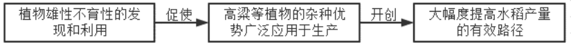
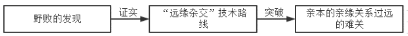

**绝密★启用前**

**2022年普通高等学校招生全国统一考试（甲卷）**

**语文**

**注意事项：**

**1.答卷前，考生务必将自己的姓名、准考证号填写在答题卡上。**

**2.回答选择题时，选出每小题答案后，用铅笔把答题卡上对应题目的答案标号涂黑。如需或动，用橡皮擦干净后，再选涂其他答案标号。回答非选择题时，将答案写在答题卡上。写在本试卷上无效。**

**3.考试结束后，将本试卷和答题卡一并交回。**

**一、现代文阅读（36分）**

**（一）论述类文本阅读（本题共3小题，9分）**

阅读下面的文字，完成下面小题。

《中国金银器》是第一部中国古代金银器通史，囊括了器皿与首饰，着眼于造型与纹饰，究心于美术与工艺、审美与生活的关系。

本书的研究旨趣，不在金银器的科学技术发展史，而在与社会生活史密切相关的造型、纹饰、风格的演变史，也可以说，它不是穷尽式的历史资料汇编，也不是用考古学的方法对器物分型、分式以划分时代，而是以目验实物为前提，从名物学入手，通过定名，以器物描述的方法，来展示工艺美术史与社会生活史中的金银器。

中国古代金银器研究，是伴随现代考古学而生的一门新兴学问。传世文献展示的金银器史和出土文物呈现出来的金银器史，是不一样的。前者显示了数量颇多的名目和使用甚巨的数目，但提供具体形象的材料很少。考古发现的实物，就名目和数量而言，虽只是载籍的冰山一角，却是以形象示人；对于工艺美术要讨论的核心问题，即造型与纹饰，它提供了最为直观的实例。

金银器兼具富与丽的双重品质。首先它是财富，其次它是一种艺术形态，然而通过销溶的办法又可使之反复改变样态以跟从时代风尚。相对于可入鉴藏的书画、金石、玉器、瓷器之雅，金银器可谓一俗到骨。它以它的俗，传播时代风尚。与其他门类相比，金银器皿和首饰的制作工艺都算不得复杂，这里便格外显示出设计的重要。

从造型设计的角度来看，工艺美术是共性多、个性少、最为贴近生活的艺术。无论哪朝哪代，祈福与怡情都是纹样设计的两大主旨，当然，不同时代表现的形式多有不同，亦即选择与创造的艺术形象不同，这也正是工艺美术史所要展示的一个主要内容。这里“史”的概念是指以贴近设计者和制作者装饰用心的感知，展示没有文字或鲜有文字却只是以成品来显示的设计史脉络，而不是贴着历史编年来勾画发展的线索。小说家说：“语言是我们的思维方式，是我们最基础、最直接的表达方式。语言也是一种建筑材料，许多意想不到的建筑物都是靠了语言一砖一瓦地搭建起来的。”历史学家则说：“我始终强调运用最基本的‘语文学’的学术方法，对传到我手中需要研究的那个文本作尽可能全面和深入的历史化和语境化处理，进而对它们作出最准确的理解和解读。”这两段话同样可以移用于作为艺术语汇的造型与纹饰。本书即是建立在对艺术语汇发生与演变的观察和分析之上。在这里呈现的是两类语言：一是物，即用造型和纹饰表达自身的艺术语言；一是文，即人对物的命名，此中包括了对物之本身和物所承载的意义的理解。

金银器工艺的发展演进，关键在于品类的丰富以及与时代风尚紧密相关的造型和纹饰的设计之妙，技术的进步并非主导。纹样设计首先取决于工匠的慧心，付诸熟练掌握传统技术的巧手，乃其第二义。纹样设计所涉及的图式演变，也包括两项主要内容：一是金银器本身设计与制作具有连续性的工艺传统，一是设计者和制作者共处的风俗与共享的文学所形成的文化生态。因此可以说，中国金银器史，很大程度上也是一部古代社会风俗史。

（摘编自扬之水《“更想工人下手难”（中国金银器）导言》）

1\. 下列关于原文内容的理解和分析，正确的一项是（ ）

A. 考古发现的金银器实物在名目和数量上远远比不上典籍记载，而其价值和意义却在典籍记载之上。

B. 考察一个时期社会的审美风尚，应先注意其时金银器皿和首饰流行的工艺设计以及对时代风尚的传播。

C. 无论哪朝哪代，金银器纹样设计都脱不开祈福与怡情两大主旨，其他工艺美术门类的纹样设计也是如此。

D. 给没有文字或鲜有文字的金银器成品命名，其所处时代的社会风俗和文化生态是命名的主要依据。

2\. 下列对原文论证的相关分析，不正确的一项是（ ）

A. 文章开宗明义，点明《中国金银器》一书的性质，概述了全书研究的对象和范畴。

B. 文章通过将金银器与书画、金石等对比，突出其品质特性，凸显了设计的重要。

C. 文章引用小说家、历史学家话，来解释将造型和纹饰视作艺术语汇的研究思路。

D. 文章末段重点论证了连续性工艺传统对金银器技术、造型和纹样设计的影响。

3\. 根据原文内容，下列说法不正确的一项是（ ）

A. 《中国金银器》一书将各种金银器实物还原到其设计和制作的时代中来展开研究。

B. 与其他艺术品相比，金银器因其“俗”，且经反复销熔，所以传世实物的数量偏少。

C. 古代金银矿石分布状况和冶炼技术的发展不在《中国金银器》一书研究视野中。

D. 古代文学作品涉及金银器的相关描述，是中国金银器造型和纹饰研究的重要参考。

**（二）实用类文本阅读（本题共3小题，12分）**

阅读下面的文字，完成下面小题。

材料一：

利用杂种优势以大幅度提高农作物产量，是现代农业科学技术的突出成就之一，植物雄性不育性的发现和利用，使不少两性花植物，如高粱、向日葵、甜菜等作物的杂种优势能广泛应用于生产。近年来，我国的杂交水稻已取得了重大突破，为大幅度提高水稻产量开创了一条有效的途径。

（摘编自袁隆平《杂交水稻培育的实践和理论》）

材料二：

遗传育种学界对水稻这一严格自花授粉作物具有杂种优势现象普遍持否定或怀疑态度，袁隆平根据自己对水稻的长期观察，经过与玉米等作物杂种优势利用现象的比较后，对水稻无杂种优势的观念提出了质疑。袁隆平于1964年正式开始水稻杂种优势利用的探索，两年后终于发现水稻具有杂种优势。根据高粱、玉米杂种优势利用的成功经验，他将这种杂交思路用于水稻物种上，由此提出了“三系法”籼稻杂交路线。所谓三系杂交水稻是指雄性不育系、保持系和恢复系三系配套育种。不育系为生产大量杂交种子提供了可能性，借助保持系来繁殖不育系，用恢复系给不育系授粉来生产育性恢复且有优势的杂交稻。从“三系法”的操作程序上讲，成功的关键首先是要找到合适的不育系材料。在认真总结多年来的研究工作的基础上，袁隆平终于认识到，后代不育性状的不理想是亲本的亲缘关系太近造成的。后代产生变异的可能性与亲本的亲缘关系呈正相关，即亲本的亲缘关系越远，后代产生变异的可能性就越大，不育性状就越明显。于是一切都变得清晰了：下一步的工作即是寻找地理远缘或遗传远缘的稻株，而在这些稻株中，野生稻或野生稻中的不育株作为亲本则是最为理想的，它极有可能突破此前不育系选育的难关。“远缘杂交”技术路线的确立，是袁隆平“三系法”杂交水稻迈向成功的关键性一步。随着雄性不育野生稻（野败）在海南的发现，“远缘杂交”的技术路线得到证明，它不仅正确而且完全可以实现。

（摘编自雷毅《科学研究中的创造性思维与方法——以袁隆平“三系”法杂交水稻为例》）

材料三：

由于杂交水稻不同熟期组合的出现，全国各地涌现出各种与杂交水稻种植相配套的新型种植模式。湖南、浙江、广东、广西、江苏、湖北等省区以种植杂交水稻为主，发展麦类与一季杂交稻、双季杂交稻、玉米与杂交稻等多种模式。这些新型模式不仅提高了土地复种指数，促进了粮食、食用油和多种经济作物的经营发展，而且培育了地力，提高了土地经济效益与生态效益。推广杂交水稻，还促使中低产稻田的面貌发生根本性变化，同时改变了农民对中低产稻田的种植评估观念。杂交水稻分蘖力强，根系发达，吸收力好，秆粗叶茂，株型好，光能转化效率高，这使中低产稻田能够获得较高的产量，与高产稻田产量的差距大大缩小。

（摘编自李晏军《中国杂交水稻技术发展研究（1964～2010）》）

4\. 下列对材料相关内容的梳理，不正确的一项是（ ）

A. 

B. 

C. 

D. 

5\. 下列对材料相关内容的概括和分析，不正确的一项是（ ）

A. 袁隆平在进行杂种优势利用的探索实践时，并没有盲从学界的权威理论，而是将杂交水稻作为自己研究的突破口。

B. 不育系材料的选育是三系配套育种技术能否实现的关键，理清这一研究思路后，袁隆平开始了寻找地理远缘或遗传远缘稻株的工作。

C. 亲本的亲缘关系越近，后代的不育性状就越不理想，这是袁隆平在认真总结多年研究工作的基础上才认识到的。

D. 杂交水稻的推广正好与全国各地涌现出的新型种植模式相配套，这些新型模式不仅提升了土地的复种指数，还培育了地力。

6\. 杂交水稻培育的成功有什么意义？请根据材料进行概括。

**（三）文学类文本阅读（本题共3小题，15分）**

阅读下面的文字，完成下面小题。

文本一：

**支队政委（节选）**

王愿坚

我做了一个梦，梦见我像是负了伤，正在爬一个崖头，怎么也爬不上去。忽然，老胡来了，他变得跟棵老黄松似的，又高又大，伸出小葵扇那么大的一只手，拉住了我……一睁眼，可不是，我的手正在他手里攥着呢。

见我醒了，他把我的手捏紧了，突然问我：“老黄，我求你个事成不成？”

“怎么不成！”我奇怪地看了他一眼。他的脸被拂晓时的月光一照，更是苍白，简直像是块白石头刻出来的。

“我让你干什么你干什么？”

“一定！”

他扭身戳了戳正在酣睡的林大富。小伙子一骨碌爬起来，愣眉愣眼地问：“政委，要出发？”

“不，有任务！”老胡说着抓起一个挎包，对我说：“咱们到那边竹林里去。”

我疑疑惑惑地背起他，来到了那片竹林边上。这时，启明星贼亮贼亮的，东方已经现出鱼肚白了。老胡四下里看了看，选了一棵大毛竹，靠在上面坐下来，又问了我一句：“真的叫你干啥你干啥？”

“真的，快说吧！”我被他弄得又糊涂又心焦。

“好！”他伸手从挎包里掏出两根绳子，“噗”的一声扔在我面前，然后两手往竹子后面一背，厉声说：“把我绑起来！”

“该不是叫伤口疼得他神经错乱了吧？”我想，本想不干，无奈已经有言在先了，我一面绑，一面问“这是干啥？你疯啦？”他没搭我的腔，只是一个劲叫着：“绑紧点，绑紧点！”等我们把他两手绑好，他又把那条伤腿伸开，蹬住了另一棵竹子：“把这也绑住！”我们也照办了。

看看我们都弄妥了，他咬咬牙说：“来，使劲挤它！”

直到这时，我才明白他的意思，我叫过小林，轻经地打开了他伤口上的布带子。伤口，像个发得过了火的开花馒头，又红又肿，没有器械，没有麻药，硬是把脓血从伤口里挤出来，这痛苦……

“快，快下手哇！”他在催我。

“我，我干不来！”我痛苦地说。

“你答应过我嘛，黄兴和同志！”他哀求似地说，“你总不能瞪着眼看我受罪呀，是不是？俗话说‘伤口出了脓，比不长还受用’，帮我挤挤就好了。好了，那不给队上减少了个累赘？又可以多帮你干点工作。”对我说完软的，又对小林来硬的：“林大富同志，‘三大纪律’头一条就是服从命今，我命令你：挤！”

我横了横心：“干！”便让小林抱住他的腿，我两手握着伤口按下去。随着手劲，我觉得手底下他的肌肉猛地哆嗦了一下。我问：“老胡，怎么样？”

“没关系，你，你别管我！”

我继续用力挤着伤口，这会儿我真想看看他是不是吃得消，却又不敢看。为了分散他的注意，减少些痛苦，我故意把话岔开来：“老胡，你看今天敌人还会不会再跟上来？”

“说……说不上…”他低声回答。他把“上”字说成了“桑”，听得出话是从牙缝里挤出来的。

“再追上来怎么办呢？”我又问。

“嗯……”他猛地抖了一下，那两株竹子也跟着索索地抖一阵。

“要是真来了，咱就再干他一下，好不好？”

“嗯……”他又是一阵猛抖。

一连两次问话没有回答，我心慌了，扭头向他望了望，只见他两手紧紧抠住地面，那被痛苦扭歪了的脸上，汗水顺着那浓黑的眉毛和鬓角，一串串地流着。

我费了好大的劲才压下想住手的打算，火辣辣地喊了声小林：“快，快去化杯盐水来！”

蓦地，竹子剧烈地颤动了一下，两片硬硬的小碎骨片跳到了我的手上，然后滑过指缝掉落到脚下的草丛里。我停住了手。这才觉得自己的脊背一阵发冷，原来衣服不知什么时候已经被汗水湿透了。

我俩把他的伤口用盐水洗净，包扎好了，然后解开绳子，扶他在草地上平躺下来。他紧闭着眼，像睡着了似的。我撩把野草擦着手，坐到他的身边，小林正在掰着他的手指，他手里紧握着一把潮湿的泥土。

太阳已经出来了。阳光淡淡地洒在他的险上。他无力地睁开了眼，深深地吸了口气，说：“老黄，痛——啊！”

汗珠映着阳光，晶亮晶亮的。我觉得自己的眼睛仿佛被这晶亮的反光刺得发痛，一滴咸咸的东西滚下来，流到了嘴角上。

（有删改）

文本二：

**长征：前所未闻的故事（节选）**

\[美\]哈里森·索尔兹伯里

陈毅的伤口始终愈合不了，到了1935年6月，他已不能行走。游击队缺医少药，只有四种成药：八公丹、万金油、人丹和济公水。陈毅把万金油涂在伤口上，再换上新纱布。不久，伤口情况有所好转。①

夏天，陈毅还能一瘸一拐地走路，可是到了9月，伤口变得疼痛难忍，腿也肿了起来，为了去南雄开会，他不得不拄着拐棍，脚步蹒跚地翻山越岭。这时他决定彻底治疗一下他的腿伤。他叫警卫员把他伤口中的脓挤出去。警卫员看到陈毅痛得脸色发白，急忙停下手来。陈毅命令他继续挤，警卫员说他下不了手。陈毅已经痛得浑身发抖，“好吧，”他说，“用绳子把我捆起来，这样我就不会发抖了。”警卫员把陈毅的腿捆在树上又继续挤，直到把脓挤净并挤出了一片碎骨头才停下。然后，用盐水冲洗了伤口，用涂过万金油的干净布包扎好。陈毅痛得像得了舞蹈病似地浑身发抖，但不久就恢复了自制力，笑着说：“这回它不会再反攻了。”的确如此，伤口彻底愈合了，再也没有发作。②

\[注\]①见陈丕显回忆录《赣南三年游击战争》。②材料来自1984年3月23日对胡华的采访。

（过家鼎等译，有删改）

7\. 下列对文本相关内容和艺术特色的分析鉴赏，不正确的一项是（ ）

A. 文本一依次写到“月光一照”“启明星贼亮贼亮”“太阳已经出来了”，既推进了情节发展，也暗示了主人公心理的变化。

B. 文本一中的老黄是小说叙述者，也是“手术”的实施者，小说通过描写他不敢下手、不敢看等情形，烘托了老胡的刚毅。

C. 文本二中陈毅“术”后笑着说“这回它不会再反攻了”，这样的话语既带着战争年代的特定色彩，也表现出陈毅的乐观与幽默。

D. 通过对老胡和陈毅战胜身体痛苦的描写，两个文本不仅写出了战斗生活的艰苦卓绝，更写出了革命信仰的巨大力量。

8\. 老胡这一人物形象有哪些特点？请结合文本一简要分析。

9\. 这两个内容相近的文本文体不同，因而艺术表现也有差异。请比较并简要分析。

**二、古代诗文阅读（34分）**

阅读下面的文言文，完成下面小题。

齐助楚攻秦，取曲沃。其后秦欲伐齐，齐、楚之交善，惠王患之，谓张仪曰：“吾欲伐齐，齐、楚方欢，子为寡人虑之，奈何？”张仪曰：“王其为臣约车并币，臣请试之。”张仪南见楚王，曰：“今齐王之罪其于敝邑之王甚厚，敝邑欲伐之，而大国与之欢。大王苟能闭关绝齐，臣请使秦王献商于之地，方六百里。若此，则是北弱齐，西德于秦，而私商于之地以为利也，则此一计而三利俱至。”楚王大说，宣言之于朝廷曰：“不榖得商于之田，方六百里。”群臣闻见者毕贺，陈轸后见，独不贺。楚王曰：“不榖不须一兵不伤一人而得商于之地六百里寡人自以为智矣诸士大夫皆贺子独不贺何也”陈轸对曰：“臣见商于之地不可得，而患必至也。”王曰：“何也？”对曰：“夫秦所以重王者，以王有齐也。今地未可得而齐先绝，是楚孤也，秦又何重孤国？且先绝齐，后责地，必受欺于张仪。是西生秦患，北绝齐交，则两国兵必至矣。”<u>楚王不听，曰：“吾事善矣！子其弭口无言，以待吾事。”</u>楚王使人绝齐。张仪反，秦使人使齐，齐、秦之交阴合。楚因使一将军受地于秦。<u>张仪知楚绝齐也，乃出见使者曰：“从某至某，广从六里。”</u>使者反报楚王，楚王大怒，欲兴师伐秦。陈轸曰：“伐秦，非计也。王不如因而赂之一名都，与之伐齐，是我亡于秦而取偿于齐也。”楚王不听，遂举兵伐秦。秦与齐合，楚兵大败于杜陵。故楚之土壤士民非削弱，仅以救亡者，计失于陈轸，过听于张仪。

（节选自《战国策·秦策二》）

10\. 下对文中划线都分的断句，正角的项是（ ）

A. 不榖不烦一兵/不伤一人而得/商于之地六百里/寡人自以智矣/诸士大夫皆贺子/独不贺/何也/

B. 不榖不烦一兵/不伤一人/而得商于之地六百里/寡人自以为智矣/诺士大夫皆贺/子独不贺/何也/

C. 不榖不烦一兵/不伤一人/而得商于之地六百里/寡人自以为智矣/诸士大夫皆贺子/独不贺/何也/

D. 不榖不烦一兵/不伤一人而得/商于之地六百里/寡人自以为智矣/诸士大夫皆贺/子独不贺/何也/

11\. 下列对文中加点的词语及相关内容的解说，不正确的一项是（ ）

A. 约车意思是约定派车，“约”与《鸿门宴》“与诸将约”的“约”字含义相同。

B. 宣言指特意宣扬某种言论，使人周知，与后来用作文告的“宣言”含义不同。

C. 孤国指孤立的国家，“孤”与《赤壁赋》“泣孤舟之嫠妇”的“孤”字含义相同。

D. 阴合意思是暗中联合，“阴”与《岳阳楼记》“朝晖夕阴”的“阴”字含义不同。

12\. 下列对原文有关内容的概述，不正确的一项是（ ）

A. 秦国想要攻打齐国，但又担心楚国作梗，因为齐国曾经帮过楚国，齐楚关系密切。秦惠王希望张仪考虑如何应对，张仪答应尝试出使楚国。

B. 张仪见到楚王，提出楚国如果能与齐国断交，秦王就会下令献上商于之地六百里，又可以削弱齐国，还能得到秦国的恩惠，这是一举三得的事情

C. 楚国群臣祝贺将得商于之地六百里，陈轸不以为然，认为秦看重楚是因为楚有齐为后援，若先绝齐后索地，一定受骗，齐秦两国都将攻打楚国。

D. 张仪返回，秦王随即派人与齐联合，拒不给楚国六百里地，楚王大怒，起兵伐秦，秦齐合力大败楚兵。楚国失败是因为没有听从陈轸而误信张仪。

13\. 把文中画横线的句子翻译成现代汉语。

（1）楚王不听，日：“吾事善矣！子其弭口无言，以待吾事。”

（2）张仪知楚绝齐也，乃出见使者日：“从某至某，广从六里。”

**（二）古代诗歌阅读（本题共2小题，9分）**

阅读下面两首宋诗，完成下面小题。

**画眉鸟**

欧阳修

百啭千声随意移，山花红紫树高低。

始知锁向金笼听，不及林间自在啼。

**画眉禽**

文同

尽日闲窗生好风，一声初听下高笼。

公庭事简人皆散，如在千岩万壑中。

14\. 下列对这两首诗的理解和赏析，不正确的一项是（ ）

A. 欧诗和文诗题目大体相同，都是以画眉鸟作为直接描写对象的咏物诗。

B. 欧诗所写的画眉鸟在花木间自由飞行，文诗中的画眉鸟则在笼中饲养。

C. 欧诗认为鸟笼内外的画眉鸟，其鸣叫声有差别，而文诗对此并未涉及。

D. 欧诗中的“林间”与文诗中的“千岩万壑”具有大致相同的文化含意。

15\. 这两首诗中，画眉鸟所起的作用并不相同。请简要分析。

**（三）名篇名句默写（本题共1小题，6分）**

16\. 补写出下列句子中的空缺部分。

（1）《诗经·卫风·氓》中男女主人公有过愉悦的往昔，“\_\_\_\_\_\_\_\_\_\_\_\_\_\_\_，\_\_\_\_\_\_\_\_\_\_\_\_\_\_\_”，就是对他们小时候欢乐相处的描写。

（2）杜甫《登高》中“\_\_\_\_\_\_\_\_\_\_\_\_\_\_\_，\_\_\_\_\_\_\_\_\_\_\_\_\_\_\_”两句都使用了叠字，从听觉、视觉上突出了对景伤怀的感受。

（3）辛弃疾《永遇乐·京口北固亭怀古》中“\_\_\_\_\_\_\_\_\_\_\_\_\_\_\_，\_\_\_\_\_\_\_\_\_\_\_\_\_\_\_”两句，表现了当年刘裕率军北伐时的强大气势。

**三、语言文字运用（20分）**

**（一）语言文字运用1（本题共3小题，11分）**

阅读下面文字，完成下面小题。

能否将珍贵的文物置于掌中观赏品味？能否步入千年墓穴一探究竟？能否与未曾展出的国宝亲密接触？……与过去相比，今天的博物馆已经发生了①\_\_\_\_\_\_\_\_\_\_\_\_\_\_\_的变化。有了科技的助力，这些往日因时空限制而②\_\_\_\_\_\_\_\_\_\_\_\_\_\_\_的事情都已成为现实。“博物馆+高科技”让那些沉睡千年的古物“活”在了今人面前，为越来越多的人带来不一样的观展体验，让他们可以去那些原本“去不了”的地方，看那些本来“看不到的事物”。

<u>故宫博物院举办的那场名为《清明上河图3.0》的高科技互动展演艺术，用现代超高清数字技术完美融合古代绘画艺术。</u>观众们沿着张择端的笔触走进繁华的北宋都城汴梁，穿梭于楼台之间，泛舟于汴河之上，观两岸人来人往，看水鸟掠过船篷。沉浸其中，确有一种③\_\_\_\_\_\_\_\_\_\_\_\_\_\_的情趣。在2016年的纪念殷墟妇好墓考古发掘四十周年特展上，首都博物馆利用虚拟技术带领观众“回到”妇好墓的考古发掘现场，上下6层、深达7.5米的妇好墓葬④\_\_\_\_\_\_\_\_\_\_\_\_\_\_\_。此外还有一些博物馆利用虚拟技术，以数字化方式展现文物全貌。观众只需在屏幕上滑动手指，就可近距离、全角度现赏文物，将静置于展柜中、封存进仓库里、消散在过往中的历史“托在手上”，全方位观察岁月留下的每一处细痕。

17\. 请在文中横线处填入恰当的成语。

18\. 文中画横线的句子有语病，请进行修改，使语言表达准确流畅。可少量增删词语，不得改变原意。

19\. 文中多处用了引号，下列四处引号中用法和其他三处不同的一项是（ ）

A. 古物“活”在了今人面前

B. 去那些原本“去不了”的地方

C. 带领观众“回到”妇好墓的考古发掘现场

D. 将静置于展柜中、封存进仓库里、消散在过往中的历史“托在手上”

**（二）语言文字运用Ⅱ（本题共2小题，9分）**

阅读下面的文字，完成下面小题。

又是一年槐花儿飘香的季节，小伙伴们有没有想起儿时那些带有妈妈专属味道的槐花美食？不过，槐花①\_\_\_\_\_\_。常见的槐花有三种：淡黄色的国槐花，夏末开花，可以入药②\_\_\_\_\_\_；白色的刺槐花（也叫洋槐花），夏初开花，花香味甜，可食用但不可入药；红色的槐花（变种）仅供观赏，既不能食用，③\_\_\_\_\_\_。也就是说，我们吃的槐花美食来自白色刺槐。白色刺槐是我国重要的蜜源、食花和景观植物，原产北美。而我国土生土长的树种，是国槐。国槐在我国不只是一种常见的良木，而且作为一种文化元素融入传统文化之中。比如被奉为“神树”，种植在敬神祭祖的社坛周围；作为吉祥的象征，种在庭前屋后。古代社会，槐树还是三公（太师、太傅、太保）宰辅之位的象征，并出现了一些由“槐”字构成的具有政治寓意的词，如槐岳（朝廷高官）、槐蝉（高官显责）、槐第（三公的宅第）等，槐树因此也受到读书人的喜爱。

20\. 请在文中横线处补写恰当的语句，使整段文字语意完整连贯，内容贴切，逻辑严密，每处不超过8个字。

21\. 下列选项中，加点的词语和文中“槐蝉”所用修辞手法不同的一项是（ ）

A. 主人下马客在船，举酒欲饮无管弦。

B. 埋骨何须桑梓地，人生无处不青山。

C. 六军不发无奈何，宛转娥眉马前死。

D. 心非木石岂无感，吞声踯躅不敢言。

**四、写作（60分）**

22\. 阅读下面的材料，根据要求写作。

《红楼梦》写到“大观园试才题对额”时有一个情节，为元妃（贾元春）省亲修建的大观园竣工后，众人给园中桥上亭子的匾额题名。有人主张从欧阳修《醉翁亭记》“有亭翼然”一句中，取“翼然”二字；贾政认为“此亭压水而成”，题名“还须偏于水”，主张从“泻出于两峰之间”中拈出一个“泻”字，有人即附和题为“泻玉”；贾宝玉则觉得用“沁芳”更为新雅，贾政点头默许。“沁芳”二字，点出了花木映水的佳境，不落俗套；也契合元妃省亲之事，蕴藉含蓄，思虑周全。

以上材料中，众人给匾额题名，或直接移用，或借鉴化用，或根据情境独创，产生了不同的艺术效果。这个现象也能在更广泛的领域给人以启示，引发深入思考。请你结合自己的学习和生活经验，写一篇文章。

要求：选准角度，确定立意，明确文体，自拟标题；不要套作，不得抄袭；不得泄露个人信息；不少于800字。
