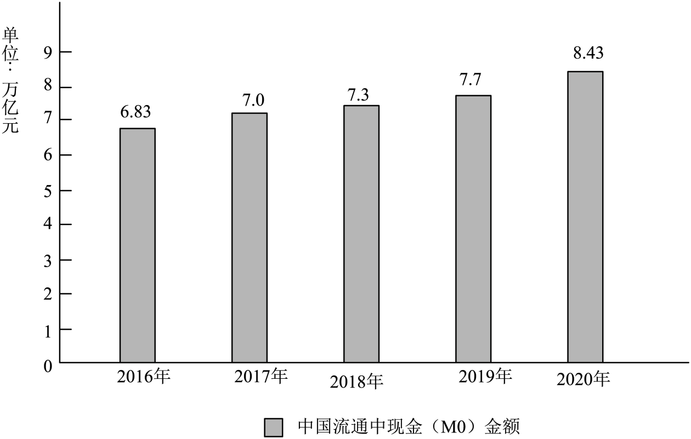
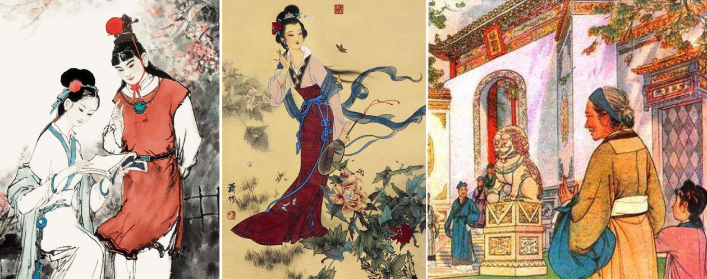

**2022年天津高考语文真题**

**一、（9分）**

阅读下面一段文字，完成下面小题。

在立春之日的“一片雪花”中拉开帷幕，在（ ）的早春时节挥手道别。中国“言必信，行必果”，为世界奉献了一届（ ）、安全、精彩的冬奥盛会，也让世界看到了“一个坚韧不拔、欣欣向荣的中国”。在开、闭幕式上，观众们目睹了“黄河之水天上来”的震撼场景，感受了冰雪五环“破冰”而出的唯美意境，欣赏了冰鞋划过冰面的轻盈曼妙，见证了“折柳寄情”与中央光束联动演绎的浪漫缱绻……全新科技美学与中国文化艺术的完美结合，打造出空灵而又壮观的视觉盛宴。一场冰雪运动的盛会，也是一次精神力量的（ ）：从攻克尖端技术难题的科研团队，到挥洒汗水的冬奥场馆建设者；从助力冰雪运动推广的农民滑雪队，到热情迎接四海宾朋的志愿者……无数人的默默奉献，共同成就了奥运盛事。北京冬奥会成功举办的意义， ，为动荡不安的世界带来了信心和希望。

（取材于《人民日报》、新华社的相关报道）

1\. 依次填入文中括号内的词语，最恰当的一组是（ ）

A. 花团锦簇 简约 焕发 B. 花团锦簇 简朴 勃发

C. 草长莺飞 简约 勃发 D. 草长莺飞 简朴 焕发

2\. 下列填入文中画线处的句子，最恰当的一项是（ ）

A. 不仅在于向世界发出了“一起向未来”的邀约，而且在于不断刷新纪录、超越自我

B. 不仅在于不断刷新纪录、超越自我，而在于向世界发出了“一起向未来”的邀约

C. 不仅在于向世界发出了“一起向未来”的邀约，而在于不断刷新纪录、超越自我

D. 不仅在于不断刷新纪录、超越自我，而且在于向世界发出了“一起向未来”的邀约

3\. 下列与文段相关的文学、文化常识，有误的一项是（ ）

A. 《论语》是语录体散文，记录了孔子及其弟子的言行。“言必信，行必果”“人皆有不忍人之心”都出自《论语》。

B. “欣欣向荣”语出东晋陶渊明《归去来兮辞》中的“木欣欣以向荣”。辞，古代的一种文体，一般要押韵。

C. “黄河之水天上来”与“蜀道之难，难于上青天”都使用了夸张的手法，体现了李白诗歌的浪漫主义风格。

D. “折柳寄情”寓含惜别怀远之意。“柳”与“留”谐音，古人离别时，有折柳枝相赠的风俗。

**二、**

阅读下面的文字，完成下面小题。

材料一：

气候变暖可改变植物、传粉者的物候，并破坏物种之间已有的互作关系。随着温度的上升，许多植物的物候期会提前，有些则会延迟；同样，气候变暖也可能导致传粉动物（例如昆虫、候鸟、哺乳类）的出现或迁徙时间提前或者延迟。但传粉动物对气候变暖的响应比植物更加敏感，这可能导致植物和传粉者间物候匹配性发生改变。最近数十年来，气候变暖导致伊比利亚半岛的传粉昆虫物候比其传粉的植物开花物候显著提前，这使得传粉昆虫与其原有授粉对象之间的互作机会显著降低。

传粉者与植物间的物候不匹配，使花资源供应短缺，可获得的有效花粉资源减少，导致传粉者种群数量下降；相应地，植物因缺乏合适的传粉者而导致传粉失败，其通过有性繁殖产生的个体的数目会急剧减少，并可能最终导致植物群落衰退。

（取材于肖宜安等《全球气候变暖影响植物——传粉者网络的研究进展》）

材料二：

将全球温升稳定在一个给定的水平意味着全球“净”温室气体排放需要大致下降到零，即在进入大气的温室气体排放和吸收的汇之间达到平衡。这一平衡通常被称为中和或净零排放。由于目前人为温室气体排放的绝大部分是CO2，因此在各国提出的中和或净零排放目标中也常用碳代指温室气体。各国提出的与中和相关的目标表述主要包括四种：气候中和、碳中和、净零碳排放和净零排放。

净零排放与气候中和的定义并不完全等同，这是因为气候中和是从对气候系统的影响出发，而净零排放则是从排放角度进行定义，零排放与零影响之间并不等同。首先，温室气体净零排放并不等同于气候净影响为零。虽然温室气体排放是人类活动对气候变化的最大贡献源，但并非唯一来源。其次，气候中和并不必然要求温室气体净零排放。有研究表明，稳定的短寿命温室气体排放并不会导致新的气候影响，因此气候中和只要求短寿命温室气体排放达到稳定而不必要求其达到零排放。

（取材于邓旭等《何谓“碳中和”？》）

材料三：

日前，中国人民银行增加天津、重庆等城市作为新一批数字人民币试点地区。天津市积极采取相关措施，促进数字经济发展，引领消费升级，助力国际消费中心城市建设。

数字人民币是由央行发行的数字形式的法定货币，以广义账户体系为基础，支持银行账户松耦合功能，与实物人民币等价，具有价值特征和法偿性，由指定机构参与运营并向社会公众提供兑换和流通服务。

数字人民币具有低成本、高效率、安全可靠等特点，是绿色低碳的货币工具和支付工具。而现金管理成本较高，其设计、印制、调运、存取、鉴别、清分、回笼、销毁以及防伪反假等环节耗费了大量人力、物力、财力。业界普遍认为，数字人民币有条件成为绿色金融的重要抓手，在推动绿色低碳生活方面具有一定价值。

（取材于《中国数字人民币的研发进展白皮书》等）

材料四：

中国人民银行的相关调查显示，近年来，虽然手机支付的交易笔数和金额均高于现金交易的笔数和金额，但是我国对流通中现金的需求量依然巨大。

（取材于《中国数字人民币的研发进展白皮书》）

4\. 根据材料一、材料二，下列理解正确的一项是（ ）

A. 相比传粉动物，植物对气候变暖响应更加敏感，它们会提前物候期以适应环境。

B. 气候变暖会导致植物和传粉者之间的物候匹配性降低，这可能造成严重的后果。

C. 碳中和是在进入大气的温室气体排放和吸收的汇之间达到的平衡，即净零排放。

D. 短寿命温室气体排放对气候不会有新的影响，也不会对动植物的物候造成影响。

5\. 根据材料三、材料四，下列与“数字人民币”相关的表述不正确的一项是（ ）

A. 数字人民币是央行发行的法定货币，与现金等价，具有价值特征，可以安全使用。

B. 相比现金，数字人民币可降低印制、运输、防伪等管理成本，减轻社会经济负担。

C. 数字人民币是绿色金融的重要抓手，在推动绿色低碳生活等方面具有积极作用。

D. 随着数字经济发展，手机支付越来越普遍，但中国流通中现金余额仍呈增长趋势。

6\. 根据以上材料，下列理解与推断正确的一项是（ ）

A. 随着气候变暖，全球植物的物候期会提前或延迟，生物多样性将遭受系统性破坏。

B. 净零排放目标达成的过程有助于保护环境，且有利于未来社会经济可持续发展。

C. 数字人民币将很快取代流通领域的现金而成为便捷高效、安全低碳的支付工具。

D. 人民币数字化在减少碳排放、改善动植物间物候、促进种群繁衍方面意义重大。

夫子曰：“不怨天，不尤人，下学而上达，知我者其天乎？”复曰：“知我者《春秋》，罪我者亦以《春秋》。”此圣人操心，不顾世人之是非也。柱厉叔事莒敖公，莒敖公不知，及莒敖公有难，柱厉叔死之。不知我则已，反以死报之，盖怨不知之深也。豫让谓赵襄子曰：“智伯以国士待我，我以国士报之。”此乃烈士义夫，有才感其知，不顾其生也。行无坚明之异，才无尺寸之用，泛泛然求知于人，知则不能有所报，不知则怒，此乃众人之心也。圣贤义烈之士，既不可到，小生有异于众人者，审己切也。审己之行，审己之才，皆不出众人，亦不求知于人，已或有知之者，则藏缩退避，<u>唯恐知之深，盖自度无可以为报效也。</u>或有因缘他事，不得已求知于人者，苟不知，未尝退有怼言怨色，形于妻子之前，此乃比于众人，唯审己求知也。

大和二年，小生应进士举。当其时，先进之士以小生行可与进，业可与修，喧而誉之，争为知己者不啻二十人。小生迩来十年江湖间，时时以家事一抵京师，事已即返。尝所谓喧而誉之为知己者，多已显贵，未尝一到其门。何者？自十年来行不益进业不益修中夜忖量自愧于心欲持何说复于知己之前为进拜之资乎默默藏缩，苟免寒饥为幸耳。

昨李巡官至，忽传阁下旨意，似知姓名，或欲异日必录在门下。阁下为世之伟人巨德，小生一获进谒，一陪宴享，则亦荣矣，况欲异日终置之于榻席之上，齿于数子之列乎？无攀缘丝发之因，出特达倜傥之知，小生自度，宜为何才可以塞阁下之求，宜为何道可以报阁下之德。是以自承命已来，审己愈切，抚心独惊，忽忽思之，而不自知其然也。

若蒙待之以众人之地，求之以众人之才，责之以众人之报，亦庶几异日受约束指顾于簿书之间，知无不为，为不及私，亦或能提笔伸纸，作咏歌以发盛德，止此而已。<u>其他望于古人，责不以及，非小生之所堪任。</u>伏恐阁下听闻之过，求取之异，敢不特自发明，导说其衷，一开阁下视听。其他感激发愤，怀愧思德，临纸汗发，不知所裁。某恐惧再拜。

（选自唐·杜牧《投知己书》）

7\. 对下列各句中加点词的解释，不正确的一项是（ ）

A. 此圣人操心 操：持

B. 形于妻子之前 形：表现

C. 齿于数子之列乎 齿：排列

D. 伏恐阁下听闻之过 过：过错

8\. 下列各句中加点词的意义和用法，相同的一组是（ ）

A. 知我者其天乎 吾其还也

B. 此乃烈士义夫 而陋者乃以斧斤考击而求之

C 时时以家事一抵京师 洎牧以谗诛

D. 非小生之所堪任 古之欲明明德于天下者

9\. 文中画波浪线的句子，断句最合理的一项是（ ）

A. 自十年来/行不益进业/不益修中/夜忖量/自愧于心/欲持何说复于知己之前/为进拜之资乎/

B. 自十年来行/不益进业/不益修中/夜忖量/自愧于心/欲持何说复于知己之前为进拜之资乎/

C. 自十年来/行不益进/业不益修/中夜忖量/自愧于心/欲持何说复于知己之前为进拜之资乎/

D. 自十年来行/不益进业/不益修中/夜忖量/自愧于心/欲持何说复于知己之前/为进拜之资乎/

10\. 下列六句分编四组，都属于作者认同的做法的一项是（ ）

①有才感其知，不顾其生 ②知则不能有所报，不知则怒 ③苟不知，未尝退有怼言怨色 ④未尝一到其门

⑤或欲异日必录在门下 ⑥求之以众人之才，责之以众人之报

A. ①②⑥ B. ①③④ C. ②③⑤ D. ④⑤⑥

11\. 下列对文章的理解与分析，不恰当的一项是（ ）

A. 文章开篇以孔子、柱厉叔、豫让三人为例，提出“知”与“不知”问题，引起下文的论述。

B. 作者参加进士考试时受到推誉、被众人引为知己，之后十年间转徙江湖，行文中不无对人情冷暖的感慨。

C. 作者在文中提到“藏缩退避”“默默藏缩”，反映了他在被人任用之后不敢积极作为的退缩心态。

D. 文章是作者写给对自己有知遇之恩崔郸的书信，表达了感激之意，但态度不卑不亢，言辞得体。

12\. 把文言文阅读材料中画横线的句子翻译成现代汉语。

（1）唯恐知之深，盖自度无可以为报效也。

（2）其他望于古人，责不以及，非小生之所堪任。

13\. 作者与众人“知”与“不知”的区别在哪里，请用自己的话概述。

14\. 阅读下面这首诗，按要求作答。

**书喜**

【南宋】陆游

雨足郊原正得晴，地绵万里尽春耕。

阴阴阡陌桑麻暗，轧轧房栊机杼鸣。

亭鼓不闻知盗息，社钱易敛庆秋成。

天公不负书生眼，留向人间看太平。

【注】作此诗时陆游乡居山阴，时年74岁。

（1）下列对这首诗理解和赏析，不恰当的一项是（ ）

A. 首联写雨过天晴，土地湿润，广袤无垠的田野上，农人忙于春耕的情景。

B. 颈联写亭中示警的鼓声止息，因此人们才能踊跃交纳社钱来举办祭祀活动。

C. 整首诗语言平易明畅、生动自然，又不乏用词上的精心锤炼，富有表现力。

D. 该诗风格不同于陆游金戈铁马式的爱国诗作，体现出诗人多样的诗歌风貌。

（2）请任选一个角度赏析颔联。

（3）诗题为“书喜”，请结合全诗指出诗人因何而喜。

15\. 补写出下列句子中的空缺部分。

（1）知人者智，\_\_\_\_\_\_\_\_\_\_\_\_\_\_。胜人者有力，自胜者强。（《老子》）

（2）大学之道，在明明德，在亲民，\_\_\_\_\_\_\_\_\_\_\_\_\_\_。（《礼记·大学之道》）

（3）\_\_\_\_\_\_\_\_\_\_\_\_\_\_，固前圣之所厚。（屈原《离骚》）

（4）风急天高猿啸哀，\_\_\_\_\_\_\_\_\_\_\_\_\_\_。（杜甫《登高》）

（5）子曰：“见贤思齐焉，见不贤而内自省也。”荀子在《劝学》中也用“\_\_\_\_\_\_\_\_\_\_\_\_\_\_，\_\_\_\_\_\_\_\_\_\_\_\_\_\_”强调了自我反思的重要性。

阅读下面的文章，完成下面小题。

**天下黄河**

卓然

我知道黄河，是父亲和母亲告诉我的。

小时候，母亲常常对我们说，夜间睡觉的时候把耳朵贴在枕头上，静静地听，可以听到黄河的涛声。秋虫唧唧，夜凉如水，我和弟弟妹妹伏在枕头上听黄河。似乎确有一阵又一阵涛声如歌传来，一忽儿澎湃交响，一忽儿宛若丝竹，隐约如春雷，又像冬天的风。

父亲曾不止一次带我们到山头上去看黄河。怕山不够高，父亲就把我们轮流架在肩膀上，说那样就一定能够望到黄河。天色微明，遥远的天地之间真的会有一条黄色或者褐色的带子，一忽儿漪波纹澜，清晰可见，一忽儿又漾漭无际，浑沦不清。这时候，父亲会很自信地指着那条涣漫而神奇的影子对我们说：“看啊，那就是黄河！”

我知道父亲指给我们看的并不是黄河，知道母亲让我们听的也不是黄河的涛声，已经是很多年以后的事情了。只是，我不知道，我远居于太行深处的父亲母亲，为什么那么喜欢黄河、向往黄河？我不知道我们的父亲母亲，为什么那么想引来黄河水，滋润儿女们的心灵，浇灌儿女们的梦？

对于这个问题，我当然要问一问父亲的。父亲听了，憨厚地笑了笑，说：“我们祖祖辈辈都是这样的厖。”父亲的话似乎只说了半截，他没有清楚地告诉我，他为什么那样喜欢黄河；也没有说清楚，我们的祖祖辈辈为什么“都是这样的”。

我能够理解了我们的祖祖辈辈“都是这样的”，是生活在我们藿谷洞的男人们和女人们慢慢告诉我的。在金色遍野的秋天，在飞雪点点的冬夜，在嫩寒勾萌的春色里，在简陋的小四合院中，在望得见河汉的草棚里，在老屋的土炕上，在村边的老槐树底，无不有祖祖辈辈用自己灵巧的或者笨拙的双手，以剪纸、面塑、泥塑、石雕、木刻、布艺、瓦器、陶瓷，表现他们心中的黄河。女人会剪一对黄河鲤鱼，剪一朵开在黄河岸上的蜡梅花儿，贴在小屋的墙上，贴在暖烘烘的炕头上，贴在匀着春光的窗户上，贴在家里的缸缸罐罐上。看上去都是富贵，感觉到都是安详，都是那么情深深而意重重，都是那么纯真而质朴。那其中的一剪一刀、一弯一铰，无不带着对黄河的向往。

最让人心动的，是回响在黄河两岸的民歌。风尘仆仆的黄河儿女，站在黄土高坡上，顶着西北风，可着嗓子吼：

“天下黄河九十九道弯厖”“东山上点灯西山上明厖”

“桃花你就红来杏花你就白厖？”

“三十三棵荞麦九十九道楞厖”

每一首歌，都是我们祖祖辈辈生命的根。似乎只有这样，我们的祖祖辈辈才活得自信，活得风光，活得滋润，活出精神。

为我们祖祖辈辈“都是这样的”，我决定去寻找黄河，去体验黄河，去寻找和体验属于我们祖祖辈辈的黄河。

我曾经不止一次站在南太行山头俯瞰黄河。早晨，当初升的太阳把第一缕鲜嫩的光投向黄河的时候，大河熔金，何其壮观啊！当落日将余晖洒在水面上的时候，黄河灿若图绣，又是何其壮美！<u>已而，水月相映，黄河又会化成一片和婉的白银色。溶溶月光，似乎柔化了黄河的桀骜不驯。此时此刻的黄河，多了点儿柔媚，多了点儿婉约与温情，多了点儿幽雅与含蓄。</u>

在我脚下，那是一条波澜雄阔，又婉娈多姿的黄河。

然而，毕竟是站在高处，毕竟是俯视黄河，我忽然就有了一种莫名的恐慌与愧疚。因为从我脚下流过的黄河，有一点瘦弱，有一点卑微。我感觉我轻慢了黄河，亵渎了黄河。于是，我决定走下太行山头，走到黄河边上，去亲近黄河，去拥抱黄河，去拜谒黄河。

时间正是晚秋，我循着曹操走过的羊肠坂徒步下山。几处残痕，几若断肠，被秋风裹在山坡上，被稀疏的荒草半掩半埋，给人一种瑟瑟发冷的感觉。石崖上，“古羊肠坂”四个老字还在，放眼望去，满目沧桑。秋风劲厉，掠过枯黄的衰草，发出尖细的哨鸣，我似乎听得见曹操在沉吟：“延颈长叹息，远行多所怀。我心何怫郁，思欲一东归。”淅淅沥沥的秋雨，把曹孟德口中吐出来的每一个字都打得又湿又冷。羊肠坂逼仄，弯弯曲曲，难道，羊肠坂也在寻寻觅觅，寻找魏武当年的鞭影？

我又在寻找什么呢？

沿着黄河向上走，一边走，一边欣赏那有生命、有思想、有灵魂的黄河之水。漪流回澜，总是能让人陷入回忆之中。

在我记忆中，黄河似乎自古以来就是一条苦难的河。灾难总是发生在春夏之交，或者夏秋之间。其时，总会有一群又一群黄泛区的灾民逃上太行山来，拥到村子里挨家挨户乞讨。太行山高，太行自古天下脊，黄河说什么也漫不上去。那些逃上山来的灾民，很少会有人在我们村子里居留不去，大都会在灾后回到黄河边上，再种粟菽，重整桑梓。那里既可以寄托生命，也可以存放心灵。他们选择了黄河，把黄河当作母亲，黄河也把他们当作儿女。母亲用圣洁的黄河水为儿女们洗礼，洗出了一身永远不能够褪去的金黄色。

唯其苦难太多，九十九道弯才弯得那么有力度，那么有刚性，那么有韧性。像一张又一张弓，发出一支又一支岁月无法阻挡的响箭，风雨无法销蚀的飞镝。

浩浩汤汤的大河，在带走泥沙的同时，是不是也带走了苦难，带走了软弱，带走了屈辱和卑怯？

又过去了数十个冬夏春秋，而今，黄河顺流而下，原来清流婉转的地方水更清了，原来浊流横涌的地方水也清了。一个又一个水上公园，柳如绿绦，荷如锦毡，桥影如虹，游人如织，笑声盈盈。这是不是黄河的时代高度呢？这是不是黄河的历史高度呢？

到了这个时候，我才理解了黄河。

天下黄河九十九道弯，弯弯曲曲，寻寻觅觅，原来黄河在寻找自己的锦绣前程厖

（选自韩小蕙编《2021中国散文年选》，有删改）

16\. 下列文中加点字的读音完全正确的一项是（ ）

A. 唧（jī）唧 漪（qí）波 憨（hān）厚

B. 笨拙（zhuó） 俯瞰（kàn） 桀骜（ào）

C. 亵渎（dú） 拜谒（yè） 逼仄（zè）

D. 粟菽（shū） 飞镝（zhé） 锦毡（zhān）

17\. 下列对文章的理解与分析，不恰当的两项是（ ）（ ）

A. 小时候，母亲让我听黄河，父亲指给我看黄河，像祖辈一样，把黄河根植于儿女心中，这为后文我寻找黄河、体验黄河做了铺垫。

B. 藿谷洞的人们用剪纸、泥塑、民歌等艺术形式来表现他们心中的黄河，寄寓祥和之意，反映出他们对当时苦难生活的不满。

C. 作者由羊肠坂古道走近黄河畔，也走“进”黄河史。历史上黄河的泛滥带来灾难，但黄河儿女以巨大的刚性与韧性重建家园。

D. 文章引用曹操的诗句渲染悲凉气氛，表现出远行的我急切盼望归家的羁旅怀乡之愁，为文章增加了文化韵味和历史厚度。

E. 文章以我对黄河的理解随年龄增长而逐渐加深为线索，在时空的切换中，用充满诗意的语言表达出深厚的情意和深沉的思索。

18\. 请赏析文中画线句子。

已而，水月相映，黄河又会化成一片和婉的白银色。溶溶月光，似乎柔化了黄河的桀骜不驯。此时此刻的黄河，多了点儿柔媚，多了点儿婉约与温情，多了点儿幽雅与含蓄。

19\. 文章多次运用对比手法，请列举说明。

20\. 纵观全文，作者通过记写黄河抒发了哪些情感？

21\. 以下三幅图均取材于古典文学名著《红楼梦》，请从中选择一幅你喜欢的，指出其所涉及的人物和相关情节，并说明喜欢的理由。要求100字左右。

22\. 阅读下面文字，完成小题。

在一代代中国科学家的努力下，“北斗”卫星导航系统、“蛟龙”号载人潜水器、“悟空”号暗物质粒子探测卫星、“鸿雁”全球卫星星座通信系统、“祝融”号火星车等大国重器纷纷涌现，你能说出这些科技成果名称的文化内涵吗？请参考示例任选一个作答。

例：“鲲龙”水陆两栖飞机。鲲是庄子在《逍遥游》中提到的大鱼，化为大鹏；龙是中国古代传说中的神物。二者都能游水飞天，“鲲龙”飞机水陆两栖的特点与之相似。

23\. 阅读下面的材料，根据要求写作。

　　烟火气是家人团坐，灯火可亲；烟火气是国泰民丰，岁月安好；烟火气是温情，是祥和，需要珍惜和守护，也需要奉献和担当。寻常烟火，就是最美的风景。

你对这段话有怎样的思考和感悟？请结合自身体验，写一篇文章。

要求：①自选角度，自拟标题；②文体不限（诗歌除外），文体特征明显；③不少于800字；④不得抄袭，不得套作。
