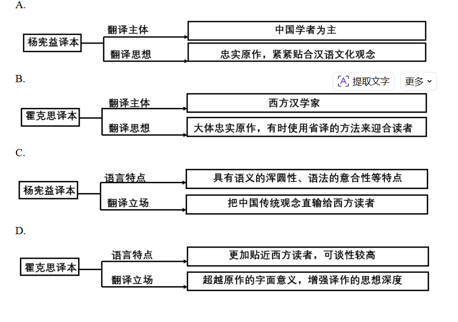

**2022年普通高等学校招生全国统一考试（新高考全国Ⅱ卷）**

**语文**

**本试卷满分150分，考试用时150分钟。**

**一、现代文阅读**

**（一）现代文阅读I**

阅读下面的文字，完成下面小题。

材料一：

多数外国学习者难以在较短的时间内触及中华文化的内核。然而，典籍英译的主要目的，是向西方世界介绍真正的中国传统文化，促进中西文化交流和发展，让西方了解真正的中国。我们应当客观、公正地看待中国典籍翻译实践和接受之间的窘况与差距，从典籍翻译大家身上汲取翻译的智慧，获取前行的指导和力量。在这方面，对杨宪益、戴乃迭（英国籍）合译的与英国人霍克斯翻译的《红楼梦》译本的比较，是一个值得我们静下心来认真思考的课题。这两个译本于20世纪70年代出版，三位译者皆因此获得巨大声誉，也同时掀起了翻译界此后对两种译本经久不息的对比研究热潮。在这过程中，我们应深入了解中国典籍的外译事实，客观分析两种译本的优长与不足，将中国的本土经验和理论与西方翻译理论相结合，取其精华，让中国的翻译研究与实践在传承和发展的良性循环中获得升华，在实践中不断培养和提高我们讲述中国故事、构建中国话语体系的时代能力。

（摘编自辛红娟《中国典籍“谁来译”》）

材料二：

翻译思想是决定译者翻译行为和翻译结果的主因，只有通过其翻译思想，读者才能理解其翻译过程中所采取的种种策略，也才能对这些策略所产生的译文进行更客观的评价。从霍克思的译本中可见，他对原文采取了大多时候“忠实不渝”、间或背信弃“意”的态度。为证此言，举个背信弃“意”的例子。《红楼梦》第一回中，曹雪芹用了一个较长的段落交代自己的写作目的，并说明选用“甄士隐”和“贾雨村”作为人物姓名的缘由，为读者理解整部小说进行铺垫。霍克思在其译本中大胆地省却了这段文字的翻译，直接从“列位看官：你道此书从何而来？”译起。霍克思的省译，显然不是漏译或者不能译，最有可能的原因，是霍克思对其译本艺术性的考量。为了实现译本与原著在艺术性方面的等值或者说最大程度的接近，霍克思将“忠实”的对象定位于篇章层面。杨宪益的翻译可以称之为“临摹式翻译”。“临摹”是初学书画之法，就是照着一幅书法或者绘画描其形而逮其神，最终达到与原作的惟妙惟肖。临摹者往往会将忠实原作视为自己对艺术的全部追求，杨宪益翻译的《红楼梦》正是这样一件艺术性高超的临摹作品。

（摘编自党争胜《霍克思与杨宪益的翻译思想刍议》）

材料三：

从当下国际学界关于两百年《红楼梦》翻译史及诸种译本的研究来看，大多数学者对杨译本和霍译本给予了充分的认可，学界就这两种译本的翻译技术性问题有着相当细致的讨论。然而我所感兴趣的不是翻译的技术性问题，而是这两位译家及两种译本的语言修辞、文化身份、翻译立场与翻译策略的差异性等问题。杨宪益译本的翻译立场与翻译策略更注重推动英语贴着汉语文化观念的地面行走，所以杨译本不可遏制地透露出把中国文化传统及其风俗观念直输给西方读者的翻译立场，这也是杨译本失去西方英语读者的重要原因之一。不同于杨译本，霍译本的翻译立场与翻译策略超越了汉语《红楼梦》的字面意义，而旨在探求汉英双语背后两种异质文化观念之间相互理解与解释的适应性。他使用西方本土读者谙熟且可以接受的地道的英语及其文化、风俗等观念，以此来创造性、补充性与生成性地重构《石头记》，从而完成了两种异质文化观念之间的转换生成。

（摘编自杨乃乔《（红楼梦）与The Story of the Stone——谈异质文化观念的不可通约性及其翻译的创造性》）

1. 下列对材料相关内容的梳理，正确的一项是（3分）

2\. 下列对材料相关内容的概括和分析，正确的一项是（3分）

A.现有汉学书目的统计表明中国学者作为典籍翻译主体的比例并不高，这与我国学者进入典籍英译领域的时间相对较晚有关。

B.中国翻译界应该増加典籍翻译的数量，改变我国典籍主要由国外学者翻译的局面，这样才能增强构建中国话语体系的能力。

C.学界对杨译本和霍译本的比较并不在翻译的技术性层面，而主要集中在其翻译立场与翻译策略的差异性问题上。

D.近年来中国文化“走出去”所遇到的障碍，让本土的翻译经验与西方翻译理论孰优孰劣成为一个学者们竞相讨论的问题。

3\. 下列对材料相关内容的分析和评价，正确的一项是（ ）

A. 材料一分析了杨译本的长处和不足，指出应当客观公正地看待中国典籍翻译实践和接受之间的窘况与差距。

B. 材料二使用“临摹”的概念，意在强调杨译本对于《红楼梦》的绝对忠实，这与霍译本的间或背信弃“意”形成了对比。

C. 材料三认为只有完成两种异质文化观念转换生成的翻译者，才有可能创造性、补充性与生成性地重构《石头记》。

D. 材料一提纲挈领，从总体述说中国典籍“谁来译”的问题，材料二和材料三则分而论之，三则材料呈现出总分的结构。

4\. 请根据材料二，简要说明杨宪益与霍克思对译文艺术性的理解有何不同。

5\. 评价一部中国典籍译本是否优秀，可以有哪些标准？请结合材料进行概括。

【答案】1. A 2. A 3. D

4\. ①杨宪益主张“临摹”式翻译，将忠实原作作为其全部艺术追求。②霍克思主张大多时候忠于原著，但出于译本艺术性考量，可以进行文字的删减。

5\. ①译本能否向西方世界介绍真正的中国传统文化，促进中西文化交流和发展。②译本能否清晰地展现译者的翻译思想。③译本能否完成两种异质文化观念之间的转换生成。

【解析】

【1题详解】

本题考查学生理解文章内容，筛选并整合文中信息的能力。

B.“迎合读者”错，材料二是说“霍克思在其译本中大胆地省却了这段文字的翻译……最有可能的原因，是霍克思对其译本艺术性的考量”。

C.“杨宪益译本”“具有语义的浑圆性、语法得到意合性等特点”错误，材料一“中国古代经典文本的语言具有语义的浑圆性、语法的意合性和修辞的空灵性这三大特点”是说中国古代经典文本的语言特点，不是杨宪益译本的特点。选项张冠李戴。

D.“增强译作的思想深度”错误，由材料二“是霍克思对其译本艺术性的考量。为了实现译本与原著在艺术性方面的等值或者说最大程度的接近”和材料三“旨在探求汉英双语背后两种异质文化观念之间相互理解与解释的适应性”可知，霍克思译本追求艺术性和探求两种异质文化观念，没有谈及思想深度。

故选A。

【2题详解】

本题考查学生分析概括作者在文中的观点态度的能力。

B.“中国翻译界应该増加典籍翻译的数量，改变我国典籍主要由国外学者翻译的局面”于文无据。材料一是说“我们应当客观、公正地看待中国典籍翻译实践和接受之间的窘况与差距，从典籍翻译大家身上汲取翻译的智慧，获取前行的指导和力量”“让中国的翻译研究与实践在传承和发展的良性循环中获得升华，在实践中不断培养和提高我们讲述中国故事、构建中国话语体系的时代能力”，

C.“学界对杨译本和霍译本的比较并不在翻译的技术性层面”错，材料三“我所感兴趣的不是翻译的技术性问题，而是这两位译家及两种译本的语言修辞、文化身份、翻译立场与翻译策略的差异性等问题”是说“我”感兴趣的，而是“学界”。

D.“近年来中国文化‘走出去’所遇到的障碍，让本土的翻译经验与西方翻译理论孰优孰劣成为一个学者们竞相讨论的问题”强加因果。材料一是说“三位译者皆因此获得巨大声誉，也同时掀起了翻译界此后对两种译本经久不息的对比研究热潮”。

故选A。

【3题详解】

本题考查学生对材料相关内容的分析和评价的能力。

A.“分析了杨译本的长处和不足”错误。原文是“我们应深入了解中国典籍的外译事实，客观分析两种译本的优长与不足”。

B.“形成对比”错误，杨宪益与霍克思对译文艺术性的理解不同，但由原文“为了实现译本与原著在艺术性方面的等值或者说最大程度的接近，霍克思将‘忠实’的对象定位于篇章层面”“临摹者往往会将忠实原作视为自己对艺术的全部追求，杨宪益翻译的《红楼梦》正是这样一件艺术性高超的临摹作品”可知，二者在忠实原著上是一致的，没有对比。

C.“只有完成两种异质文化观念转换生成的翻译者，才有可能创造性、补充性与生成性地重构《石头记》”前后顺序有误。原文是说“他使用西方本士读者谙熟且可以接受的地道的英语及其文化、风俗等观念，以此来创造性、补充性与生成性地重构《石头记》，从而完成了两种异质文化观念之间的转换生成”。

故选D。

【4题详解】

本题考查学生对文章信息的整合和对内容的理解、概括能力。

由“霍克思的译本中可见，他对原文采取了大多时候‘忠实不渝’、间或背信弃‘意’的态度”“为了实现译本与原著在艺术性方面的等值或者说最大程度的接近，霍克思将“忠实”的对象定位于篇章层面”可知，霍克思主张大多时候忠于原著，但出于译本艺术性考量，可以进行文字的删减。

由“杨宪益的翻译可以称之为‘临摹式翻译’。‘临墓’是初学书画之法，就是照着一幅书法或者绘画描其形而逮其神，最终达到与原作的惟妙惟肖。临墓者往往会将忠实原作视为自己对艺术的全部追求”可知，杨宪益主张“临摹”式翻译，将忠实原作作为其全部艺术追求。

【5题详解】

本题考查学生对文中信息进行分析、运用的能力。

由“典籍英译的主要目的，是向西方世界介绍真正的中国传统文化，促进中西文化交流和发展，让西方了解真正的中国”可概括为：译本能否向西方世界介绍真正的中国传统文化，促进中西文化交流和发展。

由“翻译思想是决定译者翻译行为和翻译结果的主因，只有通过其翻译思想，读者才能理解其翻译过程中所采取的种种策略，也才能对这些策略所产生的译文进行更客观的评价”可概括为：译本能否清晰地展现译者的翻译思想。

由“然而我所感兴趣的不是翻译的技术性问题，而是这两位译家及两种译本的语言修辞、文化身份、翻译立场与翻译策略的差异性等问题”可概括为：译本能否完成两种异质文化观念之间的转换生成。

**（二）现代文阅读Ⅱ**

阅读下面的文字，完成下面小题。

**到橘子林去**

李广田

小孩子的记忆力真是特别好，尤其是关于她特别有兴趣的事情，她总会牢牢地记着，到了适当的机会她就会把过去的事来问你，提醒你。

“爸爸，你领我去看橘子林吧，橘子熟了，满树上是金黄的橘子。”

今天，小岫忽然向我这样说，我稍稍迟疑了一会，还不等回她，她就又抢着说了：“你看，今天是晴天，橘子一定都熟了，爸爸说过领我去看的。”

我这才想起来了，那是很多天以前的事情，我曾领她到西郊去。那里满坑满谷都是橘子，但那时橘子还是绿的，她并不觉得好玩，只是说：“这些橘子几时才能熟呢？”

“等着吧，等橘子熟了，等一个晴天的日子，我就领你来看看了。”这地方阴雨的日子真是太多，偶然有一次晴天，就令人觉得非常稀罕，简直觉得这一日不能随便放过。小孩子对于这一点也该是敏感的，于是她就这样问我了。去吗，那当然是要去，并不是为了那一言的然诺，却是为了这一股子好兴致。

我们走到了大街上。今天，真是一切都明亮了起来，活跃了起来。石头道上的水洼子被阳光照着，像一面面的镜子；女人头上的金属饰物随着她们的脚步一明一灭；挑煤炭的出了满头大汗，脱了帽子，就冒出一大片蒸气，而汗水被阳光照得一闪一闪的。天空自然是蓝的了，一个小孩子仰脸看天，也许是看一只鸽子，两行小牙齿放着白光，真是好看。小岫自然是更高兴的，别人的高兴就会使她高兴，别人的笑声就会引起她的笑声。可是她可并没有像我一样关心到这些街头的景象。她毫没有驻足而稍事徘徊的意思，她的小手一直拉着我向前走，她心里一定是只想着到橘子林去。

走出城，人家稀少了，景象也就更宽阔了，也听到好多地方的流水声了，看不到洗衣人，却听到洗衣人的杵击声，而那一片山，那红崖，那岩石的纹理，层层叠叠，甚至是方方正正的，仿佛是由人工所垒成，没有云，也没有雾，崖面上为太阳照出一种奇奇怪怪的颜色，真像一架金碧辉煌的屏风，还有瀑布，看起来像一丝丝银线一样在半山里飞溅。我看着眼前这些景物，虽然手里还握着一只温嫩的小胖手，我却几乎忘掉了我的小游伴。而她呢，她也并不扰乱我，我想，她不会关心到眼前这些景物的，她心里大概只想着到橘子林去。

远远地看见一大片浓绿，我知道橘子林已经在望了，然而我们却忽然停了下来，不是我要停下来，而是她要停下来，眼前的一个故事把她吸引住了。

是在一堆破烂茅屋的前面，两个赶大车的人在给匹马修理蹄子。

我认识他们，我只是认识他们是属于这一种职业的人，而且他们还都是北方人，都是我的乡亲。他们时常叫我感到那样子的可亲近，可信任。他们把内地的货物运到边疆上出口，又把外边的货物运到内地，他们给抗战尽了不少的力量……他们两个正在忙着，他们一心一意地“对付”那匹马。你看，那匹马老老实实地站着，不必拴，也不必笼，它的一对富有感情的眼睛几乎闭起来了。不但如此，我想这个好牲口，它一定心里在想：我的大哥给我修理蹄子，我们走的路太远了，慢慢地修吧，修好了，我们就上路。慢慢地修，不错，他正在给你慢慢地修哩。他搬起一个蹄子来，先上下四周抚弄一下，再前后左右仔细端详一番，然后就用了一把锐利的刀子在蹄子的周围修理着。我为那一匹牲口预感到一种飞扬的快乐……我这样想着，看着，看着，又想着，只是顷刻之间的事情，猛一惊醒，才知道小岫的手掌早已从我的掌握中脱开了，我低头一看，却正看见她把她的小手掌偷偷地抬起来注视了一下。她是在看她自己的小指甲。而且我也看见，她的小指甲是相当长的，也颇污秽了，每一个小指甲里都藏着一点黑色的东西。

我不愿再提起到橘子林去的事，我知道小岫对眼前这件事看得入神了，我不愿用任何言语扰乱她，我看她将要看到什么时候为止。

赶马车的人把那一只马蹄子修好了，然后又丁丁地钉着铁掌。钉完了铁掌，便把马蹄子放下了。那匹马把整个的身子抖擞了一下，我说那简直就是说一声谢谢，或者是故意调皮一下。然后，人和马，不，是人跟着马，可不是马跟着人，更不是人牵着马，都悠悠然地走了，走到那破烂的茅屋里去了。那茅屋门口挂一个大木牌，上边写着拙劣的大字：“叙永骡车店”。有店就好了，我想，你们也可以少受一些风尘。

“回家。”小岫很坚决地说，而且已经在向后转了。

“回家告诉妈妈：马剪指甲，马不哭，马乖。”她拉着我向回路走。

我心里笑了，我还是没有说什么，我只是跟着她向回路走。

“我的手指甲也长了，回家叫妈妈剪指甲，我不哭，我也乖。”她这么说着，又自己看一看自己的小手。

“对，回家剪指甲，你真乖，你比马还乖。”这次我是不能不说话了，我被她拉着，用相当急促的脚步走着。

这时候，太阳已经向西天降落了，红崖的颜色更浓重了些，地上的影子也都扩大了。我们向城里走着，我们都沉默着，小岫不说话，我也不说话。“我不再去看橘子了。”她心里也许有这么一句话，也许并没有。

6\. 下列对本文相关内容的理解，正确的一项是（ ）

A. “我”决定带小岫到橘子林去，只是因为不想“随便放过”偶然到来的晴天，与她提醒“我”履行承诺无关。

B. “我”从“几乎忘掉了我的小游伴”，到不知道小岫的手掌“早已从我的掌握中脱开”，这个变化表明“我”的出游兴致变高了。

C. 赶大车的人让“我”感到可亲近、可信任，除了他们“都是北方人，都是我的乡亲”，还因为他们为抗战做出了贡献。

D. 返回城里的路上，“小岫不说话，我也不说话”，父女二人的沉默表明他们对未到达橘子林感到有点失落。

7\. 下列对本文艺术特点的分析鉴赏，正确的一项是（ ）

A. “我的大哥给我修理蹄子，我们走的路太远了，慢慢地修吧，修好了，我们就上路。”这一句将马人格化，写出了马对车夫的感情，生动而饶有趣味。

B. “我”在判断小岫对去橘子林的态度时，用语从“定”变为后来的“也许”，暗示小岫的心理变得难以琢磨了。

C. 小岫让“我”领她去橘子林，实际上全程“我”都是由她拉着走的，由此可见，小岫的言行决定着本文的节奏。

D. 本文借助小孩子的视角，先后描写了街道、山林、骡车店等处的景象，看似散漫，实则突出主题，使本文具有形散神聚的特点。

8\. “我”和小岫最终放弃去橘子林，本文却仍以“到橘子林去”为题，请简要谈谈你的理解。

9\. 本文的童趣往往通过细节体现出来，请指出三处这样的细节并简要分析。

【答案】6. C 7. D

8\. ①结构上：“到橘子林去”是全文的线索，小岫要去橘子林引出父女二人在路上的所见所感。②感情上：“到橘子林去”的路上，“我”和小岫的情感发生了变化，最终感受到了劳动人民的伟大力量。

9\. ①第6段对街道的景物描写，如“水洼子被阳光照着，像一面面的镜子……一个小孩子仰脸看天……真是好看”语言接近孩童的用语。②第10段修马蹄的场面描写和对马的心理的猜测，是借助儿童的视角展开的，富有想象力。③第10段，小岫看到修马蹄后，“把她的小手掌偷偷地抬起来注视了一下”这一细节描写，体现了孩童的纯真想法。

【解析】

【6题详解】

本题考查学生理解文中内容的能力。

A.“只是因为不想‘随便放过’偶然到来的晴天，与她提醒‘我’履行承诺无关”错，结合“这地方阴雨的日子真是太多，偶然有一次晴天，就令人觉得非常稀罕，简直觉得这一日不能随便放过。小孩子对于这一点也该是敏感的，于是她就这样问我了。去吗，那当然是要去，并不是为了那一言的然诺，却是为了这一股子好兴致”分析，选项表述绝对，还因为“好兴致”。

B.“出游兴致变高了”错，“是在一堆破烂茅屋的前面，两个赶大车的人在给匹马修理蹄子”“我为那一匹牲口预感到一种飞扬的快乐……我这样想着，看着，看着，又想着，只是顷刻之间的事情，猛一惊醒，才知道小岫的手掌早已从我的掌握中脱开了”，可见并非出游兴致变高了，而是出游路上的遇见引发我感触良多。

D.“父女二人的沉默表明他们对未到达橘子林感到有点失落”错，没有失落，结合“‘我不再去看橘子了。’她心里也许有这么一句话，也许并没有”分析，并非失落，而是小孩子的注意力转变，心思不在橘子林了。结合“我心里笑了”分析“我”不仅不失落，反而倍感欣慰，为孩子的成长——“对，回家剪指甲，你真乖，你比马还乖。”

故选C。

【7题详解】

本题考查学生对本文艺术特点的分析鉴赏能力。

A.“写出了马对车夫的感情”错，这是“我”的心理活动，站在“马”的角度想象而已，马未必真有这样的感触或想法。

B.“暗示小岫的心理变得难以琢磨了”错，无论“一定”还是“大概”“也许”都是“我”作为父亲对孩子心思的猜测而已，并非难以琢磨，从中反而可见“我”是能“读”懂小孩子心理的。

C.“小岫的言行决定着本文的节奏”错，本文以“我”（第一人称）为写作的视角，本文的节奏是由“我”来掌控，写“我”眼见耳听心感。

故选D。

【8题详解】

本题考查学生理解分析标题意蕴和结构思路能力。

结合“爸爸，你领我去看橘子林吧，橘子熟了，满树上是金黄的橘子。”“我们走到了大街上。今天，真是一切都明亮了起来，活跃了起来”“可是她可并没有像我一样关心到这些街头的景象。她毫没有驻足而稍事徘徊的意思，她的小手一直拉着我向前走，她心里一定是只想着到橘子林去”“走出城，人家稀少了，景象也就更宽阔了，也听到好多地方的流水声了，看不到洗衣人，却听到洗衣人的杵击声，……崖面上为太阳照出一种奇奇怪怪的颜色，真像一架金碧辉煌的屏风，还有瀑布，看起来像一丝丝银线一样在半山里飞溅。我看着眼前这些景物”“远远地看见一大片浓绿，我知道橘子林已经在望了，然而我们却忽然停了下来，不是我要停下来，而是她要停下来，眼前的一个故事把她吸引住了”“是在一堆破烂茅屋的前面，两个赶大车的人在给匹马修理蹄子”“我认识他们，我只是认识他们是属于这一种职业的人，而且他们还都是北方人，都是我的乡亲”“我不愿再提起到橘子林去的事，我知道小岫对眼前这件事看得入神了，我不愿用任何言语扰乱她，我看她将要看到什么时候为止”分析，结构上：“到橘子林去”是全文的线索，小岫要去橘子林引出父女二人在路上的所见所感，先是交待孩子要去橘子林，然后写一路所见的街道上的人，以及自然美景，后来重点写两人看赶车人钉马蹄的事情。

由“我认识他们，我只是认识他们是属于这一种职业的人，而且他们还都是北方人，都是我的乡亲。他们时常叫我感到那样子的可亲近，可信任。他们把内地的货物运到边疆上出口，又把外边的货物运到内地，他们给抗战尽了不少的力量”可知，感情上：“到橘子林去”的路上，“我”和小岫的情感发生了变化，最终感受到了劳动人民的伟大力量。

【9题详解】

本题考查学生理解艺术特色并筛选提取信息归纳要点的能力。

①第6段“石头道上的水洼子被阳光照着，像一面面的镜子；女人头上的金属饰物随着她们的脚步一明一灭；挑煤炭的出了满头大汗，脱了帽子，就冒出一大片蒸气，而汗水被阳光照得一闪一闪的。天空自然是蓝的了，一个小孩子仰脸看天，也许是看一只鸽子，两行小牙齿放着白光，真是好看”对街道的景物描写，如“水洼子被阳光照着，像一面面的镜子……一个小孩子仰脸看天……真是好看”语言接近孩童的用语。

②第10段“它一定心里在想：我的大哥给我修理蹄子，我们走的路太远了，慢慢地修吧，修好了，我们就上路。慢慢地修，不错，他正在给你慢慢地修哩”“他们两个正在忙着，他们一心一意地‘对付’那匹马。你看，那匹马老老实实地站着，不必拴，也不必笼，它的一对富有感情的眼睛几乎闭起来了”修马蹄的场面描写和对马的心理的猜测，是借助儿童的视角展开的，富有想象力。

③第10段，“我低头一看，却正看见她把她小手掌偷偷地抬起来注视了一下。她是在看她自己的小指甲。而且我也看见，她的小指甲是相当长的，也颇污秽了，每一个小指甲里都藏着一点黑色的东西”，小岫看到修马蹄后，“把她的小手掌偷偷地抬起来注视了一下”这一细节描写，体现了孩童的纯真想法。

**二、古代诗文阅读**

**（一）文言文阅读**

阅读下面的文言文，完成下面小题。

吴汉，字子颜，南阳人。韩鸿为使者，使持节，徇河北，人为言：“吴子颜，奇士也，可与计事。”吴汉为人质厚少文造次不能以辞语自达邓禹及诸将多所荐举再三召见其后勤勤不离公门上亦以其南阳人渐亲之上既破邯郸，诛王郎，召邓禹宿，夜语曰：“吾欲北发幽州突骑，诸将谁可使者？”<u>禹曰：“吴汉可。禹数与语，其人勇鸷有智谋，诸将鲜能及者。”</u>上于是以汉为大将军。汉遂斩幽州牧苗曾，上以禹为知人。吴汉与苏茂、周建战，汉躬被甲持戟，告令诸部将曰：“闻鼓声皆大呼俱进，后至者斩。”遂鼓而进，贼兵大破。北击清河长垣及平原五里贼，皆平之。

吴汉伐蜀，分营于水南水北，北营战不利，乃衔枚引兵往合水南营，大破公孙述。吴汉兵守成都，公孙述将延岑遗奇兵出吴汉兵后，袭击破汉，汉堕水，缘马尾得出。吴汉性忠厚，笃于事上，自初从征伐，常在左右，上未安，则侧足屏息，上安然后退舍。兵有不利，军营不完，汉常独缮檠其弓戟，阅其兵马，激扬吏士。上时令人视吴公何为，还言方作战攻具，上常曰：“吴公差强人意，隐若一敌国矣。”封汉广平侯。吴汉尝出征，妻子在后买田业。<u>汉还，让之曰：“军师在外，吏士不足，何多买田宅乎！”</u>遂尽以分与昆弟外家。吴汉爵位奉赐最尊重，然但治宅，不起巷第。夫人先死，薄葬小坟，不作祠堂，恭俭如此。疾笃，车驾亲临，问所欲言。对曰：“臣愚无所识知，唯愿慎无赦而已。”病甍，奏谥曰：“有司议宜以为武。”诏特赐曰忠侯。

（节选自《东观汉记》卷十）

10\. 下列对文中画波浪线部分的断句，正确的一项是（ ）

A. 吴汉为人质厚少文造次/不能以辞语自达/邓禹及诸将多所荐举/再三召见/其后勤勤不离公门/上亦以其南阳人/渐亲之/

B. 吴汉为人质厚少文/造次不能以辞语自达/邓禹及诸将多所荐举/再三召见/其后勤勤不离公门上/亦以其南阳人/渐亲之/

C. 吴汉为人质厚少文/造次不能以辞语自达/邓禹及诸将多所荐举/再三召见/其后勤勤不离公门/上亦以其南阳人/渐亲之/

D. 吴汉为人质厚少文造次/不能以辞语自达/邓禹及诸将多所荐举/再三召见/其后勤勤不离公门上/亦以其南阳人/渐亲之/

11\. 下列对文中加点的词语及相关内容的解说，不正确的一项是（ ）

A. 衔枚指在口中横衔着枚。枚的形状像筷子，是古代行军时用以禁止喧哗的器具。

B. 差强人意，文中指表现较差，不能令人满意，后来的意思转变为勉强令人满意。

C. 尊重，文中是尊贵显要的意思，现在一般表示敬重、重视，二者的意思不同。

D. 车驾，文中以帝王所乘车马代指帝王，与古诗文中“丝竹”代指音乐用法相同

12\. 下列对原文有关内容的概述，不正确的一项是（ ）

A. 邓禹向皇上推荐吴汉承担调发幽州军队的任务，皇上命吴汉为大将军，吴汉斩幽州牧苗曾，完成使命，皇上赞赏邓禹有知人之明。

B. 吴汉伐蜀，在水南水北，分设大营，北营不利，合兵南营，大破公孙述，但后来被延岑袭击后方，吴汉落水，拉着马尾才得以脱险。

C. 吴汉为人质朴，忠心耿耿，深得皇上的信任，他跟着皇上征战四方时，常常随从左右，小心侍卫总是等到皇上安歇后才退出去。

D. 吴汉处世俭朴恭敬谨慎，不置田产，不起巷第，他出征在外时家人曾置买一些田产宅业，他归来后全部都分送给了故旧部署。

13\. 把文中画横线的句子翻译成现代汉语。

（1）禹曰：“吴汉可。禹数与语，其人勇鸷有智谋，诸将鲜能及者。”

（2）汉还，让之曰：“军师在外，吏士不足，何多买田宅乎！”

14\. 《后汉书·吴汉传》用孔子的“刚毅木讷近仁”一语来赞誉吴汉，请简要概述吴汉的刚毅与木讷之处。

【答案】10. C 11. B 12. D

13\. （1）邓禹说：“吴汉可以。我多次和他交谈，他这个人勇敢凶猛有智慧谋略，各将领中少有能比得上的。”

（2）吴汉回来，责备她说：“军队在外面，官兵（费用）不足，为什么购买那么多田产宅业呢！”

14\. ①刚毅：吴汉与敌军作战时，亲自披甲持戟，命令将士们拼死杀敌，最终大破敌军；作战不幸落水后，拉着马尾脱险。

②木讷：仓促之间不能用言语表达清楚自己的意思；临终对皇上所说的仍是国家之事。

【解析】

【10题详解】

本题考查学生文言文断句的能力。

句意：吴汉为人朴实、厚道，说话缺少有文采，匆忙时（常常）不能表达自己的真实意图。邓禹和诸位将领多次举荐吴汉，多次被皇上召见，这以后吴汉工作辛勤努力不离开衙署，光武帝也因为他是南阳人，逐渐与他亲近。

“质厚少文”是对吴汉的评价，后面断开；“造次”是“不能以辞语自达”的状语，不能分开，排除AD；

“上”是指光武帝刘秀，是“亦以其南阳人”的主语，不能分开，排除B。

故选C。

【11题详解】

本题考查学生了解并掌握常见的文学文化常识的能力。

B.“文中指表现较差，不能令人满意”错，光武帝说“吴公差强人意，隐若一敌国矣”，意思是，吴汉比较令人满意，他隐然就是一个对国家有举足轻足影响的人。可见“差强人意”在文中也是表现令人满意的意思。

故选B。

【12题详解】

本题考查学生理解文章内容的能力。

D.“全部都分送给了故旧部署”错。原文是“尽以分与昆弟外家”，“昆弟”是家族兄弟，“外家”是母亲、妻子的娘家人。

故选D。

【13题详解】

本题考查学生理解并翻译文言文句子的能力。

（1）“数”，多次；“语”，交谈；“勇鸷”，勇敢凶猛；“鲜”，少。

（2）“让”，责备；“军师”，军队；“何”，为什么。

【14题详解】

本题考查学生对人物进行评价探究的能力。

刚毅之处：“吴汉与苏茂、周建战，汉躬被甲持戟，告令诸部将曰：‘闻鼓声皆大呼俱进，后至者斩。’遂鼓而进，贼兵大破”，吴汉与敌军作战时，亲自披甲持戟，命令将士们拼死杀敌，最终大破敌军；“公孙述将延岑遗奇兵出吴汉兵后，袭击破汉，汉堕水，缘马尾得出”，作战不幸落水后，拉着马尾脱险。

木讷之处：“造次不能以辞语自达”，仓促之间不能用言语表达清楚自己的意思；“疾笃，车驾亲临，问所欲言。对曰：‘臣愚无所识知，唯愿慎无赦而已。’”，临终对皇上所说的仍是国家之事。

参考译文：

吴汉，字子颜，南阳郡宛县人。韩鸿做使者，（光武帝）让他拿着旌节，巡视河北地界。有人对韩鸿说：“吴子颜，是位奇异之人，可和他商议大事。”吴汉为人朴实、厚道，说话缺少有文采，仓促间不能表达自己的真实意图。邓禹和诸位将领多次举荐吴汉，多次被皇上召见，这以后吴汉工作辛勤努力不离开衙署，光武帝也因为他是南阳人，逐渐与他亲近。光武帝已经攻下了邯郸，诛杀了王朗，召见邓禹同宿，夜里跟他交谈说：“我想要向北派遣攻打幽州的骑兵，各位将领谁能够胜任？”邓禹说：“吴汉可以。我多次和他交谈，他这个人勇敢凶猛有智慧谋略，各将领中少有能比得上的。”光武帝于是让吴汉担任大将军。吴汉于是斩杀了幽州牧苗曾。光武帝于是认为邓禹能了解人。吴汉与苏茂、周建交战，亲自披上铠甲拿着戟，命令诸将说：“听到鼓声全部大呼前进，后退的斩。”于是击鼓进军，贼兵打败。向北进攻清河长垣及平原五里的敌军，全部平定了他们。

吴汉攻打蜀地，在水南水分开扎营，北营作战不利，于是让士兵衔枚前往汇合水南营，大败公孙述。吴汉带兵驻守成都，公孙述率领延岑留下的奇兵出现在吴汉军队后面，袭击并大败了吴汉，吴汉坠落水中，拽着马尾巴才得出上来。吴汉性格忠诚醇厚，做事忠实，自从当初跟随光武帝征战以来，常常陪伴在光武帝左右，光武帝没有安睡，吴汉就侧立一旁屏息侍奉，光武帝睡得踏实了他才后退去休息。交战出现不利，军营武器不完备，吴汉常常独自修缮矫正弓弩，检阅那些兵马，激励将士。光武帝有时派人看吴公在做什么，派出的人回来说正在准备作战进攻的装备。刘秀于是叹息说：“吴汉比较令人满意，他隐然就是一个对国家有举足轻足影响的人。”封吴汉为广平侯。吴汉曾经有一次出征，妻子儿女们在后方购置田产。吴汉回来后，就责备她说：“军队在外面，官兵（费用）不足，为什么购买那么多田产宅业呢！”于是尽数分给了兄弟和母亲、妻子的娘家人。吴汉爵位奉赐尊贵显要，然而只修宅院，不起巷第。他的夫人先去世，只是简单下葬，修了一座小坟，没有盖祠堂，他就像这样恭敬节俭。病重，皇帝亲自看视，问他还有什么话想说。吴汉回答说：“为臣愚昧而没有什么见识，只希望陛下千万不要动辄大赦天下。”逝世后，有关部门上奏谥号说：“有司商议应该用‘武’。”光武帝下诏赐谥号为忠侯。

**（二）古代诗歌阅读**

阅读下面这首唐诗，完成下面小题。

**送别**

李白\[唐代\]

寻阳五溪水，沿洄直入巫山里。

胜境由来人共传，君到南中自称美。

送君别有八月秋，飒飒芦花复益愁。

云帆望远不相见，日暮长江空自流。

15\. 下列对这首诗的理解和赏析，不正确的一项是（ ）

A. 根据本诗内容可知，诗人的友人即将乘船出发，沿水路驶往三峡方向。

B. 诗人表示友人将去的地方景色优美，而友人的风采正与这美景相称。

C. 本诗最后两句的表达方式，在《黄鹤楼送孟浩然之广陵》中也曾使用。

D. 诗中前后两次使用“君”，都是指即将离别的友人，含义并无不同。

16\. 本诗是如何表现离愁别绪的？请结合内容简要分析。

【答案】15. B 16. ①寓情于景：诗人送别友人，遇芦花飒飒作响，离愁更甚，此景烘托了诗人与友人分别的依依不舍的离情。②以景结情：诗人以消失不见的船帆和“空自流”的长江之景作结，孤寂凄冷的意境更加衬托出离愁别绪的浓重。

【解析】

【15题详解】

本题考查学生理解诗歌内容鉴赏艺术特色的能力。

B.“而友人的风采正与这美景相称”错，结合“胜境由来人共传，君到南中自称美”分析，只是说即将去的那里的风景一直为世人所传颂，友人到了一定会很喜欢，没有选项中意思。

故选B。

【16题详解】

本题考查学生理解诗歌思想感情分析写作技巧的能力。

“飒飒芦花复益愁”意思是说在这芦花被风吹动的飒飒声中我更觉忧愁，写秋天送别友人，本就依依不舍，兼之萧瑟凄凉的景象，心情愈加惆怅哀愁。寓情于景情景交融，渲染悲伤的气氛，一派衰败的景象中，诗人因离别而伤感的情绪浓重，可见友情之深厚，难舍难分。

结尾“云帆望远不相见，日暮长江空自流”写远眺友人的船帆已经看不见了，只有日暮下的长江独自流淌，以景结情，委婉含蓄，诗人远望友人离去，直至船帆消逝于视线，可见遥望时间之长久，以杳无踪影的船帆和一去不复返的长江水作结，景象中融入了诗人万般情结，与友人分别后的孤独寂聊凄冷的心境让读者能够以形象的画面中身临其境，更加衬托出离愁别绪的浓重，极具感染力。

**（三）名篇名句默写**

17\. 补写出下列句子中的空缺部分。

（1）曹操《短歌行》中“\_\_\_\_\_\_\_\_\_\_\_\_\_\_\_\_\_\_\_\_，\_\_\_\_\_\_\_\_\_\_\_\_\_\_\_\_\_\_\_\_”两句，后世一直传诵不已，苏轼《赤壁赋》中就曾引用过。

（2）刘禹锡《酬乐天扬州初逢席上见赠》中“\_\_\_\_\_\_\_\_\_\_\_\_\_\_\_\_\_\_\_\_，\_\_\_\_\_\_\_\_\_\_\_\_\_\_\_\_\_\_\_\_”两句，交代了诗人贬谪之地的偏僻与被贬时间之久。

（3）花与鸟既是传统绘画作品中的重要题材，又常常在古代诗歌中对举出现，如“\_\_\_\_\_\_\_\_\_\_\_\_\_\_\_\_\_\_\_\_，\_\_\_\_\_\_\_\_\_\_\_\_\_\_\_\_\_\_\_\_”。

【答案】 ①. 月明星稀 ②. 乌鹊南飞 ③. 巴山楚水凄凉地 ④. 二十三年弃置身 ⑤. 感时花溅泪 ⑥. 恨别鸟惊心（春去花还在 人来鸟不惊/江碧鸟逾白 山青花欲燃）

【解析】

【详解】本题考查学生默写常见的名篇名句的能力。

易错字词有：乌、鹊、置、溅。

**三、语言文字运用**

**（一）语言文字运用I**

阅读下面的文字，完成下面小题。

“飞天梦永不失重，科学梦张力无限”，2022年3月23日下午第三次“天宫课堂”如约举行，在约400公里高的环地球轨道上，神舟十三号航天员翟志刚、王亚平、叶光富三人携手开讲，<u>在近一小时的授课过程中，丰富多彩的科学实验在现场演示，还以天地连线的方式回答了地面学生的问题，并通过多种媒体平台，向全球同步直播此次“天宫课堂”。</u>

抛出去的北京冬奥会吉祥物“冰墩墩”没有沿抛物线方向下降坠落，而是给人以沿着直线匀速运动的感觉，植物油与水在小瓶中混合后，不能自然分离，而用绳子拴住瓶子甩上一阵后，水与油成功分离……第三次“天宫课堂”这些 <u>①</u> 的瞬间启发很多学生不断思考、回味，兴趣盎然地追寻背后的科学道理。

“天宫课堂”开始于2013年6月20日。彼时，神舟十号航天员王亚平在同伴的配合下，华丽转身为 <u>②</u> 的科学课教师，在天宫一号空间实验室进行了中国首次太空授课，演示了失重环境下独特的物理现象，并和地面的学生进行了 <u>③</u> 的天地互动交流。此后又于2021年和今年两度开课，大大激发了广大青少年探求科学规律、探索宇宙奥秘的热情。

18\. 请在文中横线处填入恰当的成语。

19\. 文中画横线部分有语病，请进行修改，使语言表达准确流畅，可少量增删词语，不得改变原意。

【答案】19 ①扣人心弦 ②循循善诱 ③热火朝天

在近一小时的授课过程中，不仅现场演示了丰富多彩的科学实验，还以天地连线的方式回答了地面学生的问题。通过多种媒体平台，此次“天宫课堂”向全球同步直播。

【解析】

【19题详解】

本题考查学生正确使用成语的能力。

第一空：根据原文“抛出去的北京冬奥会吉祥物冰墩墩没有沿抛物线方向下降坠落，而是给人以沿着直线匀速运动的感觉，植物油与水在小瓶中混合后，不能自然分离，而用绳子拴住瓶子甩上一阵后，水与油成功分离”“瞬间启发很多学生不断思考、回味，兴趣盎然地追寻背后的科学道理”，这些事物能够让人心情激动，引起共鸣，故此空可填“扣人心弦”。扣人心弦：形容使人非常激动或能牵动人心。多指诗文、表演等感染力强，牵动人心。

第二空：根据原文“舟十号航天员王亚平在同伴的配合下，华丽转身为科学课教师，在天宫一号空间实验室进行了中国首次太空授课，演示了失重环境下独特的物理现象”，可知，此处在讲王亚平为孩子们授课，所以用“循循善诱”。循循善诱：指循序渐进的诱导。

第三空：根据原文“并和地面的学生进行了的天地互动交流，此后又于2021年和今年两度开课，大大激发了广大青少年探求科学规律、探索宇宙奥秘的热情”，可知，此处在讲王亚平和孩子们的互动，后文强调激发了广大青少年探求科学规律、探索宇宙奥秘的热情，所以用“热火朝天”。热火朝天：形容群众性运动或工作达到热烈高涨的境界，就像炽热的烈火朝天熊熊燃烧一般。

本题考查学生辨析并修改病句的能力。

文中画横线的句子有三处语病：

主宾倒置，“科学实验”应为宾语，所以把“现场演示”提前；

“向全球同步直播此次‘天宫课堂’”中“此次‘天宫课堂’”应为主语，所以它要提前，删掉“并通过多种媒体平台”的“并”；

关联词缺失，后文用到了“还”，所以在“现场演示”前加上“不仅”。

**（二）语言文字运用Ⅱ**

阅读下面的文字，完成下面小题。

这小城并不怎样繁华，只有两条大街，一条从南到北，一条从东到西，而最有名的算是十字街了。十字街口集中了全城的精华。十字街上有金银首饰店、布庄、油盐店、茶庄、药店，也有拔牙的洋医生。

这小城里面以前住着我的祖父，现在埋着我的祖父。

<u>我生的时候，祖父已经六十多岁了。我长到四五岁，祖父就快七十了。我还没有长到二十岁，祖父就七八十岁了。祖父一过八十，祖父就死了。</u>

从前那后花园的主人，而今不见了。

那园里的蝴蝶，蚂蚱，蜻蜓，也许还是年年仍旧，也许现在完全荒凉了。

小黄瓜，大倭瓜，也许还是年年的种着，也许现在根本没有了。

那早晨的露珠是不是还落在花盆架上，那午间的太阳是不是还照着那大向日葵，那黄昏时候的红霞是不是还会一会儿工夫变出来一匹马来，一会儿工夫变出来一匹狗来，那么变着。

20\. 文中写到自己的祖父，没有一处使用“他”，这样写有什么好处？

21\. 文中画横线的部分突出了“祖父”的衰老死亡和“我”的成长是一个同时发生的逐渐变化的过程，这一表达效果是怎么取得的？

22\. 文中画波浪线的部分除了比拟以外还使用了哪种修辞手法？请结合原文分析其表达效果。

【答案】20. “他”是人称代词，用来称自己和对方以外的某个人，文中不使用这个第三人称代词来指代祖父，表明不曾将祖父看作“我”和读者以外的人。直称其为“我的祖父”“祖父”，能让人感受到祖孙二人的亲密关系，体会到“我”对祖父深沉的爱和深切的怀念。

21\. ①以时间为序，将“我”与祖父的年龄对举，形成鲜明对比。\
②反复使用“我……，祖父……”的句式，不断强化祖父由衰老至死亡与“我”由出生至成长的同时发生的逐渐变化的过程。

22\. 排比。\
①使内容丰富：以三个结构为“那……是不是还……”的句子，用细腻的笔触从不同角度一一展现“我”对园中各种美好景物的回忆。\
②增强语势：三个结构相似的句子排列连用，有力地抒发了“我”对曾经的乐园的无限怀念和一切美好终将逝去的惆怅。

【解析】

【20题详解】

本题考查学生理解分析文中人称或写作视角作用的能力。

“他”是第三人称视角，属于代词，用来称自己和对方以外的某个人，文中不使用这个代词而是称呼祖父，表明作者对祖父的情感深厚，从来不曾把祖父看作自己之外和读者以外的第三人，“我的祖父”“祖父”这些称呼中，能让人不仅感受到“我”对祖父的爱戴和敬重，还能够深入体会祖孙二人的亲密感情，体会到“我”对祖父深厚的爱和永恒的怀念，无论时间过去多久，祖父离开“我”多久，“这小城里面以前住着我的祖父，现在埋着我的祖父”祖父永远是“我的祖父”，活在“我”心里眼前，历历在目，正如这一年四季年年依旧的花草一样，鲜活着，亲切可感，而非冷冰冰的“他”。

【21题详解】

本题考查学生理解分析句子表达效果的能力。

“我生的时候，祖父已经六十多岁了”“我长到四五岁，祖父就快七十了”“我还没有长到二十岁，祖父就七八十岁了”“祖父一过八十，祖父就死了”，以时间为序，将“我”与祖父的年龄对举，形成鲜明对比，数字的变化中是祖父的老迈，“我”的长大成熟，从中可见岁月无穷，但人有意，自然规律下“我”难以留住祖父，但会懂得这些数字的意义，并努力珍惜用心对待与祖父在一起的幸福美好，并留驻心底。

使用排比修辞，用“我……，祖父……”的表达句式，间隔反复中不断强化突出祖父由衰老至死亡与“我”由出生至成长的同时发生的逐渐变化的过程，表达了“我”与祖父的深厚感情，以及对祖父的不舍，语言简单但情感深厚，可谓言简义丰，耐人寻味，启发读者思考，并用心对待生活，珍惜与亲人在一起的年年岁岁分分秒秒。

【22题详解】

本题考查学生理解分析修辞手法以及表达效果的能力。

“那早晨露珠是不是还落在花盆架上，那午间的太阳是不是还照着那大向日葵，那黄昏时候的红霞是不是还会一会儿工夫变出来一匹马来……”中使用了排比，使内容丰富，露珠、太阳、红霞，随着时间的变化景物变化，多角度多侧面联想想象：

以三个结构为“那……是不是还……”的句子，整齐对称，抑扬顿挫朗朗上口，音韵和谐，用细腻的笔触从不同视角一一展现“我”对园中各种美好景物的回忆，极富感染力，排比修辞增强语势。

三个结构相似的句子排列连用，以时间为序，从早晨到午间，最后到黄昏时候，分别对应三个意象，抓住了景物特点，具有景物定格的效果，用特写镜头有力地抒发了“我”对曾经的乐园的无限怀念，“变着”，寄寓了一切美好终将逝去的惆怅。

**四、写作**

23\. 阅读下面的材料，根据要求写作。

　　中国共产主义青年团成立100周年之际，中央广播电视总台推出微纪录片，介绍一组在不同行业奋发有为的人物。他们选择了自己热爱的行业，也选择了事业创新发展的方向，展示出开启未来的力量。

　　有位科学家强调，实现北斗导航系统服务于各行各业，“需要新方法、新思维、新知识”。她致力于科技攻关，还从事科普教育，培育青少年的科学素养。有位摄影家认为，“真正属于我们的东西，是民族的，血脉的，永不过时”。他选择了从民族传统中汲取养分，通过照片增强年轻人对中国文化的认同。有位建筑家主张，要改变“千城一面”的模式，必须赋予建筑以理想和精神。他一直努力建造“再过几代人仍然感觉美好”的建筑作品。

复兴中学团委将组织以“选择·创造·未来”为主题的征文活动，请结合以上材料写一篇文章，体现你的认识与思考。

要求：选准角度，确定立意，明确文体，自拟标题；不要套作，不得抄袭；不得泄露个人信息；不少于800字。

【答案】**例文：**

**扎根沃土，创造未来**

假若将社会比作一台庞大复杂的机器，你我就只是其中的一颗螺钉；假如将社会比作汪洋大海，你我就只是其中的一颗水滴；假若将社会比作广袤原野，你我就只是其中的一颗砂砾。然而，若无螺钉的牢固坚毅、水滴的奋力凝聚、砂砾的静默拥簇，何来机器的完美运作、大海的波涌浪卷、原野的一望无际？作为新时代的青年，我们理应扎根沃土，各尽所能，倾己之力，脚踏实地，创造未来。

选择了扎根沃土，即是选择了最无华的生活，甘作深谷中的流泉，繁花下的灰泥。扎根者从事着毫不起眼的劳动，重复着单调无味的工作，没有可供炫耀的赫赫声名和亮眼夺目的骄人成绩，在普通的岗位上默默无闻，在喧嚣的人潮中难觅踪迹。扎根的时候无人知晓，扎根的过程枯燥煎熬，扎根的声音少力微弱，扎根的岁月难有收成。选择扎根，正如张桂梅选择了走遍大山、朱彦夫选择了回乡扶贫、江梦南选择了学习唇语、毛相林选择了凿路绝壁，即使时光漫长，历程艰辛，孤木独支，乏人问津，扎根者也能以这种沉静的姿势、踏实的态度、恬淡的心境来对抗寂寞，奋力前行。

根向下扎，枝叶却是往上生长。扎根者以难以撼动的力量在沃土中立足，以坚忍不拔的意志在地面上昂首，以不问归途的姿态在阳光中舒展。选择扎根，即是选择了将热血浇灌热土，将奉献呈送世人，将梦想捧向未来，将白发留给回忆。选择扎根，即是选择了以拼搏测量极限，以开拓追求佳境，以孤勇攀登巅峰，以创造叱咤风云。七测珠峰，两下南极，多人牺牲，国测一大队以创造之力写就生命传奇；以身犯险，危难逆行，坚守困境，抗疫工作者以创造之志铸就坚实防线；嫦娥探月，神舟逐梦，北斗环宇，航天追梦人以创造之勇树就不凡伟绩；拼搏不息，低谷奋起，笑对强敌，中国女排以创造之行绘就民族缩影。扎根于坚忍大地，创造于沃土万里，所有事业的突破，无不得益于扎根者积年累月的不懈奋斗；所有成绩的取得，无不源于创造者点滴日常的艰苦努力。

作为新时代青年，我们扎根于中国每一寸土地，创造于每一个岗位、每一种职业、每一处领域。我们的根脉牢牢地附着于厚土，我们用勤劳的双手尽情描绘着属于自己的梦想画卷，热烈地倾诉着属于未来的灿烂前景，不断地弹奏出属于时代的生命强音。

无论是致力于科技攻关，还是要建造出经得起时间考验的作品，都需要扎根创造，忘我奉献。让我们以扎根承载个人事业，以砥砺献礼人生逆旅，以创造支撑民族伟业，以梦想致敬时代使命。

【解析】

【详解】本题考查学生写作的能力。

**审题：**

本题为情境任务型作文题。

材料关键句：“他们选择了自己热爱的行业，也选择了事业创新发展的方向，展示出开启未来的力量”，这句话提纲挈领，以培育和弘扬社会主义核心价值观为出发点，紧扣题目中的关键词“选择、创造、未来”，指明了文章写作的方向——围绕个人选择，立足奋斗创新，建设辉煌未来；并引导考生在实现中华民族伟大复兴中国梦的新征程上进行关于对职业规划、奋斗目标、历史使命的思考。

材料由两段话构成。第一段整体介绍了微纪录片中的一组在不同行业奋发有为的人物，点明了他们的共同特点：都将自己热爱的行业视作不二选择，都将专注事业、力行创新作为奋斗方向，都展示出开启未来、创造辉煌的精神力量。

材料第二段分别列举了三位科学家、摄影家、建筑家选择的奋斗目标以及各自不同的信念、理想。科学家致力于科技攻关和科普教育，摄影家致力于增强年轻人对中国文化的认同，建筑家致力于建造经得起时间考验的作品，虽然三者的职业目标、践行理念各不相同，但都共同指向了时代背景下的大国命运，都将个人目标与国家前途紧密结合，都将个人理想和奋斗融入了中华民族的复兴伟业。

因此，题目中将征文活动的主题定为“选择·创造·未来”，即是引导考生思考个人理想与国家命运的关系，引导考生牢牢把握住个人选择的高度与方向，深刻意识到强国复兴有我的责任和担当，体现出让个人梦与中国梦同频共振的时代主题。作文时，考生应充分理解到，热爱、使命、担当是个人选择的标尺，奉献、奋斗、智慧是创造辉煌的基石，初心、理想、信念是开启未来的前提，并联系时代背景和生活实际，呈现出自己对职业选择的认知和对融入实现中国梦的壮阔奋斗的意愿，展望与时代共鸣、与国家共进的未来美好愿景。

**立意：**

1.小我融入大我，热爱伴航理想。

2.立足个人理想，承担未来使命。

3.选择引导梦想，创造开启未来。

4.融入时代大潮，奉献青春力量。
