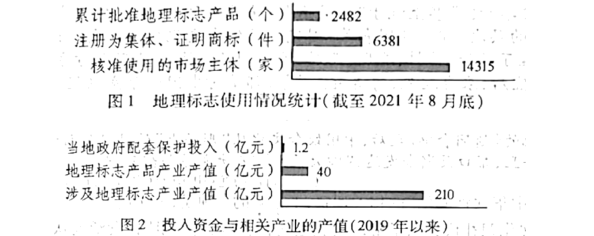

**2022年高考浙江卷语文真题**

**一、语言文字运用（共20分）**

1\. 下列各句中，没有错别字且加点字的注音全都正确的一项是（ ）

A. 中国共青团始终与党同心、跟党奋斗，团结带领广大团员青年把忠诚书写在党和人民事业中，把青春播撒（sǎ）在民族复兴的征程上，把光荣镌（juàn）刻在历史行进的史册里。

B. 作为联动不同地市、辐（fú）射全省的大形文化活动，宋韵文化节将逐步成为讲好浙江故事、展现浙江精神的重要窗口，成为解读中华文明、增强文化自信的重要载（zài）体。

C. 有些微短剧利用了模（mó）式化的内容结构，在人们的日程中炮（páo）制出“空闲时间被我利用”的错觉，给用户营造了添加“工业糖精”的饕餮幻境，压缩了人们的想象空间。

D. 水中的精灵使出浑身解（xiè）数与捕鱼人捉谜藏——鱼儿转身逃之夭夭，虾儿躲开悄（qiǎo）无声息，螃蟹诡谲钻进石缝，黄鳝狡猾来去无踪……但还是留下了蛛丝马迹。

【答案】C

【解析】

【详解】本题考查学生识记现代汉语常用字字音和正确使用现代常用规范汉字的能力。

A.“镌刻”的“镌”应读“juān”；

B.“大形”的“形”应改为“型”；

D.“捉谜藏”的“谜”应改为“迷”。

故选C。

阅读下面的文字，完成下面小题。

【甲】<u>翻开《精神的力量——航天精神引领中华民族探索浩瀚宇宙》一书，中国航天事业的历程一一展现，字里行间全是澎湃的热情，全是珍贵的回忆。</u>中国航天人自力更生、艰苦奋斗，航天事业从无到有、从小到大，迅速发展壮大。【乙】<u>我永远忘不了，从天上传来的“东方红”乐曲是那么悠扬、那样动听！</u>改革开放以来，党中央和全国人民继续大力支持航天事业，中国航天人披荆斩棘、刻苦攻关，航天事业穿云裂石，突飞猛进地实现飞跃，大踏步赶上时代。首次载人航天飞行，神舟五号载人飞船成功升空并安全返回，获得圆满成功；神舟七号载人飞船实施宇航员空间出舱活动。这一切无不给我们带来激动和幸福！进入新时代，航天梦引领中国航天人奋力奔跑、勇敢逐梦，让航天事业奔向强国目标，自立自强地谱写着新的辉煌篇章。【丙】<u>北斗泽沐八方，嫦娥飞天揽月，天问造访火星，天和筑梦天河……这些好消息一则接着一则地传来，很不容易，真是令人万般欣慰！</u>

2\. 文段中的加点词语，运用不正确的一项是（ ）

A. 自力更生 B. 穿云裂石 C. 无不 D. 谱写

3\. 文段中画线的甲、乙、丙句，标点有误的一项是（ ）

A. 甲 B. 乙 C. 丙

【答案】2. B 3. B

【解析】

【2题详解】

本题考查学生正确使用词语（包括成语）的能力。

A.“自力更生”，不依赖外力，靠自己的力量把事情办起来。形容中国航天人，使用正确。

B.“穿云裂石”，穿入云霄，震裂石头，形容声音高亢嘹亮。文中用来修饰“航天事业”，使用对象错误。

C.“无不”，没有不，全是。文中是说航天事业所取得的一切成就都给人们带来了激动和幸福，使用正确。

D.“谱写”，创作歌曲或为歌词配曲。也比喻用行动表现极其动人英雄事迹(多和“凯歌”“诗篇”“篇章”一类词连用)。使用正确。

故选B。

【3题详解】

本题考查学生正确使用标点的能力。

B.乐曲名应使用书名号，所以“东方红”应为《东方红》。

故选B。

4\. 下列各句中，没有语病的一项是（ ）

A. 杭州亚运吉祥物裸眼3D宣传片，生动展示了足球、帆船、电竞三个运动场景，是实现亚运吉祥物的“破屏出圈”，带给观众身临其境体验的重要技术。

B. 肺鱼也是一种重要的“活化石”，其化石的记录在整个地史时期都有较好的保存，肺鱼身体结构的变化连续地展现出它们由海洋到陆地淡水环境。

C. 职业教育法的颁布旨在提升职业教育认可度为目标，深化产教融合、校企合作，完善职业教育保障制度和措施，更好地推动职业教育高质量发展。

D. 全球正经历新一轮科技革命和产业变革，发达国家和地区都积极进行绿色能源、低碳产业和清洁技术的布局，碳达峰碳中和成为全球科技创新的新赛道。

【答案】D

【解析】

【详解】本题考查学生辨析并修改病句的能力。

A.“杭州亚运吉祥物裸眼3D宣传片……是实现亚运吉祥物的‘破屏出圈’”搭配不当，可改为“通过3D技术，让亚运吉祥物‘破屏出圈’”；“杭州亚运吉祥物裸眼3D宣传片……带给观众身临其境体验的重要技术”语义混乱，可改成“带给观众身临其境的体验”。

B.成分残缺，“展现”后面缺少与之搭配的宾语中心词，应在“淡水环境”的后面加上“适应过程”。

C.句式杂糅，“旨在……为目标”杂糅，可删去“为目标”。

故选D。

5\. 在下面一段文字横线处补写恰当的语句，使整段文字语意完整连贯，内容贴切，逻辑严密。每处不超过15个字。

艺术作品之所以合情合理，是因为它来源于生活；艺术之所以成为艺术，\_\_\_\_\_\_\_\_\_\_\_。但艺术之树无论多么伟岸高耸，生活是它永远的土壤。作为一种民间大众文艺形式，曲艺作品的创作当然应该以百姓的日常生活为基础。看似平淡的生活中，\_\_\_\_\_\_\_\_\_\_\_\_，如果将这些哲理巧妙地夸张，适度改造变形，便实现了戏剧化效果，从而成为曲艺创作的有利武器。来源于生活哲学，这带给了曲艺“包袱儿”“在乎情理之中”的可信性；\_\_\_\_\_\_\_\_\_\_\_\_，又带给了曲艺“包袱儿”一种“出乎意料之外”的诧异感和幽默感。二者的完美结合，便成为曲艺“包狱儿”永恒追求的境界。

【答案】 ①. 是因为它高于生活 ②. 实际上充满了哲理 ③. 而将生活哲学适当夸张和戏剧化

【解析】

【详解】本题考查学生情境补写的能力。

第一空，依据前文“之所以”可知，所填句子应以“是因为”开头；再结合前文“它来源于生活”“艺术之所以成为艺术”可知，艺术与生活不同，这里可填：是因为它高于生活。

第二空，依据前文“看似”可知，所填句子应以“实际上”“实际”等意思的词语开头；再结合后文“如果将这些哲理”可知，这里可填：实际上充满了哲理。

第三空，所填句子前为分号，所以所填句子应与前句对应，前句是说“来源于生活哲学”给曲艺“包袱儿”带来可信性，这属于对前文“源于生活”的说明，那么所填句子就应是对“高于生活”的说明。再结合前文“将这些哲理巧妙地夸张，适度改造变形，便实现了戏剧化效果”可知，这里可填：而将生活哲学适当夸张和戏剧化。

6\. 阅读下面的图文，根据要求完成题目。

赣南脐橙、柞水木耳、五常大米……这些耳熟能详的土特产，如今都有一个共同的身份——地理标志产品。“地理标志，就是地理名称加上商品名称，强调的是产品的原产地。”法律工作者告诉记者，“地理标志是促进区域特色经济发展的有效载体，是推进乡村振兴的有力支撑。”地理标志注册为集体商标或证明商标后，只要满足特定的条件，谁都可以申请使用。有学者指出：“在我国，地理标志是与‘三农’联系极为密切的知识产权标识。”我国地方名优特产数不胜数，地理标志打响了特色产品的品牌。很多地理标志产品获得消费者认可，成为市场的“通行证”，展现了良好的竞争力。蓬勃发展的地理标志产品带动了上下游产业发展。

（1）根据文中信息，给“地理标志”下定义。不超过20个字。

地理标志是\_\_\_\_\_\_\_\_\_\_\_\_\_\_\_\_\_\_\_\_\_\_\_\_\_\_\_\_\_\_\_\_\_\_。

（2）综合图文材料，从带动经济发展的角度简述“地理标志”的作用。要求：语言简明、准确。

【答案】（1）示例：由地理名和商品名组成的知识产权标识

（2）①惠及的市场主体数量多；②带动的产业产值高；③打响了特色产品的品牌，带动上下游产业发展；④促进区域特色经济发展，推进乡村振兴。

【解析】

【小问1详解】

本题考查学生语言表达之下定义的能力。

下定义多采用判断单句的形式，其格式多为“×××（种概念）是×××的×××（属概念）”。

本题中，依据“在我国，地理标志是与‘三农’联系极为密切的知识产权标识”可知属概念是“知识产权标识”。

依据“地理标志，就是地理名称加上商品名称”可知其本质特点。

所以可得出结论：地理标志是由地理名和商品名组成的知识产权标识。

【小问2详解】

本题考查学生语言表达之概括要点的能力。

依据“地理标志是促进区域特色经济发展的有效载体，是推进乡村振兴的有力支撑”可概括为：促进区域特色经济发展，推进乡村振兴。

依据“地理标志打响了特色产品的品牌……蓬勃发展的地理标志产品带动了上下游产业发展”可概括为：打响了特色产品的品牌，带动上下游产业发展。

图表1是“地理标志使用情况统计”，依据“2482”“6381”“14315”等数字的比较可概括为：惠及的市场主体数量多。

图表2是“投入资金与相关产业的产值”，通过“1.2”“40”“210”等数字的比较可概括为：带动的产业产值高。

**二、现代文阅读（共30分）**

**（一）（10分）**

阅读下面的文字，完成下面小题。

中国食客说起中华美食之道，往往喜欢引用孔子的“食不厌精，脍不厌细”八个字。其实，孔子所言的“食不厌精，脍不厌细”，更侧重于祭祀时饮食的态度而非对味道的追求。孔子生活的春秋末期，烹饪、碓舂、切肉工艺均相对原始，将“食”做“精”、“脍”做“细”，体现了厨人与食者严肃真诚的态度。孔子的饮食观背后，是其心怀的礼制。《礼记》所言“夫礼之初，始诸饮食”，大意即是“礼仪制度和风俗习惯始于饮食活动”。

古代中国对食物的“淡漠”不仅出于食材的积累、交融的缓慢，更在于儒家对口腹之欲的“打压”。一方面，孔子“君子谋道不谋食”的教诲让士大夫阶层往往远离庖厨而以修齐治平为己任；另一方面，自汉武帝刘彻“罢黜百家，独尊儒术”后，士大夫阶层仕途通畅，“学而优则仕”也有着丰厚的现实回报。至晚在唐代之前，文人对于饮食之事是少有重视的。

隋唐时期饮食文化尤其是宴席之风虽有较大发展，但在盛世文治武功的影响下，士大夫阶层的追求依然在“提笔安天下、马上定乾坤”之中，“烹羊宰牛”式的盛筵并没有孕育出与之相当的饮食文化。唐代盛极一时的烧尾宴，也只是公卿士大夫的盛宴，远非平民百姓所能享受。

转折来自于两宋：从个体角度来看，两宋文化昌盛导致读书人与日俱增以至于仕途门槛抬高，同时武功疲弱又令多少人壮志难酬；从朝廷角度来看，宋室有鉴于唐朝藩镇割据之痛，自宋太祖赵匡胤“杯酒释兵权”始便鼓励朝臣“择便好田宅市之，为子孙立永远之业，多置歌儿舞女，日饮酒相欢，以终其天年”。用舍行藏之下，也不由得士大夫们不将视线转向饮食了。

元朝统一后，汉族士人愈加边缘化。明清易代，朝廷中枢又多为满族垄断，“学而优则仕”的路途不再畅通无阻，文人的兴趣自然而然愈加转向声色犬马。如以“小品圣手”名世的张岱，便在《陶庵梦忆》中洋洋自得地夸口“越中清馋，无过余者”，从北京的苹婆果到台州的江瑶柱，从山西的天花菜到临海的枕头瓜，大明两京一十三省的美食竟尝了个遍。又如戏曲大家李渔，一边醉心于梨园之乐，一边也不忘鲜衣美食这一类“家居有事”，并在理论巨著《闲情偶寄》中加入“饮馔”一部，系统阐述其“存原味、求真趣”的饮食美学思想与“宗自然、尊鲜味”饮食文化观念。

特殊的时代背景使得“饮食之人”不再被轻贱，于是一大批美食家在清代前半叶应运而生，在这一背景下，“食圣”袁枚登场了。

袁枚在《与薛寿鱼书》中公然提出“夫所谓不朽者，非必周、孔而后不朽也。羿之射，秋之弈，俞跗之医，皆可以不朽也”，而他自己则将饮食之道视为堪与周公孔子之为相媲美的事业，因此可以毫无顾忌地“每食于某氏而饱，必使家厨往彼灶觚，执弟子之礼”。

袁枚作诗以“性灵说”为主张，认为诗应直抒心灵，表达真意，这一主张也融合到了饮食中：他认为在烹饪之前要了解食材、尊重物性，注意食材间的搭配和时间把握；他反对铺张浪费，提出“肴佳原不在钱多”，食材之美更在于物尽其用；他将人文主义引入饮食，宣扬“物为人用，使之死可也，使之求死不得不可也”。他强调烹饪理论的重要性，以为中国烹法完全依厨人经验不利于传承，为了给后世食客厨人树立典范，又煞费苦心撰写出了《随园食单》——这部南北美食集大成之作，再一次为中华美食的发展开启了新的纪元。

《随园食单》之前，中国历代亦不乏饮食著作，但关于制法的记述往往过于简略，如隋代《食经》唐代《烧尾宴食单》之类甚至流于“报菜名”。宋元以降，饮食著作的烹饪方法逐渐明晰，但亦停留在“形而下”的层次。而《随园食单》则完成了饮食文化从经验向理论的最终蜕变。如“须知单”“戒单”中梳理了物性、作料、洗刷、调剂、搭配、火候、器具、上菜等方方面面，“上菜须知”中的“盐者宜先，淡者宜后；浓者宜先，薄者宜后”等，都是对中国千年烹饪经验一次开创性的总结与编排。

在袁枚和他的《随园食单》之后，中国饮食文化从“形而上”的思想层面迈上了一个新台阶，在之后的百余年里，帮口菜渐渐发达，“四大菜系”“八大菜系”逐渐成形。

（摘编自江隐龙《中华尚食之道里，自有一个民族坚韧的初心》）

7\. 下列对文中“中华饮食文化”的相关理解，不正确的一项是（ ）

A. 中华饮食文化跟礼仪关系紧密，“夫礼之初，始诸饮食”说明饮食活动从一开始就被赋予礼仪要求。

B. 中华饮食文化发展的影响因素有很多，与国家的强弱并不一致，而与历代文人士大夫的态度有较大关联。

C. 中华饮食文化发展中，唐代以前的文人很少重视饮食，跟“君子谋道不谋食”的教诲和“学而优则仕”的现实回报有关。

D. 中华饮食文化在明清时代出现了“存原味、求真趣”的饮食美学思想与“宗自然、尊鲜味”的饮食文化观念。

8\. 下列说法符合原文意思的一项是（ ）

A. 中国食客喜欢用“食不厌精，脍不厌细”标榜中华美食之道，这八个字从一个侧面反映了在孔子时代把饮食做到“精细”并非易事。

B. 两宋时期饮食风气发生了变化，产生了转折，无论从个体角度还是从朝廷角度来看，这都是经济比较发达造成的。

C. 袁枚将自己的饮食之道当作与周公孔子的饮食之道相媲美的不朽事业，饮宴饱食归来，都派自己的厨子去对方家学习。

D. 袁枚把人文主义融入饮食，大致表现在这样三方面：尊重物性，要了解食材；不要浪费，要物尽其用；物为人用，要保护生命。

9\. 概括中华饮食文化得到发展的原因。

【答案】7. A 8. A

9\. ①士人：兴趣从仕途转向饮食，促进饮食发展。②技术：中华饮食历史悠久，明清时代饮食技术得到大发展。③理论：长期的实践经验发展成系统理论。

【解析】

【7题详解】

本题考查学生筛选并辨析信息的能力。

A.“‘夫礼之初，始诸饮食’说明饮食活动从一开始就被赋予礼仪要求”错误，根据第一段最后一句“《礼记》所言……大意即是‘礼仪制度和风俗习惯始于饮食活动’”可知，礼开始于饮食活动，而非饮食活动一开始被赋予礼。

故选A。

【8题详解】

本题考查学生理解文章内容，筛选并整合文中信息的能力。

B.“无论从个体角度还是从朝廷角度来看，这都是经济比较发达造成的”错误，根据原文第四段“转折来自于两宋：从个体角度来看，两宋文化昌盛……同时武功疲弱……；从朝廷角度来看，宋室有鉴于唐朝藩镇割据之痛……用舍行藏之下，也不由得士大夫们不将视线转向饮食了”可知，两宋时期饮食风气发生转折，从个体角度来看的原因是，文化昌盛和武功疲弱；从朝廷角度来看的原因是，鉴于唐朝藩镇割据之痛，朝廷鼓励朝臣享乐。并无提及“经济比较发达”的原因。

C.“袁枚将自己的饮食之道当作与周公孔子的饮食之道相媲美的不朽事业”错误，根据原文第七段“他自己则将饮食之道视为堪与周公孔子之为相媲美的事业”可知，袁枚是将“饮食之道”视为堪比“周公孔子之为”的事业，而非将“自己的饮食之道”与“周公孔子的饮食之道”相比。

D.“大致表现在这样三方面：尊重物性，要了解食材；不要浪费，要物尽其用”错误，根据原文第八段“袁枚作诗以“性灵说”为主张……他将人文主义引入饮食，宣扬‘物为人用，使之死可也，使之求死不得不可也’”可知，袁枚把人文主义融入饮食，主要表现在“物为人用；要保护生命”这一方面，而“尊重物性，要了解食材；不要浪费，要物尽其用”这两方面是袁枚将“性灵说”的主张融入到饮食中的表现。

故选A。

【9题详解】

本题考查学生归纳内容要点，概括中心意思的能力。

由原文第三段“转折来自于两宋：从个体角度来看，两宋文化昌盛……同时武功疲弱又令多少人壮志难酬；从朝廷角度来看……自宋太祖赵匡胤‘杯酒释兵权’始便鼓励朝臣……。用舍行藏之下，也不由得士大夫们不将视线转向饮食了”、第四段“元朝统一后……文人的兴趣自然而然愈加转向声色犬马。如以‘小品圣手’名世的张岱……又如戏曲大家李渔……在理论巨著《闲情偶寄》中加入‘饮馔’一部……”可知，中华饮食文化得到发展与士人的兴趣转移有关，从两宋开始士人的兴趣从仕途慢慢转向饮食，士人品味美食，阐述饮食美学思想和饮食文化观念，促进饮食发展。

由原文第一段“孔子生活的春秋末期，烹饪、碓舂、切肉工艺均相对原始……”、第三段“隋唐时期饮食文化尤其是宴席之风虽有较大发展……‘烹羊宰牛’式的盛筵并没有孕育出与之相当的饮食文化。唐代盛极一时的烧尾宴，也只是公卿士大夫的盛宴，远非平民百姓所能享受”、第九段即倒数第二段“宋元以降……《随园食单》则完成了饮食文化从经验向理论的最终蜕变。如‘须知单’‘戒单’中梳理了物性、作料、洗刷、调剂、搭配、火候、器具、上菜等方方面面，‘上菜须知’中的‘盐者宜先，淡者宜后；浓者宜先，薄者宜后’等，都是对中国千年烹饪经验一次开创性的总结与编排”可知，中华饮食文化得到发展与中华饮食有着历史悠久，明清时代饮食技术发展有关。

由最后两段“宋元以降，饮食著作的烹饪方法逐渐明晰，但亦停留在‘形而下’的层次。而《随园食单》则完成了饮食文化从经验向理论的最终蜕变。……都是对中国千年烹饪经验一次开创性的总结与编排”“在袁枚和他的《随园食单》之后，中国饮食文化从‘形而上’的思想层面迈上了一个新台阶……”可知，由长期的实践经验发展成系统的理论也是中华饮食文化得到发展的原因之一。

**（二）（20分）**

阅读下面的文字，完成下面小题。

**逛**

和军校

泔河村的敦厚妈一辈子逛过的最大地方是观音镇。翻过泔河，上一道坡，走两顿饭的工夫，就是观音镇了。<u>观音镇是真的好，那么宽的路，那么多的人，那么多好吃好喝好穿的。</u>虽然这些吃喝她都没享受过，可逛一逛也够敦厚妈幸福几天呢。敦厚六岁，敦厚妈摔跛了腿。从此，敦厚妈再也没有逛过观音镇。有一回敦厚妈走娘家，正好有一辆大卡车来娘家拉西瓜，那车真大，拉的西瓜真多，跑得真快，敦厚妈惊骇得不得了，一跛一跛地跟出去半里地看稀罕。回到村里，敦厚妈就一遍一遍地给人讲那汽车，听的人听着听着都笑了。

敦厚妈守寡早，就守了敦厚这么一个儿子，因此把敦厚看得比埋在屋角的钱罐罐还紧。所以，当敦厚想当兵的时候，敦厚妈死活不依。村支书张大昌对敦厚妈说：“你还能把他守一辈子？叫娃去当兵吧。”敦厚舅舅也支持；敦厚妈的心动了，说：“那就叫娃试试。”敦厚一试，真就“试”上了，崭新的军装穿上身，就要走了，敦厚妈把前襟哭湿一大片，说：“这可咋弄呢，娃从小都没出过门，衣裳破了谁给他补，饥一顿饱一顿的，谁记挂他呀……”敦厚还是走了，眼圈红红的，和同村孙四海、孙长明一起去当兵了。

敦厚当兵的第三个年头回来了，和村里的小秋结了婚。小秋是个俊人儿，少话，识理，没过门就三天两头来帮敦厚妈做家务，妈长妈短地叫。没几天，敦厚回部队去了。敦厚妈就和小秋相依着过日月，不争不吵，像母女。泔河村的人都说“敦厚妈真是有福气呢”。又过了两年，敦厚寄回来一封信，说他入了党，转成了志愿兵，要去一个油田当石油工人。泔河村的人都替敦厚高兴。

敦厚是个孝顺儿子，他到油田当了石油工人，每次回来，都给妈买好多好多好吃好穿的，帮妈干所有农活，用自行车驮着妈到观音镇逛两回集。敦厚的话变得多了，当着全村人的面，讲他的油田，讲他的油田有多大，讲他的油田有多好，讲得一村人都勤勤地朝敦厚妈递艳羡的目光。敦厚又要走了，临走，给妈留下了好多的钱，又叮咛媳妇小秋好好地侍候妈。就在这一年的年根，敦厚匆匆地回来了，又匆匆地走了，走时带着小秋。

偌大的一个屋子，空荡荡的只剩下敦厚妈一个人了，她常常盼敦厚盼到天明，只要碰到村里的人，敦厚妈就一直说她的儿子敦厚。有一回，孙四海他妈说：“你敦厚咋不带你进他的油由上去逛一逛啊？”因为孙四海刚带他妈逛了咸阳。每逢这时，敦厚妈就替她的儿子说话：“敦厚也是叫我去的，我想咱一个农村妇女，腿又不好，话也不会说，走不到人面前去；再说了，敦厚又要忙公家的事，咱去了给娃惹麻烦呢。”村里的人也就信以为真了，不再说这类话。敦厚妈回到家里就犯嘀咕了，敦厚可从没说过接她去美丽的油田逛一逛这话！再说了，她也真想去敦厚的油田上逛一逛了。所以，当敦厚再次回来的时候，敦厚妈就有心问一问敦厚了：“敦厚，油田上真像你说的那么好？”敦厚说：“好，娃能骗你吗？几十万人的大油田，顶咱几千个泔河村，高楼房，宽马路，人山人海。”敦厚妈说：“妈这腿不争气，要不，妈也想到你的油田上逛一逛呢。”敦厚的口吻就变了，躲开妈的目光，含糊着说：“其实也没啥好逛的。”这一天，敦厚的舅也来了，他也给敦厚说：“你和小秋一走，你妈一个人在家里孤呢；你把你妈接到油田上逛一逛。”敦厚还是说：“其实也没啥逛的。”

此后，泔河村人的话变得难听了：“真看不出敦厚是个没良心的。”

敦厚妈说：“是我不去，油田没啥好逛的。”

孙四海他妈说：“没啥好逛的？说的比唱的还好听，没啥好逛的他为啥把他媳妇叫去逛呢？”

孙长明他妈也附和着说：“不是咋的，往后少跟这人打交道。”

村里人都这么说，次数多了，敦厚妈就觉得脸上不光彩，人多的场合去的也少了。

敦厚妈的身子一日不济一日，年底就突然不行了。支书张大昌做了主张，一封电报把敦厚从油田上招了回来。敦厚夜夜陪着妈，给妈端吃喂喝，无微不至。小秋更是殷勤，尽着一个媳妇的孝道。敦厚把妈驮到县医院查病，医生冷着脸叹了口气说：“准备后事去。”敦厚把妈驮回村里了，急着要去油田。在村口，支书张大昌拦住了敦厚的去路。

张大昌说：“敦厚，你妈是有今没明的人了，赶紧接你妈去油田逛一逛。你要有良心。”

敦厚说：“叔，我知道。等翻过年，我就给我妈看病，就是走到天南海北，我也要给我妈把病看好。”头一低，那泪就“叭叭叭”地砸下来。

张大昌说：“你妈是没几天的人了，你现在就把她接走。”

敦厚说：“叔，我有难处。”

张大昌沉了脸，说：“敦厚，你要是今日不带你妈走，从今往后，你就别再叫我叔，泔河村就没你活人的地方了。”

敦厚咬咬牙，走了。

敦厚走了，泔河村的骂声也就起来了。

敦厚走后第十九天，小秋正在给妈熬药，门外来了一辆小车，下来几个人，说是接小秋和敦厚妈，还有村支书张大昌。一见面，小秋就抱住张大昌，哇的一声哭了。

一行三人来到油田，来到了敦厚所住的单站上。<u>这里，就他一个采油工，一个单站，好大一座山，一口油井，一节列车式铁皮房，住着敦厚一个看井人，四野茫茫，遥无人迹，比他们的泔河村还荒凉。</u>小秋的感觉是准确的，敦厚死了。有三个盗油人，开着四轮车，敦厚拦车，他们送钱，敦厚不要，他们吓唬，敦厚不怕。敦厚伸手拦在路中央，说：“想把油拉走，就从我身上碾过去。”

装满一车油的四轮从敦厚身上碾了过去……敦厚死前，留下话：把我妈，还有支书张大昌接到油田来看看。还说，他这几年攒的钱，全用来给他妈看病……

采油厂的领导说，这口井是全厂最远的一口井，没有人愿意来住单站。敦厚刚从部队下来，又是党员，他就主动去了。这么多年，他一句埋怨都没有过，从没提出过困难。

小秋抱着妈哭得死去活来，她断断续续地说：“他一直想条件好些了，分了房子，再把妈接来……”

最后，在如何处理敦厚遗体的问题上，支书张大昌和油田上的领导发生了分歧，张大昌说：“敦厚是个好娃，是我们村的光荣，叶落归根，我们村要把他运回去，给他建一个高高大大的墓。”

油田上的领导说：“敦厚同志是优秀共产党员，我们还要追认他为烈士，号召全厂的采油工向他学习，所以我们想把敦厚同志的遗体火化，留在这里。”

双方各说各有理，互不相让。就在他们争得不可开交的时候，小秋和她的婆婆在山上那个采油小站旁悄悄地为敦厚挖着墓穴。

妈说：“敦厚，你就住这儿，把井看好……”

小秋说：“妈要是想你了，我就跟妈来看你……”

起风了，落雪了，一会儿，天地一色。

（有删改）

10\. 作品塑造敦厚的形象主要使用了哪些艺术手法？

11\. 敦厚具有怎样的品格？

12\. 怎样评价敦厚妈和小秋把敦厚葬在采油小站旁的行为？

13\. 赏析小说画线的两处描写及两者对比所构成的艺术效果。

【答案】10. ①抑扬。先写敦厚孝顺母亲，再写敦厚在众人眼中对母亲“不孝”，最后揭示他既孝顺母亲又报效国家的真孝和大孝。②烘托。用众人对敦厚的批评和压力，烘托敦厚的忍辱负重。

11\. ①敦厚忠孝。既孝顺母亲，又以死报国。②忍辱负重。为了不让母亲伤心，甘愿忍受误解。③积极上进。主动请缨去守卫最艰苦的岗位。④恪尽职守。为了国家利益而牺牲。

12\. ①舍小爱，取大爱。这样可以更好实现他忠心为国的心愿。②舍私利，取大义。这样可以感召更多的人为国家作奉献。

13\. ①第一处描写，连用三个“那么”，渲染小镇的热闹，从而写出敦厚妈对美好生活向往的迫切。②第二处描写，连用六个“一”，写尽敦厚守卫的油井之荒凉，从而塑造出他甘守荒凉、一心奉献的品格。③两者形成鲜明对比，既解释了敦厚在众人眼中“不孝”的原因，也彰显了他为国守油忠于职守、甘于奉献的品格。

【解析】

【10题详解】

本题考查学生鉴赏作品的人物描写手法的能力。

首先是先扬再抑后扬的手法。

文章开头描写敦厚孝顺母亲，“敦厚是个孝顺儿子，他到油田当了石油工人，每次回来，都给妈买好多好多好吃好穿的，帮妈干所有农活，用自行车驮着妈到观音镇逛两回集”，人们也都羡慕敦厚妈，“一村人都勤勤地朝敦厚妈递艳羡的目光”。这是“扬”。

但后来敦厚说啥也不接他妈去油田逛逛，孙四海接了他妈去咸阳逛了，敦厚妈也犯嘀咕，于是敦厚回来的时候要求敦厚接她去逛逛，可敦厚“躲开妈的目光，含糊着说：‘其实也没啥好逛的。’”，敦厚舅舅也让他带他妈去逛逛，敦厚还是推脱，“其实也没啥逛的”，村里人也说敦厚，“真看不出敦厚是个没良心的”“孙四海他妈说：‘没啥好逛的？说的比唱的还好听，没啥好逛的他为啥把他媳妇叫去逛呢？ ’孙长明他妈也附和着说：‘不是咋的，往后少跟这人打交道。’”敦厚妈得了病，村支书张大昌让他带他妈去逛逛，敦厚还是不同意，“张大昌说：‘敦厚，你妈是有今没明的人了，赶紧接你妈去油田逛一逛。你要有良心。’敦厚说：‘叔，我知道。等翻过年，我就给我妈看病，就是走到天南海北，我也要给我妈把病看好。’头一低，那泪就‘叭叭叭’地砸下来”。大家都不明白敦厚为啥不接他妈去油田逛逛，都觉得他没良心，这是“抑”。

后来敦厚牺牲，大家才知道真相，“这里，就他一个采油工，一个单站，好大一座山了，一口油井，一节列车式铁皮房，住着敦厚一个看井人，四野茫茫，遥无人迹，比他们的泔河村还荒凉”，“采油厂的领导说，这口井是全厂最远的一口井，没有人愿意来住单站。敦厚刚从部队下来，又是党员，他就主动去了。这么多年，他一句理怨都没有过，从没提出过困难”，而敦厚媳妇小秋道出了敦厚不肯带他妈来逛的真相，“他一直想条件好些了，分了房子，再把妈接来……”。原来敦厚为了国家守护油田，不怕困难，他是怕他妈担心才不接她来逛，这是“扬”。

总之，文章很好地运用了“抑扬”的手法，先写敦厚孝顺母亲，再写敦厚在众人眼中对母亲“不孝”，最后揭示他既孝顺母亲又报效国家的真孝和大孝。

其次是烘托手法。

敦厚没办法把他妈接到油田去逛逛，大家都不理解他，说三道四，如“真看不出敦厚是个没良心的”“孙四海他妈说：‘没啥好逛的？说的比唱的还好听，没啥好逛的他为啥把他媳妇叫去逛呢？ ’孙长明他妈也附和着说：‘不是咋的，往后少跟这人打交道。’”，村支书张大昌都觉得他没良心，“敦厚，你妈是有今没明的人了，赶紧接你妈去油田逛一逛。你要有良心”“敦厚走了，泔河村的骂声也就起来了”。尽管受了委屈，可是敦厚为了不让他妈担心，依然什么也不说。文章用众人对敦厚的批评和压力，烘托敦厚的忍辱负重。

【11题详解】

本题考查学生鉴赏作品人物形象的能力。

敦厚忠孝。文章开头写敦厚很孝顺母亲，“敦厚是个孝顺儿子，他到油田当了石油工人，每次回来，都给妈买好多好多好吃好穿，帮妈干所有农活，用自行车驮着妈到观音镇逛两回集”，临死前还惦记给他妈治病，“敦厚死前，留下话：把我妈，还有支书张大昌接到油田来看看。还说，他这几年攒的钱，全用来给他妈看病……”；文章结尾处表现了敦厚对国家的热爱和忠诚，“采油厂的领导说，这口井是全厂最远的一口井，没有人愿意来住单站。敦厚刚从部队下来，又是党员，他就主动去了。这么多年，他一句理怨都没有过，从没提出过困难”，“敦厚死了。有三个盗油人，开着四轮车，敦厚拦车，他们送钱，敦厚不要，他们吓唬，敦厚不怕。敦厚伸手拦在路中央，说：‘想把油拉走，就从我身上碾过去。’”装满一车油的四轮从敦厚身上碾了过去……”。可见敦厚忠孝两全，既孝顺母亲，又以死报国。

忍辱负重。敦厚所在的油田非常偏僻，他为了让母亲放心故意说“几十万人的大油田，顶咱几千个泔河村，高楼房，宽马路，人山人海”，但是他不能接母亲去逛逛，村子里风言风语，“真看不出敦厚是个没良心的”“孙四海他妈说：‘没啥好逛的？说的比唱的还好听，没啥好逛的他为啥把他媳妇叫去逛呢？ ’孙长明他妈也附和着说：‘不是咋的，往后少跟这人打交道。’”，敦厚为了不让母亲伤心，甘愿忍受误解。

积极上进。“这里，就他一个采油工，一个单站，好大一座山，一口油井，一节列车式铁皮房，住着敦厚一个看井人，四野茫茫，遥无人迹，比他们的泔河村还荒凉”，厂领导说“这口井是全厂最远的一口井，没有人愿意来住单站。敦厚刚从部队下来，又是党员，他就主动去了。这么多年，他一句理怨都没有过，从没提出过困难”。敦厚积极上进，主动请缨去守卫最艰苦的岗位。

恪尽职守。为了拦住偷油贼，敦厚宁可牺牲自己，“有三个盗油人，开着四轮车，敦厚拦车，他们送钱，敦厚不要，他们吓唬，敦厚不怕。敦厚伸手拦在路中央，说：‘想把油拉走，就从我身上碾过去。’”装满一车油的四轮从敦厚身上碾了过去……”，敦厚为了国家利益而牺牲。

【12题详解】

本题考查学生鉴赏作品审美意蕴和情节作用的能力。

村支书和油田领导都争着要把敦厚葬在自己的地方，“就在他们争得不可开交的时候，小秋和她的婆婆在山上那个采油小站旁悄悄地为敦厚挖着墓穴”。

从敦厚妈和他妻子的角度，她们肯定是愿意把敦厚拉回老家泔河村安葬，这样她们也能常常去看他。但是从敦厚的角度看，敦厚把自己的青春和生命都献给了他热爱的油田，他对国家和油田的爱是大爱，是忠诚，而对母亲和妻子的爱是小爱，敦厚妈和妻子都懂得了敦厚的心意，因此他们愿意把敦厚安葬在他战斗和牺牲的地方，这样可以更好实现他忠心为国的心愿。两人的做法是舍小爱，取大爱。

敦厚妈和妻子小秋的行为也是受了敦厚的感召和影响，她们舍弃了常常看望亲人的便利，成全了敦厚为国守护油田的大义，她们也做到了舍私利，取大义。文章这样安排可以感召更多的人为国家作奉献。

【13题详解】

本题考查学生鉴赏语言描写的能力。

第一处描写，“观音镇是真的好，那么宽的路，那么多的人，那么多好吃好喝好穿的”，这段话先总写“观音镇是真的好”，然后具体描写了观音镇的路、人和物质的丰富、事物的繁多热闹，“那么宽的路，那么多的人，那么多好吃好喝好穿的”，连用三个“那么”，渲染小镇的热闹，从而写出敦厚妈对美好生活向往的迫切。

第二处描写，“这里，就他一个采油工，一个单站，好大一座山，一口油井，一节列车式铁皮房，住着敦厚一个看井人，四野茫茫，遥无人迹，比他们的泔河村还荒凉”，这是对敦厚守护的油田环境的描写，“一个采油工”“一个单站”“好大一座山”“一口油井”“一节列车式铁皮房”“一个看井人”，连用六个“一”，写出山之大而空旷，写出单站、油井、铁皮房和敦厚这唯一的看井人的孤独，写尽敦厚守卫的油井之荒凉。就是在这样的环境中，“这么多年，他一句理怨都没有过，从没提出过困难”，从而塑造出他甘守荒凉、一心奉献的品格。

观音镇的热闹繁华和油田的空旷荒凉形成鲜明对比，原来敦厚不让他妈来是怕他妈担心，这样两段画线句既解释了敦厚在众人眼中“不孝”的原因，也彰显了他为国守油忠于职守、甘于奉献的品格。

**三、古代诗文阅读（共40分）**

**（一）（20分）**

阅读下面的文言文，完成下面小题。

**刑赏忠厚之至论**

【宋】苏辙

古之君子立于天下，非有求胜于斯民也。为刑以待天下之罪戾，而唯恐民之入于其中以不能自出也；为赏以待天下之贤才，而唯恐天下之无贤而其赏之无以加之也。盖以君子先天下，而后有不得已焉。夫不得已者，非吾君子之所志也，民自为而召之也。故罪疑者从轻，功疑者从重，皆顺天下之所欲从。

且夫以君临民，其强弱之势、上下之分，非待夫与之争寻常之是非而后能胜之矣。故宁委之于利，使之取其优，而吾无求胜焉。夫惟天下之罪恶暴著而不可掩，别白而不可解，不得已而用其刑。朝廷之无功，乡党之无义，不得已而爱其赏。如此，然后知吾之用刑，而非吾之好杀人也；知吾之不赏，而非吾之不欲富贵人也。使夫其罪可以推而纳之于刑，其迹可以引而置之于无罪；其功与之而至于可赏，排之而至于不可赏。若是二者而不以与民，则天下将有以议我矣。使天下而皆知其可刑与不可赏也，则吾犹可以自解。使天下而知其可以无刑、可以有赏之说，<u>则将以我为忍人，而爱夫爵禄也。</u>

圣人不然，以为天下之人，不幸而有罪，可以刑、可以无刑，刑之，而伤于仁；幸而有功，可以赏、可以无赏，无赏，而害于信。与其不屈吾法，孰若使民全其肌肤、保其首领，而无憾于其上；与其名器之不僭，孰若使民乐得为善之利而无望望不足之意。呜呼！<u>知其有可以与之之道而不与，是亦志于残民而已矣。</u>且彼君子之与之也，岂徒曰与之而已也，与之而遂因以劝之焉耳。故舍有罪而从无罪者，是以耻劝之也；去轻赏而就重赏者，是以义劝之也。盖欲其思而得之也。故夫尧舜、三代之盛，舍此而忠厚之化，亦无以见于民矣。

（选自《苏辙集》）

14\. 对下列句子中加点词语的解释，不正确的一项是（ ）

A. 民自为而召之也 召：招致

B. 故宁委之于利 委：交付

C. 而无憾于其上 憾：遗憾

D. 与之而遂因以劝之焉耳 劝：勉励

15\. 下列各组句子中，加点词的意义和用法相同的一组是（ ）

A. 为刑以待天下之罪戾 而彭祖乃今以久特闻

B. 然后知吾之用刑 欲人之无惑也难矣

C. 若是二者而不以与民 求人可使报秦者

D. 盖欲其思而得之也 与嬴而不助五国也

16\. 下列对原文有关内容的概括与赏析，不正确的一项是（ ）

A. 文章以说理为主；始终围绕刑赏忠厚，通过正反两方面的对照，层层递进，通顺畅达，体现了作者“汪洋澹泊”的文风。

B. 作者认为，要以忠厚仁爱为本，如果只把刑赏作为手段，就起不到劝善惩恶的作用，这反映了作者儒家仁政治国的思想。

C. 文章指出，从君与民的关系上看，君强民弱，君上民下，君不应用权力压制百姓，而应让百姓得到更多好处，顺应百姓愿望。

D. 作者认为，圣人对罪恶不可掩盖或解脱的人，对在朝廷无功劳、在家乡不讲信义的人，进行刑赏，其他情况要舍有罪从无罪。

17\. 用“/”给下面的文段断句。

若夫当时赏罚之所不能及则又为之明言其状而使后世嗟叹痛惜之不已呜呼贤人君子之功烈与夫乱臣贼子罪恶之状于此皆可以无忧其无闻焉是故古者圣人重史官

（选自苏辙《史官助赏罚论》

18\. 把文中画线的句子译成现代汉语。

（1）则将以我为忍人，而爱夫爵禄也。

（2）知其有可以与之之道而不与，是亦志于残民而已矣

【答案】14. C 15. B 16. D

17\. 若夫当时赏罚之所不能及/则又为之明言其状/而使后世嗟叹痛惜之不已/呜呼/贤人君子之功烈/与夫乱臣贼子罪恶之状/于此皆可以无忧其无闻焉/是故古者圣人重史官

18\. （1）那么（人们）将认为我是狠心的人，并且是吝惜（赏赐）爵位俸禄啊。

（2）知道（上面）那些情况有可以给予百姓（刑赏忠厚）的道理却不给予，这也是存心伤害百姓罢了。

【解析】

【14题详解】

本题考查学生理解文言实词在文中的意义和用法的能力。

C.句意：在刑赏方面没有怨恨。“憾”，怨恨。解释错误。

故选C。

【15题详解】

本题考查学生理解文言虚词在文中的意义和用法的能力。

A.“以”，连词，用来。/介词，凭借。

B.“之”均用于主语和谓语之间，取消句子独立性。

C.“者”，代词，用在数词后，……方面。/助词，定语后置的标志。

D.“而”，连词，表递进。/连词，表转折。

故选B。

【16题详解】

本题考查学生理解文章内容的能力。

D.“圣人对……进行刑赏”说法错误。原文中说的是“夫惟天下之罪恶暴著而不可掩，别白而不可解，不得已而用其刑。朝廷之无功，乡党之无义，不得已而爱其赏”，这段话是作者对刑赏的议论，并不是“圣人”的做法。

故选D。

【17题详解】

本题考查学生文言文断句的能力。

“及”是动词，是“实行”的意思，“不能及”即是“没有来得及实行”，“则”是连词，是“就”的意思，因此“则”前应断开；

“而”是连词，表结果，“使后世嗟叹痛惜之不已”是前句“为之明言其状”的结果，因此“而”前应断开；

“呜呼”，叹词，应独立成句，因此“呜呼”前后皆应断开；

“贤人君子之功烈”和“夫乱臣贼子罪恶之状”是并列关系，分别陈述贤人君子的“功”与乱臣贼子的“恶”，“与”是表并列的连词，因此“与”之前应断开；

“于此”的意思是由此，“其”是指代前句的“贤人君子之功烈与夫乱臣贼子罪恶之状”，因此“于此”之前应断开；

“焉”是句末语气词，“是故”是固定搭配，是“因此”之意，所以“焉”之后应断开。

句意：如果是当时的赏罚所没有来得及实行的，就在《春秋》里替君主明白地记载他们的功过，使后世的人为之感叹、惋惜不已。唉！贤人君子的丰功伟绩和那些乱臣贼子的罪恶行径，由此都可以不用担忧不传到后世了。因此古代的圣人非常重视史官。

【18题详解】

本题考查学生理解并翻译文言文句子的能力。

（1）“则”，连词，那么；“忍”，形容词，狠心的；“爱”，动词，吝惜。

（2）“其”，代词，上面那些情况；“与”，动词，给予；“残”，动词，伤害；“而已矣”，罢了。

参考译文：

古代的君子立身于天下，不是想要压制百姓。制定刑罚来对待天下的罪恶过失，却唯恐百姓落入刑罚之中而不能脱离；制定恩赏来对待天下的贤德大才，却唯恐天下没有贤才而无从施予恩赏。大约是君子以天下为先，之后才有不得已的制定刑赏之举。之所以不得已，因为这不是君子的志向，而是百姓自身的行为而招致的。所以对可能有罪的人从轻处理，对可能有功的人从重奖赏，都顺应了天下的民心所向。

况且以君主的身份来治理百姓，因为两者之间强弱、上下的分别，不能等等与百姓争论寻常的是非曲直之后再驳倒他。因此宁可用利益来交付他，让他获得足够的好处，而君主不求一定要压制他。唯独天下的罪恶行径暴露于世而无法掩盖，从旁为其解释也不能开脱，在不得已的情况下才用到刑罚。朝廷中没有功劳的人，乡族中没有信义的人，君主不得已才吝啬施予赏赐。这样，然后了解君子使用刑罚，并不是因为君子喜欢杀人；了解君子不施赏，也不是君子不想使人富贵。如果一个人的罪名能够证实并且进入刑罚的范畴，但他的行为又能够拿出来放在无罪的范畴；如果将功劳给他就能够进入施赏的范畴，排除他的功劳就进入不能施赏的范畴。如果这两种情况都对百姓不刑不赏，那么天下人将对君主议论纷纷了。如果让人们都知道应当施以刑罚、不能施予恩赏，那么君主还可以开解。如果让天下人都知道可以不施刑罚、可以施予恩赏，那么（人们）将认为我是狠心的人，并且是吝惜（赏赐）爵位俸禄啊。

圣人则不是这样，圣人认为天下之人如果不幸而产生罪行，可以施以刑罚、也可以不施以刑罚，用刑的话，就有伤仁爱；如果幸运而立下功劳，可以恩赏，也可以不赏，不赏的话，就妨害信义。与其不使君子之法受到贬抑，不如让百姓保全性命，在刑赏方面没有怨恨；与其越分授予官位，不如让百姓乐于得到行善的好处而没有急切不能满足的地方。唉！知道（上面）哪些情况有可以给予百姓（刑赏忠厚）的道理却不给予，这也是存心伤害百姓罢了。况且君子将这个道理给予百姓，难道只是白白地给予而已吗，给予之后再趁势勉励他们罢了。因此舍弃有罪的行为而判定无罪，是用羞耻来进行勉励；舍弃轻赏而施予重赏，是用道义来进行勉励。大约都是想要百姓自行思考而领悟到啊。所以唐尧、虞舜、夏、商、周的盛业，假如舍弃这些，那么刑赏忠厚也就不能让百姓看见了。

**（二）（8分）**

阅读下面两首诗，完成下面小题。

**楼前**

\[中唐\]王建

天宝年前勤政楼，每年三日作千秋①。

飞龙老马曾教舞，闻着音声总举头。

**过勤政楼**

\[晚唐\]杜牧

千秋佳节名空在，承露丝囊世已无。

唯有紫苔偏称意，年年因雨上金铺②。

【注】①千秋节：唐开元十七年八月，丞相表请每年八月五日（玄宗生日）为千秋节。此后，玄宗每年在勤政楼庆生，赏百匹飞龙舞马。飞龙，马厩名。士庶间互赠承露丝囊。②金铺：钉在门上的兽面形的门环底座。

19\. 这两首诗中都写到\_\_\_\_\_\_\_\_\_\_\_\_\_\_和\_\_\_\_\_\_\_\_\_\_\_\_\_\_，寄寓鉴戒之意。

20\. 分析两首诗后两句在情感、写法上的不同。

【答案】19. ①. 勤政楼 ②. 千秋节

20\. 情感不同：

①王诗追忆飞龙舞马，表达对昔日盛世的怀念，而感慨玄宗的骄侈佚乐，言外自见；

②杜诗借眼前金铺上的紫苔，抒发昔盛今衰的悲叹之情。

写法不同：

①王诗运用细节描写，写出老马“总举头”这一习惯性动作，生动传神；

②杜诗运用拟人手法写紫苔“偏称意”，突出其任情滋蔓，寓情于景，营造荒凉氛围。

【解析】

【19题详解】

本题考查学生分析理解诗歌内容的能力。

王建的《楼前》首句点明写的是天宝年间唐玄宗的勤政楼；前两句写唐玄宗每年都在勤政楼庆生，而且要热闹三天；三四句写曾经在勤政楼前表演过飞龙舞的老马还记得曾经被教过的音乐节奏，听见音乐声总是会抬起头。可见此诗主要写了勤政楼和千秋节，寄寓鉴戒之意。

杜牧的《过勤政楼》题目点明所写内容——勤政楼；前两句写当年唐玄宗生日的千秋节而今只留空名，那贺寿的承露丝囊世上也不再存在；后两句写只有那紫苔得意地生长着，因雨水浇灌它长得很旺很盛，直长得上了那门扉上的铜座铜环。可见此诗也是通过写勤政楼和千秋节寄寓鉴戒之意。

【20题详解】

本题考查学生分析诗歌情感和鉴赏写作手法的能力。

先看情感：

王诗后两句通过写曾做过飞龙舞的老马来表达对昔日盛世的怀念。“飞龙舞马”是唐玄宗庆生时的节目，玄宗赏百匹飞龙舞马在勤政殿前贺寿，可以想见当年庆生场面是多么热闹繁华，唐玄宗生活是多么骄侈佚乐。而今“飞龙老马曾教舞”，老马还记得当年唐玄宗做寿时的音乐，可是唐玄宗和他曾拥有过的盛世江山早已繁华不再，昔日的大唐正不可避免地走向衰落，而这一切可能正源于唐玄宗当年的骄奢淫逸。王建追忆飞龙舞马，表达对昔日盛世的怀念，而感慨玄宗的骄侈佚乐，言外自见。

杜诗后两句借助紫苔表达情感，借眼前金铺上紫苔，抒发昔盛今衰的悲叹之情。“惟有紫苔偏称意，年年因雨上金铺”，这两句采用《诗经·王风·黍离》的笔法，用宫院中的植物茂盛生长暗示王朝兴衰之意。这两句诗从表面看写的是“勤政楼”的实景，但细细体味，就会感到这十四个字，字字都饱蘸了诗人感昔伤今的真实情感。

再看写法：

王诗后两句借助老马“总举头”的细节传情达意。写老马“闻著音声总举头”，听到音乐的老马还记得当年曾经受过的训练，“举头”是老马习惯性动作，这一细节刻画生动传神，暗含着对昔日繁华盛世的怀念。

杜诗寓情于景，通过拟人手法写紫苔“称意”，暗示王朝繁华不再。“偏称意”三字写得传神，“偏”，说明万物凋零，独有紫苔任情滋蔓，好像是大自然的偏宠，使得紫苔竟那样称心惬意。用紫苔的任情滋蔓营造荒凉的氛围，反衬唐朝的衰落，小中见大，词浅意深，令人回味。

**（三）（6分）**

阅读下面的材料，完成下面小题。

子曰：“礼云礼云，玉帛云乎哉？乐云乐云；钟鼓云乎哉？”（《论语·阳货》）

子曰：“人而不仁，如礼何？人而不仁，如乐何？”（《论语·八佾》）

子与人歌而善①，必使反之②，而后和之。（《论语·述而》）

【注】①善：唱得好。②反之：再唱一遍。

21\. 概括说明第一则材料、第二则材料内涵的共性。

22\. （1）在《论语》的记载中，孔子爱好音乐，音乐修养很高，如第三则材料。另举一个有关孔子与音乐的例子。

（2）对第三则材料中孔子的做法进行多方面解读。

【答案】21. ①这两则材料都反映出实质与形式的关系。\
②仁是礼乐的核心，礼乐只是仁的外在表现，没有仁的礼乐徒具形式；礼乐的真正意义，不在于玉帛钟鼓等外在形式，而在于内在的根本精神。

22\. （1）示例：①击磬（于卫）

②子曰：“吾自卫反鲁，然后乐正，《雅》《颂》各得其所。”

③子之武城，闻弦歌之声。夫子莞尔而笑曰；“割鸡焉用牛刀？”

（2）①修身。“歌而善”，孔子不掩人之善，择善而从，体现“唯仁者能好人”。

②善学。“反之”，唱得好就请对方再唱一遍，切磋琢磨，增进技艺。学无常师。

③遵礼。“和之”体现了孔子对他人的尊重，“礼以行之”，“依于仁，游于艺”。

④君子风范。唱歌这件小事再现了孔子虚心谦恭的仁者形象，展现出孔子气象从容的君子风范。

【解析】

【21题详解】

本题考查学生名著阅读的能力。

第一则材料的意思是：礼呀礼呀，仅仅说的是玉器和丝帛吗？乐呀乐呀，仅仅说的是钟鼓等乐器吗？

孔子针对春秋时期权贵奢侈成风，礼乐流于玉帛钟鼓等形式而失去了原有的实质内容等现象，发出了深深地慨叹。孔子教导人们不要专注于这些外在的形式而忽略了其实质。在那样一个天下无道、礼崩乐坏的春秋时代，孔子希冀用礼乐教化重建良好的社会秩序，但缺少了这样的认识，以玉帛钟鼓为表现的礼乐教化就会成空洞的形式，没有了内涵蕴义，就不是孔子心中的礼乐了。

第二则材料的意思是：做人如果没有仁德，怎么对待礼仪制度呢？做人如果没有仁德，怎么对待音乐呢？

礼与乐都是制度文明，而仁则是人们内心的道德规范，是人文的基础。所以，乐必须反映人们的仁德。乐是表达人们思想情感的一种形式，在古代，它也是礼的一部分。礼与乐都是外在的表现。这里，孔子指出礼、乐的核心与根本是仁，没有仁德的人，根本谈不上什么礼、乐的问题。仁是孔子学说的中心，它来自固有的道德，是礼乐所由之本。礼讲谦让敬人，乐须八音和谐，无相夺伦。一个人没有仁的本质，则无谦让敬人、和谐无夺等美德，即便行礼奏乐，也不具有实质意义。所以，人而不仁，礼对他有什么用？人而不仁，乐对他有什么用？这里即是说不仁之人，是用不了礼乐的。

可见第一、二则材料的共性是：都反映出实质与形式的关系。

【22题详解】

本题考查学生识记经典名著内容，并对其进行多方面解读的能力。

（1）《论语》中记载孔子与音乐的例子有很多。

比如击磬(于卫)：孔子在卫国，一次正在敲击磬，有一位背扛草筐的人从门前走过说：“这个击磬的人有心思啊！”一会儿又说：“声音硁硁的，真可鄙呀，没有人了解自己，就只为自己就是了。（好像涉水一样）水深就穿着衣服趟过去，水浅就撩起衣服趟过去。”孔子说：“说得真干脆，没有什么可以责问他了。”

比如“子之武城,闻弦歌之声。夫子莞尔而笑曰：‘割鸡焉用牛刀？’”，意思是“孔子到武城，听见弹琴唱歌的声音。孔子微笑着说：‘杀鸡何必用宰牛的刀呢？’”。

比如“子曰：‘吾自卫反鲁，然后乐正，《雅》《颂》各得其所。’”，意思是“孔子说：‘我从卫国回到鲁国，才把音乐进行了整理，《雅》和《颂》都有了适当的位置。’”等等。

（2）第三则材料的意思是：孔子与别人一起唱歌，如果唱得好，一定请他再唱一遍，然后自己又和他一起唱。

孔子在和人一起唱歌的时侯，总是充满善意，让人先唱，尽量让人家开心。他唱了后鼓掌再让他唱一遍，这时，孔子才和着人家合唱。“歌而善”，孔子不掩人之善，择善而从，体现“唯仁者能好人”，这是其“修身”的体现。

“必使反之”，请他再唱一遍是想细致学习，切磋琢磨，增进技艺。这是孔子谦虚、善学的体现。

孔子主张“以道为志向，以德为根据，以仁为依靠，而游憩于礼、乐、射、御、书、数六艺之中”，“和之”体现了孔子对他人的尊重、鼓励。

孔子行善，融于平常，唱歌这件小事再现了孔子虚心谦恭的仁者形象，展现出孔子气象从容的君子风范。

**（四）古诗文默写。（6分）**

23\. 补写出下列名篇名句的空缺部分。（只选3小题）

（1）其为人也，\_\_\_\_\_\_\_\_\_\_\_\_\_\_\_\_\_\_\_，\_\_\_\_\_\_\_\_\_\_\_\_\_\_\_\_\_\_\_，不知老之将至云尔。（《论语》）

（2）故不积跬步，\_\_\_\_\_\_\_\_\_\_\_\_\_\_\_\_\_\_\_；不积小流，\_\_\_\_\_\_\_\_\_\_\_\_\_\_\_\_\_\_\_。（荀子《劝学》）

（3）弦弦掩抑声声思，\_\_\_\_\_\_\_\_\_\_\_\_\_\_\_\_\_\_\_；\_\_\_\_\_\_\_\_\_\_\_\_\_\_\_\_\_\_\_，说尽心中无限事。（白居易《琵琶行》）

（4）\_\_\_\_\_\_\_\_\_\_\_\_\_\_\_\_\_\_\_，多情应笑我，早生华发。人生如梦，\_\_\_\_\_\_\_\_\_\_\_\_\_\_\_\_\_\_\_。（苏轼《念奴娇·赤壁怀古》））

（5）潮平两岸阔，\_\_\_\_\_\_\_\_\_\_\_\_\_\_\_\_\_\_\_。海日生残夜，\_\_\_\_\_\_\_\_\_\_\_\_\_\_\_\_\_\_\_。（王湾《次北固山下》）

【答案】 ①. 发愤忘食 ②. 乐以忘忧 ③. 无以至千里 ④. 无以成江海 ⑤. 似诉平生不得志 ⑥. 低眉信手续续弹 ⑦. 故国神游 ⑧. 一尊还酹江月 ⑨. 风正一帆悬 ⑩. 江春入旧年

【解析】

【详解】本题考查学生默写常见的名句名篇的能力。

本题默写时应注意以下重点字词：“愤”“至”“续续”“尊”“酹”“春”等。

**四、作文（60分）**

24\. 阅读下面文字，根据要求作文。

　　近年来，浙江省着力强化创新驱动，深入实施人才强省、创新强省首位战略，深入实施“鲲鹏行动”“高层次人才特殊支持计划”等人才工程，全省高质量发展水平持续提升。

新时代浙江青年，在各行各业、不同领域开拓创新。如95后姑娘徐枫灿，在空军航空大学刻苦训练、满分通过考核，成为我国陆军首位初放单飞的女飞行员；90后青年工人杨杰，从一名普通的学徒工成长为“浙江工匠”，获得浙江省劳动模范称号；之江实验室智能超算研究中心团队，35岁以下成员占比近九成，勇闯国内智能超算领域“无人区”，斩获超算应用领域的国际最高奖项——戈登贝尔奖……

以上材料对你未来发展有什么启示？请写一篇文章。

【注意】①角度自选，立意自定，题目自拟。②明确文体，不得写成诗歌。③不得少于800字。④不得抄袭、套作。

【答案】**例文：**

**我辈岂是池中物，不拘一格成人才**

忆往昔，浙江以一方钟灵毓秀，养育浙江英才，熏陶文人情思，谱写浙商传奇。看今朝，浙江举全省之力实施人才强省战略，以“鲲鹏行动”等人才工程，为新时代青年人才搭建大好平台。

平台是撬动人生价值的最佳杠杆，平台不同，人生不同。如今，浙江省政府正以自己的努力，为浙江人才提供大好平台，让我们有机会鱼龙潜跃，大展身手。

然而，我辈想要成为人才，仅靠平台却远远不够。

即使深陷尘埃，也要有仰望星空的向往。争当浙江人才，我辈当力求创新，志存高远。且不说往昔浙江人才鲁迅，为医国人思想，弃医从文，以笔为刃，拯救无数麻木灵魂，竖起座座中国脊梁。就说今日95后姑娘徐枫灿，若没有她从小向往蓝天的航天梦，我们又如何有机会见到这个美貌与实力齐飞的飞行员姑娘呢？不甘为茧，才能化茧成蝶，翩跹起舞；不甘细流，才能涓滴汇流，奔腾入海。身为青年的我们，理当树高远理想，勇攀高峰。

争当浙江人才，也要有突破自我、挑战自我的勇气。“我唯一能信赖的，是我狮子般的勇气和不可战胜的从事劳动的精力”。巴尔扎克对勇气的阐释便是对此最好的注脚。是勇气，让义乌人才敢于从“鸡毛换糖”开始，做一个更大的梦，让义乌变身为国际小商品之都；是勇气，让温州人才敢于焚烧伪劣皮鞋，破釜沉舟点燃“诚信之火”，终让温州走向海外。今日我辈欲成浙江人才，更需要有打破自我惰性、努力提升自我的勇气。这勇气，足以令天公震颤，上帝胆寒，惊洒天地、雷动六神！

争当浙江人才，也要我们低下头去，以勤耕不辍的积累努力增长、悄悄绽放。就如斩获戈登贝尔奖的“之江实验室智能超算研究中心”科研团队，我们只艳羡他们年少成才，可以尽情地用智慧头脑和创新意识走向那未知的领域，却不知这一路上他们做了多少实验、熬了多少夜，拔秃了多少头发。可是，科技领域的创新固然好，普通领域的浙江青年能够积极面对，努力积累，更值得我们学习。“浙江工匠”“浙江省劳动模范”，一系列荣誉是对从基层普通学徒成长起来的90后能工巧匠杨杰最好的褒奖。正如习近平总书记所说：一个人能否成才，关键不在于是否上大学，而在于他的实际本领。社会本身就是一个大学校，留心处处皆学问。只要你肯学习、能吃苦，没有读过大学，照样能成才。

如今，浙江以一系列人才强省战略积极筑巢引凤，不拘一格地为我们提供大好平台。我辈浙江青年也早已遇风化龙，直上九霄，将要在社会各行各业中发光发热。我们唯有以梦想为向导，以勇气为基座，以积累为道路，反哺社会，助推我们的浙江朝向高质量发展水平持续提升。

【解析】

【详解】本题考查学生写作的能力。

**审题：**

这是一道记叙性材料作文题。

今年的浙江高考作文题，与2018年“浙江精神”较为相似，都是围绕着浙江特色展开命题。有所不同的是，今年的作文题，虽同样置于浙江这一环境下，聚焦的却是“人才”话题。从浙江精神到个人在社会中的定位，从得与失的价值考量到今年浙江卷作文中的就业观，无不是用较为宏大的词语、观点让学生结合自身来谈感受，借着高考这个考场让数十万考生真正思考一些有深度的问题。

材料共两段，第一段从浙江省执政角度出发，展示了浙江省实施的一系列人才战略政策以及相关工程。这说明，浙江，为身处其中的诸多人才，提供了无比广大的发展空间。

若说第一段讲述的是浙江人才创新创业的客观条件，第二段则讨论了浙江人才的主观能动性。材料第二段围绕关键词“开拓创新”，列举了新时期一个个年轻的浙江人才在各自赛道上奋力前行、努力开拓、力求创新的事例。其中，从女飞行员徐枫灿、“浙江工匠”杨杰的身上，我们能看到他们锐意突破自身或是性别、或是学历的限制，努力成长为行业领军人才的进取精神。从之江实验室智能超算研究中心团队以青年团队斩获国际最高奖项的身上，我们更能看到他们在科技领域力求创新的精神。

看完材料所讲述的“人才条件”与“人才先例”后，考生写作时应重点针对写作导语中“你未来发展”这一方向进行思考。这意味着，作文不能紧紧围绕“人才”本身进行考虑，展示过往岁月中自己看到的浙江人才，而是应该重点讨论“成才”之话题。即，身处这样一个提供优厚人才服务的时代和地方，我们应该怎么去充分利用这些条件“成才”；被其他浙江人才的精神和智慧感染，我们又该以怎样的昂扬斗志和付出去“成才”。

**立意：**

1.锐意进取，力争成才。

2.充分利用好成才环境，充分发挥成才能动性。

3.乘浙江之东风，成人才之大鹏。
