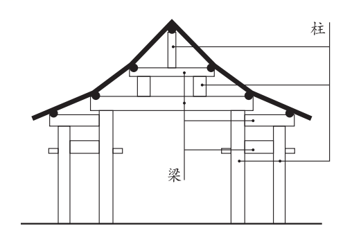

**2024年普通高等学校招生全国统一考试（全国甲卷）**

**语 文**

**使用地区：四川、宁夏、内蒙古、青海、陕西**

**本试卷满分150分，考试时间150分钟。**

**一、现代文阅读（36分）**

**（一）论述类文本阅读（本题共3小题，9分）**

阅读下面的文字，完成下面小题。

2019年4月23日，习近平主席在会见应邀出席中国人民解放军海军成立70周年多国海军活动的外方代表团团长时指出：“海洋对于人类社会生存和发展具有重要意义。海洋孕育了生命、联通了世界、促进了发展。我们人类居住的这个蓝色星球，不是被海洋分割成了各个孤岛，而是被海洋连结成了命运共同体，各国人民安危与共。”作为“人类命运共同体”的重要组成部分，海洋命运共同体的建设目标是打造一个持久和平、普遍安全、共同繁荣、开放包容、清洁美丽的海洋环境。

要实现海洋的持久和平与普遍安全，各国必须摒弃传统的大国争霸思路，充分照顾彼此的安全关切和合理利益，联合起来打击海盗、人口走私、贩毒等海上犯罪行为，在涉及海洋权益争端时通过友好协商的方式来解决问题，短期内无法协商的问题可以考虑搁置争议。共同繁荣、开放包容和清洁美丽的愿景意味着，我们要坚持开放的自由贸易体系，同时共同应对气候变化、海洋环境保护等问题，发挥海洋作为国际贸易大通道的积极作用，关注发展中国家的发展诉求。随着人类技术水平的提升和各国经济发展对资源需求的日益增加，各国都希望开发利用更多的海洋资源。如何才能在更好地利用海洋资源的同时又促进可持续发展、构建海洋命运共同体？习近平总书记提出海洋发展的“四个转变”：“要提高海洋资源开发能力，着力推动海洋经济向质量效益型转变”；“要保护海洋生态环境，着力推动海洋开发方式向循环利用型转变”；“要发展海洋科学技术，着力推动海洋科技向创新引领型转变”；“要维护国家海洋权益，着力推动海洋维权向统筹兼顾型转变”。这为海洋开发利用指明了方向。

具体到全球、地区和双边层面，构建海洋命运共同体应该着眼于不同的路径，这样才更具有可行性。

在全球层面，构建海洋命运共同体主要着眼于涉海全球公共问题的治理，各国应致力于构建更加公正合理、稳定有效的国际法和国际规则体系。目前，发达国家和发展中国家在海洋资源的开发利用方面仍然存在矛盾。发达国家过于强调公海自由原则，希望利用技术上的优势开发更多的公海资源。发展中国家更多强调公海作为人类共同财产的原则。如果公海被确定为人类共同财产，那么它就不得被占有，所有国家共同参加公海管理，积极分享公海开发中获取的利益，并保障公海只用于和平目的。人类共同财产原则更有利于保护公海环境和对海洋资源的可持续开发利用，对于实现持久和平与共同繁荣的愿景来说更为可行。总的来说，全球层面的海洋命运共同体构建，应着眼于建立更加有效的合作制度体系。

在地区和双边层面，由于相关成员在海洋利益方面拥有更多的交集，海洋命运共同体的构建应着眼于以下几个方面：其一，如果某个地区内或者两国间存在海洋权益争端，应该致力于让局势降温，避免引发军事冲突，为海上贸易和人员往来提供安全的环境。地区大国和地区性的安全架构应该在这一方面发挥主要作用。其二，建立高水平的区域经济合作制度，充分发挥海洋作为运输大动脉的作用，提升两国间或者地区内成员国之间的经济交流水平。其三，对两国或者本地区的海洋环境保护开展联合行动，保护海洋资源、打击海上违法犯罪以及联合进行海上搜救等。

（摘编自宋伟《海洋命运共同体构建与新的海洋文明》）

1\. 下列关于原文内容的理解和分析，不正确的一项是（ ）

A. 各国之间可能存在或大或小的海洋权益争端，但这不应妨碍争议各方携手参与海洋命运共同体的构建。

B. 如何在保障人类更好利用海洋资源同时促进可持续发展，这是构建海洋命运共同体需要应对的挑战。

C. 在全球层面，既有的国际法和国际规则体系不够完备，效率不高，也没有建立起相应的合作制度体系。

D. 高水平的区域经济合作制度，有利于发挥海运优势，促进经济交流，是构建海洋命运共同体的一部分。

2\. 下列对原文论证的相关分析，正确的一项是（ ）

A. 文章着眼于人类社会生存和发展，主要论述了海洋命运共同体的建设目标和愿景。

B. 文章用了较大篇幅讨论海洋的发展和生态环保问题，凸显了这些问题的优先性。

C. 第四段对比发达国家和发展中国家的不同主张，以证明公海是人类的共同财产。

D. 文章围绕海洋命运共同体的理念展开，分析问题时注意区分不同的角度和层次。

3\. 根据原文内容，下列说法不正确的一项是（ ）

A. 传统的大国争霸思路更多关注本国利益，容易引发海洋地缘纷争，威胁海洋安全。

B. 构建海洋命运共同体，应当从地区和双边逐步推广至全球，这样才更有可行性。

C. 人类共同财产的原则并不反对公海资源开发，也不谋求任何国家权益的优先性。

D. 在海洋命运共同体的构建中，地区大国和地区性的安全架构理应发挥更大的作用。

【答案】1. C 2. D

3\. B

【解析】

【1题详解】

本题考查学生对原文内容理解和分析能力。

C.“既有的国际法和国际规则体系不够完备，效率不高，也没有建立起相应的合作制度体系”错误。原文提到的是“在全球层面，构建海洋命运共同体主要着眼于涉海全球公共问题的治理，各国应致力于构建更加公正合理、稳定有效的国际法和国际规则体系”“总的来说，全球层面的海洋命运共同体构建，应着眼于建立更加有效的合作制度体系”，可见并没有说现有的体系不够完备，效率不高，也没有提到没有建立起相应的合作制度体系，只是强调要“更加公正合理、稳定有效”“更加有效”，选项曲解文意，无中生有。

故选C。

【2题详解】

本题考查学生对原文论证的相关分析能力。

A.“主要论述了海洋命运共同体的建设目标和愿景”错误。文章开头先说明了海洋的重要性，进而提出海洋命运共同体的建设目标，而正文主体部分主要论证的是如何实现目标，也就是构建海洋命运共同体的着眼点，即怎么做的问题，可见主要论述的并非海洋命运共同体的建设目标和愿景。

B.“凸显了这些问题的优先性”错误。选项中的“这些”指“海洋的发展和生态环保问题”，讨论的目的在于引出解决问题的方法，即“如何才能在更好地利用海洋资源的同时又促进可持续发展、构建海洋命运共同体？”可见并非“凸显了这些问题的优先性”，理解偏颇，曲解文意。

C.“以证明公海是人类的共同财产”错误。第四段对比发达国家和发展中国家的不同主张，是为了得出“人类共同财产原则更有利于保护公海环境和对海洋资源的可持续开发利用，对于实现持久和平与共同繁荣的愿景来说更为可行”，进而归结到：全球层面的海洋命运共同体构建，应着眼于建立更加有效的合作制度体系。

故选D。

【3题详解】

本题考查学生理解作者观点态度并进行合理推断的能力。

B.“应当从地区和双边逐步推广至全球，这样才更有可行性”错误。倒数第三段说“具体到全球、地区和双边层面，构建海洋命运共同体应该着眼于不同的路径，这样才更具有可行性”，选项偷换信息，“这样”指代对象不同，文中可行性的内容并非“从地区和双边逐步推广至全球”，且结合后数三段分析“全球层面”“地区和双边层面”为平行并列关系，而不是“从地区和双边逐步推广至全球”，选项曲解文意。

故选B。

**（二）实用类文本阅读（本题共3小题，12分）**

阅读下面的文字，完成下面小题。

“偷梁换柱”多指以假代真，用欺骗的手段改变事物的性质，然而在古建筑工程领域，“偷梁换柱”却属于一种科学实用的修缮加固方法。

梁是截面形状一般为长方形的木料，且木料的长度尺寸远大于截面尺寸。梁为水平放置，两端的底部有支撑构件。梁主要用于承担建筑上部构件及屋顶的全部重量，并把这些重量向下传给支撑构件。柱为梁的支撑构件。柱子截面形状一般为圆形，长度尺寸远大于截面直径。柱子为竖向放置，主要用于承担上部梁传来的重量，并向下传递给下部的梁或直接传至地面。梁与柱采用榫卯形式连接，形成稳固的大木结构体系。位于屋架内的若干梁在竖向被层层往上“抬”，上下梁之间由短柱支撑，底部的梁由立于地面的立柱支撑。梁、柱均为中国木结构古建筑的核心受力、传力构件，缺一不可。

对于古建筑而言，立于地面的立柱，或因长期承受上部结构传来的重量而产生开裂残损，或因柱底部位长期受到地面潮气影响而出现糟朽残损，这导致木柱强度下降，无法正常支撑梁。此时可采用“偷梁换柱”的加固方法。“偷梁换柱”实际就是“托梁换柱”。其基本做法为：首先将“假柱”（即临时的竖向支撑构件）安装在梁底部、原柱（原有立柱）旁边；再抽去原柱，使梁传来的重量暂时由“假柱”承担；然后安装新柱，新柱的材料、尺寸及安装位置与原有立柱相同；最后将“假柱”移去。

完善的“偷梁换柱”加固方法具有科学性，其原理主要包括三个方面：其一，从梁的角度而言，它是水平受力构件，并把外力向下传给立柱。梁只有保持水平稳定状态，才能保证整个大木结构的稳定。在加固古建筑的过程中，梁始终受到支托，因而能一直保持水平稳定状态。其二，从柱的角度而言，它是竖向支撑构件，并最终把上部构件的重量传给地基。只有立柱具有充足的承载力，且与梁有可靠连接时，才能有效承担梁传来的作用力。加固过程中，技术人员虽然将原柱抽去，但是预先将“假柱”设置于原柱附近，让“假柱”代替原柱发挥支撑作用，因而换柱过程对结构整体的稳定基本无影响。换柱完成后，新柱与原柱有着同样的材料、尺寸，且与梁有着相同的可靠连接方式，它完全能够代替原柱发挥支撑作用。其三，从梁、柱整体结构角度而言，“偷梁换柱”方法对整体结构干扰小，且能达到良好的加固效果：原柱被新柱原位替换，新柱不仅有很好的支撑作用，而且与梁仍有可靠连接；“假柱”仅用于加固过程的临时支撑，且在原柱撤去后新柱安装前，能够与梁临时组成稳定的结构体系。因此，在“偷梁换柱”过程中，梁、柱结构整体始终处于稳定状态。

中国古建筑大木构架剖面示意图

（摘编自周乾《故宫建筑细探》）

4\. 下列对原文相关内容的理解和分析，不正确的一项是（ ）

A. “偷梁换柱”这一成语在现今的使用中多含有贬义的色彩，但在古建筑工程领域，它是指一种修缮加固的科学方法，完全没有贬义。

B. 中国古建筑大木构架剖面示意图展示了几种不同位置、不同尺寸的柱，这些柱子中，立于地面的立柱比较容易发生糟朽残损的情况。

C. 结合图文可以发现，屋顶的重量由上层柱承担，然后传给梁，再由梁传递给其下的短柱，依次向下传递，最终由底部的立柱传至地面。

D. “偷梁换柱”的加固方法包括托梁、抽柱、换柱等步骤，在每一个步骤中梁一直会得到很好的支撑，从而始终能够保持水平稳定状态。

5\. 请根据原文内容，在下面文段的横线处补写出恰当的词语。

工程实例：故宫太和殿是我国最大的木构大殿，明清两代帝王即位或节日庆典都在此举行。2004年，技术人员在对太和殿进行勘查时，发现有一根立柱下部三分之一的位置出现了严重糟朽，于是采取了“偷梁换柱”的方法对该立柱进行加固。具体过程如下：先使用“假柱”托住原柱上部的梁。“假柱”为完好的木料，被安装在\_\_\_\_\_\_\_\_\_附近，用于临时支撑梁。再把柱子底部糟朽部分抽去，以便用\_\_\_\_\_\_\_\_\_代替。原柱糟朽部分去掉后，剩余的部分做成巴掌形，与新柱搭接。新柱与被抽去的糟朽部分同材料、同形状、同尺寸，且顶部亦做成巴掌榫形状。最后再把\_\_\_\_\_\_\_\_\_拆除，即完成了原有立柱的加固。

6\. 清代的古籍中有另一种“偷梁换柱”的记载：当某根立柱损坏需要更换时，为节省工料，工匠只是在原柱旁边设一根新柱，再撤去原柱。为什么第2题“工程实例”中，太和殿修缮没有采用这种更简便的加固方式呢？请简要分析。

【答案】4. C 5. ①. 原柱 ②. 新柱 ③. 假柱

6\. ①新柱如果没有原位替换原柱，可能会改变建筑原结构的受力和传力方式，影响整体的稳定性；

②太和殿是中国最大的木构大殿，建造之初工匠们应该经过了精心的测量，原位替换才是最佳的解决方案；

③太和殿的修缮加固追求最大程度地保持文物原貌，节省工料不是优先考虑的因素。

【解析】

【4题详解】

本题考查学生理解、分析文章内容和理解图表的能力。

C.“屋顶重量由上层柱承担，然后传给梁”错误，原文第二段“梁为水平放置”“梁主要用于承担建筑上部构件及屋顶的全部重量，并把这些重量向下传给支撑构件”，示意图中线条指示的横着的木料是“梁”，它承担屋顶的全部重量。选项受力、传力分析不对。

故选C。

【5题详解】

本题考查学生筛选整合信息、根据文本信息进行判断推理和情境补写的能力。

试题以故宫太和殿的修缮工程实例为题面，要求学生在理解“偷梁换柱”全过程，尤其是原柱、“假柱”、新柱三者关系的基础上，补写空缺内容。

题干中“具体过程如下”可对应材料第三段的“其基本做法为……”。

第①处，“被安装在……附近”，对应材料的“首先将‘假柱’（即临时的竖向支撑构件）安装在梁底部、原柱（原有立柱）旁边”或第四段“预先将‘假柱’设置于原柱附近”，“附近”与“旁边”意思相近，故填“原柱”。

第②处，“以便用……代替”，对应“使梁传来的重量暂时由‘假柱’承担；然后安装新柱，新柱的材料、尺寸及安装位置与原有立柱相同”或第四段“原柱被新柱原位替换”，“假柱”只是代替原柱发挥支撑作用，真正用于替换的应该是“新柱”，故填“新柱”。

第③处，“最后再把……拆除”，对应“最后将‘假柱’移去”，“假柱”的引号不能删除，因为表示特定称谓，故填“‘假柱’”。

【6题详解】

本题考查学生筛选并整合信息、根据文本信息进行判断推理的能力。

题干中的方法“更简便”，但是由材料和上一题的信息可知：完善的“偷梁换柱”加固方法具有科学性。

首先，从受力分析角度看，原文第四段从三个角度“从梁的角度而言……保证整个大木结构的稳定”“从柱的角度而言……对结构整体的稳定基本无影响”“从梁、柱整体结构角度而言……组成稳定的结构体系”，进行受力、传力分析，得出：原位替换可以保证整体的稳定性。

其次，从工匠精神的“精益求精”追求看，上一题的材料中指出“故宫太和殿是我国最大的木构大殿，明清两代帝王即位或节日庆典都在此举行”，大殿设计、建造之初，必定组织大量能工巧匠进行了精心的设计、测量等工作，原位替换更符合整体设计，因而是最佳修缮方案。

最后，从修缮原则、文物保护角度看，“修旧如故”，不追求节省工料，而应尽可能地保持其原有历史形态和特征，以尊重和保护其历史价值和文化意义。上一题的材料中，在修缮时将“原柱糟朽部分去掉后，剩余的部分做成巴掌形，与新柱搭接。新柱与被抽去的糟朽部分同材料、同形状、同尺寸，且顶部亦做成巴掌榫形状”，这样能够最大程度地保持文物原貌，

该题不要求学生作答面面俱到，只要回答出两点即可。如果有其他的答案，言之成理亦可。

**（三）文学类文本同读（本题共3小题，15分）**

阅读下面的文学。完成下面小题。

**霜降夜**

周蓬桦

白露过后，乌乡的风里就已平添了寒意。早晨醒来，阳光刺眼，推开栅门，发现脚下的草叶上布满晶莹的霜，薄簿的一层，把路边的花打蔫，桦树的枝条似乎萧条了些许，树木上的一只只眼睛长出了睫毛，无意间仰头，但见几粒寒星正在向山顶以南的方向悄悄隐逝。镇上某一户人家屋顶上的烟囱，已经开始忙活，突突地冒青烟，烟柱是笔直的，上升到一米多高后遇到了风，才变得凌乱，像一块被抽断的丝绸。

有人说，乌乡的风里，流动着一股特别的味道，也只有亲临现场的人才会知道。这种特别的味道让人难忘，在鼻间萦绕，以至于割舍不下，成了人们再来乌乡的理由。

我提着满满一大铁桶草木灰，把它们倾倒在大路边潮湿的水洼里——这是房东阿姨安排给我的任务。昨天晚上，我约了几个养桑蚕与种植薰衣草的农户，到院子里攀谈，大家吃着草原黄膘烤牛肉，品尝着新摘的巨峰葡萄，黑色的冻梨，喝着自酿的桑葚酒，交谈内容涉猎宽泛，没有明确的主题。基本围绕农事收成，动物保护和挖掘过冬的地窖打转。当然，我最感兴趣的，是他们讲述过往亲身经历的事件。兴许口吻轻描淡写，但对我十分有用。一些亮点像阵雨打湿心头，渗入静夜植物的根须，我急忙拿出记事本，在马灯的光线下一一做了记录。牛圈在屋后，小牛犊不时制造一点骚动，从那里飘来丝丝淡淡的尿臊气，但这并没影响大家浓厚的谈兴。叶子稀疏的板栗树梢上，始终挑着一弯残月。

聊到10点多钟时，霜降开始了，夜幕陡然拉向纵深，只听得周围的芦苇秆在瑟瑟作响，白桦树枝在轻轻蠕动，我身上很快起了一层细小的鸡皮疙瘩。这时，善良的房东阿姨送来了羊毛毯和羊毛披肩，以抵抗霜降带来的微妙变化。

“天要落露了，大伙儿小心着凉。”她说。

阿姨端来一小筐被冰冻过的无花果，果子个头大，已经在冰柜里冻成了一个个小冰球，阿姨从厨房提来了铁皮桶，点燃了软草和木柴。很快就将冻浆果烤软了，冰渣子化成了水，杂糅着果实的汁液。取一个放在嘴里，觉得冻过后的无花果有一股山柿饼的味道。少顷，桌上又摆满了甜点美食——大列巴面包、哈尔滨红肠、咖啡、奶茶、干果仁，还有烤得香喷喷的草原红糖焙子，吃得大家直打饱嗝。

这是一个特别的霜降夜，让人感觉到生命与节气之间发生了某种密切的联系，有很强烈的体验感，从这个夜晚起始，我正式走进乌乡人的生活，自此与之呼吸同一种空气，吃一锅同样的黑米乌饭，喝新碾的大碴子粥，我并不觉得我与乌乡的人和动物有什么不同。我们是对等的。他们在日子艰辛面前所持有的积极态度，和对幸福目标的追寻姿态，都让我感同身受，嘘唏或喜悦。如果可能，我愿意做乌乡山野中的一株树或一片霜冻的叶子。

我还记下了燃烧时呲呲作响的松油灯，灯下的笑脸，火光中明亮的瞳仁，以及整整一个晚上都在谈论的接地气的话题——如何与枯草丛中的野物们一道，度过暴风雪即将来临的严冬，需要粮食、木柴、胡萝卜和大白菜，需要棉衣棉被，需要一个大火炉。哟，对我这样长年奔波的外乡人来说，这是一个多么难忘的夜晚。

早晨的光线重叠移动，越升越高，把山脉的阴影投射到地面上。我手扶栅栏，将空空的铁皮桶放回到了板栗树下，却见房东阿姨的小儿子背了行囊，走下台阶，似乎要离乡远行。阿姨从灶间走出来，腰间系着粗布白围裙。她搓着手，一边抬手拭泪，脸上难掩担忧和凄惶的表情。

她的小儿子目光淡定，飞快地走出院落，又回过头来朝我们挥手笑笑，然后大步踩过路边的草木灰，在阳光下缩小成一个移动的墨点，在远山的背景下渐渐消失。返回屋内，我以树墩做书案，在稿纸上飞快地记下一句话：“霜降后，一些植物枯萎，一些事物到来，一些人又把双脚踩在了泥泞的路上。”

（有删改）

7\. 下列对文本相关内容和艺术特色的分析鉴赏，不正确的一项是（ ）

A. 文章第一段写乌乡的清晨，作者感受着风与光，视线从脚下草、身边树，推展至天际寒星，再收回到农家炊烟，心情和笔触都从容舒缓。

B. 霜降夜攀谈中，作者感觉到“一些亮点像阵雨打湿心头，渗入静夜植物的根须”，既实写外在景致的变动，又虚写心中灵感的滋生。

C. 霜降夜的柴草烤软了冻果，次晨草木灰被倾倒在路边水洼，一个年轻人踩过草木灰离家远行，这些点滴细节都带有乌乡生活的温度。

D. 本文不仅记录了作者本人在乌乡小住的感受，还提及不少与当地生活息息相关的话题，如农事收成、动物保护等，侧面反映了乡村的发展。

8\. 如何理解文章最后作者记下的那句话？

9\. 乌乡霜降夜，作者“感觉到生命与节气之间发生了某种密切的联系，有很强烈的体验感”，文章是从哪些方面来抒写这种体验感的？请简要分析。

【答案】7. D 8. ①面对生活的困境，有人经不起打击而败退，有人则迎难而上，开始了新生；②虽然前行艰难，但也要凭借坚韧和勇气勇敢踏上征程，寻找属于自己的新生活；③此句表达了作者在乌乡霜降夜的所见所感，表达了对生命坚韧精神的深刻理解，对乌乡人的赞美。

9\. ①自然景象的描写中渗透着独特的生命感受：文章开头描写了乌乡清晨的霜景，草叶上的霜、萧条的桦树、寒星的隐逝、农家炊烟等细节，写出了霜降节气中自然的变化；通过写作者感受到风中对的含义，闻得到风中独特的味道，写出了生命的独特感受。②人与自然的互动：作者与农户们在院子里攀谈、品尝当地食物，展示了人与自然的密切联系；作者还写了霜降夜的景物变化与感受到的寒意，写了房东阿姨送毯子，谈论过冬的准备等细节，展现了乌乡人对节气的重视以及应对节气的方法，写出人与节气之间密切的关联。③情感的共鸣：作者在霜降夜中感受到乌乡人对生活的积极态度和对幸福的追求，产生了强烈的情感共鸣。特别是最后看到房东阿姨的小儿子离乡远行，作者感受到生命的流动和时间的变迁，进一步深化了对生命与节气之间联系的体验。

【解析】

【7题详解】

本题考查学生对文本艺术特色的分析鉴赏能力。

D.“侧面反映了乡村的发展”错，文章主要记录了作者在乌乡的感受和体验，虽然提及了一些与当地生活相关的话题，但并没有反映乡村的发展，主要是表现乌乡特有的自然风光、生活习俗和人情特点。

故选D。

【8题详解】

本题考查学生理解重要句子含义的能力。

这句话是作者在乌乡小住之后的人生感悟。

“霜降”代表着生活中的困境；“植物枯萎”象征着生命的衰退和结束，象征着那些经不起打击而被击败的人和事物；“一些事物到来”则象征着新的开始和希望，代表着经受住打击的人或事物迎来新生，开始新生活；

“一些人又把双脚踩在了泥泞的路上”，“泥泞”代表前路坎坷不易，而“把双脚踩在了泥泞的路上”象征着前行的艰辛和不易，但也体现了人们在困境中前行的坚韧和勇气，正如房东阿姨的小儿子，毅然背起行囊离家远行，去追寻属于自己的生活。

此句表达了作者在乌乡霜降夜的所见所感，表达了对生命坚韧精神的深刻理解，对乌乡人的赞美。

【9题详解】

本题考查学生理解文章内容，多角度探究作品意蕴的能力。

自然景象的描写中渗透着独特的生命感受：文章描写了乌乡清晨的霜景，草叶上的霜、被霜打蔫的花、枝条萧条的桦树、悄悄隐逝的寒星、农家屋顶的炊烟，这些自然景观都带有霜降节气的特色；贯穿其中的还有作者的细腻感受，如乌乡白露过后感受到的寒意，“白露过后，乌乡的风里就已平添了寒意”；还有乌乡风中特别的味道，“这种特别的味道让人难忘，在鼻间萦绕，以至于割舍不下，成了人们再来乌乡的理由”。

人与自然的互动：作者描写了霜降夜与农户们在院子里攀谈、品尝当地食物，“大家吃着草原黄膘烤牛肉，品尝着新摘的巨峰葡萄，黑色的冻梨，喝着自酿的桑葚酒”“阿姨端来一小筐被冰冻过的无花果，果子个头大，已经在冰柜里冻成了一个个小冰球”，这些都是秋天特有的食物，体现了人与自然的密切关联；此外，作者还写了霜降夜的景物变化与感受到的寒意，“霜降开始了，夜幕陡然拉向纵深，只听得周围的芦苇秆在瑟瑟作响，白桦树枝在轻轻蠕动，我身上很快起了一层细小的鸡皮疙瘩”，写了房东阿姨送毯子，“善良的房东阿姨送来了羊毛毯和羊毛披肩，以抵抗霜降带来的微妙变化”；还写了谈论过冬的准备等细节，“如何与枯草丛中的野物们一道，度过暴风雪即将来临的严冬，需要粮食、木柴、胡萝卜和大白菜，需要棉衣棉被，需要一个大火炉”，展现了乌乡人对节气的重视以及应对节气的方法，写出人与节气之间密切的关联。

情感的共鸣：作者在霜降夜中感受到乌乡人对生活的积极态度和对幸福的追求，产生了强烈的情感共鸣，“他们在日子艰辛面前所持有的积极态度，和对幸福目标的追寻姿态，都让我感同身受，嘘唏或喜悦”。特别是最后看到房东阿姨的小儿子离乡远行，“她的小儿子目光淡定，飞快地走出院落，又回过头来朝我们挥手笑笑，然后大步踩过路边的草木灰，在阳光下缩小成一个移动的墨点，在远山的背景下渐渐消失”，作者感受到生命的流动和时间的变迁，进一步深化了对生命与节气之间联系的体验。

通过这些方面的描写，文章生动地抒写了作者在乌乡霜降夜的深刻体验感，展现了人与自然、生命与节气之间的密切联系。

**二、古代诗文阅读（34分）**

**（一）文言文阅读（本题共4小题，19分）**

阅读下面的文言文，完成下面小题。

人才莫盛于三国，亦惟三国之主各能用人，故得众力相扶，以成鼎足之势。而其用人亦各有不同者，大概曹操以权术相驭，刘备以性情相契，孙氏兄弟以意气相投。

刘备为吕布所袭奔于操程昱以备有雄才劝操图之。操曰：“今收揽英雄时，杀一人而失天下之心，不可也。”然此犹非与操有怨者。臧霸先从陶谦，后助吕布，布为操所擒，霸藏匿，操募得之，即以霸为琅邪相。先是操在兖州，以徐翕、毛晖为将，兖州乱，翕、晖皆叛，后操定兖州，翕、晖投霸。至是，<u>操使霸出二人，霸曰：“霸所以能自立者，以不为此也。”</u>操叹其贤。盖操当初起时，方欲藉众力以成事，故以此奔走天下。及其削平群雄，势位已定，则孔融、许攸等，皆以嫌忌杀之。荀彧素为操谋主，亦以其阻九锡而胁之死。然后知其雄猜之性久而自露，而从前之度外用人，特出于矫伪，以济一时之用，所谓以权术相驭也。

至刘备，一起事即为人心所向。观其三顾诸葛，咨以大计，独有傅岩爰立之风。关、张、赵云，自少结契，终身奉以周旋，即羁旅奔逃，无寸土可以立业，而数人者患难相随，别无贰志。此固数人者之忠义，而备亦必有深结其隐微而不可解者矣。至托孤于亮，曰：“嗣子可辅，辅之；不可辅，则君自取之。”千载下犹见其肝膈本怀，岂非真性情之流露？亮第一流人，二国俱不能得，备独能得之，亦可见以诚待人之效矣。

至孙氏兄弟之用人，亦自有不可及者。孙策生擒太史慈，即解其缚曰：“子义青州名士，但所托非人耳。孤是卿知己，勿忧不如意也。”此策之得士也。陆逊镇西陵，权刻印置逊所，每与刘禅、诸葛亮书，常过示逊，有不安者，便令改定，以印封行之。委任如此，臣下有不感知遇而竭心力者乎？陆逊晚年为杨竺等所谮，愤郁而死。权后见其子抗，泣曰：“<u>吾前听谗言，与汝父大义不笃，以此负汝。</u>”以人主而自悔其过，开诚告语如此，其谁不感泣？此孙氏兄弟之用人，所谓以意气相感也。

（节选自赵翼《廿二史札记》卷七）

10\. 文中画波浪线的部分有三处需要断句，请用铅笔将答题卡上相应位置的答案标号涂黑。

刘备为吕布A所袭B奔C于操D程昱E以备F有雄才G劝操H图之。

11\. 下列对文中加点的词语及相关内容的解说，不正确的一项是（ ）

A. 藉，凭借、借助，与《陈涉世家》中“藉第令毋斩”的“藉”意思相同。

B. 即，即使，与《桃花源记》中“太守即遣人随其往”的“即”意思不同。

C. 固，固然，与《赤壁赋》中“固一世之雄也，而今安在哉”的“固”意思相同。

D. 但，只是，与《记承天寺夜游》中“但少闲人如吾两人者耳”的“但”意思相同。

12\. 下列对原文有关内容的概述，不正确的一项是（ ）

A. 臧霸曾为吕布效力，曹操擒捉吕布以后，臧霸为避祸藏匿起来；后来他又被曹操捕获，曹操不计前嫌，对他委以重任，任命他为琅邪相。

B. 曹操初起时为图霸业，能笼络人才，甚至能任用曾与己有怨者；势位已定时则猜忌异己，滥杀无辜。这正是其用人“以权术相驭”的表现。

C. 刘备以性情结交忠义之士，以诚待人，故能深得人心；刘备创业过程中多次遭遇挫折，但诸葛亮及关、张、赵云等人患难相随，忠贞不渝。

D. 陆逊镇守西陵时，深得孙权信任，孙权给刘禅、诸葛亮写信，常常给陆逊看，有不妥之处就让他改定；到了晚年，陆逊遭到谗害，郁郁而终。

13\. 把文中画横线的句子翻译成现代汉语。

（1）操使霸出二人，霸曰：“霸所以能自立者，以不为此也。”

（2）吾前听谗言，与汝父大义不笃，以此负汝。

【答案】10. BDG 11. A 12. A

13\. （1）曹操让臧霸交出那两个人，臧霸说：“我之所以能够自立的原因，是因为不做这样的事情。”

（2）我以前听信谗言，与令尊的关系不够深厚，因此辜负了你。

【解析】

【10题详解】

本题考查学生文言文断句的能力。

句意：刘备被吕布袭击后，投奔曹操，程昱认为刘备有雄才，劝曹操图谋除掉他。

“为……所”表被动，“袭”是动词，“刘备为吕布所袭”是一个被动句，所以从“袭”后B处断开；

“奔于操”承接前边主语“刘备”，“奔”是谓语，“操”是宾语，结构完整，所以从“于操”后D处断开；

“以”是“程昱”的谓语，“备有雄才”是宾语，“程昱以备有雄才”句子结构完整，所以从“有雄才”后G处断开。

故选BDG。

【11题详解】

本题考查学生对文言词语中的一词多义现象的理解能力。

A.错误。两个“藉”意思不同。“藉”，凭借、借助；/即使。句意：正是想借助众人的力量成就大业。/即使仅能免于斩刑。

B.正确。即，即使；/立即。句意：即使在颠沛流离、无立足之地时。/太守立即派遣人员跟随他前往。

C.正确。句意：这固然是几人的忠义。/（曹孟德）固然是当世的一位英雄人物，然而现在又在哪里呢？

D.正确。句意：只是所托非人罢了。/只是缺少像我们两个这样清闲的人罢了。

故选A。

【12题详解】

本题考查学生理解文章内容的能力。

A.“后来他又被曹操捕获”理解错误，根据原文“霸藏匿，操募得之，即以霸为琅邪相”可知，臧霸并不是被曹操捕获，而是曹操通过招募的方式找到臧霸，并任命他为琅邪相。

故选A。

【13题详解】

本题考查学生理解并翻译文言文句子的能力。

（1）“出”，交出；“所以”，……的原因；“以”，因为；“……也”，表判断。

（2）“前”，以前；“笃”，深厚；“负”，辜负。

参考译文：

三国时期的人才可谓是最为鼎盛的，这也得益于三国的君主各自善于用人，因此能够汇聚众人的力量，形成三足鼎立的局面。然而，他们用人的方式各有不同。大致来说，曹操是以权术驾驭人，刘备是以性情结交人，孙氏兄弟则是以意气感召人。

刘备被吕布袭击后，投奔曹操，程昱认为刘备有雄才，劝曹操图谋除掉他。曹操说：“现在是收揽英雄的时候，杀一个人会失去天下人的心，这是不可以的。”然而，这还不是与曹操有怨的人。臧霸先是跟随陶谦，后来帮助吕布，吕布被曹操擒获后，臧霸藏匿起来。曹操通过招募的方式找到臧霸，立即任命他为琅邪相。早先，曹操在兖州时，任用徐翕、毛晖为将，兖州发生动乱，徐翕、毛晖都叛变了。后来曹操平定兖州，徐翕、毛晖投奔臧霸。到这时，曹操让臧霸交出那两个人，臧霸说：“我之所以能够自立的原因，是因为不做这样的事情。”曹操叹息他的贤能。曹操当初起事时，正是想借助众人的力量成就大业，所以以此奔走天下。等到他削平群雄，势位已定时，孔融、许攸等人都因嫌忌被杀。荀彧一直是曹操的谋主，也因为阻止曹操接受九锡而被逼死。由此可见，曹操的雄猜之性久而自露，而从前的宽容用人，只是出于权宜之计，以应一时之需，这就是所谓的以权术驾驭人。

至于刘备，一起事就为人心所向。看他三顾茅庐请诸葛亮出山，咨询大计，独有傅岩立贤的风范。关羽、张飞、赵云，自年轻时结交，终身相随，即使在颠沛流离、无立足之地时，这几人也患难与共，毫无二心。这固然是几人的忠义，但刘备也必定有深厚的情感纽带令人不能解开。到托孤于诸葛亮时，刘备说：“嗣子可辅，辅之；不可辅，则君自取之。”千载之下仍能见其肝胆相照，岂不是性情的流露？诸葛亮是第一流的人才，其他两国都不能得到，唯独刘备能得到他，这也可见以诚待人的效果。

至于孙氏兄弟用人，也各自有别人比不了之处。孙策生擒太史慈后，立即解开他的绑缚，说：“子义是青州名士，只是所托非人罢了。我是你的知己，不用担心不如意。”这是孙策得士的表现。陆逊镇守西陵，孙权把印章放在陆逊那里，每次与刘禅、诸葛亮通信，常常给陆逊看，有不妥之处就让他改定，然后盖上印章发出。委任如此，臣下有不感知遇而竭心尽力的吗？陆逊晚年被杨竺等人谗害，愤郁而死。孙权后来见到陆逊的儿子陆抗，哭着说：“我以前听信谗言，与令尊的关系不够深厚，因此辜负了你。”作为君主能自悔其过，像这样开诚布公地告知，谁能不感动流泪呢？这就是孙氏兄弟用人，这就是所说的以意气感人的表现。

**（二）古代诗歌阅读（本题共2小题，9分）**

阅读下面诗歌，回答后面问题。

**次韵钱逊叔泛舟虹桥**①

宋·吕本中

半篙春涨绿平溪，二月江城草色齐。

舟比蜉蝣千顷外，□同斥鷃一枝栖②。

野桥柳线斜风软，曲槛花光夕照低。

却讶探骊人不至③，清樽画航倩分题④。

\[注\]①次韵：依次用所和诗中的韵作诗。②本句首字原缺。③探骊：这里指精通写诗作文。④分题：诗人聚会，分题目而赋诗。

14\. 下列对这首诗的理解和赏析，不正确的一项是（ ）

A. 诗歌开篇写春水、草色，围绕色彩落笔，营造出一种愉悦的情感氛围。

B. 春水新涨，水面辽阔宽广，在波间漂浮的船只显得如同蜉蝣一样细小。

C. 斥鷃见于《庄子·逍遥游》，用来与鹏做对比，因此诗中缺字应是“鹏”。

D. 诗歌的尾联写到了“分题”，以此收束，与题目中的“次韵”形成照应。

15\. 请赏析颈联“野桥柳线斜风软，曲槛花光夕照低”中“软”“低”二字艺术效果。

【答案】14. C 15. “软”字形容斜风的温柔轻柔，营造出宁静和谐的氛围；“低”字描绘夕照的柔和低垂，增强了画面的层次感和诗意，使景象更生动。

【解析】

【14题详解】

本题考查学生对诗歌解读中存在问题进行逻辑判断及对课文内容的理解和分析的能力。

C.“……对比，因此诗中缺字应是‘鹏’”错误，前后不构成因果关系。缺字一句可以有两种解释：一是缺字表示的事物与斥鷃一起栖息在树枝上；二是该事物像斥鷃一样栖息在树枝上。参照上句中的“比”字，后一种理解符合原意的可能性较大。但无论是哪一种理解，缺字都不可能是“鹏”字。鹏与斥鷃是《逍遥游》用来论述“小大之辨”的两个例证，斥鷃是一种小鸟，是可以栖息在树枝之上的；而鹏则庞大得不可思议，它“背若泰山，翼若垂天之云”，无法想象它可以在树枝上栖息。当然，“一枝”也可能是一个比喻，用来表示狭窄的空间，那也同样不是鹏所能栖息的。

故选C。

【15题详解】

本题考查学生鉴赏炼字艺术效果的能力。

用字精当以追求表现力的最大化，是历代文人在文学创作中极为重视的问题，诗歌中尤其如此。本题要求赏析“软”“低”二字的艺术效果，需要学生借助联想和想象品味语言，并把自己的体验和感受用文字表达出来。

“软”字用来形容斜风，传达出春风的温柔和轻柔。斜风拂过野桥上的柳条，柳条随风轻轻摇曳，给人一种柔和、舒适的感觉。这个字不仅描绘了春风的特质，还营造出一种宁静、和谐的氛围，使读者仿佛置身于春日的美景中，感受到春风的温暖和柔情。

“低”字用来形容夕照，描绘了夕阳西下时光线逐渐变低的景象。夕阳的余晖洒在曲折的栏杆和花朵上，光线柔和而低垂，给人一种温馨、宁静的感觉。这个字不仅描绘了夕阳的特质，还增强了画面的层次感和立体感，使整个景象显得更加生动和富有诗意。

通过“软”和“低”两个字，诗人成功地描绘了春日黄昏时分的美丽景象，传达出一种宁静、温柔的氛围。这两个字不仅准确地刻画了自然景物的特征，还增强了诗歌的画面感和感染力，使读者能够身临其境地感受到春日的美好与宁静。

**（三）名篇名句默写（本题共1小题，6分）**

16\. 补写出下列句子中的空缺部分。

> （1）王湾《次北固山下》的名句“\_\_\_\_\_\_\_\_\_\_\_\_，\_\_\_\_\_\_\_\_\_\_\_\_”，描写时序交替中的景物，暗示着时光流逝，蕴含着自然理趣。
>
> （2）小慧为朋友家的农家乐餐厅写宣传横幅，直接使用了陆游《游山西村》里的“\_\_\_\_\_\_\_\_\_\_\_\_，\_\_\_\_\_\_\_\_\_\_\_\_”两句诗，朋友看了觉得很贴切。
>
> （3）行至群山深处，见到一挂瀑布飞泻而下，水石激荡，轰鸣作响。于老师回头对学生们说：“这不就是古诗中写的‘\_\_\_\_\_\_\_\_\_\_\_\_，\_\_\_\_\_\_\_\_\_\_\_\_’嘛！”

【答案】 ①. 海日生残夜 ②. 江春入旧年 ③. 山重水复疑无路 ④. 柳暗花明又一村 ⑤. 飞流直下三千尺 ⑥. 疑是银河落九天（飞湍瀑流争喧豗，砯崖转石万壑雷）

【解析】

【详解】本题考查学生默写常见的名篇名句的能力。

易错字词有：生、暗、喧豗，砯崖、壑。

**三、语言文字运用（20分）**

**（一）语言文字运用Ⅰ（本题共4小题，14分）**

阅读下面的文字，完成下面小题。

天山可谓家喻户晓，但真正了解它的人恐怕不多。怎样算是真正了解天山呢？不妨做个测试。你闭上眼睛，念出“天山”这个名字，试试看，能不能想象出一幅天山的全景图来？在这幅全景图里，山脉或平行或交错，许多巨大的、汽车要开上很久很久的盆地坐落其间。两座威严的雪峰——托木尔峰和汗腾格里峰巍然耸立，俯视着周边十多座海拔6000米以上的山峰。<u>带着充沛的水汽在伊犁河谷一路长驱直入的暖湿气流造就了一片片麦浪滚滚的田地和水草丰美的牧场。</u>博斯腾湖碧水连天，赛里木湖晶莹澄澈，艾比湖“盐”装素裹，天池静卧在苍翠环绕之中……①如果在你的脑海中，②能包罗万象地浮现出这样一幅全景图，③图上呈现了天山的任何山脉、盆地、雪峰，④还有河流、和湖泊，⑤你就算真正了解天山了。

17\. 下列句子中的“要”与文中加点的“要”，意义相同的一项是（ ）

A. 描绘“寒风扫高木”的景况，用“木”字要比用“树”字更合适。

B. 莲花池边有个小酒店，我们走进去，打了半斤酒，还要了些菜。

C. 台儿沟没有学校，香雪每天上学要到十五里以外的公社去。

D. 等枣树的叶子落尽，树上的枣子红完，西北风就要起来了。

18\. 请将文中画横线的部分改成几个较短的语句。可以改变语序、少量增删词语，但不得改变原意。

19\. 下列句子中画波浪线的词语与文中画波浪线的“苍翠”，所用的修辞手法相同的一项是（ ）

A. 烟花向上空冲去，下落时便洒散着满天花雨。

B. 鲁迅先生穿着朴素的长衫，从容地坐在西装领带们旁边。

C. 夏天的雨是热情洋溢的，喜欢不打招呼就前来拜访。

D. 微风过处，送来缕缕清香，仿佛远处高楼上渺茫的歌声似的。

20\. 文中标序号的部分有两处表述不当，请指出其序号并做修改，使语言准确流畅，逻辑严密。不得改变原意。

【答案】17. C 18. 示例（1）：暖湿气流带着充沛的水汽在伊犁河谷一路长驱直入，它造就了一片片麦浪滚滚的田地，以及水草丰美的牧场。

示例（2）：带着充沛水汽的暖湿气流在伊犁河谷一路长驱直入，它造就了一片片麦浪滚滚的田地和水草丰美的牧场。

19\. B 20. 序号②修改为：能浮现出这样一幅包罗万象的全景图；

序号③修改为：图上呈现了天山的所有山脉、雪峰、盆地；

序号④修改为： 还有河流、湖泊（还有河流和湖泊） 。

【解析】

【17题详解】

本题考查学生辨析词语语境义的能力。

文中“要”意思是需要。

A.表示估计，用于比较。

B.讨。表示希望将某种事物归自己所有 。

C.需要。

D.即将来临。

故选C。

【18题详解】

本题考查学生变换句式的能力。

所谓长句一般是修饰限制成分多，或者主语、宾语、谓语部分比较复杂。画线句属于修饰成分多，宾语复杂。

首先确定句子主干，“暖湿气流造就了田地和牧场”，让主干单独成句；

然后把复杂部分按照语法规则加以拆分，比如定语拿出来单独成句，“带着充沛的水汽在伊犁河谷一路长驱直入”，作为句子时需要添加主语“暖湿气流”；

然后强调一下两个宾语的特点，比如“田地里一片片麦浪滚滚”“牧场上水草丰美”；

最后根据逻辑关系组合成包含几个短句的复句，除了参考答案，还可以表述为：带着充沛水汽的暖湿气流在伊犁河谷一路长驱直入，它造就了田地和牧场，田地里一片片麦浪滚滚，牧场上水草丰美。

【19题详解】

本题考查学生辨析修辞手法的能力。

文中“苍翠”属于借代修辞，颜色代树木。

A.比喻修辞，把漫天洒散的烟花比喻成“雨”；

B.借代修辞，用西装领带借指人们；

C.拟人修辞，赋予自然现象“雨”以人的特点“热情洋溢”“喜欢”“打招呼”“拜访”；

D.通感手法，沟通了视听两种感官，把鼻子嗅到的“清香”比喻成耳朵听到的“歌声”。

故选B。

【20题详解】

本题考查学生辨析并修改病句的能力。

序号②语序不当，“浮现”是客观词语，不能用“包罗万象”修饰，应该放在“全景”前。

序号③用词不当，把“任何”删掉或改为“所有”；语序不当，并列词语间应该有视觉顺序，比如由高到低，“盆地” 放在后面，与低处的“河流”“湖泊”能更好地衔接。

序号④成分赘余，有了顿号没必要加“和” ，删掉顿号或“和” 。

**（二）语言文字运用Ⅱ（本题共1小题，6分）**

21\. 下面的文字是一位老奶奶在医院看病时的自述，不够简明扼要，不利于和医生高效沟通。请对这段自述进行缩写。要求：保留必要信息，不超过80个字。

大夫好！今天看病的人太多了，我排了好长时间队才看上。我是你们医院的老病号了，这么多年我的高血压和糖尿病一直是在你们医院看的，好多年前有一次扭伤了脚踝，也是在你们这儿看好的，您可得给我好好看看。是这么回事儿。昨天晚上我老闺女来家里，我们一起吃的晚饭。吃过饭看着电视，我就开始头疼，先是头顶一圈疼，一跳一跳的，后来整个头都疼。我试了很多办法，一会儿躺着，一会儿坐着，大口喘气，戴上帽子捂着，都没有用。闺女要带我来医院，我说天太冷了，明天可能就好了，明天再说吧，然后就睡觉了。今天早上醒了还疼，头也不敢动，一晃就更疼了，就赶紧来医院了。

【答案】大夫好！我是你们医院的老病号，一直在这儿看高血压和糖尿病。昨天晚上吃完饭后开始头疼，先是头顶一圈疼，后来整个头都疼。今天早上醒来仍然头疼，头一动就更疼，所以赶紧来医院了。

【解析】

【详解】本题考查学生提炼概括核心信息、表达准确简明的能力。

首先删除冗余：

排队时间、与医生的寒暄、扭伤脚踝的旧事、与女儿的互动、尝试的无效缓解方法等信息可以压缩掉，比如“今天看病的人太多了，我排了好长时间队才看上”“好多年前有一次扭伤了脚踝，也是在你们这儿看好的，您可得给我好好看看”“我试了很多办法，一会儿躺着，一会儿坐着，大口喘气，戴上帽子捂着，都没有用。闺女要带我来医院，我说天太冷了，明天可能就好了，明天再说吧，然后就睡觉了”，冗长啰嗦，属于多余信息，忽略不计。

然后提炼出有效信息：

（1）由“我是你们医院的老病号了，这么多年……一直是在你们医院看的”提炼出患者身份：老病号，长期在该医院看病。

（2）由“这么多年我的高血压和糖尿病一直是在你们医院看的”提炼出病史信息：高血压和糖尿病。

（3）由“昨天晚上我老闺女来家里，我们一起吃的晚饭。吃过饭看着电视，我就开始头疼”提炼出病痛时间：昨晚开始。

（4）由“先是头顶一圈疼，一跳一跳的，后来整个头都疼”“今天早上醒了还疼，头也不敢动，一晃就更疼了”提炼出症状：头顶一圈疼，后来整个头都疼。今天早上醒来仍然头疼，头一动就更疼；就诊原因：头疼持续未见好转。

最后组织语言：

将关键信息按时间顺序和逻辑关系进行组织，使表达简洁明了，条理清晰。

**四、作文（60分）**

22\. 阅读下面的材料，根据要求写作。

每个人都要学习与他人相处。有时，我们为避免冲突而不愿表达自己的想法。其实，坦诚交流才有可能迎来真正的相遇。

这引发了你怎样的联想和思考？请写一篇文章。

要求：选准角度，确定立意，明确文体，自拟标题；不要套作，不得抄袭；不得泄露个人信息；不少于800字。

【答案】**例文**

**心迹不掩，英雄本色**

现代社会，人际错综，在群体相处的复杂过程中，人们往往为了提高“隐蔽性”、增加安全感而掩藏心迹、力求“大同”，生怕被人看穿自己的“底牌”，拿住自己的“软肋”。其实，一味遮掩闪躲、矫饰趋众并不是缓和矛盾、寻求认同的妙方，唯有率真坦荡、直露心迹，方能彰显个性魅力，吸引同频挚友，赢得社会尊重。

不掩心迹，敢于直陈与众各异的观点、表达独特无二的看法，既不畏惧因成为大众眼中的“少数人”而被视为异类，也不担忧因无法追随主流的脚步而倍觉孤独，即使为时人所讪笑、不解、嘲讽讥刺甚至排斥孤立，仍始终保持独立思考的态度，呵护不易动摇的本心，以敢当千夫所指、无惧踽踽独行的执着刚毅行走于朗朗世间，以不肯随波逐流、拒绝人云亦云的明亮坦荡彰显着大勇大慧。

不掩心迹，乐于袒露不加伪饰的性情、展示多有瑕疵的真我，既不遮掩粉饰并不完美的“黑暗层”、真个性，也不追求浮夸矫造的假“人设”、高“友商”，即使知音寥寥，同行无几，仍始终保存虽有缺陷却不失特色的真面目，怀抱虽感落寞而不改本我的真风骨，以不因寂寥而盲目迎合、不因从众而勉强改变的实言实行对抗一众“假面”，以心口如一的磊落洒脱、率直天真的霁月光风对抗着诸如“守口如瓶，防意如城”之类的人情“箴言”。

不掩心迹之杰出人物，古今皆众。前有“必不堪者七”和“甚不可者二”的嵇康直拒司马政权邀请，“行不为饰，动求真适”的孟浩然直陈胸中“不才明主弃”的郁结之气，声震朝野的“拗相公”王安石直言对京官高职的排斥反感；后有“不要迁就什么，也不要盲目地去追什么潮流”的优客工场创始人毛大庆直评创业心路，“能爬珠穆朗玛干吗还要爬那些小山”的中科院院士颜宁直扬凌云之志……心迹所显，本色所向，英雄之气，难掩行藏。

诚然，寻求群体接纳，渴望社会认同本是人之常情，隐藏真实想法、力求避免冲突的处世态度并非不可理解。但若是人人都掩藏心迹，不愿坦诚，交接之间含糊其辞、虚与委蛇，唯恐自己的“全抛一片心”碰上了对方的“且说三分话”， 生怕首先暴露了自己的真实态度、客观情绪而丧失主动权，如此，人与人之间的温情善意、赤诚真挚将不复存在，人们将永远保持着所谓的“安全距离”而无法触碰彼此的灵魂，永远受困于身边的“无效社交”而无法脱离原始的恐惧与孤独。

“唯大英雄能本色，是真名士自风流。”哼哼哈哈、遮遮掩掩并非润滑人际、左右逢源的“万金油”，直率天然、简单澄澈方为提升格局、收获美满的“强心针”。不掩心迹，方显英雄本色，展露真我，笑迎盛放人生。

【解析】

【详解】本题考查学生写作的能力。

**审题：**

这是一道引语式材料作文题。

材料意在引导青少年形成健康正向的人际交往理念，关键句“坦诚交流才有可能遇到真正的相遇”直接指明中心论点和写作方向，把握住“坦诚交流”一词，则易进行文章构思。

与他人相处时，不愿表达真实想法，因此人云亦云、从众而谈、唯唯诺诺，无非出于寻求群体、避免矛盾、保护自我的心理，固然能暂时起到润滑关系、规避冲突的作用，但长此以往，则会使人丧失个性，面目模糊，看似左右逢源，实则孤独自苦，既无法培养起勇敢表达、直抒己见的能力，也错过与同频的朋友交流、相知的良机。

坦诚交流，既可以勾勒真实自我，让群体认识、了解自己，更能够吸引到认同、欣赏自己的“同类”，在共性的基础上建立起牢固真实的友情；既可以摆脱虚言矫饰的疲惫，克服怕做“异类”、怕成“孤岛”的畏缩情绪，更能以我口说我心的姿态消除他人对自己的假性印象，释放由持续掩饰伪装带来的精神压力；既是一种不惧发声、敢于袒露的胆量、勇气，更是一种磊落洒脱、质朴天然的人生态度。总之，唯有坦诚交流，适合的机会、同质的朋友、应得的利益、独特的魅力……才会和自己有一场“真正的相遇”。

写作时，可以先明确提出论点——“坦诚交流”，然后分别从坦诚能够吸引真正的朋友、赢得应有的尊重，能够培养磊落的品行、锻炼坚韧的心志等方面进行论述；再从反方面假设人人都戴上面具、不肯坦诚，将会对人际关系造成怎样的打击、对和谐社会造成怎样的破坏；接下来联系实际，适当批驳现代社会中某些提倡“圆稳”、曲解“中庸”的乱象；最后总结观点，收束全文。

**立意：**

1.率真为人，英雄本色。

2.展露真我，不敛锋芒。

3.坦以承己，诚以待人。

4.袒露心迹，同向而行。
